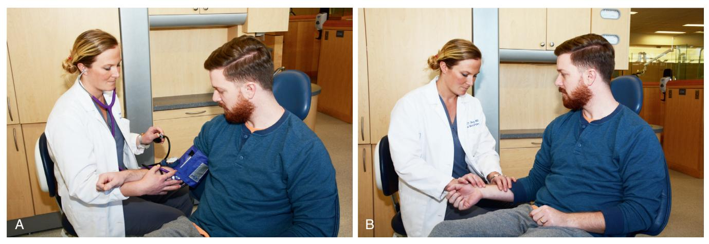
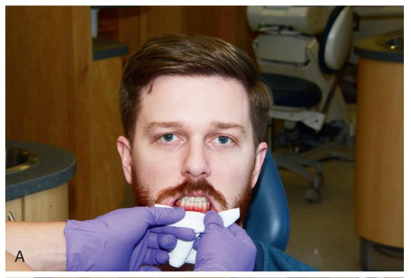
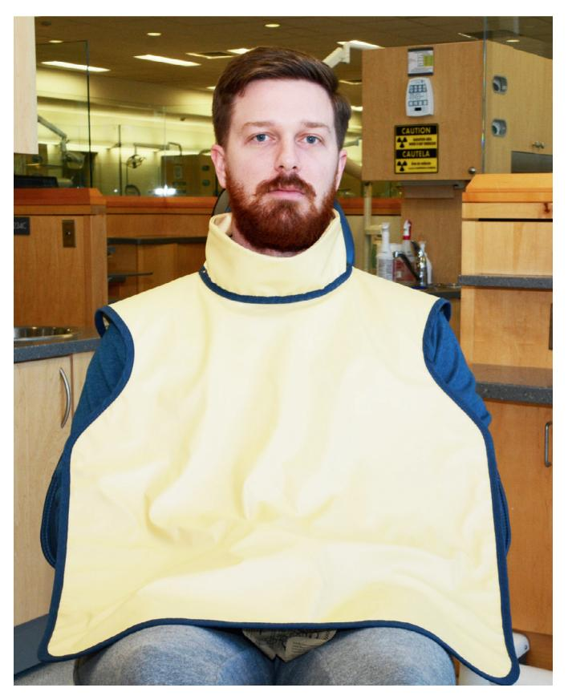

# Preoperative Health Status Evaluation

JAMES R. HUPP AND ALISON YEUNG

### CHAPTER OUTLINE

#### Medical History, 2

Biographic Data, 3 Chief Complaint, 3 History of Chief Complaint, 3 Medical History, 3 Review of Systems, 6

#### Physical Examination, 6

Management of Patients With Compromising Medical Conditions, 8 Cardiovascular Problems, 8 Ischemic Heart Disease, 8 Cerebrovascular Accident (Stroke), 10 Dysrhythmias, 10 Heart Abnormalities That Predispose to Infective Endocarditis, 10 Congestive Heart Failure (Hypertrophic Cardiomyopathy), 10 Pulmonary Problems, 11 Asthma, 11 Chronic Obstructive Pulmonary Disease, 12 Renal Problems, 12 Renal Failure, 12 Renal Transplantation and Transplantation of Other Organs, 12 Hypertension, 13 Hepatic Disorders, 13 Endocrine Disorders, 13 Diabetes Mellitus, 13 Adrenal Insufficiency, 15 Hyperthyroidism, 15 Hypothyroidism, 15 Hematologic Problems, 15 Hereditary Coagulopathies, 15 Therapeutic Anticoagulation, 16 Neurologic Disorders, 17 Seizure Disorders, 17 Ethanolism (Alcoholism), 17

# Management of Patients During and After Pregnancy, 17 Pregnancy, 17 Postpartum, 19

The extent of the medical history, physical examination, and laboratory evaluation of patients requiring outpatient dentoalveolar surgery, under local anesthesia, nitrous oxide sedation, or both, differs substantially from that necessary for a patient requiring hospital admission and general anesthesia for surgical procedures. A patient's primary care physician typically performs periodic comprehensive history taking and physical examination of patients; it is therefore impractical and of little value for the dentist to duplicate this process. However, the dental professional must discover the presence or history of medical problems that may affect the safe delivery of the care she or he plans to provide, as well as any conditions specifically affecting the health of the oral and maxillofacial regions. This is particularly true for patients for which dentoalveolar surgery is planned. This is due to several factors such as the added physical stress surgery patient experience, the creation of a bleeding wound that then needs to heal, the invasive nature of surgery that typically introduces microorganisms into the patients tissues, and the common need for more elaborate pain and anxiety control measures and the use of more potent agents.

Dentists are educated in the basic biomedical sciences and the pathophysiology of common medical problems, particularly as they relate to the maxillofacial region. This special expertise in medical topics as they relate to the oral region makes dentists valuable resources on the community health care delivery team. The responsibility this carries is that dentists must be capable of recognizing and appropriately managing pathologic oral conditions. To maintain this expertise, a dentist must keep informed of new developments in medicine, be vigilant while treating patients, and be prepared to communicate a thorough but succinct evaluation of the oral health of patients to other health care providers.

### **Medical History**

An accurate medical history is the most useful information a clinician can have when deciding whether a patient can safely undergo planned dental therapy. The dentist must be prepared to anticipate how a medical problem or problems might alter a patient's response to planned anesthetic agents and surgery. If the history taking is done well, the physical examination and laboratory evaluation of a patient usually play lesser roles in the presurgical evaluation. The standard format used for recording the results of medical histories and physical examinations is illustrated in Box 1.1. This general format tends to be followed even in electronic medical records.

The medical history interview and the physical examination should be tailored to each patient, taking into consideration the patient's medical problems, age, intelligence, and social

## BOX 1.1 Standard Format for Recording Results of History and Physical Examinations

- 1. Biographic data
- 2. Chief complaint and its history
- 3. Medical history
- 4. Social and family medical histories
- 5. Review of systems
- 6. Physical examination
- 7. Laboratory and imaging results

circumstances; the complexity of the planned procedure; and the anticipated anesthetic methods.

## **Biographic Data**

The first information to obtain from a patient is biographic data. These data include the patient's full name, home address, age, gender, and occupation, as well as the name of the patient's primary care physician. The clinician uses this information, along with an impression of the patient's intelligence and personality, to assess the patient's reliability. This is important because the validity of the medical history provided by the patient depends primarily on the reliability of the patient as a historian. If the identification data and patient interview give the clinician reason to suspect that the medical history may be unreliable, alternative methods of obtaining the necessary information should be tried. A reliability assessment should continue throughout the entire history interview and physical examination, with the interviewer looking for illogical, improbable, or inconsistent patient responses that might suggest the need for corroboration of information.

## **Chief Complaint**

Every patient should be asked to state their chief complaint. This can be accomplished on a form the patient completes, or the patient's answers should be transcribed (preferably verbatim) into the dental record during the initial interview by a staff member or the dentist. This statement helps the clinician establish priorities during history taking and treatment planning. In addition, having patients formulate a chief complaint encourages them to clarify for themselves and the clinician why they desire treatment. Occasionally, a hidden agenda may exist for the patient, consciously or subconsciously. In such circumstances, subsequent information elicited from the patient interview may reveal the true reason the patient seeks care.

## **History of Chief Complaint**

The patient should be asked to describe the history of the present complaint or illness, particularly its first appearance, any changes since its first appearance, and its influence on or by other factors. For example, descriptions of pain should include date of onset, intensity, duration, location, and radiation, as well as factors that worsen and mitigate the pain. In addition, an inquiry should be made about constitutional symptoms such as fever, chills, lethargy, anorexia, malaise, and any weakness associated with the chief complaint.

This portion of the health history may be straightforward, such as a 2-day history of pain and swelling around an erupting third molar. However, the chief complaint may be relatively involved, such as a lengthy history of a painful, nonhealing extraction site

## BOX 1.2 Baseline Health History Database

- 1. Past hospitalizations, operations, traumatic injuries, and serious illnesses
- 2. Recent minor illnesses or symptoms
- 3. Medications currently or recently in use and allergies (particularly drug allergies)
- Description of health-related habits or addictions, such as the use of ethanol, tobacco, and illicit drugs; and the amount and type of daily exercise
- 5. Date and result of last medical checkup or physician visit

in a patient who received therapeutic irradiation. In this more complex case, a more detailed history of the chief complaint is important to obtain.

### **Medical History**

Most dental practitioners find health history forms (questionnaires) to be an efficient means of initially collecting the medical history, whether obtained in writing or in an electronic format. When a credible patient completes a health history form, the dentist can use pertinent answers to direct the interview. Properly trained dental assistants can "red flag" important patient responses on the form (e.g., circling allergies to medications in red or electronically flagging them) to bring positive answers to the dentist's attention.

Health questionnaires should be written clearly, in nontechnical language, and in a concise manner. To lessen the chance of patients giving incomplete or inaccurate responses, and to comply with Health Insurance Portability and Accountability Act regulations, the form should include a statement that assures the patient of the confidentiality of the information and a consent line identifying those individuals the patient approves of having access to the dental record, such as the primary care physician and other clinicians in the practice. The form should also include a way (e.g., a signature line or pad) for the patient to verify that he or she has understood the questions and the accuracy of the answers. Numerous health questionnaires designed for dental patients are available from sources such as the American Dental Association and dental textbooks (Fig. 1.1).

Answers to the items listed in Box 1.2 (collected on a form via touch screen or verbally) help establish a suitable health history database for patients; if the data are collected verbally, subsequent written documentation of the results is important.

In addition to this basic information, it is helpful to inquire specifically about common medical problems that are likely to alter the dental management of the patient. These problems include angina, myocardial infarction (MI), heart murmurs, rheumatic heart disease, bleeding disorders (including anticoagulant use), asthma, chronic lung disease, hepatitis, sexually transmitted infections, diabetes, corticosteroid use, seizure disorder, stroke, and any implanted prosthetic device such as artificial joint or heart valve. Patients should be asked specifically about allergies to local anesthetics, aspirin, and penicillin. Female patients in the appropriate age group must be asked at each visit whether they are or may be pregnant.

A brief family history can be useful and should focus on relevant inherited diseases such as hemophilia (Box 1.3). The medical history should be regularly updated. Many dentists have their assistants specifically ask each patient at checkup appointments whether there has been any change in health since the last dental visit. The

| MEDICAL HISTORY   |            |
|-------------------|------------|
| Name              |            |
| M                 | F          |
| Date of Birth     |            |
| Address           |            |
| Telephone: (Home) | (Work)     |
| Height            | Weight     |
| Today's Date      | Occupation |

Answer all questions by circling either YES or NO and fill in all blank spaces where indicated. Answers to the following questions are for our records only and are confidential.

| 1. My last medical physical examination was on (approximate)                                                |        |
|-------------------------------------------------------------------------------------------------------------|--------|
| 2. The name & address of my personal physician is                                                           |        |
| 3. Are you now under the care of a physician                                                                | YES NO |
| If so, what is the condition being treated?                                                                 |        |
| 4. Have you had any serious illness or operation                                                            | YES NO |
| If so, what was the illness or operation?                                                                   |        |
| 5. Have you been hospitalized within the past 5 years                                                       | YES NO |
| If so, what was the problem?                                                                                |        |
| 6. Do you have or have you had any of the following diseases or problems:                                   |        |
| a. Rheumatic fever or rheumatic heart disease.                                                              | YES NO |
| b. Heart abnormalities present since birth                                                                  | YES NO |
| c. Cardiovascular disease (heart trouble, heart attack, angina, stroke, high blood pressure, heart murmur). | YES NO |
| (1) Do you have pain or pressure in chest upon exertion.                                                    | YES NO |
| (2) Are you ever short of breath after mild exercise.                                                       | YES NO |
| (3) Do your ankles swell.                                                                                   | YES NO |
| (4) Do you get short of breath when you lie down, or do you require extra pillows when you sleep.           | YES NO |
| (5) Have you been told you have a heart murmur.                                                             | YES NO |
| d. Asthma or hay fever                                                                                      | YES NO |
| e. Hives or a skin rash                                                                                     | YES NO |
| f. Fainting spells or seizures.                                                                             | YES NO |
| g. Diabetes.                                                                                                | YES NO |
| (1) Do you have to urinate (pass water) more than six times a day                                           | YES NO |
| (2) Are you thirsty much of the time                                                                        | YES NO |
| (3) Does your mouth usually feel dry.                                                                       | YES NO |
| h. Hepatitis, jaundice or liver disease.                                                                    | YES NO |
| i. Arthritis or other joint problems.                                                                       | YES NO |
| j. Stomach ulcers.                                                                                          | YES NO |
| k. Kidney trouble.                                                                                          | YES NO |
| l. Tuberculosis.                                                                                            | YES NO |
| m. Do you have a persistent cough or cough up blood.                                                        | YES NO |
| n. Venereal disease.                                                                                        | YES NO |
| o. Other (list)                                                                                             |        |
| 7. Have you had abnormal bleeding associated with previous extractions, surgery, or trauma                  | YES NO |
| a. Do you bruise easily.                                                                                    | YES NO |
| b. Have you ever required a blood transfusion                                                               | YES NO |
| c. If so, explain the circumstances                                                                         |        |
| 8. Do you have any blood disorder such as anemia, including sickle cell anemia.                             | YES NO |
| 9. Have you had surgery or radiation treatment for a tumor, cancer, or other condition of your head or neck | YES NO |

• Fig. 1.1 Example of health history questionnaire useful for screening dental patients. (Modified from a form provided by the American Dental Association.)

| MEDICAL HISTORY—cont'd                                                                                                                                                                                                                                                                                                                                                                                                                                                                                                                                                                                                     |                                                                    |                                                          |  |  |
|----------------------------------------------------------------------------------------------------------------------------------------------------------------------------------------------------------------------------------------------------------------------------------------------------------------------------------------------------------------------------------------------------------------------------------------------------------------------------------------------------------------------------------------------------------------------------------------------------------------------------|--------------------------------------------------------------------|----------------------------------------------------------|--|--|
| 10. Are you taking any drug or medicine or herb                                                                                                                                                                                                                                                                                                                                                                                                                                                                                                                                                                            | YES                                                                | NO                                                       |  |  |
| <ul> <li>11. Are you taking any of the following: <ul> <li>a. Antibiotics or sulfa drugs</li> <li>b. Anticoagulants (blood thinners).</li> <li>c. Medicine for high blood pressure.</li> <li>d. Cortisone (steroids) (including prednisone).</li> <li>e. Tranquilizers.</li> <li>f. Aspirin.</li> <li>g. Insulin, tolbutamide (Orinase) or similar drug for diabetes</li> <li>h. Digitalis or drugs for heart trouble.</li> <li>i. Nitroglycerin.</li> <li>j. Antihistamine</li> <li>k. Oral birth control drug or other hormonal therapy.</li> <li>l. Medicines for osteoporosis.</li> <li>m.Other</li> </ul> </li> </ul> | YES YES YES YES YES YES YES YES YES YES | NO NO NO NO NO NO NO NO NO NO |  |  |
| 12. Are you allergic or have you reacted adversely to:         a. Local anesthetics (procaine [Novocain]).         b. Penicillin or other antibiotics.         c. Sulfa drugs.         d. Aspirin.         e. lodine or x-ray dyes.         f. Codeine or other narcotics.         g. Other                                                                                                                                                                                                                                                                                                                                | YES YES YES YES YES YES YES                      | NO NO NO NO NO                               |  |  |
| 13. Have you had any serious trouble associated with any previous dental treatment                                                                                                                                                                                                                                                                                                                                                                                                                                                                                                                                         | YES                                                                | NO                                                       |  |  |
| 14. Do you have any disease, condition, or problem not listed above that you think I should know about                                                                                                                                                                                                                                                                                                                                                                                                                                                                                                                     | — YES —                                                      | NO                                                       |  |  |
| 15. Are you employed in any situation which exposes you regularly to x-rays or other ionizing radiation                                                                                                                                                                                                                                                                                                                                                                                                                                                                                                                    | — YES                                                           | NO                                                       |  |  |
| 16. Are you wearing contact lenses                                                                                                                                                                                                                                                                                                                                                                                                                                                                                                                                                                                         | YES                                                                | NO                                                       |  |  |
| WOMEN: 17. Are you pregnant or have you recently missed a menstrual period                                                                                                                                                                                                                                                                                                                                                                                                                                                                                                                                              | YES                                                                | NO                                                       |  |  |
| 18. Are you presently breast-feeding                                                                                                                                                                                                                                                                                                                                                                                                                                                                                                                                                                                       | YES                                                                | NO                                                       |  |  |
| Chief dental complaint (Why did you come to the office today?):                                                                                                                                                                                                                                                                                                                                                                                                                                                                                                                                                            |                                                                    |                                                          |  |  |
|                                                                                                                                                                                                                                                                                                                                                                                                                                                                                                                                                                                                                            | _                                                                  |                                                          |  |  |
|                                                                                                                                                                                                                                                                                                                                                                                                                                                                                                                                                                                                                            |                                                                    |                                                          |  |  |
| Signature of Patient (verifying accurate of historical information)                                                                                                                                                                                                                                                                                                                                                                                                                                                                                                                                                        | _ >у                                                            |                                                          |  |  |
| Signature of Dentist                                                                                                                                                                                                                                                                                                                                                                                                                                                                                                                                                                                                       | _                                                                  |                                                          |  |  |
|                                                                                                                                                                                                                                                                                                                                                                                                                                                                                                                                                                                                                            |                                                                    |                                                          |  |  |

• Fig. 1.1, cont'd

## BOX 1.3 Common Health Conditions to Inquire About Verbally or on a Health Questionnaire

- Allergies to antibiotics or local anesthetics
- Angina
- Anticoagulant use
- Asthma
- Bleeding disorders
- Breastfeeding
- Corticosteroid use
- Diabetes
- Heart murmurs
- Hepatitis
- Hypertension
- Implanted prosthetic devices
- Lung disease
- Myocardial infarction (i.e., heart attack)
- Osteoporosis
- Pregnancy
- Renal diseaseRheumatic heart disease
- Seizure disorder
- Sexually transmitted diseases
- Tuberculosis

dentist is alerted if a change has occurred, and the changes are documented in the record.

### Review of Systems

The medical review of systems is a sequential, comprehensive method of eliciting patient symptoms on an organ-by-organ basis. The review of systems may reveal undiagnosed medical conditions. This review can be extensive when performed by a physician for a patient with complicated medical problems. However, the review of systems conducted by the dentist before oral surgery should be guided by pertinent answers obtained from the history. For example, the review of the cardiovascular system in a patient with a history of ischemic heart disease includes questions concerning chest discomfort (during exertion, eating, or at rest), palpitations, fainting, and ankle swelling. Such questions help the dentist decide whether to perform surgery at all or to alter the surgical or anesthetic methods. If anxiety-controlling adjuncts such as intravenous (IV) and inhalation sedation are planned, the cardiovascular, respiratory, and nervous systems should always be reviewed; this can disclose previously undiagnosed problems that may jeopardize successful sedation. In the role of the oral health specialist, the dentist is expected to perform a quick review of the head, ears, eyes, nose, mouth, and throat on every patient, regardless of whether other systems are reviewed. Items to be reviewed are outlined in Box 1.4.

The need to review organ systems in addition to those in the maxillofacial region depends on clinical circumstances. The car-diovascular and respiratory systems commonly require evaluation before oral surgery or sedation (Box 1.5).

## **Physical Examination**

The physical examination of the dental patient focuses on the oral cavity and, to a lesser degree, on the entire maxillofacial region. Recording the results of the physical examination should be an exercise in accurate description rather than a listing of suspected

## BOX 1.4 Routine Review of Head, Neck, and Maxillofacial Regions

- Constitutional: Fever, chills, sweats, weight loss, fatigue, malaise, loss of appetite
- Head: Headache, dizziness, fainting, insomnia
- *Ears:* Decreased hearing, tinnitus (ringing), pain
- *Eyes:* Blurring, double vision, excessive tearing, dryness, pain
- Nose and sinuses: Rhinorrhea, epistaxis, problems breathing through nose, pain, change in sense of smell
- Temporomandibular joint area: Pain, noise, limited jaw motion, locking
- Oral: Dental pain or sensitivity, lip or mucosal sores, problems chewing, problems speaking, bad breath, loose restorations, sore throat, loud snoring
- Neck: Difficulty swallowing, change in voice, pain, stiffness

## BOX 1.5 Review of Cardiovascular and Respiratory Systems

#### Cardiovascular Review

Chest discomfort on exertion, when eating, or at rest; palpitations; fainting; ankle edema; shortness of breath (dyspnea) on exertion; dyspnea on assuming supine position (orthopnea or paroxysmal nocturnal dyspnea); postural hypotension; fatigue; leg muscle cramping

#### Respiratory Review

Dyspnea with exertion, wheezing, coughing, excessive sputum production, coughing up blood (hemoptysis)

medical diagnoses. For example, the clinician may find a mucosal lesion inside the lower lip that is 5 mm in diameter, raised and firm, and not painful to palpation. These physical findings should be recorded in a similarly descriptive manner; the dentist should not jump to a diagnosis and record only "fibroma on lower lip."

Any physical examination should begin with the measurement of vital signs. This serves as a screening device for unsuspected medical problems and as a baseline for future measurements. The techniques of measuring blood pressure and pulse rates are illustrated in Figs. 1.2 and 1.3.

The physical evaluation of various parts of the body usually involves one or more of the following four primary means of evaluation: (1) inspection, (2) palpation, (3) percussion, and (4) auscultation. In the oral and maxillofacial regions, inspection should always be performed. The clinician should note hair distribution and texture, facial symmetry and proportion, eye movements and conjunctival color, nasal patency on each side, the presence or absence of skin lesions or discoloration, and neck or facial masses. A thorough inspection of the oral cavity is necessary, including the oropharynx, tongue, floor of the mouth, and oral mucosa (Fig. 1.4).

Palpation is important when examining temporomandibular joint function, salivary gland size and function, thyroid gland size, presence or absence of enlarged or tender lymph nodes, and induration of oral soft tissues, as well as for determining pain or the presence of fluctuance in areas of swelling.

Physicians commonly use percussion during thoracic and abdominal examinations, and the dentist can use it to test teeth and paranasal sinuses. The dentist uses auscultation primarily for temporomandibular joint evaluation, but it is also used for cardiac, pulmonary, and gastrointestinal systems evaluations (Box 1.6). A

• Fig. 1.2 (A) Measurement of systemic blood pressure. A cuff of proper size placed securely around the upper arm so that the lower edge of cuff lies 2 to 4 cm above the antecubital fossa. The brachial artery is palpated in the fossa, and the stethoscope diaphragm is placed over the artery and held in place with the fingers of the left hand. The squeeze-bulb is held in the palm of the right hand, and the valve is screwed closed with the thumb and the index finger of that hand. The bulb is then repeatedly squeezed until the pressure gauge reads approximately 220 mm Hg. Air is allowed to escape slowly from the cuff by partially opening the valve while the dentist listens through the stethoscope. Gauge reading at the point when a faint blowing sound is first heard is systolic blood pressure. Gauge reading when the sound from the artery disappears is diastolic pressure. Once the diastolic pressure reading is obtained, the valve is opened to deflate the cuff completely. (B) Pulse rate and rhythm most commonly are evaluated by using the tips of the middle and index fingers of the right hand to palpate the radial artery at the wrist. Once the rhythm has been determined to be regular, the number of pulsations that occur during 30 seconds is multiplied by 2 to get the number of pulses per minute. If a weak pulse or irregular rhythm is discovered while palpating the radial pulse, the heart should be auscultated directly to determine heart rate and rhythm.

• **Fig. 1.3** Blood pressure cuffs of varying sizes for patients with arms of different diameters (ranging from infants through obese adult patients). Use of an improper cuff size can jeopardize the accuracy of blood pressure results. Too small a cuff causes readings to be falsely high, and too large a cuff causes artificially low readings. Blood pressure cuffs typically are labeled as to the type and size of patient for whom they are designed.

brief maxillofacial examination that all dentists should be able to perform is described in Box 1.7.

The results of the medical evaluation are used to assign a physical status classification. A few classification systems exist, but the one most commonly used is the American Society of Anesthesiologists' (ASA) physical status classification system (Box 1.8).

Once an ASA physical status class has been determined, the dentist can decide whether required treatment can be safely and routinely performed in the dental office. If a patient is not an ASA

## BOX 1.6 Physical Examination Before Oral and Maxillofacial Surgery

#### Inspection

- Head and face: General shape, symmetry, hair distribution
- *Ear:* Normal reaction to sounds (otoscopic examination if indicated)
- *Eye:* Symmetry, size, reactivity of pupil, color of sclera and conjunctiva, movement, test of vision
- Nose: Septum, mucosa, patency
- *Mouth:* Teeth, mucosa, pharynx, lips, tonsils
- Neck: Size of thyroid gland, jugular venous distention

#### Palpation

- Temporomandibular joint: Crepitus, tenderness
- Paranasal: Pain over sinuses
- Mouth: Salivary glands, floor of mouth, lips, muscles of mastication
- Neck: Thyroid gland size, lymph nodes

#### Percussion

- Paranasal: Resonance over sinuses (difficult to assess)
- Mouth: Teeth

#### Auscultation

- Temporomandibular joint: Clicks, crepitus
- Neck: Carotid bruits

class I or a relatively healthy class II patient, the practitioner generally has the following four options: (1) modifying routine treatment plans by anxiety-reduction measures, pharmacologic anxiety-control techniques, more careful monitoring of the patient during treatment, or a combination of these methods (this is usually all that is necessary for ASA class II); (2) obtaining medical consultation for guidance

• Fig. 1.4 (A) Lip mucosa examined by everting upper and lower lips. (B) Tongue examined by having the patient protrude it. The examiner then grasps the tongue with cotton sponge and gently manipulates it to examine the lateral borders. The patient also is asked to lift the tongue to allow visualization of the ventral surface and the floor of mouth. (C) Submandibular gland examined by bimanually feeling gland through floor of mouth and skin under floor of mouth.

in preparing patients to undergo ambulatory oral surgery (e.g., not fully reclining a patient with congestive heart failure [CHF], or hypertrophic cardiomyopathy [HCM]); (3) refusing to treat the patient in the ambulatory setting; or (4) referring the patient to an oral-maxillofacial surgeon. Modifications to the ASA system designed to be more specific to dentistry are available but are not yet widely used among health care professionals.

## BOX 1.7 Brief Maxillofacial Examination

While interviewing the patient, the dentist should visually examine the patient for general shape and symmetry of head and facial skeleton, eye movement, color of conjunctiva and sclera, and ability to hear. The clinician should listen for speech problems, temporomandibular joint sounds, and breathing ability.

#### Routine Examination

### **Temporomandibular Joint Region**

- Palpate and auscultate joints.
- Measure range of motion of jaw and opening pattern.

#### Nose and Paranasal Region

- Occlude nares individually to check for patency.
- Inspect anterior nasal mucosa.

#### Mouth

- Take out all removable prostheses.
- Inspect oral cavity for dental, oral, and pharyngeal mucosal lesions. Look at tonsils and uvula.
- Hold tongue out of mouth with dry gauze while inspecting lateral borders.
- Palpate tongue, lips, floor of mouth, and salivary glands (check for saliva).
- Palpate neck for lymph nodes and thyroid gland size. Inspect jugular veins.

## BOX 1.8 American Society of Anesthesiologists (ASA) Classification of Physical Status

#### ASA I: A normal, healthy patient

ASA II: A patient with mild systemic disease or significant health risk factor ASA III: A patient with severe systemic disease that is not incapacitating ASA IV: A patient with severe systemic disease that is a constant threat to life ASA V: A moribund patient who is not expected to survive without the operation

ASA VI: A declared brain-dead patient whose organs are being removed for donation purposes

# Management of Patients With Compromising Medical Conditions

Patients with medical conditions sometimes require modifications of their perioperative care when oral surgery is planned. This section discusses those considerations for the major categories of health problems.

### **Cardiovascular Problems**

### **Ischemic Heart Disease**

### **Angina Pectoris**

Narrowing of myocardial arteries is one of the most common health problems that dentists encounter. This condition occurs primarily in men older than age 40 years and is also prevalent in postmenopausal women. The basic disease process is a progressive narrowing or spasm (or both) of one or more of the coronary arteries. This leads to a mismatch between myocardial oxygen demand and the ability of the coronary arteries to supply oxygencarrying blood. Myocardial oxygen demand can be increased, for example, by exertion or anxiety. Angina is a symptom of reversible ischemic heart disease produced when myocardial blood supply cannot be sufficiently increased to meet the increased oxygen requirements that result from coronary artery disease. The myocardium becomes ischemic, producing a heavy pressure or squeezing sensation in the patient's substernal region that can radiate into

Downloaded for Tommy Tran (122427@kasascity.edu) at Kansas City University from ClinicalKey.com by Elsevier on September 11, 2025. For personal use only. No other uses without permission. Copyright ©2025. Elsevier Inc. All rights reserved

the left shoulder and arm and even into the mandibular region. The patient may complain of an intense sense of being unable to breathe adequately. (The term *angina* is derived from the ancient Greek word meaning "a choking sensation.") Stimulation of vagal activity commonly occurs with resulting nausea, sweating, and bradycardia. The discomfort typically disappears once the myocardial work requirements are lowered or the oxygen supply to the heart muscle is increased.

The practitioner's responsibility to a patient with an angina history is to use all available preventive measures, thereby reducing the possibility that the surgical procedure will precipitate an anginal episode. Preventive measures begin with taking a careful history of the patient's angina. The patient should be questioned about the events that tend to precipitate the angina; the frequency, duration, and severity of angina; and the response to medications or diminished activity. The patient's physician can be consulted about the patient's cardiac status.

If the patient's angina arises only during moderately vigorous exertion and responds readily to rest and oral nitroglycerin administration, and if no recent increase in severity has occurred, ambulatory oral surgery procedures are usually safe when performed with proper precautions.

However, if anginal episodes occur with only minimal exertion, if several doses of nitroglycerin are needed to relieve chest discomfort, or if the patient has unstable angina (i.e., angina present at rest or worsening in frequency, severity, ease of precipitation, duration of attack, or predictability of response to medication), elective surgery should be postponed until a medical consultation is obtained. Alternatively, the patient can be referred to an oralmaxillofacial surgeon if emergency surgery is necessary.

Once the decision is made that ambulatory elective oral surgery can safely proceed, the patient with a history of angina should be prepared for surgery, and the patient's myocardial oxygen demand should be lowered or prevented from rising. The increased oxygen demand during ambulatory oral surgery is primarily the result of patient anxiety; thus an anxiety-reduction protocol should be used (Box 1.9). Profound local anesthesia is the best means of limiting patient anxiety. Although some controversy exists over the use of local anesthetics containing epinephrine in patients with angina, the benefits (i.e., prolonged and accentuated anesthesia) outweigh the risks. However, care should be taken to avoid excessive epinephrine administration by using proper injection techniques. Some clinicians also advise giving no more than 4 mL of a local anesthetic solution with a 1:100,000 concentration of epinephrine for a total adult dose of 0.04 mg in any 30-minute period.

Before and during surgery, vital signs should be monitored periodically. In addition, regular verbal contact with the patient should be maintained. The use of nitrous oxide or other conscious sedation methods for anxiety control in patients with ischemic heart disease should be considered. Fresh nitroglycerin should be nearby for use when necessary (Box 1.10).

The introduction of balloon-tipped catheters into narrowed coronary arteries for the purpose of reestablishing adequate blood flow and stenting arteries open is becoming commonplace. If the angioplasty has been successful (based on cardiac stress testing), oral surgery can proceed soon thereafter with the same precautions as those used for patients with angina.

#### Myocardial Infarction

MI occurs when ischemia (resulting from an oxygen demand-supply mismatch) is not relieved and causes myocardial cellular dysfunction and death. MI usually occurs when an area of coronary artery

## BOX 1.9 General Anxiety-Reduction Protocol

#### Before Appointment

- Hypnotic agent to promote sleep on night before surgery (optional)
- Sedative agent to decrease anxiety on morning of surgery (optional)
- Morning appointment and schedule so that reception room time is minimized

#### During Appointment

#### Nonpharmacologic Means of Anxiety Control

- Frequent verbal reassurances
- Distracting conversation
- No surprises (clinician warns patient before doing anything that could cause anxiety)
- No unnecessary noise
- Surgical instruments out of patient's sight
- Relaxing background music

#### Pharmacologic Means of Anxiety Control

- Local anesthetics of sufficient intensity and duration
- Nitrous oxide
- Intravenous anxiolytics

#### After Surgery

- Succinct instructions for postoperative care
- Patient information on expected postsurgical sequelae (e.g., swelling or minor oozing of blood)
- Further reassurance
- Effective analgesics
- Patient information on who can be contacted if any problems arise
- Telephone call to patient at home during evening after surgery to check whether any problems exist

## BOX 1.10 Management of Patient With History of Angina Pectoris

- 1. Consult the patient's physician.
- 2. Use an anxiety-reduction protocol.
- Have nitroglycerin tablets or spray readily available. Use nitroglycerin premedication, if indicated.
- 4. Ensure profound local anesthesia before starting surgery.
- 5. Consider the use of nitrous oxide sedation.
- 6. Monitor vital signs closely.
- Consider possible limitation of amount of epinephrine used (0.04 mg maximum).
- 8. Maintain verbal contact with patient throughout the procedure to monitor status.

narrowing has a clot form that blocks all or most blood flow. The infarcted area of myocardium becomes nonfunctional and eventually necrotic and is surrounded by an area of usually reversibly ischemic myocardium that is prone to serve as a nidus for dysrhythmias. During the early hours and weeks after an MI, if thrombolytic treatment was tried but was unsuccessful, treatment would consist of limiting myocardial work requirements, increasing myocardial oxygen supply, and suppressing the production of dysrhythmias by irritable foci in ischemic tissue or by surgical bypass of the blocked vessels to promote revascularization. In addition, if any of the primary conduction pathways were involved in the infarcted area, pacemaker insertion may be necessary. If the patient survived the early weeks after an MI, the variably sized necrotic area would be gradually replaced with scar tissue, which is unable to contract or properly conduct electrical signals. The management of an oral surgical problem in a patient who has had an MI begins with a consultation with the patient's physician. In general, it is recommended that elective major surgical procedures be deferred until at least 6 months after an infarction. This delay is based on statistical evidence that the risk of reinfarction after an MI drops to as low as it will ever be by about 6 months, particularly if the patient is properly supervised medically. The advent of thrombolytic-based treatment strategies and improved MI care make an automatic 6-month wait to do dental work unnecessary. Straightforward oral surgical procedures typically performed in the dental office may be performed less than 6 months after an MI if the procedure is unlikely to provoke significant anxiety and the patient had an uneventful recovery from the MI. In addition, other dental procedures may proceed if cleared by the patient's physician via a medical consult.

Patients with a history of MI should be carefully questioned concerning their cardiovascular health. An attempt to elicit evidence of undiagnosed dysrhythmias or CHF (HCM) should be made. Patients who have had an MI typically take aspirin or another antiplatelet or anticoagulant to decrease coronary thrombogenesis; details of this should be sought because it can affect surgical decision making.

If more than 6 months have elapsed or physician clearance is obtained, the management of the patient who has had an MI is similar to care of the patient with angina. An anxiety-reduction program should be used. Supplemental oxygen can be considered but is usually unnecessary. Prophylactic nitroglycerin should be administered only if directed by the patient's primary care physician, but nitroglycerin should be readily available. Local anesthetics containing epinephrine are safe to use if given in proper amounts using an aspiration technique. Vital signs should be monitored throughout the perioperative period (Box 1.11).

In general, with respect to major oral surgical care, patients who have had coronary artery bypass grafting (CABG) are treated in a manner similar to patients who have had an MI. Before major elective surgery is performed, 3 months are allowed to elapse. If major surgery is necessary earlier than 3 months after the CABG, the patient's physician should be consulted. Patients who have had CABG usually have a history of angina, MI, or both and therefore should be managed as previously described. Routine office surgical procedures may be safely performed in patients less than 6 months after CABG surgery if their recovery has been uncomplicated and anxiety is kept to a minimum.

## BOX 1.11 Management of Patient With a History of Myocardial Infarction

- 1. Consult the patient's primary care physician.
- 2. Check with the physician if invasive dental care is needed before 6 months since the myocardial infarction.
- 3. Check whether the patient is using anticoagulants (including aspirin).
- 4. Use an anxiety-reduction protocol.
- 5. Have nitroglycerin available; use it prophylactically if the physician advises.
- 6. Administer supplemental oxygen (optional).
- 7. Provide profound local anesthesia.
- 8. Consider nitrous oxide administration.
- 9. Monitor vital signs, and maintain verbal contact with the patient.
- 10. Consider possible limitation of epinephrine use to 0.04 mg.
- 11. Consider referral to an oral-maxillofacial surgeon.

### Cerebrovascular Accident (Stroke)

Patients who have had a cerebrovascular accident (CVA) are always susceptible to further neurovascular accidents. These patients are often prescribed anticoagulants or antiplatelet medication depending on the cause of the CVA; if they are hypertensive, they are given blood pressure-lowering agents. CVAs are typically a result of an embolus from a history of atrial fibrillation, a thrombus due to a hypercoagulable state, or stenotic vessels. In the case of a patient having an embolic or thrombotic stroke, the patient is likely taking an anticoagulant as opposed to an ischemic stroke secondary to stenotic vessels, in which case the patient would be taking an antiplatelet medication. If such a patient requires surgery, clearance by the patient's physician is desirable, as is a delay until significant hypertensive tendencies have been controlled. The patient's baseline neurologic status should be assessed and documented preoperatively. The patient should be treated by a nonpharmacologic anxietyreduction protocol and have vital signs carefully monitored during surgery. If pharmacologic sedation is necessary, low concentrations of nitrous oxide can be used. Techniques to manage patients taking anticoagulants are discussed later in this chapter.

### **Dysrhythmias**

Cardiac dysrhythmias manifest as uncoordinated contractions of the chambers of the heart, secondary to the conduction deficits initiated by either problems with impulse initiation or impulse propagation. Dysrhythmias may occur in patients as a result of a history of chronic systemic illness such as prior cardiac disease, open heart surgery, valvulopathy, thyroid disease, metabolic syndrome, electrolyte abnormalities, or idiopathically. Atrial fibrillation is the most common dysrhythmia to occur in patients older than 50 years. Because patients who are prone to or who have cardiac dysrhythmias may have a history of ischemic heart disease, some dental management modifications may need to be considered. Many advocate limiting the total amount of epinephrine administration to 0.04 mg, but this should be balanced with the patient's overall risk for a cardiac event and your ability to obtain profound anesthesia to minimize intraoperative pain and anxiety. In addition, these patients may have been prescribed anticoagulants or may have a permanent cardiac pacemaker. Pacemakers pose no contraindications to oral surgery, and no evidence exists that shows the need for antibiotic prophylaxis in patients with pacemakers. Electrical equipment, such as electrocautery and microwaves, should not be used near the patient. As with other medically compromised patients, vital signs should be carefully monitored, and all other comorbid conditions should be considered.

## Heart Abnormalities That Predispose to Infective Endocarditis

The internal cardiac surface, or endocardium, can be predisposed to infection when abnormalities of its surface allow pathologic bacteria to attach and multiply. A complete description of this process and recommended means of possibly preventing it are discussed in Chapter 18.

### Congestive Heart Failure (Hypertrophic Cardiomyopathy)

CHF (HCM) occurs when a diseased myocardium is unable to deliver the cardiac output demanded by the body or when excessive demands are placed on a normal myocardium. The heart begins to have an increased end-diastolic volume that, in the case of the normal myocardium, increases contractility through the Frank-Starling mechanism. However, as the normal or diseased myocardium

## BOX 1.12 Management of the Patient With Congestive Heart Failure (Hypertrophic Cardiomyopathy)

- 1. Defer treatment until heart function has been medically improved and the patient's physician believes treatment is possible.
- 2. Use an anxiety-reduction protocol.
- 3. Consider possible administration of supplemental oxygen.
- 4. Avoid using the supine position.
- 5. Consider referral to an oral-maxillofacial surgeon.

further dilates, it becomes a less efficient pump, causing blood to back up into the pulmonary, hepatic, and mesenteric vascular beds. This eventually leads to pulmonary edema, hepatic dysfunction, and compromised intestinal nutrient absorption. The lowered cardiac output causes generalized weakness, and impaired renal clearance of excess fluid leads to vascular overload.

Symptoms of CHF include orthopnea, paroxysmal nocturnal dyspnea, and ankle edema. Orthopnea is a respiratory disorder that exhibits shortness of breath when the patient is supine. Orthopnea usually occurs as a result of the redistribution of blood pooled in the lower extremity when a patient assumes the supine position (as when sleeping). The heart is overwhelmed, trying to handle the increased cardiac preload, and blood backs up into the pulmonary circulation, inducing pulmonary edema. Patients with orthopnea usually sleep with their upper body supported on several pillows.

Paroxysmal nocturnal dyspnea is a symptom of CHF that is similar to orthopnea. The patient has respiratory difficulty 1 or 2 hours after lying down. The disorder occurs when pooled blood and interstitial fluid reabsorbed into the vasculature from the legs are redistributed centrally, overwhelming the heart and producing pulmonary edema. A while after lying down to sleep, patients suddenly awake, feeling short of breath, and are compelled to sit up to try to catch their breath.

Lower extremity edema, which usually appears as a swelling of the foot, the ankle, or both, is caused by an increase in interstitial fluid. Usually the fluid collects as a result of any problem that increases venous pressure or lowers serum protein, allowing increased amounts of plasma to remain in the tissue spaces of the feet. The edema is detected by pressing a finger into the swollen area for a few seconds; if an indentation in the soft tissue is left after the finger is removed, pedal edema is deemed to be present. Other symptoms of CHF include weight gain and dyspnea on exertion.

Patients with CHF who are under a physician's care are usually following low-sodium diets to reduce fluid retention and are receiving diuretics to reduce intravascular volume; cardiac glycosides such as digoxin to improve cardiac efficiency; and sometimes afterload-reducing drugs such as nitrates,  $\beta$ -adrenergic antagonists, or calcium channel antagonists to control the amount of work the heart is required to do. In addition, patients with chronic atrial fibrillation caused by HCM are usually prescribed anticoagulants to prevent atrial thrombus formation.

Patients with CHF that is well compensated through dietary and drug therapy can safely undergo ambulatory oral surgery. An anxiety-reduction protocol and supplemental oxygen are helpful. Patients with orthopnea should not be placed supine during any procedure. Surgery for patients with uncompensated HCM is best deferred until compensation has been achieved or procedures can be performed in the hospital setting (Box 1.12).

## BOX 1.13 Management of the Patient With Asthma

- 1. Defer dental treatment until the asthma is well controlled and the patient has no signs of a respiratory tract infection.
- Listen to the chest with a stethoscope to detect any wheezing before major oral surgical procedures or sedation.
- Use an anxiety-reduction protocol, including nitrous oxide, but avoid the use of respiratory depressants.
- Consult the patient's physician about possible preoperative use of cromolyn sodium.
- If the patient is or has been chronically taking corticosteroids, provide prophylaxis for adrenal insufficiency.
- 6. Keep a bronchodilator-containing inhaler easily accessible.
- 7. Avoid the use of nonsteroidal antiinflammatory drugs in susceptible patients.

### **Pulmonary Problems**

### Asthma

When a patient has a history of asthma, the dentist should first determine, through further questioning, whether the patient truly has asthma or has a respiratory problem such as allergic rhinitis that carries less significance for dental care. True asthma involves the episodic narrowing of inflamed small airways, which produces wheezing and dyspnea as a result of chemical, infectious, immunologic, or emotional stimulation or a combination of these. Patients with asthma should be questioned about precipitating factors, frequency and severity of attacks, medications used, and response to medications. The severity of attacks can often be gauged by the need for emergency room visits and hospital admissions. These patients should be questioned specifically about aspirin allergy because of the relatively high frequency of generalized nonsteroidal antiinflammatory drug (NSAID) allergy in those with asthma, chronic rhinitis, or sinusitis and the presence of nasal polyps, known as Samter's triad.

Physicians prescribe medications for patients with asthma according to the frequency, severity, and causes of their disease. Patients with severe asthma require xanthine-derived bronchodilators, such as theophylline, as well as inhaled corticosteroids or short courses of high-dose systemic corticosteroids. Cromolyn may be used to protect against acute attacks, but it is ineffective once bronchospasm occurs. Many patients carry sympathomimetic amines such as epinephrine or metaproterenol in an aerosol form that can be self-administered if wheezing occurs. Inhaled  $\beta$ -adrenergic agonists, such as albuterol, are typically prescribed for episodes of acute bronchodilation.

Oral surgical management of the patient with asthma involves recognition of the role of anxiety in bronchospasm initiation and of the potential adrenal suppression in patients receiving systemic corticosteroid therapy. Elective oral surgery should be deferred if a respiratory tract infection or wheezing is present. When surgery is performed, an anxiety-reduction protocol should be followed; if the patient takes steroids, the patient's primary care physician can be consulted about the possible need for corticosteroid augmentation during the perioperative period if a major surgical procedure is planned. Nitrous oxide is safe to administer to persons with asthma and is especially indicated for patients whose asthma is triggered by anxiety. They can promote some mild bronchodilatory effects. The patient's own inhaler should be available during surgery, and drugs such as injectable epinephrine, theophylline, and inhaled beta agonists should be kept in an emergency kit. The use of NSAIDs should be avoided because they often precipitate asthma attacks in susceptible individuals (Box 1.13).

## BOX 1.14 Management of Patient With Chronic Obstructive Pulmonary Disease

- 1. Defer treatment until lung function has improved and treatment is possible.
- Listen to the chest bilaterally with stethoscope to determine adequacy of breath sounds.
- Use an anxiety-reduction protocol, but avoid the use of respiratory depressants.
- If the patient requires chronic oxygen supplementation, continue at the prescribed flow rate. If the patient does not require supplemental oxygen therapy, consult his or her physician before administering oxygen.
- If the patient chronically receives corticosteroid therapy, manage the patient for adrenal insufficiency.
- Avoid placing the patient in the supine position until you are confident that the patient can tolerate it.
- 7. Keep a bronchodilator-containing inhaler accessible.
- 8. Closely monitor respiratory rate and heart rate.
- 9. Schedule afternoon appointments to allow for clearance of secretions.

### Chronic Obstructive Pulmonary Disease

Pulmonary diseases are usually grouped together under the headings of either obstructive (chronic obstructive pulmonary disease [COPD]) or restrictive pulmonary disease. In the past, the terms *emphysema* and *bronchitis* were used to describe clinical manifestations of COPD, but COPD has been recognized to be a spectrum of pathologic pulmonary problems. It is usually caused by long-term exposure to pulmonary irritants such as tobacco smoke that cause metaplasia of pulmonary airway tissue. Airways are inflamed and disrupted, lose their elastic properties, and become obstructed because of mucosal edema, excessive secretions, and bronchospasm, producing the clinical manifestations of COPD. Patients with COPD frequently become dyspneic during mild to moderate exertion. They have a chronic cough that produces large amounts of thick secretions, frequent respiratory tract infections, and barrelshaped chests, and they may purse their lips to breathe and have audible wheezing during breathing. Patients may develop associated pulmonary hypertension and eventual right-sided heart failure.

Bronchodilators such as theophylline, inhaled beta agonists, or inhaled anticholinergics are usually prescribed for patients with significant COPD; in more severe cases, patients are given longacting agents and inhaled corticosteroids or short courses of systemic corticosteroids. Only in the most severe chronic cases is supplemental portable oxygen used.

In the dental management of patients with COPD who are receiving corticosteroids, the dentist should consider the use of additional supplementation before major surgery. Sedatives, hypnotics, and narcotics that depress respiration should be avoided. Patients may need to be kept in an upright sitting position in the dental chair to enable them to better handle their commonly copious pulmonary secretions. Finally, supplemental oxygen greater than their usual rate should not be administered to patients with severe COPD during surgery unless the physician advises it. In contrast with healthy persons in whom an elevated arterial carbon dioxide level is the major stimulation to breathing, the patient with severe COPD becomes acclimated to elevated arterial carbon dioxide levels and comes to depend entirely on depressed arterial oxygen  $(O_2)$  levels to stimulate breathing. If the arterial  $O_2$  concentration is elevated by the administration of  $O_2$  in a high concentration, the hypoxia-based respiratory stimulation is removed, and the patient's respiratory rate may become critically slowed (Box 1.14).

## BOX 1.15 Management of Patient With Renal Insufficiency and Patient Receiving Hemodialysis

- Avoid the use of drugs that depend on renal metabolism or excretion. Modify the dose if such drugs are necessary. Do not use an atrioventricular shunt for giving drugs or for taking blood specimens.
- 2. Avoid the use of nephrotoxic drugs such as nonsteroidal antiinflammatory drugs.
- 3. Defer dental care until the day after dialysis has been given.
- 4. Consult the patient's physician about the use of prophylactic antibiotics.
- 5. Monitor blood pressure and heart rate.
- 6. Look for signs of secondary hyperparathyroidism.
- Consider screening for hepatitis B virus before dental treatment. Take the necessary precautions if unable to screen for hepatitis.

### **Renal Problems**

### **Renal Failure**

Patients with chronic renal failure require periodic renal dialysis. These patients need special consideration during oral surgical care. Chronic dialysis treatment typically requires the presence of an arteriovenous shunt, which is a large, surgically created junction between an artery and a vein. The shunt allows easy vascular access and heparin administration, permitting blood to move through the dialysis equipment without clotting. The dentist should never use the shunt for venous access except in a life-threatening emergency. The blood pressure cuff should never be used on the arm where an arteriovenous shunt is present.

Elective oral surgery is best undertaken the day after a dialysis treatment has been performed. This allows the heparin used during dialysis to disappear and the patient to be in the best physiologic status with respect to intravascular volume and metabolic byproducts.

Drugs that depend on renal metabolism or excretion should be avoided or used in modified doses to prevent systemic toxicity. Drugs removed during dialysis will also necessitate special dosing regimens. Relatively nephrotoxic drugs such as NSAIDs should also be avoided in patients with seriously compromised kidneys.

Because of the higher incidence of hepatitis in patients undergoing renal dialysis, dentists should take the necessary precautions. The altered appearance of bone caused by secondary hyperparathyroidism in patients with renal failure should also be noted. Radiolucencies that occur as a result of metabolic process should not be mistaken for dental disease (Box 1.15).

# *Renal Transplantation and Transplantation of Other Organs*

The patient requiring surgery after renal or other major organ transplantation is usually receiving a variety of drugs to preserve the function of the transplanted tissue. These patients receive corticosteroids and may need supplemental corticosteroids in the perioperative period (see discussion on adrenal insufficiency later in this chapter).

Most of these patients also receive immunosuppressive agents that may cause otherwise self-limiting infections to become severe. Therefore a more aggressive use of antibiotics and early hospitalization for infections are warranted. The patient's primary care physician should be consulted about the need for prophylactic antibiotics.

Cyclosporine A, an immunosuppressive drug administered after organ transplantation, may cause gingival hyperplasia. The dentist

## BOX 1.16 Management of Patient With Renal Transplant

- 1. Defer treatment until the patient's primary care physician or transplant surgeon clears the patient for dental care.
- 2. Avoid the use of nephrotoxic drugs.a
- $\label{eq:consider} 3. \ \ \mbox{Consider the use of supplemental corticosteroids}.$
- 4. Monitor blood pressure.
- Consider screening for hepatitis B virus before dental care. Take necessary precautions if unable to screen for hepatitis.
- Watch for presence of cyclosporine-A–induced gingival hyperplasia. Emphasize the importance of oral hygiene.
- 7. Consider use of prophylactic antibiotics, particularly in patients taking immunosuppressive agents.

aIn patients with other transplanted organs, the clinician should avoid the use of drugs toxic to that organ.

Most of these recommendations also apply to patients with other transplanted organs

## BOX 1.17 Management of Patient With Hypertension

## Mild to Moderate Hypertension (Systolic >140 mm Hg; Diastolic >90 mm Hg)

- 1. Recommend that the patient seek the primary care physician's guidance for medical therapy of hypertension. It is not necessary to defer needed dental care.
- 2. Monitor the patient's blood pressure at each visit and whenever administration of epinephrine-containing local anesthetic surpasses 0.04 mg during a single visit.
- 3. Use an anxiety-reduction protocol.
- Avoid rapid posture changes in patients taking drugs that cause vasodilation.
- 5. Avoid administration of sodium-containing intravenous solutions.

## Severe Hypertension (Systolic >200 mm Hg; Diastolic >110 mm Hg)

- 1. Defer elective dental treatment until the hypertension is better controlled.
- Consider referral to an oral-maxillofacial surgeon for emergent problems.

performing oral surgery should recognize this so as not to wrongly attribute gingival hyperplasia entirely to hygiene problems.

Patients who have received renal transplants occasionally have problems with severe hypertension. Vital signs should be obtained immediately before oral surgery is performed in these patients (Box 1.16), although the patient should be counseled to see their primary care physician.

### Hypertension

Chronically elevated blood pressure for which the cause is unknown is called *essential* hypertension. Mild or moderate hypertension (i.e., systolic pressure <200 mm Hg or diastolic pressure <110 mm Hg) is usually not a problem in the performance of ambulatory oral surgical care, as long as the patient is not having signs or symptoms of end-organ involvement secondary to the elevated blood pressure.

Care of the poorly controlled hypertensive patient includes use of an anxiety-reduction protocol and monitoring of vital signs. Epinephrine-containing local anesthetics should be used cautiously; after surgery, patients should be advised to seek medical care for their hypertension.

## BOX 1.18 Management of Patient With Hepatic Insufficiency

- 1. Attempt to learn the cause of the liver problem; if the cause is hepatitis B, take usual precautions.
- Avoid drugs requiring hepatic metabolism or excretion; if their use is necessary, modify the dose.
- Screen patients with severe liver disease for bleeding disorders by using tests for determining platelet count, prothrombin time, partial thromboplastin time, and bleeding time.
- 4. Attempt to avoid situations in which the patient might swallow large amounts of blood.

Elective oral surgery for patients with severe hypertension (i.e., systolic pressure of  $\geq$ 200 mm Hg or diastolic pressure of  $\geq$ 110 mm Hg) should be postponed until the pressure is better controlled. Emergency oral surgery in severely hypertensive patients should be performed in a well-controlled environment or in the hospital so that the patient can be carefully monitored during surgery and acute blood pressure control can be subsequently arranged (Box 1.17).

### **Hepatic Disorders**

The patient with severe liver damage resulting from infectious disease, ethanol abuse, or vascular or biliary congestion requires special consideration before oral surgery is performed. An alteration of dose or avoidance of drugs that require hepatic metabolism may be necessary.

The production of nearly all coagulation factors, as well as protein C and S, may be depressed in severe liver disease; therefore obtaining an international normalized ratio (INR; prothrombin time [PT]) or partial thromboplastin time may be useful before surgery in patients with more severe liver disease who are undergoing surgery with the potential for heavy blood loss. Portal hypertension caused by liver disease may also cause hypersplenism and the sequestering of platelets, causing a relative thrombocytopenia. Thrombopoietin is also produced in the liver, and decreased production of thrombopoietin may result in a true thrombocytopenia. Finding a prolonged bleeding time or low platelet count reveals this problem. Patients with severe liver dysfunction may require hospitalization for dental surgery because their decreased ability to metabolize the nitrogen in swallowed blood may cause encephalopathy. Finally, unless documented otherwise, a patient with liver disease of unknown origin should be presumed to carry the hepatitis virus (Box 1.18).

### Endocrine Disorders

### **Diabetes Mellitus**

Diabetes mellitus is caused by an underproduction of insulin, a resistance of insulin receptors in end organs to the effects of insulin, or both. Diabetes is commonly divided into insulin-dependent (type 1) and non–insulin-dependent (type 2) diabetes. Type 1 diabetes usually begins during childhood or adolescence. The major problem in this form of diabetes is an underproduction of insulin, which results in the inability of the patient to use glucose properly. The serum glucose rises above the level at which renal reabsorption of all glucose can take place, causing glycosuria. The osmotic effect of the glucose solute results in polyuria, stimulating thirst and causing polydipsia (frequent consumption of liquids) in the patient. In addition, carbohydrate metabolism is altered, leading to fat

breakdown and the production of ketone bodies. This can lead to ketoacidosis and its attendant tachypnea with somnolence and eventually coma.

Persons with type 1 diabetes must strike a balance with regard to caloric intake, exercise, and insulin dose. Any decrease in regular caloric intake or increase in activity, metabolic rate, or insulin dose can lead to hypoglycemia, and vice versa.

Patients with type 2 diabetes usually produce insulin but in insufficient amounts because of decreased insulin activity, insulin receptor resistance, or both. This form of diabetes typically begins in adulthood, is exacerbated by obesity, and does not usually require insulin therapy. This form of diabetes is treated by weight control, dietary restrictions, and the use of oral hypoglycemics. Insulin is required only if the patient is unable to maintain acceptable serum glucose levels using the usual therapeutic measures. Severe hyperglycemia in patients with type 2 diabetes rarely produces ketoacidosis but leads to a hyperosmolar state with altered levels of consciousness.

Short-term, mild-to-moderate hyperglycemia is usually not a significant problem for persons with diabetes. Therefore, when an oral surgical procedure is planned, it is best to err on the side of hyperglycemia rather than hypoglycemia; that is, it is best to avoid an excessive insulin dose and to give a glucose source. Ambulatory oral surgery procedures should be performed early in the day, using an anxiety-reduction program. Discussion with the patient's primary care physician is warranted if adjustments need to be made to the patient's medication regimen in light of dietary changes made for the day of surgery or in the immediate postoperative period. If IV sedation is not being used, the patient should be asked to eat a normal meal and take the usual morning amount of regular insulin and a half dose of neutral protamine Hagedorn insulin (Table 1.1). The patient's vital signs should be monitored. If signs of hypoglycemia-hypotension, hunger, drowsiness, nausea, diaphoresis, tachycardia, or mood change-occur, an oral or IV supply of glucose should be administered. Ideally, offices should have an electronic glucometer available with which the clinician or patient can readily determine serum glucose with a drop of the patient's blood. This device may help determine the need to treat the patient for mild hyperglycemia. The patient should be advised to monitor serum glucose closely for the first 24 hours postoperatively and adjust insulin accordingly.

| TABLE 1.1             | Types of Insulin |                                   |                               |
|-----------------------|------------------|-----------------------------------|-------------------------------|
| Onset and             | Peak Effect of   |                                   |                               |
| Duration of           | Action (Hours)   |                                   |                               |
| Duration of Action | Names            | Action (Hours After Injection) | Duration of Action (Hours) |
| Fast (F)              | Regular          | 2–3                               | 6                             |
|                       | Semilente        | 3–6                               | 12                            |
| Intermediate (I)      | Globin zinc      | 6–8                               | 18                            |
|                       | NPH              | 8–12                              | 24                            |
|                       | Lente            | 8–12                              | 24                            |
| Long (L)              | Protamine zinc   | 16–24                             | 36                            |
|                       | Ultralente       | 20–30                             | 36                            |

Insulin sources are pork—F, I; beef—F, I, L; beef and pork—F, I, L; and recombinant DNA—F, I, L.

NPH, Neutral protamine Hagedorn.

If a patient must miss a meal before a surgical procedure, the patient should be told to omit any morning insulin and only resume insulin once a supply of calories can be received. Regular insulin should then be used, with the dose based on serum glucose monitoring, as directed by the patient's physician. Once the patient has resumed normal dietary patterns and physical activity, the usual insulin regimen can be restarted.

Persons with well-controlled diabetes are no more susceptible to infections than are persons without diabetes, but they have more difficulty containing infections. This is caused by altered leukocyte function or by other factors that affect the ability of the body to control an infection. Difficulty in containing infections is more significant in persons with poorly controlled diabetes. Therefore elective oral surgery should be deferred in patients with poorly controlled diabetes until control is accomplished. However, if an emergency situation or a serious oral infection exists in any person with diabetes, consideration should be given to hospital admission to allow for acute control of the hyperglycemia and aggressive management of the infection. Many clinicians also believe that prophylactic antibiotics should be given routinely to patients with diabetes undergoing any surgical procedure. However, this position is a controversial one (Box 1.19).

## BOX 1.19 Management of Patient With Diabetes

#### Insulin-Dependent (Type 1) Diabetes

- Defer surgery until the diabetes is well controlled; consult the patient's physician.
- 2. Schedule an early-morning appointment; avoid lengthy appointments.
- Use an anxiety-reduction protocol, but avoid deep sedation techniques in outpatients.
- Monitor pulse, respiration, and blood pressure before, during, and after surgery.
- 5. Maintain verbal contact with the patient during surgery.
- If the patient must not eat or drink before oral surgery and will have difficulty eating after surgery, instruct him or her not to take the usual dose of regular or NPH insulin; start intravenous administration of a 5% dextrose in water drip at 150 mL/h.
- If allowed, have the patient eat a normal breakfast before surgery and take the usual dose of regular insulin but only half the dose of NPH insulin.
- Advise patients not to resume normal insulin doses until they are able to return to usual level of caloric intake and activity level.
- Consult the physician if any questions concerning modification of the insulin regimen arise.
- 10. Watch for signs of hypoglycemia.
- 11. Treat infections aggressively.

#### Non–Insulin-Dependent (Type 2) Diabetes

- 1. Defer surgery until the diabetes is well controlled.
- 2. Schedule an early-morning appointment; avoid lengthy appointments.
- 3. Use an anxiety-reduction protocol.
- 4. Monitor pulse, respiration, and blood pressure before, during, and after surgery.
- 5. Maintain verbal contact with the patient during surgery.
- If the patient must not eat or drink before oral surgery and will have difficulty eating after surgery, instruct him or her to skip any oral hypoglycemic medications that day.
- If the patient can eat before and after surgery, instruct him or her to eat a normal breakfast and to take the usual dose of hypoglycemic agent.
- 8. Watch for signs of hypoglycemia.
- 9. Treat infections aggressively.

NPH, Neutral protamine Hagedorn.

## BOX 1.20 Management of Patient With Adrenal Suppression Who Requires Major Oral Surgery

If the patient is currently taking corticosteroids:

- 1. Use an anxiety-reduction protocol.
- 2. Monitor pulse and blood pressure before, during, and after surgery.
- 3. Instruct the patient to double the usual daily dose on the day before, day of, and day after surgery.
- On the second postsurgical day, advise the patient to return to a usual steroid dose.

If the patient is not currently taking steroids but has received at least 20 mg of hydrocortisone (cortisol or equivalent) for more than 2 weeks within the past year:

- 1. Use an anxiety-reduction protocol.
- 2. Monitor pulse and blood pressure before, during, and after surgery.
- Instruct the patient to take 60 mg of hydrocortisone (or equivalent) the day before and the morning of surgery (or the dentist should administer 60 mg of hydrocortisone or equivalent intramuscularly or intravenously before complex surgery).
- On the first 2 postsurgical days, the dose should be dropped to 40 mg and dropped to 20 mg for 3 days thereafter. The clinician can cease administration of supplemental steroids 6 days after surgery.

If a major surgical procedure is planned, the clinician should strongly consider hospitalizing the patient. The clinician should consult the patient's physician if any questions arise concerning the need for or the dose of supplemental corticosteroids.

### **Adrenal Insufficiency**

Diseases of the adrenal cortex may cause adrenal insufficiency. Symptoms of primary adrenal insufficiency include weakness, weight loss, fatigue, and hyperpigmentation of skin and mucous membranes. However, the most common cause of adrenal insufficiency is chronic therapeutic corticosteroid administration (secondary adrenal insufficiency). Often, patients who regularly take corticosteroids have moon facies (moon-shaped face), buffalo (back) humps, and thin, translucent skin. Their inability to increase endogenous corticosteroid levels in response to physiologic stress may cause them to become hypotensive, syncopal, nauseated, and feverish during complex, prolonged surgery, which is consistent with an adrenal crisis.

If a patient with primary or secondary adrenal suppression requires complex oral surgery, the primary care physician should be consulted about the potential need for supplemental steroids. In general, minor procedures require only the use of an anxietyreduction protocol. Thus supplemental steroids are not needed for most dental procedures; however, the practitioner should monitor the patient closely for any signs or symptoms of adrenal crisis. More complicated procedures, such as orthognathic surgery in an adrenally suppressed patient, usually necessitate steroid supplementation (Box 1.20).

### Hyperthyroidism

The thyroid gland problem of primary significance in oral surgery is thyrotoxicosis because it is the only thyroid gland disease in which an acute crisis can occur. Thyrotoxicosis is the result of an excess of circulating triiodothyronine and thyroxine, which is caused most frequently by Graves disease, a multinodular goiter, or a thyroid adenoma. The early manifestations of excessive thyroid hormone production include fine and brittle hair, hyperpigmentation of skin, excessive sweating, tachycardia, palpitations, weight loss,

## BOX 1.21 Management of Patient With Hyperthyroidism

- 1. Defer surgery until the thyroid gland dysfunction is well controlled.
- 2. Monitor pulse and blood pressure before, during, and after surgery.
- 3. Limit the amount of epinephrine used.

and emotional lability. Patients frequently, although not invariably, have exophthalmos (a bulging forward of the globes caused by increases of fat in the orbit). If hyperthyroidism is not recognized early, the patient can suffer heart failure. The diagnosis is made by the demonstration of elevated circulating thyroid hormones, using direct or indirect laboratory techniques.

Thyrotoxic patients are usually treated with agents that block thyroid hormone synthesis and release, with a thyroidectomy, or with both. However, patients left untreated or incompletely treated can have a thyrotoxic crisis caused by the sudden release of large quantities of preformed thyroid hormones. Early symptoms of a thyrotoxic crisis include restlessness, nausea, and abdominal cramps. Later signs and symptoms are a high fever, diaphoresis, tachycardia, and, eventually, cardiac decompensation. The patient becomes stuporous and hypotensive, with death resulting if no intervention occurs.

The dentist may be able to diagnose previously unrecognized hyperthyroidism by taking a complete medical history and performing a careful examination of the patient, including thyroid gland inspection and palpation. If severe hyperthyroidism is suspected from the history and inspection, the gland should not be palpated because that manipulation alone can trigger a crisis. Patients suspected of having hyperthyroidism should be referred for medical evaluation before oral surgery.

Patients with treated thyroid gland disease can safely undergo ambulatory oral surgery. However, if a patient is found to have an oral infection, the primary care physician should be notified, particularly if the patient shows signs of hyperthyroidism. Atropine and excessive amounts of epinephrine-containing solutions should be avoided if a patient is thought to have incompletely treated hyperthyroidism (Box 1.21).

### Hypothyroidism

The dentist can play a role in the initial recognition of hypothyroidism. Early symptoms of hypothyroidism include fatigue, constipation, weight gain, hoarseness, headaches, arthralgia, menstrual disturbances, edema, dry skin, and brittle hair and fingernails. If the symptoms of hypothyroidism are mild, no modification of dental therapy is required.

### **Hematologic Problems**

### Hereditary Coagulopathies

Patients with inherited bleeding disorders are usually aware of their problems, allowing the clinician to take the necessary precautions before any surgical procedure. However, in many patients, prolonged bleeding after the extraction of a tooth may be the first evidence that a bleeding disorder exists. Therefore all patients should be questioned concerning prolonged bleeding after previous injuries and surgery. A history of epistaxis (nosebleeds), easy bruising, hematuria, heavy menstrual bleeding, and spontaneous bleeding should alert the dentist to the possible need for a presurgical

Downloaded for Tommy Tran (122427@kasascity.edu) at Kansas City University from ClinicalKey.com by Elsevier on September 11, 2025. For personal use only. No other uses without permission. Copyright ©2025. Elsevier Inc. All rights reserved.

laboratory coagulation screening or hematologist consultation. A PT is used to test the extrinsic pathway factors, whereas a partial thromboplastin time is used to detect intrinsic pathway factors. To better standardize PT values within and between hospitals, the INR method was developed. This technique adjusts the actual PT for variations in agents used to run the test, and the value is presented as a ratio between the patient's PT and a standardized value from the same laboratory.

Platelet inadequacy usually causes easy bruising and is evaluated by a bleeding time and platelet count. If a coagulopathy is suspected, the primary care physician or a hematologist should be consulted about more refined testing to better define the cause of the bleeding disorder and to help manage the patient in the perioperative period.

The management of patients with coagulopathies who require oral surgery depends on the nature of the bleeding disorder. Specific factor deficiencies—such as hemophilia A, B, or C or von Willebrand disease—are usually managed by the perioperative administration of coagulation factor concentrates or desmopressin and by the use of an antifibrinolytic agent such as aminocaproic acid (Amicar). The physician decides the form in which factor replacement is given on the basis of the degree of factor deficiency and on the patient's history of factor replacement. Patients who receive factor replacement, although a rare occurrence, are at risk of contracting an infectious blood-borne disease. Universal precautions should be employed, as with all patients, to reduce the risk of transmission to all staff and health care providers.

Platelet problems may be quantitative or qualitative. Quantitative platelet deficiency may be a cyclic problem, and the hematologist can help determine the proper timing of elective surgery. Patients with a chronically low platelet count can be given platelet transfusions. Counts must usually dip below 50,000/mm3 before abnormal postoperative bleeding occurs. If the platelet count is between 20,000/mm3 and 50,000/mm3, the hematologist may wish to withhold platelet transfusion until postoperative bleeding becomes a problem. However, platelet transfusions may be given to patients with counts higher than 50,000/mm3 if a concurrent qualitative platelet problem exists. Qualitative platelet disorders are typically due to the administration of antiplatelet medications (such as aspirin or clopidogrel) but can be related to liver or splenic dysfunction as well. Platelet counts less than 20,000/mm3 usually require presurgical platelet transfusion or a delay in surgery until platelet numbers rise. If a qualitative platelet disorder is suspected, platelet function tests can be ordered, and modification of the medication regimen should be weighed against the risk of postoperative complications. Local anesthesia should be given by local infiltration rather than by field blocks to lessen the likelihood of damaging larger blood vessels, which can lead to prolonged postinjection bleeding and hematoma formation. Consideration should be given to the use of topical coagulation-promoting substances in oral wounds, and the patient should be carefully instructed in ways to avoid dislodging blood clots once they have formed (Box 1.22). See Chapter 12 for additional means of preventing or managing postextraction bleeding.

#### Therapeutic Anticoagulation

Therapeutic anticoagulation is administered to patients with thrombogenic implanted devices such as prosthetic heart valves; with thrombogenic cardiovascular problems such as atrial fibrillation or MI; with prior history of inherited or obtained hypercoagulable states such as recurrent pulmonary emboli or deep vein thromboses; or with a need for extracorporeal blood flow such as for hemodialysis.

## BOX 1.22 Management of Patient With a Coagulopathy

- Defer surgery until a hematologist is consulted about the patient's management.
- Have baseline coagulation tests, as indicated (prothrombin time, partial thromboplastin time, bleeding time, platelet count), and screening for hepatitis performed.
- Schedule the surgery in a manner that allows it to be performed soon after any coagulation-correcting measures have been taken (after platelet transfusion, factor replacement, or aminocaproic acid administration).
- Augment clotting during surgery with the use of topical coagulationpromoting substances, sutures, and well-placed pressure packs.
- 5. Monitor the wound for 2 h to ensure that a good initial clot forms.
- Instruct the patient on ways to prevent dislodgment of the clot and on what to do should bleeding restart.
- 7. Avoid prescribing nonsteroidal antiinflammatory drugs.
- 8. Take precautions against contracting hepatitis during surgery.

Patients with severe coagulopathies who require major surgery should be hospitalized.

Patients may also take drugs with antiplatelet properties, such as aspirin, for secondary effect.

When elective oral surgery is necessary, the need for continuous anticoagulation must be weighed against the need for hemostasis after surgery. This decision should be made in consultation with the patient's primary care physician. Drugs such as low-dose aspirin do not usually need to be withdrawn to allow routine surgery. Patients taking heparin usually can have their surgery delayed until the circulating heparin is inactive (6 hours if IV heparin is given, 24 hours if given subcutaneously). Protamine sulfate, which reverses the effects of heparin, can also be used if emergency oral surgery cannot be deferred until heparin is naturally inactivated.

Patients on warfarin for anticoagulation and who need elective oral surgery benefit from close cooperation between the patient's physician and the dentist. The therapeutic range for most conditions requiring warfarin administration is typically an INR of 2 to 3 and, in some cases, may be increased to 3.5. Warfarin has a 2- to 3-day delay in the onset of action; therefore alterations of warfarin anticoagulant effects appear several days after the dose is changed. The INR is used to gauge the anticoagulant action of warfarin. Most physicians will allow the INR to drop to about 2 during the perioperative period, which usually allows sufficient coagulation for safe surgery. Patients should stop taking warfarin 2 or 3 days before the planned surgery if cessation of the medication is necessary because of expected excessive surgical blood loss. On the morning of surgery, the INR value should be checked; if it is between 2 and 3, routine oral surgery can typically be performed with the use of in-office adjunctive measures. If the PT is still greater than 3 INR, surgery should be delayed until the PT approaches 3 INR. Surgical wounds should be dressed with thrombogenic substances, and the patient should be given instruction in promoting clot retention. Warfarin therapy can be resumed the day of surgery (Box 1.23).

The recent development of direct and indirect Xa inhibitors has made anticoagulant therapy more attainable for a greater population of patients. These medications do not require routine laboratory monitoring because INR values are ineffective at determining the efficacy of the drug. Typically these medications have a shorter half-life if cessation is necessary; however, in most cases, cessation of these medications before routine oral surgical procedures is not required. Appropriate adjunctive procedures

## BOX 1.23 Management of Patient Whose Blood Is Therapeutically Anticoagulated

### Patients Receiving Aspirin or Other Platelet-Inhibiting Drugs

- 1. Consult the patient's physician to determine the safety of stopping the anticoagulant drug for several days.
- Defer surgery until the platelet-inhibiting drugs have been stopped for 5 days.
- Take extra measures during and after surgery to help promote clot formation and retention.
- 4. Restart drug therapy on the day after surgery if no bleeding is present.

### **Patients Receiving Warfarin (Coumadin)**

- 1. Consult the patient's physician to determine the safety of allowing the prothrombin time (PT) to fall to 2.0–3.0 INR (international normalized ratio). This may take a few days.a
- 2. Obtain the baseline PT.
- 3. (a) If the PT is less than 3.1 INR, proceed with surgery and skip to step 6.(b) If the PT is more than 3.0 INR, go to step 4.
- 4. Stop warfarin approximately 2 days before surgery.
- Check the PT daily, and proceed with surgery on the day when the PT falls to 3.0 INR.
- 6. Take extra measures during and after surgery to help promote clot formation and retention.
- 7. Restart warfarin on the day of surgery.

### **Patients Receiving Heparin**

- 1. Consult the patient's physician to determine the safety of stopping heparin for the perioperative period.
- Defer surgery until at least 6 h after the heparin is stopped or reverse heparin with protamine.
- 3. Restart heparin once a good clot has formed.

aIf the patient's physician believes it is unsafe to allow the prothrombin time to fall, the patient must be hospitalized for conversion from warfarin to heparin anticoagulation during the perioperative period.

should be implemented to obtain and maintain stable hemostasis of all surgical sites.

The cessation of any anticoagulant or antiplatelet medication should not be taken lightly. In most routine oral surgical procedures, the expected intraoperative bleeding typically can be controlled with adjunctive hemostatic techniques if the patient's laboratory data are within the therapeutic range for that medication. Following any type of surgery, there is a natural systemic inflammatory response that promotes a local and systemic hypercoagulable state, which can predispose a patient to increased risk of clot formation elsewhere in the body with more severe clinical complications such as stroke, pulmonary embolism, or MI.

### **Neurologic Disorders**

### Seizure Disorders

Patients with a history of seizures should be questioned about the frequency, type, duration, and sequelae of seizures. Seizures can result from ethanol withdrawal, high fever, electrolyte imbalance, hypoglycemia, or traumatic brain damage, or they can be idiopathic. The dentist should inquire about medications used to control the seizure disorder, particularly about patient compliance and any recent measurement of serum levels. The patient's physician should be consulted concerning the seizure history and to establish whether oral surgery should be deferred for any reason. If the seizure disorder is well controlled, standard oral surgical care can

## BOX 1.24 Management of Patient With a Seizure Disorder

- 1. Defer surgery until the seizures are well controlled.
- 2. Consider having serum levels of antiseizure medications measured if patient compliance is questionable.
- 3. Use an anxiety-reduction protocol.
- 4. Take measures to avoid hypoglycemia and fatigue in the patient.

be delivered without any further precautions (except for the use of an anxiety-reduction protocol; Box 1.24). If good control cannot be obtained, the patient should be referred to an oral-maxillofacial surgeon for treatment under deep sedation in the office or hospital.

### Ethanolism (Alcoholism)

Patients volunteering a history of ethanol abuse or in whom ethanolism is suspected and then confirmed through means other than history taking require special consideration before surgery. The primary problems ethanol abusers have in relation to dental care are hepatic insufficiency, ethanol and medication interaction, electrolyte abnormalities, and withdrawal phenomena. Hepatic insufficiency has already been discussed. Ethanol interacts with many of the sedatives used for anxiety control during oral surgery. The interaction usually potentiates the level of sedation and suppresses the gag reflex.

Ethanol abusers may undergo withdrawal phenomenon in the perioperative period if they have acutely lowered their daily ethanol intake before seeking dental care. This phenomenon may exhibit mild agitation and severe hypertension, which can progress to tremors, seizures, diaphoresis, or, rarely, delirium tremens with hallucinations, considerable agitation, and circulatory collapse.

Patients requiring oral surgery who exhibit signs of severe alcoholic liver disease or signs of ethanol withdrawal should be treated in the hospital setting. Liver function tests, a coagulation profile, and medical consultation before surgery are desirable. In patients who can be treated on an outpatient basis, the dose of drugs metabolized in the liver should be altered, and the patients should be monitored closely for signs of oversedation.

# Management of Patients During and After Pregnancy

### Pregnancy

Although not a disease state, pregnancy is still a situation in which special considerations are necessary when oral surgery is required to protect the mother and the developing fetus. The primary concern when providing care for a pregnant patient is the prevention of genetic damage to the fetus. Two areas of oral surgical management with the potential for creating fetal damage are (1) dental imaging and (2) drug administration. It is virtually impossible to perform an oral surgical procedure properly without using radiography or medications; therefore one option is to defer any elective oral surgery until after delivery to avoid fetal risk. Frequently, temporary measures can be used to delay surgery.

However, if surgery during pregnancy cannot be postponed, efforts should be made to lessen fetal exposure to teratogenic factors. In the case of imaging, the use of protective aprons and taking digital periapical films of only the areas requiring surgery

Downloaded for Tommy Tran (122427@kasascity.edu) at Kansas City University from ClinicalKey.com by Elsevier on September 11, 2025. For personal use only. No other uses without permission. Copyright ©2025. Elsevier Inc. All rights reserved.

• Fig. 1.5 A proper lead apron shield is used during dental radiography.

### BOX 1.25 Management of Patient Who Is Pregnant

- 1. Defer elective surgery until after delivery, if possible.
- 2. Consult the patient's obstetrician if surgery cannot be delayed.
- Avoid dental radiographs unless information about tooth roots or bone is necessary for proper dental care. If radiographs must be taken, use proper lead shielding.
- Avoid the use of drugs with teratogenic potential. Use local anesthetics when anesthesia is necessary.
- Use at least 50% oxygen if nitrous oxide sedation is used, but avoid use during the first trimester.
- Avoid keeping the patient in the supine position for long periods to prevent vena caval compression.
- 7. Allow the patient to take trips to the restroom as often as needed.

can accomplish this (Fig. 1.5). The list of drugs thought to pose little risk to the fetus is short. For purposes of oral surgery, the following drugs are believed least likely to harm a fetus when used in moderate amounts: lidocaine, bupivacaine, acetaminophen, codeine, penicillin, and cephalosporins. The use of NSAIDs, such as aspirin and ibuprofen, should not be given during pregnancy, especially late in the third trimester because of its antiplatelet properties and the potential for causing premature closure of the ductus arteriosus. All sedative drugs are best avoided in pregnant patients. Nitrous oxide should not be used during the first trimester but, if necessary, may be considered in the second and third trimesters as long as it is delivered with at least 50% oxygen and in consultation with the patient's obstetrician (Boxes 1.25 and 1.26). The U.S. Food and Drug Administration created a system of drug categorization

## BOX 1.26 Dental Medications to Avoid in Patients Who Are Pregnant

#### Aspirin and Other Nonsteroidal Antiinflammatory Drugs

- Carbamazepine
- Chloral hydrate (if chronically used)
- Chlordiazepoxide
- Corticosteroids
   Diazonem and other here.
- Diazepam and other benzodiazepines
- Diphenhydramine hydrochloride (if chronically used)
   Marphine
- Morphine
- Nitrous oxide (if exposure is >9 h/wk, oxygen concentration is less than 50%, or pregnancy is in the first trimester)

#### Nonsteroidal Antiinflammatory Agents

- Pentazocine hydrochloride
- Phenobarbital
- Promethazine hydrochloride
- Tetracyclines

## BOX 1.27 Classification of Medications With Respect to Potential Fetal Risk

- *Category A:* Controlled studies in women have failed to demonstrate a fetal risk in the first trimester (and there is no evidence of risk in later trimesters), and the possibility of fetal harm appears remote.
- *Category B:* Either animal reproduction studies have not demonstrated a fetal risk and there are no controlled studies in pregnant women, or animal reproduction studies have shown an adverse effect (other than decreased fertility) that was not confirmed in controlled studies on women in the first trimester (and there is no evidence of a risk in later trimesters).
- *Category C:* Either studies in animals have revealed adverse fetal effects and there are no controlled studies in human beings, or studies in women and animals are not available. Drugs in this category should only be given if safer alternatives are not available and if the potential benefit justifies the known fetal risk or risks.
- *Category D:* Positive evidence of human fetal risk exists, but benefits for pregnant women may be acceptable despite the risk, as in life-threatening or serious diseases for which safer drugs cannot be used or are ineffective. An appropriate statement must appear in the "warnings" section of the labeling of drugs in this category.
- *Category X:* Either studies in animals or human beings have demonstrated fetal abnormalities, or there is evidence of fetal risk based on human experience (or both); and the risk of using the drug in pregnant women clearly outweighs any possible benefit. The drug is contraindicated in women who are or may become pregnant. An appropriate statement must appear in the "contraindications" section of the labeling of drugs in this category.

From the United States Food and Drug Administration.

based on the known degree of risk to the human fetus posed by particular drugs. When required to give a medication to a pregnant patient, the clinician should check that the drug falls into an acceptable risk category before administering it to the patient (Box 1.27).

Pregnancy can be emotionally and physiologically stressful; therefore an anxiety-reduction protocol is recommended. Patient vital signs should be obtained, with particular attention paid to any elevation in blood pressure (a possible sign of preeclampsia).

| TABLE 1.2 Effect of Dental Medications in Lactating Mothers |                                                                  |
|----------------------------------------------------------------|------------------------------------------------------------------|
| No Apparent Clinical Effects in Breastfeeding Infants       | Potentially Harmful Clinical Effects in Breastfeeding Infants |
| Acetaminophen                                                  | Ampicillin                                                       |
| Antihistamines                                                 | Aspirin                                                          |
| Cephalexin                                                     | Atropine                                                         |
| Codeine                                                        | Barbiturates                                                     |
| Erythromycin                                                   | Chloral hydrate                                                  |
| Fluoride                                                       | Corticosteroids                                                  |
| Lidocaine                                                      | Diazepam                                                         |
| Meperidine                                                     | Metronidazole                                                    |
| Oxacillin                                                      | Penicillin                                                       |
| Pentazocine                                                    | Tetracyclines                                                    |

A patient nearing delivery may need special positioning of the chair during care because, if the patient is placed in the fully supine position, the uterine contents may cause compression of the inferior vena cava, compromising venous return to the heart and, thereby, cardiac output. The patient may need to be in a more upright position or have her torso turned slightly to the left side during surgery. Frequent breaks to allow the patient to void are commonly necessary late in pregnancy because of fetal pressure on the urinary bladder. Before performing any oral surgery on a pregnant patient, the clinician should consult the patient's obstetrician.

### Postpartum

Special considerations should be taken when providing oral surgical care for the postpartum patient who is breastfeeding a child. Avoiding drugs that are known to enter breast milk and to be potentially harmful to infants is prudent (the child's pediatrician can provide guidance). Information about some drugs is provided in Table 1.2. However, in general, all the drugs common in oral surgical care are safe to use in moderate doses; the exceptions are corticosteroids, aminoglycosides, and tetracyclines, which should not be used.