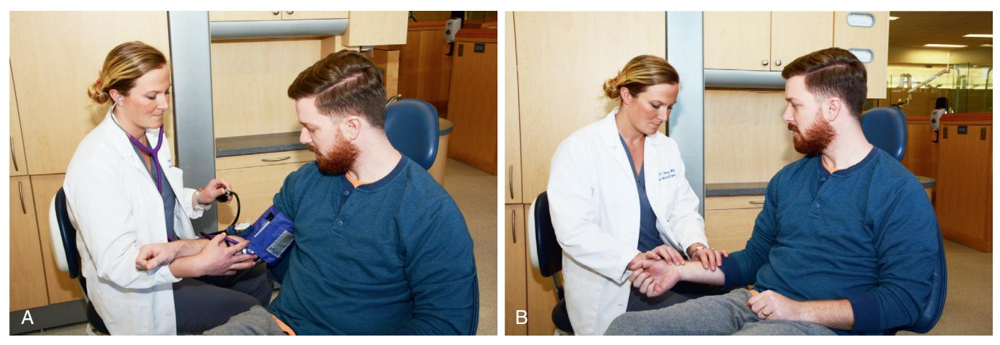
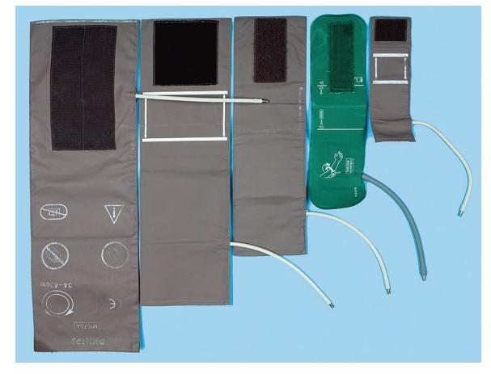
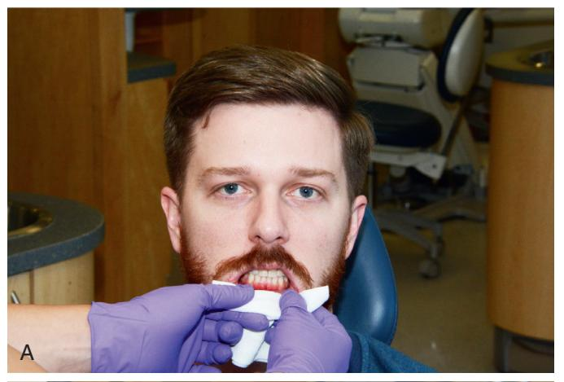
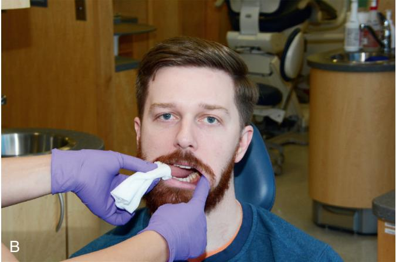
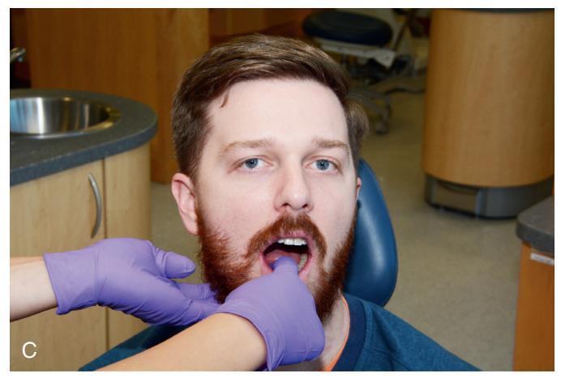
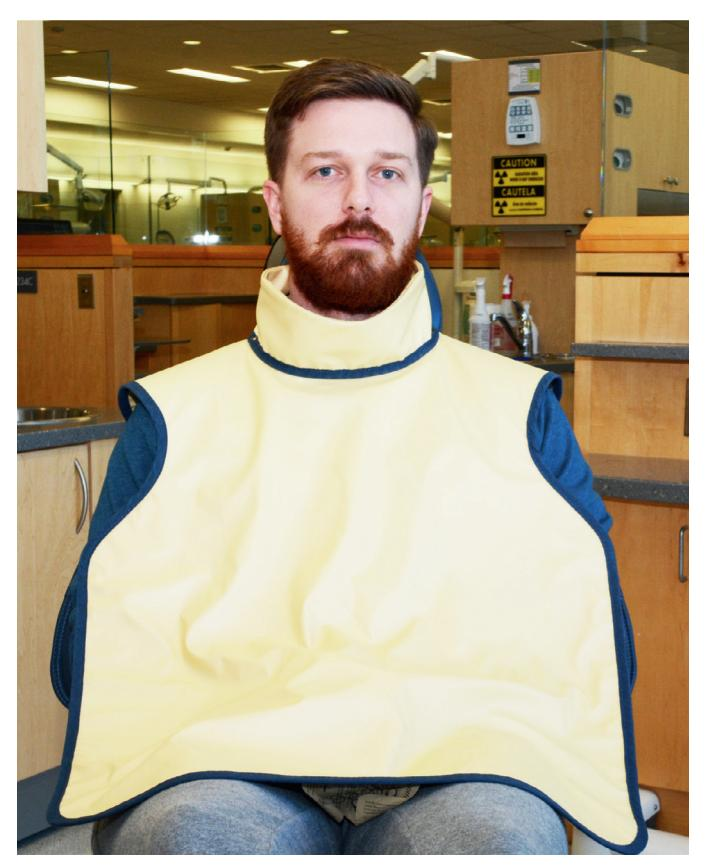

---
editor_options:
  markdown:
    wrap: sentence
---

Here is the combined study guide.

# Preoperative Health Status Evaluation Study Guide

## Introduction

The scope of medical history, physical examination, and laboratory evaluation for outpatient dentoalveolar surgery differs significantly from that required for hospital admission and general anesthesia.
While a patient's primary care physician typically performs comprehensive periodic evaluations, it is impractical and of little value for the dentist to duplicate this process.
However, dental professionals must identify medical problems that could affect the safe delivery of planned care or specifically impact oral and maxillofacial health.

This evaluation is particularly crucial for dentoalveolar surgery due to its invasive nature, which adds physical stress, creates bleeding wounds, introduces microorganisms into tissues, and often requires elaborate pain and anxiety control with potent agents.
Dentists, educated in basic biomedical sciences and pathophysiology, are valuable healthcare team members.
This responsibility entails recognizing and managing pathologic oral conditions, staying informed of new medical developments, remaining vigilant during patient treatment, and being prepared to communicate thorough evaluations of oral health to other providers.

## Medical History

An accurate medical history is the most useful tool for safely planning dental therapy, allowing the dentist to anticipate how medical problems might alter a patient's response to anesthetics and surgery.
A well-executed history often reduces the need for extensive physical examination and laboratory evaluation in presurgical assessment.
The interview and examination should be tailored to the patient's medical problems, age, intelligence, social circumstances, the complexity of the planned procedure, and the anticipated anesthetic methods.

### BOX 1.1 Standard Format for Recording Results of History and Physical Examinations

-   

    1.  Biographic data

-   

    2.  Chief complaint and its history

-   

    3.  Medical history

-   

    4.  Social and family medical histories

-   

    5.  Review of systems

-   

    6.  Physical examination

-   

    7.  Laboratory and imaging results

### Biographic Data

Initial information includes the patient's full name, home address, age, gender, occupation, and the name of their primary care physician.
This data helps assess the patient's reliability, which directly impacts the validity of the medical history provided.

> If the identification data and patient interview give the clinician reason to suspect that the medical history may be unreliable, alternative methods of obtaining the necessary information should be tried.
> A reliability assessment should continue throughout the entire history interview and physical examination, with the interviewer looking for illogical, improbable, or inconsistent patient responses that might suggest the need for corroboration of information.

### Chief Complaint

Patients should state their chief complaint, which should be recorded verbatim.
This establishes priorities for history taking and treatment planning and encourages patients to clarify their reasons for seeking treatment.
It may also reveal conscious or subconscious "hidden agendas."

### History of Chief Complaint

Patients should describe the history of their chief complaint, including its first appearance, any changes since, and its influence on or by other factors.
For pain, details such as date of onset, intensity, duration, location, radiation, and mitigating/exacerbating factors are crucial.
Inquiry about constitutional symptoms like fever, chills, lethargy, anorexia, malaise, and weakness is also important.
The complexity of this history can range from straightforward (e.g., erupting third molar pain) to involved (e.g., a painful, non-healing extraction site in a patient with a history of therapeutic irradiation).

### Obtaining the Medical History

Health history forms (questionnaires) are efficient for initial data collection.
The dentist uses pertinent answers to direct the subsequent interview.
Properly trained dental assistants can "red flag" important responses.
Forms should be clearly written in non-technical language and be concise.
They should also include a statement assuring confidentiality and a consent line for record access by approved individuals (e.g., primary care physician).
A signature line allows patients to verify their understanding and accuracy.

If data are collected verbally, subsequent written documentation is important.

#### BOX 1.2 Baseline Health History Database

-   

    1.  Past hospitalizations, operations, traumatic injuries, and serious illnesses

-   

    2.  Recent minor illnesses or symptoms

-   

    3.  Medications currently or recently in use and allergies (particularly drug allergies)

-   

    4.  Description of health-related habits or addictions, such as the use of ethanol, tobacco, and illicit drugs; and the amount and type of daily exercise

-   

    5.  Date and result of last medical checkup or physician visit

> It is helpful to inquire specifically about common medical problems that are likely to alter the dental management of the patient.

**Key Medical Problems and Allergies to Inquire About:** \* **Medical Problems:** Angina, myocardial infarction (MI), heart murmurs, rheumatic heart disease, bleeding disorders (including anticoagulant use), asthma, chronic lung disease, hepatitis, sexually transmitted infections, diabetes, corticosteroid use, seizure disorders, stroke, and any implanted prosthetic devices (e.g., artificial joint or heart valve).
\* **Allergies:** Local anesthetics, aspirin, and penicillin.

**Specific Patient Inquiries:** \* Female patients in the appropriate age group must be asked at each visit whether they are or may be pregnant.
\* A brief family history can be useful, focusing on relevant inherited diseases such as hemophilia.

#### BOX 1.3 Common Health Conditions to Inquire About Verbally or on a Health Questionnaire

-   Allergies to antibiotics or local anesthetics
-   Angina
-   Anticoagulant use
-   Asthma
-   Bleeding disorders
-   Breastfeeding
-   Corticosteroid use
-   Diabetes
-   Heart murmurs
-   Hepatitis
-   Hypertension
-   Implanted prosthetic devices
-   Lung disease
-   Myocardial infarction (i.e., heart attack)
-   Osteoporosis
-   Pregnancy
-   Renal disease
-   Rheumatic heart disease
-   Seizure disorder
-   Sexually transmitted diseases
-   Tuberculosis

**Medical History Update Protocol:** The medical history should be regularly updated.
\> Many dentists have their assistants specifically ask each patient at checkup appointments whether there has been any change in health since the last dental visit.
The dentist is alerted if a change has occurred, and the changes are documented in the record.

#### Example Health History Questionnaire

| MEDICAL HISTORY   |            |
|-------------------|------------|
| Name              |            |
| M                 | F          |
| Date of Birth     |            |
| Address           |            |
| Telephone: (Home) | (Work)     |
| Height            | Weight     |
| Today's Date      | Occupation |

Answer all questions by circling either YES or NO and fill in all blank spaces where indicated.
Answers to the following questions are for our records only and are confidential.

| 1\. My last medical physical examination was on (approximate) |   |
|-----------------------------------------------------------|------------|
| 2\. The name & address of my personal physician is |  |
| 3\. Are you now under the care of a physician | YES NO |
| If so, what is the condition being treated? |  |
| 4\. Have you had any serious illness or operation | YES NO |
| If so, what was the illness or operation? |  |
| 5\. Have you been hospitalized within the past 5 years | YES NO |
| If so, what was the problem? |  |
| 6\. Do you have or have you had any of the following diseases or problems: |  |
| a\. Rheumatic fever or rheumatic heart disease. | YES NO |
| b\. Heart abnormalities present since birth | YES NO |
| c\. Cardiovascular disease (heart trouble, heart attack, angina, stroke, high blood pressure, heart murmur). | YES NO |
| (1) Do you have pain or pressure in chest upon exertion. | YES NO |
| (2) Are you ever short of breath after mild exercise. | YES NO |
| (3) Do your ankles swell. | YES NO |
| (4) Do you get short of breath when you lie down, or do you require extra pillows when you sleep. | YES NO |
| (5) Have you been told you have a heart murmur. | YES NO |
| d\. Asthma or hay fever | YES NO |
| e\. Hives or a skin rash | YES NO |
| f\. Fainting spells or seizures. | YES NO |
| g\. Diabetes. | YES NO |
| (1) Do you have to urinate (pass water) more than six times a day | YES NO |
| (2) Are you thirsty much of the time | YES NO |
| (3) Does your mouth usually feel dry. | YES NO |
| h\. Hepatitis, jaundice or liver disease. | YES NO |
| i\. Arthritis or other joint problems. | YES NO |
| j\. Stomach ulcers. | YES NO |
| k\. Kidney trouble. | YES NO |
| l\. Tuberculosis. | YES NO |
| m\. Do you have a persistent cough or cough up blood. | YES NO |
| n\. Venereal disease. | YES NO |
| o\. Other (list) |  |
| 7\. Have you had abnormal bleeding associated with previous extractions, surgery, or trauma | YES NO |
| a\. Do you bruise easily. | YES NO |
| b\. Have you ever required a blood transfusion | YES NO |
| c\. If so, explain the circumstances |  |
| 8\. Do you have any blood disorder such as anemia, including sickle cell anemia. | YES NO |
| 9\. Have you had surgery or radiation treatment for a tumor, cancer, or other condition of your head or neck | YES NO |

• Fig.
1.1 Example of health history questionnaire useful for screening dental patients.
(Modified from a form provided by the American Dental Association.)

------------------------------------------------------------------------

# MEDICAL HISTORY—cont'd

-   **10. Current Medications/Herbs:** Are you taking any drug, medicine, or herb?
    -   **11. Specific Medications Checklist:**
        -   

            a.  Antibiotics or sulfa drugs

        -   

            b.  Anticoagulants (blood thinners)

        -   

            c.  Medicine for high blood pressure

        -   

            d.  Cortisone (steroids) (including prednisone)

        -   

            e.  Tranquilizers

        -   

            f.  Aspirin

        -   

            g.  Insulin, tolbutamide (Orinase) or similar drug for diabetes

        -   

            h.  Digitalis or drugs for heart trouble

        -   

            i.  Nitroglycerin

        -   

            j.  Antihistamine

        -   

            k.  Oral birth control drug or other hormonal therapy

        -   

            l.  Medicines for osteoporosis

        -   

            m.  Other
-   **12. Allergies/Adverse Reactions:** Have you reacted adversely to:
    -   

        a.  Local anesthetics (procaine [Novocain])

    -   

        b.  Penicillin or other antibiotics

    -   

        c.  Sulfa drugs

    -   

        d.  Aspirin

    -   

        e.  Iodine or x-ray dyes

    -   

        f.  Codeine or other narcotics

    -   

        g.  Other
-   **13. Previous Dental Treatment Complications:** Have you had any serious trouble associated with any previous dental treatment?
-   **14. Unlisted Health Conditions:** Do you have any disease, condition, or problem not listed above that should be known?
-   **15. Occupational Radiation Exposure:** Are you employed in any situation which exposes you regularly to x-rays or other ionizing radiation?
-   **16. Contact Lens Use:** Are you wearing contact lenses?
-   **WOMEN:**
    -   **17. Pregnancy/Menstrual Status:** Are you pregnant or have you recently missed a menstrual period?
    -   **18. Breast-feeding:** Are you presently breast-feeding?
-   **Chief Dental Complaint:** (Why did you come to the office today?)

• Fig.
1.1, cont'd

### Review of Systems

The review of systems is a sequential, comprehensive method of eliciting patient symptoms on an organ-by-organ basis, which may reveal undiagnosed medical conditions.
The dentist's approach is guided by pertinent answers from the patient's history.
For example, a patient with a history of ischemic heart disease should be asked about chest discomfort, palpitations, fainting, and ankle swelling.

When anxiety-controlling adjuncts (IV and inhalation sedation) are planned, the cardiovascular, respiratory, and nervous systems should always be reviewed to disclose undiagnosed problems.
As oral health specialists, dentists are expected to perform a quick review of the head, ears, eyes, nose, mouth, and throat on every patient.

#### BOX 1.4 Routine Review of Head, Neck, and Maxillofacial Regions

-   **Constitutional:** Fever, chills, sweats, weight loss, fatigue, malaise, loss of appetite
-   **Head:** Headache, dizziness, fainting, insomnia
-   **Ears:** Decreased hearing, tinnitus (ringing), pain
-   **Eyes:** Blurring, double vision, excessive tearing, dryness, pain
-   **Nose and sinuses:** Rhinorrhea, epistaxis, problems breathing through nose, pain, change in sense of smell
-   **Temporomandibular joint area:** Pain, noise, limited jaw motion, locking
-   **Oral:** Dental pain or sensitivity, lip or mucosal sores, problems chewing, problems speaking, bad breath, loose restorations, sore throat, loud snoring
-   **Neck:** Difficulty swallowing, change in voice, pain, stiffness

#### BOX 1.5 Review of Cardiovascular and Respiratory Systems

**Cardiovascular Review** Chest discomfort on exertion, when eating, or at rest; palpitations; fainting; ankle edema; shortness of breath (dyspnea) on exertion; dyspnea on assuming supine position (orthopnea or paroxysmal nocturnal dyspnea); postural hypotension; fatigue; leg muscle cramping

**Respiratory Review** Dyspnea with exertion, wheezing, coughing, excessive sputum production, coughing up blood (hemoptysis)

## Physical Examination

The physical examination in dentistry focuses on the oral cavity and, to a lesser degree, the entire maxillofacial region.
When recording results, it is crucial to provide an accurate description rather than listing suspected medical diagnoses (e.g., describe a lesion's characteristics instead of simply writing "fibroma").

**Steps for Physical Evaluation:** 1.
**Measurement of Vital Signs:** Serves as a screening device for unsuspected medical problems and provides a baseline for comparison.
2.
**Four Primary Means of Evaluation:** \* **a. Inspection:** Always performed in oral and maxillofacial regions.
Observations include hair distribution, facial symmetry, eye movements, nasal patency, skin lesions, and neck or facial masses.
The oral cavity requires a thorough inspection of the oropharynx, tongue, floor of the mouth, and oral mucosa.
\* **b. Palpation:** Important for evaluating temporomandibular joint (TMJ) function, salivary glands, thyroid gland, lymph nodes, induration of soft tissues, pain assessment, and fluctuance in swollen areas.
\* **c. Percussion:** Used by dentists to test teeth and paranasal sinuses.
\* **d. Auscultation:** The dentist's primary use is for TMJ evaluation, but it is also used for cardiac and pulmonary systems.

• Fig.
1.2 (A) Measurement of systemic blood pressure.
A cuff of proper size placed securely around the upper arm so that the lower edge of cuff lies 2 to 4 cm above the antecubital fossa.
The brachial artery is palpated in the fossa, and the stethoscope diaphragm is placed over the artery and held in place with the fingers of the left hand.
The squeeze-bulb is held in the palm of the right hand, and the valve is screwed closed with the thumb and the index finger of that hand.
The bulb is then repeatedly squeezed until the pressure gauge reads approximately 220 mm Hg.
Air is allowed to escape slowly from the cuff by partially opening the valve while the dentist listens through the stethoscope.
Gauge reading at the point when a faint blowing sound is first heard is systolic blood pressure.
Gauge reading when the sound from the artery disappears is diastolic pressure.
Once the diastolic pressure reading is obtained, the valve is opened to deflate the cuff completely.
(B) Pulse rate and rhythm most commonly are evaluated by using the tips of the middle and index fingers of the right hand to palpate the radial artery at the wrist.
Once the rhythm has been determined to be regular, the number of pulsations that occur during 30 seconds is multiplied by 2 to get the number of pulses per minute.
If a weak pulse or irregular rhythm is discovered while palpating the radial pulse, the heart should be auscultated directly to determine heart rate and rhythm.

• **Fig. 1.3** Blood pressure cuffs of varying sizes for patients with arms of different diameters (ranging from infants through obese adult patients).
Use of an improper cuff size can jeopardize the accuracy of blood pressure results.

> Too small a cuff causes readings to be falsely high, and too large a cuff causes artificially low readings.
> Blood pressure cuffs typically are labeled as to the type and size of patient for whom they are designed.

• Fig.
1.4 (A) Lip mucosa examined by everting upper and lower lips.
(B) Tongue examined by having the patient protrude it.
The examiner then grasps the tongue with cotton sponge and gently manipulates it to examine the lateral borders.
The patient also is asked to lift the tongue to allow visualization of the ventral surface and the floor of mouth.
(C) Submandibular gland examined by bimanually feeling gland through floor of mouth and skin under floor of mouth.

#### BOX 1.6 Physical Examination Before Oral and Maxillofacial Surgery

**Inspection** - **Head and face:** General shape, symmetry, hair distribution - **Ear:** Normal reaction to sounds (otoscopic examination if indicated) - **Eye:** Symmetry, size, reactivity of pupil, color of sclera and conjunctiva, movement, test of vision - **Nose:** Septum, mucosa, patency - **Mouth:** Teeth, mucosa, pharynx, lips, tonsils - **Neck:** Size of thyroid gland, jugular venous distention

**Palpation** - **Temporomandibular joint:** Crepitus, tenderness - **Paranasal:** Pain over sinuses - **Mouth:** Salivary glands, floor of mouth, lips, muscles of mastication - **Neck:** Thyroid gland size, lymph nodes

**Percussion** - **Paranasal:** Resonance over sinuses (difficult to assess) - **Mouth:** Teeth

**Auscultation** - **Temporomandibular joint:** Clicks, crepitus - **Neck:** Carotid bruits

#### BOX 1.7 Brief Maxillofacial Examination

While interviewing the patient, the dentist should: \* **Visually examine:** General shape and symmetry of head and facial skeleton, eye movement, color of conjunctiva and sclera, and ability to hear.
\* **Listen for:** Speech problems, temporomandibular joint sounds, and breathing ability.

**Routine Examination** \* **Temporomandibular Joint Region:** Palpate and auscultate joints.
Measure range of motion of jaw and opening pattern.
\* **Nose and Paranasal Region:** Occlude nares individually to check for patency.
Inspect anterior nasal mucosa.
\* **Mouth:** Take out all removable prostheses.
Inspect oral cavity for dental, oral, and pharyngeal mucosal lesions.
Look at tonsils and uvula.
Hold tongue out of mouth with dry gauze while inspecting lateral borders.
Palpate tongue, lips, floor of mouth, and salivary glands (check for saliva).
Palpate neck for lymph nodes and thyroid gland size.
Inspect jugular veins.

### Physical Status Classification

The results of the medical evaluation are used to assign a physical status classification, most commonly using the American Society of Anesthesiologists' (ASA) system.
This classification helps the dentist decide if treatment can be safely performed in the dental office.

#### BOX 1.8 American Society of Anesthesiologists (ASA) Classification of Physical Status

-   **ASA I:** A normal, healthy patient
-   **ASA II:** A patient with mild systemic disease or significant health risk factor
-   **ASA III:** A patient with severe systemic disease that is not incapacitating
-   **ASA IV:** A patient with severe systemic disease that is a constant threat to life
-   **ASA V:** A moribund patient who is not expected to survive without the operation
-   **ASA VI:** A declared brain-dead patient whose organs are being removed for donation purposes

For patients who are not ASA Class I or relatively healthy Class II, options include: 1.
Modifying routine treatment plans (e.g., using anxiety-reduction measures, pharmacologic techniques, careful monitoring).
2.
Obtaining a medical consultation for guidance.
3.
Altering body position (e.g., not fully reclining a patient with congestive heart failure).
4.
Referring the patient to an oral-maxillofacial surgeon.
5.
Refusing to treat the patient in an ambulatory setting.

## Management of Patients With Compromising Medical Conditions

### Cardiovascular Problems

#### Ischemic Heart Disease

##### **Angina Pectoris**

-   **Definition:** A symptom of reversible ischemic heart disease caused by the narrowing or spasm of coronary arteries, leading to a mismatch between myocardial oxygen demand and supply.
-   **Symptoms:** Heavy pressure or squeezing in the substernal region, potentially radiating to the left shoulder, arm, or mandible. Discomfort typically resolves with rest or increased oxygen supply.
-   **Management:**
    -   **History:** Question the patient about precipitating events, frequency, duration, and response to medication. Consult the patient's physician.
    -   **Safety:** Ambulatory surgery is usually safe if angina is stable (occurs only with moderately vigorous exertion and responds to rest/nitroglycerin). Postpone elective surgery for unstable angina.
    -   **Anxiety Reduction:** Implement an anxiety-reduction protocol to lower myocardial oxygen demand. Profound local anesthesia is the best means of limiting anxiety.
    -   **Epinephrine:** The benefits of using epinephrine in local anesthetics outweigh the risks for angina patients. Avoid excessive administration (some advise no more than 0.04 mg total in any 30-minute period).
    -   **Monitoring:** Monitor vital signs and maintain verbal contact. Consider nitrous oxide for sedation. Have fresh nitroglycerin readily available.

###### BOX 1.9 General Anxiety-Reduction Protocol

**Before Appointment** \* Hypnotic agent to promote sleep on night before surgery (optional) \* Sedative agent to decrease anxiety on morning of surgery (optional) \* Morning appointment and schedule so that reception room time is minimized

**During Appointment** \* **Nonpharmacologic Means of Anxiety Control:** \* Frequent verbal reassurances \* Distracting conversation \* No surprises (clinician warns patient before doing anything that could cause anxiety) \* No unnecessary noise \* Surgical instruments out of patient's sight \* Relaxing background music \* **Pharmacologic Means of Anxiety Control:** \* Local anesthetics of sufficient intensity and duration \* Nitrous oxide \* Intravenous anxiolytics

**After Surgery** \* Succinct instructions for postoperative care \* Patient information on expected postsurgical sequelae (e.g., swelling or minor oozing of blood) \* Further reassurance \* Effective analgesics \* Patient information on who can be contacted if any problems arise \* Telephone call to patient at home during evening after surgery to check whether any problems exist

###### BOX 1.10 Management of Patient With History of Angina Pectoris

-   

    1.  Consult the patient's physician.

-   

    2.  Use an anxiety-reduction protocol.

-   

    3.  Have nitroglycerin tablets or spray readily available. Use nitroglycerin premedication, if indicated.

-   

    4.  Ensure profound local anesthesia before starting surgery.

-   

    5.  Consider the use of nitrous oxide sedation.

-   

    6.  Monitor vital signs closely.

-   

    7.  Consider possible limitation of amount of epinephrine used (0.04 mg maximum).

-   

    8.  Maintain verbal contact with patient throughout the procedure to monitor status.

##### **Myocardial Infarction (MI)**

-   **Pathophysiology:** A clot forms in a narrowed coronary artery, blocking blood flow and causing an area of myocardium to become nonfunctional and necrotic. The surrounding ischemic tissue can be a source of dysrhythmias.
-   **Management:**
    -   Consult the patient's physician. Elective major surgery is typically deferred for at least 6 months post-MI. However, straightforward oral surgery may be performed sooner with physician clearance if the patient had an uneventful recovery.
    -   Question the patient carefully about cardiovascular health, including symptoms of undiagnosed dysrhythmias or CHF, and any anticoagulant use (including aspirin).
    -   Management is similar to that for angina patients: use an anxiety-reduction protocol, monitor vital signs, and ensure profound local anesthesia.
    -   Local anesthetics with epinephrine are safe if used properly. Prophylactic nitroglycerin should only be used if directed by the physician.

###### BOX 1.11 Management of Patient With a History of Myocardial Infarction

-   

    1.  Consult the patient's primary care physician.

-   

    2.  Check with the physician if invasive dental care is needed before 6 months since the myocardial infarction.

-   

    3.  Check whether the patient is using anticoagulants (including aspirin).

-   

    4.  Use an anxiety-reduction protocol.

-   

    5.  Have nitroglycerin available; use it prophylactically if the physician advises.

-   

    6.  Administer supplemental oxygen (optional).

-   

    7.  Provide profound local anesthesia.

-   

    8.  Consider nitrous oxide administration.

-   

    9.  Monitor vital signs, and maintain verbal contact with the patient.

-   

    10. Consider possible limitation of epinephrine use to 0.04 mg.

-   

    11. Consider referral to an oral-maxillofacial surgeon.

##### **Coronary Artery Bypass Grafting (CABG)**

-   Patients with a history of CABG also typically have a history of angina or MI and should be managed similarly.
-   Major oral surgery should be deferred for 3 months. Routine office procedures may be performed sooner if recovery has been uncomplicated and anxiety is minimized.

#### Cerebrovascular Accident (Stroke)

-   Patients who have had a CVA are at risk for further neurovascular accidents. They are often prescribed anticoagulant or antiplatelet medication.
-   **Management:**
    -   Obtain physician clearance and ensure hypertension is controlled.
    -   Document baseline neurologic status preoperatively.
    -   Use a nonpharmacologic anxiety-reduction protocol.
    -   Monitor vital signs carefully. Low concentrations of nitrous oxide can be used for sedation if necessary.

#### Dysrhythmias

-   **Definition:** Uncoordinated contractions of heart chambers due to problems with impulse initiation or propagation. The most common is atrial fibrillation in patients over 50.
-   **Management:**
    -   **Epinephrine:** Many advocate limiting the total dose to 0.04 mg.
    -   **Pacemakers:** Pose no contraindication to oral surgery, and antibiotic prophylaxis is not required. However, electrical equipment like electrocautery should not be used near the patient.
    -   **General:** Monitor vital signs carefully and consider all comorbid conditions. Patients may be on anticoagulants.

#### Heart Abnormalities That Predispose to Infective Endocarditis

Certain cardiac abnormalities can predispose the endocardium to infection when bacteria enter the bloodstream.
A complete description and prevention protocols are discussed in Chapter 18.

#### Congestive Heart Failure (Hypertrophic Cardiomyopathy)

-   **Definition:** A condition where a diseased myocardium cannot deliver the cardiac output demanded by the body.
-   **Pathophysiology:** Dilation of the myocardium leads to a less efficient pump, causing blood to back up into pulmonary and other vascular beds. This leads to pulmonary edema, hepatic dysfunction, weakness, and fluid overload.
-   **Symptoms:**
    -   **Orthopnea:** Shortness of breath when lying supine.
    -   **Paroxysmal Nocturnal Dyspnea:** Respiratory difficulty 1-2 hours after lying down.
    -   **Lower Extremity Edema:** Swelling of the foot/ankle.
-   **Management:**
    -   **Well-compensated CHF:** Can undergo ambulatory surgery with an anxiety-reduction protocol, supplemental oxygen, and avoidance of the supine position if orthopnea is present.
    -   **Uncompensated CHF:** Defer surgery until the condition is medically improved.

###### BOX 1.12 Management of the Patient With Congestive Heart Failure (Hypertrophic Cardiomyopathy)

-   

    1.  Defer treatment until heart function has been medically improved and the patient's physician believes treatment is possible.

-   

    2.  Use an anxiety-reduction protocol.

-   

    3.  Consider possible administration of supplemental oxygen.

-   

    4.  Avoid using the supine position.

-   

    5.  Consider referral to an oral-maxillofacial surgeon.

### Pulmonary Problems

#### Asthma

-   **Definition:** Episodic narrowing of inflamed small airways, producing wheezing and dyspnea, triggered by various stimuli.
-   **Management:**
    -   Obtain a history of precipitating factors, frequency, severity, and medications. Specifically ask about aspirin allergy.
    -   Defer treatment if a respiratory tract infection or wheezing is present.
    -   Use an anxiety-reduction protocol. Nitrous oxide is safe and may offer mild bronchodilation.
    -   For patients on chronic systemic corticosteroids, consult their physician about the potential need for augmentation for major procedures.
    -   Keep the patient's own bronchodilator-containing inhaler accessible.
    -   Avoid NSAIDs, as they can precipitate attacks in susceptible individuals.

###### BOX 1.13 Management of the Patient With Asthma

-   

    1.  Defer dental treatment until the asthma is well controlled and the patient has no signs of a respiratory tract infection.

-   

    2.  Listen to the chest with a stethoscope to detect any wheezing before major oral surgical procedures or sedation.

-   

    3.  Use an anxiety-reduction protocol, including nitrous oxide, but avoid the use of respiratory depressants.

-   

    4.  Consult the patient's physician about possible preoperative use of cromolyn sodium.

-   

    5.  If the patient is or has been chronically taking corticosteroids, provide prophylaxis for adrenal insufficiency.

-   

    6.  Keep a bronchodilator-containing inhaler easily accessible.

-   

    7.  Avoid the use of nonsteroidal antiinflammatory drugs in susceptible patients.

#### Chronic Obstructive Pulmonary Disease (COPD)

-   **Pathology:** Long-term exposure to pulmonary irritants leads to inflamed, obstructed airways that have lost their elastic properties.
-   **Clinical Manifestations:** Dyspnea on exertion, chronic cough with thick secretions, and frequent respiratory infections.
-   **Management:**
    -   Defer treatment until lung function improves.
    -   Consider corticosteroid supplementation for patients on chronic steroid therapy.
    -   Avoid respiratory depressants (sedatives, hypnotics, narcotics).
    -   The patient may need to be in an upright position to manage secretions.
    -   Schedule afternoon appointments to allow for morning clearance of secretions.

> **Critical Warning:** Supplemental oxygen *greater than the usual rate* should *not* be administered to patients with severe COPD during surgery unless advised by a physician.
> Severe COPD patients become acclimated to elevated arterial carbon dioxide levels and depend on depressed arterial oxygen levels to stimulate breathing.
> Elevating arterial O2 concentration removes this hypoxia-based respiratory stimulation, which can critically slow the patient's respiratory rate.

###### BOX 1.14 Management of Patient With Chronic Obstructive Pulmonary Disease

-   

    1.  Defer treatment until lung function has improved and treatment is possible.

-   

    2.  Listen to the chest bilaterally with stethoscope to determine adequacy of breath sounds.

-   

    3.  Use an anxiety-reduction protocol, but avoid the use of respiratory depressants.

-   

    4.  If the patient requires chronic oxygen supplementation, continue at the prescribed flow rate. If the patient does not require supplemental oxygen therapy, consult his or her physician before administering oxygen.

-   

    5.  If the patient chronically receives corticosteroid therapy, manage the patient for adrenal insufficiency.

-   

    6.  Avoid placing the patient in the supine position until you are confident that the patient can tolerate it.

-   

    7.  Keep a bronchodilator-containing inhaler accessible.

-   

    8.  Closely monitor respiratory rate and heart rate.

-   

    9.  Schedule afternoon appointments to allow for clearance of secretions.

### Renal Problems

#### Renal Failure

-   **Management for Patients on Hemodialysis:**
    -   Schedule elective oral surgery for the day after dialysis to allow for heparin clearance and optimal physiologic status.
    -   Never use the arteriovenous (AV) shunt for venous access. Do not place a blood pressure cuff on the arm with an AV shunt.
    -   Avoid or modify doses of drugs that depend on renal metabolism or excretion. Avoid nephrotoxic drugs like NSAIDs.
    -   Consult the physician about the need for prophylactic antibiotics.
    -   Be aware of the higher incidence of hepatitis and take necessary precautions. Note that radiolucencies from secondary hyperparathyroidism should not be mistaken for dental disease.

###### BOX 1.15 Management of Patient With Renal Insufficiency and Patient Receiving Hemodialysis

-   

    1.  Avoid the use of drugs that depend on renal metabolism or excretion. Modify the dose if such drugs are necessary. Do not use an atrioventricular shunt for giving drugs or for taking blood specimens.

-   

    2.  Avoid the use of nephrotoxic drugs such as nonsteroidal antiinflammatory drugs.

-   

    3.  Defer dental care until the day after dialysis has been given.

-   

    4.  Consult the patient's physician about the use of prophylactic antibiotics.

-   

    5.  Monitor blood pressure and heart rate.

-   

    6.  Look for signs of secondary hyperparathyroidism.

-   

    7.  Consider screening for hepatitis B virus before dental treatment. Take the necessary precautions if unable to screen for hepatitis.

#### Renal Transplantation and Transplantation of Other Organs

-   Patients receive immunosuppressive drugs and corticosteroids.
-   **Management:**
    -   Patients may require supplemental corticosteroids perioperatively.
    -   Immunosuppression may cause minor infections to become severe; consider more aggressive use of antibiotics and consult the physician about prophylaxis.
    -   The immunosuppressant cyclosporine A may cause gingival hyperplasia.
    -   Patients may have severe hypertension; obtain vital signs before surgery.
    -   Most recommendations apply to patients with other transplanted organs, avoiding drugs toxic to that specific organ.

###### BOX 1.16 Management of Patient With Renal Transplant

-   

    1.  Defer treatment until the patient's primary care physician or transplant surgeon clears the patient for dental care.

-   

    2.  Avoid the use of nephrotoxic drugs.ᵃ

-   

    3.  Consider the use of supplemental corticosteroids.

-   

    4.  Monitor blood pressure.

-   

    5.  Consider screening for hepatitis B virus before dental care. Take necessary precautions if unable to screen for hepatitis.

-   

    6.  Watch for presence of cyclosporine-A–induced gingival hyperplasia. Emphasize the importance of oral hygiene.

-   

    7.  Consider use of prophylactic antibiotics, particularly in patients taking immunosuppressive agents.

    -   ᵃIn patients with other transplanted organs, the clinician should avoid the use of drugs toxic to that organ.

### Hypertension

-   **Mild to Moderate Hypertension (Systolic \>140 or Diastolic \>90 mm Hg):** Usually not a problem for ambulatory surgery if no signs of end-organ damage. Use an anxiety-reduction protocol, monitor vital signs, and use epinephrine-containing local anesthetics cautiously. Advise the patient to seek medical care.
-   **Severe Hypertension (Systolic ≥200 or Diastolic ≥110 mm Hg):** Postpone elective oral surgery until blood pressure is better controlled. Emergency procedures should be performed in a well-controlled environment (e.g., hospital).

###### BOX 1.17 Management of Patient With Hypertension

**Mild to Moderate Hypertension (Systolic \>140 mm Hg; Diastolic \>90 mm Hg)** \* 1.
Recommend that the patient seek the primary care physician's guidance for medical therapy of hypertension.
It is not necessary to defer needed dental care.
\* 2.
Monitor the patient's blood pressure at each visit and whenever administration of epinephrine-containing local anesthetic surpasses 0.04 mg during a single visit.
\* 3.
Use an anxiety-reduction protocol.
\* 4.
Avoid rapid posture changes in patients taking drugs that cause vasodilation.
\* 5.
Avoid administration of sodium-containing intravenous solutions.

**Severe Hypertension (Systolic \>200 mm Hg; Diastolic \>110 mm Hg)** \* 1.
Defer elective dental treatment until the hypertension is better controlled.
\* 2.
Consider referral to an oral-maxillofacial surgeon for emergent problems.

### Hepatic Disorders

Patients with severe liver damage require special consideration due to altered drug metabolism and depressed production of coagulation factors.
\* **Management:** \* Attempt to learn the cause of the liver problem; if hepatitis B, take usual precautions.
\* Alter the dose of or avoid drugs requiring hepatic metabolism.
\* Screen patients for bleeding disorders (platelet count, PT, PTT) before surgery.
\* Avoid situations where the patient might swallow large amounts of blood to prevent encephalopathy.
\* Unless documented otherwise, presume a patient with liver disease of unknown origin carries the hepatitis virus.

###### BOX 1.18 Management of Patient With Hepatic Insufficiency

-   

    1.  Attempt to learn the cause of the liver problem; if the cause is hepatitis B, take usual precautions.

-   

    2.  Avoid drugs requiring hepatic metabolism or excretion; if their use is necessary, modify the dose.

-   

    3.  Screen patients with severe liver disease for bleeding disorders by using tests for determining platelet count, prothrombin time, partial thromboplastin time, and bleeding time.

-   

    4.  Attempt to avoid situations in which the patient might swallow large amounts of blood.

### Endocrine Disorders

#### Diabetes Mellitus

-   **Type 1 (Insulin-Dependent):** Underproduction of insulin, usually with childhood onset. Patients must balance caloric intake, exercise, and insulin dose.
-   **Type 2 (Non–Insulin-Dependent):** Insufficient insulin production or insulin resistance, typically with adult onset. Managed with diet, oral hypoglycemics, and sometimes insulin.
-   **Management Principles for Oral Surgery:**
    -   Schedule an early morning appointment and use an anxiety-reduction program.
    -   Consult the patient's physician regarding medication adjustments for dietary changes. \> Short-term, mild-to-moderate hyperglycemia is usually not a significant problem for persons with diabetes. Therefore, when an oral surgical procedure is planned, it is best to err on the side of hyperglycemia rather than hypoglycemia.
    -   **If not using IV sedation:** The patient should eat a normal meal, take their usual morning regular insulin, and take half their dose of NPH insulin.
    -   **If patient must miss a meal:** They should omit any morning insulin and resume it only once caloric intake is possible.
    -   Monitor for signs of hypoglycemia (hypotension, drowsiness, diaphoresis, tachycardia). Have oral or IV glucose available.
    -   Treat infections aggressively, as poorly controlled diabetics have difficulty containing them. Defer elective surgery until diabetes is well controlled.

| TABLE 1.1 | Types of Insulin |   |   |
|----------------|----------------|---------------------|-------------------|
| **Duration of Action** | **Names** | **Peak Effect (Hours After Injection)** | **Duration of Action (Hours)** |
| Fast (F) | Regular | 2–3 | 6 |
|  | Semilente | 3–6 | 12 |
| Intermediate (I) | Globin zinc | 6–8 | 18 |
|  | NPH | 8–12 | 24 |
|  | Lente | 8–12 | 24 |
| Long (L) | Protamine zinc | 16–24 | 36 |
|  | Ultralente | 20–30 | 36 |

###### BOX 1.19 Management of Patient With Diabetes

**Insulin-Dependent (Type 1) Diabetes** 1.
Defer surgery until diabetes is well controlled; consult the patient's physician.
2.
Schedule an early-morning appointment; avoid lengthy appointments.
3.
Use an anxiety-reduction protocol, but avoid deep sedation techniques in outpatients.
4.
Monitor pulse, respiration, and blood pressure before, during, and after surgery.
5.
Maintain verbal contact with the patient during surgery.
6.
If patient must not eat/drink before oral surgery and will have difficulty eating after: Instruct them not to take usual dose of regular or NPH insulin; start IV administration of 5% dextrose in water drip at 150 mL/h.
7.
If allowed: Have patient eat normal breakfast before surgery and take usual dose of regular insulin but only half the dose of NPH insulin.
8.
Advise patients not to resume normal insulin doses until they are able to return to usual caloric intake and activity level.
9.
Consult the physician if questions concerning insulin regimen modification arise.
10.
Watch for signs of hypoglycemia.
11.
Treat infections aggressively.

**Non–Insulin-Dependent (Type 2) Diabetes** 1.
Defer surgery until diabetes is well controlled.
2.
Schedule an early-morning appointment; avoid lengthy appointments.
3.
Use an anxiety-reduction protocol.
4.
Monitor pulse, respiration, and blood pressure before, during, and after surgery.
5.
Maintain verbal contact with the patient during surgery.
6.
If patient must not eat/drink before oral surgery and will have difficulty eating after: Instruct them to skip any oral hypoglycemic medications that day.
7.
If patient can eat before and after surgery: Instruct them to eat a normal breakfast and to take the usual dose of hypoglycemic agent.
8.
Watch for signs of hypoglycemia.
9.
Treat infections aggressively.

#### Adrenal Insufficiency

-   **Definition:** Most commonly caused by chronic therapeutic corticosteroid administration (secondary adrenal insufficiency), which suppresses the body's ability to produce its own corticosteroids in response to stress.
-   **Adrenal Crisis:** During stressful surgery, patients with adrenal suppression may become hypotensive, syncopal, and feverish.
-   **Management:**
    -   **Minor Procedures:** An anxiety-reduction protocol is often sufficient.
    -   **Complex/Major Procedures:** Consult the patient's physician about the need for supplemental steroids. Hospitalization may be considered.

###### BOX 1.20 Management of Patient With Adrenal Suppression Who Requires Major Oral Surgery

**If the patient is currently taking corticosteroids:** 1.
Use an anxiety-reduction protocol.
2.
Monitor pulse and blood pressure before, during, and after surgery.
3.
Instruct the patient to double the usual daily dose on the day before, day of, and day after surgery.
4.
On the second postsurgical day, advise the patient to return to a usual steroid dose.

**If the patient is not currently taking steroids but has received at least 20 mg of hydrocortisone (or equivalent) for more than 2 weeks within the past year:** 1.
Use an anxiety-reduction protocol.
2.
Monitor pulse and blood pressure before, during, and after surgery.
3.
Instruct the patient to take 60 mg of hydrocortisone (or equivalent) the day before and the morning of surgery.
4.
On the first 2 postsurgical days, the dose should be dropped to 40 mg and dropped to 20 mg for 3 days thereafter.
Cease administration of supplemental steroids 6 days after surgery.

#### Hyperthyroidism

-   **Definition:** Excess of circulating thyroid hormones, leading to an increased metabolic rate, nervousness, tremor, heat intolerance, and tachycardia.
-   **Thyrotoxic Crisis:** A life-threatening complication in untreated or incompletely treated patients, involving a sudden release of thyroid hormones, leading to high fever, tachycardia, and potential cardiac decompensation.
-   **Management:**
    -   Refer patients suspected of hyperthyroidism for medical evaluation before oral surgery.
    -   Defer surgery until the condition is well controlled.
    -   Monitor pulse and blood pressure.
    -   Avoid atropine and excessive amounts of epinephrine in patients with incompletely treated hyperthyroidism.

###### BOX 1.21 Management of Patient With Hyperthyroidism

1.  Defer surgery until the thyroid gland dysfunction is well controlled.
2.  Monitor pulse and blood pressure before, during, and after surgery.
3.  Limit the amount of epinephrine used.

#### Hypothyroidism

-   **Symptoms:** Fatigue, weight gain, hoarseness, edema, and dry skin.
-   **Management:** If symptoms are mild, no modification of dental therapy is required.

### Hematologic Problems

#### Hereditary Coagulopathies

-   **Screening:** Question patients about prolonged bleeding, easy bruising, epistaxis, and hematuria. If a disorder is suspected, consider a presurgical coagulation screening (PT/INR, PTT, platelet count, bleeding time) and consultation with a hematologist.
-   **Management of Factor Deficiencies (e.g., Hemophilia):** Managed by perioperative administration of coagulation factor concentrates, desmopressin, or antifibrinolytic agents (aminocaproic acid).
-   **Management of Platelet Problems:**
    -   **Quantitative (Low Count):** Counts below 50,000/mm³ may cause abnormal bleeding. Platelet transfusions may be required for counts below 20,000/mm³.
    -   **Qualitative (Poor Function):** Often due to antiplatelet medications (aspirin, clopidogrel).
-   **General Protocols:** Use local infiltration instead of field blocks, use topical coagulation-promoting substances, and instruct the patient on avoiding clot dislodgment.

###### BOX 1.22 Management of Patient With a Coagulopathy

1.  Defer surgery until a hematologist is consulted about the patient's management.
2.  Have baseline coagulation tests performed as indicated.
3.  Schedule surgery soon after any coagulation-correcting measures have been taken.
4.  Augment clotting with topical agents, sutures, and pressure packs.
5.  Monitor the wound for 2 hours post-surgery.
6.  Instruct the patient on preventing clot dislodgment.
7.  Avoid prescribing nonsteroidal antiinflammatory drugs.
8.  Take precautions against contracting hepatitis during surgery.

#### Therapeutic Anticoagulation

-   **Indications:** Prosthetic heart valves, atrial fibrillation, history of thromboembolic events.
-   **Management:** Must be done in consultation with the patient's physician. \> Cessation of any anticoagulant or antiplatelet medication should not be taken lightly. For most routine oral surgical procedures, expected intraoperative bleeding can usually be controlled with adjunctive hemostatic techniques if the patient's laboratory data are within the therapeutic range.
-   **Aspirin:** Low-dose aspirin does not usually need to be withdrawn for routine surgery.
-   **Warfarin:** The physician may allow the INR to drop to 2.0-3.0 for surgery. This may require stopping warfarin 2-3 days prior. Therapy can be resumed the day of surgery.
-   **Direct/Indirect Xa Inhibitors:** Do not require routine monitoring and usually do not need to be stopped for routine oral surgery.
-   **Heparin:** Can be stopped 6 hours (IV) or 24 hours (subcutaneous) before surgery.

###### BOX 1.23 Management of Patient Whose Blood Is Therapeutically Anticoagulated

**Patients Receiving Aspirin or Other Platelet-Inhibiting Drugs** 1.
Consult the physician to determine the safety of stopping the drug for several days.
2.
If stopping is advised, defer surgery until the drugs have been stopped for 5 days.
3.
Use extra measures to promote clot formation and retention.
4.
Restart the drug the day after surgery if no bleeding is present.

**Patients Receiving Warfarin (Coumadin)** 1.
Consult the physician to determine the safety of allowing the PT to fall to 2.0–3.0 INR.
2.
Obtain a baseline PT/INR.
3.
If INR is \< 3.1, proceed with surgery.
If \> 3.0, stop warfarin \~2 days before surgery.
4.
Check PT/INR daily and proceed when it falls to ≤ 3.0.
5.
Use extra measures to promote clot formation and retention.
6.
Restart warfarin on the day of surgery.

**Patients Receiving Heparin** 1.
Consult the physician about stopping heparin for the perioperative period.
2.
Defer surgery until at least 6 hours after heparin is stopped.
3.
Restart heparin once a good clot has formed.

### Neurologic Disorders

#### Seizure Disorders

-   **Assessment:** Inquire about frequency, type, duration, and medications.
-   **Management:**
    -   **Well Controlled:** Standard care with an anxiety-reduction protocol.
    -   **Not Well Controlled:** Refer to an oral-maxillofacial surgeon for treatment under deep sedation.
    -   Defer surgery until seizures are well controlled.

###### BOX 1.24 Management of Patient With a Seizure Disorder

1.  Defer surgery until the seizures are well controlled.
2.  Consider having serum levels of antiseizure medications measured if patient compliance is questionable.
3.  Use an anxiety-reduction protocol.
4.  Take measures to avoid hypoglycemia and fatigue in the patient.

#### Ethanolism (Alcoholism)

-   **Primary Problems:** Hepatic insufficiency, potential for drug interactions, electrolyte abnormalities, and withdrawal phenomena (agitation, hypertension, tremors, seizures).
-   **Management:**
    -   **Severe Liver Disease or Withdrawal Signs:** Treat in a hospital setting with pre-surgical liver function tests and coagulation profiles.
    -   **Outpatient:** Alter doses of liver-metabolized drugs and monitor closely for oversedation.

## Management of Patients During and After Pregnancy

### Pregnancy

The primary concern is preventing genetic damage to the fetus from dental imaging and drug administration.
\* **Elective Surgery:** Defer until after delivery if possible.
\* **Non-Postponable Surgery:** \* **Imaging:** Use protective lead aprons and digital periapical films of only necessary areas.
\* **Drug Selection:** The list of drugs that pose little risk to the fetus is short.
\* **Relatively Safe:** Lidocaine, bupivacaine, acetaminophen, codeine, penicillin, cephalosporins.
\* **Avoid:** NSAIDs (aspirin, ibuprofen), especially in the third trimester.
Most sedative drugs should be avoided.
Nitrous oxide should be avoided in the first trimester; if used later, deliver with at least 50% oxygen and in consultation with the obstetrician.
\* **Clinical Protocols:** \* Implement an anxiety-reduction protocol.
\* Monitor vital signs, especially for elevated blood pressure (preeclampsia).
\* Avoid the fully supine position to prevent vena cava compression.
Position the patient upright or turned slightly to her left side.
\* Allow for frequent breaks to use the restroom.
\* Consult the patient's obstetrician before performing any oral surgery.

• Fig.
1.5 A proper lead apron shield is used during dental radiography.

#### BOX 1.25 Management of Patient Who Is Pregnant

1.  Defer elective surgery until after delivery, if possible.
2.  Consult the patient's obstetrician if surgery cannot be delayed.
3.  Avoid dental radiographs unless necessary for proper care. If taken, use proper lead shielding.
4.  Avoid drugs with teratogenic potential. Use local anesthetics when necessary.
5.  Use at least 50% oxygen if nitrous oxide sedation is used, but avoid use during the first trimester.
6.  Avoid keeping the patient in the supine position for long periods.
7.  Allow the patient to take trips to the restroom as often as needed.

#### BOX 1.26 Dental Medications to Avoid in Patients Who Are Pregnant

-   Aspirin and Other Nonsteroidal Antiinflammatory Drugs
-   Carbamazepine
-   Chloral hydrate (if chronically used)
-   Chlordiazepoxide
-   Corticosteroids
-   Diazepam and other benzodiazepines
-   Diphenhydramine hydrochloride (if chronically used)
-   Morphine
-   Nitrous oxide (if exposure is \>9 h/wk, oxygen is \<50%, or in the first trimester)
-   Pentazocine hydrochloride
-   Phenobarbital
-   Promethazine hydrochloride
-   Tetracyclines

#### BOX 1.27 U.S. FDA Classification of Medications With Respect to Potential Fetal Risk

-   **Category A:** Controlled studies in women have failed to demonstrate a fetal risk.
-   **Category B:** Animal studies have not demonstrated a fetal risk, but there are no controlled studies in pregnant women.
-   **Category C:** Animal studies have revealed adverse fetal effects, but there are no controlled studies in humans. Give only if the potential benefit justifies the risk.
-   **Category D:** Positive evidence of human fetal risk exists, but benefits may be acceptable despite the risk (e.g., in life-threatening situations).
-   **Category X:** Studies in animals or humans have demonstrated fetal abnormalities. The risk clearly outweighs any possible benefit. Contraindicated in women who are or may become pregnant.

### Postpartum

For lactating mothers, avoid drugs known to enter breast milk that could be harmful to the infant.
Consult the child's pediatrician for guidance.
Most drugs common in oral surgery are safe in moderate doses.

| TABLE 1.2 Effect of Dental Medications in Lactating Mothers |   |
|-----------------------------------|------------------------------------|
| **No Apparent Clinical Effects in Breastfeeding Infants** | **Potentially Harmful Clinical Effects in Breastfeeding Infants** |
| Acetaminophen | Ampicillin |
| Antihistamines | Aspirin |
| Cephalexin | Atropine |
| Codeine | Barbiturates |
| Erythromycin | Chloral hydrate |
| Fluoride | Corticosteroids |
| Lidocaine | Diazepam |
| Meperidine | Metronidazole |
| Oxacillin | Penicillin |
| Pentazocine | Tetracyclines |
