# 10 Principles of Management of Impacted Teeth

JAMES R. HUPP

## **CHAPTER OUTLINE**

Indications for Removal of Impacted Teeth, 161 Prevention of Periodontal Disease, 161 Prevention of Dental Caries, 162 Prevention of Pericoronitis, 162 Prevention of Root Resorption, 163 Impacted Teeth Under a Dental Prosthesis, 164 Prevention of Odontogenic Cysts and Tumors, 164 Treatment of Pain of Unexplained Origin, 164 Prevention of Jaw Fractures, 164 Facilitation of Orthodontic Treatment, 166 Optimal Periodontal Healing, 166

### Contraindications for Removal of Impacted Teeth, 166

Extremes of Age, 166 Compromised Medical Status, 167 Probable Excessive Damage to Adjacent Structures, 167 Treatment Planning, 167

### **Classification Systems for Mandibular Third Molar**

**Impactions, 167** Angulation, 168 Relationship to Anterior Border of Ramus, 169 Relationship to the Occlusal Plane, 170

#### Root Morphology, 171

Size of the Follicular Sac, 173 Density of Surrounding Bone, 173 Contact With Mandibular Second Molar, 173 Relationship to Inferior Alveolar Nerve, 173 Nature of Overlying Tissue, 173

Classification Systems for Maxillary Third Molar Impactions, 175

#### Removal of Other Impacted Teeth, 176

#### Surgical Procedure, 177

Step 1: Reflecting Adequate Flaps for Accessibility, 178
Step 2: Removal of Overlying Bone, 178
Step 3: Sectioning the Tooth, 180
Step 4: Delivery of the Sectioned Tooth With Elevator, 182
Step 5: Preparing for Wound Closure, 182

#### Perioperative Patient Management, 183

A n impacted tooth is one that fails to fully erupt into the dental arch within the usual range of expected time. The tooth becomes impacted because abnormal tooth orientation, adjacent teeth, dense overlying bone, excessive soft tissue, or a genetic abnormality prevents eruption. Because impacted teeth do not erupt, they are retained for the patient's lifetime unless surgically removed or exposed because of resorption of overlying tissues. The term *unerupted teeth* includes impacted teeth and teeth that are in the process of developing and erupting.

Teeth most often become impacted because of inadequate dental arch length and space in which to erupt; that is, the total length of the alveolar bone arch is smaller than the total length of the tooth arch. The most common impacted teeth are maxillary and mandibular third molars, followed by maxillary canines and mandibular premolars. The third molars are the most frequently impacted because they are the last teeth to erupt; therefore they are the most likely to have inadequate space for complete eruption.

In the anterior maxilla, the canine is also commonly prevented from erupting by dental crowding. The canine usually erupts after the maxillary lateral incisor and maxillary first premolar. If space is inadequate to allow eruption, the canine becomes impacted or erupts labial to the dental arch. In the mandible, a similar situation affects the mandibular premolars because they erupt after the mandibular first molar and canine. Therefore, if room for eruption is inadequate, one of the premolars, usually the second premolar, remains unerupted and becomes impacted or erupts into a buccal or lingual position in relation to the dental arch.

As a general rule, all impacted teeth should be removed unless removal is contraindicated. Removal of impacted teeth becomes more difficult with advancing age of the patient. The dentist should typically not recommend that impacted teeth be left in place until problems arise, the patient may experience an increased incidence of local tissue morbidity, loss of, or damage to, adjacent teeth and bone, and potential injury to adjacent vital structures. In addition, if the removal of impacted teeth is deferred until problems arise later in life, surgery is more likely to be complicated and hazardous because the patient may have compromising systemic diseases, the surrounding bone becomes denser, and more fully formed roots may grow near structures such as the inferior alveolar nerve or the maxillary sinus.

This chapter discusses the management of impacted teeth. This is not a thorough or in-depth discussion of the technical aspects

of surgical impaction removal. Instead, the goal is to provide the information necessary for proper treatment planning and manage-ment and a basis for predicting the difficulty of surgery.

### **Indications for Removal of Impacted Teeth**

The average age for completion of normal eruption of the third molar is 20 years, although eruption may continue in some patients until age 25 years. During normal development, the lower third molar begins in a horizontal angulation, and as the tooth develops and the jaw grows, the angulation changes from horizontal to mesioangular to vertical. Failure of rotation from the mesioangular to the vertical direction is the most common cause of lower third molars becoming impacted. The second major factor is that the mesiodistal dimension of teeth versus the length of the jaw is such that inadequate room exists in the alveolar process anterior to the anterior border of the mandibular ramus to allow the tooth to erupt into position.

As noted before, some third molars continue to erupt after age 20 years, particularly in males, coming into final position by age 25 years. Multiple factors are associated with continued eruption. When late eruption occurs, the unerupted tooth is usually covered with only soft tissue or slightly with bone. These teeth are almost always in a vertical position and are relatively superficially positioned with respect to the occlusal plane of the adjacent second molar, and the completion of root development is late.

Finally, and perhaps most importantly, sufficient space needs to exist between the anterior border of the ramus and the second molar to allow eruption. This causative factor of lower third molar impaction is shown most graphically by the finding that many of these teeth do erupt, although typically tipped mesially, if the adjacent second molar is lost while the third molar is developing. Likewise, if the lower third molar does not erupt after age 20 years, it is most likely covered with bone. In addition, the tooth is likely a mesioangular impaction and is located lower in the alveolar process near the cervical level of the adjacent second molar. Therefore the dentist can use these parameters to predict whether a tooth will erupt into the arch or remain impacted.

Early removal reduces postoperative morbidity and allows for the best healing. Younger patients tolerate the procedure better,

recovering more quickly and with less interference to their daily lives. Periodontal healing is better in younger patients because of better and more complete regeneration of the periodontal tissues on the distal aspect of the second molar. Also, recovery is better in these patients if the nerve is injured. The procedure is more straightforward to perform in younger patients because bone is less dense and root formation is incomplete. The ideal time for removal of impacted third molars is when the roots of teeth are one-third formed and before they are two-thirds formed. This usually occurs during the mid-to-late teenage years, between the ages of 16 and 20.

If impacted teeth are left in the alveolar process, it is highly probable that one or more of several problems will result, as discussed below.

#### **Prevention of Periodontal Disease**

Erupted teeth adjacent to impacted teeth are predisposed to periodontal disease (Figs. 10.1 and 10.2). The mere presence of an impacted mandibular third molar decreases the amount of bone on the distal aspect of an adjacent second molar. Because the most difficult tooth surface to keep clean is the distal aspect of the last

• Fig. 10.1 Radiograph of a mandibular third molar impacted against a second molar with bone loss resulting from the presence of a third molar.

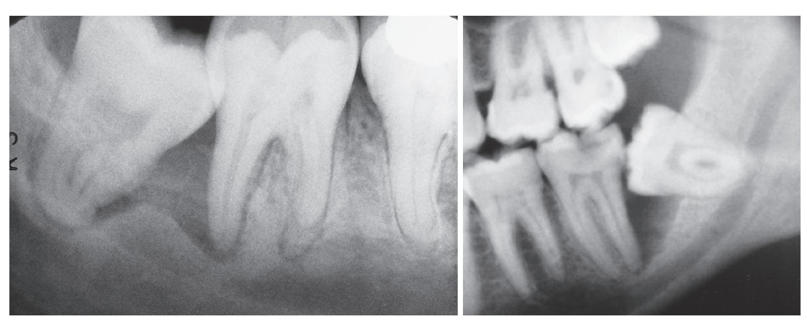

• Fig. 10.2 Radiographs showing variations of a mandibular third molar impacted against a second molar with severe bone loss resulting from periodontal disease and a third molar.

Downloaded for Tommy Tran (122427@kasascity.edu) at Kansas City University from ClinicalKey.com by Elsevier on September 12, 2025. For personal use only. No other uses without permission. Copyright ©2025. Elsevier Inc. All rights reserved.

tooth in the arch, patients commonly have gingival inflammation with apical migration of the gingival attachment on the distal aspect of the second molar. With even minor gingivitis, the causative bacteria gain access to a large portion of the root surface, which results in the early formation of periodontitis. Patients with impacted mandibular third molars often have deep periodontal pockets on the distal aspect of the second molars, even though they have normal sulcular depth in the remainder of the mouth.

The accelerated periodontal problems resulting from an impacted third molar are especially serious in the maxilla. As a periodontal pocket expands apically, it comes to involve the distal furcation of the maxillary second molar. This occurs relatively early, which makes advancement of the periodontal disease more rapid and severe. In addition, treatment of the localized periodontal disease around the maxillary second molar is more difficult because of the distal furcation involvement.

By removing the impacted third molars early, periodontal disease can be prevented, and the likelihood of bony healing and optimal bone fill into the area previously occupied by the crown of the third molar is increased.

#### **Prevention of Dental Caries**

When a third molar is impacted or partially impacted, the bacteria and other factors that cause dental caries are commonly exposed to the distal aspect of the second molar as well as to the crown of the impacted third molar. Even in situations in which no obvious communication between the mouth and the impacted third molar is visible, there may be enough communication to allow for caries initiation (Figs. 10.3 to 10.5).

#### **Prevention of Pericoronitis**

When a tooth is partially impacted with a large amount of soft tissue over the axial and occlusal surfaces, the patient frequently has one or more episodes of pericoronitis. Pericoronitis is an infection of the soft tissue around the crown of a partially impacted tooth and is usually caused by normal oral flora. In most patients, bacteria and host defenses maintain a delicate balance, but even normal host defenses cannot eliminate the bacteria (Fig. 10.6).

If host defenses are compromised (e.g., during minor illnesses such as influenza or an upper respiratory infection or because of immune-compromising drugs), infection can occur. Thus, although the impacted tooth has been present for some time without infection, if the patient experiences even a mild, transient decrease in host defenses, pericoronitis commonly results even if the patient does not have any immunologic problems.

Pericoronitis can also arise following repeated trauma from a maxillary third molar. The soft tissue that covers the occlusal surface of the partially erupted mandibular third molar (known as the *operculum*) can be traumatized and become swollen. Often the maxillary third molar further traumatizes the already swollen operculum, which causes a further increase in swelling that is now traumatized more easily. This spiraling cycle of trauma and swelling is often interrupted only by removal of the maxillary third molar.

Another common cause of pericoronitis is entrapment of food under the operculum. During eating, food debris may become lodged into the pocket between the operculum and the impacted tooth. Because this pocket cannot be cleaned, bacteria colonize it, which results in pericoronitis.

Streptococci and a large variety of anaerobic bacteria (the usual bacteria that inhabit the gingival sulcus) are the usual cause of pericoronitis. Pericoronitis can be treated initially by mechanically debriding the large periodontal pocket that exists under the operculum by using hydrogen peroxide as an irrigating solution.

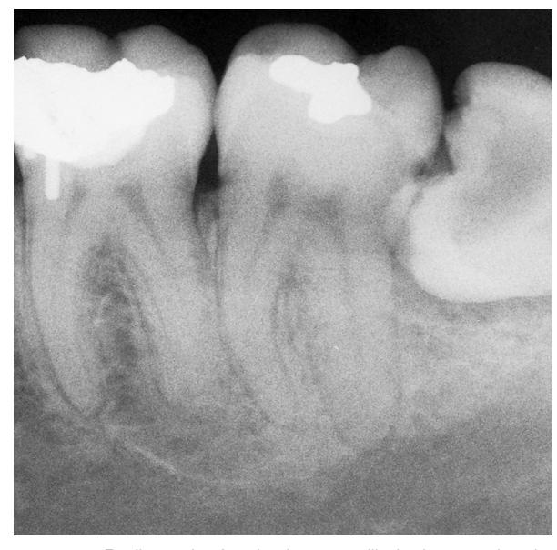

• Fig. 10.4 Radiograph of caries in a mandibular impacted molar.

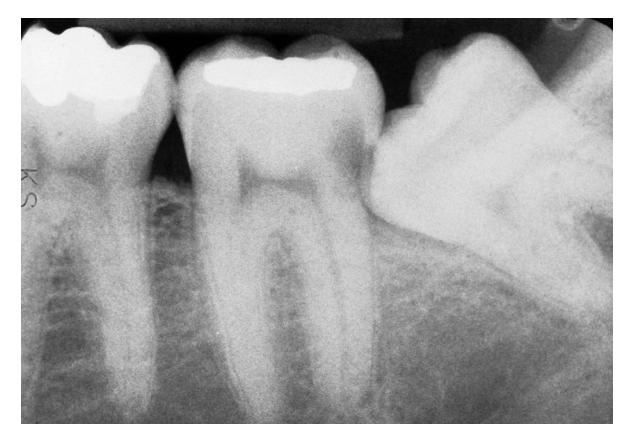

• Fig. 10.3 Radiograph of caries in a mandibular second molar resulting from the presence of an impacted third molar.

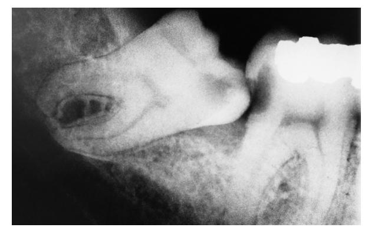

Fig. 10.5 Radiograph of caries in an impacted third molar and a second molar.

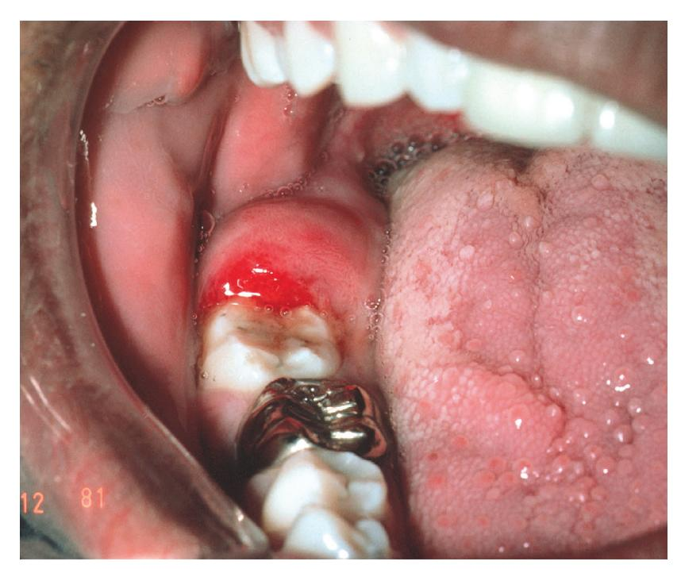

• Fig. 10.6 Pericoronitis in the area of impacted tooth #32 exhibiting classic signs of inflammation with erythema and swelling. If opposing tooth #1 is erupted, it commonly impinges on this area of swelling when teeth are brought into occlusion, causing even more pain and swelling.

Hydrogen peroxide not only mechanically removes bacteria with its foaming action, it also reduces the number of anaerobic bacteria by releasing oxygen into the usually anaerobic environment of the pocket. Other irrigants, such as chlorhexidine or iodophors, can also reduce the bacterial counts of the pocket. Even saline solutions, if delivered regularly with pressure via a syringe, can reduce bacterial numbers and flush away food debris.

Pericoronitis can present as a mild infection or as a severe infection that requires hospitalization of the patient. Just as the severity of the infection varies, the treatment and management of this problem vary from mild to aggressive.

In its mildest form, pericoronitis presents with localized tissue swelling and soreness. For patients with a mild infection, irrigation and curettage by the dentist and home irrigations by the patient usually suffice.

If the infection is slightly more severe with a large amount of local soft tissue swelling being traumatized by a maxillary third molar, the dentist should consider immediately extracting the maxillary third molar in addition to local irrigation.

For patients who have (in addition to local swelling and pain) mild facial swelling, mild trismus resulting from inflammation extending into the muscles of mastication, or a low-grade fever, the dentist should consider administering a systemic antibiotic along with irrigation delivered under pressure and extraction. The antibiotic of choice is penicillin or, in the case of penicillin allergy, clindamycin.

Pericoronitis can lead to serious fascial space infections. Because the infection begins in the posterior mouth, it can spread rapidly into the fascial spaces of the mandibular ramus and the lateral neck. If a patient has trismus (with an inability to open the mouth >20 mm), a temperature of greater than 101°F, facial swelling, pain, and malaise, the patient should be referred to an oralmaxillofacial surgeon, who is likely to admit the patient to the hospital for parenteral antibiotic administration, careful monitoring, and surgical extraction. Patients who have had one episode of pericoronitis, although managed successfully by these methods, are highly likely to continue to have episodes of pericoronitis unless the offending mandibular third molar is removed. The patient should be informed that the tooth should be removed at the earliest possible time to prevent recurrent infections. However, the mandibular third molar should not be removed until the signs and symptoms of pericoronitis have completely resolved. The incidence of postoperative complications, specifically dry socket and postoperative infection, increases if the tooth is removed during the time of active soft tissue infection. More bleeding and slower healing also occur when a tooth is removed in the presence of pericoronitis.

Prevention of pericoronitis can be achieved by removing the impacted third molars before they penetrate the oral mucosa and are visible. Although excision of surrounding soft tissue, or operculectomy, has been advocated as a method for preventing pericoronitis without removal of the impacted tooth, it is painful and usually ineffective. The soft tissue excess tends to recur because it drapes over the impacted tooth and causes regrowth of the operculum. The gingival pocket on the distal aspect also remains deep after operculectomy. The overwhelming majority of cases of pericoronitis can be prevented only by extraction of the tooth.

#### **Prevention of Root Resorption**

Occasionally an impacted tooth causes sufficient pressure on the root of an adjacent tooth to cause external root resorption (Fig. 10.7). Although the process by which root resorption occurs is not well understood, it appears to be similar to the resorption process primary teeth undergo during the eruptive process of the succedaneous teeth. Removal of the impacted tooth may result in salvage of the adjacent tooth by cemental repair. Endodontic therapy may be required to save these teeth.

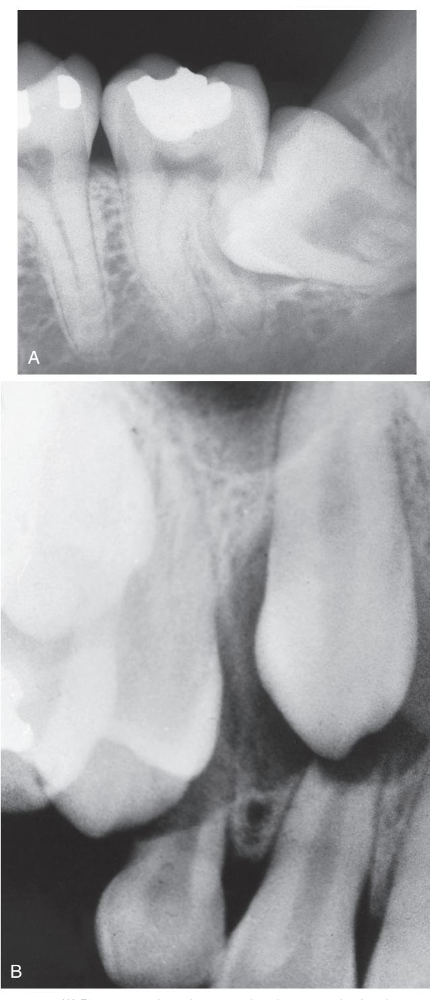

• Fig. 10.7 (A) Root resorption of a second molar as result of an impacted third molar. (B) Root resorption of maxillary lateral incisors as a result of an impacted canine.

#### **Impacted Teeth Under a Dental Prosthesis**

When a patient has an edentulous area restored, there are several reasons for removing impacted teeth in the area before the prosthetic appliance is constructed. After teeth are extracted, the alveolar process slowly undergoes resorption. This is particularly true with tissue-borne prostheses. Thus the impacted tooth becomes closer to the surface of the bone, giving the appearance of erupting. The denture may compress the soft tissue onto the impacted tooth, which is no longer covered with bone; the result is ulceration of the overlying soft tissue and the initiation of an odontogenic infection (Fig. 10.8).

Impacted teeth should be removed before a prosthesis is constructed because if the impacted teeth must be removed after construction, the alveolar ridge may be so altered by the extraction that the prosthesis becomes less functional (Fig. 10.9). In addition, if removal of impacted teeth in edentulous areas is achieved before the prosthesis is made, the patient is probably in good physical condition. If ulceration with infection occurs while waiting until the overlying bone has resorbed, it does not produce a favorable situation for extraction. If extraction is postponed, the patient will be older and more likely to be in poorer health.

Furthermore, the mandible may have become atrophic, which increases the likelihood of fracture during tooth removal (Fig. 10.10). Also, if implants are planned near the position of impacted teeth, removal is warranted to eliminate the risk of interference with the implantation procedure.

#### **Prevention of Odontogenic Cysts and Tumors**

When impacted teeth are completely within the alveolar process, the associated follicular sac is also frequently retained. Although the dental follicle maintains its original size in most patients, it may undergo cystic degeneration and become a dentigerous cyst. If the patient is closely monitored, the dentist can diagnose the cyst before it reaches large proportions (Fig. 10.11). However, unmonitored cysts can reach enormous sizes (Fig. 10.12). As a general guideline, if the follicular space around the crown of the tooth is greater than 3 mm, the preoperative diagnosis of a dentigerous cyst is reasonable.

In the same way that odontogenic cysts can occur around impacted teeth, odontogenic tumors can arise from the epithelium contained within the dental follicle. The most common odontogenic tumor to occur in this region is the ameloblastoma. Usually, ameloblastomas in this area must be treated aggressively by excision of the overlying soft tissue and of at least a portion of the mandible. Occasionally, other odontogenic tumors may occur in conjunction with impacted teeth (Fig. 10.13).

Although the overall incidence of odontogenic cysts and tumors around impacted teeth is not high, the overwhelming majority of pathologic conditions of the mandibular third molar are associated with unerupted teeth.

#### **Treatment of Pain of Unexplained Origin**

Occasionally, patients come to the dentist complaining of pain in the retromolar region of the mandible, but the reason for the pain may not be obvious. If conditions such as myofascial pain dysfunction syndrome and other facial pain disorders are excluded, and if the patient has an unerupted tooth, removal of the tooth sometimes results in resolution of the pain. In addition, delaying third molar removal to a later age may increase the chances of temporomandibular disorders.

#### **Prevention of Jaw Fractures**

An impacted third molar in the mandible occupies space that is usually filled with bone. This weakens the mandible and renders the jaw more susceptible to fracture at the site of the impacted tooth (Fig. 10.14). If the jaw fractures through the area of an

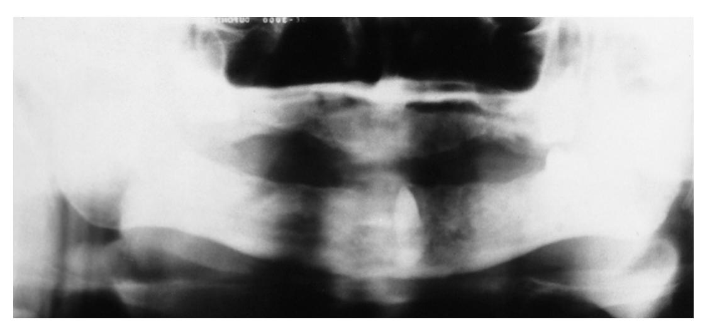

• Fig. 10.8 Impacted canine retained under a denture. The tooth is now at the surface and is causing infection.

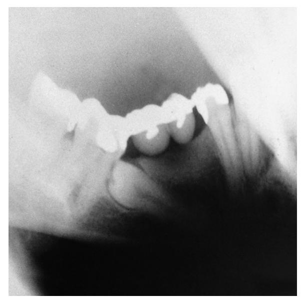

• Fig. 10.9 Impacted tooth under a fixed bridge. The tooth must be removed and therefore may jeopardize the bridge.

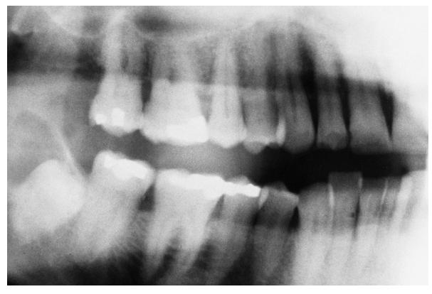

• Fig. 10.11 Small dentigerous cyst arising around an impacted tooth.

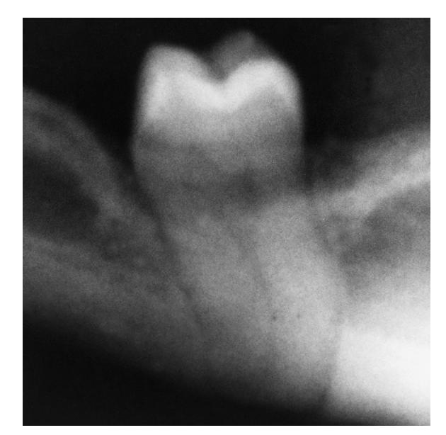

• Fig. 10.10 Impaction in an atrophic mandible, which may result in jaw fracture during extraction.

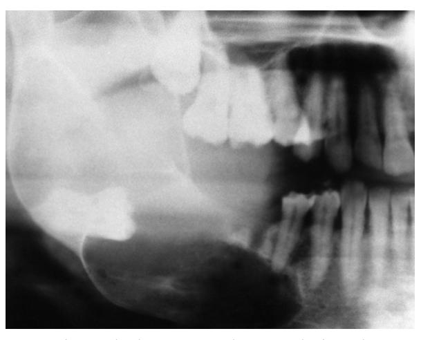

• Fig. 10.12 Large dentigerous cyst that extends from the coronoid process to the mental foramen. The cyst has displaced the impacted third molar to the inferior border of the mandible.

Downloaded for Tommy Tran (122427@kasascity.edu) at Kansas City University from ClinicalKey.com by Elsevier on September 12, 2025. For personal use only. No other uses without permission. Copyright ©2025. Elsevier Inc. All rights reserved.

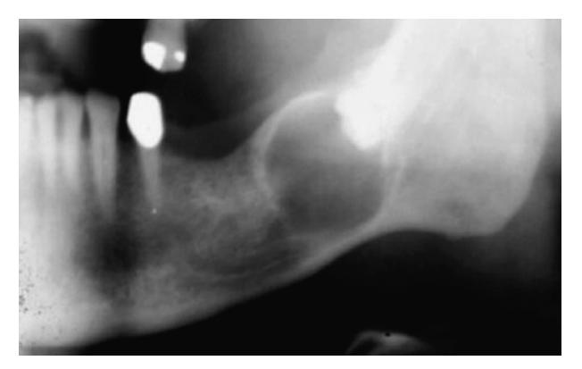

• Fig. 10.13 Ameloblastoma associated with the crown of an impacted third molar. (Courtesy Dr. Frances Gordy.)

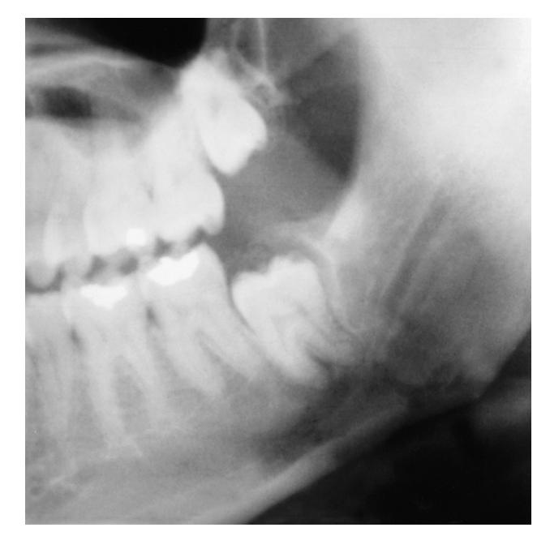

• Fig. 10.14 Fracture of a mandible, which occurred through the location of an impacted third molar.

impacted third molar, the impacted third molar is frequently removed before the fracture is reduced, and fixation is applied (see Chapter 24).

#### **Facilitation of Orthodontic Treatment**

When patients require retraction of first and second molars by orthodontic techniques, the presence of impacted third molars may interfere with the treatment. Therefore it is recommended that impacted third molars be removed before orthodontic therapy is begun.

Some orthodontic approaches to a malocclusion might benefit from the placement of retromolar implants to provide distal anchorage. When this is planned, removal of impacted lower third molars is necessary.

#### **Optimal Periodontal Healing**

As noted before, one of the most important indications for removal of impacted third molars is to preserve the periodontal health of the adjacent second molar. A great deal of attention has been given

to the two primary parameters of periodontal health after third molar surgery: (1) bone height and (2) periodontal attachment level on the distal aspect of the second molar.

Recent studies have provided information on which to base the likelihood of optimal periodontal tissue healing. Two most important factors that have been shown are (1) the extent of the preoperative infrabony defect on the distal aspect of the second molar and (2) the patient's age at the time of surgery. If a large amount of distal bone is missing because of the presence of the impacted tooth and its associated follicle, it is less likely that the infrabony pocket can be decreased. Likewise, if the patient is older, the likelihood of optimal bony healing is decreased. Patients whose third molars are removed before age 25 years are more likely to have better bone healing than those whose impacted teeth are removed after age 25 years. In the younger patient, not only is the initial periodontal healing better, but also the long-term continued regeneration of the periodontium is clearly better.

As mentioned previously, unerupted teeth may continue to erupt until age 25 years. Because the terminal portion of the eruption process occurs slowly, the chance of developing pericoronitis increases and so does the amount of contact between the third molar and the second molar. Both of these factors decrease the possibility for optimal periodontal healing. However, it should be noted that the asymptomatic completely bony impacted third molar in a patient older than age 30 years should probably be left in place unless some specific pathologic condition develops. Removal of such asymptomatic completely impacted third molars in older patients clearly results in pocket depths and alveolar bone loss, which are greater than if the tooth were left in place.

# Contraindications for Removal of Impacted Teeth

All impacted teeth should be removed unless specific contraindications justify leaving them in position. When the potential benefits outweigh the potential complications and risks, the procedure should be performed. Similarly, when the risks are greater than the potential benefits, the procedure should be deferred.

Contraindications for the removal of impacted teeth primarily involve the patient's physical status.

#### **Extremes of Age**

The third molar tooth bud can be radiographically visualized by age 6 years. Some surgeons think that removal of the tooth bud at age 7 to 9 years can be accomplished with minimal surgical morbidity and therefore should be performed at this age. However, most surgeons believe that it is not possible to accurately predict if the forming third molar will be impacted. The consensus is that very early removal of third molars should be deferred until an accurate diagnosis of impaction can be made.

The most common contraindication for the removal of impacted teeth is advanced age. As a patient ages, the bone becomes highly calcified and, therefore, less flexible and less likely to bend under the forces of tooth extraction. The result is that more bone must be surgically removed to elevate the tooth from its socket.

Similarly, as patients age, they respond less favorably and with more postoperative sequelae. An 18-year-old patient may have 1 or 2 days of discomfort and swelling after the removal of an impacted tooth, whereas a similar procedure may result in a 4- or 5-day recovery period for a 50-year-old patient.

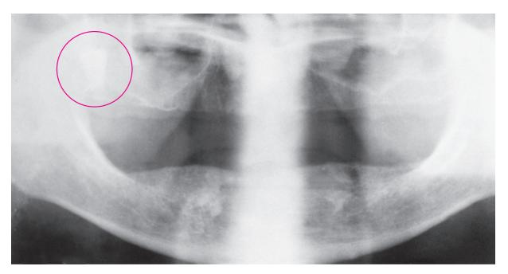

• Fig. 10.15 Impacted maxillary right third molar in a 63-year-old patient. This molar should not be extracted because it is deeply embedded and no signs of disease are present.

Finally, if a tooth has been retained in the alveolar process for many years without periodontal disease, caries, or cystic degeneration, it is unlikely that these unfavorable sequelae will occur. Therefore, in an older patient (usually >35 years) with an impacted tooth that shows no signs of disease and that has a radiographically detectable layer of overlying bone, the tooth should not be removed (Fig. 10.15). The dentist caring for the patient should check the impacted tooth radiographically every 1 or 2 years to ensure that no adverse sequelae have occurred.

If the impacted tooth shows signs of cystic formation or periodontal disease involving the adjacent tooth or the impacted tooth, if it is a single impacted tooth underneath a prosthesis with thin overlying bone, or if it becomes symptomatic as the result of infection, the tooth should be removed.

#### **Compromised Medical Status**

A compromised medical status may contraindicate the removal of an impacted tooth. Frequently, compromised medical status and advancing age go hand in hand. If the impacted tooth is asymptomatic, its surgical removal must be viewed as elective. If the patient's cardiovascular or respiratory function or host defenses for combating infection are seriously compromised, or if the patient has a serious acquired or congenital coagulopathy, the surgeon should consider leaving the tooth in the alveolar process. However, if the tooth becomes symptomatic, the surgeon should consider working with the patient's physician to plan removal of the tooth with minimal operative and postoperative medical sequelae.

### Probable Excessive Damage to Adjacent Structures

If the impacted tooth lies in an area in which its removal may seriously jeopardize adjacent nerves, teeth, or previously constructed bridges, it may be prudent to leave the tooth in place. When the dentist makes the decision not to remove a tooth, the reasons must be weighed against potential future complications. In the case of younger patients who may suffer the sequelae of impacted teeth, it may be wise to remove the tooth while taking special measures to prevent damage to adjacent structures. However, in the case of the older patient with no signs of impending complications and for whom the probability of such complications is low, the impacted tooth should not be removed. A classic example of such a case is the older patient with a potentially severe periodontal defect on the distal aspect of the second molar but in whom removal of the third molar would almost surely result in the loss of the second molar. In this situation the impacted tooth should not be removed.

#### Treatment Planning

The preceding discussion of indications and contraindications for the removal of impacted third molars has been designed to point out that there are various risks and benefits in removing impacted teeth in patients. Patients who have one or more pathologic symptoms or problems should have their impacted teeth removed. Most of the symptomatic, pathologic problems that result from impacted third molars occur because of partially erupted teeth and occur less commonly with complete bony impaction.

However, what should be done with impacted teeth before they cause symptoms or problems is less clear. In making a decision as to whether an impacted third molar should be removed, one must consider a variety of factors. First, the available room in the arch into which the tooth can erupt must be considered. If adequate room exists, the clinician may choose to defer removal of the tooth until eruption is complete. Second, the status of the impacted tooth and the age of the patient should be considered. It is critical to remember that the average age of complete eruption is 20 years but that eruption may continue to occur up to age 25 years. Occasionally, a tooth that appears to be a mesioangular impaction at age 17 years may eventually become more vertical and erupt into the mouth. Also, if the patient's second molar is seriously diseased and is likely to require removal, it may be wise to leave the third molar in place; if the second molar is removed, the stair molar can often be guided into good occlusion. If insufficient room exists to accommodate the tooth and a soft tissue operculum exists over the posterior aspect, then pathologic sequelae are likely to occur.

Although there have been some attempts at making very early predictions of whether a tooth is going to be impacted, these efforts have not yet resulted in a reliable predictive model. However, by the time the patient reaches age 18 years, the dentist can reasonably predict whether there will be adequate room for tooth eruption with sufficient clearance of the anterior ramus to prevent soft tissue operculum formation. At this time, if surgical removal is chosen, soft tissue and bone tissue healing will occur at its maximal level. At age 18 or 19 years, if the diagnosis for inadequate room for functional eruption can be made, then the asymptomatic third molar can be removed, and the long-term periodontal health of the second molar will be optimized.

# **Classification Systems for Mandibular** Third Molar Impactions

Removal of impacted teeth can be relatively straightforward or extremely difficult, even for the experienced surgeon. To determine the degree of difficulty preoperatively, the surgeon should methodically examine the clinical circumstances. The primary factor determining the difficulty of the removal is accessibility. Accessibility is determined by adjacent teeth or other structures impairing access or the extraction delivery pathway. This includes assessing the ease of exposing the tooth, preparing a pathway for its delivery, and preparing a purchase point. With careful classification of the impacted teeth using a variety of systems, the surgeon can approach the proposed surgery in a methodical fashion and predict whether any extraordinary surgical approaches will be necessary or if the patient will encounter certain postoperative problems.

The majority of classification schemes are based on an analysis of a radiograph. The panoramic radiograph is the imaging of choice for planning removal of impacted third molars. In some

circumstances, a well-positioned periapical radiograph is adequate as long as all parts of the impacted tooth are visible along with important adjacent anatomy. When the roots of a lower third molar appear very close to, or superimpose over, the inferior alveolar canal on a panoramic radiograph, a cone-beam computed tomography (CT) scan may be useful. This imaging technique can accurately show the relationship of the roots to the canal.

For each patient, the surgeon should carefully analyze the factors discussed in this section. By considering all of these factors, the dentist can assess the difficulty of the surgery and elect to extract the impacted teeth that are within his or her skill level. However, for the patient's well-being and the dentist's peace of mind, the patient should be referred to a specialist if a tooth presents a difficult surgical situation or if the dentist cannot offer optimal intraoperative pain and anxiety control.

#### Angulation

The most commonly used classification system with respect to treatment planning uses a determination of the angulation of the long axis of the impacted third molar with respect to the long axis

of the adjacent second molar. Teeth at certain inclinations have ready-made pathways for removal, whereas pathways for teeth of other inclinations require the removal of substantial amounts of bone and/or tooth division. This classification system provides an initial useful evaluation of the difficulty of extractions but is not sufficient by itself to fully define the difficulty of molar removal.

The impaction generally acknowledged as the least difficult impaction to remove is the mesioangular impaction, particularly when only partially impacted (Fig. 10.16). The crown of the mesioangular-impacted tooth is tilted toward the second molar in a mesial direction. This type of impaction is the most commonly seen, making up approximately 43% of all impacted lower third molars.

When the long axis of the third molar is perpendicular to the second molar, the impacted tooth is considered horizontal (Fig. 10.17). This type of impaction is usually considered more difficult to remove compared with mesioangular impaction. Horizontal impactions occur less frequently, being seen in approximately 3% of all mandibular impactions.

In vertical impaction, the long axis of the impacted tooth runs parallel to the long axis of the second molar. This impaction occurs

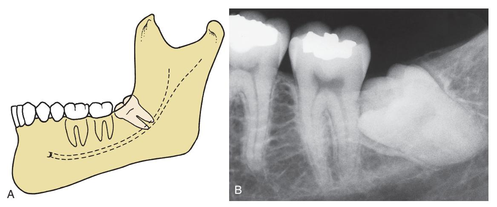

Fig. 10.16 (A) Mesioangular impaction—the most common and easiest impaction to remove. (B) Mesio-angular impaction is usually in proximity to the second molar.

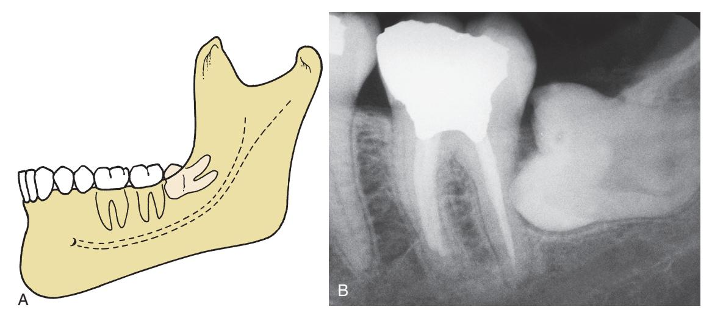

• Fig. 10.17 (A) Horizontal impaction—an uncommon and more difficult to remove impaction than a mesioangular impaction. (B) The occlusal surface of the horizontal impacted third molar is usually immediately adjacent to the root of the second molar, which often produces early severe periodontal disease.

Downloaded for Tommy Tran (122427@kasascity.edu) at Kansas City University from ClinicalKey.com by Elsevier on September 12, 2025. For personal use only. No other uses without permission. Copyright ©2025. Elsevier Inc. All rights reserved.

with the second greatest frequency, accounting for approximately 38% of all lower third molar impactions, and is considered third in ease of removal (Fig. 10.18).

Finally, distoangular impaction involves the tooth with the most difficult angulation for removal (Fig. 10.19). In distoangular impaction the long axis of the third molar is distally or posteriorly angled away from the second molar. This impaction is the most difficult to remove because the tooth has a withdrawal pathway that runs into the mandibular ramus, and its removal requires significant surgical intervention. Distoangular impactions occur uncommonly and account for only approximately 6% of all impacted third molars. Erupted third molars may also be in a distoangular position. When this occurs, these teeth are much more difficult to remove compared with other erupted teeth. The reason is that the third molar's mesial root is very close to the root of the second molar.

In addition to the relationship between the angulation of the long axes of the second and third molars, teeth also can be angled in buccal, lingual, or palatal directions. When approaching lower third molars, the possible presence of a high-riding lingual nerve still makes a buccal approach appropriate, even when the tooth is inclined toward the lingual aspect.

Rarely, a transverse impaction occurs; that is, the tooth erupting in an absolutely horizontal position in the buccolingual direction. The occlusal surface of the tooth can face the buccal or lingual direction. To determine buccal or lingual version accurately, the dentist must take a perpendicular occlusal radiograph or obtain a cone-beam CT scan. However, this determination is usually not necessary because the surgeon can make this identification early in the operation, and the buccal or lingual position of the tooth does not greatly influence the approach to the surgery.

#### **Relationship to Anterior Border of Ramus**

Another method for classifying impacted mandibular third molars is based on the amount of impacted tooth that is covered with the bone of the mandibular ascending ramus. This classification is known as the *Pell and Gregory classification*, also referred to as *Pell and Gregory classes 1, 2,* and *3*. For this classification, it is important that the surgeon carefully examine the relationship

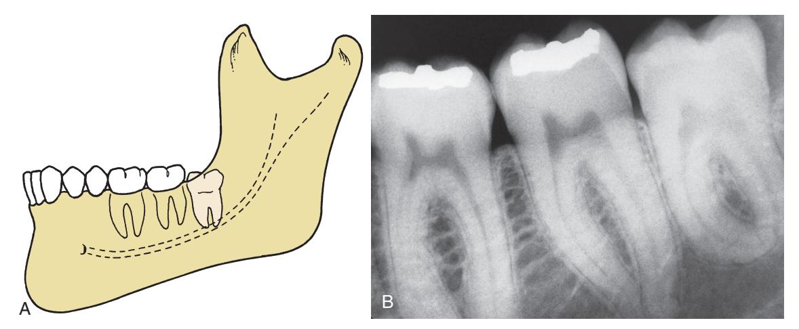

Fig. 10.18 (A) Vertical impaction—the second most common impaction and the second most difficult to remove. (B) Vertical impaction is frequently covered on its posterior aspect with bone of the anterior ramus of the mandible.

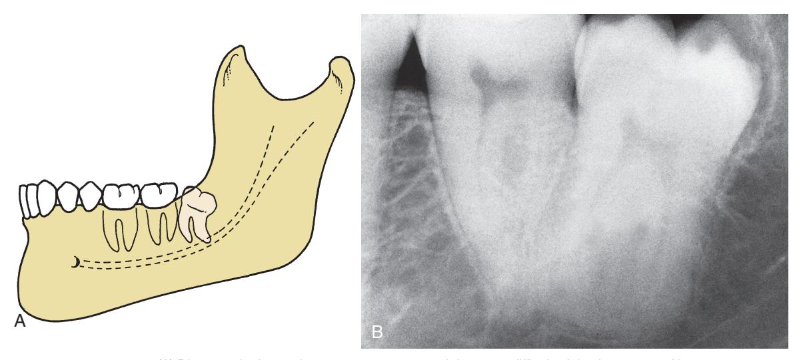

• Fig. 10.19 (A) Distoangular impaction — an uncommon and the most difficult of the four types of impac-tions to remove. (B) The occlusal surface of distoangular impaction is usually embedded in the ramus of the mandible and requires significant bone removal for extraction.

Downloaded for Tommy Tran (122427@kasascity.edu) at Kansas City University from ClinicalKey.com by Elsevier on September 12, 2025. For personal use only. No other uses without permission. Copyright ©2025. Elsevier Inc. All rights reserved.

between the tooth and the anterior part of the ramus. If the mesiodistal diameter of the crown is completely anterior to the anterior border of the mandibular ramus, it is in a class 1 relationship. If the tooth is angled in a vertical direction, the chances for the tooth to erupt into a normal position are good, provided the root formation is incomplete (Fig. 10.20).

If the tooth is positioned posteriorly so that approximately one half is covered by the ramus, the relationship of the tooth with the ramus is class 2. In the class 2 situation, the tooth cannot erupt completely free from bone over the crown and the distal aspect because a small shelf of bone overlies the distal portion of the tooth (Fig. 10.21). A class 3 relationship between the tooth and ramus occurs when the tooth is located completely within the mandibular ramus (Fig. 10.22). Obviously the class 1 relationship provides the greatest accessibility to the impacted tooth; therefore such a tooth is the most straightforward to remove. The class 3 relationship provides the least accessibility and thus presents the greatest difficulty.

#### Relationship to the Occlusal Plane

The depth of the impacted tooth compared with the height of the adjacent second molar provides the next classification system for

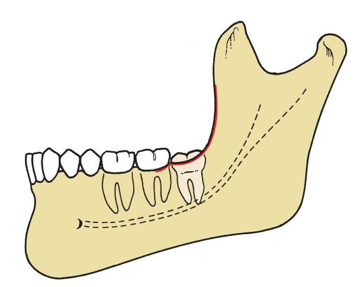

• Fig. 10.20 Pell and Gregory class 1 impaction. The mandibular third molar has sufficient anteroposterior room (i.e., anterior-to-anterior border of ramus) to erupt.

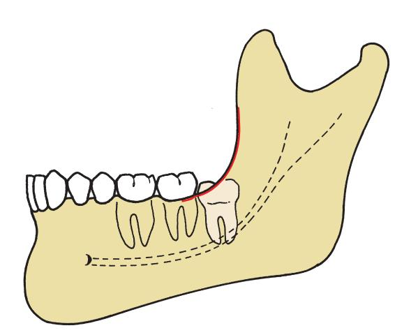

• Fig. 10.21 Pell and Gregory class 2 impaction. Approximately half is covered by the anterior portion of the ramus of the mandible.

determining the difficulty of impaction removal. This classification system was also suggested by Pell and Gregory and is called the *Pell and Gregory A, B,* and *C classification*. In this classification the degree of difficulty is measured by the thickness of overlying bone; that is, the degree of difficulty increases as the depth of the impacted tooth increases. As the tooth becomes less accessible and it becomes more difficult to section the tooth and to prepare purchase points, the overall difficulty of the operation substantially increases.

A class A impaction is one in which the occlusal surface of the impacted tooth is level or nearly level with the occlusal plane of the second molar (Fig. 10.23). A class B impaction involves an impacted tooth with an occlusal surface between the occlusal plane and the cervical line of the second molar (Fig. 10.24). Finally, the class C impaction is one in which the occlusal surface of the impacted tooth is below the cervical line of the second molar (Fig. 10.25).

The three classification systems discussed above can be used together to determine the difficulty of an extraction. For example, a mesioangular impaction with a class 1 ramus and a class A depth is usually straightforward to remove (Fig. 10.26). However, as the ramus relationship changes to a class 2 and the depth of the impaction increases to a class B, the degree of difficulty becomes

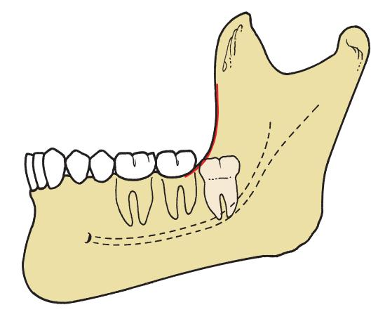

• Fig. 10.22 Pell and Gregory class 3 impaction. The impacted third molar is completely embedded in the bone of the ramus of the mandible.

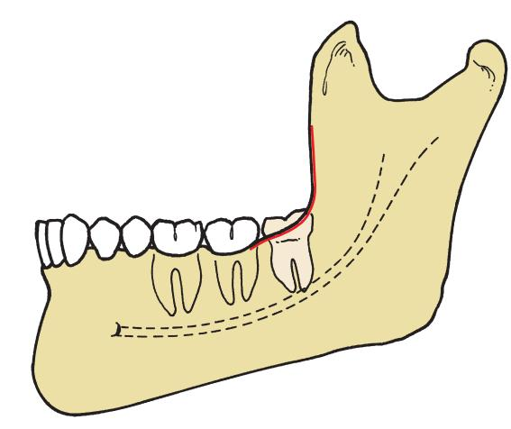

• Fig. 10.23 Pell and Gregory class A impaction. The occlusal plane of the impacted tooth is at the same level as the occlusal plane of the second molar.

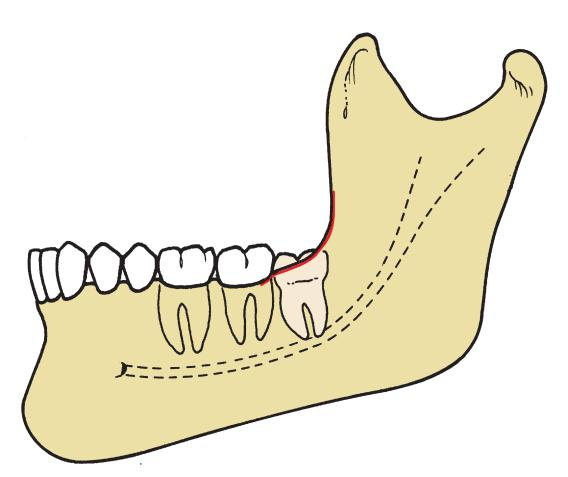

• Fig. 10.24 Pell and Gregory class B impaction. The occlusal plane of the impacted tooth is between the occlusal plane and the cervical line of the second molar.

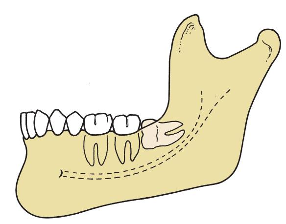

• Fig. 10.27 Horizontal impaction with class 2 ramus relationship and class B depth makes it moderately difficult to extract.

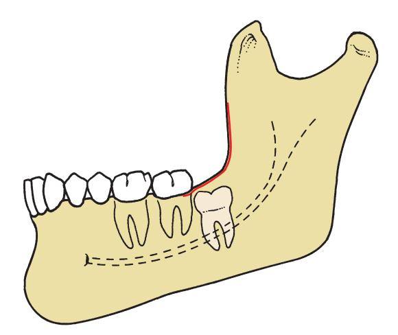

• Fig. 10.25 Pell and Gregory class C impaction. The impacted tooth is below the cervical line of the second molar.

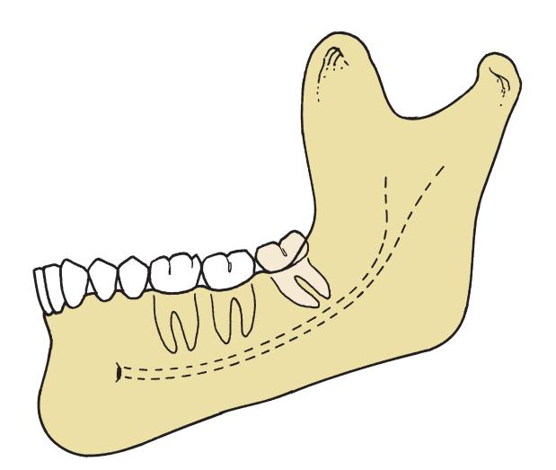

• Fig. 10.26 Mesioangular impaction with class 1 ramus relationship and class A depth. All three classifications make this the easiest type of impaction to remove.

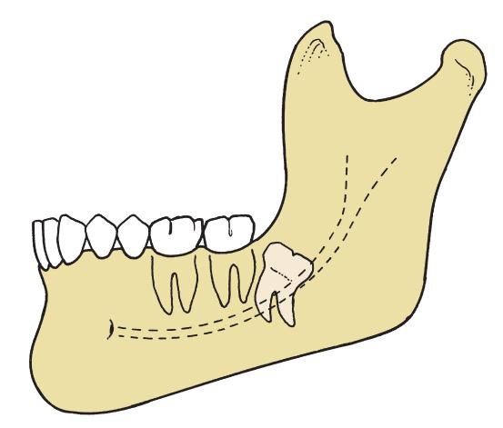

• Fig. 10.28 Impaction with a distoangular class 3 ramus relationship and class C depth makes the tooth extremely difficult to remove safely.

much greater. A horizontal impaction with a class 2 ramus relationship and a class B depth is a moderately difficult extraction and one that most experienced general practitioners do not want to attempt (Fig. 10.27). Finally, the most difficult of all impactions is a distoangular impaction with a class 3 ramus relationship at a class C depth. Even specialists view removing this tooth as a surgical challenge (Fig. 10.28).

#### **Root Morphology**

Just as the root morphology of the erupted tooth has a strong influence on the degree of difficulty of a closed extraction, root morphology plays a major role in determining the degree of difficulty of the removal of an impacted tooth. Several factors must be considered when assessing the morphologic array of the root.

The first consideration is the length of the root. As previously discussed, the optimal time for the removal of an impacted tooth is when the root is one-third to two-thirds formed. When this is the case, the ends of the roots are blunt (Fig. 10.29). If the tooth is not removed during the formative stage and the entire length

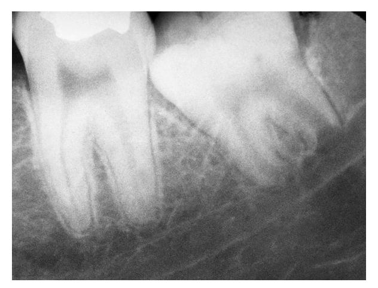

 $\bullet$  Fig. 10.29 Roots that are two-thirds formed, which are less difficult to remove than if fully formed.

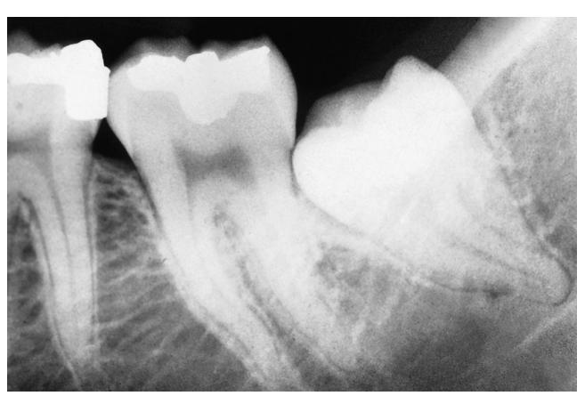

• Fig. 10.31 Fused roots with a conical shape.

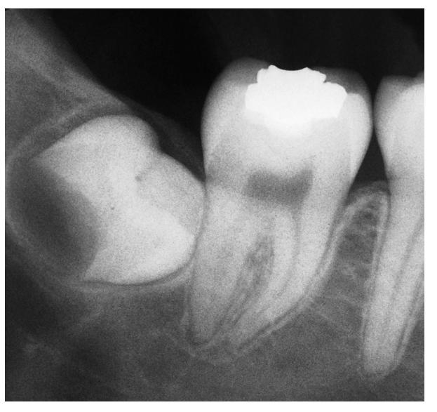

• Fig. 10.30 Lack of root development. If extraction is attempted, the crown will often roll around in the socket, making it difficult to remove.

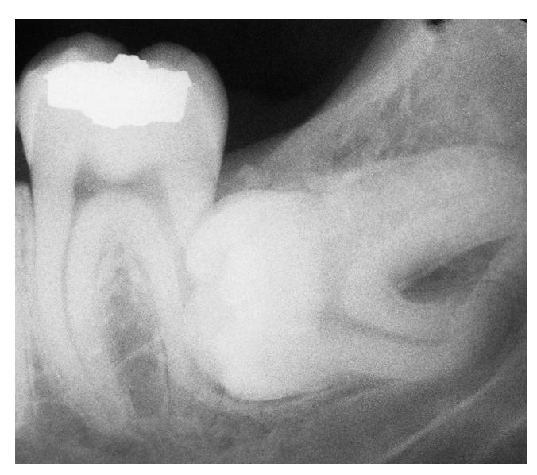

Fig. 10.32 Divergent roots with severe curvature. Such roots are more difficult to remove.

of the root develops, the possibility increases for distorted root morphology, leading to fracture of the root tips during extraction or to the root tips impeding root delivery. If the root development is limited (i.e., less than one-third complete), the tooth is often more difficult to remove because it tends to roll in its socket like a marble, which prevents routine elevation (Fig. 10.30). The next factor to be assessed is whether the roots are fused into a single, conical root (Fig. 10.31) or whether they are separate and distinct roots. The fused, conical roots (Fig. 10.32).

The curvature of the tooth roots also plays a role in the difficulty of the extraction. Severely curved or dilacerated roots are more difficult to remove than are straight or slightly curved roots (see Fig. 10.32). The surgeon should carefully examine the apical area of impacted teeth on the radiograph to assess the presence of small, abnormal, and sharply hooked roots that will probably fracture if the surgeon does not give them special consideration. Even with extra focus during surgery, hooked roots are a challenge to remove. The direction of the tooth root curvature is also important to examine preoperatively. During removal of a mesioangular impaction, roots that are curved gently in the distal direction (following along the pathway of extraction) can be removed without the force that can fracture them. However, if the roots of a mesioangular impaction are straight or curved mesially, the roots commonly fracture if the tooth is not sectioned before being delivered.

The total width of the roots in the mesiodistal direction should be compared with the width of the tooth at the cervical line. If the tooth root width is greater, the extraction will be more difficult. More bone must be removed, or the tooth should be sectioned before extraction.

Finally, the surgeon should assess the periodontal ligament space. Although the periodontal ligament space is of normal dimensions in most patients, sometimes it is wider or narrower. The wider the periodontal ligament space, typically the more straightforward the tooth is to remove (Fig. 10.33). However, older patients, especially those older than 40 years, tend to have a much narrower periodontal ligament space that increases the difficulty of the extraction.

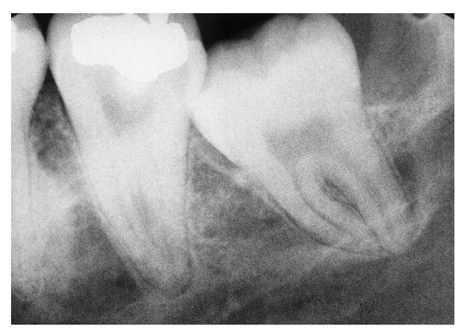

• Fig. 10.33 Wide periodontal ligament space. The widened space makes the extraction process less difficult.

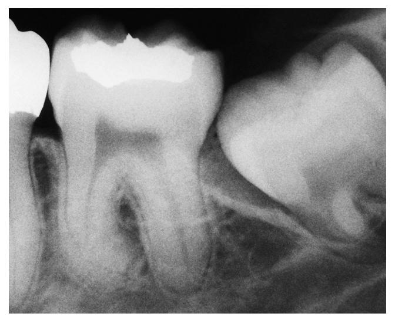

• Fig. 10.34 Large follicular sac. When the space of the sac is large, the amount of bone removal required is decreased.

#### Size of the Follicular Sac

The size of the follicle around the impacted tooth can help determine the difficulty of the extraction. If the follicular sac is wide (almost cystic in size), much less bone must be removed, which makes the tooth more straightforward to extract (Fig. 10.34). (Young patients are more likely to have large follicles, which is another factor that makes extractions less complex in younger patients.) However, if the follicular space around the crown of the tooth is narrow or nonexistent, the surgeon must create space around the crown, increasing the difficulty of the procedure and the time required to remove the tooth.

#### **Density of Surrounding Bone**

The density of bone surrounding the tooth plays a role in determining the difficulty of the extraction. Although some clues can be seen on the radiographs, variations in radiographic density and angulation render bone density interpretations based on radiographs unreliable. Bone density is best determined by the patient's age. Patients who are 25 years old or younger have bone densities favorable for tooth removal. The bone is less dense, is more likely to be pliable, and expands and bends somewhat, which allows the socket to be expanded by elevators or by luxation forces applied to the tooth itself. In addition, the less dense bone is more straightforward to cut with a dental burr and can be removed more rapidly compared with denser bone.

Conversely, patients who are older than 25 years have much denser bone with decreased flexibility and ability to expand. In these patients the surgeon must remove all interfering bone because it is not possible to expand the bony socket. In addition, as the bone increases in density, it becomes more difficult to remove with a dental burr, and the bone removal process takes longer. Also, excessive force is more likely to fracture very dense bone compared with less dense bone of a similar cross-section.

Gender also plays a role in bone density; males, particularly larger ones, in general have greater bone density than females.

#### **Contact With Mandibular Second Molar**

If space exists between the second molar and the impacted third molar, the extraction will be more straightforward to approach because damage to the second molar is less likely. However, if the tooth is a distoangular or horizontal impaction, it is frequently in direct contact with the adjacent second molar. To remove the third molar safely without injuring the second molar, the surgeon must be cautious with pressure from elevators and with the burr when removing bone. If the second molar has caries or a large restoration or has been endodontically treated, the surgeon must take special care not to fracture the restoration or a portion of the carious crown. The patient should be forewarned of this possibility (see Fig. 10.17B).

#### **Relationship to Inferior Alveolar Nerve**

Impacted mandibular third molars frequently have roots that are superimposed on the inferior alveolar canal on radiographs. Although the canal is usually on the buccal aspect of the tooth, it is still in proximity to the roots. Therefore one of the potential sequelae of impacted third molar removal is damage to the inferior alveolar nerve. This commonly results in some altered sensation (paresthesia or anesthesia) of the lower lip and chin on the injured side. Although this altered sensation is usually brief (lasting only a few days), it may extend for weeks or months; on rare occasions it can be permanent. The duration depends on the extent of nerve damage. If the root ends of the tooth appear to be close to the inferior alveolar canal on a radiograph, the surgeon must take special care to avoid injuring the nerve (Fig. 10.35), which greatly increases the difficulty of the procedure. The availability of cone-beam CT scans makes preoperative assessment of the root and canal relationship much easier to view, which helps guide surgical decisions.

#### Nature of Overlying Tissue

The preceding systems classify factors that make third molar extraction more straightforward or more difficult. The classification system discussed below does not fit into these categories. However, this classification is the system used by most dental insurance companies and is the one by which the surgeon charges for the services.

The dental insurance companies separate types of third molar impactions into three categories: (1) soft tissue, (2) partial bony, and (3) full bony. An impaction is defined as soft tissue impaction

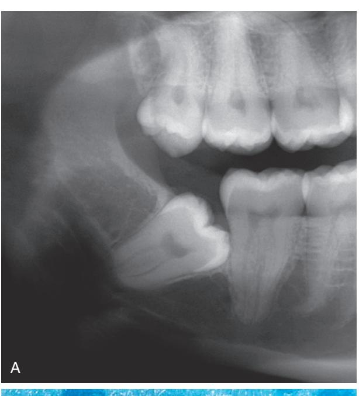

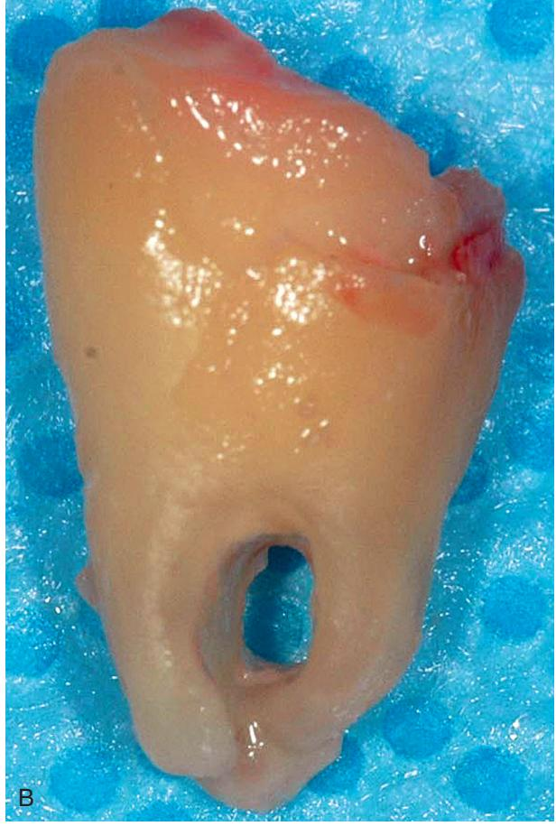

• Fig. 10.35 (A) Radiographic view of the mandibular third molar that suggests proximity to the inferior alveolar nerve. (B) Hole through the root of the third molar seen in the radiograph after removal. During removal, the inferior alveolar neurovascular bundle was severed. (Courtesy Dr. Edward Ellis III.)

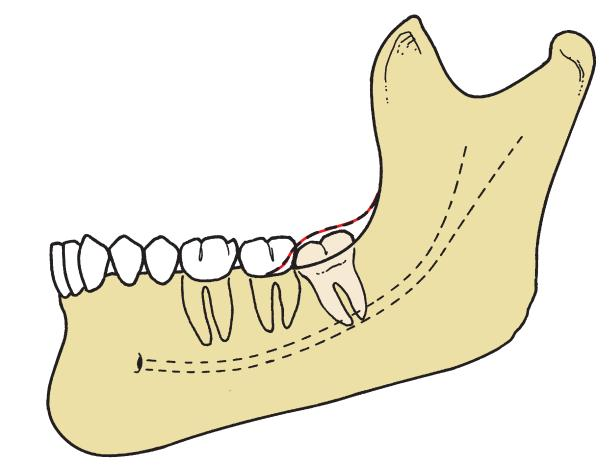

• Fig. 10.36 Soft tissue impaction in which the crown of the tooth is covered by soft tissue only and can be removed without bone removal.

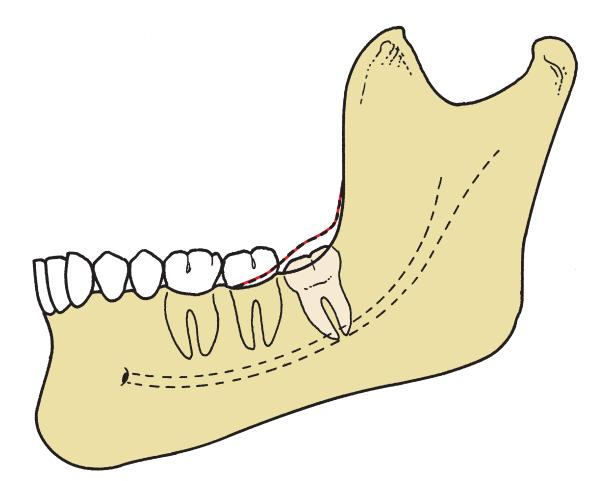

• Fig. 10.37 Partial bony impaction in which part of the tooth—usually a posterior aspect—is covered with bone and requires bone removal or tooth sectioning for extraction.

when the height of the contour of the tooth is above the level of alveolar bone and the superficial portion of the tooth is covered only by soft tissue (Fig. 10.36). To remove soft tissue impaction, the surgeon must incise the soft tissue and reflect a soft tissue flap to obtain access to the tooth to elevate it from its socket. The soft tissue impaction is usually the most straightforward of the three extractions but can be complex, depending on factors discussed in the preceding sections.

The partial bony impaction occurs when the superficial portion of the tooth is covered by soft tissue, but at least a portion of the height of the contour of the tooth is below the level of the surrounding alveolar bone (Fig. 10.37). To remove the tooth, the surgeon must incise the soft tissue, reflect a soft tissue flap, and remove the bone above the height of the contour. The surgeon may need to divide the tooth in addition to removing bone. A partial bony impacted tooth is commonly more difficult to remove than a full bony impacted third molar.

The complete bony impaction is an impacted tooth that is completely encased in bone, so the tooth is not visible when the surgeon reflects the soft tissue flap (Fig. 10.38). To remove the tooth, extensive amounts of bone must be removed, and the tooth almost always requires sectioning.

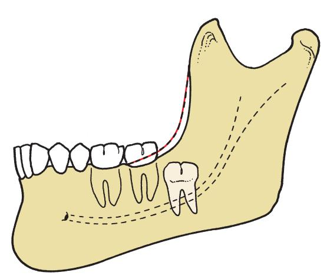

• Fig. 10.38 Complete bony impaction in which the tooth is completely covered with bone and requires extensive removal of bone for extraction.

## BOX 10.1 Factors That Make Impaction Surgery Less Difficult

- 1. Mesioangular position
- 2. Pell and Gregory class 1 ramus
- 3. Pell and Gregory class A depth
- 4. Roots one-third to two-thirds formeda
- Fused conical roots
- 6. Wide periodontal ligamenta
- 7. Large folliclea
- 8. Elastic bonea
- 9. Separated from second molar
- 10. Separated from inferior alveolar nervea
- 11. Soft tissue impaction

aPresent in the young patient.

### BOX 10.2 Factors That Make Impaction Surgery More Difficult

- 1. Distoangular position
- 2. Pell and Gregory class 2 or 3 ramus
- 3. Pell and Gregory class B or C depth
- 4. Long, thin rootsa
- 5. Divergent, curved roots
- 6. Narrow periodontal ligament
- 7. Thin folliclea
- 8. Dense, inelastic bonea
- 9. Contact with second molar
- 10. Close to inferior alveolar canal
- 11. Complete bony impactiona

aPresent in older patients.

Although this classification is extensively used, it frequently has no relationship to the difficulty of the extraction or to the likelihood of complications (Boxes 10.1 and 10.2). The parameters of angulation, ramus relationship, root morphology, and patient age are more relevant to treatment planning than the system used by third-party dental insurers. The surgeon must use all of the information available to determine the difficulty of the proposed surgery.

# Classification Systems for Maxillary Third Molar Impactions

The classification systems for the maxillary impacted third molar are essentially the same as for the impacted mandibular third molar. However, several distinctions and additions must be made to more accurately assess the difficulty of removal during the treatment planning phase of the procedure.

Concerning angulation, the three types of maxillary third molars are (1) vertical impaction (Fig. 10.39A), (2) distoangular impaction (Fig. 10.39B), and (3) mesioangular impaction (Fig. 10.39C). Vertical impaction occurs approximately 63% of the time, distoangular impaction approximately 25% of the time, and mesioangular impaction approximately 12% of the time. Rarely, other positions such as a transverse, inverted, or horizontal are encountered; these unusual positions account for less than 1% of impacted maxillary third molars.

The same angulations in mandibular third molar extractions cause opposite degrees of difficulty for maxillary third molar extractions. Vertical and distoangular impactions are the less complex to remove, whereas mesioangular impactions are the most difficult (exactly the opposite of impacted mandibular third molars). Mesioangular impactions are more difficult to remove because the bone that overlies the impaction and requires removal or expansion is on the posterior aspect of the tooth and is much thicker than in vertical or distoangular impaction. In addition, access to the mesioangularly positioned tooth is more difficult if an erupted second molar is in place.

The position of the maxillary third molar in a buccopalatal direction is also important for determining the difficulty of the removal. Most maxillary third molars are angled toward the buccal aspect of the alveolar process; this makes the overlying bone in that area thin and therefore straightforward to remove or expand. Occasionally the impacted maxillary third molar is positioned toward the palatal aspect of the alveolar process. This makes the tooth much more difficult to extract because greater amounts of bone must be removed to gain access to the underlying tooth, and an approach from the palatal aspect risks injury to nerves and vessels of the palatine foramina. A combination of radiographic assessment and clinical digital palpation of the tuberosity area can usually help determine whether the maxillary third molar is in the buccopalatal position. If the tooth is positioned toward the buccal aspect, a palpable bulge is found in the area; if the tooth is palatally positioned, a bony deficit is found in that region. If a more palatal position is determined by clinical examination, the surgeon must anticipate a longer, more involved procedure.

The most common factor that causes difficulty with maxillary third molar removal is a thin, nonfused root with erratic curvature (Fig. 10.40). The majority of maxillary third molars have fused roots that are conical. However, the surgeon should carefully examine the preoperative radiograph to ensure that an unusual root pattern is not present. The surgeon should also check the periodontal ligament because the wider the ligament space, the less difficult the tooth is to remove. In addition, similar to mandibular third molars, the periodontal ligament space tends to narrow as the patient ages.

The follicle surrounding the crown of the impacted tooth also has an influence on the difficulty of the extraction. If the follicular

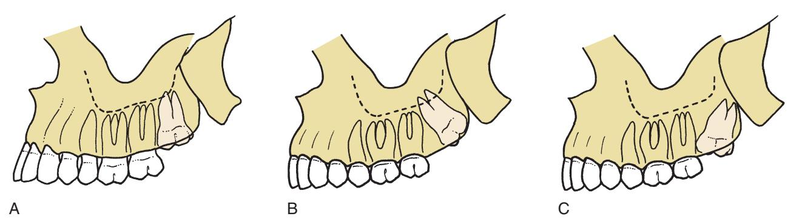

• Fig. 10.39 (A) Vertical impaction of a maxillary third molar. This angle accounts for 63% of impactions. (B) Distoangular impaction of a maxillary third molar. This angle accounts for 25% of impactions. (C) Mesioangular impaction of a maxillary third molar. This angle accounts for 12% of impactions.

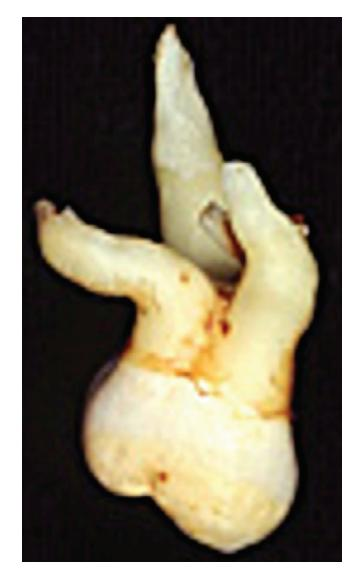

• Fig. 10.40 The maxillary third molar has the most erratic and variable root formation of all teeth.

space is broad, the tooth will be more readily removed than if the follicular space is thin or nonexistent.

Bone density is also an important factor in maxillary impaction removal and is closely related to the age of the patient. The younger the patient, the more elastic and expandable the bone is surrounding the impacted third molar.

The relationship to the adjacent second molar tooth also influences the difficulty of the extraction. Extraction may require that additional bone be removed to displace the tooth tucked under the height of the contour of the closely adjacent second molar. In addition, because the use of elevators is common in the removal of maxillary third molars, the surgeon must be aware of the existence of large restorations or caries in the adjacent second molar. Injudicious use of elevators can result in the fracture of restorations or brittle crowns of teeth.

The type of impaction, with respect to overlying tissue, also must be considered for maxillary third molars. The insurance industry classification system used for maxillary teeth is the same as the system that is used for mandibular teeth: soft tissue impaction, partial bony impaction, and complete bony impaction. The definitions of these types of impactions are precisely the same as those used for mandibular third molars. Two additional factors influence the difficulty of maxillary third molar removal but do not exist for mandibular third molars. Both factors are related to the structure and position of the maxillary sinus. First, the maxillary sinus is commonly in intimate contact with the roots of molars; and, frequently, the maxillary third molar actually forms a portion of the posterior sinus wall. If this is the case, removal of the maxillary third molar may result in maxillary sinus complications such as sinusitis or an oroantral fistula. The presence of the maxillary sinus does not necessarily make the removal of the impacted tooth more difficult, but it increases the likelihood of postoperative complications.

Second, in maxillary third molar removal, the tuberosity of the posterior maxilla can be fractured. This is true even when the third molar is erupted or if an erupted second molar is the most distal remaining tooth. Such fractures are possible, especially when dense and nonelastic bone exists, as in older patients. In addition, a large maxillary sinus makes the surrounding alveolar bone thin and more susceptible to fracture when excessive force is applied. A root morphology that has divergent roots requires greater force to remove and increases the likelihood of bone fracture. In addition, mesioangular impactions increase the possibility of fractures (see Fig. 10.39C). In these situations, the overlying tuberosity is heavier, but the surrounding bone is usually thinner. When the surgeon prepares a purchase point at the mesiocervical line, fracture of the tuberosity becomes a greater risk if (1) the bone is nonelastic (as in older patients), (2) the tooth is multirooted with large bulbous roots (as in older patients), (3) the maxillary sinus is large and greatly pneumatized to include the roots of the impacted third molar, or (4) the surgeon uses excessive force to elevate the tooth. Management of the fractured tuberosity is discussed in Chapter 25.

#### **Removal of Other Impacted Teeth**

After mandibular and maxillary third molars, the next most com-monly impacted tooth is the maxillary canine.

If the dentist decides that the tooth needs to be removed rather than orthodontically repositioned, it must be determined whether the tooth is positioned labially, toward the palate, or in the middle of the alveolar process. If the tooth is on the labial aspect, a soft tissue flap can be reflected to allow removal of the overlying bone and the tooth. However, if the tooth is on the palatal aspect or in the intermediate buccolingual position, it is much more difficult to remove. Therefore, when assessing the impacted maxillary canine for removal, the surgeon's most important assessment is of the

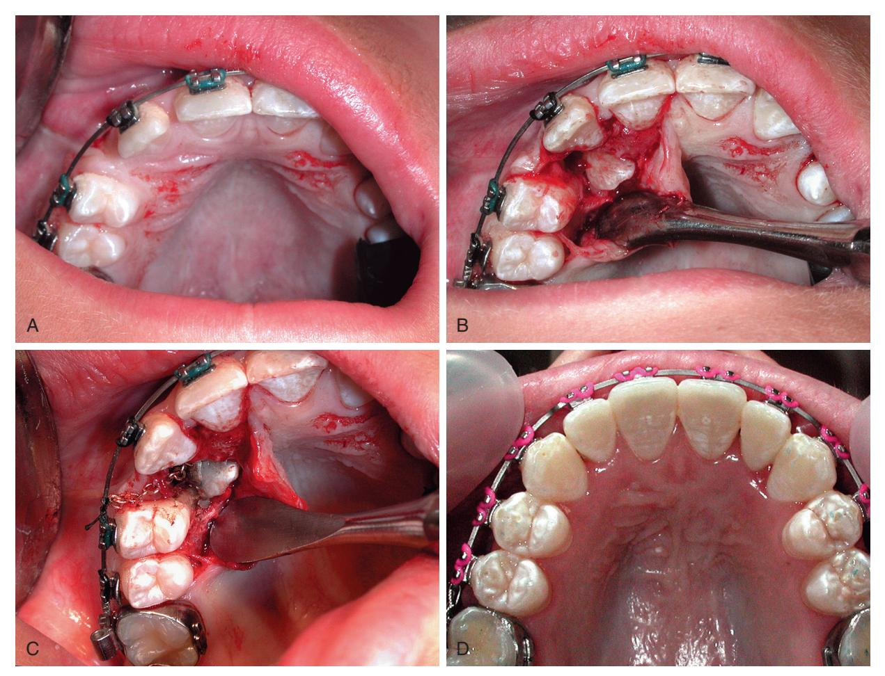

• Fig. 10.41 (A) Labially positioned impacted maxillary canine. The tooth should be uncovered with an apically positioned flap procedure to preserve the attached gingiva. (B) The mucoperiosteal flap is outlined, allowing for repositioning of the keratinized mucosa over the exposed tooth. When the flap is reflected, the thin overlying bone is removed. (C) The tissue is retracted and bracket bonded to the tooth with an attached gold chain. The flap is apically sutured to the tooth. (D) After 6 months the exposed tooth is in the desired position with the broad zone of the attached gingiva. (Courtesy Dr. Myron Tucker.)

buccolingual position of the tooth. A cone-beam CT is the best way to make this assessment.

Similar considerations are necessary for other impactions such as those of mandibular premolars and supernumerary teeth. The supernumerary tooth in the midline of the maxilla, called a *mesiodens*, is almost always found on the palate and should be approached from the palatal direction for removal.

When a buried canine is positioned in such a way that orthodontic manipulation can assist the proper positioning, the tooth can be exposed and bracketed. A flap is created to allow the soft tissue to be repositioned apically should this be required for maximum keratinized tissue management. The overlying bone tissue is then removed with burrs as is necessary. Once the area is debrided, the surface of the tooth is prepared by the usual standard procedures of etching and application of primer. The bracket is then luted onto the surface of the tooth. A wire can be used to connect the bracket to the orthodontic appliance or, more commonly, a gold chain is attached from the orthodontic bracket to the orthodontic arch wire. The gold chain provides a greater degree of flexibility, and the incidence of breakage of the chain is much less likely than breakage of a wire. Soft tissue is then sutured in such a way as to provide the maximum coverage of the exposed tissue with keratinized tissue. As the tooth is pulled into place with orthodontic appliances, soft tissue surrounding the newly positioned tooth should have adequate keratinized tissue, and the tooth should be in an ideal position.

If the tooth is positioned toward the palatal aspect, it may be repositioned or removed. If the tooth is repositioned, it is surgically exposed and guided into position orthodontically. In this procedure the overlying soft tissue is excised; flaps are not needed to gain attached tissue. Because the bone in the palate is thicker, a burr is usually necessary to remove the overlying bone. The exposed tooth then is managed in the same manner as is the labially positioned tooth (Fig. 10.41).

#### Surgical Procedure

The principles and steps for removing impacted teeth are the same as for other surgical extractions. Five basic steps make up the technique. (1) The first step is to have adequate exposure of the area of the impacted tooth. This means that the reflected soft tissue flap must have adequate dimensions to allow retraction of the soft tissue to safely perform the necessary surgery without seriously damaging the flap. (2) The second step is to assess the need for bone removal and to remove a sufficient amount of bone to expose the tooth for any needed sectioning and delivery. (3) The third step, if needed, is to divide the tooth with a burr to allow the tooth to be extracted without removing unnecessarily large amounts of bone. Purchase points may also be placed at this step. (4) In the fourth step, the sectioned or unsectioned tooth is delivered from the alveolar process with the appropriate elevators. (5) Finally, in the fifth step, bone in areas of elevation is smoothed with a bone file, the wound is thoroughly irrigated with a sterile solution, and the flap is reapproximated with sutures. The following discussion elaborates on these steps for the removal of impacted third molars.

Although the surgical approach to the removal of impacted teeth is similar to other surgical tooth extractions, it is important to keep in mind several distinct differences. For instance, the typical surgical extraction of a tooth or tooth root requires the removal of a relatively small amount of bone. However, when an impacted tooth (especially a mandibular third molar) is extracted, the amount of bone that must be removed to deliver the tooth can be substantially greater. This bone is also much denser than it is for typical surgical extractions, and its removal requires better instrumentation and a higher degree of surgical precision.

Impacted teeth frequently require sectioning, whereas other types of tooth extractions do not. Although erupted maxillary and mandibular molars are occasionally divided for removal, it is not a routine step in the extraction of these teeth. However, in a substantial majority of patients with impacted mandibular third molars, the surgeon is required to divide the tooth. Therefore the surgeon must have the necessary equipment for such sectioning and the necessary skills and experience for dividing the tooth along the proper planes.

Unlike most other types of surgical tooth extractions, for an impacted tooth removal, the surgeon must be able to balance the degree of bone removal and sectioning. Essentially, all impacted teeth can be removed without sectioning if a large amount of bone is removed. However, the removal of excessive amounts of bone unnecessarily prolongs the healing period and may result in a weakened jaw. Therefore the surgeon should remove most bony impacted mandibular third molars only after sectioning them. However, removal of a small amount of bone with multiple divisions of the tooth may cause the tooth sectioning process to take an excessively long time, thus unnecessarily prolonging the operation. The surgeon must remove an adequate amount of bone and section the tooth into a reasonable number of pieces, both to hasten healing and to minimize the time of the surgical procedure.

## Step 1: Reflecting Adequate Flaps for Accessibility

The ease of removing an impacted tooth depends on its accessibility. To gain access to the area and to visualize the overlying bone that must be removed, the surgeon must reflect an adequate mucoperiosteal flap. The reflection must be of a dimension adequate to allow the placement and stabilization of retractors and instruments for the removal of bone.

In most situations, the envelope flap is the preferred technique. The envelope flap is quicker to suture and heals better than the three-cornered flap (envelope flap with a releasing incision). However, if the surgeon requires greater access to the more apical areas of the tooth, which might stretch and tear the envelope flap, the surgeon should consider using a three-cornered flap.

The preferred incision for the removal of an impacted mandibular third molar is an envelope incision that extends from the mesial

papilla of the mandibular first molar, around the necks of the teeth, to the distobuccal line angle of the second molar, and then posteriorly to and laterally up the anterior border of the mandibular ramus (Fig. 10.42A).

The incision must not continue posteriorly in a straight line because the mandible diverges laterally in the third molar area. An incision that extends straight posteriorly falls off the bone and into the sublingual space and may damage the lingual nerve, which is close to the mandible in the area of the third molar. If this nerve is traumatized, the patient will probably have lingual nerve anesthesia, which is extremely disturbing to patients. The incision must always be kept over bone; therefore the surgeon should carefully palpate the retromolar area before beginning the incision.

The flap is reflected laterally to expose the external oblique ridge with a periosteal elevator (Fig. 10.42B). The surgeon should not reflect more than a few millimeters beyond the external oblique ridge because this results in increased morbidity and an increased number of complications after surgery. The retractor is placed on the buccal shelf, just lateral to the external oblique ridge, and it is stabilized by applying pressure toward the bone. This results in a retractor that is stable and does not continually traumatize soft tissue. The Austin and the Minnesota retractors are the most commonly used for flap retraction when removing mandibular third molars.

If the impacted third molar is deeply embedded in bone and requires more extensive bone removal, an oblique, vertical releasing incision may be useful (Fig. 10.42C–D). The flap created by this incision can be reflected farther apically without risk of tearing the tissue.

The recommended incision for the maxillary third molar is also an envelope incision. The incision extends posteriorly over the tuberosity from the distal aspect of the second molar and anteriorly to the mesial aspect of the first molar (Fig. 10.43A–B). In situations in which greater access is required (e.g., in a deeply embedded impaction), a release incision extending from the mesial aspect of the second molar can be used (Fig. 10.43C–D).

In the removal of third molars, it is vital that the flap be large enough for adequate access and visibility of the surgical site. The flap must have a broad base if a releasing incision is used. The incision must be made with a smooth stroke of the scalpel, which is kept in contact with bone throughout the entire incision so that the mucosa and periosteum are completely incised. This allows a full-thickness mucoperiosteal flap to be reflected. The incision should be designed so it can be closed over solid bone (rather than over a bony defect). This is achieved by extending the incision at least one tooth anterior to the surgical site when a vertical-releasing incision is used. The incision should avoid vital anatomic structures. Only a single releasing incision should be used.

#### Step 2: Removal of Overlying Bone

Once the soft tissue is elevated and retracted so that the surgical field can be visualized, the surgeon must make a judgment concerning the amount of bone to be removed. In some situations the tooth can be sectioned with a burr and delivered without bone removal. However, in most cases, some bone removal is required.

The bone on the occlusal aspect and on the buccal and distal aspects, down to the cervical line of the impacted tooth, should be removed initially. The amount of bone that must be removed varies with the depth of the impaction, the morphology of the roots, and the angulation of the tooth. Bone should not be removed

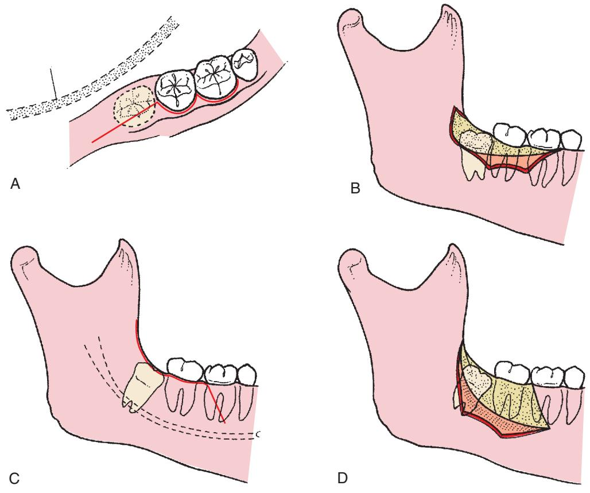

• Fig. 10.42 (A) The envelope incision is most commonly used to reflect soft tissue for removal of the impacted third molar. Posterior extension of the incision should laterally diverge to avoid injury to the lingual nerve. (B) The envelope incision is laterally reflected to expose bone overlying the impacted tooth. (C) When a three-cornered flap is made, a releasing incision is made at the mesial aspect of the second molar. (D) When the soft tissue flap is reflected by means of a releasing incision, greater visibility is possible, especially at the apical aspect of the surgical field.

• Fig. 10.43 (A) The envelope flap is the most commonly used flap for the removal of maxillary impacted teeth. (B) When soft tissue is reflected, the bone overlying the third molar is easily visualized. (C) If the tooth is deeply impacted, a releasing incision into the vestibule can be used to gain greater access. (D) When the three-cornered flap is reflected, the more apical portions become more visible.

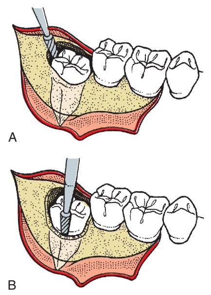

• Fig. 10.44 (A) After soft tissue has been reflected, bone overlying the occlusal surface of the tooth is removed with a fissure burr. (B) The bone on the buccodistal aspect of the impacted tooth is then removed with a burr.

from the lingual aspect of the mandible because of the likelihood of damaging the lingual nerve and because it is unnecessary.

The burrs that are used to remove the bone overlying the impacted tooth vary with surgeons' preferences. A large round burr, such as a No. 8, is desirable because it is an end-cutting burr and can be used effectively for drilling with a pushing motion. The tip of a fissure burr, such as a No. 703, does not cut well, but the edge rapidly removes bone and quickly sections teeth when used in a lateral direction. Note that a dental handpiece such as that used for restorative dentistry should never be used to remove bone around third molars or to section them.

The typical bone removal for the extraction of an impacted mandibular tooth is illustrated in Fig. 10.44. Bone on the occlusal aspect of the tooth is removed first to expose the crown of the tooth. Then, cortical bone on the buccal aspect of the tooth is removed down to the cervical line. Next, the burr can be used to remove bone between the tooth and cortical bone in the cancellous area of bone with a maneuver called *ditching*. This provides access for elevators to gain purchase points and a pathway for delivery of the tooth. No bone is removed from the lingual aspect so as to protect the lingual nerve from injury.

For maxillary teeth, bone removal is usually unnecessary, but when it is, bone is removed primarily on the buccal aspect of the tooth, down to the cervical line to expose the entire clinical crown. Usually, bone removal can be accomplished with a periosteal elevator, rather than a burr. Additional bone usually must be removed on the mesial aspect of the tooth to allow an elevator an adequate purchase area to deliver the tooth.

#### **Step 3: Sectioning the Tooth**

Once sufficient amounts of bone have been removed from around the impacted tooth, the surgeon should assess the need to section the tooth. Sectioning allows portions of the tooth to be removed separately with elevators through the opening provided by bone removal. The direction in which the impacted tooth should be divided depends primarily on the angulation of the impacted tooth and any root curvature. Although minor modifications are necessary for teeth with divergent roots or for teeth that are more or less deeply impacted, the most important determinant is the angulation of the tooth.

Tooth sectioning is performed with a burr, and the tooth is sectioned three fourths of the way toward the lingual aspect. The burr should not be used to section the tooth completely through in the lingual direction because this is more likely to injure the lingual nerve. A straight elevator is inserted into the slot made by the burr and is rotated to split the tooth.

The mesioangular mandibular impaction is usually the least difficult impaction to remove of the four basic angulation types. After sufficient bone has been removed, the distal half of the crown is sectioned off at the buccal groove to just below the cervical line on the distal aspect. This portion is removed. The remainder of the tooth is removed with a No. 301 elevator placed at the mesial aspect of the cervical line. A mesioangular impaction also can be removed by preparing a purchase point in the tooth with the drill and by using a Crane pick elevator to elevate the tooth from the socket (Fig. 10.45).

The next impaction with respect to difficulty to remove is the horizontal impaction. After sufficient bone has been removed down to the cervical line to expose the superior aspect of the distal root and the majority of the buccal surface of the crown, the tooth is sectioned by dividing the crown of the tooth from the roots at the cervical line. The crown of the tooth is removed, and the roots are displaced with a Cryer elevator into the space previously occupied by the crown. If the roots of an impacted third molar are divergent, they may require sectioning into two separate portions to be delivered individually (Fig. 10.46).

The vertical impaction is one of the two most difficult impactions to remove. The procedure of bone removal and sectioning is similar to the mesioangular impaction; that is, the occlusal buccal and distal bone is removed. The distal half of the crown is sectioned and removed, and the tooth is elevated by applying an elevator at the mesial aspect of the cervical line of the tooth. This is more difficult than a mesioangular removal because access around the mandibular second molar is difficult to obtain and requires the removal of substantially more bone on the buccal and distal sides (Fig. 10.47).

The most difficult tooth to remove is the distoangular impaction. After sufficient bone is removed from the bucco-occlusal and the distal sides of the tooth, the crown is sectioned from the roots just above the cervical line. The entire crown is usually removed because it interferes with visibility and access to the root structure of the tooth. If the roots are fused, a Cryer or a straight elevator can be used to elevate the tooth into the space previously occupied by the crown. If the roots are divergent, they are usually sectioned into two pieces and individually delivered. Extracting this impaction is difficult because so much distal bone must be removed and the tooth tends to rotate distally when elevated, running into the ramus portion of the mandible (Fig. 10.48).

Impacted maxillary teeth are rarely sectioned because the overlying bone is usually thin and relatively elastic. In situations in which the bone is thicker or the patient is older (and therefore the bone not so elastic), tooth extraction is usually accomplished by bone removal rather than by tooth sectioning.

In general, impacted teeth elsewhere in the mouth are usually sectioned only at the cervical line. This permits removal of the crown portion of the tooth, displacement of the root portion into

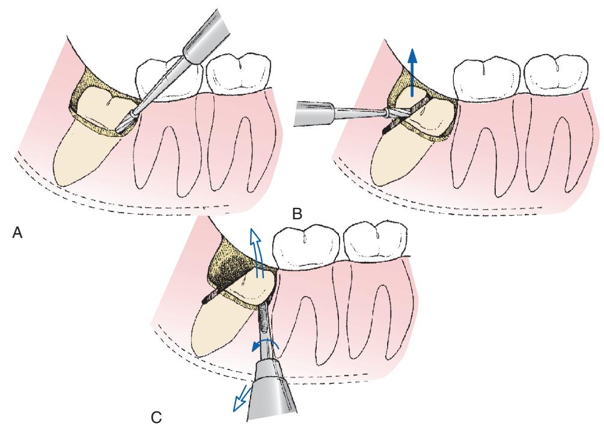

• Fig. 10.45 (A) When removing a mesioangular impaction, buccodistal bone is removed to expose the crown of the tooth to the cervical line. (B) The distal aspect of the crown is then sectioned from the tooth. Occasionally, it is necessary to section the entire tooth into two portions rather than to section the distal portion of the crown only. (C) After the distal portion of the crown has been delivered, a small straight elevator can be inserted into the surgically exposed mesial aspect of the crown to deliver the remainder of the tooth as shown. Alternatively, a purchase point can be placed near the base of the crown near the mesial aspect of the tooth and a Crane pick used to elevate the tooth (not shown).

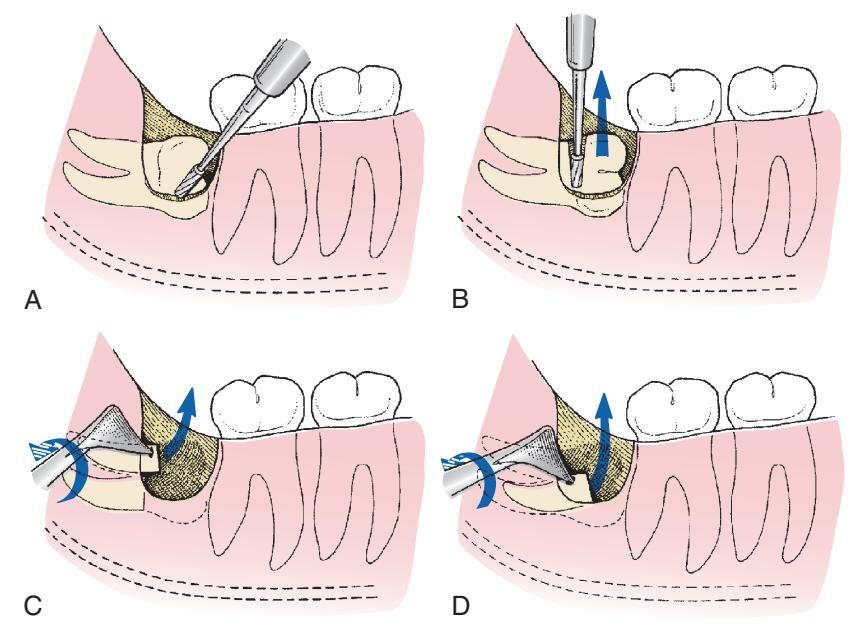

• Fig. 10.46 (A) During the removal of a horizontal impaction, bone overlying the tooth (i.e., bone on the distal and buccal aspects of the tooth) is removed with a burr. (B) The crown is then sectioned from the roots of the tooth and delivered from the socket. (C) Roots are then delivered together or independently by the Cryer elevator used with a rotational motion. Roots may require separation into two parts; occasionally, a purchase point is made in the root to allow the Cryer elevator to engage it. (D) The mesial root of the tooth is elevated in a similar fashion.

Downloaded for Tommy Tran (122427@kasascity.edu) at Kansas City University from ClinicalKey.com by Elsevier on September 12, 2025. For personal use only. No other uses without permission. Copyright ©2025. Elsevier Inc. All rights reserved.

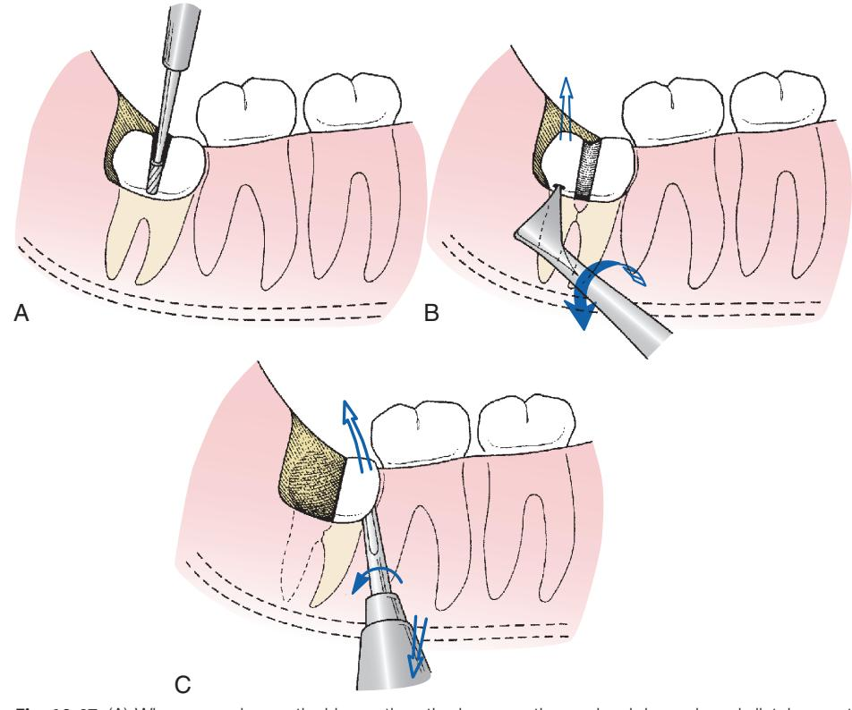

• Fig. 10.47 (A) When removing vertical impaction, the bone on the occlusal, buccal, and distal aspects of the crown is removed and the tooth is sectioned into mesial and distal sections. If the tooth has a single-fused root, the distal portion of the crown is sectioned off in a manner similar to that depicted for mesio-angular impaction. (B) The posterior aspect of the crown is elevated first with the Cryer elevator inserted into a small purchase point in the distal portion of the tooth. (C) A small straight No. 301 elevator is then used to elevate the mesial aspect of the tooth by a rotary-and-lever type of motion.

the space previously occupied by the crown, and removal of the root portion.

## Step 4: Delivery of the Sectioned Tooth With Elevator

Once adequate bone has been removed to expose the tooth and the tooth has been sectioned in the appropriate fashion, the tooth is delivered from the alveolar process with dental elevators. In the mandible the most frequently used elevators are the straight elevator, the paired Cryer elevator, or the Crane pick.

An important difference between the removal of an impacted mandibular third molar and of a tooth elsewhere in the mouth is that almost no luxation of the tooth occurs for the purpose of expansion of the buccal or linguocortical plate. Instead, bone is removed, and teeth are sectioned to prepare an unimpeded pathway for delivery of the tooth.

Application of excessive force may result in unfavorable fracturing of the tooth, of excessive buccal bone, of the adjacent second molar, or possibly of the entire mandible.

Elevators are designed not to deliver excessive force but to engage the tooth or tooth root and to apply force in the proper direction. Some surgeons use a root tip pick to remove sectioned roots from their sockets. Because the impacted tooth has never sustained occlusal forces, the periodontal ligaments are weak and permit displacement of the tooth root if appropriate bone is removed and force is delivered in the proper direction.

Delivery of maxillary third molars is accomplished with small straight elevators, which distobuccally luxate the tooth. Some surgeons prefer angled elevators such as Potts, Miller, or Warwick elevators, which aid in gaining access to the impacted tooth. The elevator tip is inserted into the area at the mesial cervical line, and pressure is applied to displace the tooth in the distobuccal direction (Fig. 10.49). The surgeon should be cautious about applying excessive pressure anteriorly to avoid damage to the root of the maxillary second molar. In addition, as pressure is applied to displace the tooth posteriorly, the surgeon should have a finger on the tuberosity of the maxilla (especially if the impaction is mesioangular) so that if a fracture does occur, steps can be taken to salvage the tuberosity of the maxilla by maintaining the soft tissue attachments. Palpation during elevation also helps the surgeon determine if the tooth is being delivered through the open wound or is, instead, being misdirected into the infratemporal space.

#### **Step 5: Preparing for Wound Closure**

A bone file is used to smooth any sharp, rough edges of bone, particularly where an elevator was in bony contact. The surgeon should next direct attention to removing all particulate bone chips and debris from the wound. This is done with vigorous irrigation with sterile saline. Special care should be taken to irrigate thoroughly under the reflected soft tissue flap. A small hemostat can be used to remove any remnants of the dental follicle, if present. Once the follicle is grasped, it is lifted with a slow, steady pressure, and it

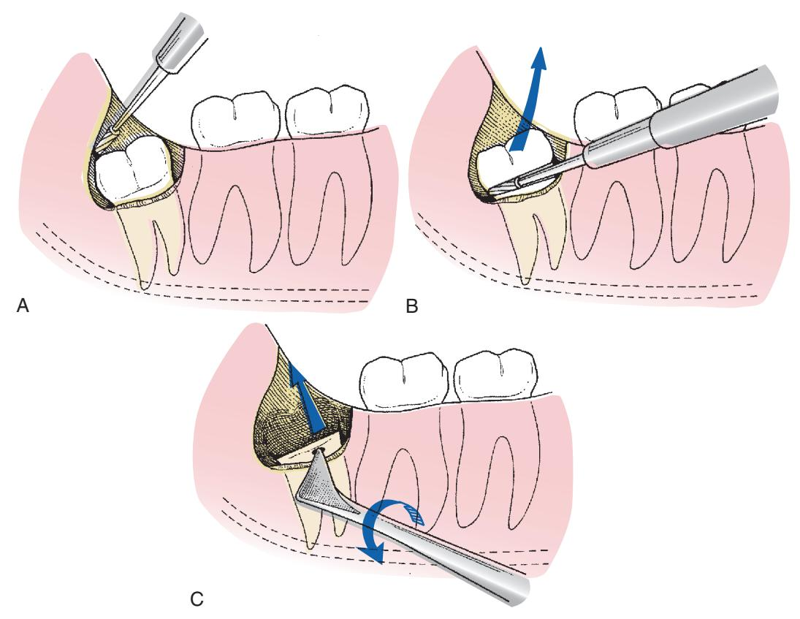

• Fig. 10.48 (A) For distoangular impaction, occlusal, buccal, and distal bone is removed with a burr. It is important to remember that more distal bone must be taken off than for vertical or mesioangular impaction. (B) The crown of the tooth is sectioned off with a burr, and the crown is delivered with a straight elevator. (C) The purchase point is put into the remaining root portion of the tooth, and the roots are delivered with the Cryer elevator with a wheel-and-axle type of motion. If the roots diverge, it may be necessary, in some cases, to split them into independent portions.

will pull free from the surrounding hard and soft tissues. A final irrigation and a thorough inspection should be performed before the wound is closed.

The surgeon should check for adequate hemostasis. Bleeding can occur from a vessel in the flap from the bone marrow that has been cut with a burr or from the inferior alveolar vessels. Specific bleeding points should be controlled if they exist. If brisk generalized ooze is seen after the sutures are placed, the surgeon should apply firm pressure with a small, moistened gauze pack. Postoperative bleeding to some degree occurs relatively frequently after third molar extraction but is usually self-limited if adequate hemostasis is achieved at the time of the operation.

At this point, many surgeons deliver an antibiotic such as tetracycline into the sockets of lower third molars to help prevent osteitis sicca (dry socket).

The closure of the incision made for an impacted third molar is usually a primary closure. If the flap was well designed and not traumatized during the surgical procedure, it will fit into its original position. The initial suture should be placed through the attached tissue on the posterior aspect of the second molar. Additional sutures are placed posteriorly from that position and anteriorly through the papilla on the mesial side of the second molar. Usually, only two or three sutures are necessary to close an envelope incision. If a releasing incision was used, attention must be directed to closing that portion of the incision as well. If the flap for a maxillary third molar rests passively in place postoperatively, suturing may not be necessary.

#### **Perioperative Patient Management**

The removal of impacted third molars is a surgical procedure that is usually associated with a great deal of patient anxiety. In addition, this surgical procedure can involve unpleasant noises and sensations. As a result, surgeons who routinely remove impacted third molars commonly recommend to their patients some type of profound anxiety control such as intravenous deep sedation or ambulatory general anesthesia.

The choice of technique is based on the surgeon's preference. However, the goals are to achieve a level of patient consciousness that allows the surgeon to work efficiently and that reduces the likelihood of an unpleasant experience for the patient.

In addition to the increased need for anxiety control, a variety of medications are used to control the sequelae of third molar extraction surgery. Combinations of codeine or codeine congeners with aspirin or acetaminophen are commonly used; however, recognize that codeine may be ineffective in many patients. The use of long-acting local anesthetics should be considered in the mandible. These anesthetics provide the patient with a pain-free period of 6 to 8 hours, during which prescriptions can be filled and analgesics taken. Analgesics are best begun at the point when

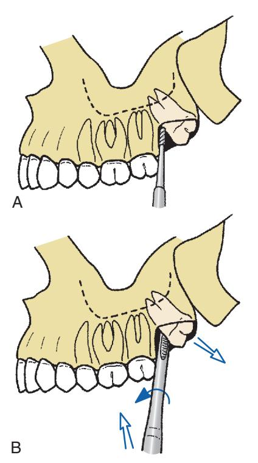

• Fig. 10.49 Delivery of an impacted maxillary third molar. (A) Once soft tissue has been reflected, a small amount of buccal bone is removed with a burr or the pointed end of a periosteal elevator. (B) The tooth is then delivered with a small straight elevator, with a rotary-and-lever type of motion. The tooth is delivered in the distobuccal and occlusal directions. Note that in most circumstances, bone removal using a burr is not required when removing impacted maxillary third molars.

the patient first begins to recognize the return of sensation. Some surgeons even have patients begin analgesics before any return of sensation. The surgeon should consider writing a prescription for a potent oral analgesic for every patient who undergoes surgical removal of an impacted third molar, and, if the surgeon does separate consultation appointments, he or she should prescribe postoperative medications at that time so the patient and the patient's escort do not need to stop on the way home from the procedure. Enough doses should be prescribed to last for at least 3 or 4 days. Combinations of codeine or codeine congeners with aspirin or acetaminophen are commonly used. Nonsteroidal antiinflammatory drugs such as ibuprofen also may be of value for patients to use when the discomfort is less significant.

To minimize the swelling that is common after the surgical removal of impacted third molars, some surgeons give parenteral corticosteroids. Intravenous administration of a glucocorticoid steroid provides sufficient antiinflammatory activity to greatly limit edema. Although many different regimens and protocols for intravenous steroid administration exist, a relatively common one is the single administration of 8 mg dexamethasone before surgery. Dexamethasone is a long-acting steroid, and its efficacy in controlling third molar postsurgical edema is documented. This drug can then be continued in an oral dose of 0.75 to 1.25 mg twice a day for 2 to 3 days to continue edema control. Although steroids given in this manner have few side effects or contraindications, the general philosophy of weighing the risks and benefits of drug administration must be carefully followed before the decision is made to give any drugs routinely.

Some surgeons recommend the use of ice packs or packages of frozen peas on the face to help prevent postoperative swelling, even though studies show that it is unlikely that the ice has much effect on preventing or limiting swelling. However, patients frequently report that the coldness makes them feel more comfortable.

Another medication that is sometimes used is an antibiotic. If a patient has a preexisting pericoronitis or periapical abscess, it is common to prescribe antibiotics for a few days after surgery. However, if the patient is healthy and the clinician finds no systemic indication for antibiotics or a preexisting local infection, systemic antibiotics are usually not indicated. The use of a topical antibiotic, such as minocycline, has been scientifically shown to greatly lower the incidence of osteitis sicca (dry socket) in mandibular molar extraction sites.

The normal postoperative experience of a patient after surgical removal of an impacted third molar is more involved than after a routine extraction. The patient can expect a modest amount of edema in the area of the surgery for 3 to 4 days, with the swelling completely dissipating by about 5 to 7 days. The amount of swelling depends on the degree of tissue trauma and the variability among patients with the potential for swelling.

A modest amount of discomfort usually follows the procedure, the degree of which depends on the amount of surgical trauma necessary to remove impacted teeth. This discomfort can be effectively controlled with oral analgesics. Patients usually require analgesics for 2 or 3 days routinely and intermittently (particularly at bedtime) for several more days. The patient may have some mild soreness in the region for up to 2 to 3 weeks after the surgery.

Patients who have had mandibular third molars surgically removed frequently have mild to moderate trismus. This inability to open the mouth interferes with the patient's normal oral hygiene and eating habits. Patients should be warned that they will be unable to open their mouths normally after surgery. The trismus gradually resolves, and the ability to open the mouth should return to normal by 7 to 10 days after surgery.

If pain, edema, and trismus have not greatly improved by 7 days after surgery, the surgeon should investigate the cause.

All of the sequelae of the surgical removal of impacted teeth are of less intensity in the young, healthy patient and of far greater intensity in the older, more debilitated patient. Even healthy adult patients between the ages of 35 and 40 years have a significantly more difficult time after extraction of impacted third molars than do most healthy teenaged patients.

See Chapter 11 for a more detailed description of postoperative care.

#### **Bibliography**

- American Association of Oral and Maxillofacial Surgeons. White Paper on Third Molar Data. www.aaoms.org/docs/third\_molar\_white\_ paper.pdf. 2007.
- Bean LR, King DR. Pericoronitis: Its nature and etiology. J Am Dent Assoc. 1971;83:1074.
- Pell GJ, Gregory GT. Report on a ten-year study of a tooth division technique for the removal of impacted teeth. *Am J Orthod.* 1942;28:660.
- Perciaccante VJ. Management of impacted teeth. Oral Maxillofac Surg Clin North Am. 2007;19:1–140.
- Proceedings from the Third Molar Multidisciplinary Conference. J Oral Maxillofac Surg. 2012;70(suppl 1):S1–S70.