An **impacted tooth** is one that fails to fully erupt into the dental arch within the usual range of expected time. This occurs due to abnormal tooth orientation, adjacent teeth, dense overlying bone, excessive soft tissue, or genetic abnormality.
**Unerupted teeth** includes impacted teeth and teeth that are in the process of developing and erupting.
The most common impacted teeth are maxillary and mandibular third molars, followed by maxillary canines and mandibular premolars.

> As a general rule, all impacted teeth should be removed unless removal is contraindicated. Early removal reduces postoperative morbidity and allows for the best healing, particularly in younger patients who tolerate the procedure better, recover more quickly, and show better periodontal and nerve healing.
> The ideal time for removal of impacted third molars is when the roots are one-third formed and before they are two-thirds formed, typically between 16 and 20 years of age.

### **Indications for Removal of Impacted Teeth**

*   **Normal Eruption:** Average age for third molar eruption is 20 years (may continue to 25). Failure of rotation from mesioangular to vertical, or inadequate arch length, are common causes of impaction.
*   **Prediction of Impaction:** If a third molar has not erupted by age 20, it is likely covered with bone, often a mesioangular impaction, and positioned low in the alveolar process.

#### **Prevention of Periodontal Disease**
*   Impacted third molars predispose adjacent second molars to periodontal disease, including bone loss and deep pockets on the distal aspect, which is exacerbated in maxillary molars due to early furcation involvement.
*   Early removal prevents disease and promotes optimal bone fill.

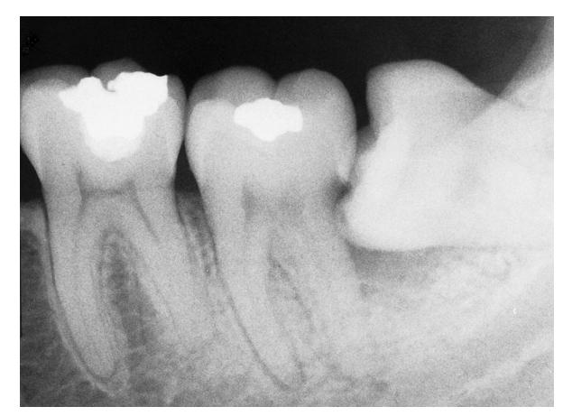

• Fig. 10.1 Radiograph of a mandibular third molar impacted against a second molar with bone loss resulting from the presence of a third molar.

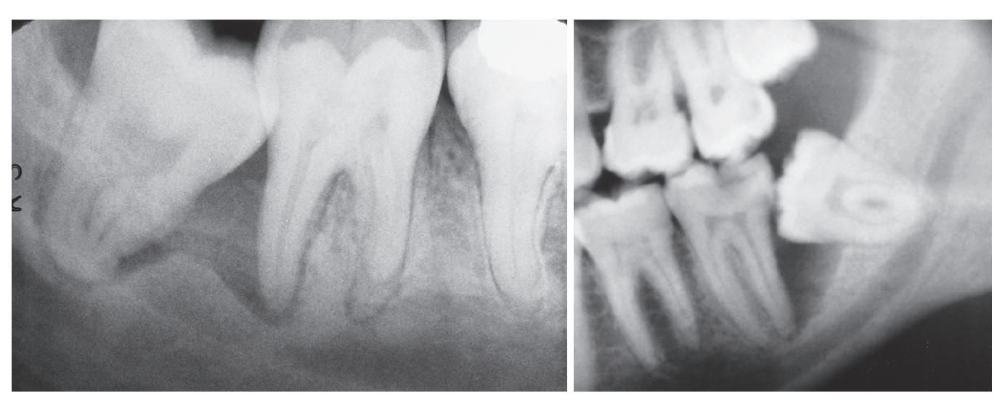

• Fig. 10.2 Radiographs showing variations of a mandibular third molar impacted against a second molar with severe bone loss resulting from periodontal disease and a third molar.

#### **Prevention of Dental Caries**
*   Impacted or partially impacted third molars can lead to caries on their own crown or on the distal aspect of adjacent second molars due to bacterial exposure, even with subtle communication.

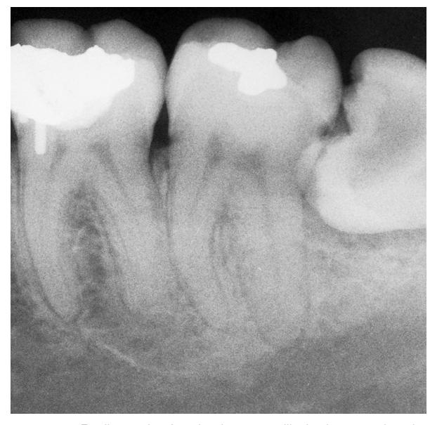

• Fig. 10.4 Radiograph of caries in a mandibular impacted molar.

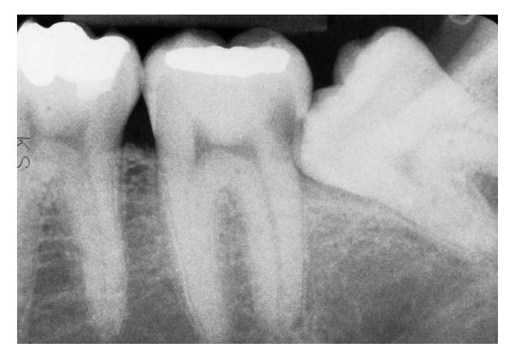

• Fig. 10.3 Radiograph of caries in a mandibular second molar resulting from the presence of an impacted third molar.

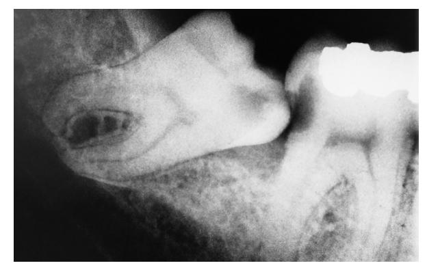

Fig. 10.5 Radiograph of caries in an impacted third molar and a second molar.

#### **Prevention of Pericoronitis**
*   **Definition:** An infection of the soft tissue (operculum) around the crown of a partially impacted tooth, typically caused by normal oral flora.
*   **Causes:** Compromised host defenses, trauma from an opposing maxillary third molar, or food entrapment under the operculum.
*   **Treatment Protocols:**
    *   **Mild (localized swelling, soreness):** Dentist performs irrigation and curettage; patient performs home irrigations (e.g., with hydrogen peroxide, chlorhexidine, iodophors, or saline).
    *   **Slightly more severe (large local swelling, traumatized by opposing maxillary third molar):** Consider immediate extraction of the maxillary third molar, plus local irrigation.
    *   **Moderately severe (local swelling/pain, mild facial swelling, mild trismus, low-grade fever):** Systemic antibiotic (penicillin, or clindamycin for allergy), pressure irrigation, and extraction.
    *   **Severe (trismus >20 mm, temperature >101°F, facial swelling, pain, malaise):** Referral to an oral-maxillofacial surgeon for hospitalization, parenteral antibiotics, monitoring, and surgical extraction.
*   **Recurrence:** Patients with one episode are highly likely to have recurrences unless the impacted tooth is removed.
    > The mandibular third molar should not be removed until the signs and symptoms of pericoronitis have completely resolved, as removal during active infection increases postoperative complications (dry socket, infection, bleeding, slower healing).
*   **Prevention:** Achieved by removing impacted third molars before oral mucosa penetration.
    > Operculectomy (excision of surrounding soft tissue) is generally painful and ineffective, as tissue tends to recur and the gingival pocket remains deep.

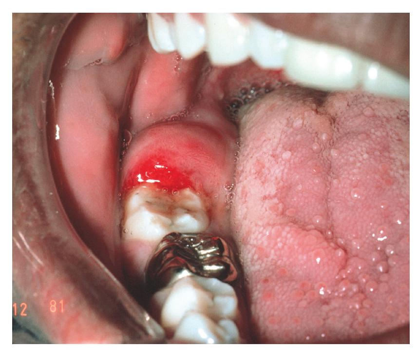

• Fig. 10.6 Pericoronitis in the area of impacted tooth #32 exhibiting classic signs of inflammation with erythema and swelling. If opposing tooth #1 is erupted, it commonly impinges on this area of swelling when teeth are brought into occlusion, causing even more pain and swelling.

#### **Prevention of Root Resorption**
*   Impacted teeth can exert pressure on adjacent tooth roots, leading to external root resorption.
*   Removal of the impacted tooth may allow for salvage of the adjacent tooth through cemental repair; endodontic therapy may be required.

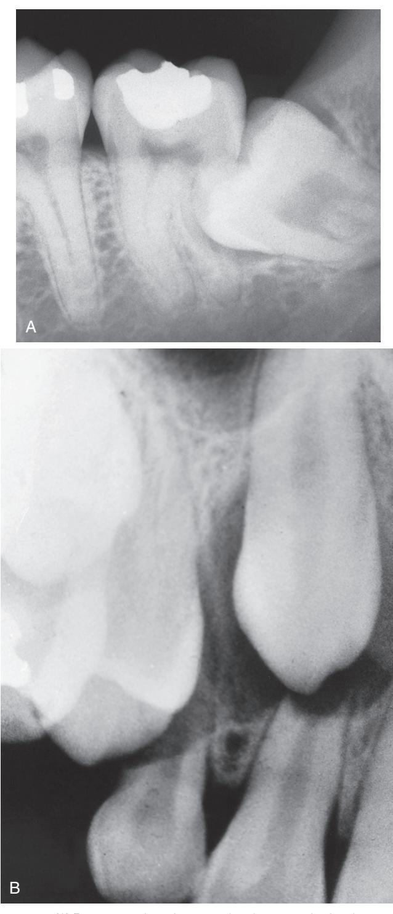

• Fig. 10.7 (A) Root resorption of a second molar as result of an impacted third molar. (B) Root resorption of maxillary lateral incisors as a result of an impacted canine.

#### **Impacted Teeth Under a Dental Prosthesis**
*   Removal before prosthesis construction is indicated to prevent future complications:
    *   Alveolar resorption can expose the impacted tooth, leading to ulceration and infection under tissue-borne prostheses.
    *   Post-prosthesis removal alters the ridge, affecting prosthesis function.
    *   Avoids extraction in older, potentially medically compromised patients with atrophic mandibles (increased fracture risk).
    *   Eliminates risk of interference with planned dental implants.

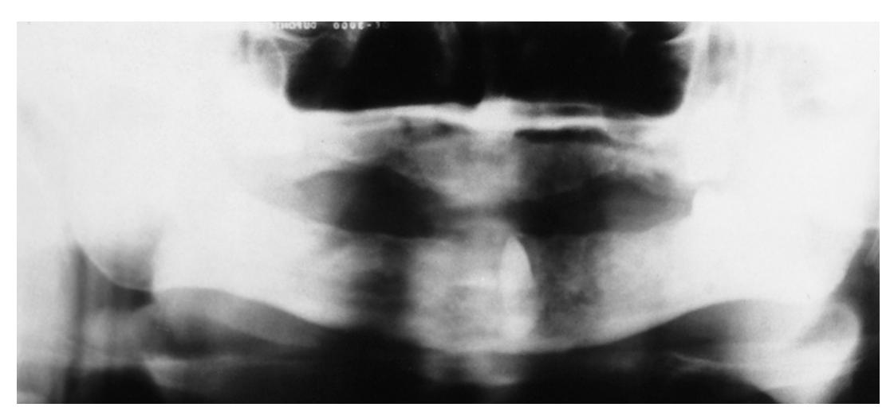

• Fig. 10.8 Impacted canine retained under a denture. The tooth is now at the surface and is causing infection.

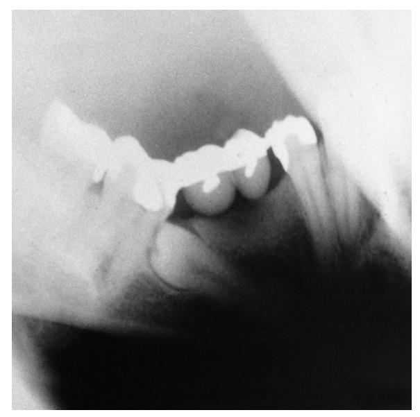

• Fig. 10.9 Impacted tooth under a fixed bridge. The tooth must be removed and therefore may jeopardize the bridge.

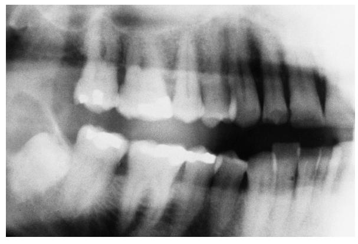

• Fig. 10.11 Small dentigerous cyst arising around an impacted tooth.

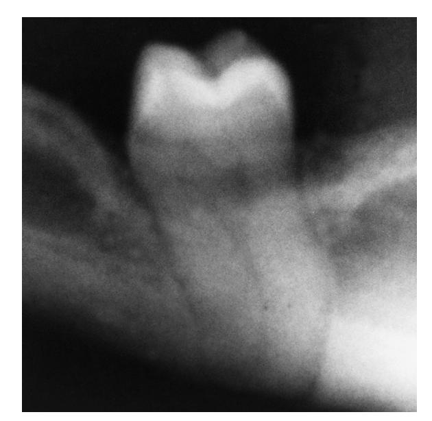

• Fig. 10.10 Impaction in an atrophic mandible, which may result in jaw fracture during extraction.

#### **Prevention of Odontogenic Cysts and Tumors**
*   The follicular sac around completely impacted teeth can undergo cystic degeneration.
*   **Dentigerous cyst:** A preoperative diagnosis is reasonable if the follicular space around the crown is greater than 3 mm. These cysts can become very large.
*   **Odontogenic tumors:** Epithelium within the dental follicle can give rise to tumors like ameloblastoma (often requires aggressive excision) or other odontogenic tumors.
*   The majority of pathologic conditions of the mandibular third molar are associated with unerupted teeth.

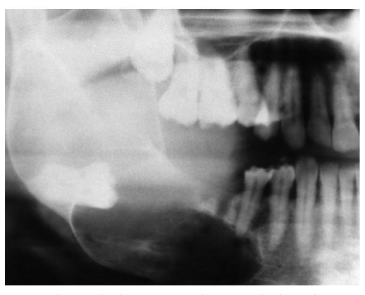

• Fig. 10.12 Large dentigerous cyst that extends from the coronoid process to the mental foramen. The cyst has displaced the impacted third molar to the inferior border of the mandible.

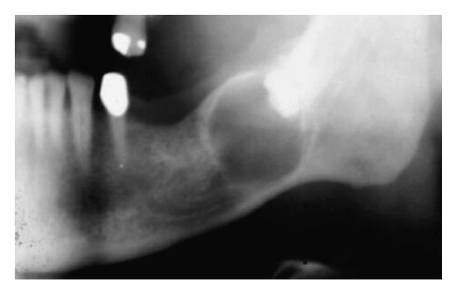

• Fig. 10.13 Ameloblastoma associated with the crown of an impacted third molar. (Courtesy Dr. Frances Gordy.)

#### **Treatment of Pain of Unexplained Origin**
*   If myofascial pain dysfunction syndrome and other facial pain disorders are excluded, removal of an unerupted tooth may resolve unexplained retromolar pain.
*   Delaying third molar removal may increase the risk of temporomandibular disorders.

#### **Prevention of Jaw Fractures**
*   An impacted mandibular third molar weakens the jaw, making it more susceptible to fracture.
*   If a fracture occurs through the impaction site, the tooth is often removed before fracture reduction and fixation.

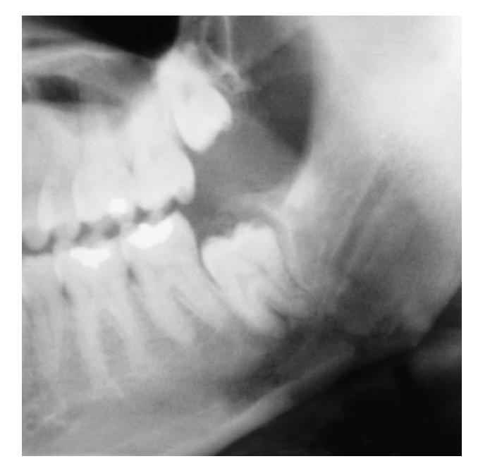

• Fig. 10.14 Fracture of a mandible, which occurred through the location of an impacted third molar.

#### **Facilitation of Orthodontic Treatment**
*   Impacted third molars can interfere with orthodontic retraction of first and second molars; removal is recommended pre-treatment.
*   Necessary for placement of retromolar implants for distal anchorage.

#### **Optimal Periodontal Healing**
*   Essential for preserving the periodontal health of the adjacent second molar.
*   **Primary Parameters:** Bone height and periodontal attachment level on the distal aspect of the second molar.
*   **Most Important Factors:**
    1.  Extent of the preoperative infrabony defect on the distal aspect of the second molar.
    2.  Patient's age at the time of surgery (patients <25 years have better initial and long-term periodontal regeneration).
*   Late eruption increases the risk of pericoronitis and contact with the second molar, both reducing optimal periodontal healing.
> Asymptomatic completely bony impacted third molars in patients older than 30 years should probably be left in place unless specific pathologic conditions develop, as removal in older patients can result in greater pocket depths and alveolar bone loss than if the tooth were left in place.

### **Contraindications for Removal of Impacted Teeth**
Removal is contraindicated when potential risks outweigh potential benefits. This primarily involves the patient's physical status.

#### **Extremes of Age**
*   **Very Early Age (7-9 years):** Most surgeons defer removal of tooth buds until an accurate diagnosis of impaction can be made.
*   **Advanced Age (>35 years):** The most common contraindication.
    *   Bone becomes highly calcified, less flexible, and requires more surgical removal.
    *   Older patients experience less favorable response and more postoperative sequelae (e.g., longer recovery).
    > If an impacted tooth has been retained for many years without periodontal disease, caries, or cystic degeneration in an older patient (usually >35 years) with a radiographically detectable layer of overlying bone, it should not be removed. Radiographic monitoring every 1-2 years is recommended.
    *   Removal is still indicated if the tooth shows signs of cystic formation, periodontal disease, is a single impacted tooth under a prosthesis with thin overlying bone, or becomes symptomatic due to infection.

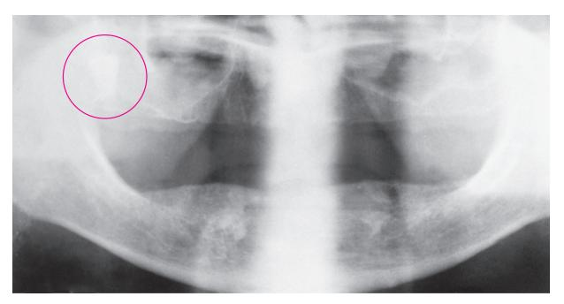

• Fig. 10.15 Impacted maxillary right third molar in a 63-year-old patient. This molar should not be extracted because it is deeply embedded and no signs of disease are present.

#### **Compromised Medical Status**
*   Removal of an asymptomatic impacted tooth is elective.
*   If a patient has serious cardiovascular or respiratory compromise, impaired host defenses, or a severe coagulopathy, leaving the tooth in place should be considered.
*   If the tooth becomes symptomatic, the surgeon should collaborate with the patient's physician for removal with minimal sequelae.

#### **Probable Excessive Damage to Adjacent Structures**
*   If removal risks serious damage to adjacent nerves, teeth, or pre-existing bridges, it may be prudent to leave the tooth.
*   This decision weighs potential damage against future complications. In younger patients with higher risk of sequelae, removal with special precautions might be warranted. In older patients with low probability of complications, the tooth should not be removed (e.g., risk of losing an adjacent second molar due to severe periodontal defect).

### **Treatment Planning**
Decision-making involves weighing various factors regarding risks and benefits.

*   **Pathologic Symptoms/Problems:** Impacted teeth causing symptoms or problems should be removed (more common with partially erupted teeth).
*   **Asymptomatic Teeth:**
    *   Consider available room in the arch for eruption.
    *   Consider tooth status and patient age (eruption may continue to 25 years).
    *   If an adjacent second molar is diseased and likely to be removed, leaving the third molar might allow it to erupt into occlusion.
    *   Insufficient room coupled with a soft tissue operculum makes pathologic sequelae likely.
> By the time a patient reaches 18 years, the dentist can reasonably predict if there will be adequate room for functional eruption. If not, removal of the asymptomatic third molar at this age optimizes soft tissue and bone healing, and long-term periodontal health of the second molar.

### **Classification Systems for Assessing Surgical Difficulty**

The purpose of classification is to determine preoperative difficulty and predict surgical approaches. The primary factor is accessibility, determined by adjacent structures, delivery pathway, ease of exposure, and purchase point preparation. A panoramic radiograph is the imaging of choice, though CBCT is useful for assessing roots near the inferior alveolar canal. Dentists should refer to a specialist if the situation is difficult or optimal pain/anxiety control cannot be provided.

#### **Classification of Mandibular Third Molar Impactions**

##### **Angulation**
This classifies the long axis of the impacted third molar relative to the second molar.

*   **Mesioangular Impaction (approx. 43%):** Least difficult to remove, especially if partially impacted.
*   **Horizontal Impaction (approx. 3%):** More difficult than mesioangular.
*   **Vertical Impaction (approx. 38%):** Third in ease of removal.
*   **Distoangular Impaction (approx. 6%):** Most difficult to remove; withdrawal pathway runs into mandibular ramus, requiring significant intervention.
*   **Other:** Buccal, lingual, or rare transverse impactions (buccolingual horizontal). Lingual inclination does not preclude a buccal approach due to lingual nerve risk.

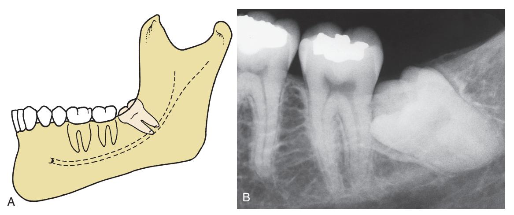

Fig. 10.16 (A) Mesioangular impaction—the most common and easiest impaction to remove. (B) Mesio-angular impaction is usually in proximity to the second molar.

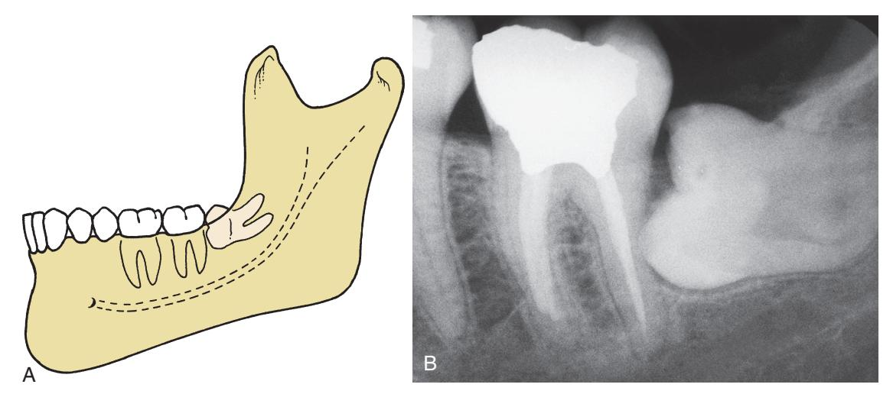

• Fig. 10.17 (A) Horizontal impaction—an uncommon and more difficult to remove impaction than a mesioangular impaction. (B) The occlusal surface of the horizontal impacted third molar is usually immediately adjacent to the root of the second molar, which often produces early severe periodontal disease.

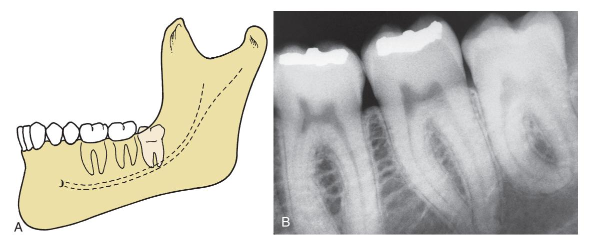

Fig. 10.18 (A) Vertical impaction—the second most common impaction and the second most difficult to remove. (B) Vertical impaction is frequently covered on its posterior aspect with bone of the anterior ramus of the mandible.

• Fig. 10.19 (A) Distoangular impaction — an uncommon and the most difficult of the four types of impac-tions to remove. (B) The occlusal surface of distoangular impaction is usually embedded in the ramus of the mandible and requires significant bone removal for extraction.

##### **Relationship to Anterior Border of Ramus**
The **Pell and Gregory Classification (Classes 1, 2, 3)** is based on the amount of impacted tooth covered by the mandibular ascending ramus bone.

*   **Class 1:** Mesiodistal diameter of the crown is completely anterior to the anterior border of the ramus. Greatest accessibility, most straightforward.
*   **Class 2:** Approximately one-half of the tooth is covered by the ramus.
*   **Class 3:** Tooth is located completely within the mandibular ramus. Least accessibility, greatest difficulty.

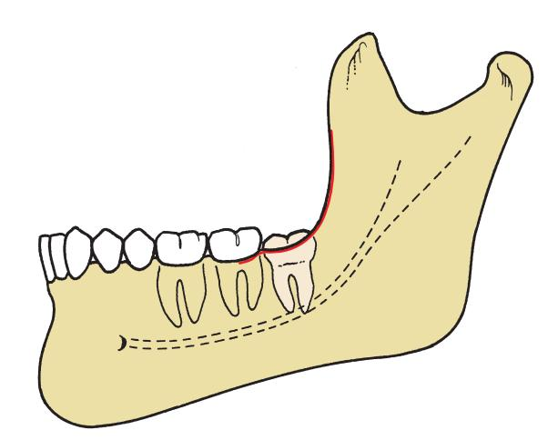

• Fig. 10.20 Pell and Gregory class 1 impaction. The mandibular third molar has sufficient anteroposterior room (i.e., anterior-to-anterior border of ramus) to erupt.

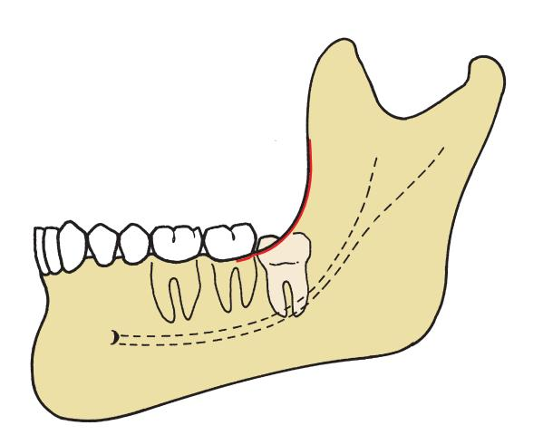

• Fig. 10.21 Pell and Gregory class 2 impaction. Approximately half is covered by the anterior portion of the ramus of the mandible.

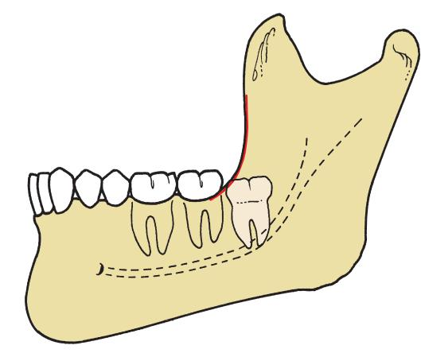

• Fig. 10.22 Pell and Gregory class 3 impaction. The impacted third molar is completely embedded in the bone of the ramus of the mandible.

##### **Relationship to the Occlusal Plane**
The **Pell and Gregory A, B, C Classification** measures the depth of the impacted tooth relative to the adjacent second molar's occlusal plane. Difficulty increases with depth (thickness of overlying bone).

*   **Class A:** Occlusal surface is level or nearly level with the occlusal plane of the second molar.
*   **Class B:** Occlusal surface is between the occlusal plane and the cervical line of the second molar.
*   **Class C:** Occlusal surface is below the cervical line of the second molar.

**Combined Classification:** These three systems (angulation, ramus, occlusal plane) are used together to assess overall difficulty (e.g., Mesioangular, Class 1, Class A is easiest; Distoangular, Class 3, Class C is most difficult).

• Fig. 10.23 Pell and Gregory class A impaction. The occlusal plane of the impacted tooth is at the same level as the occlusal plane of the second molar.

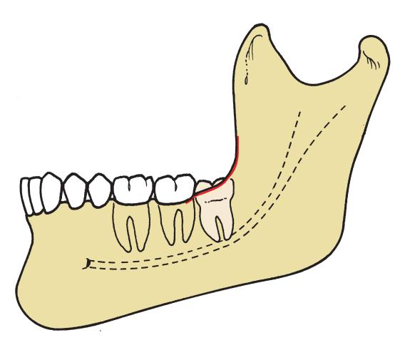

• Fig. 10.24 Pell and Gregory class B impaction. The occlusal plane of the impacted tooth is between the occlusal plane and the cervical line of the second molar.

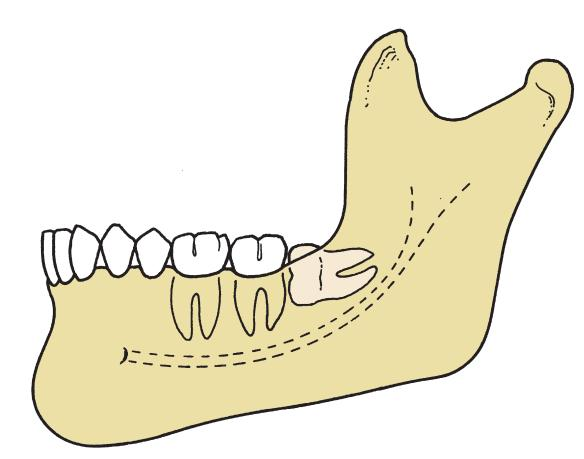

• Fig. 10.27 Horizontal impaction with class 2 ramus relationship and class B depth makes it moderately difficult to extract.

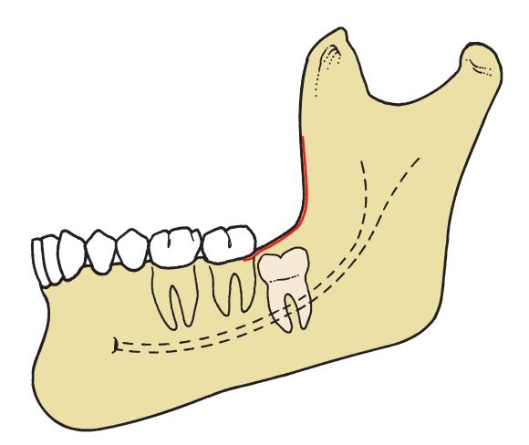

• Fig. 10.25 Pell and Gregory class C impaction. The impacted tooth is below the cervical line of the second molar.

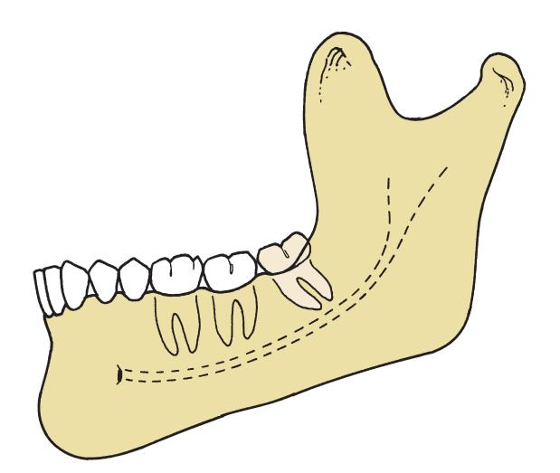

• Fig. 10.26 Mesioangular impaction with class 1 ramus relationship and class A depth. All three classifications make this the easiest type of impaction to remove.

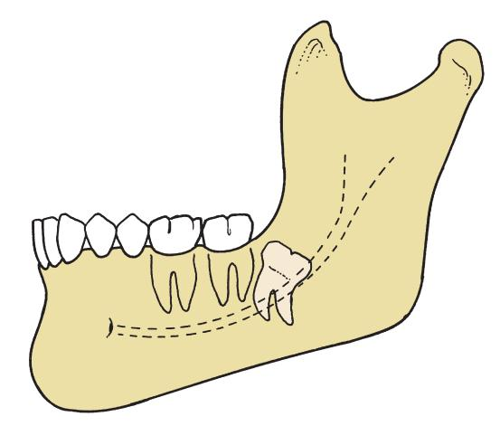

• Fig. 10.28 Impaction with a distoangular class 3 ramus relationship and class C depth makes the tooth extremely difficult to remove safely.

##### **Root Morphology**
*   **Length:** Optimal removal when 1/3 to 2/3 formed (blunt ends). Fully formed roots increase fracture risk. Less than 1/3 formed roots can "roll" in the socket, making removal difficult.
*   **Fusion:** Fused, conical roots are less difficult than separate, distinct roots.
*   **Curvature:** Severely curved or dilacerated roots are more difficult; sharply hooked roots are challenging. Direction of curvature (e.g., distal curve for mesioangular impaction) affects difficulty.
*   **Width:** If root width is greater than cervical line width, more bone removal or sectioning is needed.
*   **Periodontal Ligament (PDL) Space:** Wider PDL space (common in younger patients) simplifies removal. Narrower PDL space (common in older patients >40) increases difficulty.

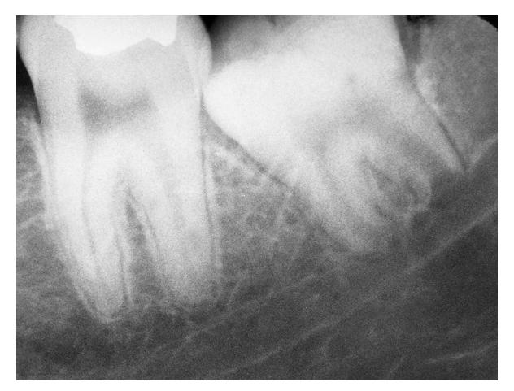

$\bullet$  Fig. 10.29 Roots that are two-thirds formed, which are less difficult to remove than if fully formed.

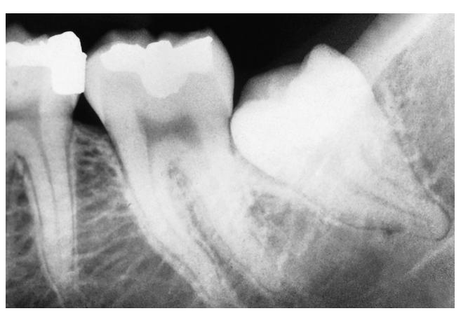

• Fig. 10.31 Fused roots with a conical shape.

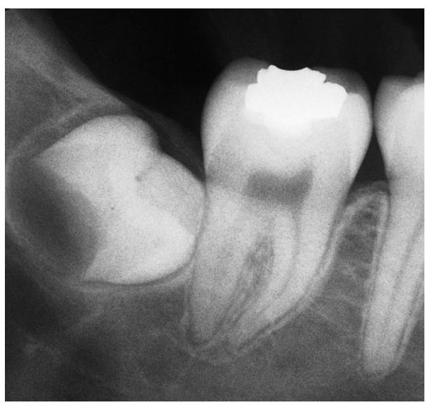

• Fig. 10.30 Lack of root development. If extraction is attempted, the crown will often roll around in the socket, making it difficult to remove.

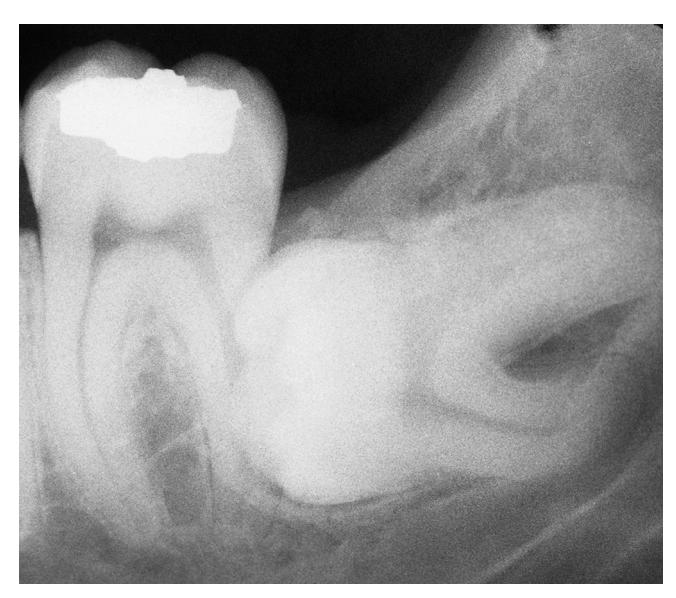

Fig. 10.32 Divergent roots with severe curvature. Such roots are more difficult to remove.

• Fig. 10.33 Wide periodontal ligament space. The widened space makes the extraction process less difficult.

##### **Size of the Follicular Sac**
*   **Wide follicular sac (almost cystic):** Requires less bone removal, simplifying extraction (more common in young patients).
*   **Narrow/nonexistent follicular space:** Requires the surgeon to create space, increasing difficulty and time.

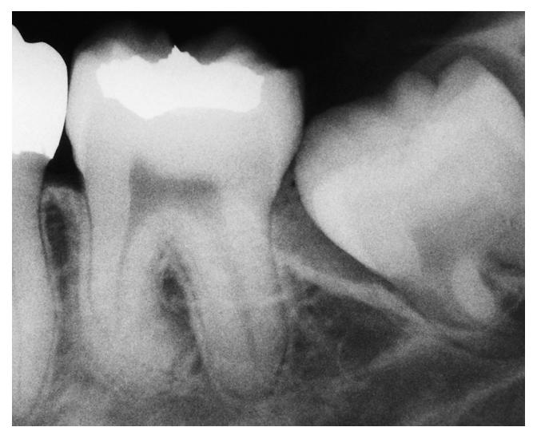

• Fig. 10.34 Large follicular sac. When the space of the sac is large, the amount of bone removal required is decreased.

##### **Density of Surrounding Bone**
*   **Determination:** Best assessed by patient's age (radiographic interpretation is unreliable). Gender also influences bone density (males generally have greater density).
*   **Younger patients (≤25 years):** Less dense, pliable, expandable bone; easier to cut with a burr.
*   **Older patients (>25 years):** Denser, less flexible bone; requires removal of all interfering bone, takes longer with a burr, higher risk of fracture.

##### **Contact With Mandibular Second Molar**
*   **Space Present:** Extraction is more straightforward, with less risk to the second molar.
*   **Direct Contact (distoangular or horizontal impaction):** Requires caution with elevators and burr to avoid injuring the second molar (especially if carious, heavily restored, or endodontically treated). Patient must be forewarned.

##### **Relationship to Inferior Alveolar Nerve**
*   Mandibular third molar roots often superimpose on the inferior alveolar canal radiographically.
*   **Risk:** Damage to the inferior alveolar nerve can cause altered sensation (paresthesia or anesthesia) of the lower lip and chin, usually transient but rarely permanent.
*   **Precaution:** Special care is needed if roots are close to the canal, greatly increasing procedural difficulty.
*   **CBCT:** Aids in accurate preoperative assessment of the root-canal relationship.

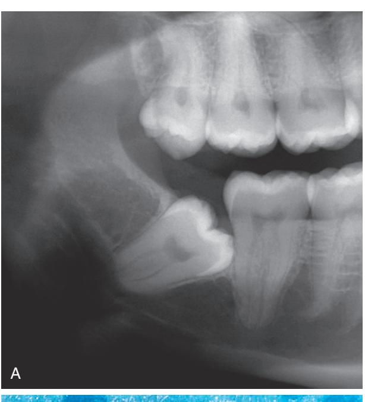

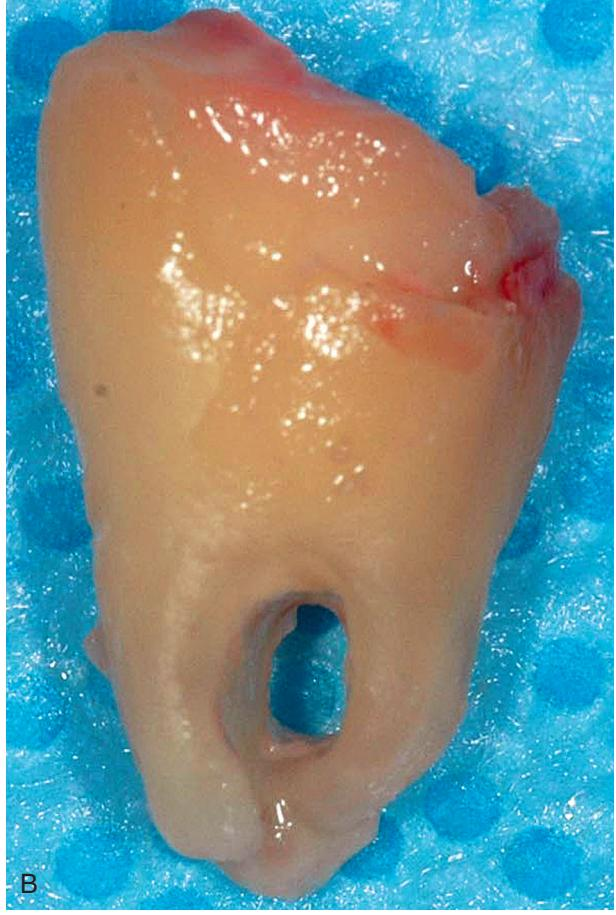

• Fig. 10.35 (A) Radiographic view of the mandibular third molar that suggests proximity to the inferior alveolar nerve. (B) Hole through the root of the third molar seen in the radiograph after removal. During removal, the inferior alveolar neurovascular bundle was severed. (Courtesy Dr. Edward Ellis III.)

##### **Nature of Overlying Tissue**
This insurance-based classification system often does not correlate with actual surgical difficulty but is used for billing.

*   **Soft Tissue Impaction:** Crown is covered only by soft tissue (height of contour above alveolar bone). Requires soft tissue incision and flap reflection.
*   **Partial Bony Impaction:** Superficial portion is covered by soft tissue, but at least part of the height of contour is below alveolar bone. Requires flap reflection and bone removal; may also need tooth division.
*   **Complete Bony Impaction:** Tooth is completely encased in bone and not visible after flap reflection. Requires extensive bone removal and almost always tooth sectioning.

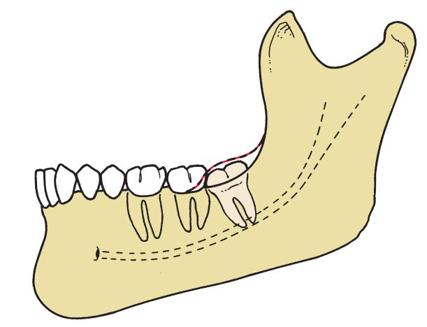

• Fig. 10.36 Soft tissue impaction in which the crown of the tooth is covered by soft tissue only and can be removed without bone removal.

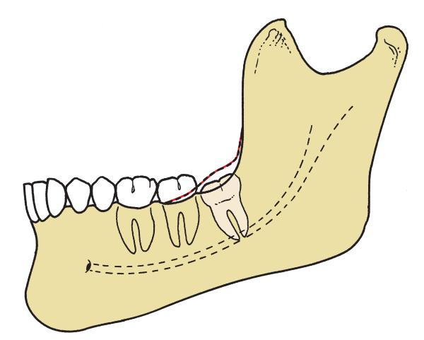

• Fig. 10.37 Partial bony impaction in which part of the tooth—usually a posterior aspect—is covered with bone and requires bone removal or tooth sectioning for extraction.

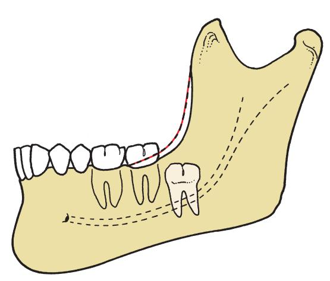

• Fig. 10.38 Complete bony impaction in which the tooth is completely covered with bone and requires extensive removal of bone for extraction.

#### **Summary of Difficulty Factors**

##### **BOX 10.1 Factors That Make Impaction Surgery Less Difficult**

1. Mesioangular position
2. Pell and Gregory class 1 ramus
3. Pell and Gregory class A depth
4. Roots one-third to two-thirds formeda
5. Fused conical roots
6. Wide periodontal ligamenta
7. Large folliclea
8. Elastic bonea
9. Separated from second molar
10. Separated from inferior alveolar nervea
11. Soft tissue impaction

aPresent in the young patient.

##### **BOX 10.2 Factors That Make Impaction Surgery More Difficult**

1. Distoangular position
2. Pell and Gregory class 2 or 3 ramus
3. Pell and Gregory class B or C depth
4. Long, thin rootsa
5. Divergent, curved roots
6. Narrow periodontal ligament
7. Thin folliclea
8. Dense, inelastic bonea
9. Contact with second molar
10. Close to inferior alveolar canal
11. Complete bony impactiona

aPresent in older patients.

#### **Classification of Maxillary Third Molar Impactions**
Classification is similar to mandibular systems, with key distinctions.

##### **Angulation**
*   **Vertical Impaction (approx. 63%):** Less complex to remove.
*   **Distoangular Impaction (approx. 25%):** Less complex to remove.
*   **Mesioangular Impaction (approx. 12%):** Most difficult to remove (opposite of mandibular), due to thicker overlying posterior bone and harder access if an erupted second molar is present.
*   **Rare:** Transverse, inverted, or horizontal (<1%).

• Fig. 10.39 (A) Vertical impaction of a maxillary third molar. This angle accounts for 63% of impactions. (B) Distoangular impaction of a maxillary third molar. This angle accounts for 25% of impactions. (C) Mesioangular impaction of a maxillary third molar. This angle accounts for 12% of impactions.

##### **Other Factors Influencing Difficulty**
*   **Buccopalatal Position:**
    *   Most are angled buccally (thin overlying bone, easier removal/expansion).
    *   Palatally positioned impacted teeth are much more difficult, requiring greater bone removal and risking injury to palatine nerves/vessels.
    *   Determined by radiographic assessment and clinical digital palpation of the tuberosity area (palpable bulge for buccal, bony deficit for palatal).
*   **Root Morphology:**
    *   Most common difficulty: Thin, nonfused roots with erratic curvature (maxillary third molars have the most erratic root formation).
    *   Majority have fused, conical roots. Careful preoperative radiographic examination is crucial.
    *   Wider periodontal ligament space simplifies removal; space narrows with age.
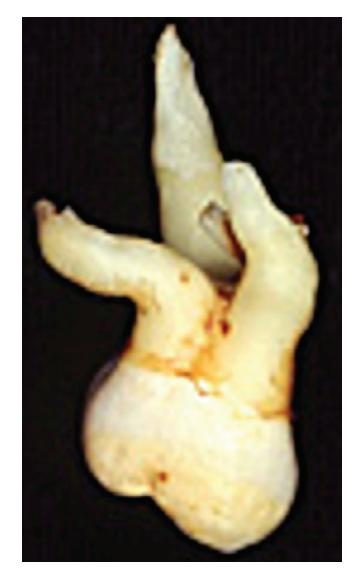

• Fig. 10.40 The maxillary third molar has the most erratic and variable root formation of all teeth.
*   **Follicle and Bone Density:** A larger follicular sac and more elastic bone (younger patients) simplifies extraction.
*   **Relationship to Adjacent Second Molar:** May require additional bone removal if tucked under the second molar's contour.
    > Be cautious with elevators around large restorations or caries on the second molar to prevent fracture.
*   **Type of Impaction:** Soft tissue, partial bony, and complete bony impactions have definitions identical to those for mandibular third molars.
*   **Maxillary Sinus Proximity:**
    *   Maxillary sinus is often in intimate contact with molar roots; third molar may form part of posterior sinus wall.
    *   Increases likelihood of postoperative complications (e.g., sinusitis, oroantral fistula), but doesn't necessarily make extraction more difficult.
*   **Tuberosity Fracture:**
    *   Risk of fracture of the posterior maxilla tuberosity (even with erupted teeth).
    *   Increased risk with:
        *   Dense, nonelastic bone (older patients).
        *   Large maxillary sinus (thins alveolar bone).
        *   Divergent roots (require greater force).
        *   Mesioangular impactions (heavier tuberosity, thinner surrounding bone).
        *   Excessive force during elevation, especially when preparing a purchase point at the mesiocervical line.
    > Management of fractured tuberosity is discussed in Chapter 25.

### **Removal of Other Impacted Teeth**
After third molars, the maxillary canine is the next most commonly impacted tooth.

*   **Maxillary Canine Assessment:** The most important assessment is the **buccolingual position** (labial, palatal, or intermediate). Cone-beam CT is the best assessment tool.
    *   **Labially positioned:**
        *   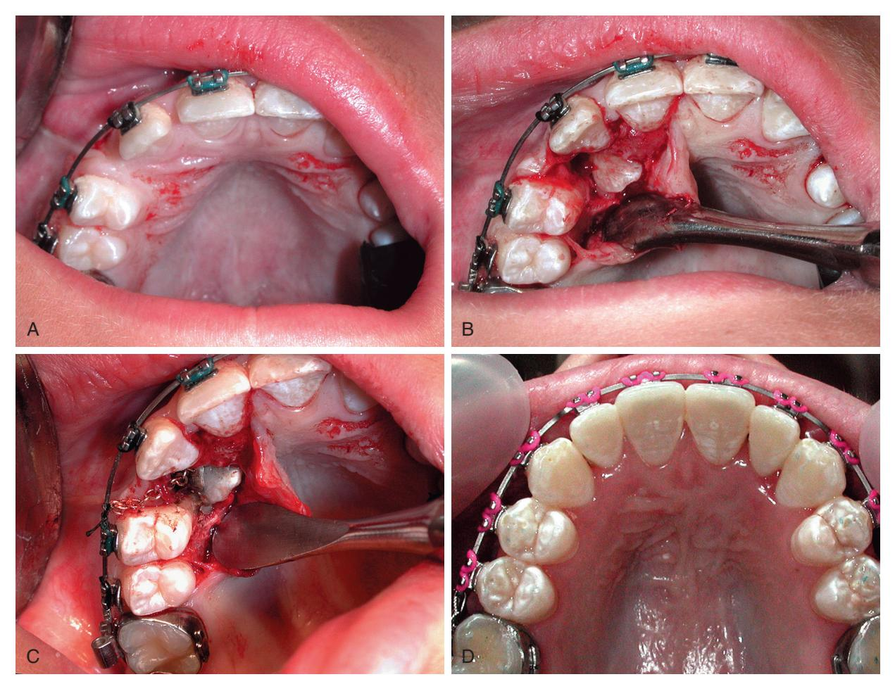
        *   A soft tissue flap can be reflected, overlying bone removed, and tooth exposed.
        *   For orthodontic repositioning: uncover with an apically positioned flap to preserve attached gingiva. The flap is apically sutured to the tooth after bracket bonding.
    *   **Palatally positioned or Intermediate buccolingual position:** Much more difficult to remove or reposition.
        *   For orthodontic repositioning: surgically exposed and guided. Overlying soft tissue is excised (flaps not needed for attached tissue). Thicker palatal bone requires a burr for removal.
        *   Bracket is luted onto the tooth surface (after etching and priming), commonly with a gold chain to the orthodontic arch wire (provides flexibility, less breakage than wire).
        *   Soft tissue sutured for maximum keratinized tissue coverage.
*   **Other Impactions (e.g., Mandibular Premolars, Supernumerary Teeth):**
    *   Similar considerations apply.
    *   **Mesiodens:** Supernumerary tooth in the midline of the maxilla, almost always on the palate, and should be approached from the palatal direction for removal.
*   **General Principle:** When sectioning, impacted teeth elsewhere in the mouth are usually sectioned only at the cervical line to permit removal of the crown portion, displacement of the root portion, and then removal of the root portion.

### **Surgical Procedure**
The principles for removing impacted teeth are the same as for other surgical extractions but with distinct differences.

**Five Basic Steps:**
1.  **Adequate Exposure:** Reflect a soft tissue flap of sufficient dimensions to allow safe retraction and surgery without damaging the flap.
2.  **Bone Removal:** Assess and remove sufficient bone to expose the tooth for sectioning (if needed) and delivery.
3.  **Tooth Division (Sectioning):** If needed, divide the tooth with a burr to facilitate extraction without excessive bone removal. Purchase points may also be placed.
4.  **Delivery:** Use appropriate elevators to deliver the sectioned or unsectioned tooth from the alveolar process.
5.  **Wound Closure:** Smooth bone edges, thoroughly irrigate with sterile solution, and reapproximate the flap with sutures.

**Distinctions from Routine Surgical Extractions:**
*   **Bone Removal:** Substantially greater and denser bone removal is often required, especially for impacted mandibular third molars, requiring better instrumentation and precision.
*   **Tooth Sectioning:** Frequently required for impacted teeth, particularly mandibular third molars. The surgeon must have necessary equipment and skills.
*   **Balance Bone Removal and Sectioning:** Surgeons must balance the amount of bone removed with the extent of tooth sectioning.
    *   Excessive bone removal prolongs healing and may weaken the jaw.
    *   Too little bone removal with multiple tooth divisions prolongs the operation.
    *   Aim: Adequate bone removal and reasonable sectioning to hasten healing and minimize surgical time.

#### **Step 1: Reflecting Adequate Flaps for Accessibility**
*   **Purpose:** Gain access and visualize overlying bone. Dimensions must allow retractor and instrument placement/stabilization.
*   **Flap Types:**
    *   **Envelope Flap:** Preferred technique; quicker to suture, better healing.
    *   **Three-Cornered Flap:** (Envelope with releasing incision) Consider if greater access to apical areas is needed to prevent stretching/tearing of an envelope flap.
*   **Mandibular Third Molar Incision:**
    *   **Preferred:** Envelope incision extending from mesial papilla of mandibular first molar, around necks of teeth, to distobuccal line angle of second molar, then posteriorly to and laterally up the anterior border of the mandibular ramus (Fig. 10.42A).
    > The incision must not continue posteriorly in a straight line, as the mandible diverges laterally, leading to the incision falling off the bone and into the sublingual space, risking lingual nerve damage.
    > The incision must always be kept over bone; carefully palpate the retromolar area before incision.
    *   Flap reflected laterally with a periosteal elevator to expose the external oblique ridge (Fig. 10.42B).
    > Do not reflect more than a few millimeters beyond the external oblique ridge to avoid increased morbidity and complications.
    *   For deeply embedded impactions, an oblique, vertical releasing incision at the mesial aspect of the second molar may be used (Fig. 10.42C–D).
*   **Maxillary Third Molar Incision:**
    *   **Recommended:** Envelope incision extending posteriorly over the tuberosity from the distal aspect of the second molar and anteriorly to the mesial aspect of the first molar (Fig. 10.43A–B).
    *   For deeply embedded impactions, a release incision extending from the mesial aspect of the second molar can be used (Fig. 10.43C–D).
*   **General Flap Principles:**
    *   Flap must be large enough for adequate access and visibility.
    *   Broad base if a releasing incision is used.
    *   Smooth scalpel stroke, kept in contact with bone, to ensure full-thickness mucoperiosteal flap.
    *   Designed for closure over solid bone.
    *   Avoid vital anatomic structures.

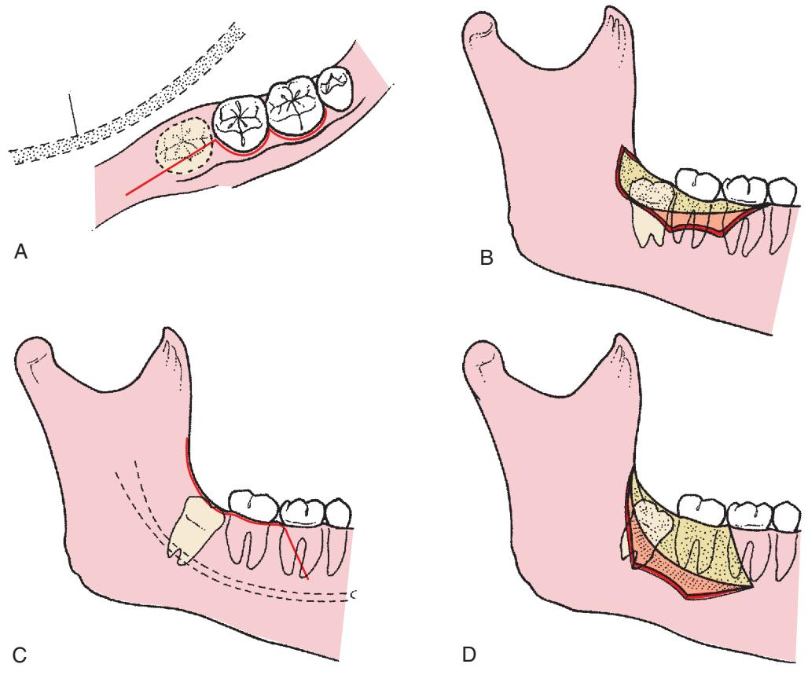
• Fig. 10.42 (A) The envelope incision is most commonly used to reflect soft tissue for removal of the impacted third molar. Posterior extension of the incision should laterally diverge to avoid injury to the lingual nerve. (B) The envelope incision is laterally reflected to expose bone overlying the impacted tooth. (C) When a three-cornered flap is made, a releasing incision is made at the mesial aspect of the second molar. (D) When the soft tissue flap is reflected by means of a releasing incision, greater visibility is possible, especially at the apical aspect of the surgical field.

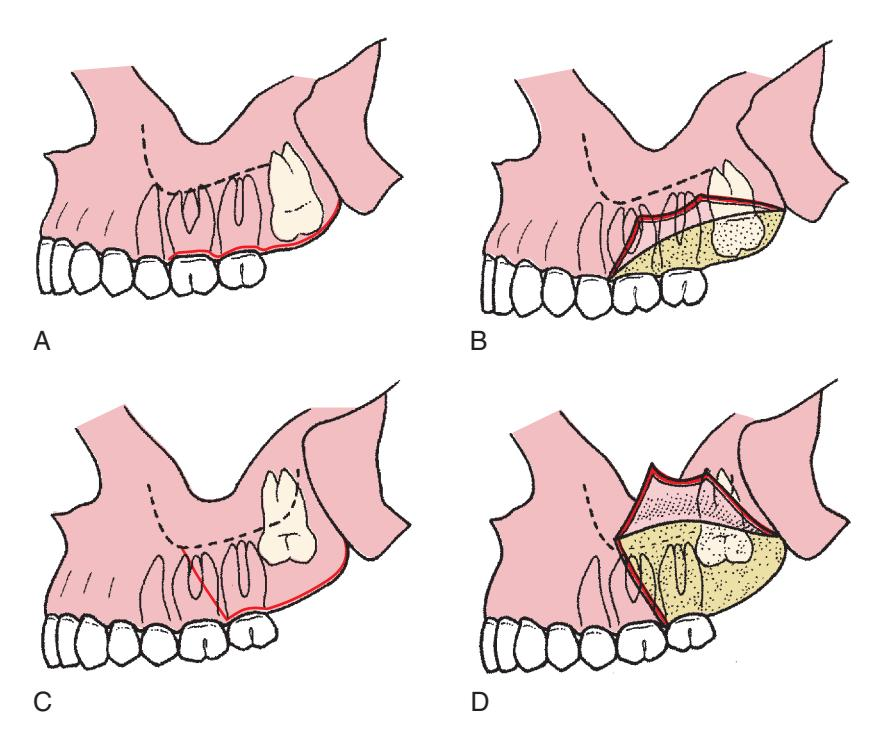
• Fig. 10.43 (A) The envelope flap is the most commonly used flap for the removal of maxillary impacted teeth. (B) When soft tissue is reflected, the bone overlying the third molar is easily visualized. (C) If the tooth is deeply impacted, a releasing incision into the vestibule can be used to gain greater access. (D) When the three-cornered flap is reflected, the more apical portions become more visible.

#### **Step 2: Removal of Overlying Bone**
*   **Assessment:** Determine if bone removal is needed (most cases require some). Initial removal is from occlusal, buccal, and distal aspects down to the cervical line.
    > Bone should not be removed from the lingual aspect of the mandible due to lingual nerve damage risk and it being unnecessary.
*   **Burrs:**
    *   Large round burr (e.g., No. 8) for end-cutting and a fissure burr (e.g., No. 703) for edge-cutting are useful.
    > A dental handpiece for restorative dentistry should never be used for bone removal or tooth sectioning around third molars.
*   **Mandibular Bone Removal:**
    1.  Occlusal bone removed first to expose crown (Fig. 10.44A).
    2.  Buccal cortical bone removed down to the cervical line (Fig. 10.44B).
    3.  **Ditching:** A trough is created between the tooth and cortical bone to provide elevator access.
*   **Maxillary Bone Removal:** Often unnecessary. When required, it is done on the buccal aspect, often with a periosteal elevator instead of a burr.

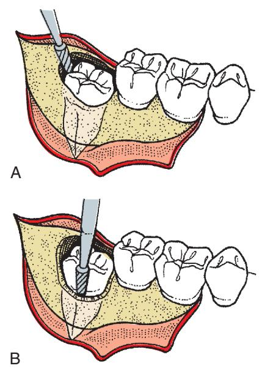
• Fig. 10.44 (A) After soft tissue has been reflected, bone overlying the occlusal surface of the tooth is removed with a fissure burr. (B) The bone on the buccodistal aspect of the impacted tooth is then removed with a burr.

#### **Step 3: Sectioning the Tooth**
*   **Purpose:** Allows removal of tooth portions separately, minimizing excessive bone removal. The technique is determined primarily by the angulation of the impacted tooth.
*   **Technique:** Performed with a burr, sectioning three-fourths of the way toward the lingual aspect. A straight elevator is inserted into the slot and rotated to split the tooth.
    > Do not section completely through in the lingual direction to avoid lingual nerve injury.
*   **Mandibular Impaction Angulations:**
    *   **Mesioangular:** Section off the distal half of the crown, remove this portion, and elevate the remainder (Fig. 10.45).
    *   **Horizontal:** Section the crown from the roots, remove the crown, and displace roots into the resulting space (Fig. 10.46).
    *   **Vertical:** Section and remove the distal half of the crown, then elevate the remainder (Fig. 10.47).
    *   **Distoangular (Most Difficult):** Section the entire crown from the roots, remove the crown, and elevate the roots into the vacated space (Fig. 10.48). This requires more distal bone removal.
*   **Maxillary Impactions:** Rarely sectioned. If needed, extraction is usually by bone removal rather than sectioning.

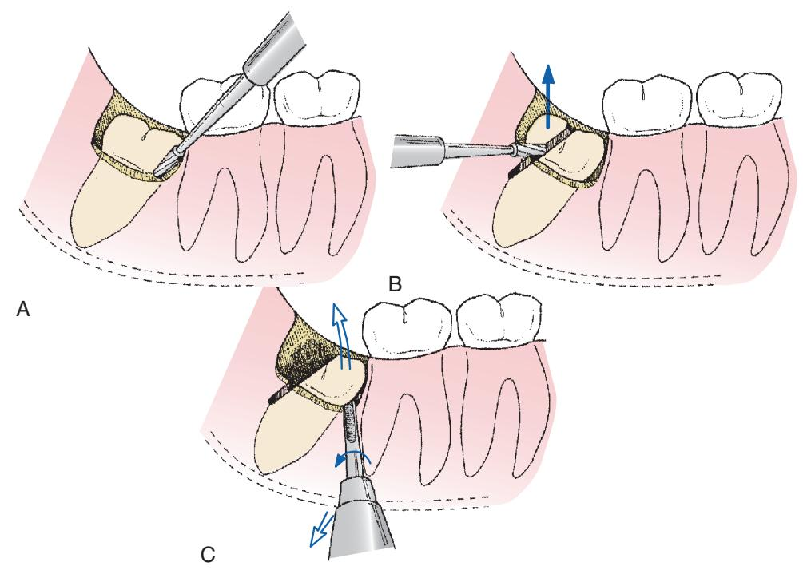
• Fig. 10.45 (A) When removing a mesioangular impaction, buccodistal bone is removed to expose the crown of the tooth to the cervical line. (B) The distal aspect of the crown is then sectioned from the tooth. (C) After the distal portion of the crown has been delivered, a small straight elevator can be inserted into the surgically exposed mesial aspect of the crown to deliver the remainder of the tooth as shown.

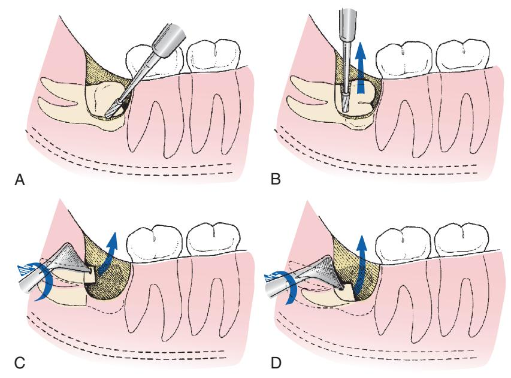
• Fig. 10.46 (A) During the removal of a horizontal impaction, bone overlying the tooth is removed with a burr. (B) The crown is then sectioned from the roots of the tooth and delivered from the socket. (C) Roots are then delivered together or independently by the Cryer elevator used with a rotational motion.

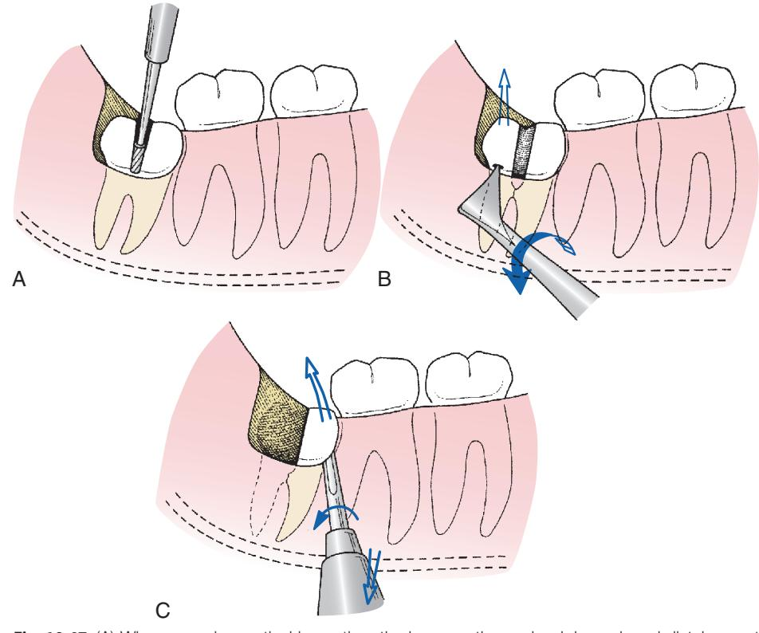
• Fig. 10.47 (A) When removing vertical impaction, the bone on the occlusal, buccal, and distal aspects of the crown is removed and the tooth is sectioned into mesial and distal sections. (B) The posterior aspect of the crown is elevated first with the Cryer elevator inserted into a small purchase point in the distal portion of the tooth. (C) A small straight No. 301 elevator is then used to elevate the mesial aspect of the tooth.

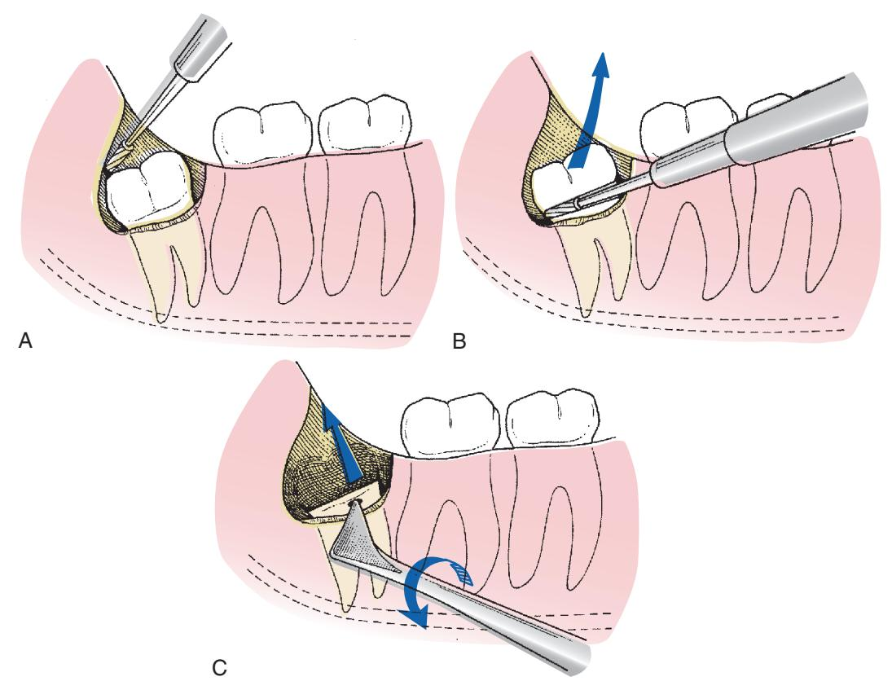
• Fig. 10.48 (A) For distoangular impaction, occlusal, buccal, and distal bone is removed with a burr. (B) The crown of the tooth is sectioned off with a burr, and the crown is delivered with a straight elevator. (C) The purchase point is put into the remaining root portion of the tooth, and the roots are delivered with the Cryer elevator.

#### **Step 4: Delivery of the Sectioned Tooth With Elevator**
*   **Mandibular Third Molars:** Delivered with straight, Cryer, or Crane pick elevators. Bone is removed to create an unimpeded pathway rather than expanding cortical plates with luxation.
    > Application of excessive force may result in unfavorable fracturing of the tooth, excessive buccal bone, the adjacent second molar, or the entire mandible.
*   **Maxillary Third Molars:** Delivered with small straight elevators (or angled elevators like Potts, Miller, Warwick) in a distobuccal direction (Fig. 10.49).
    > Caution: Avoid excessive anterior pressure to prevent damage to the maxillary second molar root.
    > Palpation: The surgeon should have a finger on the tuberosity to detect/salvage fracture and prevent misdirection of the tooth.

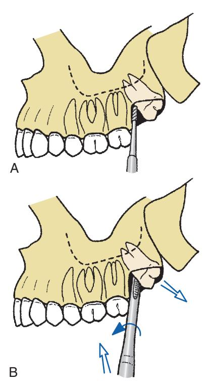
• Fig. 10.49 Delivery of an impacted maxillary third molar. (A) Once soft tissue has been reflected, a small amount of buccal bone is removed with a burr or the pointed end of a periosteal elevator. (B) The tooth is then delivered with a small straight elevator, with a rotary-and-lever type of motion. The tooth is delivered in the distobuccal and occlusal directions.

#### **Step 5: Preparing for Wound Closure**
1.  **Bone Smoothing:** Use a bone file to smooth any sharp, rough edges.
2.  **Debridement & Irrigation:** Vigorously irrigate with sterile saline to remove all particulate debris.
3.  **Follicle Removal:** Grasp and remove any remnants of the dental follicle with a hemostat.
4.  **Hemostasis:** Achieve adequate hemostasis, controlling specific bleeding points.
    > Postoperative bleeding is relatively frequent but usually self-limited if adequate hemostasis is achieved during the operation.
5.  **Antibiotic Delivery (Optional):** Some surgeons deliver a topical antibiotic (e.g., tetracycline) into lower third molar sockets to help prevent osteitis sicca (dry socket).
6.  **Wound Closure (Primary Closure):** Reapproximate the flap with sutures. Usually 2-3 sutures suffice for an envelope flap.

### **Perioperative Patient Management**
*   **Anxiety Control:** IV deep sedation or general anesthesia is highly recommended.
*   **Pain Management:** Long-acting local anesthetics and potent oral analgesics (e.g., NSAIDs, codeine combinations) should be prescribed for 3-4 days.
*   **Swelling Management:**
    *   **Parenteral Corticosteroids:** Preoperative IV glucocorticoids (e.g., 8 mg dexamethasone) are effective at limiting edema.
    > Few side effects, but risks/benefits must be weighed.
    *   **Ice Packs:** Provide comfort but are unlikely to prevent swelling.
*   **Antibiotics:**
    *   Indicated for preexisting infections. Not indicated for healthy patients without local infection.
    *   Topical antibiotics (e.g., minocycline) have been shown to greatly lower the incidence of osteitis sicca (dry socket) in mandibular molar sites.
*   **Normal Postoperative Experience:**
    *   **Edema:** Modest swelling for 3-4 days, resolving by 5-7 days.
    *   **Discomfort:** Modest, controllable with oral analgesics for 2-3 days.
    *   **Trismus:** Mild to moderate inability to open mouth, resolving by 7-10 days.
    > Investigate if pain, edema, and trismus have not greatly improved by 7 days after surgery.
    *   **Age:** Sequelae are less intense in younger patients and significantly greater in adults over 35-40 years old.

### **Bibliography**
*   American Association of Oral and Maxillofacial Surgeons. White Paper on Third Molar Data. www.aaoms.org/docs/third\_molar\_white\_ paper.pdf. 2007.
*   Bean LR, King DR. Pericoronitis: Its nature and etiology. J Am Dent Assoc. 1971;83:1074.
*   Pell GJ, Gregory GT. Report on a ten-year study of a tooth division technique for the removal of impacted teeth. *Am J Orthod.* 1942;28:660.
*   Perciaccante VJ. Management of impacted teeth. Oral Maxillofac Surg Clin North Am. 2007;19:1–140.
*   Proceedings from the Third Molar Multidisciplinary Conference. J Oral Maxillofac Surg. 2012;70(suppl 1):S1–S70.