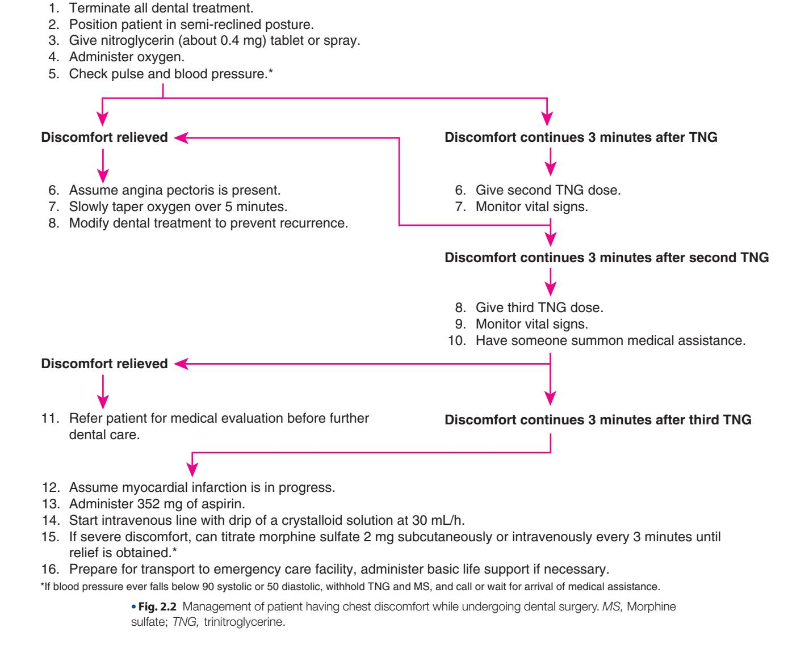
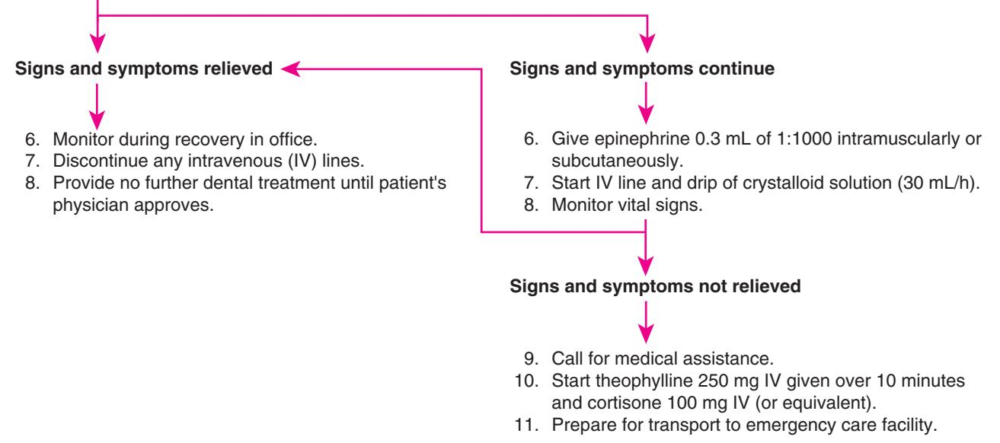
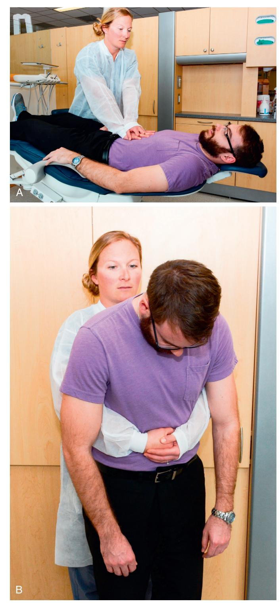
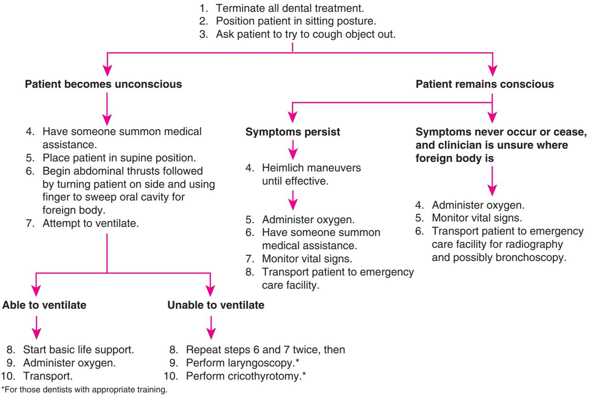
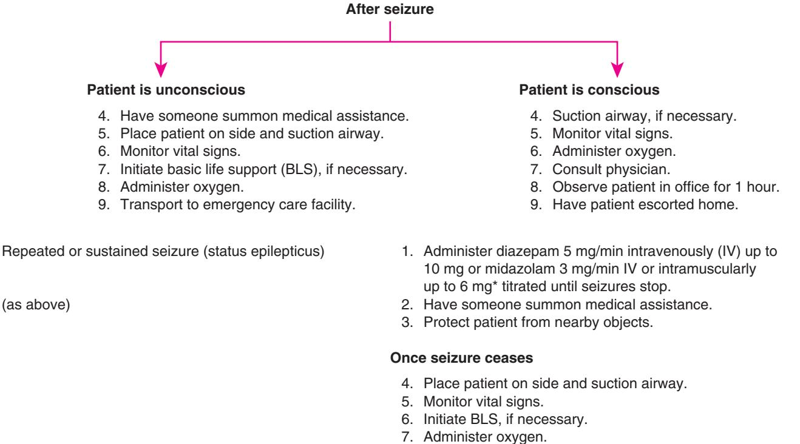

# 2 Prevention and Management of Medical Emergencies

JAMES R. HUPP AND ALISON YEUNG

# CHAPTER OUTLINE

# Prevention, 20

Preparation, 21 Continuing Education, 21 Office Staff Training, 21 Access to Help, 21 Emergency Supplies and Equipment, 21

# Medical Emergencies, 22

Hypersensitivity Reactions, 22 Chest Discomfort, 25 Respiratory Difficulty, 26 Asthma, 27 Hyperventilation, 27 Chronic Obstructive Pulmonary Disease, 28 Foreign Body Aspiration, 28 Gastric Contents Aspiration, 29 Altered Consciousness, 30 Vasovagal Syncope, 30 Orthostatic Hypotension, 31 Seizure, 32 Local Anesthetic Toxicity, 33 Diabetes Mellitus, 34 Thyroid Dysfunction, 35 Adrenal Insufficiency, 36 Cerebrovascular Compromise, 37

Serious medical emergencies in the general dental office are, fortunately, rare. The primary reason for the limited frequency of emergencies in dental practice is the nature of dental education that prepares practitioners to recognize potential problems and manage them before they cause an emergency or refer unhealthy patients needing surgery to oral-maxillofacial surgeons. Dental practices serving patients in medically underserved communities may see a disproportionate number of individuals more prone to medical emergencies in the dental setting.

When oral surgical procedures are necessary, the increased mental and physiologic stress inherent in such care can push the patient with moderately or poorly compensated medical conditions into an emergency situation. Similarly, the advanced forms of pain and anxiety control frequently needed for oral surgery can predispose patients to emergent conditions. This chapter begins with a presentation of the various means of lowering the probability of medical emergencies in the dental office. The chapter also details ways to prepare for emergencies and discusses the clinical manifestations and the initial management of the types of medical emergencies most common in the dental office.

# Prevention

An understanding of the relative frequency of emergencies and knowledge of those likely to produce serious morbidity and mortality is important when setting priorities for preventive measures. Studies reveal that hyperventilation, seizures, and suspected hypoglycemia are the most common emergency situations occurring in patients before, during, or soon after general dental care. These are followed in frequency by vasovagal syncope, angina pectoris, orthostatic hypotension, and hypersensitivity (allergic) reactions.

The incidence of medical emergencies is higher in patients receiving ambulatory oral surgery compared with those receiving nonsurgical care because of the following three factors: (1) surgery is more stress provoking, (2) a greater number of medications are typically administered during the perioperative period, and (3) longer appointments are often necessary when performing surgery. These factors are known to increase the likelihood of medical emergencies. Other factors that increase the potential for emergencies are the age of the patient (very young and old patients being at greater risk), the increasing ability of the medical profession to keep relatively unhealthy persons ambulatory, and the large variety of drugs dentists administer in their offices.

Prevention is the cornerstone of management of medical emergencies. The first step is risk assessment. This begins with a careful medical evaluation in the dental office, which requires taking an accurate medical history, including a review of systems guided by pertinent positive responses in the patient's history. Vital signs should be recorded, and a physical examination (tailored to the patient's medical history and present problems) should be performed and regularly updated. Techniques for this are described in Chapter 1.

Although any patient could have a medical emergency at any time, certain medical conditions predispose patients to medical emergencies in the dental office. These conditions are more likely to turn into an emergency when the patient is physiologically or emotionally stressed. The most common conditions affected or precipitated by anxiety are listed in Box 2.1. Once those patients who are likely to have medical emergencies are recognized, the practitioner can prevent most problems from occurring by modifying the manner in which oral surgical care is delivered.

# • BOX 2.1 Medical Emergencies Commonly Provoked by Anxiety

- Angina pectoris
- Thyroid storm
- Myocardial infarction
- Insulin shock
- Asthmatic bronchospasm
- Hyperventilation
- Adrenal insufficiency (acute)
- Epilepsy
- Severe hypertension

# • BOX 2.2 Preparation for Medical Emergencies

- 1. Personal continuing education in emergency recognition and management
- 2. Auxiliary staff education in emergency recognition and management
- Establishment and periodic testing of a system to access medical assistance readily when an emergency occurs
- 4. Equipping office with supplies necessary for emergency care

# Preparation

Preparedness is the second most important factor (after prevention) in the management of medical emergencies. Preparation to handle emergencies includes four specific actions: (1) ensuring that the dentist's own education about emergency management is adequate and up to date, (2) having the office staff trained to assist in medical emergencies, (3) establishing a system to gain ready access to other health care providers able to assist during emergencies, and (4) equipping the office with equipment and supplies necessary to initially care for patients having serious problems (Box 2.2).

# **Continuing Education**

In dental school, clinicians are trained in ways to assess patient risk and manage medical emergencies. However, because of the rarity of these problems, practitioners should seek continuing education in this area, not only to refresh their knowledge but also to learn new concepts concerning medical evaluation and management of emergencies. An important feature of continuing education is to maintain certification in basic life support (BLS), including the use of automated external defibrillator units (Box 2.3). Some recommend that continuing education in medical emergency management be obtained annually, with a BLS skills update and review obtained biannually. Dentists who deliver parenteral sedatives other than nitrous oxide are wise to obtain certification in advanced cardiac life support available.

# **Office Staff Training**

The dentist must ensure that all office personnel are trained to assist in the recognition and management of emergencies. This should include reinforcement by regular emergency drills in the office and by annual BLS skills renewal by all staff members. The office staff should be preassigned specific responsibilities so that in the event of an emergency, each person knows what will be expected of him or her.

# BOX 2.3 Basic Life Support

# ABCs

- A—Airway
- B—Breathing
   C—Circulation
- C—Circulation

# Airway Obtained and Maintained by a Combination of the Following:

- Extending head at the neck by pushing upward on the chin with one hand and pushing the forehead back with other hand
- 2. Pushing mandible forward by pressure on the mandibular angles
- 3. Pulling mandible forward by pulling on anterior mandible
- Pulling tongue forward, using suture material or instrument to grasp anterior part of tongue

## **Breathing Provided by One of the Following:**

- 1. Mouth-to-mask ventilation
- 2. Resuscitation bag ventilation

## **Circulation Provided by External Cardiac Compressions**

# Access to Help

The ease of access to other health care providers varies from office to office. Preidentifying individuals with training that would make them useful during a medical emergency is helpful. If the dental practice is located near other professional offices, prior arrangements should be made to obtain assistance in the event of an emergency. Not all physicians are well versed in the management of emergencies, and dentists must be selective in the physicians they contact for help during an emergency. Oral-maxillofacial surgeons are a good resource, as are most general surgeons, internists, and anesthesiologists. Ambulances carrying emergency medical technicians are useful to the dentist facing an emergency situation, and communities provide easy telephone access (911) to a rapid-response emergency medical service team. Finally, it is important to identify a nearby hospital or freestanding emergency care facility with well-trained emergency care experts.

Once the dentist has established who can be of assistance in the event of an emergency, the appropriate telephone numbers should be kept readily available. Easily identified lists can be placed on each telephone, or telephone numbers can be entered into the memory of an automatic-dial telephone and/or added to cellphone contacts. The numbers should be called periodically to test their accuracy.

# **Emergency Supplies and Equipment**

The final means of preparing for emergencies is by ensuring that appropriate emergency drugs, supplies, and equipment are available in the office. One basic piece of equipment is the dental chair that should facilitate placing the patient in the supine position or, even better, in the head-down, feet-raised position. In addition, it should be possible to lower the chair close to the floor to allow BLS to be performed properly, or standing stools should be kept readily available. Operatories should be large enough to allow a patient to be placed on the floor for BLS performance and should provide enough room for the dentist and others to deliver emergency care. If the operatory is too small to allow the patient to be placed on the floor, specially designed boards that are available can be placed under the patient's thorax to allow effective BLS administration in the dental chair.

Frequently, equipment used for respiratory assistance and the administration of injectable drugs is needed during office emergencies. Equipment for respiratory assistance includes oral and nasal airways, large suction tips, connector tubing that allows the use of high-volume suction, and resuscitation bags (e.g., air mask bag unit [AMBU bags]) with clear facemasks. Laryngoscopes and endotracheal tubes for tracheal intubation may be helpful to dentists trained in their proper use or for others called into the office to assist during an emergency.

Useful drug administration equipment includes syringes and needles, tourniquets, intravenous (IV) solutions, indwelling catheters, and IV tubing (Table 2.1). Emergency kits containing

#### TABLE 2.1 Emergency Supplies for the Dental Office

| Use                                                       | Supplies                                                                                                                                                                                                                                                                      |
|-----------------------------------------------------------|-------------------------------------------------------------------------------------------------------------------------------------------------------------------------------------------------------------------------------------------------------------------------------|
| Establishment and maintenance of intravenous access | Plastic indwelling catheter, metal indwelling catheter, intravenous tubing with flow valve, tourniquet, 1-inch wide plastic tape, crystalloid solution (normal saline, 5% dextrose in water)                                                                      |
| High-volume suction                                       | Large-diameter suction tip, tonsillar suction tip, extension tubing, connectors to adapt tubing to office suction                                                                                                                                                       |
| Drug administration                                       | Plastic syringes (5 and 10 mL), needles (18 and 21 gauge)                                                                                                                                                                                                                     |
| Oxygen administration                                     | Clear facemask, resuscitation bag (air mask bag unit), extension oxygen tubing (with and without nasal catheters), oxygen cylinder with flow valve, oral and nasal airways, a endotracheal tube, a demand valve oxygen mask a |

aFor use by dentists with appropriate training or by those called to give medical assistance.

a variety of drugs are commercially available (Fig. 2.1). If dentists have made arrangements for help from nearby professionals, they may also want to include drugs in their kits that the assisting individuals suggest may be helpful. The drugs and any equipment in the kit must be clearly labeled and checked frequently for completeness and to ensure that no drugs have passed their expiration date. Labeling should include not only the drug name but also situations in which the drug is most commonly used. A list of drugs that should be in a dental office emergency kit is provided in Table 2.2.

One emergency item that must be available in dental offices is oxygen. Many dentists use oxygen supplied in a portable tank. The dentist should be properly trained to be capable of delivering the oxygen under positive pressure to the patient. Establishing a system to check periodically that a sufficient supply of oxygen is always available is important. Dentists who use a central oxygen system also need to have portable oxygen available for use outside of the operatory, such as in the waiting room or during transport to an emergency facility.

# **Medical Emergencies**

A brief description of the pathophysiology, clinical manifestations, and acute management of several emergency situations is presented in the following section. The section has been organized into a combination of specific problems such as hypersensitivity reactions as well as symptom-oriented problems such as chest discomfort.

# Hypersensitivity Reactions

Several of the drugs administered to patients undergoing oral surgery can act as antigenic stimuli, triggering allergic reactions. Of the four basic types of hypersensitivity reactions, only type 1 (immediate hypersensitivity) can cause an acute, life-threatening condition. Type 1 allergic reactions are mediated primarily by immunoglobulin E antibodies. As with all allergies, initiation of a type 1 response requires exposure to an antigen previously encountered by the immune system. Reexposure to the antigen triggers a cascade of events that are then exhibited locally, systemically, or both in varying

• Fig. 2.1 (A) Example of commercially available emergency kit of appropriate size and complexity for dental office. (B) Office emergency response systems are available to help guide the dentist and staff during emergencies and drills. (B, Courtesy Institute of Medical Emergency Preparedness (IMEP), Virginia Beach, VA.)

Downloaded for Tommy Tran (122427@kasascity.edu) at Kansas City University from ClinicalKey.com by Elsevier on September 11, 2025. For personal use only. No other uses without permission. Copyright ©2025. Elsevier Inc. All rights reserved.

| TABLE 2.2 | Emergency Drugs for the Dental Office |  |  |  |  |
|-----------|---------------------------------------|--|--|--|--|
|-----------|---------------------------------------|--|--|--|--|

| General Drug Group                                | Common Examples                                                                                |
|---------------------------------------------------|------------------------------------------------------------------------------------------------|
| Parenteral Preparations                           |                                                                                                |
| Analgesic                                         | Morphine sulfate                                                                               |
| Anticonvulsant                                    | Diazepam, midazolam                                                                            |
| Antihistamine                                     | Diphenhydramine (Benadryl), chlorpheniramine (Chlor-Trimeton)                               |
| Antihypoglycemic                                  | 50% dextrose in water, glucagon                                                                |
| Corticosteroid                                    | Methylprednisolone (Solu-Medrol), dexamethasone (Decadron), hydrocortisone (Solu-Cortef) |
| Narcotic antagonist/ benzodiazepine antagonist | Naloxone (Narcan) Flumazenil (Romazicon)                                                    |
| Sympathomimetic                                   | Epinephrine                                                                                    |
| Vagolytic                                         | Atropine                                                                                       |
| Oral Preparations                                 |                                                                                                |
| Antihistamine                                     | Diphenhydramine (Benadryl), chlorpheniramine (Chlor-Trimeton)                               |
| Antihypoglycemic                                  | Candy (containing sugar), fruit juice, sugar cubes, glucose gel                             |
| Antiplatelet                                      | Aspirin                                                                                        |
| Vasodilator                                       | Nitroglycerine (Nitrostat, Nitrolingual)                                                       |
| Inhaled Preparations                              |                                                                                                |
| Bronchodilator                                    | Metaproterenol (Alupent), epinephrine bitartrate (Medihaler- Epi) albuterol              |
| Oxygen                                            | –                                                                                              |
| Respiratory stimulant                             | Aromatic ammonia                                                                               |

degrees of severity mainly in response to significant mast cell degranulation and the widespread release of histamine. Table 2.3 details the manifestations of type 1 hypersensitivity reactions and their management.

The least severe manifestation of type 1 hypersensitivity is dermatologic. Skin or mucosal reactions include localized areas of pruritus, erythema, urticaria (wheals consisting of slightly elevated areas of epithelial tissue that are erythematous and indurated), and angioedema (large areas of swollen tissue generally with little erythema or induration). Although skin and mucosal reactions are not in themselves dangerous, they may be the first indication of more serious allergic manifestations that will soon follow. Skin lesions usually take anywhere from minutes to hours to appear; however, those appearing and progressing rapidly after administration of an antigenic drug are the most menacing and concerning for progression to the more life-threatening clinical presentations.

Allergic reactions affecting the respiratory tract are more serious and require more aggressive intervention. The involvement of small airways occurs with wheezing, as constriction of bronchial smooth muscle (bronchospasm) and airway mucosal inflammation occurs. The patient will complain of dyspnea and may eventually become cyanotic. The patient may be using accessory muscles to assist in breathing. Involvement of the larger airways usually first occurs at the narrowest portion of those air passages—the vocal cords in the larynx. Angioedema of the vocal cords causes partial or total airway obstruction. The patient is usually unable to speak and produces high-pitched crowing sounds (stridor) as air passes through constricted cords. As the edema worsens, total upper airway obstruction may eventually occur, presenting an immediate threat to life.

Generalized anaphylaxis is the most dramatic hypersensitivity reaction, usually occurring within seconds or minutes after the parenteral administration of the antigenic medication; a more delayed onset occurs after oral or topical drug administration. Many signs and symptoms of anaphylaxis exists, but the most important with respect to early management are those resulting from cardiovascular and respiratory tract disturbances.

An anaphylactic reaction typically begins with a patient complaining of malaise or a feeling of impending doom. Skin manifestations soon appear, including flushing, urticaria, and pruritus on the face and trunk. Nausea and vomiting, abdominal cramping, and urinary incontinence may occur. Symptoms of respiratory compromise soon follow, accompanied with dyspnea and wheezing. Cyanosis of nail beds and mucosa appear next if air exchange becomes insufficient. Finally, total upper airway obstruction occurs, which causes the patient quickly to become unconscious. Disordered cardiovascular function initially occurs with tachycardia and palpitations. Blood pressure tends to fall because of decreasing cardiac output secondary to peripheral vasodilation, and cardiac dysrhythmias appear. Cardiac output eventually may be compromised to a degree sufficient to cause loss of consciousness and cardiac arrest. Despite the potentially severe cardiovascular disturbances, the usual cause of death in patients having an anaphylactic reaction is laryngeal obstruction caused by vocal cord edema.

As with any potential emergency condition, prevention is the best strategy. During the initial interview and subsequent recall visits, patients should be questioned about their history of drug allergies. In addition, dentists should ask patients specifically about medications they intend to use during the planned oral surgical care. If a patient claims to have an allergy to a particular drug, the clinician should question the patient further about the way in which the allergic reaction has exhibited and what was necessary to manage the problem. Many patients will claim an allergy to local anesthetics; however, before subjecting patients to alternative forms of anesthesia, the clinician should try to ensure that an allergy to the local anesthetic does indeed exist. Many patients have been told they had an allergic reaction when, in fact, they experienced a vasovagal hypotensive episode or mild palpitations secondary to epinephrine sensitivity. If an allergy is truly possible, the patient may require referral to a physician who can perform hypersensitivity testing. After it is determined that a patient does have a drug allergy, the information should be displayed prominently on the patient's record in a way to alert care providers but still protect patient confidentiality.

Management of allergic reactions depends on the severity of the signs and symptoms. The initial response to any sign of untoward reaction to a drug being given parenterally should be to cease its administration. If the allergic reaction is confined to the skin or mucosa, IV or intramuscular (IM) antihistamine should be administered. Diphenhydramine hydrochloride 50 mg or chlorpheniramine maleate 10 mg are commonly used antihistamines.\*

\*All doses given in this chapter are those recommended for an average adult. Doses will vary for children, for older adults, and for those with debilitating diseases. The clinician should consult a drug reference book for additional information.

| Manifestations                                                                                                                                                                                                                                 | Management                                                                                                                                                                                                                                                                                                                                                                                                                                                                                                                                                  |
|------------------------------------------------------------------------------------------------------------------------------------------------------------------------------------------------------------------------------------------------|-------------------------------------------------------------------------------------------------------------------------------------------------------------------------------------------------------------------------------------------------------------------------------------------------------------------------------------------------------------------------------------------------------------------------------------------------------------------------------------------------------------------------------------------------------------|
| Skin Signs                                                                                                                                                                                                                                     |                                                                                                                                                                                                                                                                                                                                                                                                                                                                                                                                                             |
| Delayed-onset skin signs: erythema, urticaria, pruritus, angioedema                                                                                                                                                                            | Stop administration of all drugs presently in use. Administer IV or IM Benadryla 50 mg or Chlor-Trimetonb 10 mg. Refer to physician. Prescribe oral antihistamine such as Benadryl 50 mg q6h or Chlor-Trimeton 10 mg q6h. Can prescribe tapering dose of an oral corticosteroid (prednisone or methylprednisolone dose pack).                                                                                                                                                                                                                               |
| Immediate-onset skin signs: erythema, urticaria, pruritus                                                                                                                                                                                      | Stop administration of all drugs presently in use. Administer antihistamine IM or IV Benadryl 50 mg or Chlor-Trimeton 10 mg. Consider administering 100 mg of hydrocortisone, 8 mg of dexamethasone, or 125 mg of methylprednisolone. Monitor vital signs. Consult patient's physician. Observe in office for 1 hour. Prescribe Benadryl 50 mg q6h or Chlor-Trimeton 10 mg q6h. Prescribe tapering dose of an oral corticosteroid.                                                                                                                          |
| Respiratory Tract Signs With or Without Cardiovascular or Skin Signs                                                                                                                                                                           |                                                                                                                                                                                                                                                                                                                                                                                                                                                                                                                                                             |
| Wheezing, mild dyspnea                                                                                                                                                                                                                         | Stop administration of all drugs presently in use. Place patient in sitting position. Administer 2 puffs of inhaled β-agonist, repeat up to 3 doses if no cardiovascular compromise is present. Consider administering 100 mg of hydrocortisone, 8 mg of dexamethasone, or 125 mg of methylprednisolone. Administer epinephrine if signs of cardiovascular compromise or airway obstruction are present.c Provide IV access. Consult patient's physician or emergency department physician. Observe in office for at least 1 hour. Prescribe antihistamine. |
| Stridorous breathing (i.e., crowing sound), moderate to severe dyspnea                                                                                                                                                                         | Stop administration of all drugs presently in use. Sit the patient upright, and have someone summon medical assistance. Administer epinephrine.a Give oxygen (6 L/min) by facemask or nasally. Monitor vital signs frequently. Administer antihistamine and corticosteroid. Provide IV access; if signs worsen, treat as for anaphylaxis. Consult patient's physician or emergency room physician; prepare for transport to emergency department if signs do not improve rapidly.                                                                           |
| Anaphylaxis (with or without skin signs): malaise, wheezing, stridor, cyanosis, total airway obstruction, nausea and vomiting, abdominal cramps, urinary incontinence, tachycardia, hypotension, cardiac dysrhythmias, cardiac arrest | Stop administration of all drugs. Position patient supine on back board or on floor and have someone summon assistance. Administer epinephrine.a Initiate basic life support and monitor vital signs. Consider cricothyrotomy if trained to perform and if laryngospasm is not quickly relieved with epinephrine. Provide IV access. Give oxygen at 6 L/min. Administer antihistamine IV or IM. Prepare for transport.                                                                                                                                |
| aBrand of diphenhydramine. bBrand of chlorpheniramine. cAs described in "Immediate Onset" section.                                                                                                                                       |                                                                                                                                                                                                                                                                                                                                                                                                                                                                                                                                                             |

TABLE 2.3 Manifestations and Management of Hypersensitivity (Allergic) Reactions

*IM*, Intramuscular; *IV*, intravenous;

The antihistamine is then continued in an oral form (diphenhydramine [Benadryl] 50 mg or chlorpheniramine [Chlor-Trimeton] 8 mg) every 6 to 8 hours for 24 to 48 hours to ensure that the drug has been eliminated from the body. Immediate, severe urticarial reactions warrant immediate parenteral (IV or IM) administration of a corticosteroid containing solution such as 100 mg of hydrocortisone, 8 mg of dexamethasone, or 125 mg of methylprednisolone, followed by an antihistamine. The patient's vital signs should be monitored frequently for 1 hour; if the patient is stable, he or she should be referred to a physician or an emergency care facility for further evaluation.

If a patient begins to show signs of lower respiratory tract involvement (i.e., wheezing during an allergic reaction), several actions should be initiated. Outside emergency assistance should be summoned immediately. The patient should be placed in a semi-reclined position, and nasal oxygen should be begun. If the patient is dyspneic but stable cardiovascularly, two puffs of albuterol may be administered followed by two more doses if improvement is noted. If the patient is showing significant respiratory distress, the clinician should not hesitate to administer epinephrine by IM injection of 0.3 mL of a 1:1000 solution or with an aerosol inhaler (e.g., Medihaler-Epi, each inhalation of which delivers 0.3 mg). Epinephrine is short acting; if symptoms recur or continue, the dose can be repeated within 5 minutes. Antihistamines, such as diphenhydramine or chlorpheniramine, as well as corticosteroids, are then given. The patient should be immediately transferred to the nearest emergency facility for further management.

If a patient shows signs of laryngeal obstruction (i.e., stridor), epinephrine (0.3 mL of 1:1000 solution given IM) should be given as quickly as possible, and oxygen should be administered. If a patient loses consciousness and attempts made to ventilate the patient's lungs fail, an emergency cricothyrotomy or intubation may be required to bypass the laryngeal obstruction.\* A description of the technique of cricothyrotomy or tracheotomy is beyond the scope of this book, but these techniques may be lifesaving in an anaphylactic reaction. It should be noted that the true emergency airway is the cricothyrotomy because the tracheostomy procedure must be done in a controlled well-lit environment (such as an operating room) to ensure the preservation of vital structures. Once an airway is reestablished, an antihistamine and further doses of epinephrine should be given. Vital signs should be monitored, and steps necessary to maintain the patient should be taken until emergency assistance is available.

Patients who show signs of cardiovascular system compromise should be closely monitored for the appearance of hypotension and bradycardia, which may necessitate initiation of BLS if cardiac output falls below the level necessary to maintain viability or if cardiac arrest occurs (see Box 2.3).

# **Chest Discomfort**

The appearance of chest discomfort in the perioperative period in a patient who may have ischemic heart disease calls for rapid identification of the cause so that appropriate measures can be taken (Box 2.4). Discomfort from cardiac ischemia is frequently described as a squeezing sensation, with a feeling of heaviness on the chest (Box 2.5). Discomfort usually begins in a retrosternal location, radiating to the left shoulder and arm. Patients with

# • BOX 2.4 Clinical Characteristics of Chest Pain Caused by Myocardial Ischemia or Infarction as Described by Patients

- Squeezing, bursting, pressing, burning, choking, or crushing (not typically sharp or stabbing)
- Substernally located, with variable radiation to left shoulder, arm, or left side (or a combination of these areas) of neck and mandible; occasionally may manifest as severe pain in the back between the shoulder blades
- Frequently associated at the onset with exertion, heavy meal, anxiety, or on assuming horizontal posture
- Relieved by vasodilators such as nitroglycerin, or rest (in the case of angina)
- Accompanied by dyspnea, nausea, weakness, palpitations, perspiration, or a feeling of impending doom (or a combination of these symptoms)

# BOX 2.5 Differential Diagnosis of Acute-Onset Chest Pain

# **Common Causes**

- Cardiovascular system: Angina pectoris, myocardial infarction
- Gastrointestinal tract: Dyspepsia (i.e., heartburn), hiatal hernia, reflux esophagitis, gastric ulcers
- Musculoskeletal system: Intercostal muscle spasm, rib or chest muscle contusions
- Psychological: Hyperventilation

# **Uncommon Causes**

- Cardiovascular system: Pericarditis, dissecting aortic aneurysm
- Respiratory system: Pulmonary embolism, pleuritis, tracheobronchitis, mediastinitis, pneumothorax
- Gastrointestinal tract: Esophageal rupture, achalasia
- Musculoskeletal system: Osteochondritis, chondrosternitis
- Psychological: Psychogenic chest pain (i.e., imagined chest pain)

documented heart disease who have had such discomfort in the past will usually be able to confirm that the discomfort is their angina. For patients who are unable to remember such a sensation in the past or who have been assured by their physician that such discomfort does not represent heart disease, further information is useful before assuming a cardiac origin of the symptom. The patient should be asked to describe the exact location of the discomfort and any radiation, how the discomfort is changing with time, and if postural position affects the discomfort. Pain resulting from gastric reflux into the esophagus because of chair position should improve when the patient sits up and is given an antacid. Discomfort caused by costochondritis or pulmonary conditions should vary with respirations or be stimulated by manual pressure on the thorax. The only other common condition that can occur with chest discomfort is anxiety, which may be difficult to differentiate from cardiogenic problems without the use of monitoring devices not commonly present in the dental office.

If chest discomfort is suspected to be caused by myocardial ischemia, or if that possibility cannot be ruled out, measures should be instituted that decrease myocardial work and increase myocardial oxygen supply. All dental care must be stopped, even if the surgery is only partially finished. The patient should be reassured that everything is under control while vital signs are being obtained, oxygen administration is started, and nitroglycerin is administered sublingually or by oral spray. The nitroglycerin dose should be 0.4 mg dissolved sublingually and repeated (if necessary) every 5

\*Cricothyrotomy is the surgical creation of an opening into the cricothyroid membrane just below the thyroid cartilage to create a path for ventilation that bypasses the vocal chords.

minutes for up to a maximum of three doses as long as systolic blood pressure is at least 90 mm Hg. If vital signs remain normal, the chest discomfort is relieved, and the amount of nitroglycerin that was required to relieve the discomfort was not more than normally necessary for that patient, the patient should be discharged with plans for future surgery to be done in an oral-maxillofacial surgery office or in a hospital after conferring with the patient's physician (Fig. 2.2).

Some circumstances do require transport to an emergency facility. If the pulse is irregular, rapid, or weak, or if the blood pressure is found to be below baseline, outside emergency help should be summoned while the patient is placed in an almost supine position with the legs raised, and then oxygen and nitroglycerin therapy are started. Venous access should be initiated and a slow 5% dextrose in normal saline IV drip should be begun, if possible, for use by emergency personnel. Another serious situation requiring transfer to a hospital is a case in which the patient's discomfort is not relieved after 20 minutes of appropriate therapy. In this case, it should be presumed that a myocardial infarction is in progress. Such a patient is especially prone to the appearance of serious cardiac dysrhythmias

Patient experiencing chest discomfort

or cardiac arrest; therefore vital signs should be monitored frequently, and BLS should be instituted, if indicated. Aspirin may be admin-istered in the case of a suspected myocardial infarction, 325 mg chewed and swallowed, to aid in decreasing thrombus progression by its antiplatelet effects. Morphine sulfate (4 to 6 mg) may be administered IM or subcutaneously to help relieve the discomfort and reduce anxiety. Morphine also provides a beneficial effect for patients who are developing pulmonary edema; however, care should be taken to avoid significant hypotension (see Fig. 2.2). Transfer to a hospital should be expedited because therapy may be initiated in the form of thrombolytic agents, an angioplasty, stenting procedure, or coronary artery bypass grafting, which may be able to preserve some or all of the ischemic myocardium.

# **Respiratory Difficulty**

Many patients are predisposed to respiratory problems in the dental setting; these include patients with asthma or chronic obstructive pulmonary disease (COPD), extremely anxious patients, patients who are atopic, and those in whom a noninhalation sedative

# Downloaded for Tommy Tran (122427@kasascity.edu) at Kansas City University from ClinicalKey.com by Elsevier on September 11, 2025. For personal use only. No other uses without permission. Copyright ©2025. Elsevier Inc. All rights reserved.

technique using respiratory depressant drugs is to be used. Special precautions should be taken to help prevent the occurrence of emergencies. If these patients are not treated promptly, the situation may become life-threatening.

## Asthma

Patients with a history of asthma can be a particular challenge to manage safely if emotional stress or certain pharmacologic agents easily trigger their respiratory problems. Most patients with asthma are aware of the symptoms that signal the onset of their bronchospasm. Patients will complain of shortness of breath and want to sit erect. Wheezing is usually audible; tachypnea and tachycardia begin, and patients start using their accessory muscles of respiration. As bronchospasm progresses, patients may become hypoxic and cyanotic, with eventual loss of consciousness (Box 2.6).

Management should start with placing patients in an upright or almost-upright position. Patients should then self-administer bronchodilators, using their own inhalers or one provided from the office emergency supply. The inhaler may contain epinephrine, isoproterenol, metaproterenol, or albuterol. Repeated doses should be administered cautiously to avoid overdosing. Oxygen administration should follow, using nasal prongs or a facemask, if high-flow oxygen is required. In more severe asthmatic episodes or when aerosol therapy is ineffective, epinephrine (0.3 mL of a 1:1000 dilution) may be injected subcutaneously or IM. When patients have severe respiratory distress, it may be necessary to obtain outside emergency medical assistance (Fig. 2.3).

Respiratory problems caused by drug allergy may be difficult to differentiate from those resulting from asthma. However, management of the respiratory problems is the same in either case.

# Hyperventilation

The most frequent cause of respiratory difficulty in the dental setting is anxiety that manifests as hyperventilation, usually seen in patients in their teens, 20s, and 30s; it can frequently be prevented through anxiety control. Dentists should be attuned to the signs of patient apprehension and, through the health interview, should encourage patients to express their concerns. Patients with extreme

# BOX 2.6 Manifestations of an Acute Asthmatic Episode

#### **Mild to Moderate**

- Wheezing (audible with or without stethoscope)
- Dyspnea (i.e., labored breathing)
- Tachycardia
- Coughing
- Anxiety

## Severe

- Intense dyspnea with flaring of nostrils and use of accessory muscles of respiration
- Cyanosis of mucous membranes and nail beds
- Minimal breath sounds on auscultation
- Flushing of face
- Extreme anxiety
- Mental confusion
- Perspiration

# Patient with shortness of breath or wheezing

- 1. Terminate all dental treatment.
- 2. Position patient in fully sitting posture.
- 3. Administer bronchodilator by spray (metaproterenol, isoproterenol, epinephrine).
- 4. Administer oxygen.
- Monitor vital signs.

• Fig. 2.3 Management of acute asthmatic episode occurring during dental surgery.

anxiety should be managed with an anxiety-reduction protocol. In addition, pharmacologic anxiolysis may be necessary.

The first manifestation of hyperventilation syndrome is frequently a complaint of an inability to get enough air. The patient breathes rapidly (tachypnea) and becomes agitated. The rapid ventilation increases elimination of carbon dioxide ( $CO_2$ ) through the lungs. The patient soon becomes alkalotic; may complain of becoming light-headed and of having a tingling sensation in the fingers, toes, and perioral region; and may even develop muscle twitches or convulsions. Eventually, a loss of consciousness occurs (Box 2.7).

Management of a hyperventilating patient involves terminating the surgical procedure, positioning the patient in a semi-upright position, and providing reassurance. If symptoms of alkalosis occur, the patient should be forced to breathe in and out of a small bag to return  $CO_2$  to proper levels. Oxygen-enriched air is not indicated. If hyperventilation continues, the clinician may need to administer 2 to 4 mg of a sedative, such as midazolam, given IM or by IV titration until hyperventilation ceases or the patient is sedated. Once hyperventilation stops, the patient should be rescheduled, with plans to use preoperative anxiolytics or intraoperative sedation (or both) in future visits (Box 2.8).

#### Chronic Obstructive Pulmonary Disease

Patients with well-compensated COPD can have difficulty during oral surgery. Many of these patients depend on maintaining an upright posture to breathe adequately. In addition, they become accustomed to having high arterial  $CO_2$  levels and use a low level of blood oxygen (hypoxia) as the primary stimulus to drive respirations. Many of these patients experience difficulty if placed in an almost supine position or if given high-flow nasal oxygen. Patients with COPD often rely on their accessory muscles of respiration to breathe. The supine position interferes with the use of these accessory muscles; therefore patients will usually ask or struggle to sit up before problems resulting from positioning occur. Excessive

# BOX 2.7 Manifestations of Hyperventilation Syndrome

## Neurologic

- Dizziness
- Syncope
- Tingling or numbness of fingers, toes, or lips

#### Respiratory

- Chest pain
- Feeling of shortness of breath
- Increased rate and depth of breaths
- Xerostomia

#### Cardiac

- Palpitations
- Tachycardia

#### **Musculoskeletal**

- Muscle spasm
- Myalgia
- Tetany
- Tremor

#### **Psychological**

Extreme anxiety

lung secretions that are more difficult to clear when supine also accompany COPD.

If excessive oxygen is administered to a patient susceptible to COPD, the respiratory rate will fall, which produces cyanosis, and apnea may eventually occur. The treatment for such a problem is to discontinue oxygen administration before the patient becomes apneic. The respiratory rate should soon improve. If apnea occurs and the patient loses consciousness, BLS must be initiated and emergency assistance summoned.

All patients with a history of COPD are at risk for respiratory issues during an acute exacerbation. Patients exhibiting signs of respiratory difficulty (use of accessory muscles, tachypnea) should be queried regarding increased cough frequency or characteristic change in sputum production. If an acute exacerbation is suspected, elective surgery should be postponed until the patient receives appropriate medical attention. In the case of emergency surgery, care should be taken to optimize the airways with the use of a prophylactic dose of a bronchodilator, and referral to an oralmaxillofacial surgeon should be considered.

# Foreign Body Aspiration

Aspiration of foreign bodies into the airway is always a potential problem during oral surgical and other dental procedures. This is especially true if the patient is positioned supine or semi-upright in the chair or is sufficiently sedated to dull the gag reflex. Objects that fall into the hypopharynx are frequently swallowed and usually pass harmlessly through the gastrointestinal tract. Even if the clinician feels confident that the material was swallowed, chest and abdominal radiographs should be obtained to eliminate the possibility of asymptomatic aspiration into the respiratory tract. Occasionally, the foreign object is aspirated into the larynx, where, in the lightly sedated or nonsedated patient, violent coughing will ensue that may expel the aspirated material. The patient can usually still talk and breathe. However, larger objects that are aspirated may obstruct the airway and become lodged in such a manner that coughing is ineffective because the lungs cannot be filled with air before the attempted cough. In this situation, the patient usually cannot produce any vocalizations and becomes extremely anxious. Cyanosis soon appears, followed by loss of consciousness (Box 2.9).

The manner in which aspirated foreign bodies are managed depends primarily on the degree of airway obstruction. Patients with an intact gag reflex and a partially obstructed airway should be allowed to attempt to expel the foreign body by coughing. If the material will not come up, the patient should be given supplemental oxygen and transported to an emergency facility for

# • BOX 2.8 Management of Hyperventilation Syndrome

- 1. Terminate all dental treatment, and remove foreign bodies from mouth.
- 2. Position patient in chair in almost fully upright position.
- 3. Attempt to calm patient verbally.
- Have patient breathe carbon dioxide—enriched air, such as in and out of a small bag or cupped hands.
- If symptoms persist or worsen, administer diazepam 10 mg intramuscularly or titrate slowly intravenously until anxiety is relieved, or administer midazolam 5 mg intramuscularly or titrate slowly intravenously until anxiety is relieved.
- 6. Monitor the vital signs.
- 7. Perform all further dental surgery using anxiety-reducing measures.

# • BOX 2.9 Acute Manifestations of Aspiration Into the Lower Respiratory Tract

## Large Foreign Body

- Coughing
- Choking sensation
- Stridorous breathing (i.e., crowing sounds)
- Severe dyspnea
- Feeling of something caught in throat
- Inability to breathe
- Cyanosis
- Loss of consciousness

# **Gastric Contents**

- Coughing
- Stridorous breathing
- Wheezing or rales (i.e., cracking sound) on chest auscultation
- Tachycardia
- Hypotension
- Dyspnea
- Cyanosis

laryngoscopy or bronchoscopy to be performed. The completely obstructed but awake adult patient should have abdominal thrusts or Heimlich maneuvers performed until successful expulsion of the object occurs or consciousness is lost (Fig. 2.4). If a patient has a diminished gag reflex as a result of sedation or has a completely obstructed airway and loses consciousness, abdominal thrusts should be performed with the patient in a supine position. After each volley of thrusts, the patient should be quickly turned onto the side, and the clinician should finger sweep the mouth to remove any object that may have been forced out. If the patient is not exchanging air, BLS should be started. If air cannot be blown into the lungs, additional abdominal thrusts should be attempted, followed by oral finger sweeps and BLS. Dentists trained in laryngoscopy can look into the larynx and use Magill forceps to try to remove any foreign material; however, time should not be wasted trying to retrieve a foreign object if it prolongs hypoxia. If several attempts to relieve the obstruction fail, an emergency cricothyrotomy may be necessary (Fig. 2.5).

# **Gastric Contents Aspiration**

Aspiration of gastric contents into the lower respiratory tract presents another situation that frequently leads to serious respiratory difficulties. The particulate matter in gastric contents causes physical obstruction of pulmonary airways, but it is usually the high acidity of gastric material that produces more serious problems. The low pH of gastric juice quickly necrotizes the pulmonary tissue it contacts, and a respiratory distress syndrome soon follows, with transudation of fluid into pulmonary alveoli and a loss of functioning lung tissue. The patient with an intact gag reflex rarely aspirates gastric contents during vomiting. Rather, it is the patient with a diminished gag reflex caused by sedation, unconsciousness, or topical anesthesia in the oropharynx who is at greatest risk for gastric aspiration. The sedated or unconscious patient who aspirates a significant amount of gastric material will first show signs of respiratory difficulty such as tachypnea and wheezing. Tachycardia and hypotension may soon occur, and as ventilatory capability worsens, cyanosis appears. Eventually, respiratory failure that is refractory to BLS occurs, and intubation and the delivery of high concentrations of oxygen are required.

• Fig. 2.4 (A) Method of performing abdominal thrusts for an unconscious patient with a foreign body obstructing the airway. The chair is first placed in the recumbent position. The heel of the dentist's right palm is placed on the abdomen just below the xiphoid process with the elbow kept locked and the left hand placed over the right for further delivery of force. Arms are quickly thrust into the patient's abdomen, directing force down and superiorly. (B) Proper positioning for the Heimlich maneuver is shown. The rescuer approaches the patient from behind and positions hands on the patient's abdomen, just below the rib cage. The rescuer's hands are then quickly pulled into the abdominal area in an attempt to have any residual air in the lungs dislodge the obstruction from the airway.

# Large foreign body enters trachea or bronchus (e.g., tooth, dental instrument, crown)

• Fig. 2.5 Management of respiratory tract foreign body aspiration in patient undergoing dental surgery.

Gagging

Prevention of gastric aspiration involves instruction to patients to avoid eating or drinking for 8 hours before any oral surgery appointment during which they are to be moderately or deeply sedated.

A deeply sedated or unconscious patient who begins to vomit should be immediately placed into a head-down, feet-raised position and turned onto their side to encourage oral drainage of vomitus. Box 2.10 lists several symptoms exhibited by patients preparing to vomit. High-volume suction should be used to assist removal of vomitus from the oral cavity. If the clinician suspects that gastric material may have entered the lower respiratory tract, emergency assistance should be contacted immediately. The patient should be placed on supplemental oxygen and vital signs monitored. If possible, the dentist should gain venous access (i.e., start an IV line) and be prepared to administer crystalloid solution (e.g., normal saline or 5% dextrose in normal saline) to help treat a falling blood pressure and allow emergency technicians to administer IV bronchodilators, if necessary. Immediate transportation to an emergency facility is mandatory (Fig. 2.6).

# Altered Consciousness

An alteration in a patient's level of consciousness may result from a large variety of medical problems. The altered state can range from mild light-headedness to a complete loss of consciousness. Without attempting to include all possible causes of altered consciousness, a discussion of commonly occurring conditions that may lead to an acutely altered state of consciousness before or while patients are undergoing oral surgical procedures is presented here.

# Vasovagal Syncope

The most common cause of a transient loss of consciousness in the dental office is vasovagal syncope. This generally occurs because of a series of cardiovascular events triggered by emotional stress brought on by the anticipation of or delivery of dental care. The initial event in a vasovagal syncopal episode is the stress-induced increase in amounts of catecholamines that, via reflexive maneuvers, cause a decrease in peripheral vascular resistance secondary to vasodilation, vagally mediated bradycardia, and sweating. The patient may complain of feeling generalized warmth, as well as nausea and palpitations. As blood pools in the periphery, a drop in the arterial blood pressure appears with a corresponding decrease in cerebral blood flow. The patient may then complain of feeling dizzy or weak. Once the blood pressure drops below levels necessary to sustain consciousness, syncope occurs (Fig. 2.7).

If cerebral ischemia is sufficiently slow to develop, the patient may first develop seizures. The syncopal episode and any accompany-ing seizure usually end rapidly once the patient assumes or is placed

# Management of vomiting patient with possible aspiration of gastric contents

- Terminate all dental treatment. 2. Place patient on right side in horizontal position. 3. Suction oropharynx. Once vomiting ceases, no symptoms of aspiration Once vomiting ceases, symptoms of aspiration are present are present 4. Monitor vital signs for 30 minutes. Have someone summon medical assistance. 5. If any suspicion of aspiration occurs, transport to 5. Administer oxygen. 6. Start intravenous (IV) line and run crystalloid emergency care facility. solution at 150 mL/h. Monitor vital signs. Signs of hypoxia No signs of hypoxia 8. Perform endotracheal intubation; provide pulmonary 8. Transport to emergency care facility. lavage with normal saline and positive-pressure oxygen. 9. Administer theophylline 250 mg IV slowly. 10. Start basic life support if breathing ceases.
- 11. Transport to emergency care facility.

• Fig. 2.6 Management of vomiting with possible aspiration of gastric contents.

in a horizontal (supine) position with the feet elevated (Trendelen-burg position) (Fig. 2.8). Once consciousness is regained, the patient may have pallor, nausea, and weakness for several minutes.

Prevention of vasovagal syncopal reactions involves proper patient preparation. The extremely anxious patient should be treated by using an anxiety-reduction protocol and, if necessary, should be given anxiolytic drugs before treatment. Oral surgical care should be provided while the patient is in a semi-supine or fully supine position. Any signs of an impending syncopal episode should be quickly treated by placing the patient in a fully supine position or a position in which the legs are elevated above the level of the heart and by placing a cool, moist towel on the forehead. If the patient is hypoventilating and is slow to recover consciousness, a respiratory stimulant, such as aromatic ammonia, may be useful. If the return of consciousness is delayed for more than a minute, an alternative cause for depressed consciousness other than vasovagal syncope should be considered. After early recovery from the syncopal episode, the patient should be allowed to recover in the office and then be discharged with an escort. Future office visits by the patient will require preoperative sedation and other anxiety-reducing measures.

# **Orthostatic Hypotension**

Another common cause of a transient altered state of consciousness in the dental setting is orthostatic (or postural) hypotension. This problem occurs because of pooling of blood in the periphery that is not remobilized quickly enough via peripheral vasoconstriction and increased heart rate to prevent cerebral ischemia when a patient rapidly assumes an upright posture. Therefore the patient will feel light-headed or become syncopal. Patients with orthostatic hypotension who remain conscious will usually complain of palpitations and generalized weakness. Most individuals who are not hypovolemic or have orthostatic hypotension resulting from the pharmacologic effects of drugs such as antihypertensive agents will quickly recover

# BOX 2.11 Management of Orthostatic Hypotension

- 1. Terminate all dental treatment.
- Place the patient in the supine position with legs raised above the level of the head.
- Monitor the vital signs.
- Once blood pressure improves, slowly return the patient to the sitting position.
- 5. Discharge the patient home once the vital signs are normal and stable.
- 6. Obtain medical consultation before any further dental care.

by reassuming the reclined position. Once symptoms disappear, the patient can generally sit up (although this should be done slowly on the edge of the chair for a few moments before standing). Blood pressure can be taken in each position and allowed to return to normal before a more upright posture is allowed (Box 2.11).

Some patients have a predisposition to orthostatic hypotension. In the ambulatory population, this is usually encountered in patients receiving the following medications: drugs that produce intravascular depletion such as diuretics; drugs that produce peripheral vasodilation such as most nondiuretic antihypertensives, narcotics, and many psychiatric drugs; and drugs that prevent the heart rate from increasing reflexively such as  $\beta$ -sympathetic antagonist medications (e.g., propranolol). Patients with a predisposition to postural hypotension can usually be managed by allowing a much longer period to attain the standing position (i.e., by stopping at several increments while becoming upright to allow reflex cardiovascular compensation to occur). If the patient was sedated by using long-acting narcotics, an antagonist such as naloxone may be necessary. Patients with severe problems with postural hypotension as a result of drug therapy should be referred to their physician for possible modification of their drug regimen.

• Fig. 2.7 Pathophysiology and manifestations of vasovagal syncope.

# Seizure

Idiopathic seizure disorders are exhibited in many ways, ranging from grand mal seizures with their frightening display of clonic contortions of the trunk and extremities to petit mal seizures that may occur with only episodic absences (e.g., blank stare). Although rare, some seizure disorders, such as those resulting from injuryinduced brain damage or damage from ethanol abuse, have a known cause. Usually, the patient will have had the seizure disorder previously diagnosed and will be receiving antiseizure medications, such as phenytoin (Dilantin) or levitiracetam (Keppra). Therefore the dentist should find out, through the medical interview, the degree of the patient's seizure control to decide whether oral surgery can be safely performed. The patient should be asked to describe what witnesses have said occurs just before, during, and after the patient's seizures. Discovery of any factors that seem to precipitate the seizure, the patient's compliance with antiseizure drugs, and the recent frequency of seizure episodes is helpful. Patients with seizure disorders who appear to have good control of their disease, that is, infrequent episodes that are brief and are not easily precipitated by anxiety, are usually able to undergo oral surgery safely in the ambulatory setting. (See Chapter 1 for recommendations.)

The occurrence of a seizure while a patient is undergoing care in the dental office, although usually creating great concern among the office staff, is rarely an emergency that calls for actions other than simply protecting the patient from self-injury. However, management of the patient during and after a seizure varies, based on the type of seizure that occurs. The patient's ability to exchange air must be monitored by close observation. If it appears that the airway is obstructed, measures to reopen it by placing the head in moderate extension (chin pulled away from the chest) and moving the mandible away from the pharynx must be taken. If the patient vomits or seems to be having problems keeping secretions out of the airway, the patient's head must be turned to the side to allow obstructing materials to drain out of the mouth. If possible,

# Management of patient showing symptoms or signs of syncope

# Prodrome:

- 1. Terminate all dental treatment.
- 2. Position patient in supine posture with legs raised above level of head.
- 3. Attempt to calm patient.
- 4. Place cool towel on patient's forehead.
- 5. Monitor vital signs.

# Syncopal episode:

- 1. Terminate all dental treatment.
- 2. Position patient in supine posture with legs raised.
- 3. Check for breathing.

# If absent:

- 4. Start basic life support.
- 5. Have someone summon medical assistance.
- Consider other causes of syncope, including hypoglycemia, cerebral vascular accident, or cardiac dysrhythmia.

## If present:

- 4. Crush ammonia ampule under nose, administer  $O_2$ .
- 5. Monitor vital signs.
- 6. Have patient escorted home.
- 7. Plan anxiety control measures during future dental care.

• Fig. 2.8 Management of vasovagal syncope and its prodrome.

high-volume suction should be used to evacuate materials from the pharynx. Brief periods of apnea that may occur require no treatment other than ensuring a patent airway. However, apnea lasting more than 30 seconds demands that BLS be initiated. Although frequently described as being important, the placement of objects between teeth in an attempt to prevent tongue biting is hazardous and, therefore, should be avoided.

Continuous or repeated seizures without periods of recovery between them are known as *status epilepticus*. This problem warrants notification of outside emergency assistance because it is the most common type of seizure disorder to cause mortality. Therapy includes instituting measures already described for self-limiting seizures; in addition, administration of a benzodiazepine is indicated. Injectable water-insoluble benzodiazepines, such as diazepam, must be given intravenously to allow predictability of results, which may be difficult in the patient having seizures if venous access is not already available. Injectable water-soluble benzodiazepines, such as midazolam, provide a better alternative because an IM injection will give a more rapid response. However, the health care provider administering benzodiazepines for a seizure must be prepared to provide BLS because patients may experience a period of apnea after receiving a large, rapid dose of benzodiazepines.

After seizures have ceased, most patients will be left either somnolent or unconscious. Vital signs should be monitored carefully

# Management of a seizing patient

#### Manifestations

Isolated, brief seizure

Tonic-clonic movements of trunk and extremities, loss of consciousness, vomiting, airway obstruction, loss of urinary and anal sphincter control

during this time, and the patient should not be allowed to leave the office until fully alert and in the company of an escort. The patient's primary care physician should be notified to decide whether medical evaluation is necessary and whether ambulatory dental care is advisable in the future (Fig. 2.9).

Tremors, palpitations, and extreme anxiety usually precede seizures caused by ethanol withdrawal. Therefore the appearance of these signs in a patient should warn the clinician to defer treatment until proper medical care for the patient's condition is instituted. Control is usually obtained by the use of benzodiazepines, which are used until the untoward effects of abstinence from ethanol cease. Seizures that occur in ethanol-abusing patients are treated in a similar manner as other seizures.

# Local Anesthetic Toxicity

Local anesthetics, when properly used, are a safe and effective means of providing pain control during dentoalveolar surgery (see Chapter 6). However, as with all medications, toxicity reactions occur if the local anesthetic is given in an amount or in a manner that produces an excessive serum concentration.

Prevention of a toxicity reaction to local anesthetics generally involves several factors. First, the dose to be used should be the least amount of local anesthetic necessary to produce the intensity and duration of pain control required to successfully complete the

## Acute management

- 1. Terminate all dental treatment.
- Place in supine position.
- Protect from nearby objects.

8. Transport to emergency care facility.

\*Total dose can be doubled if no signs of respiratory depression occur. Total dose should be halved in children and older patients.

Fig. 2.9 Manifestations and acute management of seizures

Repeated or sustained seizure (status epilepticus)

(as above)

# TABLE 2.4 Suggested Maximum Dose of Local Anesthetics

| Drug                                                    | Common Brand                 | Concentration                             | Maximum Dose (mg/kg) | Maximum Number of 1.8-mL Cartridges |
|---------------------------------------------------------|------------------------------|-------------------------------------------|-------------------------|----------------------------------------|
| Lidocaine                                               | Xylocaine                    | 2%                                        | 4                       | 10                                     |
| Lidocaine with epinephrinea                             | Xylocaine with epinephrine   | 2% lidocaine 1:100,000 epinephrine     | 7                       | 10                                     |
| Mepivacaine                                             | Carbocaine                   | 3%                                        | 5                       | 6                                      |
| Mepivacaine with levonordefrin                          | Carbocaine with Neo-Cobefrin | 2% mepivacaine 1:20,000 levonordefrin  | 5                       | 8                                      |
| Prilocaine                                              | Citanest                     | 4%                                        | 5                       | 6                                      |
| Bupivacaine with epinephrine                            | Marcaine with epinephrine    | 0.5% bupivacaine 1:200,000 epinephrine | 1.5                     | 10                                     |
| Etidocaine with epinephrine                             | Duranest with epinephrine    | 1.5% etidocaine 1:200,000 epinephrine  | 8                       | 15                                     |
| aMaximum dose of epinephrine is 0.2 mg per appointment. |                              |                                           |                         |                                        |

Maximum doses are those for normal healthy individuals.

in the second second second second second second second second second second second second second second second second second second second second second second second second second second second second second second second second second second second second second second second second second second second second second second second second second second second second second second second second second second second second second second second second second second second second second second second second second second second second second second second second second second second second second second second second second second second second second second second second second second second second second second second second second second second second second second second second second second second second second second second second second second second second second second second second second second second second second second second second second second second second second second second second second second second second second second second second second second second second second second second second second second second second second second second second second second second second second second second second second second second second second second second second second second second second second second second second second second second second second second second second second second second second second second second second second second second second second second second second second second second second second second second second second second second second second second second second second second second second second second second second second second second second second second second second second second second second second second second second second second second second second second second second second second second second second second second second second second second second second second second second second second second second second second second second second second second se

planned surgical procedure. The patient's age, lean body mass, liver function, and history of problems with local anesthetics must be considered when choosing the dose of local anesthesia. The second factor to consider in preventing a local anesthetic overdose reaction is the manner of drug administration. The dentist should give the required dose slowly, avoiding intravascular injection, and use vasoconstrictors to slow the entry of local anesthetics into blood. It must be remembered that topical use of local anesthetics in wounds or on mucosal surfaces allows rapid entry of local anesthetics into the systemic circulation. The choice of local anesthetic agents is the third important factor to consider in attempting to reduce the risk of a toxicity reaction. Local anesthetics vary in their lipid solubility, vasodilatory properties, protein binding, and inherent toxicity. Therefore the dentist must be knowledgeable about the various local anesthetics available to make a rational decision when choosing which drug to administer and in what amounts (Table 2.4; also see Chapter 6).

The clinical manifestations of a local anesthetic overdose vary, depending on the severity of the overdose, how rapidly it occurs, and the duration of the excessive serum concentrations. Signs of a mild toxicity reaction may be limited to increased patient confusion, talkativeness, anxiety, and slurring of speech. As the severity of the overdose increases, the patient may display stuttering speech, nystagmus, and generalized tremors. Symptoms such as headache, dizziness, blurred vision, and drowsiness may also occur. The most serious manifestations of local anesthetic toxicity are the appearance of generalized tonic-clonic seizures and cardiac depression leading to cardiac arrest (Table 2.5).

Mild local anesthetic overdose reactions are managed by monitoring vital signs, instructing the patient to hyperventilate moderately with or without administering oxygen, and gaining venous access. If signs of anesthetic toxicity do not rapidly disappear, a slow 2.5 mg to 5 mg IV dose of diazepam should be given. Medical assistance should also be summoned if signs of toxicity do not rapidly resolve or progressively worsen.

If convulsions occur, patients should be protected from hurting themselves. BLS measures are instituted as needed, and venous access is gained, if possible, for the administration of anticonvulsants. Medical assistance should be obtained. If venous access is available,

| TABLE 2.5 Manifestations and Management of Local Anesthetic Toxicity                                      |                                                                                                                                                                                                                                                                                                                                                                                                       |
|-----------------------------------------------------------------------------------------------------------|-------------------------------------------------------------------------------------------------------------------------------------------------------------------------------------------------------------------------------------------------------------------------------------------------------------------------------------------------------------------------------------------------------|
| Manifestations                                                                                            | Management                                                                                                                                                                                                                                                                                                                                                                                            |
| Mild toxicity: talkativeness, anxiety, slurred speech, confusion                                          | Stop administration of local anesthetics. Monitor all vital signs. Observe in office for 1 hour.                                                                                                                                                                                                                                                                                                      |
| Moderate toxicity: stuttering speech, nystagmus, tremors, headache, dizziness, blurred vision, drowsiness | Stop administration of all local anesthetics. Place in supine position. Monitor vital signs. Administer oxygen. Observe in office for 1 hour.                                                                                                                                                                                                                                                         |
| Severe toxicity: seizure, cardiac dysrhythmia or arrest                                                   | Place in supine position. If seizure occurs, protect patient from nearby objects; suction contents of oral cavity if vomiting occurs. Have someone summon medical assistance. Monitor all vital signs. Administer oxygen. Start an intravenous line. Administer diazepam 5–10 mg slowly or midazolam 2–6 mg slowly. Institute basic life support, if necessary. Transport to emergency care facility. |

diazepam should be slowly titrated until the seizures stop (5 to 25 mg is the usual effective range). Vital signs should be checked frequently.

# **Diabetes Mellitus**

Diabetes mellitus is a metabolic disease in which the patient's long-term prognosis appears to depend on keeping serum glucose levels close to normal. A person with untreated insulin-dependent

diabetes constantly runs the risk of developing ketoacidosis (type 1 patients) or a hyperosmolar state (type 2 patients) and their attendant alteration of consciousness, requiring emergency treatment. Although a patient with compliant type 1 diabetes may suffer long-term problems because of relatively high serum glucose levels, the more common emergency situation is hypoglycemia resulting from a mismatch of insulin dose and serum glucose. Severe hypoglycemia is the emergency situation dentists are most likely to face when providing oral surgery for a patient with diabetes.

Serum glucose concentration in the patient with diabetes represents a balancing of administered insulin, glucose placed into the serum from various sources, and glucose use. The two primary sources of glucose are dietary and gluconeogenesis from adipose tissue, muscle, and glycogen stores. Physical activity is the principal means by which serum glucose is lowered. Therefore, serum glucose levels can fall because of any or all of the following:

- 1. Increasing administered insulin
- 2. Decreasing dietary caloric intake
- Increasing metabolic use of glucose (e.g., exercise, infection, or emotional stress)

Problems with hypoglycemia during dental care usually arise because the patient has acutely decreased caloric intake, has an infection, or has an increased metabolic rate caused by considerable anxiety. If the patient has not compensated for this diminution of available glucose by decreasing the usual dose of insulin, hypoglycemia results. Although patients taking oral hypoglycemics also can have problems with hypoglycemia, their swings in serum glucose levels are usually less pronounced than those taking insulin, so they are much less likely to quickly become severely hypoglycemic.

Many patients with diabetes are well informed about their disease and are capable of diagnosing their own hypoglycemia before it becomes severe. The patient may feel hunger, nausea, or lightheadedness or may develop a headache. The dentist may notice the patient becoming irritable or lethargic, with decreased spontaneity of conversation and ability to concentrate. As hypoglycemia worsens, the patient may become diaphoretic or have tachycardia, piloerection, or increased anxiety and may exhibit unusual behavior. The patient may soon become stuporous or lose consciousness (Box 2.12).

Severe hypoglycemia in patients with diabetes usually can be avoided through measures designed to keep serum glucose levels on the high side of normal or even temporarily above normal.

# • BOX 2.12 Manifestations of Acute Hypoglycemia

#### Mild

- Hunger
- Nausea
- Mood change (irritability)
- Weakness

## Moderate

- Anxiety
- Behavior change: belligerence, confusion, uncooperativeness
- Pallor
- Perspiration
- Tachycardia

## Severe

- Hypotension
- Seizures
- Unconsciousness

During the health history interview, the dentist should get a clear idea of the degree of control of the patient's diabetes.

If patients do not regularly check their own serum glucose or if they are aware of their HgbA1c level, their physician should be contacted to determine whether routine dental care can be performed safely. Before any planned procedures, measures discussed in Chapter 1 concerning the patient with diabetes should be taken.

If a patient with diabetes indicates a feeling of low blood sugar or if signs or symptoms of hypoglycemia appear, the procedure being performed should be stopped and the patient should be allowed to consume a high-caloric carbohydrate such as a few packets of sugar, a glass of fruit juice, or other sugar-containing oral agent (glucose gel or paste). If the patient fails to improve rapidly, becomes unconscious, or is otherwise unable to take a glucose source by mouth, venous access should be gained and an ampule (50 mL) of 50% glucose (dextrose) in water should be administered intravenously over 2 to 3 minutes. If venous access cannot be established, 1 mg of glucagon can be given intramuscularly. If 50% glucose and glucagon are unavailable, a 0.5-mL dose of 1:1000 epinephrine can be administered subcutaneously and repeated every 15 minutes as needed (Fig. 2.10).

A patient who seems to have recovered from a hypoglycemic episode should remain in the office for at least 1 hour, and further symptoms should be treated with oral glucose sources. It should be ensured that the patient is escorted home with instructions on how to avoid a hypoglycemic episode during the next dental appointment.

# **Thyroid Dysfunction**

Hyperthyroidism and hypothyroidism are slowly developing disorders that can produce an altered state of consciousness but rarely cause emergencies. The most common circumstance in which an ambulatory, relatively healthy-appearing patient develops an emergency from thyroid dysfunction is when a *thyroid storm* (crisis) occurs.

Thyroid storm is a sudden, severe exacerbation of hyperthyroidism that may or may not have been previously diagnosed. It can be precipitated by infection, surgery, trauma, pregnancy, or any other physiologic or emotional stress. Patients predisposed to thyroid crisis frequently have signs of hyperthyroidism such as tremor, tachycardia, weight loss, hypertension, irritability, intolerance to heat, and exophthalmos; they may even have received therapy for the thyroid disorder.

The clinician should consult the primary care physician of a patient with known hyperthyroidism before any oral surgical procedure. A determination of the adequacy of control of excessive thyroid hormone production should be obtained from the patient's physician, and if necessary, the patient should receive antithyroid drugs and iodide treatment preoperatively. If clearance for ambulatory surgery is given, the patient should be managed as shown in the outline in Chapter 1.

The first sign of a developing thyroid storm is an elevation of temperature and heart rate. Most of the usual signs and symptoms of untreated hyperthyroidism occur in an exaggerated form. The patient becomes irritable, delirious, or even comatose. Hypotension, vomiting, and diarrhea also occur.

Treatment of thyrotoxic crisis begins with the termination of any procedure and notification of those outside the office able to give emergency assistance. Venous access should be obtained, a crystalloid solution should be started at a moderate rate, and the patient should be kept as calm as possible. Attempts may be made to cool the patient until transported to a hospital, where

# Management of acute hypoglycemia

1. Terminate all dental treatment

# Signs and symptoms of mild hypoglycemia

- 2. Administer glucose source such as sugar or fruit by mouth.
- 3. Monitor vital signs.
- Before further dental care, consult physician if unsure whether or why hypoglycemia has occurred.

# Signs and symptoms of moderate hypoglycemia

- Orally administer glucose source, such as sugar or fruit juice.
- Monitor vital signs.
- 4. If symptoms do not rapidly improve, administer 50 mL 50% glucose or 1 mg glucagon intravenously (IV) or intramuscularly (IM).
- 5. Consult physician before further dental care.
- Fig. 2.10 Management of acute hypoglycemia.

# Signs and symptoms of severe hypoglycemia

- 2. Administer 50 mL 50% glucose IV or IM or 1 mg glucagon.
- Have someone summon medical assistance.
- Monitor vital signs.
- Administer oxygen.
- Transport to emergency care facility.

**Manifestations and Management of** • BOX 2.13 Acute Thyroid Storm

# Manifestations

- . Abdominal pains
- Cardiac dysrhythmias
- Hyperpyrexia (i.e., fever)
- Nausea and vomiting
- Nervousness and agitation
- Palpitations
- Partial or complete loss of consciousness
- Tachycardia
- Tremor
- Weakness •

# Management

- 1. Terminate all dental treatment.
- 2. Have someone summon medical assistance.
- 3. Administer oxygen.
- 4 Monitor all vital signs.
- 5. Initiate basic life support, if necessary.
- Start an intravenous line with drip of crystalloid solution (150 mL/h). 6.
- 7. Transport the patient to an emergency care facility.

antithyroid and sympathetic blocking drugs can be administered safely (Box 2.13).

# Adrenal Insufficiency

Primary adrenocortical insufficiency (Addison disease) or other medical conditions in which the adrenal cortex has been destroyed are rare. However, adrenal insufficiency resulting from exogenous corticosteroid administration is common because of the multitude of clinical conditions for which therapeutic corticosteroid administration is given. Patients with adrenal insufficiency are frequently not informed concerning their potential need for supplemental medication, and those with secondary adrenal insufficiency may fail to inform the dentist that they are taking corticosteroids. This is not a problem, provided the patient is not physiologically or emotionally stressed.

However, should the patient be stressed, adrenal suppression that results from exogenous corticosteroids may prevent the normal release of endogenous glucocorticoids in amounts needed to help

# • BOX 2.14 Manifestations of Acute Adrenal Insufficiency

- Abdominal pain
- Confusion
- Feeling of extreme fatigue

- Weakness

the body meet the elevated metabolic demands. Patients at risk for acute adrenal insufficiency as a result of adrenal suppression are generally those who take at least 20 mg of cortisol (or its equivalent) daily for at least 2 weeks any time during the year preceding the planned major oral surgical procedure (Table 2.6). However, in most straightforward oral surgical procedures done under local anesthesia or nitrous oxide plus local anesthesia, administration of supplemental corticosteroids is unnecessary. When significant adrenal suppression is suspected, the steps discussed in Chapter 1 should be followed.

Early clinical manifestations of acute adrenal insufficiency crisis include mental confusion, nausea, fatigue, and muscle weakness. As the condition worsens, the patient develops more severe mental confusion; pain in the back, abdomen, and legs; vomiting; and hypotension. Without treatment the patient will eventually begin to drift in and out of consciousness, with coma indicating the preterminal stage (Box 2.14).

Management of an adrenal crisis begins by stopping all dental treatment and taking vital signs. If the patient is found to be hypotensive, the patient must be placed immediately in the headdown, legs-elevated position. Medical assistance should be summoned. Oxygen should be administered and venous access gained. A 100-mg dose of hydrocortisone sodium succinate or its equivalent in dexamethasone or methylprednisolone should be given intravenously (or intramuscularly, if necessary). IV fluids should be rapidly administered until hypotension improves. Vital signs should be measured frequently while therapeutic measures are performed. Should the patient lose consciousness, the need for the initiation of BLS measures should be evaluated (Box 2.15).

- Hypotension
  - Myalgia
- Nausea
- Partial or total loss of consciousness

# TABLE 2.6 Equivalency of Commonly Used Glucocorticosteroids

| Relative Duration of Action | Generic Name                                                                                                | Common Brand Name                                            | Relative Glucocorticoid Potency | Relative Glucocorticoid Dose (mg) |
|--------------------------------|-------------------------------------------------------------------------------------------------------------|--------------------------------------------------------------|------------------------------------|--------------------------------------|
| Short                          | Cortisol (hydrocortisone) Cortisone Prednisone Prednisolone Methylprednisolone sodium succinate | Solu-Cortef — Deltasone Delta-Cortef Solu-Medrol | 1 0.8 4 4 5            | 20 25 5 5 4              |
| Intermediate                   | Triamcinolone                                                                                               | Kenalog                                                      | 5                                  | 4                                    |
| Long                           | Betamethasone Dexamethasone Methylprednisolone acetate                                                | Celestone Decadron Depo-Medrol                         | 25 30 5                      | 0.6 0.75 4                     |

# BOX 2.15 Management of Acute Adrenal Insufficiency

- 1. Terminate all dental treatment.
- 2. Place the patient in the supine position with legs raised above head level.
- 3. Have someone summon medical assistance.
- 4. Administer corticosteroid (100 mg hydrocortisone intramuscular or intravenous or its equivalent).
- 5. Administer oxygen.
- 6. Monitor all vital signs.
- Start an intravenous line and a drip of crystalloid solution.
- Start basic life support, if necessary.
- 9. Transport the patient to an emergency care facility.

# Cerebrovascular Compromise

Alterations in cerebral blood flow can be compromised in three principal ways: (1) embolization of particulate matter from a distant site, (2) formation of a thrombus in a cerebral vessel, or (3) rupture of a vessel. Material that embolizes to the brain comes most frequently from thrombi in the left side of the heart, from the carotid artery, or from bacterial vegetations on infected heart surfaces. Cerebrovascular thrombi generally form in areas of atherosclerotic changes. Finally, vascular rupture can occur because of rare congenital defects in the vessel, such as berry aneurysms or arteriovenous malformations.

The effect on the level of consciousness of a cerebrovascular problem depends on the severity of the cerebral lesion. If the problem rapidly resolves, as happens with transient ischemic attacks, the symptoms of cerebral vascular compromise may last only a few seconds or minutes. However, if ischemia is severe enough, an infarction may occur in an area of the brain, leaving a neurologic deficit.

A transient ischemic attack that occurs during dental care requires that the procedure be terminated. However, little must be done for the patient other than reassurance because most patients experience only a temporary numbness or weakness of both of the extremities on one side of the body and a speech or visual disturbance. Consciousness is usually unaltered. Transient ischemic attacks frequently precede a cerebral infarction, so immediate physician referral is important.

Cerebrovascular compromise that results from embolism usually occurs first with a mild headache, followed by the appearance of other neurologic symptoms such as vertigo, dizziness, or weakness in an extremity. However, cerebral hemorrhage typically has the abrupt onset of a severe headache, followed in several hours by

# BOX 2.16 Manifestations of Cerebrovascular Compromise in Progress

- Headache that can range from mild to the worst the patient has ever experienced
- Unilateral weakness or paralysis of extremities or facial muscles or both
- Slurring of speech or inability to speak
- Difficulty breathing or swallowing or both
- Loss of bladder and bowel control
- Seizures
- Visual disturbance
- Dizziness
- Partial or total loss of consciousness

# BOX 2.17 Management of Cerebrovascular Compromise in Progress

- 1. Terminate all dental treatment.
- 2. Have someone summon medical assistance.
- 3. Place the patient in the supine position with head slightly raised.
- 4. Monitor all vital signs.
- If loss of consciousness occurs, administer oxygen and institute basic life support, as necessary.
- 6. Transport the patient to an emergency care facility.

If symptoms are present only briefly (i.e., transient ischemic attacks), terminate dental treatment, monitor vital signs, and consult the patient's physician concerning the safety of further dental care.

nausea, dizziness, vertigo, and diaphoresis. The patient may eventually lose consciousness (Box 2.16).

If signs or symptoms of a cerebrovascular compromise arise and are not transient, a major problem affecting the cerebral vasculature may be occurring. The procedure should be stopped, and frequent monitoring of vital signs should be begun. Medical help should be called to assist in the event the patient becomes hypotensive or unconscious and to transport the patient to a hospital where neurosurgical intervention or thrombolytic therapy can be initiated, as indicated. If the patient develops respiratory difficulty, oxygen should be administered. However, oxygen is otherwise contraindicated in patients with cerebrovascular insufficiency. Any narcotics that the patient has been administered should be reversed. If consciousness is lost, vital signs should be monitored frequently, and BLS should be started, if necessary (Box 2.17).