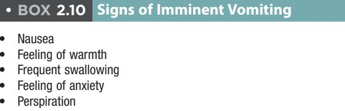

Here is a concise, high-quality study guide summarizing the provided textbook section.

# 2 Prevention and Management of Medical Emergencies

JAMES R. HUPP AND ALISON YEUNG

# CHAPTER OUTLINE

*   Prevention, 20
*   Preparation, 21
    *   Continuing Education, 21
    *   Office Staff Training, 21
    *   Access to Help, 21
    *   Emergency Supplies and Equipment, 21
*   Medical Emergencies, 22
    *   Hypersensitivity Reactions, 22
    *   Chest Discomfort, 25
    *   Respiratory Difficulty, 26
        *   Asthma, 27
        *   Hyperventilation, 27
        *   Chronic Obstructive Pulmonary Disease, 28
        *   Foreign Body Aspiration, 28
        *   Gastric Contents Aspiration, 29
    *   Altered Consciousness, 30
        *   Vasovagal Syncope, 30
        *   Orthostatic Hypotension, 31
        *   Seizure
        *   Local Anesthetic Toxicity
        *   Diabetes Mellitus
        *   Thyroid Dysfunction
        *   Adrenal Insufficiency
        *   Cerebrovascular Compromise

Serious medical emergencies in general dental offices are rare, largely due to dental education focusing on problem recognition and patient referral. Oral surgical procedures, with their inherent mental/physiologic stress and advanced pain/anxiety control, can predispose patients with moderately or poorly compensated medical conditions to emergencies.

# Prevention

Understanding emergency frequency and potential severity guides preventive measures.

*   **Most Common Emergencies:** Hyperventilation, seizures, suspected hypoglycemia. Followed by vasovagal syncope, angina pectoris, orthostatic hypotension, hypersensitivity reactions.
*   **Higher Incidence in Ambulatory Oral Surgery:**
    1.  Surgery is more stress provoking.
    2.  Greater number of medications administered perioperatively.
    3.  Longer appointments often necessary.
*   **Other Risk Factors:** Very young and old patients, increasing number of medically complex ambulatory patients, variety of drugs dentists administer.
*   **Cornerstone of Management:** Prevention, starting with risk assessment.
    *   **Medical Evaluation:** Accurate medical history, review of systems (guided by pertinent positives), vital signs, tailored physical examination (regularly updated).
*   **Predisposing Conditions:** Certain medical conditions are more likely to turn into an emergency under physiologic or emotional stress.

> • BOX 2.1 Medical Emergencies Commonly Provoked by Anxiety
>
> *   Angina pectoris
> *   Thyroid storm
> *   Myocardial infarction
> *   Insulin shock
> *   Asthmatic bronchospasm
> *   Hyperventilation
> *   Adrenal insufficiency (acute)
> *   Epilepsy
> *   Severe hypertension

*   **Modification of Care:** Once at-risk patients are identified, modifying care delivery prevents most problems.

# Preparation

Preparedness is the second most important factor.

> • BOX 2.2 Preparation for Medical Emergencies
>
> 1.  Personal continuing education in emergency recognition and management
> 2.  Auxiliary staff education in emergency recognition and management
> 3.  Establishment and periodic testing of a system to access medical assistance readily when an emergency occurs
> 4.  Equipping office with supplies necessary for emergency care

### **Continuing Education**

*   Clinicians should seek continuing education to refresh knowledge and learn new concepts in emergency management.
*   **Essential:** Maintain certification in basic life support (BLS), including automated external defibrillator (AED) use.
*   **Recommendation:** Annual emergency management CE, biannual BLS skills update.
*   **Advanced Training:** Dentists delivering parenteral sedatives (other than nitrous oxide) should obtain Advanced Cardiac Life Support (ACLS) certification.

### **Office Staff Training**

*   All personnel must be trained to assist in emergency recognition and management.
*   **Reinforcement:** Regular emergency drills, annual BLS skills renewal for all staff.
*   **Preassignment:** Specific responsibilities should be preassigned for each person during an emergency.

> BOX 2.3 Basic Life Support
>
> ABCs
>
> *   A—Airway
> *   B—Breathing
> *   C—Circulation
>
> Airway Obtained and Maintained by a Combination of the Following:
>
> 1.  Extending head at the neck by pushing upward on the chin with one hand and pushing the forehead back with other hand
> 2.  Pushing mandible forward by pressure on the mandibular angles
> 3.  Pulling mandible forward by pulling on anterior mandible
> 4.  Pulling tongue forward, using suture material or instrument to grasp anterior part of tongue
>
> Breathing Provided by One of the Following:
>
> 1.  Mouth-to-mask ventilation
> 2.  Resuscitation bag ventilation
>
> Circulation Provided by External Cardiac Compressions

### **Access to Help**

*   **Pre-identification:** Identify individuals with useful training (oral-maxillofacial surgeons, general surgeons, internists, anesthesiologists).
*   **Emergency Medical Services (EMS):** Utilize 911 for rapid-response teams.
*   **Local Facilities:** Identify a nearby hospital or freestanding emergency care facility.
*   **Contact Information:** Keep appropriate telephone numbers readily available (on phones, in memory, cellphone contacts) and test their accuracy periodically.

### **Emergency Supplies and Equipment**

*   **Dental Chair:** Must facilitate supine or head-down, feet-raised position, and lower close to the floor for BLS (or use standing stools).
*   **Operatory Size:** Large enough for patient to be placed on floor for BLS, or use specially designed boards under the thorax in the chair.
*   **Respiratory Assistance Equipment:** Oral/nasal airways, large suction tips, high-volume suction connector tubing, resuscitation bags (e.g., AMBU bags) with clear facemasks. Laryngoscopes and endotracheal tubes may be helpful for trained dentists or assisting personnel.
*   **Drug Administration Equipment:** Syringes/needles, tourniquets, intravenous (IV) solutions, indwelling catheters, and IV tubing.

#### TABLE 2.1 Emergency Supplies for the Dental Office

| Use                                                      | Supplies                                                                                                                                                                                                                                                                     |
|----------------------------------------------------------|------------------------------------------------------------------------------------------------------------------------------------------------------------------------------------------------------------------------------------------------------------------------------|
| Establishment and maintenance of intravenous access | Plastic indwelling catheter, metal indwelling catheter, intravenous tubing with flow valve, tourniquet, 1-inch wide plastic tape, crystalloid solution (normal saline, 5% dextrose in water)                                                                     |
| High-volume suction                                      | Large-diameter suction tip, tonsillar suction tip, extension tubing, connectors to adapt tubing to office suction                                                                                                                                                      |
| Drug administration                                      | Plastic syringes (5 and 10 mL), needles (18 and 21 gauge)                                                                                                                                                                                                                    |
| Oxygen administration                                    | Clear facemask, resuscitation bag (air mask bag unit), extension oxygen tubing (with and without nasal catheters), oxygen cylinder with flow valve, oral and nasal airways, a endotracheal tube, a demand valve oxygen mask a |

aFor use by dentists with appropriate training or by those called to give medical assistance.

*   **Emergency Kits:** Commercially available.
    
    > • Fig. 2.1 (A) Example of commercially available emergency kit of appropriate size and complexity for dental office. (B) Office emergency response systems are available to help guide the dentist and staff during emergencies and drills. (B, Courtesy Institute of Medical Emergency Preparedness (IMEP), Virginia Beach, VA.)
*   **Labeling:** Drugs and equipment must be clearly labeled with name and common use, checked frequently for completeness and expiration dates.

#### TABLE 2.2 Emergency Drugs for the Dental Office

| General Drug Group                               | Common Examples                                                                                |
|--------------------------------------------------|------------------------------------------------------------------------------------------------|
| Parenteral Preparations                          |                                                                                                |
| Analgesic                                        | Morphine sulfate                                                                               |
| Anticonvulsant                                   | Diazepam, midazolam                                                                            |
| Antihistamine                                    | Diphenhydramine (Benadryl), chlorpheniramine (Chlor-Trimeton)                               |
| Antihypoglycemic                                 | 50% dextrose in water, glucagon                                                                |
| Corticosteroid                                   | Methylprednisolone (Solu-Medrol), dexamethasone (Decadron), hydrocortisone (Solu-Cortef) |
| Narcotic antagonist/ benzodiazepine antagonist | Naloxone (Narcan) Flumazenil (Romazicon)                                                    |
| Sympathomimetic                                  | Epinephrine                                                                                    |
| Vagolytic                                        | Atropine                                                                                       |
| Oral Preparations                                |                                                                                                |
| Antihistamine                                    | Diphenhydramine (Benadryl), chlorpheniramine (Chlor-Trimeton)                               |
| Antihypoglycemic                                 | Candy (containing sugar), fruit juice, sugar cubes, glucose gel                             |
| Antiplatelet                                     | Aspirin                                                                                        |
| Vasodilator                                      | Nitroglycerine (Nitrostat, Nitrolingual)                                                       |
| Inhaled Preparations                             |                                                                                                |
| Bronchodilator                                   | Metaproterenol (Alupent), epinephrine bitartrate (Medihaler- Epi) albuterol              |
| Oxygen                                           | –                                                                                              |
| Respiratory stimulant                            | Aromatic ammonia                                                                               |

*   **Oxygen:** Must be available. Portable tank or central system with portable backup. Dentist must be trained to deliver oxygen under positive pressure. Regularly check supply.

# Medical Emergencies

### Hypersensitivity Reactions

*   **Type 1 (Immediate Hypersensitivity):** Acute, life-threatening. Mediated by IgE antibodies. Requires prior antigen exposure, leading to mast cell degranulation and widespread histamine release.

#### TABLE 2.3 Manifestations and Management of Hypersensitivity (Allergic) Reactions

| Manifestations                                                                                                                                                                                                                                 | Management                                                                                                                                                                                                                                                                                                                                                                                                                                                                                                                                                  |
|------------------------------------------------------------------------------------------------------------------------------------------------------------------------------------------------------------------------------------------------|-------------------------------------------------------------------------------------------------------------------------------------------------------------------------------------------------------------------------------------------------------------------------------------------------------------------------------------------------------------------------------------------------------------------------------------------------------------------------------------------------------------------------------------------------------------|
| **Skin Signs**                                                                                                                                                                                                                                 |                                                                                                                                                                                                                                                                                                                                                                                                                                                                                                                                                             |
| Delayed-onset skin signs: erythema, urticaria, pruritus, angioedema                                                                                                                                                                            | Stop administration of all drugs presently in use. Administer IV or IM Benadryla 50 mg or Chlor-Trimetonb 10 mg. Refer to physician. Prescribe oral antihistamine such as Benadryl 50 mg q6h or Chlor-Trimeton 10 mg q6h. Can prescribe tapering dose of an oral corticosteroid (prednisone or methylprednisolone dose pack).                                                                                                                                                                                                                               |
| Immediate-onset skin signs: erythema, urticaria, pruritus                                                                                                                                                                                      | Stop administration of all drugs presently in use. Administer antihistamine IM or IV Benadryl 50 mg or Chlor-Trimeton 10 mg. Consider administering 100 mg of hydrocortisone, 8 mg of dexamethasone, or 125 mg of methylprednisolone. Monitor vital signs. Consult patient's physician. Observe in office for 1 hour. Prescribe Benadryl 50 mg q6h or Chlor-Trimeton 10 mg q6h. Prescribe tapering dose of an oral corticosteroid.                                                                                                                          |
| **Respiratory Tract Signs With or Without Cardiovascular or Skin Signs**                                                                                                                                                                       |                                                                                                                                                                                                                                                                                                                                                                                                                                                                                                                                                             |
| Wheezing, mild dyspnea                                                                                                                                                                                                                         | Stop administration of all drugs presently in use. Place patient in sitting position. Administer 2 puffs of inhaled β-agonist, repeat up to 3 doses if no cardiovascular compromise is present. Consider administering 100 mg of hydrocortisone, 8 mg of dexamethasone, or 125 mg of methylprednisolone. Administer epinephrine if signs of cardiovascular compromise or airway obstruction are present.c Provide IV access. Consult patient's physician or emergency department physician. Observe in office for at least 1 hour. Prescribe antihistamine. |
| Stridorous breathing (i.e., crowing sound), moderate to severe dyspnea                                                                                                                                                                         | Stop administration of all drugs presently in use. Sit the patient upright, and have someone summon medical assistance. Administer epinephrine.a Give oxygen (6 L/min) by facemask or nasally. Monitor vital signs frequently. Administer antihistamine and corticosteroid. Provide IV access; if signs worsen, treat as for anaphylaxis. Consult patient's physician or emergency room physician; prepare for transport to emergency department if signs do not improve rapidly.                                                                           |
| Anaphylaxis (with or without skin signs): malaise, wheezing, stridor, cyanosis, total airway obstruction, nausea and vomiting, abdominal cramps, urinary incontinence, tachycardia, hypotension, cardiac dysrhythmias, cardiac arrest | Stop administration of all drugs. Position patient supine on back board or on floor and have someone summon assistance. Administer epinephrine.a Initiate basic life support and monitor vital signs. Consider cricothyrotomy if trained to perform and if laryngospasm is not quickly relieved with epinephrine. Provide IV access. Give oxygen at 6 L/min. Administer antihistamine IV or IM. Prepare for transport.                                                                                                                                |

*IM*, Intramuscular; *IV*, intravenous; aBrand of diphenhydramine. bBrand of chlorpheniramine. cAs described in "Immediate Onset" section.

*   **Manifestations (Progression):**
    *   **Dermatologic:** Localized pruritus, erythema, urticaria (wheals), angioedema. Not dangerous alone but can be first sign of more serious reactions; rapid progression is concerning.
    *   **Respiratory Tract:** More serious.
        *   Small airways: Wheezing, bronchospasm, dyspnea, cyanosis, accessory muscle use.
        *   Larger airways (Larynx/Vocal cords): Angioedema, partial/total obstruction, inability to speak, stridor.
    *   **Generalized Anaphylaxis:** Most dramatic, usually rapid onset (seconds-minutes parenterally, delayed orally/topically).
        *   Symptoms: Malaise, impending doom, flushing, urticaria, pruritus (face/trunk), nausea/vomiting, abdominal cramping, urinary incontinence.
        *   Respiratory compromise: Dyspnea, wheezing, cyanosis, total upper airway obstruction, unconsciousness.
        *   Cardiovascular dysfunction: Tachycardia, palpitations, hypotension (peripheral vasodilation, decreased cardiac output), dysrhythmias, loss of consciousness, cardiac arrest.
        *   **Usual Cause of Death:** Laryngeal obstruction due to vocal cord edema.
*   **Prevention:**
    *   Question patients about drug allergies during initial and recall visits.
    *   Clarify claimed allergies (e.g., local anesthetics) to differentiate true allergy from vasovagal or epinephrine sensitivity.
    *   Refer for hypersensitivity testing if true allergy is possible.
    *   Prominently display allergy information on the patient's record.
*   **Management (Severity-Dependent):**
    *   **Initial Step:** Cease administration of parenterally given drug.

    > \*All doses given in this chapter are those recommended for an average adult. Doses will vary for children, for older adults, and for those with debilitating diseases. The clinician should consult a drug reference book for additional information.

    *   **Skin/Mucosa Only:**
        *   IV or IM antihistamine: Diphenhydramine 50 mg or chlorpheniramine 10 mg.
        *   Continue oral antihistamine (Diphenhydramine 50 mg or Chlorpheniramine 8 mg) q6-8h for 24-48 hours.
        *   Immediate, severe urticaria: Parenteral corticosteroid (hydrocortisone 100 mg, dexamethasone 8 mg, or methylprednisolone 125 mg) followed by antihistamine.
        *   Monitor vital signs (1 hour), refer to physician/ER.
    *   **Lower Respiratory Tract (Wheezing):**
        *   Summon emergency assistance immediately.
        *   Semi-reclined position, nasal oxygen.
        *   If dyspneic, cardiovascularly stable: Albuterol 2 puffs (repeat up to 3 doses).
        *   Significant respiratory distress: Epinephrine IM (0.3 mL of 1:1000 solution) or aerosol inhaler (0.3 mg). Repeat within 5 minutes if symptoms persist.
        *   Antihistamines, corticosteroids.
        *   Immediate transfer to nearest emergency facility.
    *   **Laryngeal Obstruction (Stridor):**
        *   Epinephrine (0.3 mL of 1:1000 solution IM) ASAP, oxygen.
        *   Loss of consciousness and ventilation failure: Emergency cricothyrotomy or intubation.
        > \*Cricothyrotomy is the surgical creation of an opening into the cricothyroid membrane just below the thyroid cartilage to create a path for ventilation that bypasses the vocal chords.
        *   Cricothyrotomy is the true emergency airway. Tracheostomy requires a controlled environment.
        *   Once airway reestablished: Antihistamine, further epinephrine doses.
        *   Monitor vital signs, maintain patient until emergency assistance.
    *   **Cardiovascular System Compromise:** Closely monitor for hypotension and bradycardia. Initiate BLS if cardiac output falls or cardiac arrest occurs.

### Chest Discomfort

*   **Importance:** Rapid identification of cause.
*   **Cardiac Ischemia Description:** Squeezing, heaviness, retrosternal location, radiating to left shoulder/arm/neck/mandible. Often associated with exertion, heavy meal, anxiety, or horizontal posture. Relieved by vasodilators (nitroglycerin) or rest (angina). May be accompanied by dyspnea, nausea, weakness, palpitations, perspiration, impending doom.

> • BOX 2.4 Clinical Characteristics of Chest Pain Caused by Myocardial Ischemia or Infarction as Described by Patients
>
> *   Squeezing, bursting, pressing, burning, choking, or crushing (not typically sharp or stabbing)
> *   Substernally located, with variable radiation to left shoulder, arm, or left side (or a combination of these areas) of neck and mandible; occasionally may manifest as severe pain in the back between the shoulder blades
> *   Frequently associated at the onset with exertion, heavy meal, anxiety, or on assuming horizontal posture
> *   Relieved by vasodilators such as nitroglycerin, or rest (in the case of angina)
> *   Accompanied by dyspnea, nausea, weakness, palpitations, perspiration, or a feeling of impending doom (or a combination of these symptoms)

> BOX 2.5 Differential Diagnosis of Acute-Onset Chest Pain
>
> **Common Causes**
>
> *   Cardiovascular system: Angina pectoris, myocardial infarction
> *   Gastrointestinal tract: Dyspepsia (i.e., heartburn), hiatal hernia, reflux esophagitis, gastric ulcers
> *   Musculoskeletal system: Intercostal muscle spasm, rib or chest muscle contusions
> *   Psychological: Hyperventilation
>
> **Uncommon Causes**
>
> *   Cardiovascular system: Pericarditis, dissecting aortic aneurysm
> *   Respiratory system: Pulmonary embolism, pleuritis, tracheobronchitis, mediastinitis, pneumothorax
> *   Gastrointestinal tract: Esophageal rupture, achalasia
> *   Musculoskeletal system: Osteochondritis, chondrosternitis
> *   Psychological: Psychogenic chest pain (i.e., imagined chest pain)

*   **Differentiation:**
    *   **Documented Heart Disease:** Patients usually confirm it's their angina.
    *   **Unknown Cause:** Ask about exact location, radiation, changes over time, and postural effects.
    *   **Gastric Reflux:** Improves sitting up and with antacids.
    *   **Costochondritis/Pulmonary:** Varies with respirations or stimulated by manual pressure.
    *   **Anxiety:** Difficult to differentiate from cardiogenic issues without monitoring.
*   **Management (Suspected Myocardial Ischemia):**
    *   Decrease myocardial work, increase myocardial oxygen supply.
    *   Stop all dental care.
    *   Reassure patient, obtain vital signs, start oxygen.
    *   Nitroglycerin: 0.4 mg sublingually or oral spray, repeated every 5 minutes (max 3 doses) if systolic BP is at least 90 mm Hg.
    *   **If stable, pain relieved, and normal NTG dose:** Discharge with plans for future surgery in an oral-maxillofacial surgery office or hospital after physician consult.
    
*   **Transport to Emergency Facility (Serious Situations):**
    *   **Irregular, rapid, or weak pulse, or BP below baseline:** Summon emergency help, place patient almost supine with legs raised, oxygen, nitroglycerin therapy. Initiate venous access (slow 5% dextrose in normal saline IV drip) for emergency personnel.
    *   **Discomfort not relieved after 20 minutes of therapy:** Presume myocardial infarction (MI). Patient prone to dysrhythmias/cardiac arrest.
        *   Monitor vital signs frequently, institute BLS if indicated.
        *   Aspirin: 325 mg chewed and swallowed (antiplatelet).
        *   Morphine sulfate: 4-6 mg IM or subcutaneously (relieve discomfort, reduce anxiety, beneficial for pulmonary edema; avoid significant hypotension).
        *   Expedite transfer for potential thrombolytics, angioplasty, stenting, or coronary artery bypass grafting.

### Respiratory Difficulty

*   **At-Risk Patients:** Asthma, COPD, anxious, atopic, or those receiving non-inhalation sedatives (respiratory depressants). Prompt treatment is crucial.

#### Asthma

*   **Triggers:** Emotional stress, certain pharmacologic agents.
*   **Manifestations:** Shortness of breath, desire to sit erect, audible wheezing, tachypnea, tachycardia, accessory muscle use. Progression to hypoxia, cyanosis, eventual loss of consciousness.

> BOX 2.6 Manifestations of an Acute Asthmatic Episode
>
> #### Mild to Moderate
>
> *   Wheezing (audible with or without stethoscope)
> *   Dyspnea (i.e., labored breathing)
> *   Tachycardia
> *   Coughing
> *   Anxiety
>
> ## Severe
>
> *   Intense dyspnea with flaring of nostrils and use of accessory muscles of respiration
> *   Cyanosis of mucous membranes and nail beds
> *   Minimal breath sounds on auscultation
> *   Flushing of face
> *   Extreme anxiety
> *   Mental confusion
> *   Perspiration
*   **Management:**
    1.  Place patient in an upright or almost-upright position.
    2.  Self-administer bronchodilators (patient's own or office supply: epinephrine, isoproterenol, metaproterenol, or albuterol). Administer repeated doses cautiously.
    3.  Administer oxygen via nasal prongs or facemask.
    4.  Severe episodes or ineffective aerosol: Epinephrine (0.3 mL of 1:1000 dilution) subcutaneously or IM.
    5.  Obtain outside emergency medical assistance for severe distress.
    
*   **Note:** Respiratory problems from drug allergy are managed similarly to asthma.

#### Hyperventilation

*   **Cause:** Most frequent cause of respiratory difficulty in dental setting, due to anxiety, typically in teens, 20s, and 30s. Preventable by anxiety control.
*   **Prevention:** Dentists should recognize patient apprehension, encourage concerns, use anxiety-reduction protocols, and consider pharmacologic anxiolysis.
*   **Manifestations:** Inability to get enough air, rapid breathing (tachypnea), agitation. Rapid CO2 elimination leads to alkalosis, causing light-headedness, tingling (fingers, toes, perioral), muscle twitches/convulsions, and eventual loss of consciousness.

> BOX 2.7 Manifestations of Hyperventilation Syndrome
>
> ## Neurologic
>
> *   Dizziness
> *   Syncope
> *   Tingling or numbness of fingers, toes, or lips
>
> #### Respiratory
>
> *   Chest pain
> *   Feeling of shortness of breath
> *   Increased rate and depth of breaths
> *   Xerostomia
>
> #### Cardiac
>
> *   Palpitations
> *   Tachycardia
>
> #### **Musculoskeletal**
>
> *   Muscle spasm
> *   Myalgia
> *   Tetany
> *   Tremor
>
> #### **Psychological**
>
> Extreme anxiety
*   **Management:**
    1.  Terminate surgical procedure.
    2.  Position patient in a semi-upright position.
    3.  Provide reassurance.
    4.  If alkalosis symptoms occur: Have patient breathe in and out of a small bag (to return CO2 levels to normal). Oxygen-enriched air is *not* indicated.
    5.  If hyperventilation continues: Administer sedative (midazolam 2-4 mg IM or by IV titration) until cessation or sedation.
    6.  Reschedule patient, plan preoperative anxiolytics or intraoperative sedation (or both) for future visits.

> • BOX 2.8 Management of Hyperventilation Syndrome
>
> 1.  Terminate all dental treatment, and remove foreign bodies from mouth.
> 2.  Position patient in chair in almost fully upright position.
> 3.  Attempt to calm patient verbally.
> 4.  Have patient breathe carbon dioxide—enriched air, such as in and out of a small bag or cupped hands.
> 5.  If symptoms persist or worsen, administer diazepam 10 mg intramuscularly or titrate slowly intravenously until anxiety is relieved, or administer midazolam 5 mg intramuscularly or titrate slowly intravenously until anxiety is relieved.
> 6.  Monitor the vital signs.
> 7.  Perform all further dental surgery using anxiety-reducing measures.

#### Chronic Obstructive Pulmonary Disease

*   **Challenges:** Many patients depend on upright posture to breathe and use low blood oxygen (hypoxia) as their primary respiratory stimulus due to high arterial CO2 levels.
*   **Risks:** Supine position (interferes with accessory muscle use), high-flow nasal oxygen (can depress respiratory drive).
*   **Manifestations:** Patients will ask or struggle to sit up before problems occur. Excessive lung secretions.
*   **Excessive Oxygen Administration:** Respiratory rate falls, cyanosis, potential apnea.
*   **Management (from excessive oxygen):** Discontinue oxygen before apnea occurs; respiratory rate should improve. If apnea/loss of consciousness: initiate BLS and summon emergency assistance.
*   **Acute Exacerbation:**
    *   Signs: Use of accessory muscles, tachypnea, increased cough frequency, change in sputum.
    *   Management: Postpone elective surgery. Optimize airways with prophylactic bronchodilator. Consider oral-maxillofacial surgeon referral for emergency surgery.

#### Foreign Body Aspiration

*   **Risk:** Always a potential problem, especially with supine/semi-upright positioning or dull gag reflex (sedation).
*   **Swallowed Objects:** Usually pass harmlessly through GI tract. Obtain chest and abdominal radiographs to rule out asymptomatic respiratory aspiration.
*   **Laryngeal Aspiration (lightly sedated/nonsedated):** Violent coughing (may expel), patient can still talk and breathe.
*   **Larger Objects (Airway Obstruction):** Ineffective coughing (lungs cannot fill), inability to vocalize, extreme anxiety, cyanosis, loss of consciousness.

> • BOX 2.9 Acute Manifestations of Aspiration Into the Lower Respiratory Tract
>
> ## Large Foreign Body
>
> *   Coughing
> *   Choking sensation
> *   Stridorous breathing (i.e., crowing sounds)
> *   Severe dyspnea
> *   Feeling of something caught in throat
> *   Inability to breathe
> *   Cyanosis
> *   Loss of consciousness
>
> **Gastric Contents**
>
> *   Coughing
> *   Stridorous breathing
> *   Wheezing or rales (i.e., cracking sound) on chest auscultation
> *   Tachycardia
> *   Hypotension
> *   Dyspnea
> *   Cyanosis
*   **Management (Depends on Obstruction):**
    *   **Partially Obstructed, Intact Gag Reflex:** Allow patient to cough. If unsuccessful: supplemental oxygen, transport to emergency facility for laryngoscopy or bronchoscopy.
    *   **Completely Obstructed, Awake Adult:** Perform abdominal thrusts (Heimlich maneuvers) until expulsion or loss of consciousness.
    
    > • Fig. 2.4 (A) Method of performing abdominal thrusts for an unconscious patient with a foreign body obstructing the airway. The chair is first placed in the recumbent position. The heel of the dentist's right palm is placed on the abdomen just below the xiphoid process with the elbow kept locked and the left hand placed over the right for further delivery of force. Arms are quickly thrust into the patient's abdomen, directing force down and superiorly. (B) Proper positioning for the Heimlich maneuver is shown. The rescuer approaches the patient from behind and positions hands on the patient's abdomen, just below the rib cage. The rescuer's hands are then quickly pulled into the abdominal area in an attempt to have any residual air in the lungs dislodge the obstruction from the airway.
    *   **Diminished Gag Reflex (Sedation) or Completely Obstructed, Lost Consciousness:**
        *   Perform abdominal thrusts with patient in supine position.
        *   After each volley: Quickly turn patient onto side, finger sweep mouth to remove expelled object.
        *   If not exchanging air: Start BLS.
        *   If air cannot be blown into lungs: Additional abdominal thrusts, oral finger sweeps, BLS.
        *   Dentists trained in laryngoscopy may use Magill forceps (do not waste time and prolong hypoxia).
        *   If several attempts fail: Emergency cricothyrotomy may be necessary.
    
    

#### Gastric Contents Aspiration

*   **Pathophysiology:** Particulate matter causes physical obstruction; high acidity of gastric material causes necrotizing pulmonary tissue. Leads to respiratory distress syndrome (fluid transudation into alveoli, loss of functioning lung tissue).
*   **Risk Factors:** Diminished gag reflex (sedation, unconsciousness, topical anesthesia).
*   **Manifestations (Significant Aspiration):** Tachypnea, wheezing. Then tachycardia, hypotension. Worsening ventilatory capability leads to cyanosis. Eventual respiratory failure (refractory to BLS) requiring intubation and high oxygen concentrations.
*   **Prevention:** Instruct patients to avoid eating or drinking for 8 hours before moderate/deep sedation.
*   **Management (Vomiting, Suspected Aspiration):**
    1.  Immediately place deeply sedated/unconscious patient into a head-down, feet-raised position and turn onto their side for oral drainage.
    2.  Use high-volume suction to remove vomitus.
    3.  If gastric material is suspected in lower respiratory tract: Contact emergency assistance immediately.
    4.  Place patient on supplemental oxygen. Monitor vital signs.
    5.  Gain venous access (start IV line) and be prepared to administer crystalloid solution (normal saline or 5% dextrose in normal saline) for falling blood pressure and for emergency technicians to administer IV bronchodilators if needed.
    6.  Immediate transportation to an emergency facility is mandatory.
    
    > • Fig. 2.6 Management of vomiting with possible aspiration of gastric contents.

### Altered Consciousness

Alteration in consciousness can range from mild light-headedness to complete loss of consciousness. Discussed here are common conditions during oral surgical procedures.

#### Vasovagal Syncope

*   **Most Common Cause:** Transient loss of consciousness in the dental office.
*   **Cause:** Emotional stress (anticipation/delivery of dental care) triggers cardiovascular events: catecholamine increase causes reflexive decrease in peripheral vascular resistance (vasodilation), vagally mediated bradycardia, and sweating. Blood pooling in periphery leads to drop in arterial BP and decreased cerebral blood flow.
*   **Manifestations:** Generalized warmth, nausea, palpitations. Dizziness, weakness. Syncope (loss of consciousness). If cerebral ischemia develops slowly, seizures may occur.
*   **Recovery:** Rapidly ends when patient is placed in a horizontal (supine) position with feet elevated (Trendelenburg position). Post-recovery: pallor, nausea, weakness for several minutes.
*   **Prevention:**
    *   Proper patient preparation.
    *   Extremely anxious patients: anxiety-reduction protocol, anxiolytic drugs.
    *   Oral surgical care: Semi-supine or fully supine position.
*   **Management (Impending Syncope):**
    1.  Place patient in fully supine position or with legs elevated above heart.
    2.  Cool, moist towel on forehead.
    3.  If hypoventilating and slow to recover: Aromatic ammonia (respiratory stimulant).
    4.  If consciousness is delayed >1 minute: Consider alternative causes.
    5.  After early recovery: Allow recovery in office, discharge with an escort.
    6.  Future visits: Require preoperative sedation and other anxiety-reducing measures.

> • Fig. 2.7 Pathophysiology and manifestations of vasovagal syncope.

> • Fig. 2.8 Management of vasovagal syncope and its prodrome.

#### Orthostatic Hypotension

A common cause of a transient altered state of consciousness in the dental setting is orthostatic (or postural) hypotension. This problem occurs because of pooling of blood in the periphery that is not remobilized quickly enough via peripheral vasoconstriction and increased heart rate to prevent cerebral ischemia when a patient rapidly assumes an upright posture. Therefore the patient will feel light-headed or become syncopal. Patients with orthostatic hypotension who remain conscious will usually complain of palpitations and generalized weakness. Most individuals who are not hypovolemic or have orthostatic hypotension resulting from the pharmacologic effects of drugs such as antihypertensive agents will quickly recover by reassuming the reclined position. Once symptoms disappear, the patient can generally sit up (although this should be done slowly on the edge of the chair for a few moments before standing). Blood pressure can be taken in each position and allowed to return to normal before a more upright posture is allowed.

> BOX 2.11 Management of Orthostatic Hypotension
>
> - 1. Terminate all dental treatment.
> - 2. Place the patient in the supine position with legs raised above the level of the head.
> - 3. Monitor the vital signs.
> - 4. Once blood pressure improves, slowly return the patient to the sitting position.
> - 5. Discharge the patient home once the vital signs are normal and stable.
> - 6. Obtain medical consultation before any further dental care.

Some patients have a predisposition to orthostatic hypotension. In the ambulatory population, this is usually encountered in patients receiving the following medications: drugs that produce intravascular depletion such as diuretics; drugs that produce peripheral vasodilation such as most nondiuretic antihypertensives, narcotics, and many psychiatric drugs; and drugs that prevent the heart rate from increasing reflexively such as β-sympathetic antagonist medications (e.g., propranolol). Patients with a predisposition to postural hypotension can usually be managed by allowing a much longer period to attain the standing position (i.e., by stopping at several increments while becoming upright to allow reflex cardiovascular compensation to occur). If the patient was sedated by using long-acting narcotics, an antagonist such as naloxone may be necessary. Patients with severe problems with postural hypotension as a result of drug therapy should be referred to their physician for possible modification of their drug regimen.

#### Seizure

Idiopathic seizure disorders are exhibited in many ways, ranging from grand mal seizures with their frightening display of clonic contortions of the trunk and extremities to petit mal seizures that may occur with only episodic absences (e.g., blank stare). Although rare, some seizure disorders, such as those resulting from injury-induced brain damage or damage from ethanol abuse, have a known cause. Usually, the patient will have had the seizure disorder previously diagnosed and will be receiving antiseizure medications, such as phenytoin (Dilantin) or levitiracetam (Keppra). The dentist should find out, through the medical interview, the degree of the patient's seizure control, discover any factors that seem to precipitate the seizure, the patient's compliance with antiseizure drugs, and the recent frequency of seizure episodes.

The occurrence of a seizure while a patient is undergoing care in the dental office is rarely an emergency that calls for actions other than simply protecting the patient from self-injury.

*   **Airway Management:** The patient's ability to exchange air must be monitored. If obstructed, reopen by placing the head in moderate extension and moving the mandible away from the pharynx. If the patient vomits or has secretions, turn the head to the side to allow drainage and use high-volume suction.
*   **Apnea:** Brief periods require no treatment other than ensuring a patent airway. Apnea lasting more than 30 seconds demands that BLS be initiated.

> Although frequently described as being important, the placement of objects between teeth in an attempt to prevent tongue biting is hazardous and, therefore, should be avoided.

*   **Status Epilepticus:** Continuous or repeated seizures without recovery between them. This warrants notification of outside emergency assistance. Therapy includes measures for self-limiting seizures plus administration of a benzodiazepine.
    *   **Midazolam** is preferred for IM injection due to its water solubility and rapid response.
    *   **Diazepam** must be given intravenously.

> However, the health care provider administering benzodiazepines for a seizure must be prepared to provide BLS because patients may experience a period of apnea after receiving a large, rapid dose of benzodiazepines.

*   **Post-Seizure:** Most patients will be somnolent or unconscious. Monitor vital signs carefully. Do not allow the patient to leave until fully alert and with an escort. Notify the patient's primary care physician.
*   **Ethanol Withdrawal Seizures:** Usually preceded by tremors, palpitations, and extreme anxiety. Defer treatment. Control is obtained with benzodiazepines. Seizures are treated similarly to other seizures.

> Fig. 2.9 Manifestations and acute management of seizures

#### Local Anesthetic Toxicity

Toxicity reactions occur if the local anesthetic is given in an amount or in a manner that produces an excessive serum concentration.

*   **Prevention:**
    1.  **Dose:** Use the least amount necessary. Consider patient's age, lean body mass, liver function, and history.
    2.  **Administration:** Give the dose slowly, avoiding intravascular injection. Use vasoconstrictors to slow entry into blood.
    > It must be remembered that topical use of local anesthetics in wounds or on mucosal surfaces allows rapid entry of local anesthetics into the systemic circulation.
    3.  **Agent Choice:** Be knowledgeable about the properties of various local anesthetics.

##### TABLE 2.4 Suggested Maximum Dose of Local Anesthetics

| Drug                                                    | Common Brand                 | Concentration                             | Maximum Dose (mg/kg) | Maximum Number of 1.8-mL Cartridges |
|---------------------------------------------------------|------------------------------|-------------------------------------------|-------------------------|----------------------------------------|
| Lidocaine                                               | Xylocaine                    | 2%                                        | 4                       | 10                                     |
| Lidocaine with epinephrinea                             | Xylocaine with epinephrine   | 2% lidocaine 1:100,000 epinephrine     | 7                       | 10                                     |
| Mepivacaine                                             | Carbocaine                   | 3%                                        | 5                       | 6                                      |
| Mepivacaine with levonordefrin                          | Carbocaine with Neo-Cobefrin | 2% mepi. 1:20,000 levonordefrin       | 5                       | 8                                      |
| Prilocaine                                              | Citanest                     | 4%                                        | 5                       | 6                                      |
| Bupivacaine with epinephrine                            | Marcaine with epinephrine    | 0.5% bupi. 1:200,000 epinephrine      | 1.5                     | 10                                     |
| Etidocaine with epinephrine                             | Duranest with epinephrine    | 1.5% etido. 1:200,000 epinephrine     | 8                       | 15                                     |

aMaximum dose of epinephrine is 0.2 mg per appointment. 
*Maximum doses are those for normal healthy individuals.*

*   **Clinical Manifestations:**
    *   **Mild:** Increased confusion, talkativeness, anxiety, slurring of speech.
    *   **Moderate:** Stuttering speech, nystagmus, generalized tremors, headache, dizziness, blurred vision, drowsiness.
    *   **Severe:** Generalized tonic-clonic seizures, cardiac depression, cardiac arrest.

##### TABLE 2.5 Manifestations and Management of Local Anesthetic Toxicity

| Manifestations                                                                                            | Management                                                                                                                                                                                                                                                                                                                                                                                            |
|-----------------------------------------------------------------------------------------------------------|-------------------------------------------------------------------------------------------------------------------------------------------------------------------------------------------------------------------------------------------------------------------------------------------------------------------------------------------------------------------------------------------------------|
| Mild toxicity: talkativeness, anxiety, slurred speech, confusion                                          | Stop administration of local anesthetics. Monitor all vital signs. Observe in office for 1 hour.                                                                                                                                                                                                                                                                                                      |
| Moderate toxicity: stuttering speech, nystagmus, tremors, headache, dizziness, blurred vision, drowsiness | Stop administration of all local anesthetics. Place in supine position. Monitor vital signs. Administer oxygen. Observe in office for 1 hour.                                                                                                                                                                                                                                                         |
| Severe toxicity: seizure, cardiac dysrhythmia or arrest                                                   | Place in supine position. If seizure occurs, protect patient from nearby objects; suction contents of oral cavity if vomiting occurs. Have someone summon medical assistance. Monitor all vital signs. Administer oxygen. Start an intravenous line. Administer diazepam 5–10 mg slowly or midazolam 2–6 mg slowly. Institute basic life support, if necessary. Transport to emergency care facility. |

#### **Diabetes Mellitus**

Severe hypoglycemia is the emergency situation dentists are most likely to face. Serum glucose levels can fall because of any or all of the following:
1.  Increasing administered insulin
2.  Decreasing dietary caloric intake
3.  Increasing metabolic use of glucose (e.g., exercise, infection, or emotional stress)

Problems during dental care usually arise because the patient has acutely decreased caloric intake, has an infection, or has an increased metabolic rate caused by anxiety, without a corresponding decrease in insulin dose.

> • BOX 2.12 Manifestations of Acute Hypoglycemia
>
> #### Mild
>
> - Hunger
> - Nausea
> - Mood change (irritability)
> - Weakness
>
> ## Moderate
>
> - Anxiety
> - Behavior change: belligerence, confusion, uncooperativeness
> - Pallor
> - Perspiration
> - Tachycardia
>
> ## Severe
>
> - Hypotension
> - Seizures
> - Unconsciousness

*   **Prevention:** Get a clear idea of the patient's diabetic control during the health history. Contact their physician if unsure. Avoid hypoglycemia by keeping serum glucose levels on the high side of normal or even temporarily above normal.
*   **Management:**

> Fig. 2.10 Management of acute hypoglycemia.

*   A patient who has recovered should remain in the office for at least 1 hour and be escorted home.

#### **Thyroid Dysfunction**

The most common emergency is a *thyroid storm* (crisis), a sudden, severe exacerbation of hyperthyroidism precipitated by infection, surgery, trauma, or stress.

*   **Predisposing Signs:** Tremor, tachycardia, weight loss, hypertension, irritability, intolerance to heat, and exophthalmos.
*   **Prevention:** Consult the primary care physician of a patient with known hyperthyroidism before any oral surgical procedure to determine adequacy of control.
*   **Manifestations:** The first sign is an elevation of temperature and heart rate. The patient becomes irritable, delirious, or comatose. Hypotension, vomiting, and diarrhea also occur.
*   **Management:**

> • BOX 2.13 Manifestations and Management of Acute Thyroid Storm
>
> # Manifestations
>
> - Abdominal pains
> - Cardiac dysrhythmias
> - Hyperpyrexia (i.e., fever)
> - Nausea and vomiting
> - Nervousness and agitation
> - Palpitations
> - Partial or complete loss of consciousness
> - Tachycardia
> - Tremor
> - Weakness
>
> # Management
>
> - 1. Terminate all dental treatment.
> - 2. Have someone summon medical assistance.
> - 3. Administer oxygen.
> - 4. Monitor all vital signs.
> - 5. Initiate basic life support, if necessary.
> - 6. Start an intravenous line with drip of crystalloid solution (150 mL/h).
> - 7. Transport the patient to an emergency care facility.

#### **Adrenal Insufficiency**

Adrenal insufficiency resulting from exogenous corticosteroid administration is common. If a stressed patient has adrenal suppression, they may be unable to release endogenous glucocorticoids to meet elevated metabolic demands.

*   **At-Risk Patients:** Those who take at least 20 mg of cortisol (or its equivalent) daily for at least 2 weeks any time during the year preceding a major oral surgical procedure.
*   **Note:** For most straightforward procedures under local or nitrous oxide, supplemental corticosteroids are unnecessary.
*   **Clinical Manifestations:**

> • BOX 2.14 Manifestations of Acute Adrenal Insufficiency
>
> - Abdominal pain
> - Confusion
> - Feeling of extreme fatigue
> - Hypotension
> - Myalgia
> - Nausea
> - Partial or total loss of consciousness
> - Weakness

*   As the condition worsens, the patient develops severe mental confusion; pain in the back, abdomen, and legs; vomiting; and hypotension, eventually leading to coma.

##### TABLE 2.6 Equivalency of Commonly Used Glucocorticosteroids

| Relative Duration of Action | Generic Name                                                                                                | Common Brand Name                                            | Relative Glucocorticoid Potency | Relative Glucocorticoid Dose (mg) |
|--------------------------------|-------------------------------------------------------------------------------------------------------------|--------------------------------------------------------------|------------------------------------|--------------------------------------|
| Short                          | Cortisol (hydrocortisone) Cortisone Prednisone Prednisolone Methylprednisolone sodium succinate | Solu-Cortef — Deltasone Delta-Cortef Solu-Medrol | 1 0.8 4 4 5            | 20 25 5 5 4              |
| Intermediate                   | Triamcinolone                                                                                               | Kenalog                                                      | 5                                  | 4                                    |
| Long                           | Betamethasone Dexamethasone Depo-Medrol                                                               | Celestone Decadron Methylprednisolone acetate          | 25 30 5                      | 0.6 0.75 4                     |

*   **Management:**

> BOX 2.15 Management of Acute Adrenal Insufficiency
>
> - 1. Terminate all dental treatment.
> - 2. Place the patient in the supine position with legs raised above head level.
> - 3. Have someone summon medical assistance.
> - 4. Administer corticosteroid (100 mg hydrocortisone intramuscular or intravenous or its equivalent).
> - 5. Administer oxygen.
> - 6. Monitor all vital signs.
> - 7. Start an intravenous line and a drip of crystalloid solution.
> - 8. Start basic life support, if necessary.
> - 9. Transport the patient to an emergency care facility.

#### **Cerebrovascular Compromise**

Alterations in cerebral blood flow can be compromised by: (1) embolization, (2) thrombosis, or (3) vessel rupture. The effect on consciousness depends on the severity.

*   **Transient Ischemic Attack (TIA):** Symptoms last only seconds or minutes. Requires termination of the procedure and immediate physician referral, as TIAs frequently precede a cerebral infarction. Consciousness is usually unaltered.
*   **Cerebrovascular Compromise in Progress:** May result from embolism or hemorrhage. Embolism often starts with a mild headache followed by neurologic symptoms. Hemorrhage typically has an abrupt, severe headache, followed by nausea, dizziness, vertigo, diaphoresis, and potential loss of consciousness.

> BOX 2.16 Manifestations of Cerebrovascular Compromise in Progress
>
> - Headache that can range from mild to the worst the patient has ever experienced
> - Unilateral weakness or paralysis of extremities or facial muscles or both
> - Slurring of speech or inability to speak
> - Difficulty breathing or swallowing or both
> - Loss of bladder and bowel control
> - Seizures
> - Visual disturbance
> - Dizziness
> - Partial or total loss of consciousness

> However, oxygen is otherwise contraindicated in patients with cerebrovascular insufficiency.

*   **Management:**

> BOX 2.17 Management of Cerebrovascular Compromise in Progress
>
> - 1. Terminate all dental treatment.
> - 2. Have someone summon medical assistance.
> - 3. Place the patient in the supine position with head slightly raised.
> - 4. Monitor all vital signs.
> - 5. If loss of consciousness occurs, administer oxygen and institute basic life support, as necessary.
> - 6. Transport the patient to an emergency care facility.
>
> If symptoms are present only briefly (i.e., transient ischemic attacks), terminate dental treatment, monitor vital signs, and consult the patient's physician concerning the safety of further dental care.