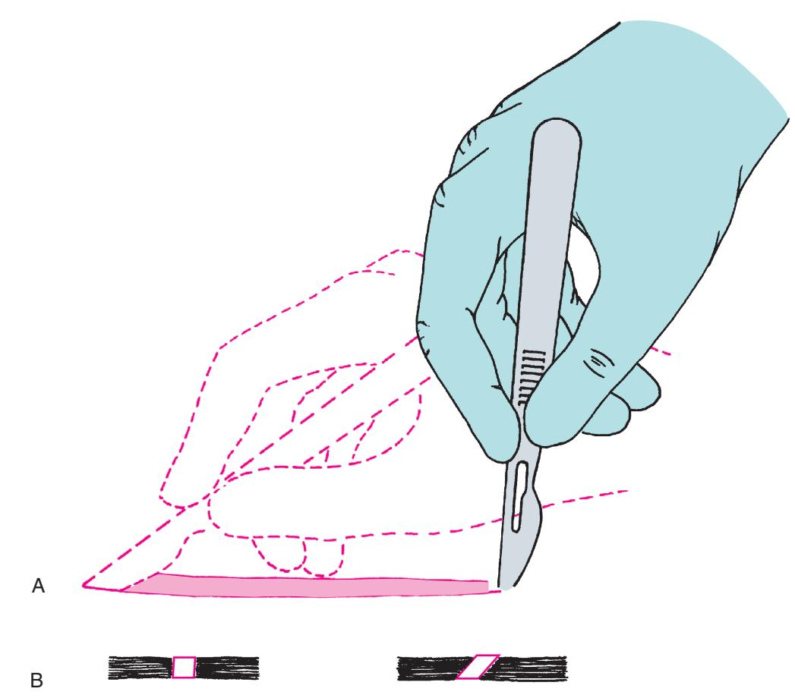
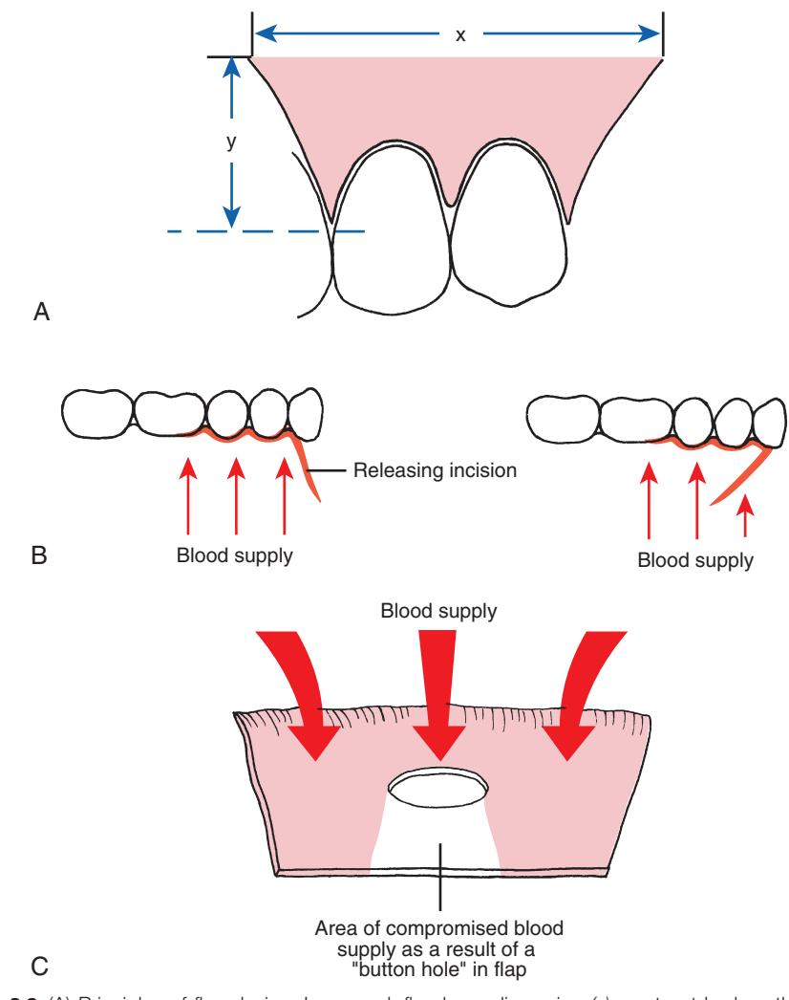
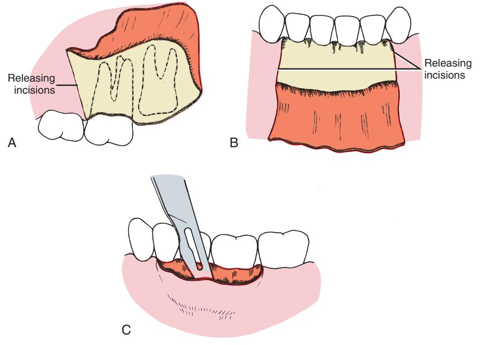
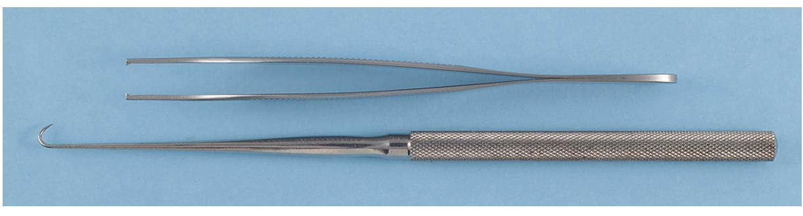
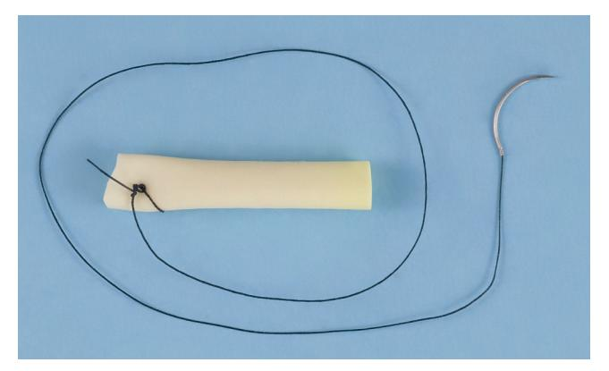

# 3 Principles of Surgery

JAMES R. HUPP

#### CHAPTER OUTLINE

Developing a Surgical Diagnosis, 38

Basic Necessities for Surgery, 38

Aseptic Technique, 39

Incisions, 39

#### Flap Design, 40

Prevention of Flap Necrosis, 40 Prevention of Flap Dehiscence, 40 Prevention of Flap Tearing, 40

#### Tissue Handling, 40

#### Hemostasis, 40

Means of Promoting Wound Hemostasis, 41 Dead Space Management, 42

Decontamination and Debridement, 43

Inflammation Control, 43

Patient General Health and Wound Healing, 43

Human tissues have genomically predetermined characteristics that define normal responses to injury. Because the response to injury is predictable, principles of surgery have evolved to help optimize the wound-healing environment guided by basic and clinical research. This chapter presents the evidence-based principles of surgical practice that have been found to be successful not only for oral surgery, but also for surgery in all sites of the body.

# Developing a Surgical Diagnosis

The important decisions concerning a surgical procedure should be made well before the administration of anesthesia commences. The decision to perform surgery should be the result of careful patient examination. In the critical thinking analytic approach the surgeon first identifies the various signs and symptoms and relevant historical information; then, using available patient and diagnostic data and logical reasoning based on clinical experience, the surgeon establishes the relationship between the individual problems for which surgical intervention may be indicated.

The initial step in the presurgical evaluation is the collection of accurate and relevant data. This occurs through patient interviews and physical, laboratory, and imaging examinations. It may include the use of consultants. Patient interviews and physical examinations should be performed in an unhurried, careful manner. The surgeon should not be willing to accept incomplete data such as a poorquality radiograph, especially when it is probable that additional data might alter decisions concerning surgery.

For proper analysis, diagnostic data must be organized into a form that allows for hypothesis testing; that is, the dentist should be able to consider a list of possible diseases and eliminate those unsupported by the patient data, disease frequencies, and evidencebased science. By using this method, along with the knowledge of disease probabilities, the surgeon is usually able to reach a decision about whether surgery is indicated and what procedure to perform.

Clinicians must also be thoughtful observers. Whenever a procedure is performed, they should reflect on all aspects of its outcome to advance their surgical knowledge and to improve future surgical results. This procedure should also be followed whenever a clinician is learning about a new technique. In addition, a clinician should practice evidence-based dentistry by evaluating the purported results of any new technique by weighing the scientific merit of studies used to investigate the technique. Frequently, scientific methods are violated by the unrecognized introduction of a placebo effect, observer bias, patient variability, or use of inadequate control groups.

# Basic Necessities for Surgery

Little difference exists between the basic necessities required for oral surgery and those required for the proper performance of other aspects of dentistry. The two principal requirements are (1) adequate visibility and (2) assistance.

Although visibility may seem too obvious to mention as a requirement for performing surgery, clinicians often underestimate its importance, especially when the unexpected occurs. Adequate visibility depends on the following three factors: (1) adequate access, (2) adequate light, and (3) a surgical field free of excess blood and other fluids and debris.

Adequate access not only requires the patient's ability to open the mouth widely but also may require surgically created increased exposure. Retraction of tissues away from the operative field provides much of the necessary access. (Proper retraction also protects tissues being retracted from being accidentally injured, such as by sharp instruments.) Improved access is gained by the creation of surgical flaps, which are discussed later in this chapter.

Adequate light is another obvious necessity for surgery. However, clinicians often forget that many surgical procedures place the surgeon or assistant in positions that block chair-based light sources. To correct this problem, the light source must continually be repositioned, or the surgeon or assistant must avoid obstructing the light. The availability of more than one overhead light or using a headlight greatly improves illumination of the operative site.

A surgical field free of fluids and debris is also necessary for adequate visibility. High-volume suctioning with a relatively small tip can quickly remove blood and other fluids from the field.

As in other types of dentistry, a properly trained and focused assistant provides invaluable help during oral surgery. The assistant should be sufficiently familiar with the procedures being performed to anticipate the surgeon's needs. Successful surgery is difficult to accomplish with poor or no assistance.

## Aseptic Technique

Aseptic technique is used to minimize wound contamination by pathogenic microbes. This important surgical principle is discussed in detail in Chapter 5.

#### Incisions

Many oral and maxillofacial surgical procedures necessitate incisions. A few basic principles are important to remember when performing incisions.

The first principle is that a sharp blade of the proper size and shape should be used. A sharp blade allows the surgeon to make incisions precisely, without causing unnecessary injury caused by repeated strokes. The rate at which a blade dulls depends on the resistance of tissues through which the blade cuts. Bone and ligamental tissues dull blades much more rapidly than does buccal mucosa. Therefore the surgeon should change the blade whenever the scalpel does not seem to be incising easily.

The second principle is that a firm, continuous stroke should be used when incising. Repeated, tentative strokes increase the amount of damaged tissue within a wound and the amount of bleeding; these impair wound healing and visibility. Long, continuous strokes are preferable to short, interrupted ones (Fig. 3.1A).

The third principle is that the surgeon should carefully avoid accidentally cutting important structures when incising. Each patient's microanatomy is unique. Therefore to avoid unintentionally cutting large vessels or nerves, the surgeon must incise only deeply enough to define the next major layer when making incisions close to where major vessels, ducts, and nerves run. Vessels can be more easily controlled before they are completely divided, and important nerves can usually be freed from adjacent tissue and retracted away

• Fig. 3.1 (A) Proper method of making incision using No. 15 scalpel blade. Note the scalpel motion is made by moving the hand at the wrist and not by moving the entire forearm. (B) When creating a tissue layer that is to be sutured closed, the blade should be kept perpendicular to the tissue surface to create squared wound edges. Holding the blade at any angle other than 90 degrees to the tissue surface creates an oblique cut that is difficult to close properly and compromises blood supply to the wound edge. (Modified from Clark HB Jr. *Practical Oral Surgery*. 3rd ed. Philadelphia: Lea & Febiger; 1965.)

from the area to be incised. In addition, when using a scalpel, the surgeon must remain focused on the location of the blade to avoid inadvertently cutting structures such as the lips when moving the scalpel into and out of the mouth.

The fourth principle is that incisions through epithelial surfaces that the surgeon plans to reapproximate should be made with the blade held perpendicular to the epithelial surface. This angle produces squared wound edges that are easier to reorient properly during suturing and are less susceptible to necrosis of the wound edges as a result of wound edge ischemia (see Fig. 3.1B).

The fifth principle is that incisions in the oral cavity should be properly placed. Incisions through attached gingiva and over healthy bone are more desirable than those through unattached gingiva and over unhealthy or missing bone. Properly placed incisions allow the wound margins to be sutured over intact, healthy bone that is at least a few millimeters away from the damaged bone, thereby providing support for the healing wound. Similarly, when possible, incisions over prominences such as the canine eminence are best to avoid because the pressure on the closed wound from the prominence may interfere with wound healing. Incisions placed near the teeth for extractions should be made in the gingival sulcus, unless the clinician thinks that it is necessary to excise the marginal gingiva or to leave the marginal gingiva untouched.

## Flap Design

Surgical flaps are made to gain surgical access to an area or to move tissue from one place to another. Several basic principles of flap design must be followed to prevent the primary complications of flap surgery: necrosis, dehiscence, and tearing.

#### **Prevention of Flap Necrosis**

Flap necrosis can be prevented if the surgeon attends to four basic flap design principles: (1) The height of a flap should never be greater than the base, unless a major artery is present in the base. Preferably, flaps should have sides that run parallel to each other or converge moving from the base to the apex of the flap. (2) Generally, the width base of a flap should be at least twice the height of the flap (Fig. 3.2). Strict adherence to this principle is less critical in the oral cavity due to the robust vascularization of oral mucosa, but in general, the length of the flap should never exceed the width. (3) When possible, an axial blood supply should be included in the base of the flap. For example, a flap in the palate should be based toward the greater palatine artery, when possible. (4) The base of flaps should not be excessively twisted, stretched, or grasped with anything that might damage vessels because these maneuvers could compromise the blood supply feeding and draining the flap, as well as delicate lymphatics.

### **Prevention of Flap Dehiscence**

Flap margin dehiscence (separation leading to opening of a sutured incision) is prevented by approximating the edges of the flap over healthy bone, by gently handling the edges of the flap, and by not placing the edges of the flap under tension. One should not need to use any significant force to pull tissues together while suturing a wound. Dehiscence exposes underlying bone and other tissues, producing pain, bone loss, and increased scarring.

## **Prevention of Flap Tearing**

Tearing of a flap is a common complication of the novice surgeon who attempts to perform a procedure using a flap that provides insufficient access. Because a properly repaired long incision heals just as quickly as a short one, it is preferable to create a flap at the onset of surgery that is large enough for the surgeon to avoid tearing it or interrupting surgery to lengthen. Envelope flaps are those created by incisions that produce a one-sided flap. An example is an incision made around the necks of several teeth to expose alveolar bone without any vertical releasing incisions. However, if an envelope flap does not provide sufficient access, it should be lengthened or another (a releasing) incision should be made to prevent it from tearing (Fig. 3.3). Vertical (oblique) releasing incisions should generally be placed one full tooth anterior to the area of any anticipated bone removal. The incision is generally started at the line angle of a tooth or in the adjacent interdental papilla and is carried obliquely apically into the unattached gingiva. A need for more than one releasing incision is uncommon when using a flap to gain routine oral surgical access.

# Tissue Handling

The difference between an acceptable and an excellent surgical outcome often rests on how the surgeon handles the tissues. The use of proper incision and flap design techniques plays a role; however, tissue also must be handled carefully. Excessive pulling or crushing, extremes of temperature, desiccation, or the use of unphysiologic chemicals easily damages tissue. Therefore the surgeon should use care whenever touching tissue. When tissue forceps are used, they should not be pinched together too tightly; rather, they should be used to delicately hold tissue. When possible, toothed forceps or tissue hooks should be used to hold tissue (Fig. 3.4). In addition, tissues should not be overaggressively retracted to gain greater surgical access. This includes not pulling excessively to retract the cheeks or the tongue during surgery. Note that overretraction is uncomfortable for patients even if the cheeks or tongue are locally anesthetized. When bone is cut, copious amounts of irrigation should be used to decrease the amount of bone damage from frictional heat. Soft tissue should also be protected from frictional heat or direct trauma from drilling equipment. Tissue should not be allowed to desiccate; open wounds should be frequently moistened or covered with a damp sponge if the surgeon will not be working on them for a while. Finally, only physiologic substances should come in contact with living tissue. For example, tissue forceps used to place a specimen into formalin during a biopsy procedure should not be returned to the wound until any contaminating formalin is thoroughly removed. The surgeon who handles tissue gently and physiologically is rewarded with grateful patients whose wounds heal with less frequent complications.

# Hemostasis

Prevention of excessive blood loss during surgery is important for preserving a patient's oxygen-carrying capacity. However, maintaining meticulous hemostasis during surgery is necessary for other important reasons. One is the decreased visibility that uncontrolled bleeding creates. Even high-volume suctioning cannot keep a surgical field completely dry, particularly in the well-vascularized oral and maxillofacial regions. Another problem bleeding causes is the formation of hematomas (collections of blood under soft tissue). Hematomas place pressure on wounds, decreasing vascularity; they

• Fig. 3.2 (A) Principles of flap design. In general, flap base dimension (*x*) must not be less than height dimension (*y*) and should preferably be approximately x = 2y. (B) When a releasing incision is used to reflect a two-sided flap, the incision should be designed to maximize flap blood supply by leaving a wide base. The design on the left is correct; the design on the right is incorrect. (C) When a "buttonhole" occurs near the free edge of the flap, blood supply to the flap tissue on the side of the hole away from the flap base is compromised.

increase tension on the wound edges; and they act as culture media, potentiating the development of wound infections.

#### Means of Promoting Wound Hemostasis

Wound hemostasis can be obtained in four ways. The first is by assisting natural hemostatic mechanisms. This is usually accomplished by using a gauze sponge to place pressure on bleeding vessels or placing a hemostat on a vessel. Both methods cause stasis of blood in vessels, which promotes coagulation. A few small vessels generally require pressure for only 20 to 30 seconds, whereas larger vessels require 5 to 10 minutes of continuous pressure. The surgeon and assistants should blot, rather than wipe, the wound with gauze sponges to remove extravasated blood. Wiping is more likely to reopen vessels that are already plugged by clotted blood.

A second means of obtaining hemostasis is by the use of heat to cause the ends of cut vessels to fuse (thermal coagulation). Heat

is usually applied via an electrical current that the surgeon concentrates on the bleeding vessel by holding the vessel with a metal instrument such as a hemostat or by touching the vessel directly with an electrocautery tip. Three conditions should be created for proper use of thermal coagulation: (1) The patient must be grounded, to allow the current to enter the body; (2) the cautery tip and any metal instrument the cautery tip contacts cannot touch the patient at any point other than the site of the bleeding vessel, as otherwise, the current may follow an undesirable path and create a burn; and (3) the third necessity for thermal coagulation is the removal of any blood or fluid that has accumulated around the vessel to be cauterized. Fluid acts as an energy sump and thus prevents a sufficient amount of heat from reaching the vessel to cause closure.

The third means of providing surgical hemostasis is by suture ligation. If a sizable vessel is severed, each end is grasped with a hemostat. The surgeon then ties a nonresorbable suture around

• Fig. 3.3 Three types of properly designed oral soft tissue flaps. (A) Horizontal and single vertical incisions used to create a two-sided flap. (B) Horizontal and two vertical incisions used to create a three-sided flap. (C) Single horizontal incision used to create a single-sided (envelope) flap.

• **Fig. 3.4** Instruments used to minimize damage while holding soft tissue. *Top*, Fine-toothed tissue forceps (pickups). *Bottom*, Soft tissue (skin) hook.

the vessel. If a vessel can be dissected free of surrounding connective tissue before it is cut, two hemostats can be placed on the vessel with enough space left between them to cut the vessel. Once the vessel is severed, sutures are tied around each end and the hemostats removed.

The fourth means of promoting hemostasis is by placing vasoconstrictive substances such as epinephrine in the wound or by applying procoagulants such as commercial thrombin or collagen on the wound. Epinephrine serves as a vasoconstrictor most effectively when placed in the site of desired vasoconstriction at least 7 minutes before surgery begins. Epinephrine is ineffective for promoting local hemostasis if administered after bleeding has started.

#### **Dead Space Management**

Dead space in a wound is any area that remains devoid of tissue after closure of the wound. Dead space is created by removing

tissue in the depths of a wound and by not reapproximating all tissue planes during closure. Dead space in a wound usually fills with blood, which creates a hematoma with a high potential for infection.

Dead space can be eliminated in four ways: (1) The first is by suturing tissue planes together to minimize the postoperative void. (2) A second method is to place a pressure dressing over the sutured wound. The dressing compresses tissue planes together until they are bound by fibrin or pressed together by surgical edema (or both). This usually takes about 12 to 18 hours. (3) The third way to eliminate dead space is to place packing into the void until bleeding has stopped and then to remove the packing. This technique is usually used when the surgeon is unable to suture tissue together or to place pressure dressings (e.g., when a bony cavity remains after cyst removal). The packing material is impregnated with an antibacterial medication to lessen the chance of infection. (4) The fourth means of preventing dead space is through the use of drains, by themselves or in addition to pressure dressings. Suction drains

• Fig. 3.5 Example of nonsuction drain. This Penrose drain is made of flexible, rubberized material that can be placed into wound during closure, or after incision and drainage of abscess, to prevent premature sealing of wound before blood or pus collections can drain to the surface. Draining material runs along and through the drain. In this example, a suture has been tied to the drain and it is ready for insertion into the wound. The needled end of the suture will be used to attach the drain to the wound edge to hold it in place.

continually remove any blood that accumulates in a wound until the bleeding stops and the tissues bind together, eliminating any dead space. Nonsuction drains allow any bleeding to drain to the surface rather than to form a hematoma (Fig. 3.5). In most routine oral surgical procedures performed by dentists, dead space creation is not a major problem.

## **Decontamination and Debridement**

Bacteria invariably contaminate all wounds that are open to the external or oral environment. Because the risk of infection rises with the increased size of an inoculum, one way to lessen the chance of wound infection is to decrease the bacterial count. This is easily accomplished by repeatedly irrigating the wound during surgery and closure. Irrigation, particularly when delivered under pressure, dislodges bacteria and other foreign materials and rinses them out of the wound. Irrigation can be achieved by forcing large volumes of fluid under pressure on the wound. Although solutions containing antibiotics can be used, most surgeons simply use sterile saline or sterile water.

Wound debridement is the careful removal of necrotic and severely ischemic tissue and foreign material from injured tissue that would impede wound healing. In general, debridement is used only during care of traumatically incurred wounds or for severe tissue damage caused by a pathologic condition such as an infection.

# Inflammation Control

Edema occurs after surgery as a result of tissue injury. Edema is an accumulation of fluid in the interstitial space because of fluid transudation from damaged vessels and lymphatic obstruction by fibrin. Two variables help determine the degree of postsurgical edema: (1) The greater the amount of tissue injury, the greater is the amount of edema and (2) the looser the connective tissue that is contained in the injured region, the more edema that occurs. For example, attached gingiva has little loose connective tissue, so it exhibits little tendency toward edema; however, the lips and floor of the mouth contain large amounts of loose connective tissue and can swell significantly.

The dentist can control the amount of postsurgical edema by performing surgery in a manner that minimizes tissue damage. Some believe that ice applied to a freshly wounded area decreases vascularity and thereby diminishes transudation and edema. However, no controlled study has verified the effectiveness of this practice. Patient positioning in the early postoperative period is also used to decrease edema by having the patient try to keep the head elevated above the rest of the body as much as possible during the first few postoperative days. Short-term, high-dose systemic corticosteroids, which have an impressive ability to lessen inflammation and transudation (and thus edema), can be administered to the patient. However, corticosteroids are useful for edema control only if administration is begun before tissue is damaged.

# Patient General Health and Wound Healing

Proper wound healing depends on a patient's ability to resist infection, to provide essential nutrients for use as building materials, and to carry out reparative cellular processes. Numerous medical conditions impair a patient's ability to resist infection and heal wounds. These include conditions that establish a catabolic state of metabolism, that impede oxygen or nutrient delivery to tissues, or that require administration of drugs or physical agents that interfere with immunologic or wound-healing cells. Examples of diseases that induce a catabolic metabolic state include poorly controlled type 1 diabetes mellitus, end-stage renal or hepatic disease, and malignant diseases. Conditions that interfere with the delivery of oxygen or nutrients to wounded tissues include severe chronic obstructive pulmonary disease, poorly compensated congestive heart failure, and drug addictions such as ethanolism. Diseases requiring the administration of drugs that interfere with host defenses or wound-healing capabilities include autoimmune diseases for which long-term corticosteroid therapy is given and malignancies for which cytotoxic agents and irradiation are used.

The surgeon can help improve the patient's chances of having normal healing of an elective surgical wound by evaluating and optimizing the patient's general health status before surgery. For malnourished patients, this includes improving the nutritional status so that the patient is in a positive nitrogen balance and an anabolic metabolic state.