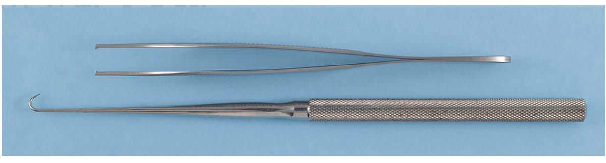

Of course. Here is the combined and edited study guide based on the provided summaries.

# 3: Principles of Surgery Study Guide

## Developing a Surgical Diagnosis

### Decision-Making Process
Surgical decisions should be the result of a careful patient examination conducted well before the administration of anesthesia. The process involves:
1.  Identifying signs, symptoms, and relevant historical information.
2.  Synthesizing patient data, diagnostic information, and clinical experience.
3.  Establishing a clear relationship between the patient's problems that indicates the necessity of surgery.

### Presurgical Evaluation
This is the initial and foundational step in developing a surgical diagnosis.
*   **Data Collection:** Collect accurate and relevant data through patient interviews, physical examinations, laboratory tests, imaging studies, and consultations with other healthcare professionals.
*   **Method:** Perform interviews and examinations in an unhurried and careful manner.
    > Do not accept incomplete data (e.g., poor-quality radiograph) if additional data could alter surgical decisions.

### Diagnostic Data Analysis
*   **Hypothesis Testing:** Organize the collected data to test diagnostic hypotheses.
*   **Differential Diagnosis:** Consider all possible diseases, then systematically eliminate those that are unsupported by the data, disease frequencies, and evidence-based science.
*   **Final Decision:** Use this methodical approach and disease probabilities to determine if surgery is indicated and, if so, which procedure is most appropriate.

### Clinician Reflection & Evidence-Based Dentistry
*   **Thoughtful Observation:** To advance clinical knowledge and improve future outcomes, the clinician must reflect on all aspects of a patient's outcome.
*   **Evidence-Based Practice:** Evaluate new techniques by critically weighing the scientific merit of supporting studies.
    > Avoid common scientific method violations: unrecognized placebo effect, observer bias, patient variability, inadequate control groups.

## Basic Necessities for Surgery

The two principal requirements for successful oral surgery are:
1.  Adequate visibility
2.  Assistance

### 1. Adequate Visibility
Visibility is achieved through a combination of three factors:
1.  **Adequate Access:** This includes the patient's ability to open the mouth widely and surgically created exposure, such as through tissue retraction or surgical flaps.
    > Proper retraction also protects tissues from accidental injury.
2.  **Adequate Light:** The light source must be continuously repositioned to remain unobstructed. The use of multiple overhead lights or headlights can greatly improve illumination.
3.  **Surgical Field Free of Fluids and Debris:** High-volume suctioning with a relatively small tip is essential for the rapid removal of blood, irrigation fluids, and debris.

### 2. Assistance
A properly trained and focused assistant is invaluable. The assistant should be able to anticipate the surgeon's needs. Accomplishing successful surgery with poor or no assistance is extremely difficult.

## Aseptic Technique
The purpose of aseptic technique is to minimize the contamination of the surgical wound by pathogenic microbes. This topic is discussed in detail in Chapter 5.

## Incisions

### Basic Principles for Making Incisions
1.  **Use a Sharp Blade:** Employ a sharp blade of the proper size and shape to make precise incisions without the tissue injury that results from repeated, hesitant strokes. Blades should be changed when they no longer incise with ease, noting that tissues like bone and ligaments dull blades faster than mucosa.
2.  **Make a Firm, Continuous Stroke:** A long, continuous stroke is preferable to short, interrupted ones. This technique reduces tissue damage and bleeding, which improves visibility and wound healing.
    
    • **Fig. 3.1** (A) Proper method of making incision using No. 15 scalpel blade. Note the scalpel motion is made by moving the hand at the wrist and not by moving the entire forearm. (B) When creating a tissue layer that is to be sutured closed, the blade should be kept perpendicular to the tissue surface to create squared wound edges. Holding the blade at any angle other than 90 degrees to the tissue surface creates an oblique cut that is difficult to close properly and compromises blood supply to the wound edge. (Modified from Clark HB Jr. *Practical Oral Surgery*. 3rd ed. Philadelphia: Lea & Febiger; 1965.)
3.  **Avoid Cutting Important Anatomic Structures:** When working near major vessels, ducts, or nerves, incise only deeply enough to define the next major tissue layer. Vessels are easier to control before they are completely divided, and important nerves can be freed and retracted. Remain focused on the blade's location at all times.
4.  **Hold the Blade Perpendicular to the Epithelial Surface:** For surfaces that will be reapproximated and sutured, the blade should be held perpendicular to the epithelium. This creates squared wound edges that are easier to reorient for suturing and are less susceptible to necrosis from ischemia.
5.  **Ensure Proper Placement in the Oral Cavity:**
    *   Incisions should be made through attached gingiva and over healthy bone whenever possible. Avoid incising through unattached gingiva or over areas of unhealthy or missing bone.
    *   Wound margins should be sutured over intact, healthy bone, several millimeters away from any area of damaged bone.
    *   Avoid placing incisions over bony prominences (e.g., the canine eminence), as pressure can interfere with healing.
    *   For extractions, incisions are typically made in the gingival sulcus.

## Flap Design

Surgical flaps are designed to gain access to an underlying area or to move tissue from one location to another. The design must prevent three common complications: necrosis, dehiscence, and tearing.

### Prevention of Flap Necrosis
Necrosis (tissue death) is prevented by ensuring adequate blood supply. Four principles guide this:
1.  **Apex vs. Base Width:** The height of a flap should never be greater than the width of its base, unless a major artery is included in the base. Ideally, the sides of the flap should run parallel or converge from the base to the apex.
2.  **Base-to-Height Ratio:** The width of the flap's base should generally be at least twice the height of the flap.
    > Strict adherence is less critical in the oral cavity due to robust vascularization, but length should never exceed width.
    
    • **Fig. 3.2** (A) Principles of flap design. In general, flap base dimension (*x*) must not be less than height dimension (*y*) and should preferably be approximately x = 2y. (B) When a releasing incision is used to reflect a two-sided flap, the incision should be designed to maximize flap blood supply by leaving a wide base. The design on the left is correct; the design on the right is incorrect. (C) When a "buttonhole" occurs near the free edge of the flap, blood supply to the flap tissue on the side of the hole away from the flap base is compromised.
3.  **Axial Blood Supply:** When possible, include an axial blood supply in the base of the flap (e.g., a palatal flap based toward the greater palatine artery).
4.  **Gentle Handling of the Base:** The base of the flap should not be excessively twisted, stretched, or grasped in a way that damages blood vessels, as this compromises blood supply and lymphatics.

### Prevention of Flap Dehiscence
Dehiscence is the separation of sutured incision margins. It is prevented by:
*   Approximating flap edges over healthy bone.
*   Handling flap edges gently.
*   Not placing the flap under tension. Suturing should not require significant force to close the wound.
*   **Consequences of Dehiscence:** Exposes underlying bone and tissues, causing pain, bone loss, and increased scarring.

### Prevention of Flap Tearing
*   **Cause:** Tearing is usually caused by creating a flap that is too small, leading to inadequate surgical access.
*   **Solution:** Create a sufficiently large flap at the outset. If access proves insufficient, it is better to lengthen the incision than to tear the flap.
    > A properly repaired long incision heals just as quickly as a short one.
*   **Flap Types:**
    *   **Envelope Flaps:** A one-sided flap created by incising around the necks of several teeth. If an envelope flap provides insufficient access, it should be lengthened or converted to a two-sided flap with a releasing incision to prevent tearing.
    
    • **Fig. 3.3** Three types of properly designed oral soft tissue flaps. (A) Horizontal and single vertical incisions used to create a two-sided flap. (B) Horizontal and two vertical incisions used to create a three-sided flap. (C) Single horizontal incision used to create a single-sided (envelope) flap.
    *   **Vertical (Oblique) Releasing Incisions:**
        *   These are generally placed one full tooth anterior to the area of anticipated bone removal.
        *   The incision starts at the line angle of a tooth or an adjacent interdental papilla and is carried obliquely and apically into the unattached gingiva.
        > More than one releasing incision is uncommon for routine oral surgical access.

## Tissue Handling

Careful tissue handling often determines the difference between an acceptable and an excellent surgical outcome.

### Damaging Factors to Avoid
*   Excessive pulling or crushing force.
*   Extremes of temperature (heat or cold).
*   Desiccation (drying out).
*   Contact with unphysiologic chemicals.

### Protocols for Careful Tissue Handling
*   **Gentle Touch:** Use care whenever touching tissue. Use tissue forceps delicately and, when possible, prefer toothed forceps or tissue hooks, which cause less crush injury.
    
    • **Fig. 3.4** Instruments used to minimize damage while holding soft tissue. *Top*, Fine-toothed tissue forceps (pickups). *Bottom*, Soft tissue (skin) hook.
*   **Prudent Retraction:** Do not retract tissues like cheeks and tongue overaggressively.
    > Overretraction is uncomfortable for patients even with local anesthesia.
*   **Irrigation During Bone Cutting:** Use copious irrigation to dissipate frictional heat and decrease bone damage.
*   **Protection from Equipment:** Protect soft tissues from frictional heat or direct trauma from drilling equipment.
*   **Preventing Desiccation:** Frequently moisten open wounds with saline or cover them with a damp sponge when not actively working in the area.
*   **Use of Physiologic Substances:** Only physiologic substances should contact living tissue.
    > Thoroughly remove contaminating formalin from instruments used for biopsy specimens before returning them to the wound.

Gentle and physiologic tissue handling leads to grateful patients with fewer wound complications.

## Hemostasis

Controlling bleeding is critical for several reasons:
*   It preserves the patient's oxygen-carrying capacity.
*   It maintains surgical visibility. Uncontrolled bleeding, especially in the highly vascular oral and maxillofacial regions, quickly obscures the surgical field.
*   It prevents hematoma formation. A hematoma is a collection of blood under soft tissue that can place pressure on the wound, decrease vascularity, increase tension on wound edges, and act as a culture medium for bacteria, potentiating infection.

### Means of Promoting Wound Hemostasis
1.  **Assisting Natural Hemostatic Mechanisms:**
    *   Apply direct pressure with a gauze sponge on bleeding vessels for 20-30 seconds (small vessels) or 5-10 minutes (larger vessels).
    *   Place a hemostat on a vessel.
    *   Both methods cause blood stasis, which promotes coagulation.
    > Blot, rather than wipe, the wound with gauze to remove extravasated blood, as wiping can reopen clotted vessels.
2.  **Thermal Coagulation (Heat):**
    *   Uses heat, typically from an electrical current, to fuse the ends of cut vessels. The current can be concentrated on the vessel by holding it with a metal instrument (e.g., hemostat) or by direct contact with an electrocautery tip.
    *   **Three Conditions for Proper Use:**
        1.  The patient must be properly grounded.
        2.  The cautery tip or metal instrument must *only* touch the bleeding vessel at the intended site to avoid burns from undesirable current paths.
        3.  Accumulated blood or fluid must be removed from around the vessel, as fluid acts as an energy sump, preventing sufficient heat generation.
3.  **Suture Ligation:**
    *   Used for sizable vessels.
    *   **Protocol:** Grasp each end of a severed vessel with a hemostat, then tie a nonresorbable suture around the vessel. If a vessel can be dissected free before cutting, place two hemostats, cut between them, and tie sutures around each end before removing the hemostats.
4.  **Vasoconstrictive Substances / Procoagulants:**
    *   **Vasoconstrictors:** Epinephrine is most effective when placed in the desired site at least 7 minutes before surgery begins. It is ineffective if administered after bleeding has already started.
    *   **Procoagulants:** Commercial thrombin or collagen can be applied directly to the wound.

### Dead Space Management
*   **Definition:** Any area within a wound that remains devoid of tissue after closure. Dead space is created when tissue is removed from the depths of a wound and not all tissue planes are reapproximated during closure.
*   **Problem:** Dead space usually fills with blood, creating a hematoma with a high potential for infection.

#### Four Ways to Eliminate Dead Space
1.  **Suturing Tissue Planes:** Suture different tissue planes together to minimize any postoperative void.
2.  **Pressure Dressing:** Place a dressing over the sutured wound to compress tissue planes together until they are bound by fibrin or surgical edema (approximately 12-18 hours).
3.  **Packing:** Place packing material (often impregnated with an antibacterial agent) into the void until bleeding stops. This is used when suturing or pressure dressings are not possible, such as in a bony cavity after cyst removal. The packing is removed later.
4.  **Drains:** Used alone or with pressure dressings.
    *   **Suction Drains:** Continually remove accumulating blood, eliminating dead space until bleeding stops and tissues bind together.
    *   **Nonsuction Drains (e.g., Penrose):** Allow blood or pus to drain to the surface rather than collecting internally to form a hematoma.
    
    • **Fig. 3.5** Example of nonsuction drain. This Penrose drain is made of flexible, rubberized material that can be placed into wound during closure, or after incision and drainage of abscess, to prevent premature sealing of wound before blood or pus collections can drain to the surface. Draining material runs along and through the drain. In this example, a suture has been tied to the drain and it is ready for insertion into the wound. The needled end of the suture will be used to attach the drain to the wound edge to hold it in place.
    > In most routine oral surgical procedures performed by dentists, dead space creation is not a major problem.

## Decontamination and Debridement

### Decontamination
All wounds exposed to the oral or external environment are contaminated with bacteria. To reduce the risk of infection, the bacterial count must be decreased.
*   **Method:** Repeatedly irrigate the wound during surgery and before closure.
*   **Technique:** Irrigation, especially under pressure, physically dislodges bacteria and foreign materials, rinsing them from the wound.
*   **Fluids:** Use large volumes of sterile saline or sterile water. Antibiotic solutions may also be used.

### Debridement
*   **Definition:** The careful removal of necrotic, severely ischemic, and foreign material from injured tissue that would otherwise impede wound healing.
*   **Use:** Generally reserved for traumatically incurred wounds or for severe tissue damage resulting from pathologic conditions like infection.

## Inflammation Control

### Edema
Swelling (edema) occurs after surgery due to tissue injury. It is caused by fluid transudation from damaged vessels and lymphatic obstruction by fibrin clots.
*   **Factors Determining Degree of Edema:**
    1.  **Amount of Tissue Injury:** Greater injury leads to greater edema.
    2.  **Looseness of Connective Tissue:** Looser connective tissue in the injured area allows for more edema (e.g., lips and floor of the mouth swell significantly, while attached gingiva shows little tendency to swell).

### Methods to Control Postsurgical Edema
1.  **Minimize Tissue Damage:** Perform surgery in a manner that minimizes tissue injury.
2.  **Ice Application:** Applying ice packs to the area is *believed* to decrease vascularity and diminish fluid transudation and edema.
    > No controlled study has verified the effectiveness of this practice.
3.  **Patient Positioning:** Keep the patient's head elevated above the rest of the body as much as possible during the first few postoperative days.
4.  **Systemic Corticosteroids:** Short-term, high-dose systemic corticosteroids can lessen inflammation, transudation, and edema.
    > Corticosteroids are useful for edema control only if administration is begun before tissue is damaged.

## Patient General Health and Wound Healing

Proper wound healing depends on the patient's ability to:
1.  Resist infection.
2.  Provide essential nutrients for building materials.
3.  Carry out reparative cellular processes.

### Medical Conditions Impairing Healing
Several systemic conditions can impair healing and infection resistance:
*   **Conditions establishing a catabolic metabolic state:**
    *   Poorly controlled type 1 diabetes mellitus
    *   End-stage renal or hepatic disease
    *   Malignant diseases
*   **Conditions impeding oxygen or nutrient delivery to tissues:**
    *   Severe chronic obstructive pulmonary disease (COPD)
    *   Poorly compensated congestive heart failure
    *   Drug addictions (e.g., ethanolism)
*   **Diseases requiring drugs/agents that interfere with immunologic or wound-healing cells:**
    *   Autoimmune diseases requiring long-term corticosteroid therapy
    *   Malignancies treated with cytotoxic agents or irradiation

### Surgeon's Role
*   The surgeon must evaluate and optimize the patient's general health status *before* elective surgery to improve the chances of normal healing.
*   For malnourished patients, this may involve improving their nutritional status to achieve a positive nitrogen balance and an anabolic (tissue-building) metabolic state.