# 4 Wound Repair

JAMES R. HUPP

## CHAPTER OUTLINE

#### Causes of Tissue Damage, 44

#### Wound Repair, 44

Epithelialization, 44 Stages of Wound Healing, 45 *Inflammatory Stage, 45 Fibroplastic Stage, 46 Remodeling Stage, 46* 

Surgical Significance of Wound-Healing Concepts, 47 Factors That Impair Wound Healing, 47 *Foreign Material, 47 Necrotic Tissue, 47 Ischemia, 48 Tension, 48* Healing by Primary, Secondary, and Tertiary Intention, 48 Healing of Extraction Sockets, 48 Bone Healing, 48 Implant Osseointegration, 49 Facial Neuropathology of Traumatic Origin, 52 *Nerve Healing, 52 Classification, 53* 

n important aspect of any surgical procedure is the preparation of the wound for proper healing. A thorough understanding of the biology of normal tissue repair is therefore valuable for individuals intending to perform surgery.

Tissue injury can be caused by pathologic conditions or by traumatic events. The dental surgeon has some control over pathologic tissue damage such as the likelihood of a wound infection. In addition, the surgeon can favorably or unfavorably alter the amount and severity of traumatically induced tissue injury and thus contribute to promoting or impeding wound healing.

This chapter discusses the ways in which perioperative tissue injury occurs and the events normally occurring during the healing of soft and hard tissues.

# Causes of Tissue Damage

Traumatic injuries can be caused by physical or chemical insults (Box 4.1). Physical means of producing tissue damage include incision or

crushing, extremes of temperature or irradiation, desiccation, and obstruction of arterial inflow or venous outflow. Chemicals able to cause injury include those with unphysiologic pH or tonicity, those that disrupt protein integrity, and those that cause ischemia by producing vascular constriction or thrombosis.

# Wound Repair

#### Epithelialization

Injured epithelium has a genetically programmed regenerative ability that allows it to reestablish its integrity through proliferation, migration, and a process known as *contact inhibition*. In general, any edge of normal epithelium will begin and continue to migrate (by proliferation of germinal epithelial cells that advance the free edge forward) until it comes into contact with another free edge of epithelium, where it is signaled to stop growing laterally. Note that the other epithelium can be a different type of epithelium.

Although it is theorized that chemical mediators (released from epithelial cells that have lost contact with other epithelial cells circumferentially) regulate this process, no definitive evidence for this is yet available. Wounds in which only the surface epithelium is injured (i.e., abrasions) heal by proliferation of epithelium across the wound bed from the epithelium contained in rete pegs and adnexal tissues. Because epithelium does not normally contain blood vessels, the epithelium in wounds in which the subepithelial tissue is also damaged proliferates across whatever vascularized tissue bed is available and stays under the portion of the superficial blood clot that desiccates (i.e., forms a scab) until it reaches another epithelial margin. Once the wound is fully epithelialized, the scab loosens and eventually dislodges.

An example of the sometimes detrimental effect of the process of contact inhibition controlling epithelialization occurs when an opening is accidentally made into a maxillary sinus during tooth extraction (see Chapter 11). If the epithelium of both the sinus wall and the oral mucosa is injured, it begins to proliferate in both areas. In this case, the first free epithelial edge the sinus epithelium may contact is oral mucosa, thereby creating an oroantral fistula (i.e., an epithelialized tract between the oral cavity and the maxillary sinus).

The process of reepithelialization (i.e., secondary epithelialization) is sometimes used therapeutically by oral-maxillofacial surgeons during certain preprosthetic surgical procedures in which an area of oral mucosa is denuded of epithelium (i.e., unattached gingiva) and then left to epithelialize by adjacent epithelium (i.e., attached gingiva) creeping over the wound bed.

# Stages of Wound Healing

Regardless of the cause of nonepithelial tissue injury, a stereotypical process is initiated and, if able to proceed unimpeded, works to restore tissue integrity. This process is called *wound healing*. The

• BOX 4.1 Causes of Tissue Damage

#### Physical

- Compromised blood flow
- Crushing
- Desiccation
- Incision
- Irradiation
- Overcooling
  Overbooting

# Overheating

#### Chemical

- Agents with unphysiologic pH
- Agents with unphysiologic tonicity
- Proteases
- Vasoconstrictors
- Thrombogenic agents

process has been divided into basic stages that, although not mutually exclusive, take place in this sequence. These three basic stages are (1) inflammatory, (2) fibroplastic, and (3) remodeling.

## Inflammatory Stage

The inflammatory stage begins the moment tissue injury occurs and, in the absence of factors that prolong inflammation, lasts 3 to 5 days. The inflammatory stage has two phases: (1) vascular and (2) cellular. The vascular events set in motion during inflammation begin with an initial vasoconstriction of disrupted vessels as a result of normal vascular tone. The vasoconstriction slows blood flow into the area of injury, promoting blood coagulation. Within minutes, histamine and prostaglandins  $E_1$  and  $E_2$ , elaborated by white blood cells, cause vasodilation and open small spaces between endothelial cells, which allows plasma to leak and leukocytes to migrate into interstitial tissues. Fibrin from the transudated plasma causes lymphatic obstruction, and the transudated plasma aided by obstructed lymphatic vessels—accumulates in the area of injury, functioning to dilute contaminants. This fluid collection is called *edema* (Fig. 4.1).

The cardinal signs of inflammation are redness (i.e., erythema) and swelling (i.e., edema), with warmth and pain—*rubor et tumour cum calore et dolore* (Celsius, 30 BC-AD 38)—and loss of function—*functio laesa* (Virchow, 1821–1902). Warmth and

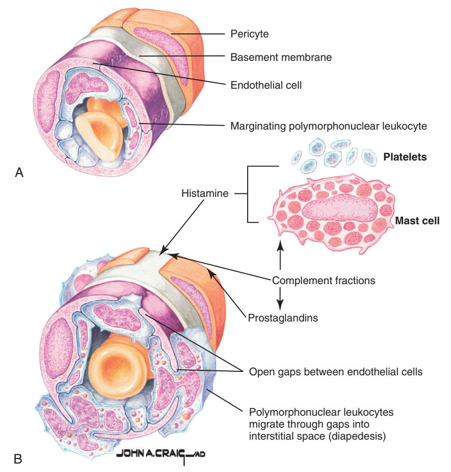

• Fig. 4.1 Early vascular responses to injury. Initial transient vasoconstriction (A) is soon followed by vasodilation (B). Vasodilation is caused by the actions of histamine, prostaglandins, and other vasodilatory substances. Dilation causes intercellular gaps to occur, which allows egress of plasma and emigration of leukocytes. (Netter illustration from www.netterimages.com. © Elsevier Inc. All rights reserved.)

Downloaded for Tommy Tran (122427@kasascity.edu) at Kansas City University from ClinicalKey.com by Elsevier on September 12, 2025. For personal use only. No other uses without permission. Copyright ©2025. Elsevier Inc. All rights reserved.

erythema are caused by vasodilation; swelling is caused by transudation of fluid; and pain and loss of function are caused by histamine, kinins, and prostaglandins released by leukocytes, as well as by pressure from edema.

The cellular phase of inflammation is triggered by the activation of serum complement by tissue trauma. Complement-split products, particularly  $C_{3a}$  and  $C_{5a}$ , act as chemotactic factors and cause polymorphonuclear leukocytes (neutrophils) to stick to the side of blood vessels (margination) and then migrate through the vessel walls (diapedesis). Once in contact with foreign materials (e.g., bacteria), the neutrophils release the contents of their lysosomes (degranulation). The lysosomal enzymes (consisting primarily of proteases) work to destroy bacteria and other foreign materials and to digest necrotic tissue. Clearance of debris is also aided by monocytes such as macrophages, which phagocytize foreign and necrotic materials. With time, lymphocytes accumulate at the site of tissue injury.

The inflammatory stage is sometimes referred to as the *lag phase*, because this is the period during which no significant gain in wound strength occurs (because little collagen deposition is taking place). The principal material holding a wound together during the inflammatory stage is fibrin, which possesses little tensile strength (Fig. 4.2).

#### Fibroplastic Stage

The strands of fibrin, which are derived from blood coagulation, crisscross wounds forming a latticework on which fibroblasts begin laying down ground substance and tropocollagen. This is the fibroplastic stage of wound repair. The ground substance consists of several mucopolysaccharides, which act to cement collagen fibers together. The fibroblasts transform local and circulating pluripotential mesenchymal cells that begin tropocollagen production on the third or fourth day after tissue injury. Fibroblasts also secrete fibronectin, a protein that performs several functions. Fibronectin helps stabilize fibrin, assists in recognizing foreign material that should be removed by the immune system, acts as a chemotactic factor for fibroblasts, and helps guide macrophages along fibrin strands for eventual phagocytosis of fibrin by macrophages.

The fibrin network is also used by new capillaries, which bud from existing vessels along the margins of the wound and run along fibrin strands to cross the wound. As fibroplasia continues, with increasing ingrowth of new cells, fibrinolysis occurs, which is caused by plasmin brought in by the new capillaries to remove the fibrin strands that have become superfluous (Fig. 4.3).

Fibroblasts deposit tropocollagen, which undergoes cross-linking to produce collagen. Initially, collagen is produced in excessive amounts and is laid down in a haphazard manner. The poor orientation of fibers decreases the effectiveness of a given amount of collagen to produce wound strength, so an overabundance of collagen is necessary to strengthen the healing wound early on. Despite the poor organization of collagen, wound strength rapidly increases during the fibroplastic stage, which normally lasts 2 to 3 weeks. If a wound is placed under tension at the beginning of fibroplasia, it tends to pull apart along the initial line of injury. However, if the wound were to be placed under tension near the end of fibroplasia, it would open along the junction between old collagen previously on the edges of the wound and newly deposited collagen. Clinically, the wound at the end of the fibroplastic stage will be stiff because of an excessive amount of collagen, erythematous because of the high degree of vascularization, and able to withstand 70% to 80% as much tension as uninjured tissue (Fig. 4.4).

#### Remodeling Stage

The final stage of wound repair, which continues indefinitely, is known as the *remodeling stage*, although some use the term *wound* 

Scab

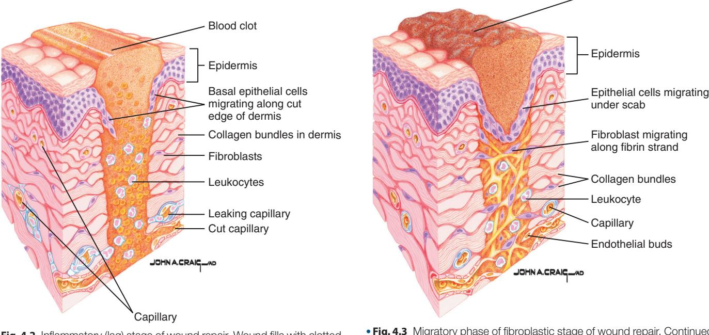

• Fig. 4.2 Inflammatory (lag) stage of wound repair. Wound fills with clotted blood, inflammatory cells, and plasma. Adjacent epithelium begins to migrate into wound, and undifferentiated mesenchymal cells begin to transform into fibroblasts. (Netter illustration from www.netterimages.com. © Elsevier Inc. All rights reserved.)

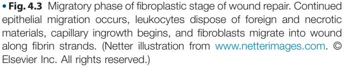

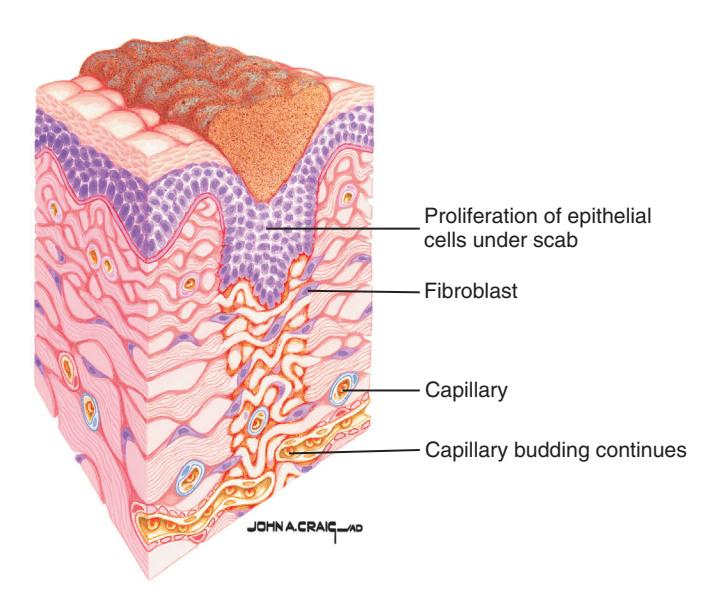

• Fig. 4.4 Proliferative phase of fibroplastic stage of wound repair. Proliferation increases epithelial thickness, collagen fibers are haphazardly laid down by fibroblasts, and budding capillaries begin to establish contact with their counterparts from other sites in wound. (Netter illustration from www.netterimages.com. © Elsevier Inc. All rights reserved.)

*maturation.* During this stage, many of the previous randomly laid collagen fibers are removed as they are replaced by new collagen fibers, which are oriented to better resist tensile forces on the wound. In addition, wound strength increases slowly but not with the same magnitude of increase seen during the fibroplastic stage. Wound strength never reaches more than 80% to 85% of the strength of uninjured tissue. Because of the more efficient orientation of the collagen fibers, fewer of them are necessary; the excess is removed, which allows the scar to soften. As wound metabolism lessens, vascularity is decreased, which diminishes wound erythema. Elastin found in normal skin and ligaments is not replaced during wound healing, so injuries in those tissues cause a loss of flexibility along the scarred area (Fig. 4.5).

A final process, which begins near the end of fibroplasia and continues during the early portion of remodeling, is wound contraction. In most cases, wound contraction plays a beneficial role in wound repair, although the exact mechanism that contracts a wound is still unclear. During wound contraction, the edges of a wound migrate toward each other. In a wound in which the edges are not or will not be placed in apposition, wound contraction diminishes the size of the wound. However, contraction can cause problems such as those seen in victims of third-degree (full-thickness) burns of the skin, who develop deforming and debilitating contractures if wounds are not covered with skin grafts and aggressive physical therapy is not performed. Another example of detrimental contraction is seen in individuals suffering sharply curved lacerations, who frequently are left with a mound of tissue on the concave side of the scar because of wound contraction, even when the edges are well readapted. Contraction can be lessened by placement of a layer of epithelium between the free edges of a wound. Surgeons make use of this phenomenon when they place skin grafts on the bared periosteum during a vestibuloplasty or on full-thickness burn wounds.

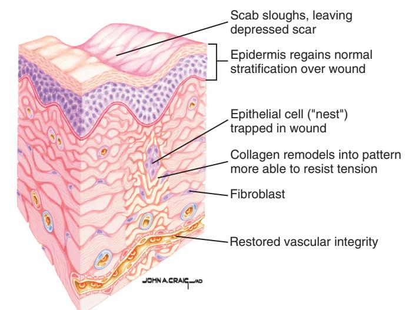

• Fig. 4.5 Remodeling stage of wound repair. Epithelial stratification is restored, collagen is remodeled into more efficiently organized patterns, fibroblasts slowly disappear, and vascular integrity is reestablished. (Netter illustration from www.netterimages.com. © Elsevier Inc. All rights reserved.)

# Surgical Significance of Wound-Healing Concepts

The surgeon can create conditions that augment or impede the natural wound repair process. Adherence to surgical principles (see Chapter 3) facilitates optimal wound healing, with reestablishment of tissue continuity, minimization of scar size, and restoration of function. One should remember that no wound in skin, oral mucosa, or muscle heals without scar formation. The surgeon's goal with respect to scar formation is not to prevent a scar but rather to produce a scar that minimizes any compromise of function and looks as inconspicuous as possible.

# Factors That Impair Wound Healing

Four factors can impair wound healing in an otherwise healthy individual: (1) foreign material, (2) necrotic tissue, (3) ischemia, and (4) wound tension.

#### Foreign Material

Foreign material is everything the host organism's immune system views as "non-self," including bacteria, dirt, and suture material. Foreign materials cause three basic problems. First, bacteria can proliferate and cause an infection in which released bacterial proteins destroy host tissue. Second, nonbacterial foreign material acts as a haven for bacteria by sheltering them from host defenses and thus promoting infection. Third, foreign material is often antigenic and can stimulate a chronic inflammatory reaction that decreases fibroplasia.

# Necrotic Tissue

Necrotic tissue in a wound causes two problems. The first is that its presence serves as a barrier to the ingrowth of reparative cells. The inflammatory stage is then prolonged while white blood cells work to remove the necrotic debris through the processes of enzymatic lysis and phagocytosis. The second problem is that, similar to foreign material, necrotic tissue serves as a protected niche for bacteria. Necrotic tissue frequently includes blood that collects in a wound (hematoma), where it can serve as an excellent nutrient source for bacteria.

#### Ischemia

Decreased blood supply to a wound interferes with wound repair in several ways. Decreased blood supply can lead to further tissue necrosis and can lessen the delivery to a wound of antibodies, white blood cells, and antibiotics, which thereby increases the chances of wound infection. Wound ischemia decreases the delivery of oxygen and the nutrients necessary for proper healing. Ischemia can be caused by several things, including tight or incorrectly located sutures, improperly designed flaps, excessive external pressure on a wound, internal pressure on a wound (seen, such as with hematomas), systemic hypotension, peripheral vascular disease, and anemia.

#### Tension

Tension on a wound is the final factor that can impede wound healing. Tension in this case is anything tending to hold wound edges apart. If sutures are used to pull tissues together forcefully, the fine blood vessels in the tissue encompassed by the sutures will be constricted, producing ischemia. If sutures are removed too early in the healing process, the wound under tension will probably reopen and then heal with excessive scar formation and wound contraction. If sutures are left in too long in an attempt to overcome wound tension, the wound will still tend to spread open during the remodeling stage of healing, and the tract into the epithelium through which the sutures ran will epithelialize, leaving permanent, disfiguring marks.

# Healing by Primary, Secondary, and Tertiary Intention

Clinicians use the terms *primary intention* and *secondary intention* to describe the two basic methods of wound healing. In healing by primary intention, the edges of a wound in which there is no tissue loss are placed and stabilized in essentially the same anatomic position they held before injury and are allowed to heal. Wound repair then occurs with minimal scar tissue because the tissues would not "perceive" that an injury had occurred. Strictly speaking, healing by primary intention is only a theoretical ideal, impossible to attain clinically; however, the term is generally used to designate wounds in which the edges are closely reapproximated. This method of wound repair lessens the amount of reepithelialization, collagen deposition, contraction, and remodeling needed for healing. Therefore healing occurs more rapidly, with a lower risk of infection, and with less scar formation than in wounds allowed to heal by secondary intention. Examples of wounds that heal by primary intention include well-repaired lacerations or incisions and well-reduced bone fractures. In contrast, healing by secondary intention implies that a gap is left between the edges of an incision or laceration or between bone or nerve ends after repair, or it implies that tissue loss has occurred in a wound that prevents approximation of wound edges. These situations require a large amount of epithelial migration, collagen deposition, contraction, and remodeling during healing. Healing is slower and produces more scar tissue than is the case with healing by primary intention. Examples of wounds that heal by secondary intention include extraction sockets, poorly reduced fractures, deep ulcers, and large avulsive injuries of any soft tissue.

Some surgeons use the term *tertiary intention* to refer to the healing of wounds through the use of tissue grafts to cover large wounds and bridge the gap between wound edges.

# Healing of Extraction Sockets

The removal of a tooth initiates the same sequence of inflammation, epithelialization, fibroplasia, and remodeling seen in prototypic skin or mucosal wounds. As previously mentioned, sockets heal by secondary intention, and many months must pass before a socket heals to the degree to which it becomes difficult to distinguish from the surrounding bone when viewed radiographically.

When a tooth is removed, the remaining empty socket consists of cortical bone (the radiographic lamina dura) covered by torn periodontal ligaments, with a rim of oral epithelium (gingiva) left at the coronal portion. The socket fills with blood, which coagulates and seals the socket from the oral environment.

The inflammatory stage occurs during the first week of healing. White blood cells enter the socket to remove contaminating bacteria from the area and begin to break down any debris such as bone fragments that are left in the socket. Fibroplasia also begins during the first week, with the ingrowth of fibroblasts and capillaries. The epithelium migrates down the socket wall until it reaches a level at which it contacts epithelium from the other side of the socket or it encounters the bed of granulation tissue (i.e., tissue filled with numerous immature capillaries and fibroblasts) under the blood clot over which the epithelium can migrate. Finally, during the first week of healing, osteoclasts accumulate along the crestal bone.

The second week is marked by the large amount of granulation tissue that fills the socket. Osteoid deposition has begun along the alveolar bone lining the socket. In smaller sockets, the epithelium may have become fully intact by this point.

The processes begun during the second week continue during the third and fourth weeks of healing, with epithelialization of most sockets complete at this time. The cortical bone continues to be resorbed from the crest and walls of the socket, and new trabecular bone is laid down across the socket. Not until 4 to 6 months after extraction is the cortical bone lining a socket usually fully resorbed; this is recognized radiographically by a loss of a distinct lamina dura. As bone fills the socket, the epithelium moves toward the crest and eventually becomes level with adjacent crestal gingiva. The only visible remnant of the socket after 1 year is the rim of fibrous (scar) tissue that remains on the edentulous alveolar ridge.

# Bone Healing

The events that occur during normal wound healing of soft tissue injuries (e.g., inflammation, fibroplasia, and remodeling) also take place during the repair of an injured bone. However, in contrast to soft tissues, osteoblasts and osteoclasts are also involved to reconstitute and remodel the damaged ossified tissue.

Osteogenic cells (osteoblasts) important to bone healing are derived from the following three sources: (1) periosteum, (2) endosteum, and (3) circulating pluripotential mesenchymal cells. Osteoclasts, derived from monocyte precursor cells, function to resorb necrotic bone and bone that needs to be remodeled. Osteoblasts then lay down osteoid, which, if immobile during healing, usually goes on to calcify.

The terms *primary intention* and *secondary intention* are appropriate for descriptions of bone repair. If a bone is fractured\* and the free ends of the bone are more than 1 mm or so apart, the bone

\*The term *fracture* used with respect to bone repair includes not only traumatically injured bone, but also bone cuts purposely made by a surgeon during reconstructive surgery.

heals by secondary intention; that is, during the fibroplastic stage of healing, a large amount of collagen must be laid down to bridge the bony gap (Fig. 4.6). The fibroblasts and osteoblasts actually produce so much fibrous matrix that the healing tissue extends circumferentially beyond the free ends of the bone and forms what is called a *callus* (Fig. 4.7). Under normal conditions, the fibrous tissue, including the callus, ossifies. During the remodeling stage, bone that was haphazardly produced is resorbed by osteoclasts, and osteoblasts lay down new bone directed to resist low-grade tensions placed on the bone (Fig. 4.8).

Healing of bone by primary intention occurs when the bone is incompletely fractured so that the fractured ends do not become separated from each other ("greenstick fracture") or when a surgeon closely reapproximates and rigidly stabilizes the fractured ends of a bone (anatomic reduction of the fracture). In both of these situations, little fibrous tissue is produced, and reossification of the tissue within the fracture area occurs quickly, with minimal callus formation. The surgical technique that comes closest to allowing bone to heal by primary intention is anatomic reduction of the application of bone plates that rigidly hold the ends of the bone together. This minimizes the distance between the ends of a fractured bone so that ossification across the fracture gap can occur with little intervening fibrous tissue formation.

Two factors are important to proper bone healing: (1) vascularity and (2) immobility. The fibrous connective tissue that forms in a

bony fracture site requires a high degree of vascularity (which carries blood with a normal oxygen content) for eventual ossification. If vascularity or oxygen supplies are sufficiently compromised, cartilage, instead of bone, forms. Furthermore, if vascularity or oxygen supplies are poor, the fibrous tissue does not chondrify or ossify.

Placing bone under continuous or repeated cycles of some tension stimulates continued osteoblastic bone formation. Bone is formed perpendicular to lines of tension to help withstand the forces placed on it. This is the basis of the functional matrix concept of bone remodeling. However, excessive tension or torque placed on a healing fracture site produces mobility at the site. This mobility compromises vascularity of the wound and favors the formation of cartilage or fibrous tissue, rather than bone along the fracture line; in a contaminated fracture, it promotes wound infection (see Fig. 4.8).

#### Implant Osseointegration

The discovery of osseointegration in the 1960s forced a reexamination of traditional concepts of wound healing. Before acceptance of these findings it was thought that the body would eventually expel any foreign material placed through an epithelial surface. Expulsion would occur as the epithelium bordering the foreign material migrated down along the interface with the foreign material,

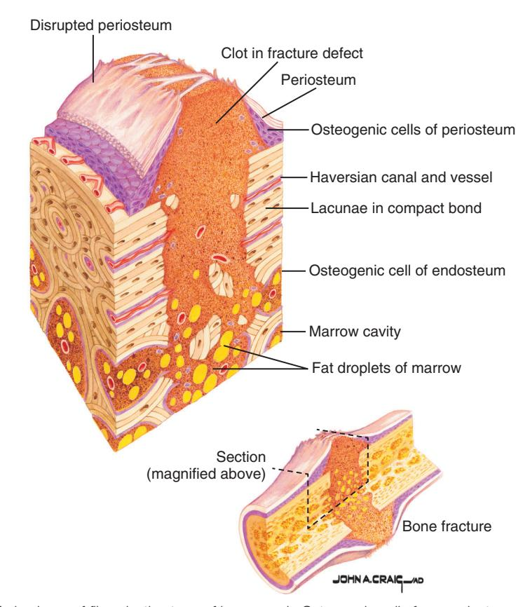

• Fig. 4.6 Early phase of fibroplastic stage of bone repair. Osteogenic cells from periosteum and marrow proliferate and differentiate into osteoblasts, osteoclasts, and chondroblasts, and capillary budding begins. (Netter illustration from www.netterimages.com. © Elsevier Inc. All rights reserved.)

Downloaded for Tommy Tran (122427@kasascity.edu) at Kansas City University from ClinicalKey.com by Elsevier on September 12, 2025. For personal use only. No other uses without permission. Copyright ©2025. Elsevier Inc. All rights reserved.

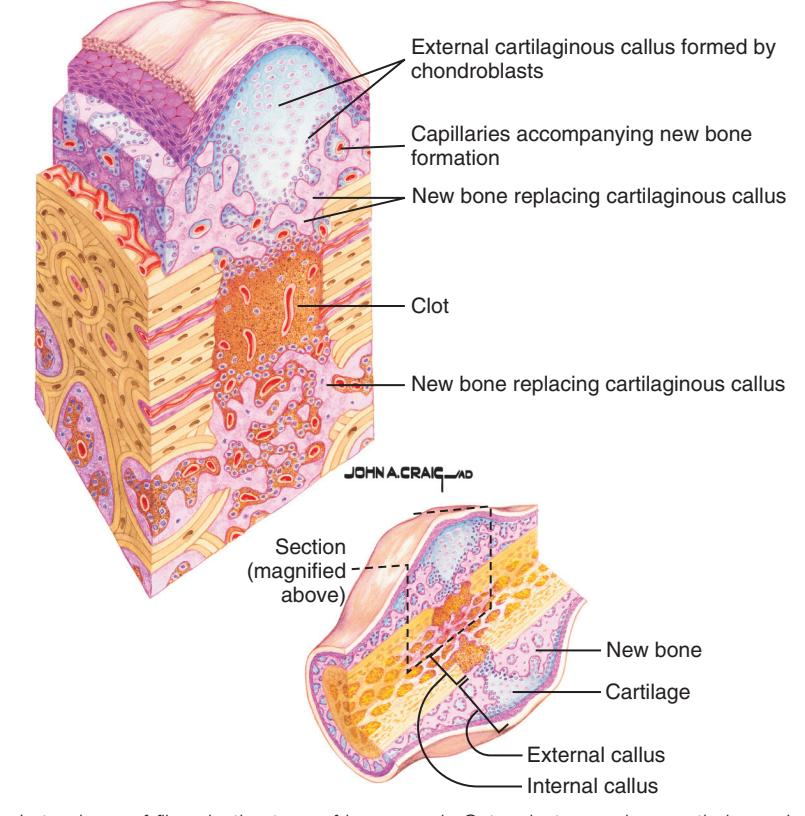

• Fig. 4.7 Late phase of fibroplastic stage of bone repair. Osteoclasts resorb necrotic bone. In areas of sufficient oxygen tension, osteoblasts lay down new bone; in areas of low oxygen tension, chondroblasts lay down cartilage. In addition, capillary ingrowth continues and internal and external calluses form. (Netter illustration from www.netterimages.com. © Elsevier Inc. All rights reserved.)

finally fully surrounding the portion of the foreign body protruding into the body and causing the material to be completely external to the epithelial barrier. For a dental implant, this meant eventual loosening and loss of the implant.

The innate tendency of nonmalignant epithelium to surround and externalize foreign material was thought to be the result of the principle of contact inhibition (discussed previously) whereby any epithelial surface disrupted by any force or object triggers epithelial growth and migration. The epithelium continues to spread until it contacts other epithelial cells and is inhibited from further lateral growth. Investigators found that if an inert foreign material was placed through an epithelial barrier and allowed to develop a biologic bond with surrounding bone, epithelial migration down into the bone along the implant surface would be resisted. However, if, instead, the implant had an intervening layer of connective tissue between itself and the bone, epithelium would migrate down the implant, externalizing it. Thus, when an implant integrated with bone (osseointegration), lateral growth of epithelium stopped without contact inhibition, as it was classically conceived to function (Fig. 4.9).

The reasons why epithelium does not continue to migrate when it meets a bone and implant interface are still unclear. Nonetheless, dentistry has used this aberration in normal wound-healing principles to provide integrated metal posts (implants) that are useful to stabilize dental prostheses. Surgeons use similar techniques to place implants through skin in other body sites to stabilize prosthetic ears, eyes, and noses.

Wound healing around dental implants involves the two basic factors: (1) healing of bone to the implant and (2) healing of

alveolar soft tissue to the implant. Dental implants made of pure titanium are used in the discussion of healing around dental implants; similar healing occurs around properly placed implants made of other inert materials.

Bone healing onto the surface of an implant must occur before any soft tissue forms between bone and implant surfaces. Maximizing the likelihood of bone winning this race with soft tissue to cover the implant requires the following four factors: (1) a short distance between bone and the implant, (2) viable bone at or near the surface of bone along the implant, (3) no movement of the implant while bone is attaching to its surface, and (4) an implant surface reasonably free of contamination by organic or inorganic materials.

A short distance between bone and the implant depends on preparing a bony site into which the implant fits precisely. Minimizing bone damage during site preparation preserves the viability of bone near the implant surface. Much of the damage caused by preparing an implant site is the result of heat from friction during the cutting process.

Limiting heat production and rapidly dissipating the heat created at the site help protect the viability of bone along the cut surface. This is accomplished by using sharp bone-cutting instruments, limiting cutting speeds to minimize frictional heat, and by keeping the bone cool with irrigation during site preparation. Additional damage to the cut surface of bone may occur if the site becomes infected. This is addressed to some degree by using aseptic surgical techniques, systemic topical antibiotics, or both.

Keeping forces off the implant prevents movement along the healing bone and implant interface during the critical portion of

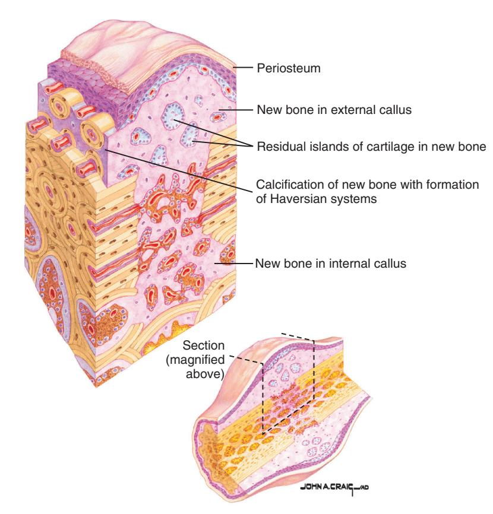

• Fig. 4.8 Remodeling stage of bone repair. Osteoclasts remove unnecessary bone, and osteoblasts lay new bone tissue in response to stresses placed on bone. New haversian systems develop as concentric layers of cortical bone are deposited along blood vessels. Calluses gradually decrease in size. (Netter illustration from www.netterimages.com. © Elsevier Inc. All rights reserved.)

the healing period. Countersinking implants and using low-profile healing screws decrease the ability of any forces to be delivered to the implant. Covering the top of the implant with gingiva during healing further protects it, although some implant protocols do not require gingival coverage. Implants that are threaded or that otherwise fit tightly into the prepared site are better protected from movement than are nonthreaded or loose implants. Eventually, once initial integration has occurred, some limited daily pressure on the implant (1000  $\mu m$  of strain) will actually hasten cortical bone deposition on the implant surface.

Finally, the surface to which bone is intended to attach must be reasonably free of surface contaminants. Such contaminants including bacteria, oil, glove powder, foreign metals, and foreign proteins should be minimized. The surface of an implant intended to osseointegrate should not be handled with bare or gloved fingers or forceps made of a metal different from the implant and must not have retained machine oil or detergent.

The surface of pure titanium implants is completely covered by a 2000-Å-thick layer of titanium oxide. This stabilizes the surface, and it is to this oxidized surface that bone must attach for osseointegration to occur.

Regardless of how much care is taken to minimize damage to bone during implant site preparation, a superficial layer of bone along the surface of a prepared implant site becomes nonviable as a result of thermal and vascular trauma. Although the living cells in bone die, the inorganic bone structure remains. Under the influence of local growth factors, bone cells directly underlying this bone structure and bloodborne undifferentiated mesenchymal cells repopulate and remodel the bony scaffold with osteoblasts, osteoclasts, and osteocytes. Nonviable bone is slowly replaced by new, viable cortical bone through the process of creeping substitution. Cutting cones move through the bone at a rate of 40  $\mu m$  per day, removing dead bone and leaving new osteoid.

At the implant surface, glycosaminoglycans secreted by osteocytes coat the oxide layer. Soon, osteoblasts begin to secrete a layer of osteoid over the proteoglycan layer. Bone then forms if proper conditions (e.g., no implant movement and good oxygen supply) continue during the months required for healing. The greater the amount of available implant surface, the greater is the degree of implant osseointegration. Thus longer or wider-diameter implants and those with sandblasted rather than polished surfaces have more surface available for osseointegration.

The initial deposition of bone must occur before epithelium migrates onto or fibrous connective tissue forms on the implant surface. If soft tissue arrives first at any part of the implant surface, bone will never replace the soft tissue at that site. If too much of the implant surface becomes covered with soft tissue rather than bone, the implant will not become sufficiently osseointegrated to use for a dental prosthesis.

Clinicians have found that, in some circumstances, they can selectively aid the bone-forming process in its race to cover a surface before soft tissue fills the site. An example of this is the use of woven membranes that have a pore size adequate to allow oxygen and other nutrients to reach the bone grown beneath the

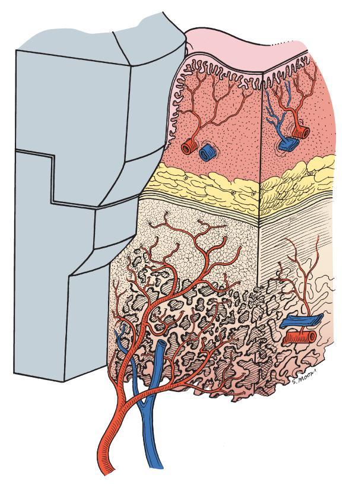

• Fig. 4.9 Osseointegrated implant with direct bone and implant contact. Surface epithelium migration along the implant is halted by the direct bone-implant integration.

membrane while keeping fibroblasts and other tissue elements outside the membrane. By selectively excluding soft tissues, bone is "guided" into a desired position; thus *guided tissue regeneration* is the term used to describe this process.

The component of an implant that extends through the oral mucosa also has the ability to alter the contact inhibition process that normally controls closure of openings through epithelium. In this case, once oral epithelium reaches the surface of a titanium abutment, it seems to stop migrating and secretes a ground substance that attaches the soft tissue to the metal. A hemidesmosomal, basal lamina system forms, further strengthening soft tissue attaching to the implant abutment.

# Facial Neuropathology of Traumatic Origin

Injuries to sensory nerves of the maxillofacial region occasionally occur as the result of facial fractures, during the treatment of impacted teeth or oral pathologic conditions, or when maxillofacial reconstructive surgery is performed. Fortunately, most injured nerves spontaneously recover. However, in the past, little was done to treat persistent sensory nerve disorders. Advances in the understanding of how nerves heal and in the surgical means of repairing peripheral nerves provide patients with the possibility of partially or fully regaining normal nerve function.

#### Nerve Healing

Nerve healing usually has two phases: (1) degeneration and (2) regeneration. Two types of degeneration can occur. The first is

segmental demyelination, in which the myelin sheath is dissolved in isolated segments. This partial demyelination causes a slowing of conduction velocity and may prevent the transmission of some nerve impulses. Symptoms include *paresthesia* (a spontaneous and subjective altered sensation that a patient does not find painful), *dysesthesia* (a spontaneous and subjective altered sensation that a patient finds uncomfortable), *hyperesthesia* (excessive sensitivity of a nerve to stimulation), and *hypoesthesia* (decreased sensitivity of a nerve to stimulation). Segmental demyelination can occur after neurapraxic injuries or with vascular or connective tissue disorders (see Fig. 4.11) and may undergo spontaneous regeneration.

Wallerian degeneration is the second type of degeneration occurring after nerve trauma. In this process, the axons and myelin sheath of the nerve distal to the site of nerve trunk interruption\* (away from the central nervous system [CNS]) undergo disintegration in their entirety. The axons proximal to the site of injury (toward the CNS) also undergo some degeneration, occasionally involving the cell body but generally only affecting a few nodes of Ranvier. Wallerian degeneration stops all nerve conduction distal to the proximal axonal stump. This type of degeneration follows nerve transsection and other destructive processes that affect peripheral nerves (see Fig. 4.10) and is likely to undergo spontaneous regeneration.

Regeneration of a peripheral nerve can begin almost immediately after nerve injury. Normally, the proximal nerve stump sends out a group of new fibers (axonal sprouts or the growth cone) that grow down the remnant Schwann cell tube. Growth progresses at a rate of 1 to 1.5 mm/day and continues until the site innervated by the nerve is reached or nerve regeneration is blocked by interposed fibrous connective tissue and nerve tissue (fibroma) or bone. During regeneration, new myelin sheaths may form as the axons increase in diameter. As functional contacts are made, the patient may experience altered sensations in the previously anesthetic area, which may take the form of paresthesias or dysesthesias.

Problems can occur during regeneration that prevent normal nerve healing. If the continuity of the Schwann cell tube is disrupted, connective tissue may enter the tube while it is partially vacant. When the growth cone (axonal sprouts) reaches the connective tissue obstruction, it may find a way around it and continue on, or it may form a mass of aimless nerve fibers that constitutes a traumatic neuroma subject to pain production when disturbed (trigger point) (Fig. 4.10).

The two branches of the trigeminal nerve injured most commonly, for which the altered sensation is clinically significant, are (1) the inferior alveolar-mental nerve and (2) the lingual nerve. When the inferior alveolar-mental nerve is injured, the usual causes are the following:

- 1. Mandibular (body) and angle fractures
- 2. Preprosthetic surgical procedures including implant placement
- 3. Sagittal split osteotomy surgery
- 4. Mandibular resection for oral neoplasms
- 5. Removal of impacted lower third molars
- 6. Local anesthetic injection

Lingual nerve damage occurs in the course of surgery to remove oral malignancies or impacted third molars.

\*The terms *distal* and *proximal* used in the description of nerves and bones refer to positions farthest away from (i.e., distal) or nearest to (i.e., proximal) the central nervous system. In this case, distal is not used in the same sense as is common when referring to teeth and the dental arch.

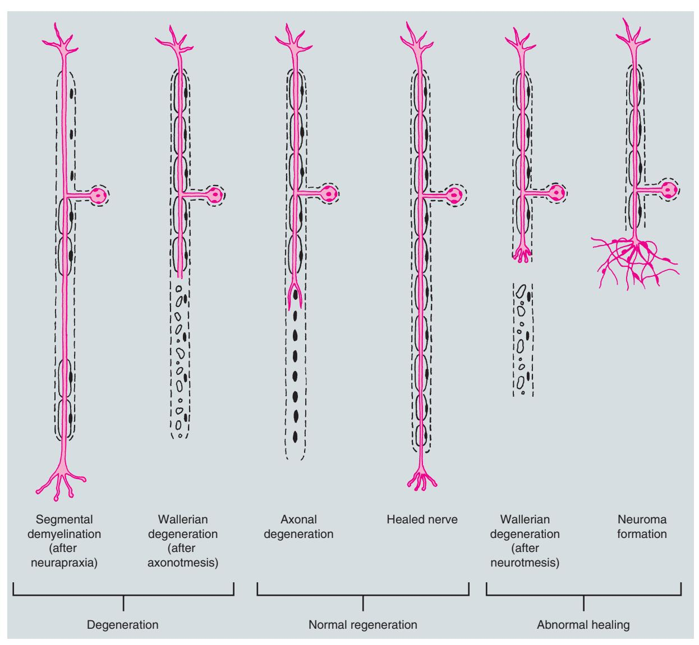

• Fig. 4.10 Normal and abnormal peripheral nerve responses to injury.

## Classification

Research and clinical experience have shown that surgical intervention to repair damaged nerves is more successful when performed soon after the injury has occurred. Thus an understanding of the various types of nerve damage, especially their prognoses, is important because it enables the clinician to decide when referral for peripheral nerve surgery is warranted.

The three types of nerve injuries are (1) neurapraxia, (2) axonotmesis, and (3) neurotmesis (Fig. 4.11). Although a determination as to which type of nerve damage has occurred is usually made retrospectively, knowledge of the pathophysiology of each type is important for gaining an appreciation of nerve healing.

*Neurapraxia*, the least severe form of peripheral nerve injury, is a contusion of a nerve in which continuity of the epineural sheath and the axons is maintained. Blunt trauma or traction (i.e., stretching) of a nerve, inflammation around a nerve, or local ischemia of a nerve can produce neurapraxia. Because there has been no loss in axonal continuity, spontaneous full recovery of nerve function usually occurs in a few days or weeks.

Axonotmesis has occurred when the continuity of the axons, but not the epineural sheath, is disrupted. Severe blunt trauma,

nerve crushing, or extreme traction of a nerve can produce this type of injury. Because the epineural sheath is still intact, axonal regeneration can (but does not always) occur with a resolution of nerve dysfunction in 2 to 6 months.

*Neurotmesis*, the most severe type of nerve injury, involves a complete loss of nerve continuity. This form of damage can be produced by badly displaced fractures, severance by bullets or knives during an assault, or by iatrogenic transection. Prognosis for spontaneous recovery of nerves that have undergone neurotmesis is poor, except if the ends of the affected nerve have somehow been left in approximation and properly oriented.

Other classification systems for nerve injuries exist, including Sunderland grading (I to V) and the Medical Research Council Scale; these allow ongoing assessment of nerve regeneration and serve as a way to facilitate communications between clinicians and researchers.

#### Nerve Repair

When there is a lack of spontaneous neurosensory regeneration due to neuroma formation, microneurosurgery may be required to achieve functional sensory recovery (Fig. 4.12). For an inferior

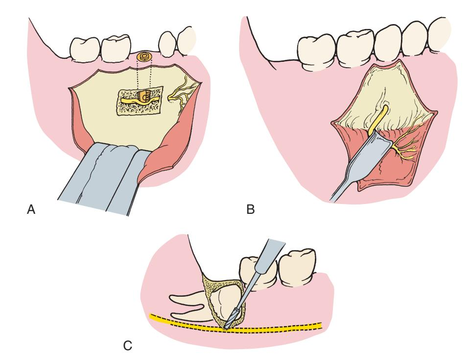

• Fig. 4.11 Three types of peripheral nerve injury. (A) Neurapraxia. Injury to the nerve causes no loss of continuity of the axon or the endoneurium. The example shown is an implant placed in the inferior alveolar canal, compressing the nerve. (B) Axonotmesis. Injury to the nerve causes loss of axonal continuity but preserves the endoneurium. The example shown is overly aggressive retraction of mental nerve. (C) Neurotmesis. Injury to the nerve causes loss of axonal and endoneurium continuity. The example shows cutting of the inferior alveolar nerve during the removal of a deeply impacted third molar.

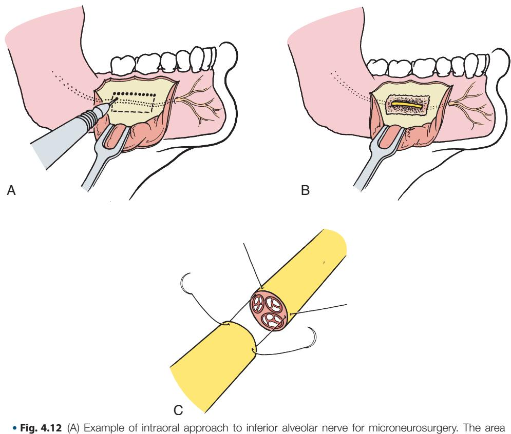

• Fig. 4.12 (A) Example of intraoral approach to interior alveolar nerve for microneurosurgery. The area over the portion of the nerve to be exposed is scored to allow the overlying bone to be removed. (B) Exposed nerve ready for surgical repair. (C) Epineural repair of sectioned nerve trunk. Epineurial sutures are being placed to reestablish the continuity of the epineurium. This type of repair is used for a recently severed nerve or after resection of a neuroma.

Downloaded for Tommy Tran (122427@kasascity.edu) at Kansas City University from ClinicalKey.com by Elsevier on September 12, 2025. For personal use only. No other uses without permission. Copyright ©2025. Elsevier Inc. All rights reserved.

alveolar nerve injury, access must be obtained via a bony osteotomy (see Fig. 4.12A). This approach may provide a decompression of the nerve and allow inspection for a neuroma that may require resection (see Fig. 4.12B). If a neuroma is identified, microneurosurgery is performed to resect the neuroma. The nerve ends are then repaired with very fine epineurial sutures

(see Fig. 4.12C). If repair is not possible without tension, then a nerve graft (autogenous or allogeneic) may be required in the gap between the nerve ends. Finally, in some cases in patients with dysesthesia, systemic medications (e.g.,  $\gamma$ -aminobutyric acid agonists) may also be required to control unpleasant neuropathic symptoms.