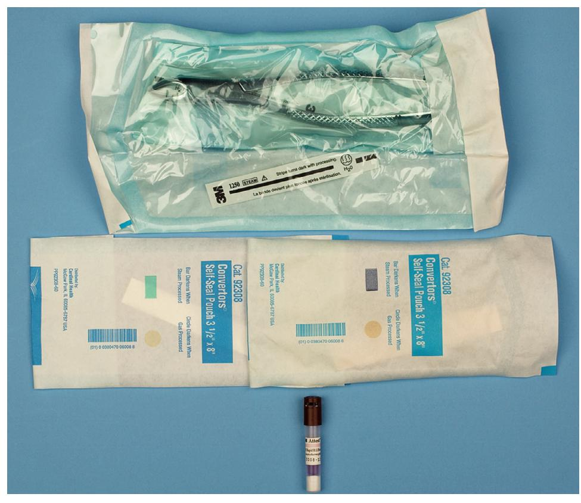
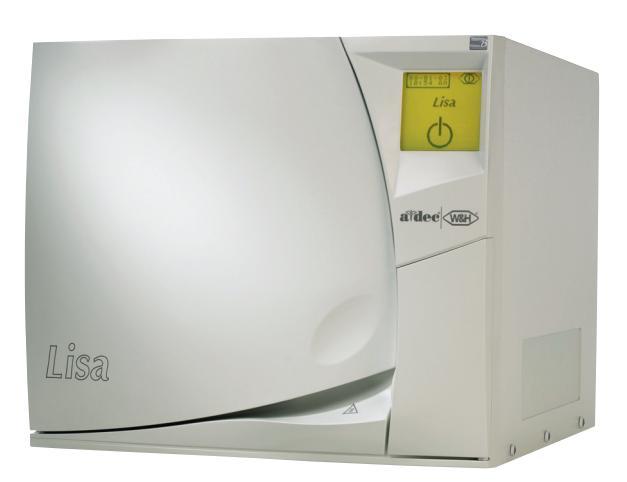
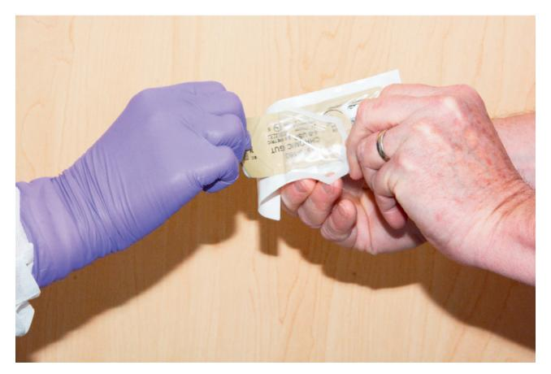
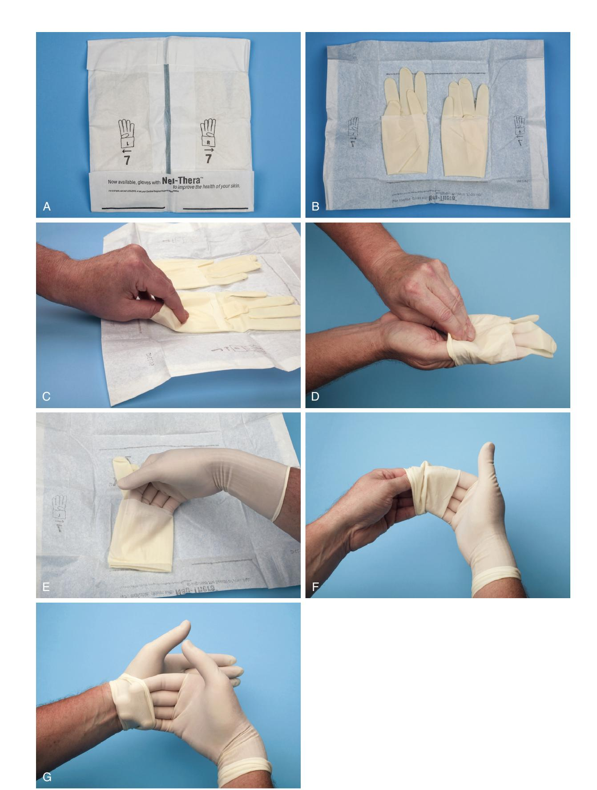
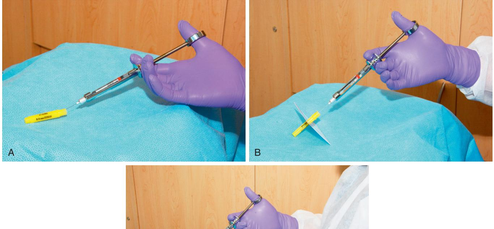
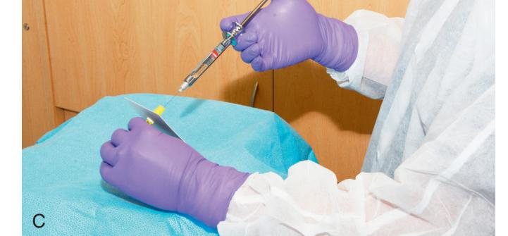
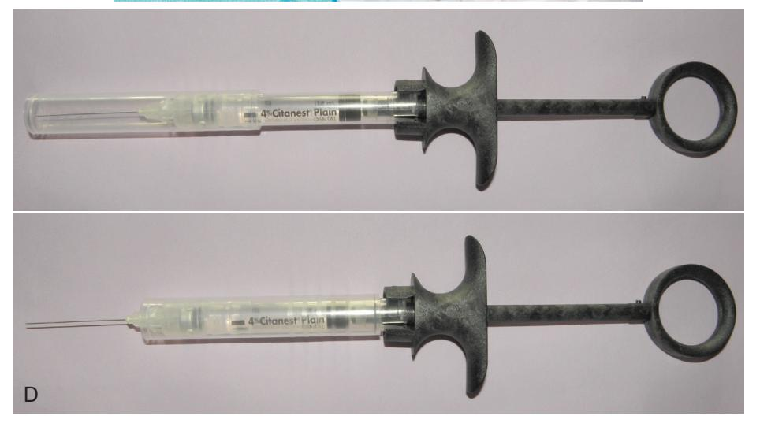
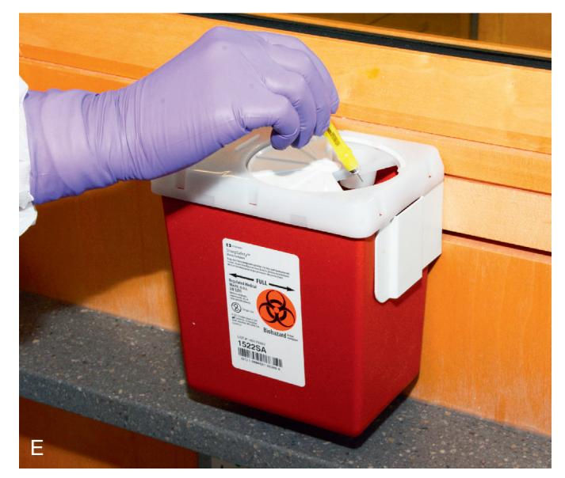

# 5 Infection Control in Surgical Practice

JAMES R. HUPP

#### CHAPTER OUTLINE

#### Communicable Pathogenic Organisms, 56

Bacteria, 56 Upper Respiratory Tract Flora, 56 Maxillofacial Skin Flora, 57 Nonmaxillofacial Flora, 57 Viral Organisms, 57 Hepatitis Viruses, 57 Human Immunodeficiency Virus, 58

Mycobacterial Organisms, 58

#### Aseptic Techniques, 58

Terminology, 58 Concepts, 59 Techniques of Instrument Sterilization, 59 Sterilization With Heat, 59 Dry Heat, 59 Moist Heat, 59 Sterilization With Gas, 61 Techniques of Instrument Disinfection, 61 Maintenance of Sterility, 63 Disposable Materials, 63 Surgical Field Maintenance, 63 Operatory Disinfection, 63 Surgical Staff Preparation, 63 Hand and Arm Preparation, 63 Clean Technique, 64 Sterile Technique, 64 Postsurgical Asepsis, 64 Wounds Management, 64 Sharps Management, 64

It would be difficult for a person living in a modern society to have avoided learning the current concepts of personal and public hygiene. Personal cleanliness and public sanitation have been ingrained in the culture of civilized societies through parental and public education and are reinforced by government regulations and media advertising. This awareness contrasts starkly with earlier centuries, when the importance of hygienic measures for the control of infectious diseases was not widely appreciated. The monumental work of Semmelweis, Koch, and Lister led to enlightenment about asepsis so that today the need for the use of aseptic techniques seems instinctive. Health care professionals must learn and practice protocols that limit the spread of contagions in the patient care setting. This is especially true for dentists performing surgery for two reasons: First, to perform surgery, the dentist typically violates an epithelial surface, the most important barrier against infection. Second, during most oral surgical procedures, the dentist, assistants, and equipment become contaminated with the patient's blood and saliva.

#### **Communicable Pathogenic Organisms**

Two of the most important pieces of knowledge in any conflict are the identity of your foe and their strengths and weaknesses. In the case of oral surgery, the opposition includes virulent bacteria, mycobacteria, fungi, and viruses. The strengths of the opposition are the various means that organisms use to prevent their elimination, whereas their weaknesses are their susceptibilities to chemical, biologic, and physical agents. By understanding the "enemy," the dentist can make rational decisions about infection control.

#### Bacteria

#### Upper Respiratory Tract Flora

Normal oral flora contains the microorganisms usually present in saliva and on the surfaces of oral tissues in healthy, immunocompetent individuals who have not been exposed to agents that alter the composition of oral organisms. A complete description of this flora can be found in Chapter 16. In brief, normal oral flora consists of aerobic, gram-positive cocci (primarily streptococci), actinomycetes, anaerobic bacteria, and candidal species (Table 5.1). The total number of oral organisms is held in check by the following four main processes: (1) rapid epithelial turnover with desquamation; (2) host immunologic factors such as salivary immunoglobulin A; (3) dilution by salivary flow; and (4) competition between oral organisms for available nutrients and attachment sites. Any agent-physical, biologic, or chemical-that alters any of the forces that keep oral microbes under control will permit potentially pathologic organisms to overgrow and set the stage for a wound infection.

The flora of the nose and paranasal sinuses consists primarily of gram-positive aerobic streptococci and anaerobes. In addition, many children harbor *Haemophilus influenzae* bacteria in these areas, and many adults have *Staphylococcus aureus* as a part of their transient or resident nasal and paranasal sinus flora. The normal flora in this region of the body is limited by the presence of ciliated respiratory epithelium, secretory immunoglobulins, and epithelial desquamation. The epithelial cilia move organisms trapped in blankets of mucus into the alimentary tract.

| TABLE 5.1                                        | Normal Microbiologic Flora                                                                                                                                                                 |
|--------------------------------------------------|--------------------------------------------------------------------------------------------------------------------------------------------------------------------------------------------|
| Region                                           | Bacteria                                                                                                                                                                                   |
| Oral cavity                                      | Aerobic gram-positive organisms, primarily Streptococcus Anaerobic bacteria, including Prevotella melaninogenica, Actinomyces spp. Candida spp.                                |
| Nasal cavity                                     | Aerobic gram-positive organisms, primarily Streptococcus spp. In children, Haemophilus influenzae frequently present In adults, Staphylococcus aureus frequently present    |
| Facial skin                                      | Staphylococcus spp., primarily S. epidermidis, occasionally S. aureus Corynebacterium diphtheriae Propionibacterium acnes                                                         |
| All areas below clavicles, including hands | S. epidermidis C. diphtheriae Gram-negative aerobes such as Escherichia coli, Klebsiella spp., and Proteus spp. Anaerobic enteric organisms, including Bacteroides fragilis |

#### **Maxillofacial Skin Flora**

The skin of the maxillofacial region has surprisingly few resident organisms in its normal flora. The bacteria *Staphylococcus epidermidis* and *Corynebacterium diphtheriae* are the predominant species present. *Propionibacterium acnes* is found in pores and hair follicles, and many individuals carry *S. aureus*, spread from the nose on the facial skin (see Table 5.1).

Skin has several means of preventing the entry of surface organisms. The most superficial layer of skin is composed of keratinized epithelial cells that are able to resist mild trauma. In addition, epithelial cells are joined by tight bonds that resist bacterial entrance.

Processes that alter skin flora are, for example, the application of occlusive dressings (which prevent skin desiccation and desquamation), dirt or dried blood (which provide increased nutrients and niches for organisms), and antimicrobial agents (which disturb the balance between various organisms).

#### Nonmaxillofacial Flora

The flora below the region of the clavicles make up a gradually increasing number of aerobic gram-negative and anaerobic enteric organisms, especially moving toward the pelvic region and unwashed fingertips. General knowledge of these bacteria is important for dental surgeons when preparing themselves for surgery and when treating patients requiring venipuncture or other procedures away from the orofacial region.

#### Viral Organisms

Viruses are ubiquitous in the environment, but, fortunately, only a few pose a serious threat to the patient and the surgical team. The viral organisms that cause the most difficulty are the hepatitis B and C viruses and human immunodeficiency virus (HIV). These viruses have differences in their susceptibility to inactivation that are important to understand when attempting to prevent their spread. Each virus is described with respect to hardiness and usual mode of transmission. In addition, the circumstances in which the clinician might suspect that an individual is carrying one of these viruses are briefly described, allowing the surgical team to take necessary precautions, although always taking universal precautions is the best practice strategy, as is discussed later in this chapter.

#### **Hepatitis Viruses**

Hepatitis A, B, C, and D viruses are responsible for most infectious hepatic diseases. Hepatitis A is spread primarily by contact with the feces of infected individuals. Hepatitis C virus may spread through contaminated feces or by contaminated blood. Hepatitis B and D viruses are spread by contact with any human secretion.

Hepatitis B virus has the most serious risk of transmission for unvaccinated dentists, their staff members, and their patients. This virus is usually transmitted by the introduction of infected blood into the bloodstream of a susceptible person; however, infected individuals may also secrete large numbers of the virus in their saliva, which can enter an individual through any moist mucosal surface or epithelial (skin or mucosal) wound. Minute quantities of the virus have been found capable of transmitting disease (only 105 to 107 virions/mL blood). Unlike most viruses, hepatitis B virus is exceptionally resistant to desiccation and chemical disinfectants, including alcohols, phenols, and quaternary ammonium compounds. Therefore hepatitis B virus is difficult to contain, particularly when oral surgery is being performed.

Fortunately, means of inactivating the hepatitis B virus include halogen-containing disinfectants (e.g., iodophor and hypochlorite), formaldehyde, ethylene oxide gas, all types of properly performed heat sterilization, and irradiation. These methods can be used to minimize the spread of hepatitis from one patient to another.

In addition to preventing patient-to-patient spread, the dentist and the staff also need to take precautions to protect themselves from contamination because in several instances, dentists have been the primary source of a hepatitis B epidemic. Dentists who perform oral surgical procedures are exposed to blood and saliva; therefore the dental surgery team should wear barriers to protect against contaminating any open wounds on the hands and any exposed mucosal surfaces. This includes wearing gloves, a facemask, hair coverage, and eyeglasses or goggles during surgery. During operative procedures the patient should also wear protective eyewear. The dental staff should continue to wear these protective devices when cleaning instruments and when handling impressions, casts, or specimens from patients. A common means of hepatitis inoculation is injury with a needle or blade that is contaminated with blood or saliva, so proper handling of sharp objects is important. In addition, members of the dental staff should receive hepatitis B vaccinations, which have been shown to effectively reduce an individual's susceptibility to hepatitis B infection, although the longevity of protection has not been definitively determined. Finally, office-cleaning personnel and commercial laboratory technicians can be protected by proper segregation and labeling of contaminated objects and by proper disposal of sharp objects (Box 5.1).

Recognition of all individuals known to be carriers of hepatitis B and C viruses would aid in knowing when special precautions are necessary. However, only about half of the persons infected with hepatitis ever have clinical signs and symptoms of the infection, and some individuals who have completely recovered from the disease still shed intact virus particles in their secretions. The concept of universal precautions was developed to address the inability of health care providers specifically to identify all patients with

### BOX 5.1 Methods Designed to Limit the Spread of Hepatitis Viruses

#### **From Infected Patient to Other Patients**

- Use disposable materials.
- Disinfect surfaces.
- A. With halogen compounds:
  - 1. lodophors
  - 2. Hypochlorite (bleach)
- B. With aldehydes:
  - 1. Formaldehyde
  - 2. Glutaraldehyde
- Sterilize reusable instruments.
   A. With heat
- B. With ethylene oxide gas
- Use disposable materials.

#### From Infected Patient to Dental Staff

- Learn to recognize individuals likely to be carriers.
- Use barrier techniques (e.g., gloves, facemask, and eye protection) during surgery, when handling contaminated objects, and during cleanup.
- Promptly dispose of sharp objects into well-labeled protective containers.
- Dispose of needles immediately after use or resheathe in-use instruments.
- Use an instrument to place a scalpel blade on or take one off of a blade handle.
- Ensure hepatitis B vaccination of dental staff.

communicable diseases. The theory on which the universal precautions concept is based is that protection of self, staff, and patients from contamination by using barrier techniques when treating all patients as if they all had a communicable disease ensures that everyone is protected from those who do have an unrecognized contagious process.

Universal precautions typically include having all doctors and staff who come in contact with patient blood or secretions, whether directly or in aerosol form, wear barrier devices, including a facemask, hair coverage, eye protection, and gloves. Universal precaution procedures go on to include decontaminating or disposing of all surfaces that are exposed to patient blood, tissue, and secretions. Finally, universal precautions mandate avoidance of touching, and thereby contaminating, surfaces (e.g., the dental record, computer keyboard, uncovered light handles, and telephone) with contaminated gloves or instruments.

#### Human Immunodeficiency Virus

Because of its relative inability to survive outside the host organism, HIV (the causative agent of acquired immunodeficiency syndrome), acts in a fashion similar to other agents of sexually transmitted diseases. That is, transfer of the virions from one individual to another requires direct contact between virus-laden blood or secretions from the infected host organism and a mucosal surface or epithelial wound of the potential host. Evidence has shown that HIV loses its infectivity once desiccated. In addition, few persons carrying HIV secrete the virus in their saliva, and those who do, tend to secrete extremely small amounts. No epidemiologic evidence supports the possibility of HIV infection via saliva alone. Even the blood of patients who are HIV-positive has low concentrations of infectious particles (106 particles/mL compared with 1013 particles/mL in hepatitis patients). This probably explains why professionals who are not in any of the known high-risk groups for HIV positivity have an extremely low probability of contracting

it, even when exposed to the blood and secretions of large numbers of patients who are HIV positive during the performance of surgery or if accidentally autoinoculated with contaminated blood or secretions. Nevertheless, until the transmission of HIV becomes fully understood, prudent surgeons will take steps to prevent the spread of infection from the HIV-carrying patient to themselves and their assistants through the use of universal precautions, including barrier techniques.

In general, the universal precautions used for bacterial, mycotic, and other viral processes protect the dentist, office staff, and other patients from the spread of the virus that causes acquired immunodeficiency syndrome (see Box 5.1). Also important is that patients with depressed immune function be afforded extra care to prevent the spread of contagions to them. Thus all patients infected with HIV who have CD4+ T lymphocyte counts of less than 200/ $\mu$ L or category B or C HIV infection should be treated by doctors and staff free of clinically evident infectious diseases. These patients should not be put in a circumstance in which they are forced to be closely exposed to patients with clinically apparent symptoms of a communicable disease.

#### **Mycobacterial Organisms**

The only mycobacterial organism of significance to most dentists is *Mycobacterium tuberculosis*. Although tuberculosis (TB) is an uncommon disease in the United States and Canada, the frequent movement of persons between countries, including those where TB is common, continues to spread *M. tuberculosis* organisms worldwide, including to all parts of North America. In addition, some newer strains of *M. tuberculosis* have become resistant to the drugs historically used to treat TB. Therefore it is important that measures be followed to prevent the spread of TB from patients to the dental team. This should include TB skin testing of doctors and staff members.

TB is transmitted primarily through exhaled aerosols that carry *M. tuberculosis* bacilli from the infected lungs of one individual to the lungs of another individual. Droplets are produced by those with untreated TB during breathing, coughing, sneezing, and speaking. *M. tuberculosis* is not a highly contagious microorganism. However, transmission can also occur via inadequately sterilized instruments because, although *M. tuberculosis* organisms do not form spores, they are highly resistant to desiccation and to most chemical disinfectants. To prevent transmission of TB from an infected individual to the dental staff, the staff should wear facemasks (specifically, surgical N95 respirator masks) whenever treating or in close contact with these patients. The organisms are sensitive to heat, ethylene oxide, and irradiation; therefore to prevent their spread from patient to patient, all reusable instruments and supplies should be sterilized with heat or ethylene oxide gas. When safe to do so, patients with untreated TB should have their surgery postponed until they can begin treatment for TB.

#### **Aseptic Techniques**

#### Terminology

Different terms are used to describe various means of preventing infection. However, despite their differing definitions, terms such as *disinfection* and *sterilization* are often used interchangeably. This can lead to the misconception that a certain technique or chemical has sterilized an object, when it has merely reduced the level of contamination. Therefore the dental team must be aware of the

Downloaded for Tommy Tran (122427@kasascity.edu) at Kansas City University from ClinicalKey.com by Elsevier on September 12, 2025. For personal use only. No other uses without permission. Copyright ©2025. Elsevier Inc. All rights reserved

precise definition of words used for the various techniques of asepsis.

*Sepsis* is the breakdown of living tissue by the action of microorganisms and is usually accompanied by inflammation. Thus the mere presence of microorganisms, as in bacteremia, does not constitute a septic state. *Medical asepsis* is the attempt to keep patients, health care staff, and objects as free as possible of agents that cause infection. *Surgical asepsis* is the attempt to prevent microbes from gaining access to surgically created wounds.

*Antiseptic* and *disinfectant* are terms that are often misused. Both refer to substances that can prevent the multiplication of organisms capable of causing infection. The difference is that antiseptics are applied to living tissue, whereas disinfectants are designed only for use on inanimate objects.

*Sterility* is the freedom from viable forms of microorganisms. Sterility represents an absolute state; there are no degrees of sterility. *Sanitization* is the reduction of the number of viable microorganisms to levels judged safe by public health standards. Sanitization should not be confused with sterilization. *Decontamination* is similar to sanitization, except that it is not connected with public health standards.

#### Concepts

Chemical and physical agents are the two principal means of reducing the number of microbes on a surface. Antiseptics, disinfectants, and ethylene oxide gas are the major chemical means of killing microorganisms on surfaces. Heat, irradiation, and mechanical dislodgment are the primary physical means of eliminating viable organisms (Box 5.2).

The microbes that cause human disease include bacteria, viruses, mycobacteria, parasites, and fungi. The microbes within these groups have variable ability to resist chemical or physical agents. The microorganisms most resistant to elimination are bacterial endospores. Therefore, in general, any method of sterilization or disinfection that kills endospores is also capable of eliminating bacteria, viruses, mycobacteria, fungi, mold, and parasites. This concept is used in monitoring the success of disinfection and sterilization techniques.

#### **Techniques of Instrument Sterilization**

Any means of instrument sterilization to be used in office-based dental and surgical care must be reliable, practical, and safe for the instruments. The three methods generally available for instrument sterilization are dry heat, moist heat, and ethylene oxide gas.

## BOX 5.2 General Methods of Reducing the Number of Viable Organisms From a Surface

#### **Physical**

- Heat
- Mechanical dislodgment
  Radiation

#### 0.....

- Antiseptics
- Disinfectants
- Ethylene oxide gas

#### **Sterilization With Heat**

Heat is one of the oldest means of destroying microorganisms. Pasteur used heat to reduce the number of pathogens in liquids for preservation. Koch was the first to use heat for sterilization. He found that 1.5 hours of dry heat at 100°C would destroy all vegetative bacteria but that 3 hours of dry heat at 140°C was necessary to eliminate the spores of anthrax bacilli. Koch then tested moist heat and found it a more efficient means of heat sterilization because it reduces the temperature and time necessary to kill spores. Moist heat is probably more effective because dry heat oxidizes cell proteins, a process requiring extremely high temperatures, whereas moist heat causes destructive protein coagulation quickly at relatively low temperatures.

Because spores are the most resistant forms of microbial life, they are used to monitor sterilization techniques. The spore of the bacterium *Bacillus stearothermophilus* is extremely resistant to heat and is therefore used to test the reliability of heat sterilization. These bacilli can be purchased by hospitals, dental schools, and private offices and run through the sterilizer with the instruments being sterilized. A laboratory then places the heat-treated spores into culture. If no growth occurs, the sterilization procedure is considered successful.

It has been shown that 6 months after sterilization, the possibility of organisms entering sterilization bags increases, although some individuals think that an even longer period is acceptable as long as the bags are properly handled. Therefore all sterilized items should be labeled with an expiration date that is no longer than 6 to 12 months in the future (Fig. 5.1).

A useful alternative technique for sterilely storing surgical instruments is to place them into cassettes that are double wrapped in specifically designed paper and sterilized as a set for use on a single patient.

#### Dry Heat

Dry heat is a method of sterilization that can be provided in most dental offices because the necessary equipment is no more complicated than a thermostatically controlled oven and a timer. Dry heat is most commonly used to sterilize glassware and bulky items that can withstand heat but are susceptible to rust. The success of sterilization depends not only on attaining a certain temperature but also on maintaining the temperature for a sufficient time. Therefore the following three factors must be considered when using dry heat: (1) warmup time for the oven and the materials to be sterilized, (2) heat conductivity of the materials, and (3) air flow throughout the oven and through the objects being sterilized. In addition, time for the sterilized equipment to cool after heating must be taken into consideration. The time necessary for dry heat sterilization limits its practicality in the ambulatory setting because it lengthens the turnover time and forces the dentist to have many duplicate instruments.

The advantages of dry heat are the relative ease of use and the unlikelihood of damaging heat-resistant instruments. The disadvantages are the time required to achieve sterilization and the potential damage to heat-sensitive equipment. Guidelines for the use of dry heat sterilization are provided in Table 5.2.

#### Moist Heat

Moist heat sterilization is more efficient than dry heat sterilization because it is effective at much lower temperatures and requires less time. The reason for this is based on several physical principles. First, water boiling at 100°C takes less time to kill organisms than

• Fig. 5.1 Tests of sterilization equipment. Color-coded packaging is made of paper and cellophane; test areas on package change color on exposure to sterilizing temperatures or to ethylene oxide gas (top and center). Vial contains spores of *Bacillus stearothermophilus*, which is used for testing efficiency of heat sterilization equipment (bottom).

| TABLE 5.2     | Guidelines for Dry Heat and Steam Sterilization |                                    |  |
|---------------|----------------------------------------------------|------------------------------------|--|
| Temperature   |                                                    | Duration of Treatment or Exposurea |  |
| Dry Heat      |                                                    |                                    |  |
| 121°C (250°F) |                                                    | 6–12 h                             |  |
| 140°C (285°F) |                                                    | 3 h                                |  |
| 150°C (300°F) |                                                    | 2.5 h                              |  |
| 160°C (320°F) |                                                    | 2 h                                |  |
| 170°C (340°F) |                                                    | 1 h                                |  |
| Steam         |                                                    |                                    |  |
| 116°C (240°F) |                                                    | 60 min                             |  |
| 118°C (245°F) |                                                    | 36 min                             |  |
| 121°C (250°F) |                                                    | 24 min                             |  |
| 125°C (257°F) |                                                    | 16 min                             |  |
| 132°C (270°F) |                                                    | 4 min                              |  |
| 138°C (280°F) |                                                    | 1.5 min                            |  |

aTimes for dry heat treatments do not begin until temperature of oven reaches goal. Use spore tests weekly to judge effectiveness of sterilization technique and equipment. Use temperature-sensitive monitors each time equipment is used to indicate that sterilization cycle was initiated.

does dry heat at the same temperature because water is better than air at transferring heat. Second, it takes approximately seven times as much heat to convert boiling water to steam as it takes to cause the same amount of room temperature water to boil. When steam comes into contact with an object, the steam condenses and almost instantly releases that stored heat energy, which quickly denatures vital cell proteins. Saturated steam placed under pressure (autoclaving) is even more efficient than nonpressurized steam. This is because increasing pressure in a container of steam increases the boiling point of water so that the new steam entering a closed container gradually becomes hotter. Temperatures attainable by steam under pressure include 109°C at 5 psi, 115°C at 10 psi, 121°C at 15 psi, and 126°C at 20 psi (see Table 5.2).

The container usually used for providing steam under pressure is known as an autoclave (Fig. 5.2). The autoclave works by creating steam and then, through a series of valves, increases the pressure so that the steam becomes super-heated. Instruments placed into an autoclave should be packaged to allow the free flow of steam around the instruments, such as by placing them in sterilization pouches or wrapping them in cotton cloth.

Simply placing instruments in boiling water or free-flowing steam results in disinfection rather than sterilization because at the temperature of 100°C, many spores and certain viruses survive.

The advantages of sterilization with moist heat are its effectiveness, speed, and the relative availability of office-proportioned autoclaving equipment. Disadvantages include the tendency of moist heat to dull and rust instruments and the cost of autoclaves (Table 5.3).

#### Sterilization With Gas

Certain gases exert a lethal action on bacteria by destroying enzymes and other vital biochemical structures. Of the several gases available for sterilization, ethylene oxide is the most commonly used. Ethylene oxide is a highly flammable gas, so it is mixed with carbon dioxide or nitrogen to make it safer to use. Ethylene oxide is a gas at room temperature and can readily diffuse through porous materials such as plastic and rubber. At 50°C ethylene oxide is effective for killing all organisms, including spores, within 3 hours. However, because it is highly toxic to animal tissue, equipment exposed to ethylene

• Fig. 5.2 Office-proportioned autoclave (Lisa Sterilizer-a steam heat example) can be a steam or dry heat sterilizer. (Courtesy A-dec, Inc., Newberg, OR.)

| TABLE 5.3                                      | Comparison of Dry Heat Sterilization vs. Moist Heat Sterilization Techniques |                         |
|------------------------------------------------|---------------------------------------------------------------------------------|-------------------------|
|                                                | Dry Heat                                                                        | Moist Heat              |
| Principal antimicrobial effect                 | Oxidizes cell proteins                                                          | Denatures cell proteins |
| Time necessary to achieve sterilization        | Long                                                                            | Short                   |
| Equipment complexity and cost                  | Low                                                                             | High                    |
| Tendency to dull or rust instruments           | Low                                                                             | High                    |
| Availability of equipment sized for office use | Good                                                                            | Good                    |

oxide must be aerated for 8 to 12 hours at  $50^{\circ}$ C to  $60^{\circ}$ C or at ambient temperatures for 4 to 7 days.

The advantages of ethylene oxide for sterilization are its effectiveness for sterilizing porous materials, large equipment, and materials sensitive to heat or moisture. The disadvantages are the need for special equipment and the length of sterilization and aeration time necessary to reduce tissue toxicity. This technique is rarely practical for dental use unless the dentist has easy access to a large facility willing to gas sterilize dental equipment (e.g., hospital or ambulatory surgery center).

#### **Techniques of Instrument Disinfection**

Many dental instruments cannot withstand the temperatures required for heat sterilization. Therefore if sterilization with gas is not available and absolute sterility is not required, chemical disinfection can be performed. Chemical agents with potential disinfectant capabilities have been classified as being high, intermediate, or low in biocidal activity. The classification is based on the ability of the agent to inactivate vegetative bacteria, tubercle bacilli, bacterial spores, nonlipid viruses, and lipid viruses. Agents with low biocidal activity are effective only against vegetative bacteria and lipid viruses, intermediate disinfectants are effective against all microbes except bacterial spores, and agents with high activity are biocidal for all microbes. The classification depends not only on innate properties of the chemical but also, and just as importantly, on *how* the chemical is used (Table 5.4).

Substances acceptable for disinfecting dental instruments for surgery include glutaraldehyde, iodophors, chlorine compounds, and formaldehyde; glutaraldehyde-containing compounds are the most commonly used. Table 5.5 summarizes the biocidal activity of most of the acceptable disinfecting agents when used properly. Alcohols are not suitable for general dental disinfection because they evaporate too rapidly; however, they can be used to disinfect local anesthetic cartridges.

Quaternary ammonium compounds are not recommended for dentistry because they are not effective against the hepatitis B virus and become inactivated by soap and anionic agents.

Certain procedures must be followed to ensure maximal disinfection, regardless of which disinfectant solution is used. The agent must be properly reformulated and discarded periodically, as specified by the manufacturer. Instruments must remain in contact with the solution for the designated period, and no new contaminated instruments should be added to the solution during that time. All instruments must be washed free of blood or other visible material before being placed in the solution. Finally, after disinfection, the instruments must be rinsed free of chemicals and used within a short time.

An outline of the preferred method of sterilization for selected dental instruments is presented in Table 5.6.

| TABLE 5.4 Classification System for the Biocidal Effects of Chemical Disinfectants |                     |               |                  |                  |                  |
|------------------------------------------------------------------------------------|---------------------|---------------|------------------|------------------|------------------|
| Level of Biocidal Activitya                                                        | Vegetative Bacteria | Lipid Viruses | Nonlipid Viruses | Tubercle Bacilli | Bacterial Spores |
| Low                                                                                | +                   | +             | -                | -                | -                |
| Intermediate                                                                       | +                   | +             | +                | +                | +                |
| High                                                                               | +                   | +             | +                | +                | +                |

aln the absence of gross organic materials on surfaces being disinfected.

#### TABLE 5.5 Biocidal Activity of Various Chemical Disinfectants

|                                                                                                                          |                                       |                       | ACTIVITY LEVELa |      |
|--------------------------------------------------------------------------------------------------------------------------|---------------------------------------|-----------------------|-----------------|------|
| Generic                                                                                                                  | Brand Names                           | Exposure Time         | Intermediate    | High |
| Formaldehyde 3% 8% or 8% in 70% alcohol                                                                            |                                       | ≥30 min 10 h       | +               |      |
| Glutaraldehyde 2% with nonionic ethoxylates of linear alcohol Room temperature 40°C–45°C 60°C                   | Wavicide, Sterall                     | ≥10 min 4 h 4 h | +               | + +  |
| Glutaraldehyde 2% alkaline with phenolics buffer Diluted 1:6 Full strength                                         | Sporicidin                            | ≥10 min 7 h        | +               | +    |
| Glutaraldehyde 2% alkaline                                                                                               | Cidex, Procide, Glutarex, Omnicide | ≥10 min 10 h       | +               | +    |
| 1% Chlorine compound, diluted 1:5                                                                                        | Clorox                                | ≥30 min               | +               |      |
| O-phenylphenol 9% plus 0-benzyl-p-chlorophenol 1%, diluted 1:32                                                          | Omni II                               | ≥10 min               | +               |      |
| lodophors 1% iodine                                                                                                      | Betadine, Isodine                     | ≥30 min               | +               |      |
| aGrossly visible contamination such as blood must be removed before chemical disinfection to maximize biocidal activity. |                                       |                       |                 |      |

#### TABLE 5.6 Methods of Sterilization or Disinfection of Selected Dental Instruments

|                                                 |                                                   | CHEMICAL DISINFECTION                             |                               |
|-------------------------------------------------|---------------------------------------------------|---------------------------------------------------|-------------------------------|
| Items                                           | Steam Autoclave (15–30 Min Required per Cycle) | Dry Heat Oven (1–1.5 Hours Required per Cycle) | <b>Sterilization</b> a        |
| Stainless instruments (loose) restorative burs  | ++                                                | ++                                                | -                             |
| Instruments in packs                            | ++                                                | + (Small packs)                                   | -                             |
| Instrument tray setups, surgical or restorative | + (Size limit)                                    | ++                                                | -                             |
| Rust-prone instruments                          | (Only when coated with chemical protectant)    | ++                                                | -                             |
| Handpiece (autoclave)                           | ++                                                | -                                                 | -                             |
| Handpiece (nonautoclave)                        | -                                                 | -                                                 | $\pm$ (Iodophor disinfectant) |
| Angle attachmentb                               | +                                                 | +                                                 | -                             |
| Rubber items                                    | ++                                                | -                                                 | -                             |
| Rag wheels                                      | ++                                                | +                                                 | -                             |
| Removable prostheticsc                          | -                                                 | -                                                 | -                             |
| Heat-resistant plastic evacuators               | ++                                                | +                                                 | -                             |

aChemical disinfecting/sterilizing solutions are not the method of choice for sterilization of any items used in the mouth. In some circumstances, they may be used when other more suitable procedures have been precluded.

bClinician should confirm with manufacturer that attachment is capable of withstanding heat sterilization.

"Rinse prosthetic well, immerse in 1:10 household bleach solution (5%-6% sodium hypochlorite) for 5 minutes. Rinse the prosthetic (repeat disinfection procedure before returning to patient).

• Fig. 5.3 Method of sterilely transferring double-wrapped sterile supplies from clean individual (ungloved hands) to sterilely gowned individual (gloved hands). The package is designed to be peeled open from one end without touching the sterile interior of the package. Sterile contents are then promptly presented to the recipient.

#### **Maintenance of Sterility**

#### **Disposable Materials**

Materials and drugs used during oral and maxillofacial surgery—such as sutures, local anesthetics, scalpel blades, and syringes with needles-are sterilized by the manufacturer with a variety of techniques, including use of gases, autoclaving, filtration, and irradiation. To maintain sterility, only the dentist must properly remove the material or drug from its container. Most surgical supplies are double wrapped (the only common exception is scalpel blades). The outer wrapper is designed to be handled in a nonsterile fashion and usually is sealed in a manner that allows an ungowned and gloved individual to unwrap it and transfer the material still wrapped in a sterile inner wrapper. The ungloved individual may allow the surgical material in the sterile inner wrapper to drop onto a sterile part of the surgical field or allow an individual gloved in a sterile fashion to remove the wrapped material in a sterile manner (Fig. 5.3). Scalpel blades are handled in a similar fashion; the unwrapped blade may be dropped onto the field or grasped in a sterile manner by another individual.

#### Surgical Field Maintenance

An absolutely sterile surgical field is impossible to attain. For oral procedures, even a relatively clean field is difficult to maintain because of oral and upper respiratory tract contamination. Therefore, during oral-maxillofacial surgery, the goal is to prevent any organisms from the surgical staff or other patients from entering the patient's wound.

Once instruments are sterilized or disinfected, they should be set up for use during surgery in a manner that limits the likelihood of contamination by organisms foreign to the patient's maxillofacial flora. A flat platform such as a Mayo stand should be used, and two layers of sterile towels or waterproof paper should be placed on it. Then, the clinician or assistant should lay the instrument pack on the platform and open out the edges in a sterile fashion. Anything placed on the platform should be sterile or disinfected. Care should be taken not to allow excessive moisture to get on the towels or paper; if the towels become saturated, they can allow bacteria from the unsterile undersurface to wick up to the sterile instruments.

#### **Operatory Disinfection**

The various surfaces present in the dental operatory have different requirements concerning disinfection that depend on the potential for contamination and the degree of patient contact with the surface. Any surface that a patient or patient's secretions contact is a potential carrier of infectious organisms. In addition, when high-speed drilling equipment is used, patient blood and secretions are dispersed over much of the surfaces of the operatory. The operatory can be disinfected in two basic ways. The first is to wipe all surfaces with a hospital-grade disinfectant solution. The second is to cover surfaces with protective shields that are changed between each patient. Fortunately, many chemical disinfectants, including chlorine compounds and glutaraldehyde, can prevent transfer of the hepatitis viruses when used on surfaces in certain concentrations (0.2% for chlorine, 2% for glutaraldehyde). Headrests, tray tables, hosing and lines, controls for nitrous oxide, the chair, and light handles can be covered with commercially available, single-use, disposable covers; the rest of the dental chair can be quickly sprayed with a disinfectant. Countertops usually come into contact with patients only indirectly, so counters should be periodically disinfected, especially before surgical procedures. Limiting the number of objects left on operatory counters will make periodic cleaning easier and more effective.

Soap dispensers and sink faucets are another source of contamination. Unless they can be activated without using the hands, they should be disinfected frequently because many bacteria survive—even thrive—in a soapy environment (discussed later in this section). This is one reason common soap is not the ideal agent when preparing hands for surgery.

Anesthetic equipment used to deliver gases such as oxygen or nitrous oxide may also spread infection from patient to patient. Plastic nasal cannulas are designed to be discarded after one use. Nasal masks and the tubing leading to the mask from the source of the gases are available in disposable form or can be covered with disposable sleeves.

#### **Surgical Staff Preparation**

The preparation of the operating team for surgery differs according to the nature of the procedure being performed and the location of the surgery. The two basic types of personnel asepsis to be discussed are (1) the clean technique and (2) the sterile technique. Antiseptics are used during each of the techniques, so they are discussed first.

#### Hand and Arm Preparation

Antiseptics are used to prepare the surgical team's hands and arms before gloves are donned and are also used to disinfect the surgical site. Because antiseptics are used on living tissue, they are designed to have low tissue toxicity while maintaining disinfecting properties. The three antiseptics most commonly used in dentistry are (1) iodophors, (2) chlorhexidine, and (3) hexachlorophene.

Iodophors such as polyvinylpyrrolidone-iodine (povidone-iodine) solution have the broadest spectrum of antiseptic action, being effective for gram-positive as well as gram-negative bacteria, most viruses, *M. tuberculosis* organisms, spores, and fungi.

Iodophors are usually formulated in a 1% iodine solution. The scrub form has an added anionic detergent. Iodophors are preferred over noncompounded solutions of iodine because they are much less toxic to tissue than free iodine and more water soluble. However, iodophors are contraindicated for use on individuals sensitive to iodinated materials, those with untreated hypothyroidism, and pregnant women. Iodophors exert their effect over a period of several minutes, so the solution should remain in contact with the surface for at least a few minutes for maximal effect.

Chlorhexidine and hexachlorophene are other useful antiseptics. Chlorhexidine is used extensively worldwide and is available in the United States as a skin preparation solution and for internal use. The potential for systemic toxicity with repeated use of hexachlorophene has limited its use. Both agents are more effective against gram-positive bacteria than against gram-negative bacteria, which makes them useful for preparation for maxillofacial procedures. Chlorhexidine and hexachlorophene are more effective when used repeatedly during the day because they accumulate on skin and leave a residual antibacterial effect after each wash. However, their ineffectiveness against tubercle bacilli, spores, and many viruses makes them less effective than iodophors.

#### Clean Technique

The clean technique is generally used for office-based surgery that does not specifically require a sterile technique. Office oral surgical procedures that call for a sterile technique include any surgery in which skin is incised. The clean technique is designed as much to protect the dental staff and other patients from a particular patient as it is to protect the patient from pathogens that the dental staff may harbor.

When using a clean technique, the dental staff may wear clean street clothing covered by long-sleeved laboratory coats (Fig. 5.4). Another option is a dental uniform (e.g., surgical scrubs) with no further covering or covered by a long-sleeved surgical gown.

Dentists should wear sterile gloves whenever they are providing invasive dental care. When the clean technique is used, hands may be washed with antiseptic soap and dried on a disposable towel before gloving. Gloves should be sterile and put on using an appropriate technique to maintain sterility of the external surfaces. The technique of sterile self-gloving is illustrated in Fig. 5.5.

In general, eye protection should be worn when blood or saliva are dispersed, such as when high-speed cutting equipment is used (see Fig. 5.4). A facemask and hair coverage should be used whenever aerosols are created or a surgical wound is to be made.

• Fig. 5.4 Surgeon ready for office oral surgery, wearing clean gown over street clothes, mask over nose and mouth, cap covering scalp hair, sterile gloves, and shatter-resistant eye protection. Nondangling earrings are acceptable in clean technique.

In most cases, it is not absolutely necessary to prepare the operative site when using the clean technique. However, when surgery in the oral cavity is performed, perioral skin may be decontaminated with the same solutions used to scrub the hands, and the oral cavity may be prepared by brushing or rinsing with chlorhexidine gluconate (0.12%) or an alcohol-based mouthwash. These procedures reduce the amount of skin or oral mucosal contamination of the wound and decrease the microbial load of any aerosols made while using high-speed drills in the mouth. The dentist may desire to drape the patient to protect the patient's clothes, to keep objects from accidentally entering the patient's eyes, and to decrease suture contamination should it fall across an uncovered, unprepared part of the patient's body.

During an oral surgical procedure, only sterile water or sterile saline solution should be used to irrigate open wounds. A disposable injection syringe, a reusable bulb syringe, or an irrigation pump connected to a bag of intravenous solution can be used to deliver irrigation. Reservoirs feeding irrigation lines to handpieces are also available and can be filled with sterile irrigation fluids.

#### Sterile Technique

The sterile technique is used for office-based surgery when skin incisions are made or when surgery is performed in an operating room. (A clean wound is made through intact skin that has been treated with an antiseptic.) The purpose of sterile technique is to minimize the number of organisms that enter wounds created by the surgeon. The technique requires strict attention to detail and cooperation among the members of the surgical team.

The surgical hand and arm scrub is another means of lessening the chance of contaminating a patient's wound. Although sterile gloves are worn, gloves can be torn (especially when using high-speed drills or working around jaw fixation wires), thereby exposing the surgeon's skin. By proper scrubbing with antiseptic solutions, the surface bacterial level of the hands and arms is greatly reduced.

Most hospitals have a surgical scrub protocol that must be followed when performing surgery in those institutions. Although several acceptable methods can be used, standard to most techniques is the use of an antiseptic soap solution, a moderately stiff brush, and a fingernail cleaner. Hands and forearms are washed in a scrub sink, and hands are kept above the level of the elbows after washing until the hands and arms are dried. A copious amount of antiseptic soap is applied to the hands and arms from either wall dispensers or antiseptic-impregnated scrub brushes. The antiseptic soap is allowed to remain on the arms, while any dirt is removed from underneath each fingernail tip using a sharp-tipped fingernail cleaner.

#### **Postsurgical Asepsis**

#### Wounds Management

A few principles of postsurgical care are useful to prevent the spread of pathogens. Wounds should be inspected or dressed by hands that are covered with fresh, clean gloves. When several patients are waiting, those without infectious problems should be seen first, and those with problems such as a draining abscess should be seen afterward.

#### **Sharps Management**

During and after any surgery, contaminated materials should be disposed of in such a way that the staff and other patients will not be infected. The most common risk for transmission of disease

• Fig. 5.5 (A) Inner wrapper laid open on surface with words facing the person gloving himself. Note that the outside surfaces of this wrapper are considered nonsterile, whereas the inner surface touching the gloves is sterile. (B) While touching the outside of wrapper, simultaneously pull the folds to each side, exposing the gloves. (C) Note that the open end of each glove is folded up to create a cuff; using the fingertip of the right hand, grasp the fold of the cuff of the left glove without touching anything else. Bring the gloves cuff without unfolding the cuff. (D) Place the fingers of the left hand and slide the finger into the glove while using the right pull the glove to the outstretched fingers of the right hand into the glove while continuing to hold the glove with the left fingers in the cuff to stabilize the glove. Once the glove is on, unfurl the cuff using the fingers still within the cuff. (F) Finally place the fingers of the right hand into the cuff of the left glove are fully into the glove fingertips, while taking care to touch only the sterile glove surfaces.

Downloaded for Tommy Tran (122427@kasascity.edu) at Kansas City University from ClinicalKey.com by Elsevier on September 12, 2025. For personal use only. No other uses without permission. Copyright ©2025. Elsevier Inc. All rights reserved.

• Fig. 5.6 (A) Scoop technique for resheathing anesthetic needle. (B) Scoop needle resheathing technique using cardboard holder to stabilize needle cap. (C) Clinician holding needle cap with protective cardboard on the cap while resheathing needle. (D) Self-resheathing needle.

• Fig. 5.6, cont'd (E) Proper disposal of sharp, disposable supplies into well-marked, rigid container to prevent accidental inoculation of office or housekeeping workers with contaminants on sharp objects. (Pictured: Safety Plus XL syringe by Septodont Inc., New Castle, DE.)

from infected patients to the staff is by accidental needle sticks or scalpel lacerations. Sharps injuries can be prevented by using the local anesthetic needle to scoop up the sheath after use, using an instrument such as a hemostat to hold the cover while resheathing the needle, or using automatically resheathing needles (Fig. 5.6A–B); taking care never to apply or remove a blade from a scalpel handle

without an instrument; and disposing of used blades, needles, and other sharp disposable items into rigid, well-marked receptacles specially designed for contaminated sharp objects (see Fig. 5.6C). For environmental protection, contaminated supplies should be discarded in properly labeled bags and removed by a reputable hazardous waste management company.