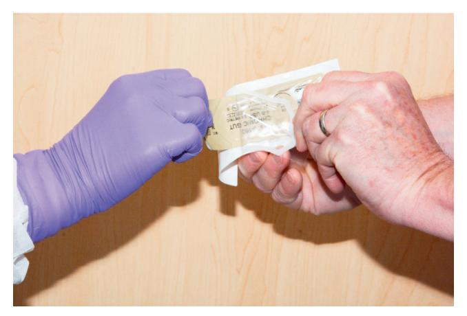
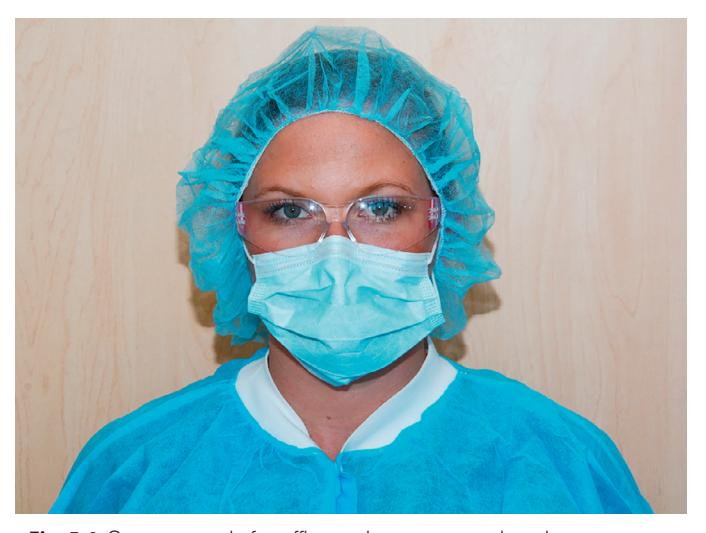
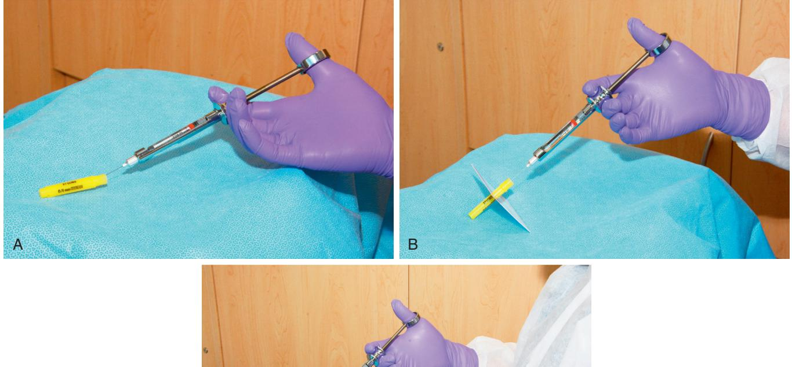
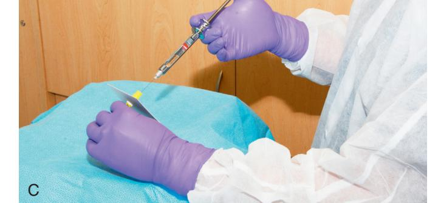
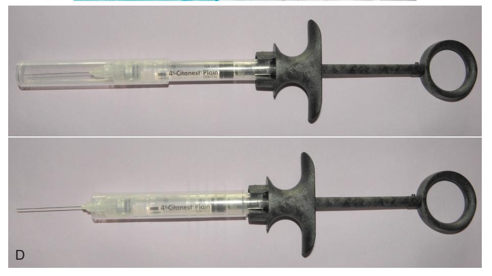
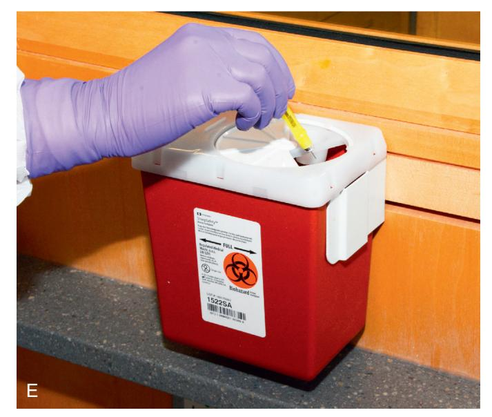

# Study Guide: Infection Control in Surgical Practice

## I. Communicable Pathogenic Organisms

### A. Bacteria

#### 1. Upper Respiratory Tract Flora

*   **Normal Oral Flora:** The oral cavity contains aerobic, gram-positive cocci (mainly streptococci), actinomycetes, anaerobic bacteria, and candidal species.
*   **Control Processes in the Oral Cavity:**
    1.  Rapid epithelial turnover and desquamation.
    2.  Host immunologic factors, such as salivary immunoglobulin A.
    3.  Dilution by salivary flow.
    4.  Competition between oral organisms for nutrients and attachment sites.
*   **Nose and Paranasal Sinuses Flora:** This region primarily contains gram-positive aerobic streptococci and anaerobes. Many children harbor *Haemophilus influenzae*, and many adults carry *Staphylococcus aureus*.
*   **Control Processes in the Nose/Sinuses:** Control mechanisms include ciliated respiratory epithelium, secretory immunoglobulins, and epithelial desquamation.

| TABLE 5.1                                        | Normal Microbiologic Flora                                                                                                                                                                 |
|--------------------------------------------------|--------------------------------------------------------------------------------------------------------------------------------------------------------------------------------------------|
| Region                                           | Bacteria                                                                                                                                                                                   |
| Oral cavity                                      | Aerobic gram-positive organisms, primarily Streptococcus Anaerobic bacteria, including Prevotella melaninogenica, Actinomyces spp. Candida spp.                                |
| Nasal cavity                                     | Aerobic gram-positive organisms, primarily Streptococcus spp. In children, Haemophilus influenzae frequently present In adults, Staphylococcus aureus frequently present    |
| Facial skin                                      | Staphylococcus spp., primarily S. epidermidis, occasionally S. aureus Corynebacterium diphtheriae Propionibacterium acnes                                                         |
| All areas below clavicles, including hands | S. epidermidis C. diphtheriae Gram-negative aerobes such as Escherichia coli, Klebsiella spp., and Proteus spp. Anaerobic enteric organisms, including Bacteroides fragilis |

#### 2. Maxillofacial Skin Flora

*   **Resident Organisms:** The predominant organisms are *Staphylococcus epidermidis* and *Corynebacterium diphtheriae*. *Propionibacterium acnes* resides in pores and hair follicles. Many individuals also carry *S. aureus* from the nose.
*   **Prevention of Bacterial Entry:**
    *   Keratinized epithelial cells resist mild trauma.
    *   Tight bonds between epithelial cells resist bacterial entrance.
*   **Factors Altering Flora:** The normal flora can be altered by occlusive dressings, dirt, dried blood, and antimicrobial agents.

#### 3. Nonmaxillofacial Flora

*   Below the clavicles, particularly towards the pelvis and on unwashed fingertips, there is an increasing number of aerobic gram-negative and anaerobic enteric organisms (e.g., *Escherichia coli*, *Klebsiella spp.*, *Proteus spp.*, *Bacteroides fragilis*).

### B. Viral Organisms

Significant viral threats in surgical practice include Hepatitis B and C viruses and the Human Immunodeficiency Virus (HIV). Viruses vary in their susceptibility to inactivation.

#### 1. Hepatitis Viruses

*   **Types:** Hepatitis A, B, C, and D.
*   **Transmission:**
    *   **Hepatitis A & C:** Can spread through contact with feces of infected individuals; Hepatitis C may also spread via contaminated blood.
    *   **Hepatitis B & D:** Spread by contact with any human secretion.
*   **Hepatitis B Virus (HBV):**
    *   **Risk:** Poses the most serious risk to unvaccinated dental professionals and patients.
    *   **Transmission:** Occurs through the introduction of infected blood into the bloodstream. Infected individuals secrete large numbers of virions in saliva (105 to 107 virions/mL blood), which can transmit the disease through mucosal surfaces or epithelial wounds.
    *   **Resistance:** HBV is exceptionally resistant to desiccation and chemical disinfectants like alcohols, phenols, and quaternary ammonium compounds.
    *   **Inactivation:** HBV can be inactivated by halogen-containing disinfectants (iodophor, hypochlorite), formaldehyde, ethylene oxide gas, all forms of properly performed heat sterilization, and irradiation.
    *   **Protection and Universal Precautions:** The concept of **Universal Precautions** is to treat all patients as if they have a communicable disease, using barrier techniques for protection.
        *   **Dental Team Protection:** Wear barriers (gloves, facemask, hair coverage, protective eyewear) during surgery and when handling contaminated items. Ensure staff receives hepatitis B vaccinations.
        *   **Patient Protection:** Patients should wear protective eyewear during procedures.
        *   **Sharp Object Handling:** Handle sharp objects properly to prevent inoculation.
        *   **Surface Contamination:** Avoid contaminating surfaces (e.g., charts, keyboards, light handles) with contaminated gloves or instruments. Decontaminate or dispose of all exposed surfaces.

### BOX 5.1 Methods Designed to Limit the Spread of Hepatitis Viruses

#### From Infected Patient to Other Patients

- Use disposable materials.
- Disinfect surfaces.
  - A. With halogen compounds:
    - 1. lodophors
    - 2. Hypochlorite (bleach)
  - B. With aldehydes:
    - 1. Formaldehyde
    - 2. Glutaraldehyde
- Sterilize reusable instruments.
  - A. With heat
  - B. With ethylene oxide gas
- Use disposable materials.

#### From Infected Patient to Dental Staff

- Learn to recognize individuals likely to be carriers.
- Use barrier techniques (e.g., gloves, facemask, and eye protection) during surgery, when handling contaminated objects, and during cleanup.
- Promptly dispose of sharp objects into well-labeled protective containers.
- Dispose of needles immediately after use or resheathe in-use instruments.
- Use an instrument to place a scalpel blade on or take one off of a blade handle.
- Ensure hepatitis B vaccination of dental staff.

#### 2. Human Immunodeficiency Virus (HIV)

*   **Survival:** HIV has a relative inability to survive outside a host organism and loses infectivity once desiccated.
*   **Transmission:** Requires direct contact between virus-laden blood or secretions and a mucosal surface or epithelial wound.
    *   **Saliva:** Few individuals secrete the virus in saliva, and in very small amounts. There is no epidemiologic evidence of HIV transmission via saliva alone.
    *   **Blood Viral Load:** HIV has a low concentration of infectious particles compared to hepatitis.
*   **Protection:** Universal precautions, including barrier techniques, are effective in protecting dental staff and other patients from HIV, as well as from bacterial and other viral processes.
> Nevertheless, until the transmission of HIV becomes fully understood, prudent surgeons will take steps to prevent the spread of infection from the HIV-carrying patient to themselves and their assistants through the use of universal precautions, including barrier techniques.
*   **Care for Immunocompromised Patients:**
    *   HIV patients with CD4+ T lymphocyte counts below 200/µL or with category B or C HIV infection should be treated by staff who are free of clinically evident infectious diseases.
    *   These patients should not be exposed to others with apparent symptoms of a communicable disease.

### C. Mycobacterial Organisms

*   **Primary Concern:** *Mycobacterium tuberculosis* (TB).
*   **Transmission:** Primarily occurs through exhaled aerosols from an infected person's lungs (via breathing, coughing, speaking). It is not highly contagious.
*   **Resistance:** TB bacilli are highly resistant to desiccation and most chemical disinfectants but are sensitive to heat, ethylene oxide, and irradiation.
*   **Prevention Measures:**
    *   Staff should undergo TB skin testing.
    *   Wear surgical N95 respirator masks when treating or in close contact with TB patients.
    *   Sterilize reusable instruments and supplies with heat or ethylene oxide gas.
> When safe to do so, patients with untreated TB should have their surgery postponed until they can begin treatment for TB.

## II. Aseptic Techniques

### A. Terminology

*   **Sepsis:** The breakdown of living tissue by microorganisms, typically accompanied by inflammation.
*   **Medical asepsis:** The attempt to keep patients, staff, and objects as free as possible of infectious agents.
*   **Surgical asepsis:** The attempt to prevent microbes from accessing surgically created wounds.
*   **Antiseptic:** A substance applied to living tissue to prevent the multiplication of infectious organisms.
*   **Disinfectant:** A substance designed for use *only* on inanimate objects to prevent the multiplication of infectious organisms.
*   **Sterility:** The absolute state of freedom from all viable forms of microorganisms.
*   **Sanitization:** The reduction of viable microorganisms to levels deemed safe by public health standards.
*   **Decontamination:** Similar to sanitization but not tied to public health standards.

### B. Concepts

*   **Principal Means of Reducing Microbes:**
    *   **Chemical Agents:** Antiseptics, disinfectants, ethylene oxide gas.
    *   **Physical Agents:** Heat, irradiation, mechanical dislodgment.
*   **Microbial Resistance:** Bacterial endospores are the most resistant microbial forms. Any method capable of killing endospores is considered effective against all other microbes, a concept used to monitor sterilization success.

## BOX 5.2 General Methods of Reducing the Number of Viable Organisms From a Surface

#### Physical

- Heat
- Mechanical dislodgment
  Radiation

#### 0.....

- Antiseptics
- Disinfectants
- Ethylene oxide gas

### C. Techniques of Instrument Sterilization

Available methods must be reliable, practical, and safe for the instruments. The primary methods are dry heat, moist heat, and ethylene oxide gas.

#### 1. Sterilization With Heat

*   **Mechanism:**
    *   **Dry heat:** Oxidizes cell proteins, requiring very high temperatures.
    *   **Moist heat:** Causes destructive protein coagulation at lower temperatures, making it more efficient.
*   **Monitoring:** The reliability of heat sterilization is tested using spores of *Bacillus stearothermophilus*. Temperature-sensitive monitors (e.g., color-coded packaging) indicate that a sterilization cycle was initiated.
    
    • Fig. 5.1 Tests of sterilization equipment. Color-coded packaging is made of paper and cellophane; test areas on package change color on exposure to sterilizing temperatures or to ethylene oxide gas (top and center). Vial contains spores of *Bacillus stearothermophilus*, which is used for testing efficiency of heat sterilization equipment (bottom).
*   **Storage:** Sterilized items should be labeled with an expiration date (no longer than 6 to 12 months). Instruments can be placed in cassettes and double-wrapped for single-patient use.

#### 2. Dry Heat

*   **Equipment:** A thermostatically controlled oven and timer.
*   **Use:** Commonly used for glassware and bulky items that are heat-resistant but susceptible to rust.
*   **Success Factors:** Requires consideration of warmup time, heat conductivity of materials, and air flow. Cooling time is also a factor.
> The time necessary for dry heat sterilization limits its practicality in the ambulatory setting because it lengthens the turnover time and forces the dentist to have many duplicate instruments.
*   **Advantages:** Ease of use and unlikelihood of damaging heat-resistant instruments.
*   **Disadvantages:** Long time required and potential damage to heat-sensitive equipment.

| TABLE 5.2     | Guidelines for Dry Heat and Steam Sterilization |                                    |  |
|---------------|----------------------------------------------------|------------------------------------|--|
| Temperature   |                                                    | Duration of Treatment or Exposurea |  |
| Dry Heat      |                                                    |                                    |  |
| 121°C (250°F) |                                                    | 6–12 h                             |  |
| 140°C (285°F) |                                                    | 3 h                                |  |
| 150°C (300°F) |                                                    | 2.5 h                              |  |
| 160°C (320°F) |                                                    | 2 h                                |  |
| 170°C (340°F) |                                                    | 1 h                              |  |
| Steam         |                                                    |                                    |  |
| 116°C (240°F) |                                                    | 60 min                             |  |
| 118°C (245°F) |                                                    | 36 min                             |  |
| 121°C (250°F) |                                                    | 24 min                             |  |
| 125°C (257°F) |                                                    | 16 min                             |  |
| 132°C (270°F) |                                                    | 4 min                              |  |
| 138°C (280°F) |                                                    | 1.5 min                            |  |

aTimes for dry heat treatments do not begin until temperature of oven reaches goal. Use spore tests weekly to judge effectiveness of sterilization technique and equipment. Use temperature-sensitive monitors each time equipment is used to indicate that sterilization cycle was initiated.

#### 3. Moist Heat (Autoclaving)

*   **Efficiency:** More efficient than dry heat, effective at lower temperatures and in less time.
*   **Physical Principles:** Saturated steam under pressure (**autoclaving**) is highly efficient. Increased pressure raises the boiling point of water, making the steam hotter and better at transferring heat, which quickly denatures proteins.
    *   Examples: 121°C at 15 psi; 132°C at 30 psi.
> Simply placing instruments in boiling water or free-flowing steam results in disinfection rather than sterilization because at the temperature of 100°C, many spores and certain viruses survive.
*   **Equipment:** An autoclave creates super-heated steam under pressure.
    
    • Fig. 5.2 Office-proportioned autoclave (Lisa Sterilizer-a steam heat example) can be a steam or dry heat sterilizer. (Courtesy A-dec, Inc., Newberg, OR.)
*   **Advantages:** Effectiveness, speed, and availability of office-sized equipment.
*   **Disadvantages:** Tendency to dull and rust instruments, and the cost of autoclaves.

| TABLE 5.3                                      | Comparison of Dry Heat Sterilization vs. Moist Heat Sterilization Techniques |                         |
|------------------------------------------------|---------------------------------------------------------------------------------|-------------------------|
|                                                | Dry Heat                                                                        | Moist Heat              |
| Principal antimicrobial effect                 | Oxidizes cell proteins                                                          | Denatures cell proteins |
| Time necessary to achieve sterilization        | Long                                                                            | Short                   |
| Equipment complexity and cost                  | Low                                                                             | High                    |
| Tendency to dull or rust instruments           | Low                                                                             | High                    |
| Availability of equipment sized for office use | Good                                                                            | Good                    |

#### 4. Sterilization With Gas

*   **Agent:** Ethylene oxide is the most common gas used. It destroys enzymes and vital biochemical structures.
*   **Properties:** It is a highly flammable gas (mixed with CO₂ or nitrogen for safety) that diffuses through porous materials like plastic and rubber. At 50°C, it kills all organisms, including spores, within 3 hours.
*   **Aeration:** Ethylene oxide is highly toxic to animal tissues, so sterilized equipment must be aerated for 8-12 hours at 50-60°C or for 4-7 days at ambient temperatures.
> This technique is rarely practical for dental use unless the dentist has easy access to a large facility willing to gas sterilize dental equipment (e.g., hospital or ambulatory surgery center).
*   **Advantages:** Effective for porous, large, or heat/moisture-sensitive materials.
*   **Disadvantages:** Requires special equipment and has lengthy sterilization and aeration times.

### D. Techniques of Instrument Disinfection

Disinfection is used for instruments that cannot withstand heat sterilization when gas sterilization is unavailable and absolute sterility is not required.

#### 1. Classification of Chemical Agents

*   **High Biocidal Activity:** Biocidal for all microbes, including spores.
*   **Intermediate Biocidal Activity:** Effective against all microbes *except* bacterial spores.
*   **Low Biocidal Activity:** Effective only against vegetative bacteria and lipid viruses.

| TABLE 5.4 Classification System for the Biocidal Effects of Chemical Disinfectants |                     |               |                  |                  |                  |
|------------------------------------------------------------------------------------|---------------------|---------------|------------------|------------------|------------------|
| Level of Biocidal Activitya                                                        | Vegetative Bacteria | Lipid Viruses | Nonlipid Viruses | Tubercle Bacilli | Bacterial Spores |
| Low                                                                                | +                   | +             | -                | -                | -                |
| Intermediate                                                                       | +                   | +             | +                | +                | -                |
| High                                                                               | +                   | +             | +                | +                | +                |

aln the absence of gross organic materials on surfaces being disinfected.

#### 2. Acceptable Disinfectants and Procedures

*   **Common Disinfectants:** Glutaraldehyde (most common), iodophors, chlorine compounds, and formaldehyde.
*   **Unsuitable Agents:** Alcohols (evaporate too quickly) and quaternary ammonium compounds (ineffective against HBV) are not recommended for general dental disinfection.
*   **Procedure for Maximal Disinfection:**
    1.  Ensure the agent is properly formulated and periodically discarded per manufacturer specifications.
    2.  Wash all instruments free of visible material before placing them in the solution.
    3.  Immerse instruments for the entire designated period; do not add new contaminated items during this time.
    4.  After disinfection, rinse instruments free of chemicals and use them shortly thereafter.

#### TABLE 5.5 Biocidal Activity of Various Chemical Disinfectants

|                                                                                                                          |                                       |                       | ACTIVITY LEVELa |      |
|--------------------------------------------------------------------------------------------------------------------------|---------------------------------------|-----------------------|-----------------|------|
| Generic                                                                                                                  | Brand Names                           | Exposure Time         | Intermediate    | High |
| Formaldehyde 3% 8% or 8% in 70% alcohol                                                                            |                                       | ≥30 min 10 h       | +               |      |
| Glutaraldehyde 2% with nonionic ethoxylates of linear alcohol Room temperature 40°C–45°C 60°C                   | Wavicide, Sterall                     | ≥10 min 4 h 4 h | +               | + +  |
| Glutaraldehyde 2% alkaline with phenolics buffer Diluted 1:6 Full strength                                         | Sporicidin                            | ≥10 min 7 h        | +               | +    |
| Glutaraldehyde 2% alkaline                                                                                               | Cidex, Procide, Glutarex, Omnicide | ≥10 min 10 h       | +               | +    |
| 1% Chlorine compound, diluted 1:5                                                                                        | Clorox                                | ≥30 min               | +               |      |
| O-phenylphenol 9% plus 0-benzyl-p-chlorophenol 1%, diluted 1:32                                                          | Omni II                               | ≥10 min               | +               |      |
| Iodophors 1% iodine                                                                                                      | Betadine, Isodine                     | ≥30 min               | +               |      |
| aGrossly visible contamination such as blood must be removed before chemical disinfection to maximize biocidal activity. |                                       |                       |                 |      |

#### TABLE 5.6 Methods of Sterilization or Disinfection of Selected Dental Instruments

|                                                 |                                                   | CHEMICAL DISINFECTION                             |                               |
|-------------------------------------------------|---------------------------------------------------|---------------------------------------------------|-------------------------------|
| Items                                           | Steam Autoclave (15–30 Min Required per Cycle) | Dry Heat Oven (1–1.5 Hours Required per Cycle) | <b>Sterilization</b> a        |
| Stainless instruments (loose) restorative burs  | ++                                                | ++                                                | -                             |
| Instruments in packs                            | ++                                                | + (Small packs)                                   | -                             |
| Instrument tray setups, surgical or restorative | + (Size limit)                                    | ++                                                | -                             |
| Rust-prone instruments                          | (Only when coated with chemical protectant)    | ++                                                | -                             |
| Handpiece (autoclave)                           | ++                                                | -                                                 | -                             |
| Handpiece (nonautoclave)                        | -                                                 | -                                                 | $\pm$ (Iodophor disinfectant) |
| Angle attachmentb                               | +                                                 | +                                                 | -                             |
| Rubber items                                    | ++                                                | -                                                 | -                             |
| Rag wheels                                      | ++                                                | +                                                 | -                             |
| Removable prostheticsc                          | -                                                 | -                                                 | -                             |
| Heat-resistant plastic evacuators               | ++                                                | +                                                 | -                             |

aChemical disinfecting/sterilizing solutions are not the method of choice for sterilization of any items used in the mouth. In some circumstances, they may be used when other more suitable procedures have been precluded.

bClinician should confirm with manufacturer that attachment is capable of withstanding heat sterilization.

"Rinse prosthetic well, immerse in 1:10 household bleach solution (5%-6% sodium hypochlorite) for 5 minutes. Rinse the prosthetic (repeat disinfection procedure before returning to patient).

## III. Maintenance of Sterility

### A. Disposable Materials

*   **Pre-sterilization:** Items like sutures, scalpel blades, and syringes are sterilized by the manufacturer (via gas, autoclaving, filtration, or irradiation).
*   **Sterile Transfer:**
    *   Most supplies are **double-wrapped**. The outer wrapper is handled in a nonsterile fashion to open the package.
    *   The inner-wrapped sterile item can then be dropped onto a sterile field or removed by a sterile-gloved individual.
    
    • Fig. 5.3 Method of sterilely transferring double-wrapped sterile supplies from clean individual (ungloved hands) to sterilely gowned individual (gloved hands). The package is designed to be peeled open from one end without touching the sterile interior of the package. Sterile contents are then promptly presented to the recipient.

### B. Surgical Field Maintenance

*   **Goal:** For oral procedures, where an absolute sterile field is impossible, the goal is to prevent organisms from surgical staff or other patients from entering the patient's wound.
*   **Setup:**
    1.  Use a flat platform, such as a Mayo stand.
    2.  Place two layers of sterile towels or waterproof paper on the platform.
    3.  Lay the instrument pack on the platform and open it sterilely.
    4.  Ensure all items placed on the platform are sterile or disinfected.
> Care should be taken not to allow excessive moisture to get on the towels or paper; if the towels become saturated, they can allow bacteria from the unsterile undersurface to wick up to the sterile instruments.

### C. Operatory Disinfection

*   **Contamination Sources:** Any surface contacted by the patient or their secretions. High-speed drilling disperses blood and saliva widely.
*   **Disinfection Methods:**
    1.  Wipe all surfaces with a hospital-grade disinfectant solution (e.g., chlorine compounds, glutaraldehyde).
    2.  Cover surfaces (headrests, tray tables, light handles) with protective shields that are changed between patients.
*   **Other Surfaces:** Countertops should be kept clear and disinfected periodically. Soap dispensers and sink faucets should be disinfected frequently if not hands-free.
*   **Anesthetic Equipment:** Use disposable nasal cannulas, masks, and tubing, or cover reusable components with disposable sleeves.

## IV. Surgical Staff Preparation

There are two basic types of personnel asepsis: the **clean technique** and the **sterile technique**.

### A. Hand and Arm Preparation

*   **Purpose:** To prepare the surgical team's hands and arms before gloving and to disinfect the surgical site.
*   **Common Antiseptics:**
    *   **Iodophors (e.g., povidone-iodine):** Have the broadest spectrum, effective against bacteria, most viruses, *M. tuberculosis*, spores, and fungi. They exert their effect over several minutes. Contraindicated in patients with iodine sensitivity.
    *   **Chlorhexidine:** More effective against gram-positive than gram-negative bacteria. Accumulates on the skin with repeated use, leaving a residual antibacterial effect. Less effective than iodophors against tubercle bacilli, spores, and many viruses.
    *   **Hexachlorophene:** Has limited use due to potential systemic toxicity with repeated application. Similar effectiveness profile to chlorhexidine.

### B. Clean Technique

*   **Use:** For office-based surgery that does not involve skin incisions.
*   **Purpose:** To protect staff and other patients from a particular patient's pathogens, and to protect the patient from pathogens harbored by the staff.
*   **Staff Attire:** Clean street clothes covered by a long-sleeved lab coat, or a dental uniform (scrubs). A facemask, hair coverage, and sterile gloves are worn.
    
    • Fig. 5.4 Surgeon ready for office oral surgery, wearing clean gown over street clothes, mask over nose and mouth, cap covering scalp hair, sterile gloves, and shatter-resistant eye protection. Nondangling earrings are acceptable in clean technique.
*   **Gloving:** Hands are washed with antiseptic soap and dried before donning sterile gloves. The gloves must be put on using a technique that maintains the sterility of their external surfaces.
    
    • Fig. 5.5 (A) Inner wrapper laid open on surface with words facing the person gloving himself. Note that the outside surfaces of this wrapper are considered nonsterile, whereas the inner surface touching the gloves is sterile. (B) While touching the outside of wrapper, simultaneously pull the folds to each side, exposing the gloves. (C) Note that the open end of each glove is folded up to create a cuff; using the fingertip of the right hand, grasp the fold of the cuff of the left glove without touching anything else. Bring the gloves cuff without unfolding the cuff. (D) Place the fingers of the left hand and slide the finger into the glove while using the right pull the glove to the outstretched fingers of the right hand into the glove while continuing to hold the glove with the left fingers in the cuff to stabilize the glove. Once the glove is on, unfurl the cuff using the fingers still within the cuff. (F) Finally place the fingers of the right hand into the cuff of the left glove are fully into the glove fingertips, while taking care to touch only the sterile glove surfaces.
    
    
    
*   **Protection:** Eye protection is worn when aerosols are created. A facemask and hair coverage are used for any surgical wound creation.
*   **Operative Site Preparation:** The perioral skin can be decontaminated with a hand scrub solution. The oral cavity can be prepared by having the patient rinse with 0.12% chlorhexidine gluconate or an alcohol-based mouthwash.
*   **Irrigation:** Only sterile water or sterile saline should be used for irrigating open wounds.

### C. Sterile Technique

*   **Use:** For office-based surgery involving skin incisions or any surgery performed in an operating room. A **clean wound** is one made through intact, antiseptically-treated skin.
*   **Purpose:** To minimize the entry of organisms into surgeon-created wounds, requiring strict attention to detail.
*   **Surgical Hand and Arm Scrub Protocol:**
    1.  Use an antiseptic soap solution, a stiff brush, and a fingernail cleaner at a scrub sink.
    2.  Keep hands above elbow level after washing until they are dried.
    3.  Apply a copious amount of antiseptic soap to hands and arms.
    4.  While the soap remains on the skin, clean under each fingernail with a fingernail cleaner.

## V. Postsurgical Asepsis

### A. Wounds Management

*   Wounds should only be inspected or dressed using hands covered with fresh, clean gloves.
*   When managing multiple patients, see those without infectious problems first, followed by those with active infections like draining abscesses.

### B. Sharps Management

The most common risk for disease transmission to staff is from accidental needle sticks or scalpel lacerations.

*   **Prevention:**
    *   **Needles:** Resheathe used needles by "scooping" the cap, using an instrument to hold the cap, or using automatically resheathing needles.
        
        • Fig. 5.6 (A) Scoop technique for resheathing anesthetic needle. (B) Scoop needle resheathing technique using cardboard holder to stabilize needle cap. (C) Clinician holding needle cap with protective cardboard on the cap while resheathing needle. (D) Self-resheathing needle.
    *   **Scalpel Blades:** Never apply or remove a blade from a handle without using an instrument.
    *   **Disposal:** Dispose of all used sharps (blades, needles) into rigid, clearly marked, puncture-resistant containers designed for contaminated objects.
        
        • Fig. 5.6, cont'd (E) Proper disposal of sharp, disposable supplies into well-marked, rigid container to prevent accidental inoculation of office or housekeeping workers with contaminants on sharp objects. (Pictured: Safety Plus XL syringe by Septodont Inc., New Castle, DE.)
*   **Waste Management:** All contaminated supplies should be discarded in properly labeled bags and removed by a reputable hazardous waste management company.