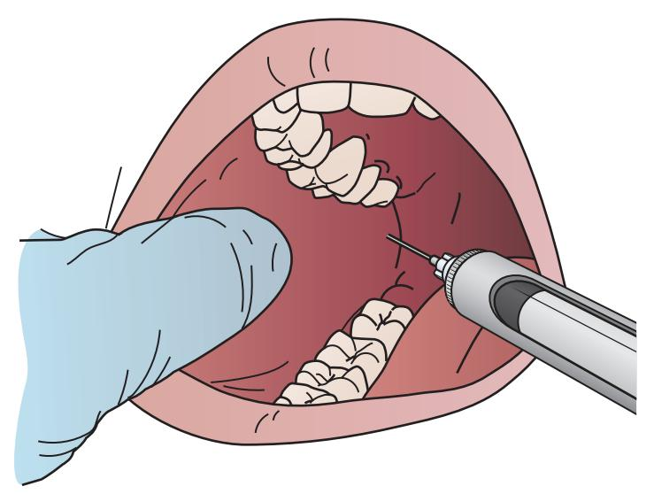

# 6 Pain and Anxiety Control in Surgical Practice

JAMES R. HUPP

# CHAPTER OUTLINE

Local Anesthesia, 68 Mechanism of Action, 68 Pharmacology, 69 Toxic Reactions, 69 Vasoconstrictors, 70 Modulation of Injection Discomfort, 70 Relevant Anatomy, 70 Technique for Administering Local Anesthesia for Oral Surgery, 71 General Principles, 73 Maxillary Injections, 73 Mandibular Injections, 73 Periodontal Ligament Injection, 76 Managing Postextraction Pain, 77

# Anxiety Control, 77

Nonpharmacologic Anxiety Control, 77 Oral Sedation, 77 Pharmacologic Sedation, 78 Nitrous Oxide Sedation, 78 *Nitrous Oxide Storage and Delivery, 78 Presedation Evaluation, 78 General Protocol for Using Nitrous Oxide, 78 Important Caveats to Use of Nitrous Oxide, 81* 

Write and the structure of the structure of the structure of the structure of the structure of the structure of the structure of the structure of the structure of the structure of the structure of the structure of the structure of the structure of the structure of the structure of the structure of the structure of the structure of the structure of the structure of the structure of the structure of the structure of the structure of the structure of the structure of the structure of the structure of the structure of the structure of the structure of the structure of the structure of the structure of the structure of the structure of the structure of the structure of the structure of the structure of the structure of the structure of the structure of the structure of the structure of the structure of the structure of the structure of the structure of the structure of the structure of the structure of the structure of the structure of the structure of the structure of the structure of the structure of the structure of the structure of the structure of the structure of the structure of the structure of the structure of the structure of the structure of the structure of the structure of the structure of the structure of the structure of the structure of the structure of the structure of the structure of the structure of the structure of the structure of the structure of the structure of the structure of the structure of the structure of the structure of the structure of the structure of the structure of the structure of the structure of the structure of the structure of the structure of the structure of the structure of the structure of the structure of the structure of the structure of the structure of the structure of the structure of the structure of the structure of the structure of the structure of the structure of the structure of the structure of the structure of the structure of the structure of the structure of the structure of the structure of the structure of the structure of the structure of the structure

focuses on the use of local anesthesia for routine oral surgery and limits it coverage of anxiety control to nitrous oxide sedation. The topics of local anesthesia and sedation for dental care are far more comprehensively covered in other textbooks.1,2

# **Local Anesthesia**

The ability to locally anesthetize a specific part of the body is one of the marvels of pharmacology. It is hard to imagine the modern practice of dentistry without the availability of local anesthetics (LAs). The dental pulp and soft tissues adjacent to teeth are highly sensitive to stimulation of all forms, including pain-provoking stimuli. Thus profound local anesthesia is mandatory to properly perform oral surgery on an awake patient.

A large number of LAs are available for use by dental practitioners. However, like most medications, those administering drugs find it optimal to limit the number of different forms of a drug to produce a similar effect. This allows the clinician to truly master the use of the category of drug they select to administer, becoming completely familiar with the drug's chemistry, mechanism of action, and clinical pharmacodynamics. Practitioners choosing to limit the number of different versions of a category of drug are then able to focus on just those drugs. This gives them the opportunity to gain valuable clinical experience with the use of these drugs, enabling them to recognize usual and unusual patient reactions and more easily stay abreast of new knowledge related to these drugs. For this reason, this chapter limits its coverage to only six specific LAs. Other LAs are available throughout the world that are efficacious, and other references are available to provide detailed information about them.1

# **Mechanism of Action**

LAs are, by definition, designed to block the function of sensory nerves, although they are also able to inhibit motor nerves and other nerve tissues. To understand the mechanism of action of LAs, one must recall how nerve fibers transmit electrical impulses. In the case of sensory nerves, when the peripheral nerve ending or nerve trunk is sufficiently stimulated, the resting potential of the nerve membrane is triggered to depolarize by a change in membrane permeability that allows the shift of sodium ions across the membrane into the axoplasm. Initially, a slow depolarization occurs; however, once the negative transmembrane potential decreases to the point of the firing threshold, rapid depolarization occurs. Local currents within the axon help propagate the impulse down the axon, triggering rapid depolarization along the path to the cell body and central nervous system (CNS).

LAs primarily function by raising the membrane firing threshold necessary to trigger or propagate an electric impulse. LAs also produce local anesthesia by affecting sensory receptors and nerve membranes in other ways. The end result is that the nerve membrane remains in a polarized state unable to conduct impulses and not transmit otherwise painful sensations.

# Pharmacology

The chemistry of various LAs directly affects the pharmacologic properties of each drug. The LAs discussed in this section are all tertiary amines and classified as amino amides, making them relatively resistant to hydrolysis. LAs tend to work best at a neutral pH. The pH of LAs without vasoconstrictors is about 6.5. Manufacturers lower the pH of LAs when vasoconstrictive agents such as epinephrine are added to inhibit the oxidation of the vasoconstrictor. The acidification of the LA produces the "burning" sensation patients can experience during injection. Another clinical effect related to local anesthetic pH is the tendency for LAs to be less effective when injected into an area of inflammation/infection. This happens because of the acidic nature of inflamed tissue that interferes with local anesthetic effectiveness.

LAs differ in their ability to bind to proteins and in their lipid solubility; they also come in varying concentrations. These factors affect their speed of onset and duration of action. When used for oral surgery the onset of action is also affected by the proximity of the injected deposition of the local anesthetic to the target nerve. The less the distance the drug needs to diffuse to reach the nerve, the faster the onset. The duration of action is affected by the amount of drug deposited and the vascularity of the tissue in the area of the injection. The more drug deposited and the less drug removed by local blood vessels, the longer the duration of action. Vasoconstrictors are added to LAs to dampen the effects of local vessels on drug removal, thereby prolonging the drug's duration.

The pharmacology of the various local anesthetic solutions that are used should be kept in mind so that they can be administered properly. Table 6.1 summarizes commonly used LAs and the expected duration of complete anesthesia. The surgeon must remember that pulpal anesthesia of maxillary teeth after local infiltration lasts a much shorter time compared with pulpal anesthesia of mandibular teeth after block anesthesia. In addition, pulpal anesthesia disappears 60 to 90 minutes before soft tissue anesthesia. Therefore it is common for the patient to have lip anesthesia but to have regained pulpal sensation and so may experience pain.

# **Toxic Reactions**

Only a certain amount of local anesthetic can be safely used in a given patient. To provide anesthesia for multiple tooth extractions, it may be necessary to inject multiple cartridges of the local anesthetic. Thus it is important to know how many cartridges of a given local anesthetic solution can be administered safely. Table 6.2 summarizes (in two different ways) the maximum amounts of local anesthetic that can be used. First, each local anesthetic has a recommended maximum dose based on milligrams per kilogram (mg/kg). The second column in Table 6.2 indicates the number of cartridges that can safely be used on a healthy 154-lb (70-kg) adult. Rarely is it necessary to exceed this dose, even in patients heavier than 154 lb. Patients who are smaller, especially children, should be given proportionally less local anesthetic. A common risky situation involving local anesthetic overdose is the administration of 3% mepivacaine (Carbocaine) to a small child. For a child who weighs 44 lb (20 kg), the recommended maximum amount of mepivacaine is 100 mg. If the child is given two cartridges of 1.8 mL each, the dose totals 108 mg. Therefore a third cartridge of 3% mepivacaine should not be administered. As with any drug,

| TABLE 6.1            | Duration of Anesthesia |                     |             |
|----------------------|------------------------|---------------------|-------------|
| Local Anesthetic  | Maxillary Teeth     | Mandibular Teeth | Soft Tissue |
| Group 1ª             | 10–20 min              | 40–60 min           | 2–3 h       |
| Group 2 b | 50–60 min              | 90–100 min          | 3–4 h       |
| Group 3 c | 60–90 min              | 3 h                 | 4–9 h       |

aGroup 1—local anesthetics without vasoconstrictors: mepivacaine 3%, prilocaine 4%. bGroup 2—local anesthetics with vasoconstrictors: lidocaine 2% with 1:50,000 or 1:100,000 epinephrine, mepivacaine 2% with 1:20,000 levonordefrin, prilocaine 4% with 1:400,000 epinephrine, articaine 4% with 1:100,000 epinephrine.

 $^\circ$ Group 3—long-acting local anesthetics: bupivacaine 0.5% with 1:200,000 epinephrine, etidocaine 1.5% with 1:200,000 epinephrine.

| TABLE 6.2 Recommended Maximum Local Anesthetic Doses |                           |                                                  |                                                 |
|------------------------------------------------------|---------------------------|--------------------------------------------------|-------------------------------------------------|
| Drug/Solution                                        | Maximum Amount (mg/kg) | Number of Cartridges for 70-kg (154-lb) Adult | Number of Cartridges for 20-kg (44-lb) Child |
| Lidocaine 2% with 1:100,000 epinephrine              | 5.0                       | 10                                               | 3.0                                             |
| Mepivacaine 2% with 1:20,000 levonordefrin           | 5.0                       | 10                                               | 3.0                                             |
| Mepivacaine 3% (no vasoconstrictor)                  | 5.0                       | 6                                                | 2.0                                             |
| Prilocaine 4% with 1:200,000 epinephrine             | 5.0                       | 6                                                | 2.0                                             |
| Articaine 4% with 1:100,000 epinephrine              | 7.0                       | 6                                                | 1.5                                             |
| Bupivacaine 0.5% with 1:200,000 epinephrine          | 1.5                       | 10                                               | 3.0                                             |
| Etidocaine 1.5% with 1:200,000 epinephrine           | 8.0                       | 15                                               | 5.0                                             |

the smallest amount of local anesthetic solution sufficient to provide profound anesthesia is the proper amount.

LAs can affect all types of nerves including those controlling the myocardium and peripheral blood vessels. In addition, because LAs can cross the blood-brain barrier, they can also affect CNS tissue. Excessive levels of LAs cause myocardial depression. This may reduce cardiac output and allow abnormal rhythms to occur. When at toxic levels LAs affect the peripheral blood vessels by relaxing smooth muscles responsible for maintaining normal vascular tone; this leads to hypotension. In the CNS, toxic levels of LAs have paradoxical effects. At the lower end of toxic levels LAs can produce CNS signs and symptoms of depression and have anticonvulsant properties. However, as the serum concentration rises to higher toxic levels, a preconvulsant state is produced that may lead to convulsions.

## Vasoconstrictors

The two most common vasoconstrictors added to LAs used for dental surgery are epinephrine and levonordefrin. LAs used for oral surgery have varying concentrations of these two drugs. Epinephrine is added to all the LAs discussed in this chapter except mepivacaine. Mepivacaine is available in two forms; 3% mepivacaine used for dentistry contains no vasoconstrictor, whereas the 2% formulation of mepivacaine has levonordefrin in a 1/20,000 concentration.

Both epinephrine and levonordefrin prolong the duration of local anesthesia by producing local vasoconstriction. They also can promote local hemostasis through their vasoconstrictive effects on capillary beds. Epinephrine and levonordefrin have similar effects on other parts of the cardiovascular system, producing an increase in heart rate, myocardial contractility, and blood pressure. The cardiac effects increase myocardial oxygen consumption and may provoke dysrhythmias. Therefore techniques to limit the amount of these vasoconstrictors are part of the standard protocol of their administration; namely, aspirating before depositing the anesthetic in tissues with sizable blood vessels and limiting the total amount of local anesthetic used. This becomes even more important for patients with preexisting cardiovascular disorders such as coronary artery disease or dysrhythmic tendencies and in patients with poorly controlled hypertension. Yet it must be kept in mind that an inadequate degree or duration of local anesthesia exposes patients to intraoperative pain sensations that will then stimulate endogenous catecholamine release. Therefore guidelines exist about the use of vasoconstrictor-containing LAs to try to balance the need for profound anesthesia for the duration of a procedure with the requirement to avoid potentially dangerous side effects of vasoconstrictors.

# **Modulation of Injection Discomfort**

In many clinical circumstances, patients are more fearful of the local anesthetic injection than of the surgical procedure. Although there are ongoing studies investigating the efficacy of buffered LAs to lessen the pain produced because of their acidity, there is little to counteract the burning or heavy pressure sensation patients feel while LAs are being deposited in the tissues when commonly available anesthetic syringes are in use. However, there are means of lessening the discomfort of the anesthetic needle piercing the mucosa. Local anesthetic needles are sharp and have a small diameter; therefore, when inserted properly, they cause relatively little discomfort. Many practitioners choose to use topical anesthesia before needle insertion to further minimize the discomfort of the injection. Benzocaine has pharmacologic properties that make it a useful topical anesthetic for oral mucosa. It has a very rapid onset of action (typically <1 minute) and an extremely low risk of causing unwanted side effects. When applied to dried mucosa it can eliminate the discomfort of needle insertion within 60 seconds. However, benzocaine does not penetrate deep enough to eliminate the discomfort of anesthetic deposition.

Other approaches to lessening the pain of a local anesthetic injection include lowering the rate of injection, prewarming anesthetic cartridges, and using distraction techniques such as wiggling adjacent tissue like the cheek or talking to the patient about topics unrelated to their surgery during the injection. For some patients, nitrous oxide sedation may be necessary prior to local anesthetic injection (discussed later in this chapter).

## Relevant Anatomy

Profound local anesthesia is needed if the tooth is to be removed without causing sharp pain for the patient; therefore it is essential that the surgeon remember the precise innervations of all teeth and surrounding soft tissue, as well as the kinds of injection necessary to anesthetize those nerves completely. Table 6.3 summarizes the sensory innervation of teeth and the surrounding tissue. Figs. 6.1 to 6.4 show the primary nerves relevant to local anesthesia for dentoalveolar surgery.

| TABLE 6.3 Sensory Innervation of Jaws |                                                                |                                                        |
|---------------------------------------|----------------------------------------------------------------|--------------------------------------------------------|
| Nerve                                 | Teeth                                                          | Soft Tissue                                            |
| Inferior alveolar nerve               | All mandibular teeth                                           | Buccal soft tissue of premolars, canines, and incisors |
| Lingual nerve                         | None                                                           | Lingual soft tissue of all teeth                       |
| Long buccal nerve                     | None                                                           | Buccal soft tissue of molars and the second premolar   |
| Anterior superior alveolar nerve      | Maxillary incisors and canine teeth                            | Buccal soft tissue of incisors and canines             |
| Middle superior alveolar nerve        | Maxillary premolars and a portion of the first molar tooth     | Buccal soft tissue of premolars                        |
| Posterior superior alveolar nerve     | Maxillary molars except for a portion of the first molar tooth | Buccal soft tissue of molars                           |
| Greater palatine nerve                | None                                                           | Lingual soft tissue of molars and premolars            |
| Nasopalatine nerve                    | None                                                           | Lingual soft tissue of incisors and canines            |

Downloaded for Tommy Tran (122427@kasascity.edu) at Kansas City University from ClinicalKey.com by Elsevier on September 12, 2025. For personal use only. No other uses without permission. Copyright ©2025. Elsevier Inc. All rights reserved

• Fig. 6.1 Superior alveolar nerve branches innervating maxillary teeth and adjacent labiobuccal soft tissues.

• Fig. 6.2 Greater palatine and incisive nerves innervating soft tissue over the hard palate.

When anesthetizing a maxillary tooth for extraction, the surgeon should anesthetize adjacent teeth as well. During the extraction process, adjacent teeth are usually subjected to some pressure, which may be sufficient to cause pain. This is also true for mandibular extractions, but the mandibular block injection usually produces sufficient anesthesia to adjacent teeth.

Dense local anesthesia results in the loss of all pain, temperature, and touch sensations, but it does not anesthetize the proprioceptive fibers of the involved nerves. Thus, during an extraction, the patient feels a sensation of pressure, especially when the force is substantial. The surgeon must therefore remember that the patient will need to distinguish between sharp pain and the dull, albeit intense, feeling of pressure when determining the adequacy of anesthesia. It is often difficult to make this distinction.

# Technique for Administering Local Anesthesia for Oral Surgery

The administration of local anesthesia for routine oral surgery is best learned from highly experienced dentists. This section provides a review of the main approaches to providing local anesthesia for oral surgery. The figures are intended as a review of the basic techniques of the key injections used for basic oral surgery.

• Fig. 6.3 Inferior alveolar nerve innervating mandibular teeth and soft tissues in distribution of the mental nerve.

• Fig. 6.4 Lingual and mylohyoid nerves innervating tongue and soft tissues of the floor of the mouth.

## **General Principles**

The primary techniques used for dentoalveolar surgery are the inferior alveolar-lingual nerve block and long buccal nerve block in the mandible, whereas in the maxilla the teeth are anesthetized via buccal/labial infiltration along with palatal anesthesia of the incisive and/or greater palatine nerves. In addition, the lingual or palatal soft tissue of a tooth can be effectively anesthetized by infiltration in the soft tissue adjacent to the tooth or teeth to be operated upon. A few caveats apply to all of these types of injection. First, the slower the injection, the less pain produced. However, the slow speed of injection should be balanced against the anxiety most patients suffer as long as the injection is still being performed. Second, injections into palatal tissue tend to be more uncomfortable due to the limited amount of loose connective tissue present. Injections in such tissue require the clinician to apply more pressure to the plunger and cause pain due to the forceful delivery of anesthetic. Topical anesthetics may lessen the discomfort but do not eliminate it. Third, injections in areas with larger blood vessels should be preceded by aspiration to help lessen the possibility of intra-arterial injection. Of the techniques discussed, this applies to the inferior alveolar and posterior superior alveolar nerve blocks. Fourth, the onset of action of injected LA varies based on its pharmacology and the precision of drug deposition. Therefore adequate time should be allowed to elapse before commencing surgery. When attempting to anesthetize the inferior alveolar, lingual, and buccal nerves, the area of expected anesthesia should be tested for the patient's ability to detect a painful stimulus before the profound anesthesia is presumed to be present. Simply asking the patients if they feel anesthetized (numb) is not sufficient. Remember that a patient's proprioception is not eliminated by an LA, so both inadequately anesthetized and fully anesthetized patients retain that sensibility. Therefore asking a patient if they can feel you touching their lip is not the proper technique for testing the profoundness of local anesthesia. Fifth, for all planned procedures involving mandibular premolar or molar teeth, a long buccal nerve block should be given and be part of the approach to giving an inferior alveolar nerve block (give the long buccal injection using a small remaining part of the local anesthetic cartridge before removing the syringe from the mouth). Sixth, always resheathe the needle before putting the syringe down.

## **Maxillary Injections**

In maxillary local anesthesia, the goal is to place the local anesthetic as close to the nerve to be anesthetized as possible so as to produce profound local anesthesia and to do so rapidly. Local anesthesia for maxillary dental surgery is relatively straightforward since the apices of most of the teeth are close to the surface of the typically thin alveolar bone. Thus placing the anesthetic close to the apex/ apices of the teeth upon which one plans to operate is the objective. The apices of all maxillary teeth except the canine and palatal root of molars tend to rest at the depth of the mucobuccal fold. Positioning the tip of the anesthetic needle just through the mucosa in that area will provide pulpal anesthesia and will also anesthetize the buccal/labial soft tissue adjacent to the injection site. For the canines, the tip of the needle will need to penetrate a couple of millimeters deeper in the maxilla (Figs. 6.5 to 6.7). When operating on several posterior maxillary teeth, a posterior superior alveolar nerve block may be utilized (Fig. 6.8). Because the soft tissues on the palatal aspect of the tooth/teeth to be operated upon also need to be anesthetized, either a greater palatine nerve infiltration or incisive nerve infiltration is useful; however, the palatal soft tissue

• Fig. 6.5 Site of local anesthetic deposition for infiltration technique to anesthetize individual maxillary teeth. Needle tip should be positioned adjacent to the bone overlying the apex of the tooth to be anesthetized.

of any tooth may also be an esthetized by local infiltration adjacent to the tooth (Figs. 6.9 to 6.12).

## Mandibular Injections

Local anesthesia of mandibular teeth is more complex due to the thickness of the alveolar bone around the apices of those teeth. Therefore blocks of the inferior alveolar and lingual nerves are required (Figs. 6.13 to 6.17). Individuals desiring profound pulpal anesthesia of anterior mandibular teeth should avoid attempting to do so with a mental nerve block. Mental nerve blocks produce excellent anesthesia of the soft tissues in the distribution of that nerve but rarely provide reliable and adequate pulpal anesthesia. In addition, giving a mental nerve block makes it difficult to then determine the adequacy of a subsequently given inferior alveolar nerve block. Also, as discussed earlier, when performing procedures near the midline there is usually crossover innervation from the inferior alveolar nerve on the contralateral side, so bilateral inferior alveolar nerve blocks may be necessary. A bilateral inferior alveolar nerve block is not dangerous to the patient, so it should be given without hesitation when indicated.

An important point to remember is that in areas of nerve transition, cross-innervation exists. For example, in the region of the mandibular second premolar, the buccal soft tissues are innervated primarily by the mental branch of the inferior alveolar

• Fig. 6.8 Site of deposition of local anesthetic for anesthetizing the posterior superior alveolar nerve. Note how the surface of the maxillary bone runs medially as it begins to form the posterior maxillary wall. Thus the barrel of the syringe must be taken laterally while penetrating the tissue to help keep the needle tip close to the surface of the bone.

• Fig. 6.6 Technique for infiltrating near apices of individual teeth. Note apices of maxillary teeth, other than the canine, tend to be at the depth of the mucobuccal fold. Needle tip penetration therefore only needs to be 2 to 3 mm.

• Fig. 6.9 Site of needle placement for infiltration to anesthetize the incisive nerve. Note that this is an infiltration so highly precise that needle tip placement is not required to achieve the desired result. No attempt is made to enter the incisive canal.

• **Fig. 6.7** Injection to anesthetize maxillary molars. Posterior superior nerve block may occur if depth of penetration is adequate and needle tip is close to the bony surface.

• Fig. 6.10 Incisive nerve infiltration. Note needle enters just lateral to the incisive papilla. Depth of penetration is 2 to 3 mm. No attempt is made to enter the incisive canal. Injection tends to be uncomfortable due to the density of the tissue and its tight adherence to the underlying bone.

• Fig. 6.12 Anesthetizing the greater palatine nerve. The greater palatine foramen is typically found at the junction of the vertical and horizontal elements of the hard palate in the second molar area. The needle only penetrates 2 to 3 mm. For this technique, no attempt is made to enter the foramen.

• Fig. 6.11 Site of local anesthetic deposition for anesthetizing the greater palatine nerve. No attempt is made to enter the greater palatine canal.

• **Fig. 6.13** Lingual aspect of mandible showing (*1*) site of entrance of inferior alveolar nerve, (*2*) posterior border, (*3*) coronoid notch, (*4*) coronoid process, (*5*) sigmoid notch, (*6*) condylar neck, (*7*) and condylar head.

• Fig. 6.14 Intraoral injection site point of mucosal penetration for an inferior alveolar nerve block. When a patient's mouth is held wide open, the pterygomandibular raphe tenses and usually becomes a visible reference line. The injection point should be just lateral to that line so the needle does not penetrate the raphe itself. At the time of first needle penetration the barrel of the syringe should be over the contralateral lower incisors.

• Fig. 6.15 Once the needle penetrates a few millimeters, the barrel of the syringe should be rotated to now be over the contralateral premolar area.

nerve but also by the terminal branches of the long buccal nerve. Therefore it is appropriate to supplement an inferior alveolar nerve block with a long buccal nerve block to achieve adequate anesthesia of buccal soft tissue when extracting a lower second premolar or placing an incision into that area (Fig. 6.18A–B).

• Fig. 6.16 During an inferior alveolar nerve block using a long needle, about two-thirds to three-fourths of the needle should be into the soft tissues. If all of the needle is buried within the tissues before bone is detected by the needle tip, the needle should be partially withdrawn and the barrel moved more posteriorly before again advancing the needle.

• Fig. 6.17 Needle positioned at the site of local anesthetic deposition near the entrance of the inferior alveolar nerve. Note that the barrel of the syringe is over the contralateral premolars.

# **Periodontal Ligament Injection**

Even with profound soft tissue anesthesia and apparent pulpal anesthesia, a patient may continue to have sharp pain as a tooth is luxated. This is especially likely when teeth have pulpitis or if the surrounding soft and hard tissues are inflamed or infected. A technique that should be used in these situations is the periodontal ligament injection. When this injection is delivered properly, with the local anesthetic solution injected under pressure, immediate profound local anesthesia occurs in almost all situations. The

• Fig. 6.18 Needle placement for anesthetizing the long buccal nerve. The needle tip penetrates tissue just lateral and posterior to the site of the lower third molar. (A) Hard tissue anatomy. (B) Surface anatomy.

anesthesia is short-lived, so the surgical procedure should be one that can be accomplished within 15 to 20 minutes.

Finally, when performing an oral soft tissue biopsy, even when a block technique can provide adequate local anesthesia, infiltrating the tissues adjacent to the planned biopsy site with a vasoconstrictor containing local anesthetic can be useful to help limit bleeding. About 7 minutes should be allowed to elapse between the injection and incision to give the vasoconstrictor time to reach its optimal hemostatic effectiveness.

# Managing Postextraction Pain

Although it is self-evident that local anesthesia is necessary for intraoperative pain control, the surgeon should also acknowledge

its role in postoperative pain control. For routine extractions for which only mild to moderate analgesics will be needed, usually no additional local anesthetic is necessary. After procedures that have been more traumatic (e.g., the removal of impacted teeth) and where stronger analgesics are likely to be necessary, many surgeons use a long-lasting local anesthetic (e.g., bupivacaine) instead of or in addition to their usual local anesthetic. By doing this, the clinician provides the patient with 4 to 8 hours of local anesthesia. This method also allows adequate time for the patient to take the oral analgesics and for the analgesics to take effect before any serious discomfort begins. (See Chapter 12 for further information on this topic.)

# **Anxiety Control**

Management of patient anxiety must be a major consideration in oral surgical procedures. Anxiety is a more important factor in oral surgical procedures than in most other areas of dentistry. Patients are frequently already in pain and may be agitated and fatigued, both of which lower the patient's ability to endure pain or pain-producing situations. Patients who are to have extractions may have preconceived notions or prior experiences of how painful such a procedure will be; they may have seen other patients, including family members, who have reported how painful it is to have a tooth extraction. Many are convinced that the procedure they are about to undergo will be very unpleasant. In addition, patients may experience certain psychological complications when oral surgical procedures are being performed. The removal of teeth causes a variety of reactions; a patient may grieve over lost body parts or perceive the extraction as a confirmation that youth has passed. This adds to the presurgical anxiety caused by fear of pain.

Finally, anxiety is normal even in patients with positive past experiences with extractions because the procedure truly has unpleasant aspects. As noted previously, although the sharp pain is eliminated by local anesthesia, a considerable amount of proprioceptive (pressure) sensation still exists. Other noxious stimuli such as the cracking of teeth and the clinking of instruments are present during an extraction procedure. For these reasons, prudent dentists use a planned method of anxiety control to prepare their patients to deal with the anxiety associated with tooth extraction.

# Nonpharmacologic Anxiety Control

Anxiety control begins, in most cases, with a proper explanation of the planned procedure, including assurance that the doctor will take all measures to minimize the patient experiencing unexpected sharp pain; an expression of empathy from the dentist of what the patient may be fearing is also appropriate. For the mildly anxious patient with a caring dentist, no pharmacologic assistance, other than LA, is typically necessary for routine extractions.

# **Oral Sedation**

As patient anxiety increases, it often becomes necessary to use pharmacologic assistance. Preoperatively, oral medication such as diazepam may help a patient rest well the night before the surgery and provide some relief of anxiety in the morning. A drug such as lorazepam may be useful when administered on the morning of surgery (someone other than the patient should drive him or her to the appointment in such circumstances). Other sources provide more detailed coverage of the use of oral sedatives.2

## Pharmacologic Sedation

Sedation by the inhalation of nitrous oxide is frequently the technique of choice for anxious patients and may be the only technique required for many patients who have mild to moderate anxiety. Nitrous oxide has a remarkably good margin of safety when properly used. An extremely anxious patient who is to have several uncomplicated extractions may require deeper sedation, usually by the intravenous route. Sedation with anxiolytic drugs such as using diazepam or midazolam, with or without a narcotic, allows patients with moderate to severe anxiety to undergo surgical procedures with minimal psychological stress. If the dentist is not skilled at using this modality, patients requiring intravenous sedation should be referred to a dentist who is trained to provide it.2

## Nitrous Oxide Sedation

Nitrous oxide is an odorless and colorless gas that is not irritating to airways. It is toxic to humans if given in very high concentrations, but, when properly mixed with pure oxygen and given appropriately, it can be an extremely potent analgesic and anxiolytic. This makes it useful when providing oral surgery as well as for patients who primarily fear local anesthetic injections.

## Nitrous Oxide Storage and Delivery

In clinical facilities equipped to deliver nitrous oxide, both the nitrous oxide and oxygen come in pressurized tanks. The primary difference is that nitrous oxide is in the liquid form when under pressure, while oxygen is in the gaseous state under cylinder tank pressure (Fig. 6.19). This results in the differences in readings and behavior of pressure gauges on nitrous oxide and oxygen tanks; while oxygen tank gauges will directly show the actual pressure in the tank at all pressures, nitrous oxide tank guages will read 750 psi as long as the pressure is above that amount. However, it is only once the pressure falls below 750 psi that the gauge represents the actual tank pressure proportional to the amount of gas remaining (Fig. 6.20).

The tanks used to deliver nitrous oxide sedation may be centrally located and plumbed to the operatory or in smaller tanks located in the operatory itself. In both cases the equipment used for gas delivery utilizes a pin index system to prevent attaching the wrong gas to the wrong delivery line (Fig. 6.21).

The nitrous oxide and oxygen lines are connected to a delivery system known as a continuous-flow inhalation unit. A large variety of types of these units are available. Some use a single dial to control the nitrous oxide/oxygen mix, while other units have separate control knobs to use to set the liters-per-minute flow of each gas (Figs. 6.22 and 6.23). Tubes attach to the flow unit and to the nasal hood to deliver the gas mixture and remove the expired air. Variously sized nasal hoods are used to deliver the gas mixture to the patient; all should allow for a good fit of the patient's face and for scavenging the expired air from the patient to minimize nitrous oxide in the operatory air. In addition to using the proper nasal hood, the clinician must also ensure that the exhaled gas is connected to and drawn into a waste gas scavenging system at the proper rate (Fig. 6.24).

## Presedation Evaluation

Before deciding if nitrous oxide should be used with a patient, the doctor must learn about the patient's past medical and anesthetic history. Prior bad experience with nitrous oxide may make it the wrong choice for dental sedation. Claustrophobic patients may

Oxygen

• Fig. 6.19 Comparison of the behaviors of stored nitrous oxide and oxygen. Nitrous oxide is primarily in the liquid state when stored under pressure at 70°F, whereas oxygen is in the gaseous state.

not be able to tolerate a nasal hood. Patients who cannot handle mind-altering drugs are poor candidates for nitrous oxide; this includes patients with disorders who cannot tolerate the relative loss of control they may feel under the influence of nitrous oxide. This can also be a problem in older patients but may not manifest until after the effects of the nitrous oxide begin to occur. Medical problems such as poorly controlled chronic obstructive pulmonary disease or a respiratory infection interfering with nasal breathing are relative contraindications to the use of nitrous oxide sedation. It is prudent to avoid the use of nitrous oxide during the first trimester in pregnant patients. The use in later trimesters should be guided by the patient's obstetrician.

## **General Protocol for Using Nitrous Oxide**

The general protocol for administering nitrous oxide in the dental setting begins with giving the patient 100% oxygen. While this is

• Fig. 6.20 Pressure gauges on tanks containing (A) oxygen and (B) nitrous oxide require different interpretations of how much remains in the tank. When an oxygen tank is full, the gauge shows the actual psi of the oxygen remaining in the tank. However, for nitrous oxide, the psi represented on the gauge only represents the pressure of the N2O vapor floating above the liquid N2O. It is only when the amount of liquid begins to run out that the psi on the N2O gauge begins to fall below 750 psi. Until that time, the gauge will read 750 psi.

• Fig. 6.21 Pin index system is used to prevent attaching the wrong gas to the wrong port of the continuous-flow sedation unit/controller. Note the differing patterns of depression below the gas exit port for (A) oxygen and (B) nitrous oxide.

• **Fig. 6.22** Example of a continuous-flow sedation unit/controller used to create the desired N2O:O2 blend. (1) Master control (on-off), (2) controls for O2 and N2O, (3) flowmeters, (4) O2 flushing button, (5) attachment site for reservoir bag, (6) one-way valve to patient.

Fig. 6.23 Examples of inhalation sedation control units.

being done, the clinician should check for proper mask adaptation to the patient's face as well as allow the patient a few minutes to become accustomed to the mask and thus able to tolerate the mask. After a few minutes of preoxygenation, the amount of nitrous oxide  $(N_2O)/oxygen (O_2)$  flows should be adjusted to deliver a 20%/80%  $N_2O:O_2$  mix. For the vast majority of patients this will not produce any effect; nonetheless, after 2 minutes at this level the patient should be queried as to whether they are beginning to sense any changes in mood or other sensations. If they are not, the gas mix should be changed to 30%:70% N2O:O2. Again, after 2 minutes at this level the patient should be queried as to whether they are beginning to sense any changes in mood or other sensations. If they are, they should be asked if the feelings are good or bad. If bad, the percentage of  $N_2O$  should be lowered to 25%, and after 2 minutes the patient should be asked if they still feel any effect and whether it is positive or negative. If negative, it may be that the patient cannot tolerate even low levels of N2O and the attempt at inhalation sedation is then ended. However, if the

patient feels no effect at 30% N2O or some positive effects, the clinician should raise the N2O percentage to 35%. Again, after 2 minutes the patients should be asked whether they can now feel some effects or if they previously felt some positive effects, whether or not the effects became more positive. If they became more positive and the patient is feeling relaxed, the practitioner can proceed with local anesthesia and the surgery. If the patient feels that the previously positive effects are not as positive as at 30%, the doctor can lower the  $N_2O$  concentration to 32% or 33% to try to fine-tune the sedative effects. Titration of the gas mixture should continue until the patient feels relaxed and is enjoying the experience. Once a good level is reached, clinical care can move forward. Note that some patients who have regular experience being in mind-altering states may desire higher doses of N2O, but it is important to make sure their mask fits properly and that they are breathing in and out of their nose. The clinician must use their judgment as to how high a concentration of N2O to provide in such circumstances. Generally, levels of N2O above 50% should

• Fig. 6.24 (A) Nasal hood that patient wears when receiving nitrous oxide sedation. Note that during exhalation the expired air is vacuumed through a one-way valve into the scavenging system. (B) Nasal hood designed to deliver oxygen and nitrous oxide and scavenge expired air. (C) Nasal hood connected to tubing that then connects to the  $O_2$ -N2O feeder tubing and the scavenging tubing.

be avoided, and when levels above 40% are in use, monitor the patient's mood since in some circumstances patients may suddenly become disoriented or even combative. In addition, for longer procedures the dentist should regularly check that the patient is still relaxed and feeling good. Patients can begin to find the nitrous oxide effects less comfortable and need a break from the sedation. Fortunately, once the patient begins to breathe 100% oxygen or room air, the effects of the N2O rapidly dissipate. This also occurs once the need for sedation ends and the patient is placed on 100% oxygen for about 5 minutes to recover.

## Important Caveats to Use of Nitrous Oxide

There are a few important caveats to the use of nitrous oxide sedation. First, like other procedures in dental care, even though it is very safe to use, patients must give informed consent to nitrous oxide sedation. Second, like all drugs administered to patients, the dental records must document the patient's vital signs and dose of drug used while undergoing nitrous oxide sedation. This is also useful since once the optimal mixture of nitrous oxide and oxygen is determined, the same optimal dose is likely to be effective thus gradual titration becomes unnecessary. Third, there are rare instances in which patients under the influence of nitrous oxide experience erotic delusions. Therefore a member of the gender opposite that of the operating surgeon should always be present during the use of nitrous oxide. Fourth, someone on the clinical staff should always be present with the patient while nitrous oxide is in use and during the recovery period.

## References

- Malamed SF. *Handbook of Local Anesthesia*. 6th ed. St. Louis: Elsevier; 2013.
- 2. Malamed SF. *Sedation: A Guide to Patient Management*. St. Louis: Elsevier; 2018.