# 6 Pain and Anxiety Control in Surgical Practice
**JAMES R. HUPP**

## Local Anesthesia
This chapter focuses on local anesthesia for routine oral surgery and nitrous oxide sedation for anxiety control. Profound local anesthesia is mandatory for any surgical procedure on an awake patient. Most clinicians limit the number of local anesthetics (LAs) they use to become masters of their chemistry, mechanism of action, and pharmacodynamics. This chapter will cover six specific LAs.

### Mechanism of Action
Local anesthetics primarily work by blocking sensory nerve conduction, though they can also affect motor nerves and other nerve tissues. They achieve this by raising the membrane firing threshold, which prevents the transmission of nerve impulses. Under normal conditions, nerve stimulation triggers depolarization through an influx of sodium ions; LAs prevent this by keeping the nerve membrane in a polarized state.

### Pharmacology
The LAs discussed are tertiary amines and amino amides, which are resistant to hydrolysis.

*   **pH:**
    *   LAs function best in a neutral pH environment.
    *   LAs without vasoconstrictors have a pH of approximately 6.5.
    *   LAs containing vasoconstrictors like epinephrine have a lower pH to inhibit oxidation, which can cause a "burning" sensation upon injection.
    *   The acidic nature of inflamed or infected tissue interferes with the effectiveness of LAs.
*   **Factors affecting onset and duration:** The primary factors influencing the onset and duration of action are protein binding, lipid solubility, and concentration.
    *   **Onset:** The closer the anesthetic is deposited to the target nerve, the faster the onset.
    *   **Duration:** The duration is affected by the total amount deposited and the vascularity of the surrounding tissue.
    *   **Vasoconstrictors:** These are added to LAs to prolong their duration by reducing the rate at which local blood vessels remove the drug.
*   **Clinical Considerations:**
    *   Pulpal anesthesia for maxillary teeth following infiltration is shorter than for mandibular teeth after a block.
    *   Pulpal anesthesia typically disappears 60 to 90 minutes before soft tissue anesthesia resolves. This means a patient may feel pain even if their lip is still numb.

| TABLE 6.1            | Duration of Anesthesia |                     |             |
|----------------------|------------------------|---------------------|-------------|
| Local Anesthetic  | Maxillary Teeth     | Mandibular Teeth | Soft Tissue |
| Group 1ª             | 10–20 min              | 40–60 min           | 2–3 h       |
| Group 2 b | 50–60 min              | 90–100 min          | 3–4 h       |
| Group 3 c | 60–90 min              | 3 h                 | 4–9 h       |

aGroup 1—local anesthetics without vasoconstrictors: mepivacaine 3%, prilocaine 4%.
bGroup 2—local anesthetics with vasoconstrictors: lidocaine 2% with 1:50,000 or 1:100,000 epinephrine, mepivacaine 2% with 1:20,000 levonordefrin, prilocaine 4% with 1:400,000 epinephrine, articaine 4% with 1:100,000 epinephrine.
cGroup 3—long-acting local anesthetics: bupivacaine 0.5% with 1:200,000 epinephrine, etidocaine 1.5% with 1:200,000 epinephrine.

### Toxic Reactions
It is crucial for clinicians to know the maximum safe amount of LA for each patient.

| TABLE 6.2 Recommended Maximum Local Anesthetic Doses |                           |                                                  |                                                 |
|------------------------------------------------------|---------------------------|--------------------------------------------------|-------------------------------------------------|
| Drug/Solution                                        | Maximum Amount (mg/kg) | Number of Cartridges for 70-kg (154-lb) Adult | Number of Cartridges for 20-kg (44-lb) Child |
| Lidocaine 2% with 1:100,000 epinephrine              | 5.0                       | 10                                               | 3.0                                             |
| Mepivacaine 2% with 1:20,000 levonordefrin           | 5.0                       | 10                                               | 3.0                                             |
| Mepivacaine 3% (no vasoconstrictor)                  | 5.0                       | 6                                                | 2.0                                             |
| Prilocaine 4% with 1:200,000 epinephrine             | 5.0                       | 6                                                | 2.0                                             |
| Articaine 4% with 1:100,000 epinephrine              | 7.0                       | 6                                                | 1.5                                             |
| Bupivacaine 0.5% with 1:200,000 epinephrine          | 1.5                       | 10                                               | 3.0                                             |
| Etidocaine 1.5% with 1:200,000 epinephrine           | 8.0                       | 15                                               | 5.0                                             |

*   **Overdose Example:** For a 44 lb (20 kg) child, the maximum dose of mepivacaine is 100 mg. Since two 1.8 mL cartridges of 3% mepivacaine contain a total of 108 mg, a third cartridge should not be administered.

> The smallest amount of local anesthetic solution sufficient to provide profound anesthesia is the proper amount.

*   **Systemic Effects of Toxic LA Levels:**
    *   **Myocardial:** Depression of the myocardium, reduced cardiac output, and abnormal cardiac rhythms.
    *   **Peripheral Blood Vessels:** Relaxation of smooth muscle, leading to hypotension.
    *   **Central Nervous System (CNS):**
        *   Lower toxic levels cause depression and exhibit anticonvulsant properties.
        *   Higher toxic levels can lead to a preconvulsant state and potentially convulsions.

### Vasoconstrictors
*   **Common types:** Epinephrine and levonordefrin are the most common vasoconstrictors used in dentistry.
    *   Epinephrine is added to most LAs.
    *   Levonordefrin is found in 2% mepivacaine at a 1:20,000 concentration.
*   **Mechanism:** They prolong LA duration through local vasoconstriction and promote hemostasis in capillary beds.
*   **Systemic Effects:** Vasoconstrictors can increase heart rate, myocardial contractility, blood pressure, and myocardial oxygen consumption. They may also provoke dysrhythmias.
*   **Techniques to limit amount:**
    *   Always aspirate before depositing anesthetic solution in vascular tissues.
    *   Limit the total amount of LA used.
    *   These precautions are especially important for patients with pre-existing cardiovascular disorders such as coronary artery disease, dysrhythmias, or poorly controlled hypertension.

> An inadequate degree or duration of local anesthesia exposes patients to intraoperative pain sensations that will then stimulate endogenous catecholamine release. Guidelines balance the need for profound anesthesia with the requirement to avoid potentially dangerous side effects of vasoconstrictors.

### Modulation of Injection Discomfort
Patients often fear the LA injection more than the surgical procedure itself. While buffered LAs are being studied, the burning or pressure sensation from injection remains difficult to counteract completely.

*   **Methods to lessen discomfort:**
    *   **Topical Anesthesia:** Benzocaine can be applied to dried mucosa for about 60 seconds to eliminate the discomfort of needle insertion. However, it does not penetrate deeply enough to affect the discomfort from anesthetic deposition.
    *   Lower the rate of injection.
    *   Prewarm anesthetic cartridges to body temperature.
    *   Use distraction techniques (e.g., wiggling adjacent tissue, talking to the patient).
    *   Administer nitrous oxide sedation for certain patients.

### Relevant Anatomy
Profound local anesthesia requires precise knowledge of nerve innervation to the jaws.

| TABLE 6.3 Sensory Innervation of Jaws |                                                                |                                                        |
|---------------------------------------|----------------------------------------------------------------|--------------------------------------------------------|
| Nerve                                 | Teeth                                                          | Soft Tissue                                            |
| Inferior alveolar nerve               | All mandibular teeth                                           | Buccal soft tissue of premolars, canines, and incisors |
| Lingual nerve                         | None                                                           | Lingual soft tissue of all teeth                       |
| Long buccal nerve                     | None                                                           | Buccal soft tissue of molars and the second premolar   |
| Anterior superior alveolar nerve      | Maxillary incisors and canine teeth                            | Buccal soft tissue of incisors and canines             |
| Middle superior alveolar nerve        | Maxillary premolars and a portion of the first molar tooth     | Buccal soft tissue of premolars                        |
| Posterior superior alveolar nerve     | Maxillary molars except for a portion of the first molar tooth | Buccal soft tissue of molars                           |
| Greater palatine nerve                | None                                                           | Lingual soft tissue of molars and premolars            |
| Nasopalatine nerve                    | None                                                           | Lingual soft tissue of incisors and canines            |

**Fig. 6.1** Superior alveolar nerve branches innervating maxillary teeth and adjacent labiobuccal soft tissues.

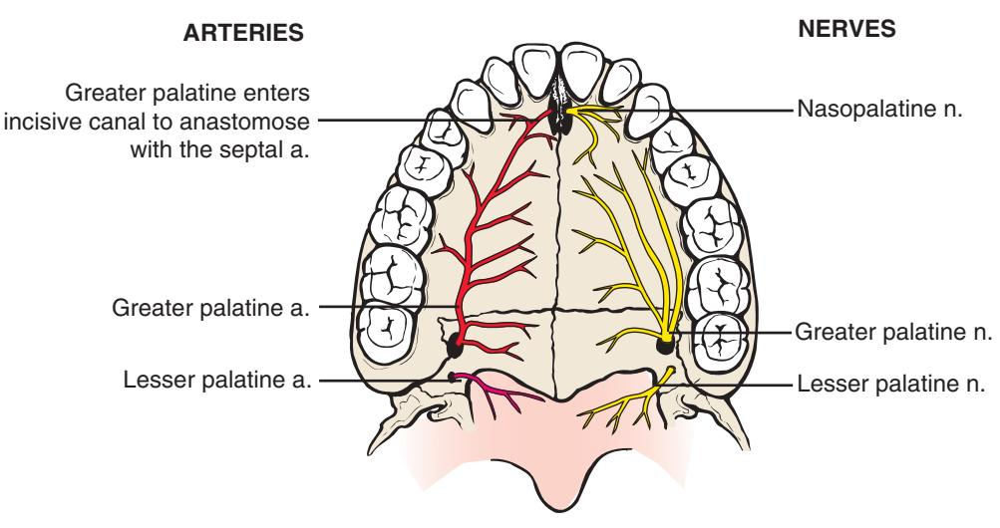
**Fig. 6.2** Greater palatine and incisive nerves innervating soft tissue over the hard palate.

*   **Maxillary Extractions:** It is important to anesthetize adjacent teeth because of the pressure felt during luxation. Mandibular blocks usually provide sufficient anesthesia to adjacent teeth.
*   **Proprioception:** Dense local anesthesia eliminates pain, temperature, and touch sensations, but it does *not* eliminate proprioception (the sense of pressure).

> During an extraction, the patient feels a sensation of pressure. The surgeon must remember that the patient will need to distinguish between sharp pain and the dull, albeit intense, feeling of pressure when determining the adequacy of anesthesia. It is often difficult to make this distinction.

### Technique for Administering Local Anesthesia for Oral Surgery
Learning injection techniques is best achieved under the guidance of experienced dentists. The following figures review basic techniques.

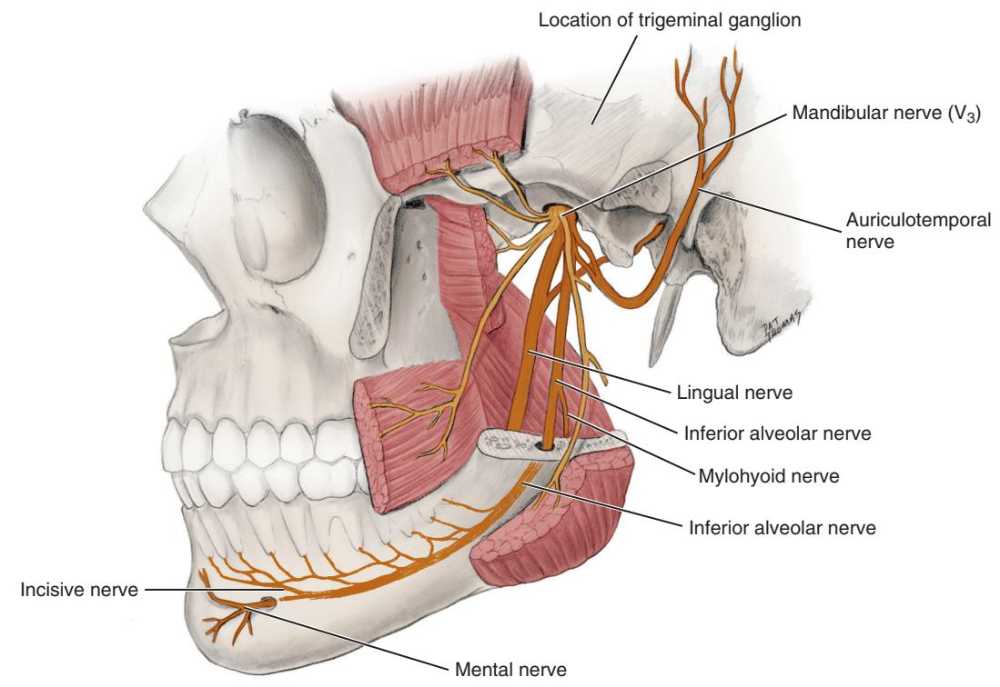
**Fig. 6.3** Inferior alveolar nerve innervating mandibular teeth and soft tissues in distribution of the mental nerve.

**Fig. 6.4** Lingual and mylohyoid nerves innervating tongue and soft tissues of the floor of the mouth.

#### General Principles
*   **Primary Techniques:**
    *   **Mandible:** Inferior alveolar-lingual nerve block and long buccal nerve block.
    *   **Maxilla:** Buccal/labial infiltration and palatal anesthesia (incisive and/or greater palatine nerves).
    *   **Soft Tissue:** Local infiltration adjacent to the tooth.
*   **Caveats:**
    1.  **Slow Injection:** Injecting slowly produces less pain, but this must be balanced against the patient's anxiety level.
    2.  **Palatal Injections:** These are more uncomfortable due to dense tissue and limited space. Topical anesthetics help but do not eliminate this discomfort.
    3.  **Vascular Areas:** Always aspirate before injecting in highly vascular areas, such as during inferior alveolar and posterior superior alveolar nerve blocks.
    4.  **Onset:** Allow adequate time for the anesthetic to take effect. Test for painful stimuli, not just numbness, as proprioception remains intact.
    5.  **Mandibular Procedures:** For procedures on mandibular premolars or molars, always include a long buccal nerve block.
    6.  **Needle Safety:** Always resheathe the needle immediately after use and before placing the syringe down.

#### Maxillary Injections
The goal is to deposit the LA as close as possible to the nerve for rapid and profound anesthesia. The apices of maxillary teeth are typically located near the surface of thin alveolar bone at the depth of the mucobuccal fold.

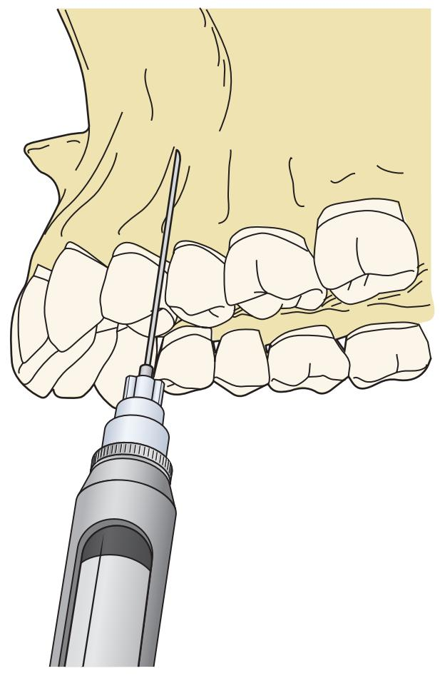
**Fig. 6.5** Site of local anesthetic deposition for infiltration technique to anesthetize individual maxillary teeth. Needle tip should be positioned adjacent to the bone overlying the apex of the tooth to be anesthetized.

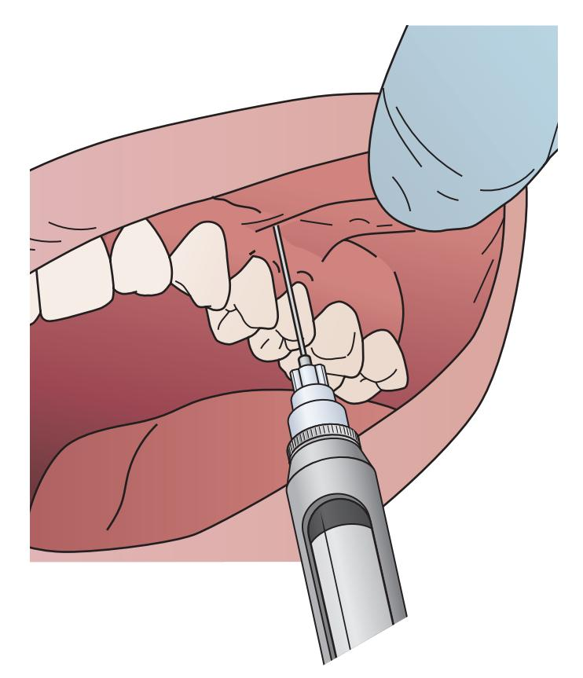
**Fig. 6.6** Technique for infiltrating near apices of individual teeth. Note apices of maxillary teeth, other than the canine, tend to be at the depth of the mucobuccal fold. Needle tip penetration therefore only needs to be 2 to 3 mm.

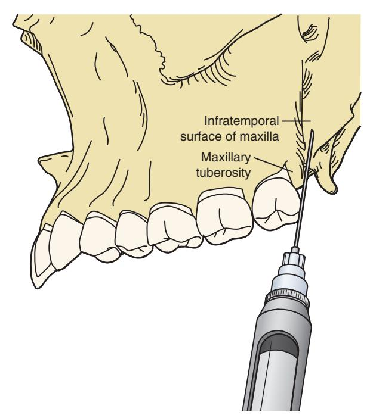
**Fig. 6.7** Injection to anesthetize maxillary molars. Posterior superior nerve block may occur if depth of penetration is adequate and needle tip is close to the bony surface.

**Fig. 6.8** Site of deposition of local anesthetic for anesthetizing the posterior superior alveolar nerve. Note how the surface of the maxillary bone runs medially as it begins to form the posterior maxillary wall. Thus the barrel of the syringe must be taken laterally while penetrating the tissue to help keep the needle tip close to the surface of the bone.

*   **Palatal Soft Tissue:** Anesthesia is achieved via infiltration of the greater palatine nerve, incisive nerve, or local infiltration next to the tooth.

**Fig. 6.9** Site of needle placement for infiltration to anesthetize the incisive nerve. Note that this is an infiltration so highly precise that needle tip placement is not required to achieve the desired result. No attempt is made to enter the incisive canal.

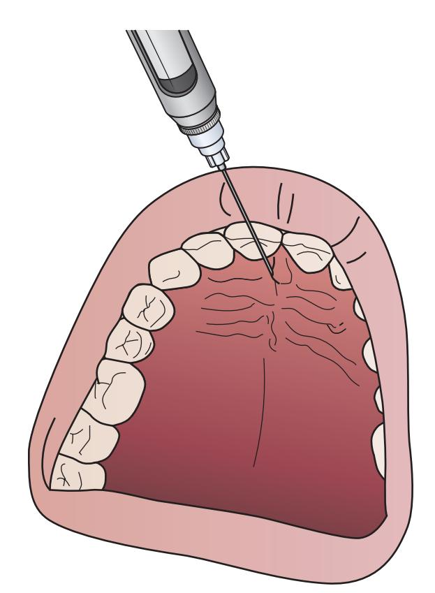
**Fig. 6.10** Incisive nerve infiltration. Note needle enters just lateral to the incisive papilla. Depth of penetration is 2 to 3 mm. No attempt is made to enter the incisive canal. Injection tends to be uncomfortable due to the density of the tissue and its tight adherence to the underlying bone.

**Fig. 6.11** Site of local anesthetic deposition for anesthetizing the greater palatine nerve. No attempt is made to enter the greater palatine canal.

**Fig. 6.12** Anesthetizing the greater palatine nerve. The greater palatine foramen is typically found at the junction of the vertical and horizontal elements of the hard palate in the second molar area. The needle only penetrates 2 to 3 mm. For this technique, no attempt is made to enter the foramen.

#### Mandibular Injections
Anesthetizing the mandible is more complex due to the thick alveolar bone, requiring blocks of the inferior alveolar and lingual nerves.

**Fig. 6.13** Lingual aspect of mandible showing (1) site of entrance of inferior alveolar nerve, (2) posterior border, (3) coronoid notch, (4) coronoid process, (5) sigmoid notch, (6) condylar neck, (7) and condylar head.

**Fig. 6.14** Intraoral injection site point of mucosal penetration for an inferior alveolar nerve block. When a patient's mouth is held wide open, the pterygomandibular raphe tenses and usually becomes a visible reference line. The injection point should be just lateral to that line so the needle does not penetrate the raphe itself. At the time of first needle penetration the barrel of the syringe should be over the contralateral lower incisors.

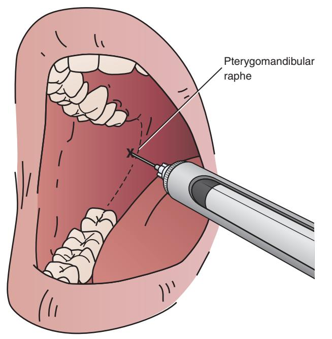
**Fig. 6.15** Once the needle penetrates a few millimeters, the barrel of the syringe should be rotated to now be over the contralateral premolar area.

**Fig. 6.16** During an inferior alveolar nerve block using a long needle, about two-thirds to three-fourths of the needle should be into the soft tissues. If all of the needle is buried within the tissues before bone is detected by the needle tip, the needle should be partially withdrawn and the barrel moved more posteriorly before again advancing the needle.

**Fig. 6.17** Needle positioned at the site of local anesthetic deposition near the entrance of the inferior alveolar nerve. Note that the barrel of the syringe is over the contralateral premolars.

*   **Mental Nerve Block:** This provides excellent soft tissue anesthesia but is rarely reliable for pulpal anesthesia of anterior mandibular teeth. It should be avoided before an inferior alveolar nerve block to not complicate assessment of anesthetic adequacy.
*   **Crossover Innervation:**
    *   For procedures at the midline, bilateral inferior alveolar nerve blocks may be necessary. A bilateral block is safe to perform.
    *   The buccal soft tissue of the mandibular second premolar is innervated by both the mental branch and the long buccal nerve. Therefore, an inferior alveolar block must be supplemented with a long buccal nerve block for adequate anesthesia.

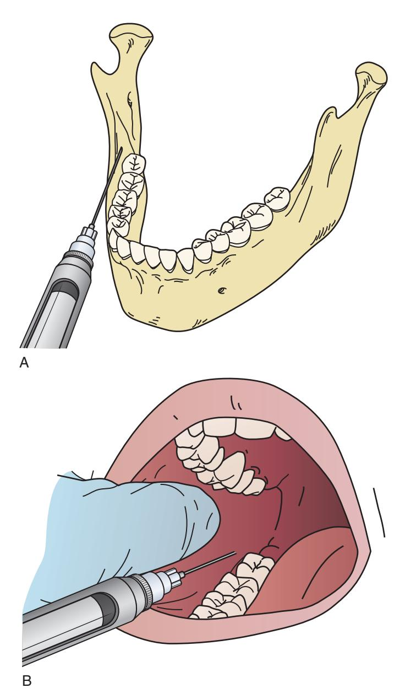
**Fig. 6.18** Needle placement for anesthetizing the long buccal nerve. The needle tip penetrates tissue just lateral and posterior to the site of the lower third molar. (A) Hard tissue anatomy. (B) Surface anatomy.

### Periodontal Ligament Injection
*   **Indication:** Used when a patient experiences sharp pain during tooth luxation despite apparent pulpal anesthesia, often due to pulpitis, inflammation, or infection.
*   **Technique:** Local anesthetic solution is injected under pressure into the periodontal ligament space.
*   **Effect:** Provides immediate and profound local anesthesia.
*   **Duration:** The effect is short-lived (15-20 minutes), making it suitable for quick procedures.
*   **Oral Soft Tissue Biopsy:** Infiltrating LA with a vasoconstrictor adjacent to a biopsy site can limit bleeding. Allow approximately 7 minutes between injection and incision for the optimal hemostatic effect.

### Managing Postextraction Pain
Local anesthesia is crucial for both intraoperative and postoperative pain control.
*   **Routine Extractions:** No additional LA is usually needed after the procedure.
*   **Traumatic Procedures:** For procedures like impacted tooth removal, administering a long-lasting LA (e.g., bupivacaine) provides 4 to 8 hours of anesthesia. This allows oral analgesics to become effective before significant discomfort begins.

## Anxiety Control
Managing patient anxiety is a major consideration in oral surgery. Anxiety is often heightened by existing pain, fatigue, preconceived notions, and psychological factors. Even with profound LA, patients feel pressure and hear cracking and instrument noises. Prudent dentists use planned anxiety control methods.

### Nonpharmacologic Anxiety Control
For mildly anxious patients, a proper explanation of the procedure, assurance of pain minimization, and dentist empathy may be sufficient without pharmacologic aid beyond LA.

### Pharmacologic Sedation
For patients with increased anxiety, pharmacologic assistance is often necessary.

#### Oral Sedation
*   **Preoperative:** A drug like diazepam can help a patient rest the night before surgery and reduce morning anxiety.
*   **Day of Surgery:** Lorazepam can be useful on the morning of surgery, but the patient will require a driver.

#### Nitrous Oxide (N₂O) Sedation
*   This is often the technique of choice for mild to moderately anxious patients.
*   It has a remarkably good margin of safety when used correctly.
*   It is a potent analgesic and anxiolytic, making it useful for patients who fear LA injections.

#### Intravenous (IV) Sedation
*   Indicated for extremely anxious patients or for multiple uncomplicated extractions requiring deeper sedation.
*   Uses anxiolytic drugs (e.g., diazepam, midazolam), with or without narcotics.
*   Allows patients with moderate to severe anxiety to undergo surgery with minimal stress.
*   Patients requiring IV sedation should be referred to a trained dentist if the practitioner is not skilled in this modality.

### Nitrous Oxide Sedation
Nitrous oxide is an odorless, colorless, non-irritating gas. While toxic in very high concentrations, it is an effective analgesic and anxiolytic when properly mixed with oxygen.

#### Nitrous Oxide Storage and Delivery
*   **Storage:** Both N₂O and oxygen are stored in pressurized tanks.
    *   Nitrous oxide exists primarily as a liquid under pressure.
    *   Oxygen is in a gaseous state under pressure.

**Fig. 6.19** Comparison of the behaviors of stored nitrous oxide and oxygen. Nitrous oxide is primarily in the liquid state when stored under pressure at 70°F, whereas oxygen is in the gaseous state.

*   **Pressure Gauges:**
    *   The oxygen gauge shows the actual pressure remaining in the tank.
    *   The nitrous oxide gauge will read 750 psi as long as liquid N₂O is present. The pressure only drops below 750 psi when the liquid is nearly depleted.

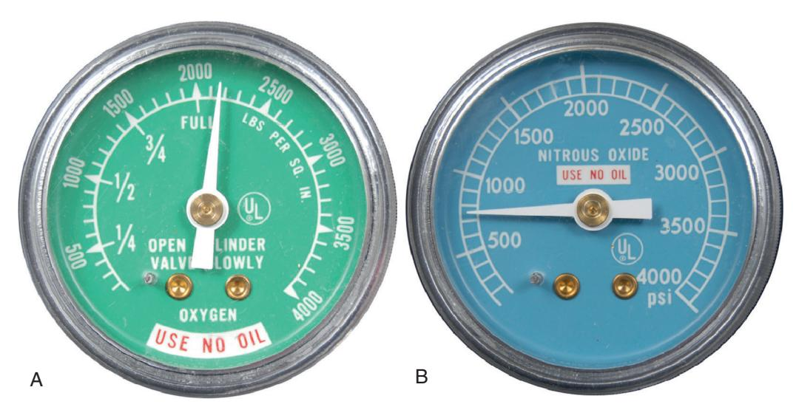
**Fig. 6.20** Pressure gauges on tanks containing (A) oxygen and (B) nitrous oxide require different interpretations of how much remains in the tank. When an oxygen tank is full, the gauge shows the actual psi of the oxygen remaining in the tank. However, for nitrous oxide, the psi represented on the gauge only represents the pressure of the N₂O vapor floating above the liquid N₂O. It is only when the amount of liquid begins to run out that the psi on the N₂O gauge begins to fall below 750 psi. Until that time, the gauge will read 750 psi.

*   **Delivery System:**
    *   **Pin index system:** Prevents attaching the wrong gas tank to the wrong delivery line.
    *   **Continuous-flow inhalation unit:** Connects the N₂O and O₂ lines and allows the clinician to set the gas mixture.
    *   **Nasal Hoods:** Sized for a good patient fit, they deliver the gas mixture and allow for scavenging of expired air to minimize ambient N₂O in the operatory. The hood must be connected to a waste gas scavenging system operating at the proper rate.

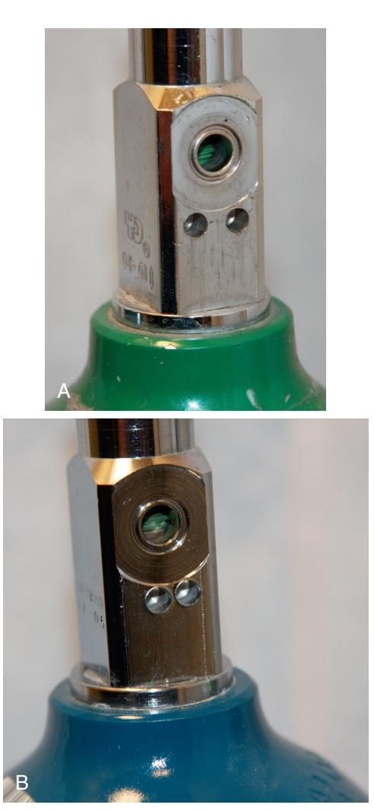
**Fig. 6.21** Pin index system is used to prevent attaching the wrong gas to the wrong port of the continuous-flow sedation unit/controller. Note the differing patterns of depression below the gas exit port for (A) oxygen and (B) nitrous oxide.

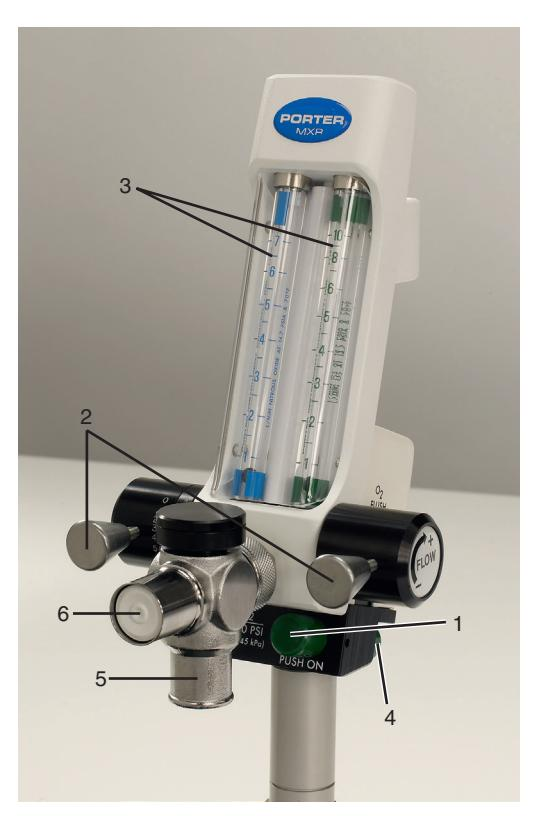
**Fig. 6.22** Example of a continuous-flow sedation unit/controller used to create the desired N₂O:O₂ blend. (1) Master control (on-off), (2) controls for O₂ and N₂O, (3) flowmeters, (4) O₂ flushing button, (5) attachment site for reservoir bag, (6) one-way valve to patient.

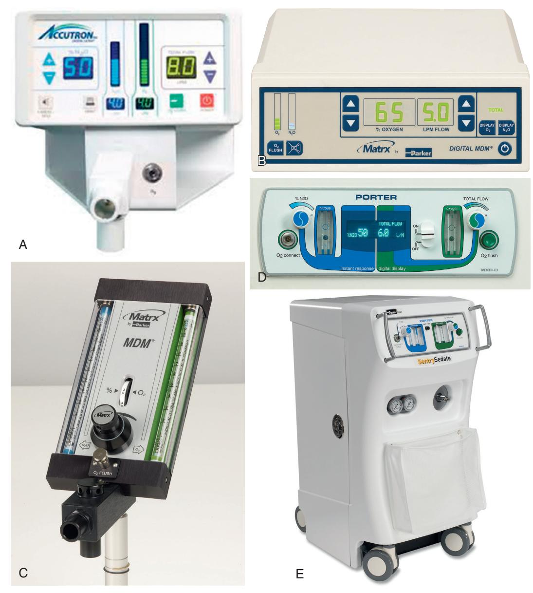
**Fig. 6.23** Examples of inhalation sedation control units.

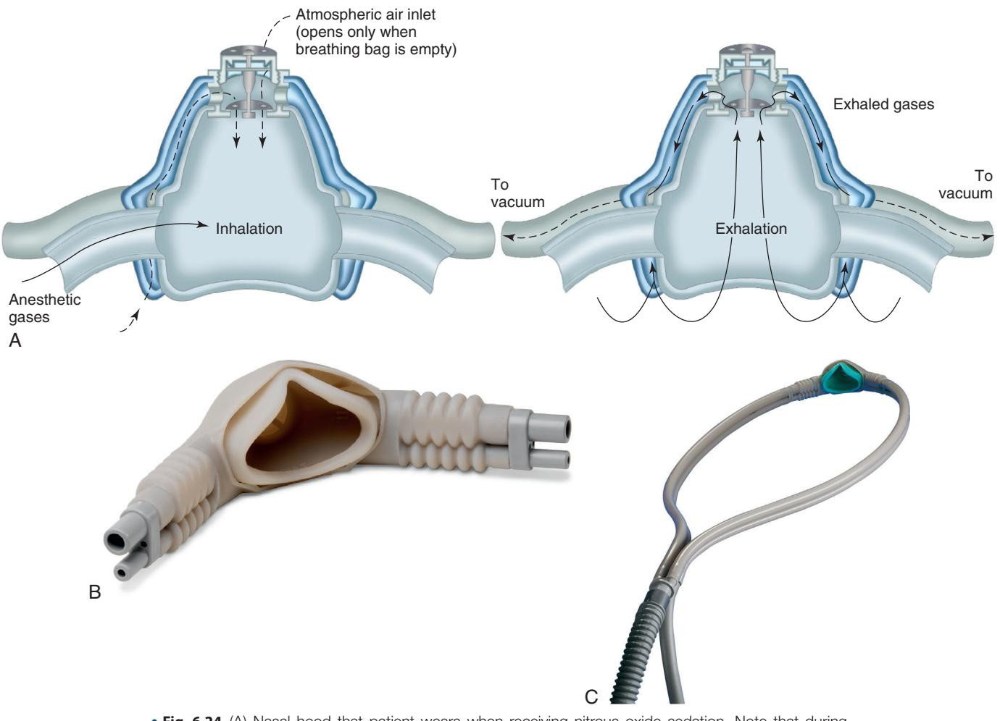
**Fig. 6.24** (A) Nasal hood that patient wears when receiving nitrous oxide sedation. Note that during exhalation the expired air is vacuumed through a one-way valve into the scavenging system. (B) Nasal hood designed to deliver oxygen and nitrous oxide and scavenge expired air. (C) Nasal hood connected to tubing that then connects to the O₂-N₂O feeder tubing and the scavenging tubing.

#### Presedation Evaluation
*   Take a thorough medical and anesthetic history, asking about previous experiences with N₂O.
*   **Contraindications/Considerations:**
    *   **Claustrophobia:** Patient may not tolerate the nasal hood.
    *   **Mind-Altering Drugs:** Patients unable to tolerate mind-altering drugs or loss of control may not be suitable candidates.
    *   **COPD:** Patients with poorly controlled chronic obstructive pulmonary disease.
    *   **Respiratory Infection:** Nasal breathing obstruction is a relative contraindication.
    *   **Pregnancy:** Avoid during the first trimester. Use in later trimesters should be guided by the patient's obstetrician.

#### General Protocol for Using Nitrous Oxide
1.  **Start with 100% Oxygen:** Begin by administering 100% oxygen for a few minutes to check mask adaptation and allow the patient to acclimate.
2.  **Initial Mix (20% N₂O:80% O₂):** Titrate to an initial mix of 20% N₂O. After 2 minutes, ask the patient about any mood changes or sensations. Most patients feel no effect at this level.
3.  **Increase N₂O (30% N₂O:70% O₂):** Increase to 30% N₂O. After 2 minutes, query the patient again.
    *   If the patient reports negative feelings, lower the concentration to 25% N₂O. If negative feelings persist, end the sedation attempt.
4.  **Further Increase (35% N₂O):** If the patient has no effect or positive effects at 30%, raise the concentration to 35%. After 2 minutes, ask about increased positive effects.
    *   If the patient feels relaxed and positive, proceed with LA and surgery.
    *   If the effects are less positive than at 30%, lower the concentration to 32% or 33% to fine-tune the sedation level.
5.  **Titration:** Continue titrating until the patient feels relaxed and enjoys the experience.
    > Clinician judgment is needed for higher N₂O concentrations. Generally, avoid levels above 50%. Monitor mood closely above 40%, as disorientation or combativeness can occur.
    > For longer procedures, regularly check patient's comfort; they may need a break.
6.  **Recovery:** The effects of N₂O dissipate rapidly. At the end of the procedure, place the patient on 100% oxygen for approximately 5 minutes.

#### Important Caveats to Use of Nitrous Oxide
1.  **Informed Consent:** Patients must provide informed consent before administration.
2.  **Documentation:** Dental records must include vital signs and the drug dose (N₂O:O₂ ratio). Documenting the optimal mix can prevent the need for re-titration at future appointments.
3.  **Erotic Delusions:** A staff member of the gender opposite that of the operating surgeon should always be present in the room.
4.  **Staff Presence:** A member of the clinical staff must always be present with the patient during N₂O administration and recovery.

### References
1. Malamed SF. *Handbook of Local Anesthesia*. 6th ed. St. Louis: Elsevier; 2013.
2. Malamed SF. *Sedation: A Guide to Patient Management*. St. Louis: Elsevier; 2018.