# 7 Instrumentation for Basic Oral Surgery

JAMES R. HUPP

## CHAPTER OUTLINE

Incising Tissue, 83

Elevating the Mucoperiosteum, 85

Retracting Soft Tissue, 85

Grasping Soft Tissue, 87

Controlling Hemorrhage, 87

Removing Bone, 88 Rongeurs, 88 Burr and Handpiece, 88 Mallet and Chisel, 89 Bone File, 89

**Removing Soft Tissue From Bony Cavities, 89** 

Suturing Soft Tissue, 89 Needle Holder, 89 Suture Needle, 89 Suture Material, 90 Scissors, 90

Holding the Mouth Open, 91

Removing Fluids, 91

Holding Towels and Drapes in Position, 92

### Irrigating, 93

Extracting Teeth, 93 Dental Elevators, 94 Types of Elevators, 94 Periotomes, 95 Extraction Forceps, 96 *Forceps Components, 96 Maxillary Forceps, 98 Mandibular Forceps, 99* 

Instrument Tray Systems, 101

This chapter is designed to introduce the instrumentation commonly used to perform routine dental extractions and other basic oral surgical operations. The instruments illustrated and described are used for a wide variety of purposes, including soft and hard tissue procedures. This chapter primarily provides a description of instruments; their use is discussed in subsequent chapters.

## Incising Tissue

Many surgical procedures begin with an incision. The primary instrument for making incisions is the scalpel, which is composed of a handle and a sterile, very sharp blade (Fig. 7.1). Scalpels are available as single-use instruments with plastic handles and fixed blades; scalpel handles to which disposable blades can be attached are also available. The most commonly used handle for oral surgery is the No. 3 handle. The tip of a scalpel handle is configured to receive a variety of differently shaped scalpel blades that are inserted onto the slotted portion of the handle.

The most frequently used scalpel blade for intraoral surgery is the No. 15 blade (Fig. 7.2). The blade is small and is used to make incisions around teeth and through soft tissue. The blade is similar in shape to the larger No. 10 blade, which is used for large skin incisions in other parts of the body. Other commonly used blades for intraoral surgery include the No. 11 and No. 12 blades. The No. 11 blade is a sharp-pointed blade that is used primarily for making small stab incisions as for incising an abscess to establish drainage. The hooked No. 12 blade is useful for mucogingival procedures in which incisions are made on the posterior aspects of teeth or in the maxillary tuberosity area.

The scalpel blade must be carefully loaded onto the handle, ideally holding the blade with a needle holder. This lessens the chance of injuring one's fingers. The blade is held along the unsharpened edge, where it is reinforced with a small rib, and the handle is held so that the male portion of the fitting is pointing upward (Fig. 7.3A). The scalpel blade is then slowly slid onto the handle along the grooves in the male portion until it clicks into position (see Fig. 7.3B).

The scalpel is unloaded in a similar manner. The needle holder grasps the end away from the blade (see Fig. 7.3C) and lifts it to disengage it from the male fitting. The scalpel is then slid off the handle, always away from the body and anyone nearby (see Fig. 7.3D). The used blade is immediately discarded into a specifically designed rigid-sided sharps container (see Fig. 5.6C).

When using the scalpel to make an incision, the surgeon typically holds the handle in the pen grasp (Fig. 7.4) to allow maximal control of the blade as the incision is made. For maximum cutting efficiency, mobile tissue should be held firmly in place under some tension so that as the incision is made, the blade will incise and not just push away the mucosa. When incising depressible soft tissue, an instrument such as a retractor should be used to hold the tissue taut while incising. When a full-thickness mucoperiosteal incision is desired, the blade should be pressed down firmly so that the incision penetrates the mucosa and periosteum with the same stroke.

Fig. 7.1 A scalpel is composed of a handle and a sharp blade. *Top*, Reusable scalpel No. 3 handle with single-use blade (a No. 15 blade is most commonly used for oral surgery). *Bottom*, Single-use handle-blade unit with No. 15 blade.

Fig. 7.2 Scalpel blades used in oral surgery include No. 10, No. 11, No. 12, and No. 15 (left to right).

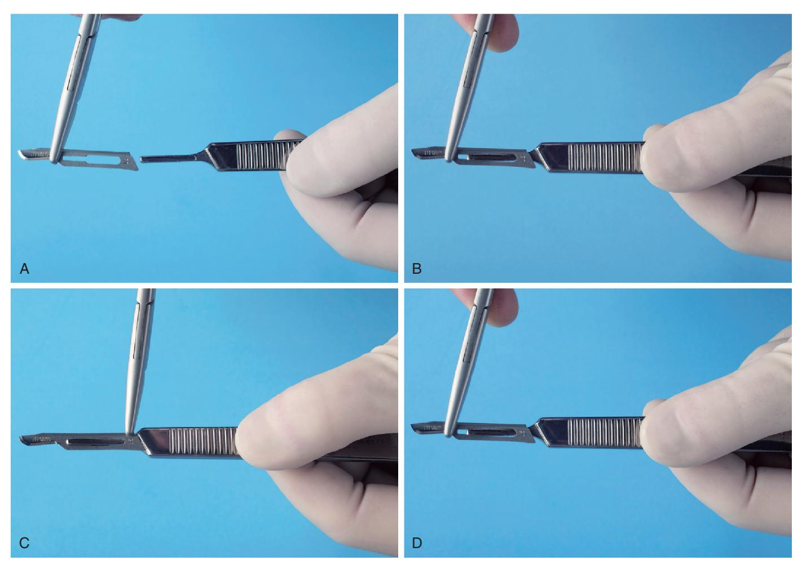

**Fig. 7.3** (A) When loading a scalpel blade, the surgeon holds the noncutting portion of the blade in the needle holder and handle, with the male portion of the fitting pointing upward. (B) The surgeon then slides the blade into the handle until it clicks into place. (C) To remove the blade, the surgeon uses the needle holder to grasp the end of the blade next to the handle and lifts it to disengage it from the fitting. (D) The surgeon then gently slides the blade off the handle away from the body and anyone nearby.

Scalpel blades are designed for single-patient use. Blades dull easily when they come into contact with hard tissue such as bone or teeth and even after repeated strokes through keratinized tissue. If several incisions through the mucoperiosteum to bone are required, it may be necessary to use additional blades during a single operation. Dull blades do not make clean, sharp incisions in soft tissue and therefore should be replaced before they become overly dull.

## Elevating the Mucoperiosteum

The tissue plane between periosteum and bone is relatively bloodless and well defined. When an incision is made through the periosteum, ideally the periosteum should be reflected from the underlying cortical bone in a single subperiosteal layer with a periosteal elevator. The instrument that is most commonly used in oral surgery is the No. 9 Molt periosteal elevator (Fig. 7.5). This instrument has a sharp, pointed end and a broader, rounded end. The pointed end is used to begin the periosteal reflection and to reflect dental papillae from between teeth, whereas the broad, rounded end is used to continue the elevation of the periosteum from bone.

The No. 9 Molt periosteal elevator is typically used to reflect tissue by two methods. In the first method, the pointed end is used in a twisting, prying motion to elevate soft tissue, most commonly when elevating a dental papilla from between teeth or the attached gingiva around a tooth to be extracted or when beginning to elevate a full thickness mucoperiosteal flap. The second method involves the push stroke in which the side of the pointed end or the broad end of the instrument is slid underneath the periosteum, separating it from the underlying bone. This is the most efficient stroke that results in the cleanest reflection of periosteum.

There are other types of periosteal elevators for use by perio-dontists, orthopedic surgeons, and other surgeons involved in work on bones.

## Retracting Soft Tissue

Good access and vision are critical to performing excellent surgery. A variety of retractors have been specifically designed to retract the cheek, tongue, and mucoperiosteal flaps to provide access and visibility during surgery. Retractors are also used to help protect soft tissue from sharp cutting instruments.

The two most popular cheek retractors are (1) the right-angle Austin retractor (Fig. 7.6) and (2) the broad offset Minnesota retractor (Fig. 7.7). These retractors can also be used to retract the cheek and a mucoperiosteal flap simultaneously. Before the flap is created, the retractor is held loosely in the cheek. Once the flap is reflected, the retractor edge is placed on bone and is then used to retract the flap.

The Henahan and Seldin retractors are other types of instruments used to retract oral soft tissue (Fig. 7.8). Although these retractors may look similar to a periosteal elevator, the leading edge is not sharp but, instead, smooth; these instruments are not typically used to elevate the mucoperiosteum. The No. 9 Molt periosteal elevator can also be used as a retractor for small flaps. Once the periosteum has been elevated, the broad blade of the periosteal elevator is held firmly against bone, with the mucoperiosteal flap elevated into a reflected position.

The instrument most commonly used to retract the tongue during routine exodontia is the mouth mirror. This is usually part of every basic setup because it is useful for examining the mouth and for indirect visualization during dental procedures. The Weider tongue retractor is a broad, heart-shaped retractor that is serrated on one side so that it can more firmly engage the tongue and retract it medially and anteriorly (Fig. 7.9A). When this retractor is used, care must be taken not to position it so far posteriorly as to cause gagging or to push the tongue into the oropharynx (see Fig. 7.9B).

A towel clip (see Fig. 7.28) can also be used to hold the tongue in certain circumstances. When a biopsy procedure is to be

Fig. 7.4 The scalpel handle is held in the pen grasp to allow maximal control.

Fig. 7.6 The Austin retractor is a right-angle retractor that can be used to retract the cheek, tongue, or flaps.

Fig. 7.5 The No. 9 Molt periosteal elevator is most commonly used in oral surgery.

Fig. 7.7 The Minnesota retractor is an offset retractor used to retract the cheek and flaps. (A) Front. (B) Back.

Fig. 7.8 The Henahan (top) and Seldin (bottom) retractors are broader instruments that provide broader retraction and increased visualization.

Fig. 7.9 (A) The Weider retractor is a large retractor designed to retract the tongue. The serrated surface helps engage the tongue so that it can be held securely. (B) The Weider retractor is used to hold the tongue away from the surgical field. The Austin retractor is used to retract the cheek.

performed on the posterior aspect of the tongue, the most positive way to control the tongue is by holding the anterior tongue with a towel clip. Local anesthesia must be profound where the clip is placed, and, if anticipated, it is wise to mention to the patient that this method of retraction may be used.

## Grasping Soft Tissue

Various oral surgical procedures require the surgeon to grasp soft tissue to incise it, to stop bleeding, or to pass a suture needle. The instrument most commonly used for this purpose is the Adson forceps (or pickup; Fig. 7.10A). These are delicate forceps, with or without small teeth at the tips, that can be used to hold tissue gently while stabilizing it. When this instrument is used, care should be taken not to grasp the tissue too tightly to avoid crushing it. Toothed forceps allow tissue to be securely held with a more delicate grip than untoothed forceps.

When working in the posterior part of the mouth, the Adson forceps may be too short. Longer forceps that have a similar shape are the Stillies forceps. These forceps are usually 7 to 9 inches long and can easily grasp tissue in the posterior part of the mouth, still leaving enough of the instrument protruding beyond the lips for the surgeon to hold and control it (see Fig. 7.10B).

Occasionally it is more convenient to have an angled forceps. These include the college, or cotton, forceps (they are also called *cotton pliers*) (see Fig. 7.10B). Although these forceps are not especially useful for handling tissue, they are an excellent instrument for picking up loose fragments of tooth, amalgam, or other foreign material and for placing or removing gauze packs.

In some types of surgery, especially when removing larger amounts of tissue or doing biopsies, such as in an epulis fissurata, forceps with locking handles and teeth that will firmly grip the tissue are necessary. In this situation, the Allis tissue forceps are used (Fig. 7.11A–B). The locking handle allows the forceps to be placed in the proper position and then to be held by an assistant to provide the necessary tension for proper dissection of the tissue. The Allis forceps should never be used on tissue that is to be left

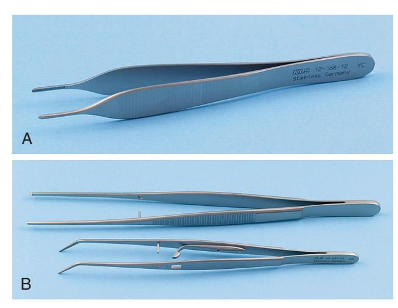

Fig. 7.10 (A) Small, delicate Adson tissue forceps are used to gently stabilize soft tissue for suturing or dissection. (B) The Stillies pickup (top) is longer than the Adson pickup and is used to handle tissue in the more posterior aspect of the mouth. The college pliers (bottom) are angled forceps that are used for picking up small objects in the mouth or from the tray stand. The college pliers shown here represent the locking version.

in the mouth because they cause a relatively large amount of tissue crushing (see Fig. 7.11C). However, the forceps can be used to grasp the tongue in a manner similar to a towel clamp.

## Controlling Hemorrhage

When incisions are made through tissue, small arteries and veins are incised, causing bleeding. For most dentoalveolar surgery, pressure on the wound is usually sufficient to control bleeding. Occasionally pressure does not stop the bleeding from a larger artery or vein. When this occurs, an instrument called a *hemostat* is useful (Fig. 7.12A). Hemostats come in a variety of shapes; they may be small and delicate or larger and are either straight or curved. The hemostat most commonly used in surgery is the curved hemostat (see Fig. 7.12B).

A hemostat has long, delicate beaks that are used to grasp tissue and a locking handle. The locking mechanism allows the surgeon to clamp the hemostat onto a vessel and then let go of the instrument or let an assistant hold it. The tip of the hemostat will remain clamped onto the tissue. This is useful when the surgeon plans to

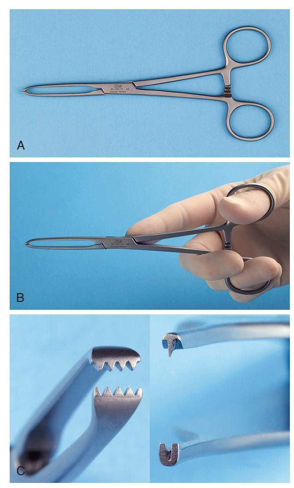

Fig. 7.11 (A) Allis tissue forceps are useful for grasping and holding tissue that will be excised. (B) Allis forceps are held in the same fashion as the needle holder. (C) Comparison of Adson beaks (right) with Allis beaks (left) shows the differences in their designs and uses.

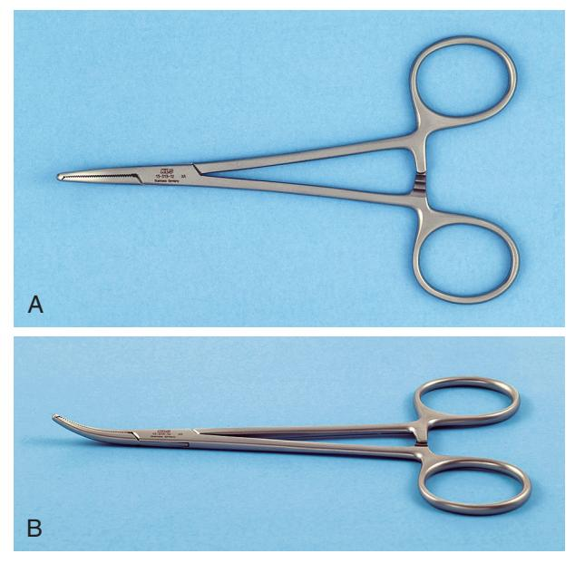

Fig. 7.12 (A) Superior view of the hemostat used for oral surgery. (B) Oblique view of the curved hemostat. Straight hemostats are also available.

place a suture around the vessel or to cauterize it (i.e., use heat to sear the vessel closed).

In addition to its use as an instrument for controlling bleeding, the hemostat is especially useful in oral surgery to remove granulation tissue from tooth sockets and to pick up small root tips, pieces of calculus, amalgam, fragments, and any other small particles that have dropped into the wound or adjacent areas. However, it should never be used to suture.

#### Removing Bone

#### Rongeurs

The instrument most commonly used for removing bone in dentoalveolar surgery is the rongeur forceps. This instrument has sharp blades that are squeezed together by the handles, cutting or pinching through bone. Rongeur forceps have a rebound mechanism incorporated so that when hand pressure is released, the instrument reopens. This allows the surgeon to make repeated bone-trimming actions without manually reopening the instrument (Fig. 7.13A). The two major designs for rongeur forceps are (1) a side-cutting forceps and (2) the side- and end-cutting forceps (see Fig. 7.13B).

The side-cutting and end-cutting rongeurs are more practical for most dentoalveolar surgical procedures that require bone removal. The end-cutting forceps can be inserted into sockets for the removal of interradicular bone and can also be used to remove sharp edges of bone. Rongeurs can be used to remove large amounts of bone efficiently and quickly. Because a rongeur is a delicate instrument, the surgeon should not use it to remove large amounts of bone in single bites. Rather, smaller amounts of bone should be removed in multiple bites. Likewise, the rongeur should never be used to remove teeth because this practice will quickly dull and destroy the instrument and risks losing a tooth in the patient's throat because a rongeur is not designed to hold an extracted tooth firmly. Rongeurs are expensive, so care should be taken to keep them sharp and in working order.

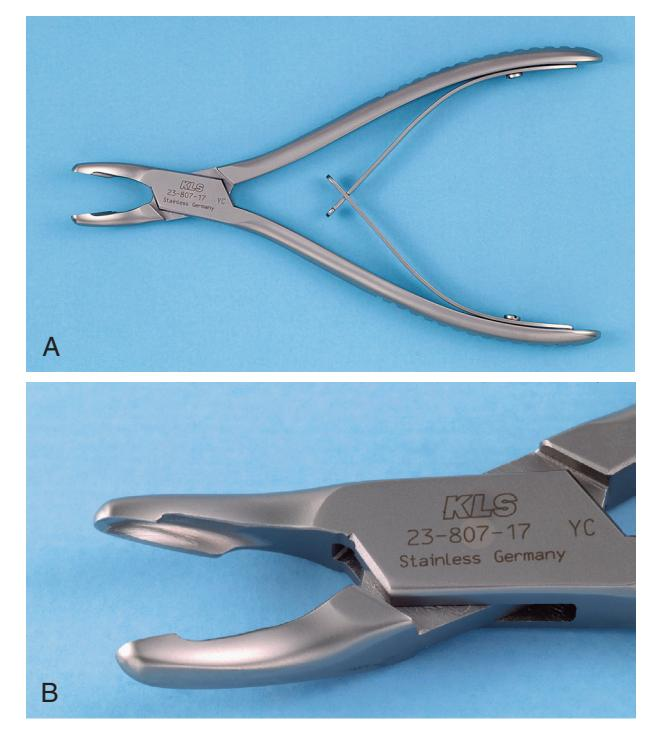

**Fig. 7.13** (A) Rongeurs are bone-cutting forceps that have spring-loaded handles. (B) Blumenthal rongeurs comprise both end- and side-cutting blades. They are preferred for oral surgery procedures.

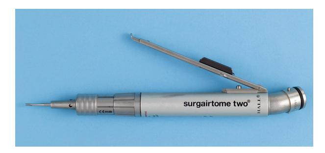

Fig. 7.14 Typical moderate-speed high-torque sterilizable handpiece with No. 703 burr.

#### Burr and Handpiece

Another method for removing bone is with a burr in a handpiece. This is the technique that most surgeons use when removing bone for the surgical removal of teeth. Moderate-speed, high-torque handpieces with sharp carbide burrs remove cortical bone efficiently (Fig. 7.14). Burrs such as No. 557 or No. 703 fissure burr and No. 8 round burr are used. When large amounts of bone must be removed, as in torus reduction, a large-bone burr that resembles an acrylic burr is typically used.

Any handpiece that is used for oral surgery must be completely sterilizable. When a handpiece is purchased, the manufacturer's specifications must be checked carefully to ensure that they can be met. The handpiece should have high speed and torque. This allows rapid bone removal and efficient sectioning of teeth. The handpiece must not exhaust air into the operative field, which would make it improper to use the typical high-speed air-turbine drills employed in routine restorative dentistry. The reason is that the air exhausted into the wound may be forced into deeper tissue planes and produce tissue emphysema, a dangerous occurrence.

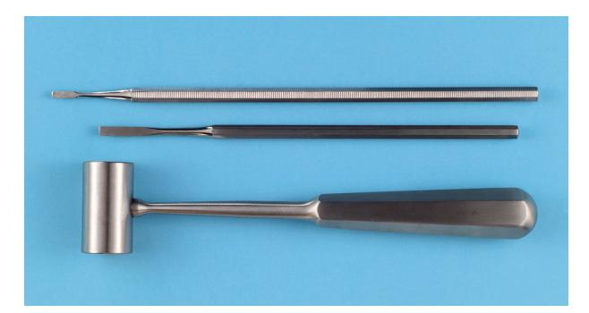

Fig. 7.15 The surgical mallet and chisel can be used for removing bone.

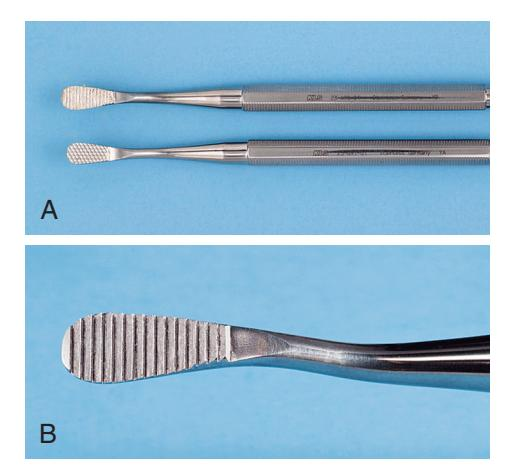

Fig. 7.16 (A) The double-ended bone file is used for smoothing small, sharp edges or spicules of bone. (B) The teeth of this bone file are effective only in the pull stroke.

## Mallet and Chisel

Occasionally bone removal is performed using a mallet and chisel (Fig. 7.15), although the availability of high-speed handpieces for removing bone and sectioning teeth has greatly limited the need for mallets and chisels. The mallet and chisel are sometimes used in removing lingual tori. The edge of the chisel must be kept sharp if it is to function effectively (see Chapter 13).

## Bone File

Final smoothing of bone before the completion of surgery is usually performed with a small bone file (Fig. 7.16A). The bone file is usually a double-ended instrument with small and larger ends. The bone file cannot be used efficiently for removal of large amounts of bone; therefore it is used only for final smoothing. The teeth of most bone files are arranged in such a fashion that they properly remove bone only on a pull stroke (see Fig. 7.16B). Pushing this type of bone file against bone results only in burnishing and crushing the bone and should be avoided.

# Removing Soft Tissue From Bony Cavities

The curette commonly used for oral surgery is an angled, doubleended instrument used to remove soft tissue from bony defects (Fig. 7.17). Its principal use is to remove granulomas or small cysts from periapical lesions, but the curette may also be used to remove small amounts of granulation tissue debris from a tooth socket. Larger currettes are available for removing soft tissue from

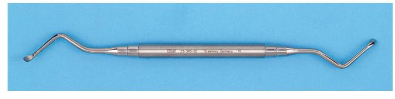

Fig. 7.17 The periapical curette is a double-ended, spoon-shaped instru-ment used to remove soft tissue from bony cavities.

Fig. 7.18 A needle holder has a locking handle and a short, blunt beak.

larger bony cavities such as cysts. Note that the periapical curette is distinctly different in design and function from the periodontal curette.

# Suturing Soft Tissue

Once a surgical procedure has been completed, the mucoperiosteal flap is returned to its original position and held in place by sutures. The needle holder is the instrument used to place the sutures.

## Needle Holder

The needle holder is an instrument with a locking handle and a short, blunt beak. For intraoral placement of sutures, a 7-inch (15-cm) needle holder is usually recommended (Fig. 7.18). The beaks of a needle holder are shorter and stronger than the beaks of a hemostat (Fig. 7.19). The face of the shorter beak of the needle holder is cross-hatched to permit a positive grasp of the suture needle. The hemostat has parallel grooves on the face of the beaks, thereby decreasing the control over needle and suture. Therefore the hemostat is not an instrument used for suturing.

To control the locking handles properly and to direct the long needle holder, the surgeon must hold the instrument in the proper fashion (Fig. 7.20). The thumb and ring finger are inserted through the rings. The index finger is held along the length of the needle holder to steady and direct it. The second finger aids in controlling the locking mechanism. The index finger should not be put through the finger ring because this will result in a dramatic decrease in control.

## Suture Needle

The needle used in closing oral mucosal incisions is usually a small half-circle or three-eighths—circle suture needle. The needle is curved to allow it to pass through a limited space where a straight needle cannot reach, and passage can be done with a twist of the wrist.

Suture needles come in a large variety of shapes, from very small to very large (Fig. 7.21A). The tips of suture needles either

**Fig. 7.19** (A) The hemostat (top) has a longer, thinner beak compared with the needle holder (bottom) and therefore should not be used for suturing. (B) The face of the shorter beak of the needle holder is cross-hatched to ensure a positive grip on the needle (left). The face of the hemostat has parallel grooves that do not allow a firm grip on the needle (right).

are tapered like sewing needles or have triangular tips that allow them to be cutting needles. A cutting needle will pass through the mucoperiosteum more readily than a tapered needle (see Fig. 7.21B). The cutting portion of the needle extends about one-third the length of the needle, and the remaining portion of the needle is rounded. Tapered needles are used for more delicate tissues, as in ocular or vascular surgery. Care must be taken with cutting needles because, if not used correctly, they can cut through tissue lateral to the track of the needle. The suture material used for oral surgery is usually purchased already swaged on (by fusing the end of a suture onto a needle) by the manufacturer.

The curved needle is held approximately two-thirds of the distance between the tip and the base of the needle (Fig. 7.22). This allows enough of the needle to be exposed to pass through the tissue while allowing the needle holder to grasp the needle in its strong portion to prevent bending of the needle or dulling of the tip. Techniques for placing sutures are further discussed in Chapter 8.

## Suture Material

Many types of suture materials are available. The materials are classified by diameter, resorbability, and whether they are monofilament or polyfilament.

The size of suture relates to its diameter and is designated by a series of zeros. The diameter most commonly used in the suturing of oral mucosa is 3-0 (000). A larger-sized suture is 2-0, or 0. Smaller sizes are designated with more zeros, for example 4-0, 5-0, and 7-0. Sutures of very fine size, such as 7-0, are usually used in conspicuous places on the skin—for example, the face—because properly placed smaller sutures usually cause less scarring. Sutures of size 3-0 are large enough to withstand the tension placed on them intraorally and strong enough for easier knot tying with a needle holder compared with smaller-diameter sutures.

Sutures may be resorbable or nonresorbable. Nonresorbable suture materials include such types as silk, nylon, vinyl, and stainless steel. The most commonly used nonresorbable suture in the oral cavity is silk. Nylon, vinyl, and stainless steel are rarely used in the mouth. Resorbable sutures are primarily made of gut. Although the term *catgut* is often used to designate this type of suture, gut actually is derived from the serosal surface of sheep intestines. Plain catgut resorbs quickly in the oral cavity, rarely lasting longer than 3 to 5 days. Gut that has been treated with a tanning solution (chromic acid) is called *chromic gut* and lasts longer than plain gut by up to 7 to 10 days. Several synthetic resorbable sutures are also available. These materials consist of long chains of polymers braided into suture material. Examples are polyglycolic acid and polylactic acid. These materials are slowly resorbed, taking up to 4 weeks to do so. Such long-lasting resorbable sutures are rarely indicated for basic oral surgery.

Finally, sutures are classified on the basis of their being monofilament or polyfilament. Monofilament sutures are sutures such as plain and chromic gut, nylon, and stainless steel. Polyfilament sutures are braided sutures such as silk, polyglycolic acid, and polylactic acid. Sutures that are made of braided material are easier to handle and tie than monofilament sutures and rarely come untied. The cut ends are usually soft and nonirritating to the tongue and surrounding soft tissues. However, because of the multiple filaments, they tend to "wick" oral fluids along the suture to the underlying tissues. This wicking action may carry bacteria along with saliva. Monofilament sutures do not cause this wicking action but may be more difficult to tie and tend to come untied. Also the cut ends are stiffer, being more irritating to the tongue and soft tissue.

One of the most commonly used sutures for the oral cavity is 3-0 black silk. The size 3-0 has the appropriate amount of strength; the polyfilament nature of the silk makes it straightforward to tie and well tolerated by the patient's soft tissues. The color makes the suture easy to see when the patient returns for suture removal. Sutures that are holding mucosa together usually stay no longer than 5 to 7 days, so the wicking action is of little clinical importance. Many surgeons prefer 3-0 chromic suture to avoid the need to later remove it. (Techniques for suturing and knot tying are presented in Chapter 8.)

#### Scissors

The final instruments necessary for placing sutures are suture scissors (Fig. 7.23). Suture scissors usually have short cutting edges because their sole purpose is to cut sutures. The most commonly used suture scissors for oral surgery are Dean scissors. These have slightly curved handles and serrated blades that make cutting sutures easier. Suture scissors usually have long handles and thumb and finger rings. Scissors are held in the same manner as needle holders.

Other types of scissors are designed for cutting soft tissue. The two major types of tissue scissors are iris scissors and Metzenbaum scissors (Fig. 7.24). These scissors can have straight or curved blades. Iris scissors are small, sharp-pointed, delicate tools used for fine work. Metzenbaum scissors are used for undermining soft tissue and for cutting. They can have either sharp or blunt (rounded) tips. Tissue scissors such as iris or Metzenbaum scissors should not be used to cut sutures because the suture material will dull

**Fig. 7.20** The needle holder is held by using the thumb and ring finger in rings (A) and the first and second fingers to control the instrument (B).

the edges of the blades and make them less effective and more traumatic when cutting tissue.

## Holding the Mouth Open

In performing extractions of mandibular teeth, it is necessary to support the mandible to prevent stress on the temporomandibular joint (TMJ). Supporting the patient's jaw on a bite block will help protect the joint. The bite block is just what the name implies (Fig. 7.25). It is a soft, rubber-like block on which the patient can rest his or her teeth. The patient opens the mouth to a comfortably wide position, the rubber bite block is inserted, and the block holds the mouth in the desired position without effort on the patient's part. Bite blocks come in several sizes to fit variously sized patients and produce varying degrees of opening. Should the surgeon need the mouth to be opened wider using any size of bite block, the patient must open his or her mouth more widely and the bite block must be positioned more to the posterior of the mouth. For most adult patients, a pediatric-sized bite block is adequate when placed over the molar teeth.

The side-action mouth prop or Molt mouth prop (Fig. 7.26) can be used by the operator to open the mouth wider if necessary. This mouth prop has a ratchet-type action, opening the mouth wider as the handle is closed. This type of mouth prop should be used with caution because great pressure can be applied to the

teeth and the TMJ and injury may occur with injudicious use. This type of mouth prop is useful in patients who are deeply sedated or have mild forms of trismus.

Whenever a bite block or side-action mouth prop is used, the surgeon should take care to avoid opening the patient's mouth too much because it may cause stress on the TMJ. Occasionally this may result in stretch injury to the joint, necessitating additional treatment. When long procedures are being performed, it is a good idea to remove the prop periodically and allow the patient to move the jaw and rest the muscles for a short time.

## **Removing Fluids**

To provide adequate visualization, blood, saliva, and irrigating solutions must be removed from the operative site. Surgical suction has a smaller orifice than the type used in general dentistry to more rapidly evacuate fluids from the surgical site to maintain adequate visualization. Many of these suction tips are designed with several orifices so that the soft tissue will not become aspirated into the suction hole and cause tissue injury (Fig. 7.27A).

The Fraser suction has a hole in the handle portion that can be covered with a fingertip as needed. When hard tissue is being cut under copious irrigation, the hole is covered so that the solution is removed rapidly. When soft tissue is being suctioned, the hole

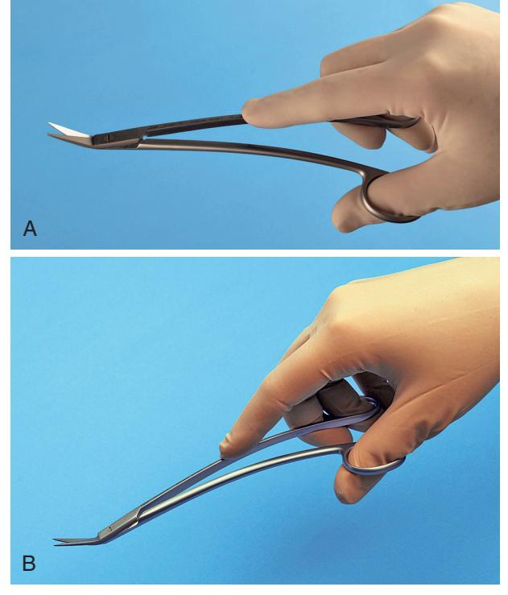

**Fig. 7.23** Suture scissors should be held in the same fashion as the needle holder.

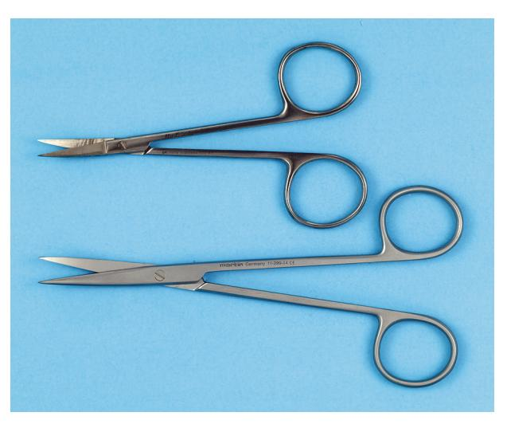

**Fig. 7.24** Soft tissue scissors are of two designs: Iris scissors (top) are small, sharp-pointed scissors. Metzenbaum scissors (bottom) are longer, more delicate scissors. Metzenbaum scissors are available as either sharp tipped (shown here) or blunt tipped.

can be left uncovered to prevent tissue injury or soft tissue obstruction of the suction tip (see Fig. 7.27B).

## **Holding Towels and Drapes in Position**

When drapes are placed around a patient, they can be held together with a towel clip (Fig. 7.28). This instrument has a locking handle and finger and thumb rings. The action ends of the towel clip can be sharp or blunt. Those with curved points penetrate the towels and drapes. When this instrument is used, the operator must exercise extreme caution so as not to pinch the patient's underlying skin.

**Fig. 7.21** (A) Comparison of needles used in oral surgery. *Top*, C-17 needle, which usually holds a size 4-0 suture. *Middle*, PS-2 needle. *Bottom*, SH. All are cutting needles, and the suture material is swaged onto the needle. (B) The tip of the needle used to suture mucoperiosteum is triangular in cross section to make it a cutting needle.

Fig. 7.22 The needle holder grasps the curved needle two-thirds of the distance from the tip of the needle.

Fig. 7.25 (A) The bite block is used to hold the patient's mouth open in the position chosen by the patient. (B) The sides of the bite block are corrugated to provide a surface for teeth to engage. (C) The blocks come in a variety of sizes.

Fig. 7.26 The side-action, or Molt, mouth prop can be used to open the patient's mouth when the patient is unable to cooperate, such as during sedation or in the presence of some degree of trismus.

# Irrigating

When a handpiece and burr are used to remove bone, it is essential that the area be irrigated with a steady stream of irrigation solution, usually sterile saline or sterile water. The irrigation cools the burr and prevents bone-damaging heat buildup. The irrigation also increases the efficiency of the burr by washing away bone chips from the flutes of the burr and providing a certain amount of lubrication. In addition, once a surgical procedure is completed and before the mucoperiosteal flap is sutured back into position, the surgical field should be thoroughly irrigated. A large plastic syringe with a blunt 18-gauge needle is commonly used for irrigation. Although the syringe is disposable, it can be sterilized multiple times before it is discarded. The needle should be blunt and smooth so that it does not damage soft tissue, and it should be angled for more efficient direction of the irrigating stream (Fig. 7.29).

# Extracting Teeth

One of the most important instruments used in the extraction procedure is the dental elevator. These instruments are used to luxate (loosen) teeth from surrounding bone. Loosening teeth before the application of the dental forceps makes extractions more straightforward. By elevating teeth before the application of the forceps, the clinician can minimize the incidence of broken crowns, roots, and bone. Finally, luxation of teeth before forceps application facilitates the removal of a broken root, should it occur, because prior elevator use is likely to have loosened the root in the dental

**Fig. 7.27** (A) The typical surgical suction has a small-diameter tip. Suction tips usually have a hole to prevent tissue injury caused by excessive suction pressure. *Top*, Unassembled for cleaning. *Bottom*, Assembled for use. (B) The Fraser suction tip has a blade in the handle to allow the operator more control over the amount of suction power. Holding the thumb over the hole increases suction at the tip. A wire stylet is used to clean the tip when bone or tooth particles plug the suction.

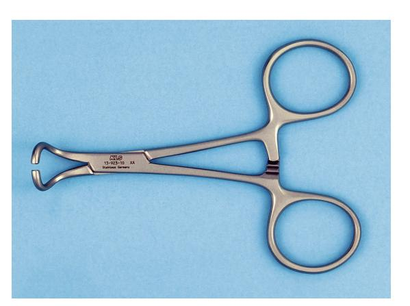

Fig. 7.28 The towel clip is used to hold the drape in position. The tips clasp the towels, and the locking handles maintain the drape in position. The clip shown has nonpenetrating blunt tips. Towel clamps with sharp penetrating tips are also available.

Fig. 7.29 Large plastic syringes with an angled blunt tip may be used to deliver the irrigation solution to the operative site.

socket. In addition to their role in loosening teeth from surrounding bone, dental elevators are also used to expand alveolar bone. By expanding the buccocervical plate of bone, the surgeon facilitates the removal of a tooth that has a limited and obstructed path for removal. Finally, elevators are used to remove broken or surgically sectioned roots from their sockets.

## Dental Elevators

The three major components of the elevator are the handle, shank, and blade (Fig. 7.30). The handle of the elevator is usually of generous size, so it can be held comfortably in the hand to apply substantial but controlled force. The application of specifically applied force is critical in the proper use of dental elevators. In some situations, crossbar or T-bar handles are used. These instruments must be used with great caution because they can generate an excessive amount of force that can fracture both teeth and bones (Fig. 7.31).

The shank of the elevator simply connects the handle to the working end, or blade, of the elevator. The shank is generally of substantial size and is strong enough to transmit the force from the handle to the blade. The blade of the elevator is the working tip of the elevator and is used to transmit the force to the tooth, bone, or both.

## Types of Elevators

The biggest variation in the type of elevator is in the shape and size of the blade. The three basic types of elevators are (1) the straight type, (2) the triangle or pennant-shaped type, and (3) the pick type. The straight elevator is the most commonly used elevator to luxate teeth (Fig. 7.32A). The blade of the straight elevator has

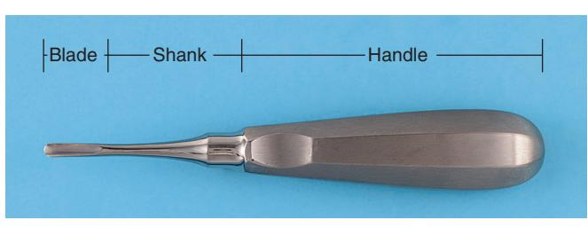

Fig. 7.30 The major components of an elevator are the handle, shank, and blade.

Fig. 7.31 A crossbar handle is used on certain elevators. This type of handle can generate large amounts of force and therefore must be used with great caution.

Fig. 7.32 (A) Straight elevators are the most commonly used type. (B–C) The blade of the straight elevator is concave on its working side.

Fig. 7.33 Straight elevators vary in size depending on the width of the blade.

a concave surface on one side that is placed toward the tooth to be elevated (see Fig. 7.32B). The small straight elevator, No. 301, is frequently used for beginning the luxation of an erupted tooth before application of the forceps (Fig. 7.33). Larger straight elevators are used to displace roots from their sockets and to luxate teeth that are more widely spaced, or they are used once a smaller-sized straight elevator becomes less effective. The most commonly used large straight elevator is the No. 34S, but the No. 46 and the No. 77R elevators are also used occasionally.

The shape of the blade of the straight elevator can be angled from the shank, allowing this instrument to be used in the more posterior aspects of the mouth. Two examples of the angled-shank elevator with a blade similar to that of the straight elevator are the Miller elevator and the Potts elevator.

The second most commonly used type of elevator is the triangular elevator (Fig. 7.34). These elevators are provided in pairs: a left and a right. The triangular elevator is most useful when a broken root remains in the tooth socket and the adjacent socket is empty. A typical example would be when a mandibular first molar is fractured, leaving the distal root in the socket but the mesial root

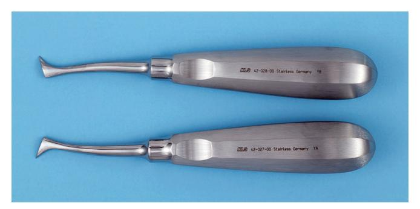

Fig. 7.34 Triangular elevators (Cryer) are pairs of instruments and are therefore used for mesial or distal roots.

Fig. 7.35 The Crane pick is a heavy instrument used to elevate whole roots or even teeth after the purchase point has been prepared with a burr.

removed with the crown. The tip of the triangular elevator is placed into the socket with the shank of the elevator resting on the buccal plate of bone. The elevator is then turned in a wheel-and-axle rotation, with the sharp tip of the elevator engaging the cementum of the remaining distal root; the elevator is then turned and the root is delivered. Triangular elevators come in a variety of types and angulations, but the Cryer elevator is the most common type. (Pairs of these elevators are also commonly referred to as *east-west elevators*.)

The third type of elevator used with some frequency is the pick-type elevator. This type of elevator is used to remove roots. The heavy version of the pick is the Crane pick (Fig. 7.35). This instrument is used as a lever to elevate a broken root from the tooth socket. Usually it is necessary to drill a hole with a burr (purchase point) approximately 3 mm deep into the root just at the bony crest. The tip of the pick is then inserted into the hole, and, with the buccal plate of bone as a fulcrum, the root is elevated from the tooth socket. Occasionally the sharp point can be used without preparing a purchase point by engaging the cementum or the furcation of the tooth.

The second type of pick is the root-tip pick or the apex elevator (Fig. 7.36). The root-tip pick is a delicate instrument that is used to tease small root tips from their sockets. It must be emphasized that this is a thin instrument and should not be used as a wheel-and-axle or lever type of elevator such as the Cryer elevator or the Crane pick. The root-tip pick is used to tease the very small root end of a tooth by inserting the tip into the periodontal ligament space between the root tip and the socket wall. This instrument works best on roots left after a tooth has been well elevated.

#### Periotomes

Periotomes are instruments used to extract teeth while preserving the anatomy of the tooth's socket. The general principle behind their use is to sever some of the periodontal ligaments of the tooth

**Fig. 7.36** The delicate root-tip pick is used to tease root tip fragments from the socket. The fine tip can be broken off or bent if the instrument is used improperly.

Fig. 7.37 A periotome with a handle and exchangeable blades. Other types of periotomes have fixed blades or are connected to a motor.

to facilitate its removal. There are varying types of periotomes with different blade shapes (Fig. 7.37).

The tip of the periotome blade is inserted into the periodontal ligament space and advanced using pressure in the apical direction along the long axis of the tooth. It is advanced about 2 to 3 mm and then removed and reinserted into an adjacent accessible site. The process is continued around the tooth, gradually advancing the depth of the periotome tip while progressing apically. Once sufficient severance of periodontal ligaments has been accomplished, the tooth is removed by using a dental elevator, extraction forceps, or both, taking care to avoid excessive expansion or fracture of bone.

#### Extraction Forceps

The extraction forceps are instruments used for removing the tooth from alveolar bone. Ideally, forceps are used to lift elevator-luxated teeth from their sockets rather than to pull teeth from their sockets. When properly used, they can also help to expand bone during extractions.

Forceps are designed in many styles and configurations to adapt to the variety of teeth for which they are used. Each basic design offers a multiplicity of variations to coincide with individual operator preferences. This section deals with the basic fundamental designs and briefly discusses several of the variations.

#### Forceps Components

The basic components of dental extraction forceps are the handles, hinge, and beak (Fig. 7.38). The handles are usually of adequate

size to be used comfortably and to deliver sufficient pressure and leverage to remove the required tooth. The handles have a serrated surface to allow a positive grip and to prevent slippage.

The handles of the forceps are held differently depending on the position of the tooth to be removed. Maxillary forceps are held with the palm to the side or underneath the forceps so that the beak is directed in a superior direction (Fig. 7.39). The forceps used for removal of mandibular teeth are held with the palm on top of the forceps so that the beak is pointed down toward teeth (Fig. 7.40). The handles of the forceps are usually straight, but some may be curved to provide the operator with a better fit (Fig. 7.41).

The hinge of the forceps, like the shank of the elevator, is merely a mechanism for connecting the handles to the beak. The hinge transfers and concentrates the force applied to the handles to the beak. One distinct difference in styles does exist: The usual American type of forceps has a hinge in a horizontal direction and is used as has been described (see Fig. 7.38). The English preference is for a vertical hinge and a corresponding vertically positioned handle (Fig. 7.42A). Thus the English-style handle and hinge are used with the hand held in a vertical direction as opposed to a horizontal direction (see Fig. 7.42B).

The beaks of the extraction forceps are the source of the greatest variation among forceps. The beaks are designed to adapt to the tooth root near the junction of the crown and root. It must be remembered that the beaks of the forceps are designed to be adapted to the root structure of the tooth and not to the crown of the tooth. In a sense, then, different beaks are designed for

Fig. 7.38 Basic components of extraction forceps.

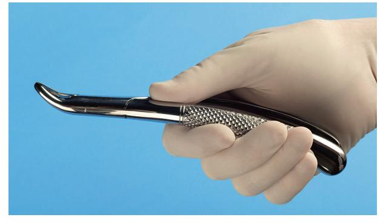

Fig. 7.39 Forceps used to remove maxillary teeth are held with the palm under the handle.

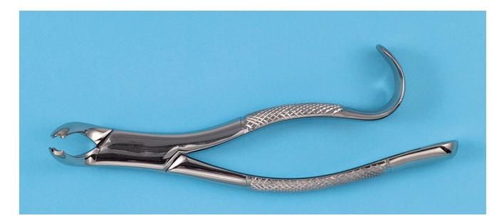

 $\ensuremath{\textit{Fig. 7.41}}$  Straight handles are usually preferred, but curved handles are favored by some surgeons.

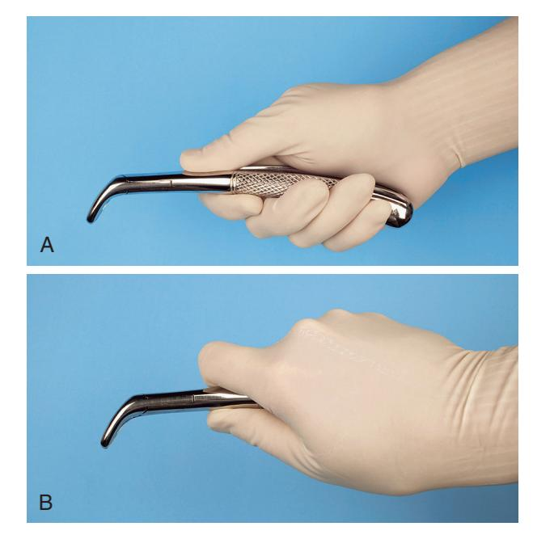

**Fig. 7.40** (A) Forceps used to remove mandibular teeth are held with the palm on top of forceps. (B) A firmer grip for delivering greater amounts of rotational force can be achieved by moving the thumb around and under the handle.

Fig. 7.42 (A) English style of forceps have the hinge in the vertical direction. (B) English style of forceps are held in the vertical direction.

single-rooted teeth, two-rooted teeth, and three-rooted teeth. The design variation is such that the tips of the beaks will adapt closely to the various root formations, improving the surgeon's control of forces on the root and decreasing the chances of a root fracture. The more closely the beaks of the forceps adapt to the tooth roots, the more efficient is the extraction and the lower is the chance for undesired outcomes.

A final design variation is in the width of the beak. Some forceps beaks are narrow because their primary use is to remove narrow teeth such as incisor teeth. Other forceps beaks are broader because the teeth they are designed to remove are substantially wider, for example, lower molar teeth. Forceps designed to remove a lower incisor can theoretically be used to remove a lower molar, but the beaks are so narrow that they will be inefficient for that application. Similarly, the broader molar forceps will not adapt to the narrow space occupied by the lower incisor; therefore it cannot be used in that situation without damage to adjacent teeth.

The beaks of forceps are angled such that they can be placed parallel to the long axis of the tooth, with the handle in a comfortable position. Therefore the beaks of maxillary forceps are usually parallel to the handles. Maxillary molar forceps are offset in a bayonet fashion to allow the operator to reach the posterior aspect of the mouth comfortably and yet keep the beak parallel to the long axis of the tooth. The beaks of mandibular forceps are usually set perpendicular to the handles, which allows the surgeon to reach lower teeth and maintain a comfortable controlled position.

#### Maxillary Forceps

The removal of maxillary teeth requires the use of instruments designed for single-rooted teeth and for teeth with three roots. Maxillary incisors, canine teeth, and premolar teeth are considered single-rooted teeth. The maxillary first premolar frequently has a bifurcated root, but because this occurs in the apical third, it has no influence on the design of the forceps. The maxillary molars have trifurcated roots, so there are extraction forceps that will adapt to that configuration.

After proper elevation, single-rooted maxillary teeth are usually removed with maxillary universal forceps, usually No. 150 (Fig. 7.43). The No. 150 forceps are slightly S-shaped when viewed from the side and are essentially straight when viewed from above. The beaks of the forceps curve to meet only at the tip. The slight curve of the No. 150 forceps allows the operator to comfortably reach not only incisors but also premolars. The beak of the No. 150 forceps comes in a style that has been modified slightly to form the No. 150A forceps (Fig. 7.44). No. 150A forceps are useful for extracting maxillary premolar teeth and should not be used for extracting incisors because of its poor adaptation to the roots of incisors.

In addition to the No. 150 forceps, straight forceps are also available. No. 1 forceps (Fig. 7.45), which can be used for maxillary incisors and canines, are easier to use compared with the No. 150 forceps for upper incisors.

Maxillary molar teeth are three-rooted teeth, with a single palatal root and a buccal bifurcation. Therefore forceps that are specifically adapted to fit maxillary molars must have a smooth, concave surface for the palatal root and a beak with a pointed design that will fit into the buccal bifurcation. This requires that the molar forceps come in pairs: a left and a right. In addition, the maxillary molar forceps should be offset so that the surgeon can reach the posterior aspect of the mouth and remain in the correct position. The most commonly used molar forceps are the No. 53 right and left forceps (Fig. 7.46). These forceps are designed to fit anatomically around the palatal beak, and the pointed buccal beak fits into the buccal bifurcation. The beak is offset to allow for good surgeon positioning.

A design variation is shown in the No. 88 right and left forceps, which have a longer, more accentuated pointed beak formation (Fig. 7.47). They are particularly useful for maxillary molars with crowns that are severely carious. The sharply pointed beaks may reach deeper into the trifurcation to sound dentin. The major disadvantage is that they crush crestal alveolar bone, and when used on intact teeth without due caution and proper elevation, they can fracture large amounts of buccal alveolar bone.

On occasion maxillary second molars and erupted third molars have a single conical root. In this situation, forceps with broad, smooth beaks that are offset from the handle can be useful. The No. 210S forceps exemplifies this design (Fig. 7.48). Another design variation is shown in the offset molar forceps with a very narrow beak. These forceps are used primarily to remove broken maxillary molar roots but can be used for the removal of narrow premolars and for lower incisors. These forceps, the No. 65 forceps, are also known as *root-tip forceps* (Fig. 7.49).

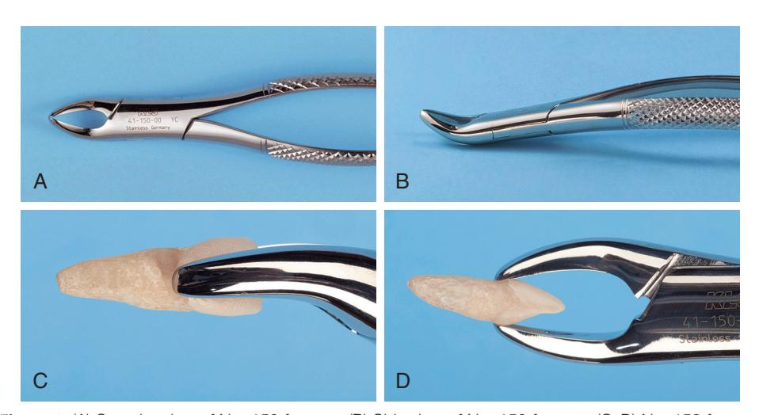

Fig. 7.43 (A) Superior view of No. 150 forceps. (B) Side view of No. 150 forceps. (C–D) No. 150 forceps adapted to the maxillary central incisor.

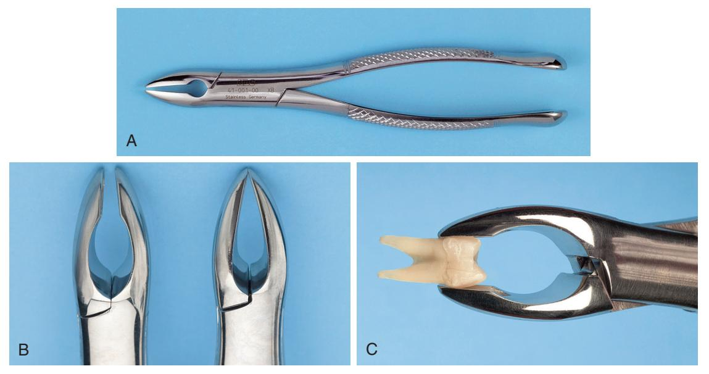

Fig. 7.44 (A) Superior view of No. 150A forceps. (B) No. 150A forceps have parallel beaks that do not touch, in contrast to the No. 150 forceps. (C) Adaptation of No. 150A forceps to the maxillary premolar.

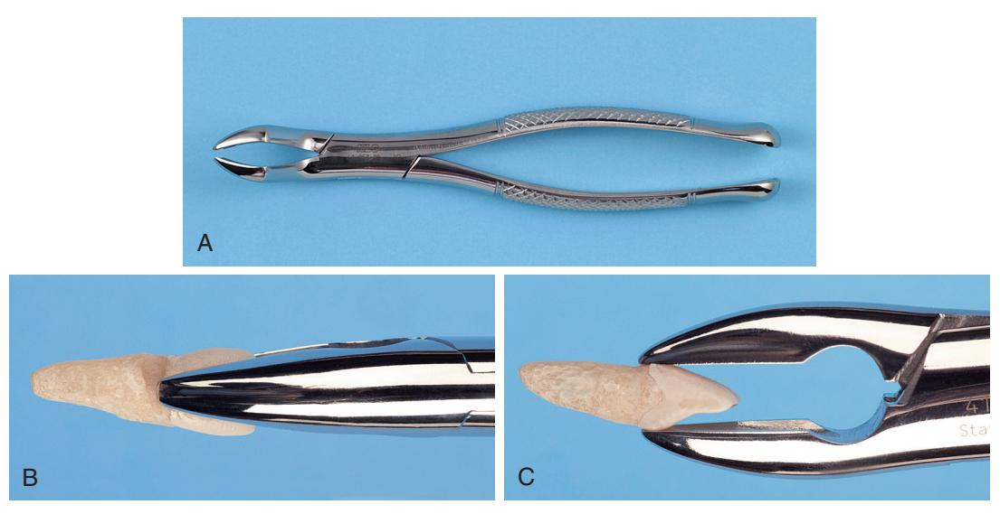

Fig. 7.45 (A) Superior view of No. 1 forceps. (B-C) No. 1 forceps adapted to the incisor.

A smaller version of the No. 150 forceps, the No. 150S forceps, is useful for removing primary teeth (Fig. 7.50). These forceps adapt well to all maxillary primary teeth and can be used as universal primary tooth forceps.

#### Mandibular Forceps

Extraction of mandibular teeth requires forceps that can be used for single-rooted teeth for the incisors, canines, and premolars as well as for two-rooted teeth for the molars. The forceps most commonly used for the single-rooted teeth are the lower universal forceps, or the No. 151 forceps (Fig. 7.51). These forceps have handles similar in shape to the No. 150 forceps, but the beaks are pointed inferiorly for lower teeth. The beaks are smooth and narrow and meet only at the tip. This allows the beak to fit near the cervical line of the tooth to grasp the root.

The No. 151A forceps have been modified slightly for mandibular premolar teeth (Fig. 7.52). These forceps should not be used for other lower teeth because their form prevents adaptation to the roots of teeth.

The English style of vertical-hinge forceps can be used for the single-rooted teeth in the mandible (Fig. 7.53). Great force can be generated with these forceps. Unless great care is exercised, the incidence of root fracture is higher with this instrument.

Mandibular molars are bifurcated, two-rooted teeth that allow the use of forceps that anatomically adapt to the tooth. Because the bifurcation is on the buccal and the lingual sides, only

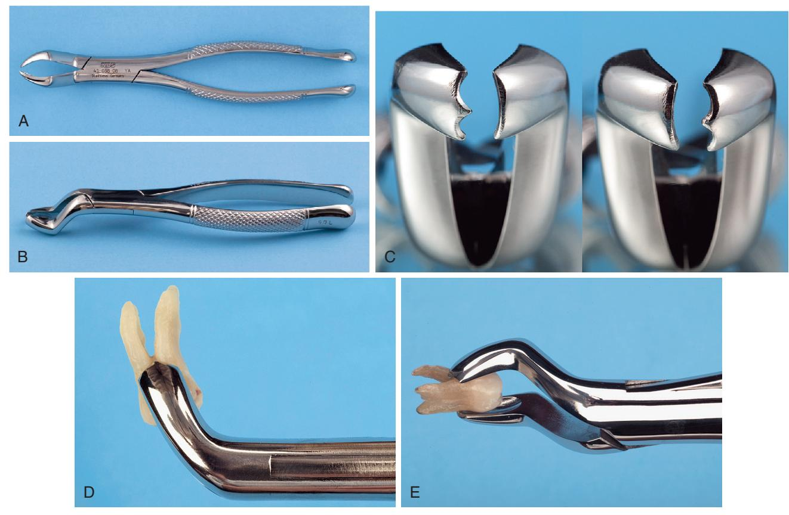

Fig. 7.46 (A) Superior view of No. 53L forceps. (B) Oblique view of No. 53L forceps. (C) *Right*, No. 53L; *left*, No. 53R. (D–E) No. 53L forceps adapted to the maxillary molar.

Fig. 7.47 (A) Superior view of No. 88L forceps. (B) Side view of No. 88L forceps. (C) No. 88R forceps adapted to the maxillary molar.

Fig. 7.48 (A) Superior view of No. 210S forceps. (B) Side view of No. 210S forceps. (C) No. 210S forceps adapted to the maxillary molar.

Fig. 7.49 (A) Superior view of No. 65 forceps. (B) Side view of No. 65 forceps. (C) No. 65 forceps adapted to a broken root.

**Fig. 7.50** The No. 150S forceps *(bottom)* are a smaller version of the No. 150 forceps *(top)* and are used for primary teeth.

single-molar forceps are necessary for the both sides, in contradistinc-tion to the maxilla, for which a right- and left-paired molar forceps set is required.

Useful lower molar forceps are the No. 17 forceps (Fig. 7.54). These forceps are usually straight-handled, and the beaks are set obliquely downward. The beaks have pointed tips in the center to

be set into the bifurcation of lower molar teeth. The remainder of the beak adapts well to the sides of the furcation. Because of the pointed tips, the No. 17 forceps cannot be used for molar teeth, which have fused, conical roots. For this purpose, the No. 151 forceps are used.

A major design variation in lower molar forceps is the No. 87, the so-called *cowhorn forceps* (Fig. 7.55). These instruments are designed with two pointed, heavy beaks that enter the bifurcation of lower molars. After the forceps are seated in the correct position, usually while gently pumping the handles up and down, the tooth is actually elevated by squeezing the handles of the forceps together tightly. As the beaks are squeezed into the bifurcation, they use the buccal and lingual cortical plates as fulcrums and the tooth can be literally squeezed out of the socket. As with the English style of forceps, improper use of the cowhorn forceps can result in an increase in the incidence of untoward effects such as fractures of alveolar bone or damage to maxillary teeth if the forceps are not properly controlled by the surgeon as the molar exits the socket. The beginning surgeon should therefore use the cowhorn forceps with caution.

The No. 151 forceps are also adapted for primary teeth. No. 151S forceps are the same general design as the No. 151 forceps but are scaled down to adapt to primary teeth. These forceps are adequate for the removal of all primary mandibular teeth (Fig. 7.56).

## Instrument Tray Systems

Many dentists find it practical to use the tray method to assemble instruments that will be used for specific types of procedures. Standard sets of instruments are packaged together, sterilized, and then unwrapped at surgery. The typical basic extraction pack includes a local anesthesia syringe, a needle, a local anesthesia cartridge, a No. 9 periosteal elevator, a periapical curette, small and large straight elevators, a pair of college pliers, a curved hemostat, a towel clip, an Austin or Minnesota retractor, a suction tip, and  $2 \times 2$  inch or  $4 \times 4$  inch gauze (Fig. 7.57). The required forceps would be added to this tray after it was opened.

A tray used for surgical extractions would include the items from the basic extraction tray plus needle holder and suture, suture scissors, blade handle and blade, Adson tissue forceps, bone file, tongue retractor, Cryer elevators, rongeur, and handpiece and burr (Fig. 7.58). These instruments permit incision and reflection of soft tissue, removal of bone, sectioning of teeth, retrieval of roots, debridement of the wound, and suturing of the soft tissue.

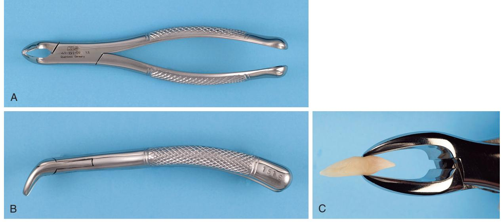

Fig. 7.51 (A) Superior view of No. 151 forceps. (B) Side view of No. 151 forceps. (C) No. 151 forceps adapted to the mandibular incisor.

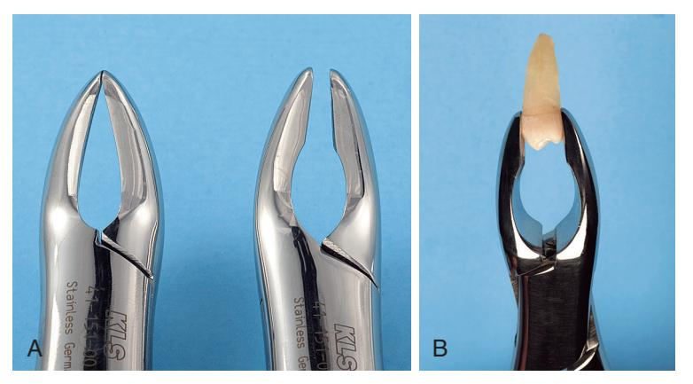

**Fig. 7.52** (A) The No. 151A forceps have beaks that are parallel and do not adapt well to the roots of most teeth, in contrast to the beaks of the No. 151 forceps. (B) No. 151A forceps adapted to a lower premolar tooth. The lack of close adaptation of the tips of the beaks to the root of the tooth is shown.

Fig. 7.53 (A) Side view of the English style of forceps. (B) Forceps adapted to the lower premolar.

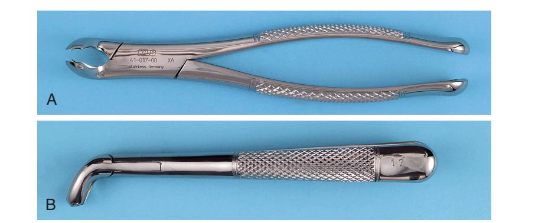

Fig. 7.54 (A) Superior view of No. 17 molar forceps. (B) Side view of No. 17 molar forceps. (C–D) No. 17 forceps adapted to the lower molar.

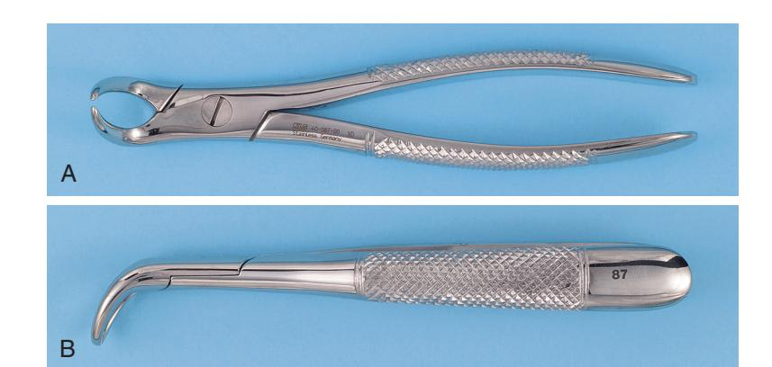

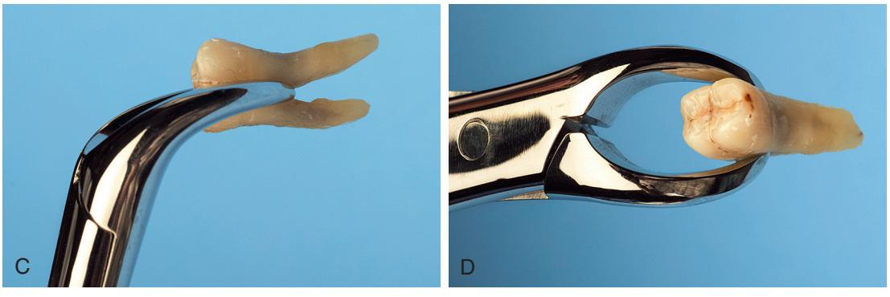

Fig. 7.55 (A) Superior view of cowhorn No. 87 forceps. (B) Side view of cowhorn forceps. (C–D) Cowhorn forceps adapted to the lower molar tooth.

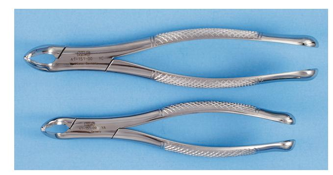

Fig. 7.56 The No. 151S forceps (bottom) are a smaller version of the No. 151 forceps (top) and are used to extract primary teeth.

Fig. 7.57 Basic extraction tray.

Fig. 7.58 The surgical extraction tray includes the necessary instrumentation to reflect soft tissue flaps, remove bone, section teeth, retrieve roots, and suture flaps back into position.

Fig. 7.59 The biopsy tray includes equipment necessary to remove a soft tissue specimen and suture wounds closed.

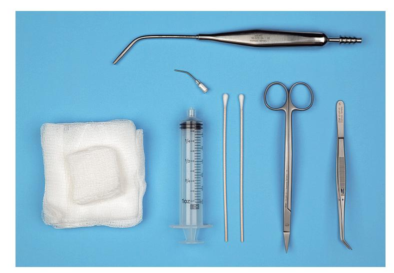

Fig. 7.60 The postoperative tray includes instruments necessary to remove sutures and irrigate the mouth.

The biopsy tray includes the basic tray (minus elevators), blade handle and blade, needle holder and suture, suture scissors, tissue scissors, Allis tissue forceps, Adson tissue forceps, and a curved hemostat (Fig. 7.59). These instruments permit incision and dissection of a soft tissue specimen and closure of the wound with sutures.

The postoperative tray has the necessary instruments to irrigate the surgical site and remove sutures (Fig. 7.60). The tray usually includes scissors, college pliers, irrigation syringe, cotton applicator sticks, gauze, and suction tip. The instruments may be placed on a flat tray, wrapped with sterilization paper, and sterilized. When ready for use, the tray is taken to the operatory and opened in such a manner as to preserve instrument sterility, and the instruments are used from the tray. This system requires a large autoclave to accommodate the tray.

Alternatively, metal cassettes can be used instead of a tray. Cassettes are more compact but must also be wrapped in sterilization paper.