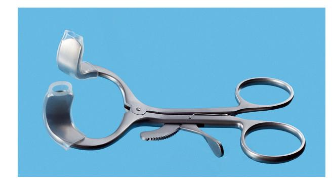

# 7 Instrumentation for Basic Oral Surgery

**JAMES R. HUPP**

## Introduction

This guide introduces common instrumentation for routine dental extractions and basic oral surgical operations, describing instruments for soft and hard tissue procedures.

## Incising Tissue

The primary instrument for making incisions is the **scalpel**, which consists of a handle and a sterile blade. While single-use scalpels with plastic handles exist, reusable handles with disposable blades are common.

*   **Scalpel Handle:** The **No. 3 handle** is most commonly used for oral surgery.
*   **Scalpel Blades:**
    *   **No. 15 blade:** Most frequently used intraorally for incisions around teeth and through soft tissue.
    *   **No. 11 blade:** A sharp-pointed blade used for small stab incisions, such as for draining an abscess.
    *   **No. 12 blade:** A hooked blade useful for mucogingival procedures, especially on posterior aspects of teeth or the maxillary tuberosity.

**Fig. 7.1** A scalpel is composed of a handle and a sharp blade. *Top*, Reusable scalpel No. 3 handle with single-use blade (a No. 15 blade is most commonly used for oral surgery). *Bottom*, Single-use handle-blade unit with No. 15 blade.

**Fig. 7.2** Scalpel blades used in oral surgery include No. 10, No. 11, No. 12, and No. 15 (left to right).

### Technique for Incision and Blade Handling

*   **Loading/Unloading Blades:**
    1.  Grasp the blade with a needle holder along its unsharpened, reinforced edge.
    2.  Hold the handle with the male fitting facing upward.
    3.  Slide the blade onto the handle until it clicks into position.
    4.  To remove, use the needle holder to grasp the end of the blade nearest the handle, lift to disengage, and slide it off away from yourself and others.
    5.  Discard the used blade immediately into a sharps container.

*   **Incision Technique:**
    *   Hold the scalpel in a **pen grasp** for maximum control.
    *   Keep mobile tissue under tension for efficient cutting.
    *   For a full-thickness mucoperiosteal flap, press the blade firmly to cut through both mucosa and periosteum in a single stroke.

> Scalpel blades are designed for single-patient use. They dull easily upon contact with hard tissue or repeated strokes through keratinized tissue. Additional blades may be necessary for multiple full-thickness mucoperiosteal incisions. Dull blades compromise incision quality and should be replaced.

**Fig. 7.3** (A) When loading a scalpel blade, the surgeon holds the noncutting portion of the blade in the needle holder and handle, with the male portion of the fitting pointing upward. (B) The surgeon then slides the blade into the handle until it clicks into place. (C) To remove the blade, the surgeon uses the needle holder to grasp the end of the blade next to the handle and lifts it to disengage it from the fitting. (D) The surgeon then gently slides the blade off the handle away from the body and anyone nearby.

**Fig. 7.4** The scalpel handle is held in the pen grasp to allow maximal control.

## Elevating the Mucoperiosteum

The goal is to reflect the full thickness of the mucosa and periosteum from the underlying bone as a single layer.

*   **Instrument:** The **No. 9 Molt periosteal elevator** is most common.
    *   **Sharp, pointed end:** Used to begin periosteal reflection and to reflect dental papillae.
    *   **Broad, rounded end:** Used to continue the elevation of the periosteum from the bone.
*   **Methods of Use:**
    1.  **Twisting/prying motion:** Elevates soft tissue like dental papillae.
    2.  **Push stroke:** The side of the blade is slid underneath the periosteum to separate it cleanly from the bone.

**Fig. 7.5** The No. 9 Molt periosteal elevator is most commonly used in oral surgery.

## Retracting Soft Tissue

Retractors provide access and visibility while protecting soft tissue from injury.

*   **Cheek Retractors:**
    *   **Austin retractor:** A right-angle retractor.
    *   **Minnesota retractor:** A broad, offset retractor.
    *   Both can retract the cheek and a mucoperiosteal flap simultaneously.
*   **Other Oral Soft Tissue Retractors:**
    *   **Henahan and Seldin retractors:** Broader instruments with smooth leading edges.
    *   **No. 9 Molt periosteal elevator:** Can be used to retract small flaps.
*   **Tongue Retractors:**
    *   **Mouth mirror:** Commonly used for tongue retraction in routine extractions.
    *   **Weider tongue retractor:** Broad, heart-shaped, and serrated on one side for a firm grip.
        > Care must be taken not to position it too far posteriorly to avoid gagging or pushing the tongue into the oropharynx.
    *   **Towel clip:** Provides positive control of the tongue, such as for a biopsy on its posterior aspect.
        > Profound local anesthesia is required where the clip is placed. It is wise to mention this method of retraction to the patient if anticipated.

**Fig. 7.6** The Austin retractor is a right-angle retractor that can be used to retract the cheek, tongue, or flaps.

**Fig. 7.7** The Minnesota retractor is an offset retractor used to retract the cheek and flaps. (A) Front. (B) Back.

**Fig. 7.8** The Henahan (top) and Seldin (bottom) retractors are broader instruments that provide broader retraction and increased visualization.

**Fig. 7.9** (A) The Weider retractor is a large retractor designed to retract the tongue. The serrated surface helps engage the tongue so that it can be held securely. (B) The Weider retractor is used to hold the tongue away from the surgical field. The Austin retractor is used to retract the cheek.

## Grasping Soft Tissue

*   **Adson forceps (pickup):** Delicate forceps, with or without teeth, used to gently stabilize tissue during suturing or dissection.
    > Care should be taken not to grasp tissue too tightly to avoid crushing it. Toothed forceps allow a secure hold with a more delicate grip.
*   **Stillies forceps:** Longer (7-9 inches) pickups for grasping tissue in the posterior mouth.
*   **College (cotton) forceps:** Angled forceps for picking up small, loose fragments (e.g., tooth, amalgam) or placing gauze.
*   **Allis tissue forceps:** Locking forceps with teeth that firmly grip tissue to be excised (e.g., during a biopsy).
    > Should never be used on tissue that is to be left in the mouth because they cause a relatively large amount of tissue crushing.

**Fig. 7.10** (A) Small, delicate Adson tissue forceps are used to gently stabilize soft tissue for suturing or dissection. (B) The Stillies pickup (top) is longer than the Adson pickup and is used to handle tissue in the more posterior aspect of the mouth. The college pliers (bottom) are angled forceps that are used for picking up small objects in the mouth or from the tray stand. The college pliers shown here represent the locking version.

**Fig. 7.11** (A) Allis tissue forceps are useful for grasping and holding tissue that will be excised. (B) Allis forceps are held in the same fashion as the needle holder. (C) Comparison of Adson beaks (right) with Allis beaks (left) shows the differences in their designs and uses.

## Controlling Hemorrhage

While direct pressure is usually sufficient for dentoalveolar surgery, a hemostat is used for bleeding from larger vessels.

*   **Hemostat:** Features long, delicate beaks and a locking handle. The curved hemostat is most common.
    *   **Function:** Clamps a vessel to allow for suturing or cauterization.
    *   **Other Uses:** Removing granulation tissue from sockets and picking up small root tips, calculus, or amalgam fragments.
    > A hemostat should never be used to suture.

**Fig. 7.12** (A) Superior view of the hemostat used for oral surgery. (B) Oblique view of the curved hemostat. Straight hemostats are also available.

## Removing Bone

### Rongeurs

Rongeurs are the most common instrument for bone removal in dentoalveolar surgery.

*   **Mechanism:** Sharp blades on forceps that cut or pinch through bone. A rebound mechanism automatically reopens the instrument.
*   **Design:** Side-cutting or side- and end-cutting (Blumenthal rongeurs are preferred).
*   **Use:** Efficiently removes bone and trims sharp edges.
    > Do not use to remove large amounts of bone in single bites; remove smaller amounts in multiple bites.
    > Never use to remove teeth, as this will quickly dull and destroy the instrument and risks losing a tooth in the patient's throat.

**Fig. 7.13** (A) Rongeurs are bone-cutting forceps that have spring-loaded handles. (B) Blumenthal rongeurs comprise both end- and side-cutting blades. They are preferred for oral surgery procedures.

### Burr and Handpiece

This method is commonly used for the surgical removal of teeth.

*   **Equipment:** A moderate-speed, high-torque, sterilizable handpiece with sharp carbide burrs (e.g., No. 557, No. 703 fissure burr, or No. 8 round burr).
*   **Requirements:**
    > Handpiece must be **completely sterilizable**.
    > Must have high speed and torque for efficient bone removal and tooth sectioning.
    > Handpiece **must not exhaust air into the operative field** to avoid tissue emphysema.

**Fig. 7.14** Typical moderate-speed high-torque sterilizable handpiece with No. 703 burr.

### Mallet and Chisel

Occasionally used for removing bone, such as lingual tori.

> The chisel edge must be kept sharp for effective function.

**Fig. 7.15** The surgical mallet and chisel can be used for removing bone.

### Bone File

Used for the final smoothing of bone before completing surgery.

*   **Design:** Usually double-ended with small and large ends.
*   **Technique:**
    > The teeth of most bone files are arranged to remove bone only on a **pull stroke**.
    > Pushing this type of bone file against bone should be avoided, as it results only in burnishing and crushing the bone.

**Fig. 7.16** (A) The double-ended bone file is used for smoothing small, sharp edges or spicules of bone. (B) The teeth of this bone file are effective only in the pull stroke.

## Removing Soft Tissue From Bony Cavities

*   **Curette:** An angled, double-ended, spoon-shaped instrument used to remove soft tissue like granulomas or small cysts from bony defects and debride tooth sockets.
    > The periapical curette is distinctly different in design and function from the periodontal curette.

**Fig. 7.17** The periapical curette is a double-ended, spoon-shaped instru-ment used to remove soft tissue from bony cavities.

## Suturing Soft Tissue

After a procedure, the mucoperiosteal flap is repositioned and secured with sutures.

### Needle Holder

The needle holder is the instrument used to place sutures.

*   **Features:** A 7-inch (15-cm) needle holder is typical. It has a locking handle and short, blunt beaks that are stronger than a hemostat's. The face of the beak is **cross-hatched** for a positive grip on the suture needle.
    > A hemostat is not an instrument used for suturing.
*   **Proper Hold:**
    *   Thumb and ring finger are placed through the rings.
    *   The index finger is held along the length to steady and direct the instrument.
    > The index finger should not be put through the finger ring, as this dramatically decreases control.

**Fig. 7.18** A needle holder has a locking handle and a short, blunt beak.

**Fig. 7.19** (A) The hemostat (top) has a longer, thinner beak compared with the needle holder (bottom) and therefore should not be used for suturing. (B) The face of the shorter beak of the needle holder is cross-hatched to ensure a positive grip on the needle (left). The face of the hemostat has parallel grooves that do not allow a firm grip on the needle (right).

**Fig. 7.20** The needle holder is held by using the thumb and ring finger in rings (A) and the first and second fingers to control the instrument (B).

### Suture Needle

*   **Shape:** Usually a small half-circle or three-eighths-circle curve.
*   **Tips:**
    *   **Tapered:** For delicate tissues.
    *   **Triangular (cutting):** Passes through mucoperiosteum more readily.
        > Care must be taken with cutting needles because, if not used correctly, they can cut through tissue lateral to the track.
*   **Attachment:** Suture material is typically purchased already **swaged on** (fused) to the needle.
*   **Holding:** Grasp the needle approximately **two-thirds of the distance** from the tip to the base to provide sufficient length for passage while holding the strongest part of the needle.

**Fig. 7.21** (A) Comparison of needles used in oral surgery. *Top*, C-17 needle, which usually holds a size 4-0 suture. *Middle*, PS-2 needle. *Bottom*, SH. All are cutting needles, and the suture material is swaged onto the needle. (B) The tip of the needle used to suture mucoperiosteum is triangular in cross section to make it a cutting needle.

**Fig. 7.22** The needle holder grasps the curved needle two-thirds of the distance from the tip of the needle.

### Suture Material

Suture material is classified by its diameter, resorbability, and filament structure.

*   **Diameter (Size):** Designated by zeros (e.g., 3-0). **3-0** is most common for oral mucosa. Smaller sizes (4-0, 5-0) are used for finer work.
*   **Resorbability:**
    *   **Nonresorbable:** **Silk** is most common. Others include nylon and vinyl.
    *   **Resorbable:**
        *   **Gut (catgut):** **Plain gut** resorbs in 3-5 days; **chromic gut** lasts 7-10 days.
        *   **Synthetic:** Polyglycolic acid and polylactic acid are slowly resorbed over weeks.
*   **Filament Structure:**
    *   **Monofilament** (e.g., gut, nylon): Stiffer, harder to tie, but do not wick bacteria.
    *   **Polyfilament** (braided, e.g., silk, polyglycolic acid): Easier to handle and tie, but can wick oral fluids.
*   **Commonly Used:** **3-0 black silk** is a common choice due to its strength, ease of use, and visibility for removal. Many surgeons prefer 3-0 chromic gut to avoid a removal appointment.

### Scissors

*   **Suture scissors (e.g., Dean scissors):** Have short cutting edges specifically for cutting sutures.
*   **Soft Tissue scissors (e.g., Iris or Metzenbaum scissors):** Designed for cutting and undermining soft tissue.
    > Tissue scissors (e.g., iris, Metzenbaum) should not be used to cut sutures, as suture material will dull the blades, making them less effective and more traumatic for cutting tissue.

**Fig. 7.23** Suture scissors should be held in the same fashion as the needle holder.

**Fig. 7.24** Soft tissue scissors are of two designs: Iris scissors (top) are small, sharp-pointed scissors. Metzenbaum scissors (bottom) are longer, more delicate scissors. Metzenbaum scissors are available as either sharp tipped (shown here) or blunt tipped.

## Holding the Mouth Open

*   **Bite block:** A soft rubber block the patient rests their teeth on to support the mandible and reduce stress on the temporomandibular joint (TMJ).
*   **Side-action mouth prop (Molt mouth prop):** A ratchet-type instrument that can open the mouth wider. Useful for sedated patients or those with mild trismus.
    > Must be used with caution, as great pressure can be applied to teeth and TMJ, risking injury.
*   **General Precautions:**
    > Avoid opening the patient's mouth too much to prevent TMJ stress or stretch injury.
    > For long procedures, remove the prop periodically to allow jaw movement and muscle rest.

**Fig. 7.25** (A) The bite block is used to hold the patient's mouth open in the position chosen by the patient. (B) The sides of the bite block are corrugated to provide a surface for teeth to engage. (C) The blocks come in a variety of sizes.

**Fig. 7.26** The side-action, or Molt, mouth prop can be used to open the patient's mouth when the patient is unable to cooperate, such as during sedation or in the presence of some degree of trismus.

## Removing Fluids

*   **Surgical suction:** Features a smaller orifice than general dentistry suction to rapidly evacuate fluids (blood, saliva, irrigation) and maintain visibility.
*   **Fraser suction:** Has a hole in the handle that can be covered to control suction power.
    *   **Covered hole:** Increases suction for rapid fluid removal.
    *   **Uncovered hole:** Reduces suction to prevent soft tissue injury or obstruction.

**Fig. 7.27** (A) The typical surgical suction has a small-diameter tip. Suction tips usually have a hole to prevent tissue injury caused by excessive suction pressure. *Top*, Unassembled for cleaning. *Bottom*, Assembled for use. (B) The Fraser suction tip has a blade in the handle to allow the operator more control over the amount of suction power. Holding the thumb over the hole increases suction at the tip. A wire stylet is used to clean the tip when bone or tooth particles plug the suction.

## Holding Towels and Drapes in Position

*   **Towel clip:** A locking instrument used to secure surgical drapes. Tips can be sharp (penetrating) or blunt (nonpenetrating).
    > Operator must exercise extreme caution not to pinch the patient's underlying skin.

**Fig. 7.28** The towel clip is used to hold the drape in position. The tips clasp the towels, and the locking handles maintain the drape in position. The clip shown has nonpenetrating blunt tips. Towel clamps with sharp penetrating tips are also available.

## Irrigating

Irrigation with sterile saline or water is essential when using a handpiece and burr.

*   **Benefits:** Cools the burr to prevent heat damage to bone and increases efficiency by washing away debris.
*   **Post-procedure:** The surgical field should be thoroughly irrigated before suturing.
*   **Instrument:** A large plastic syringe with a blunt, angled 18-gauge needle.

**Fig. 7.29** Large plastic syringes with an angled blunt tip may be used to deliver the irrigation solution to the operative site.

## Extracting Teeth

### Dental Elevators

Elevators are used to luxate (loosen) teeth from the surrounding bone, making forceps extraction easier and safer. They can also be used to expand alveolar bone and remove broken or sectioned roots.

*   **Components:**
    *   **Handle:** Large enough for a comfortable grip and controlled force application.
        > **Crossbar or T-bar handles** must be used with great caution as they can generate excessive force, risking fracture of teeth and bones.
    *   **Shank:** Connects the handle to the blade.
    *   **Blade:** The working tip that transmits force to the tooth or bone.

**Fig. 7.30** The major components of an elevator are the handle, shank, and blade.

**Fig. 7.31** A crossbar handle is used on certain elevators. This type of handle can generate large amounts of force and therefore must be used with great caution.

#### Types of Elevators

1.  **Straight Type:** Most commonly used to luxate teeth. The blade is concave on its working side.
    *   **Small straight (No. 301):** Used to begin luxation before forceps application.
    *   **Larger straights (No. 34S, 46, 77R):** Used for displacing roots or widely spaced teeth.
2.  **Triangular Type (Cryer or *east-west* elevators):** Provided in left/right pairs. Most useful when a broken root remains in a socket adjacent to an empty socket (e.g., a fractured mandibular first molar).
3.  **Pick Type:** Used to remove roots.
    *   **Crane pick (heavy):** A heavy version used as a lever. Often requires drilling a 3mm "purchase point" into the root for the tip to engage.
    *   **Root-tip pick (delicate):** A fine instrument used to tease small root tips from their sockets by working it into the periodontal ligament space.
        > This is a thin instrument and should not be used as a wheel-and-axle or lever type of elevator (like Cryer or Crane).

**Fig. 7.32** (A) Straight elevators are the most commonly used type. (B–C) The blade of the straight elevator is concave on its working side.

**Fig. 7.33** Straight elevators vary in size depending on the width of the blade.

**Fig. 7.34** Triangular elevators (Cryer) are pairs of instruments and are therefore used for mesial or distal roots.

**Fig. 7.35** The Crane pick is a heavy instrument used to elevate whole roots or even teeth after the purchase point has been prepared with a burr.

**Fig. 7.36** The delicate root-tip pick is used to tease root tip fragments from the socket. The fine tip can be broken off or bent if the instrument is used improperly.

### Periotomes

Periotomes are used to extract teeth while preserving the anatomy of the tooth socket.

*   **Principle:** They sever the periodontal ligaments to facilitate tooth removal.
*   **Clinical Protocol:**
    1.  Insert the blade tip into the periodontal ligament space.
    2.  Advance apically 2 to 3 mm along the long axis of the tooth.
    3.  Remove and reinsert at an adjacent site, gradually working around the tooth.
    4.  Once the ligaments are sufficiently severed, remove the tooth with an elevator or forceps.
    > Take care to avoid excessive expansion or fracture of bone.

**Fig. 7.37** A periotome with a handle and exchangeable blades. Other types of periotomes have fixed blades or are connected to a motor.

### Extraction Forceps

Forceps are designed to remove a tooth from alveolar bone. Ideally, they lift an already luxated tooth rather than pull it.

#### Forceps Components

*   **Handles:** Sized for a comfortable grip with a serrated surface to prevent slippage.
    *   **Maxillary forceps:** Held with palm underneath, directing beaks superiorly.
    *   **Mandibular forceps:** Held with palm on top, directing beaks inferiorly.
*   **Hinge:** Connects handles to the beak. **American type** has a horizontal hinge; **English type** has a vertical hinge.
*   **Beaks:** The source of greatest variation, designed to adapt to the tooth root near the crown-root junction. Proper beak adaptation to root anatomy is crucial for efficient extraction and to minimize fractures.

**Fig. 7.38** Basic components of extraction forceps.

**Fig. 7.39** Forceps used to remove maxillary teeth are held with the palm under the handle.

**Fig. 7.40** (A) Forceps used to remove mandibular teeth are held with the palm on top of forceps. (B) A firmer grip for delivering greater amounts of rotational force can be achieved by moving the thumb around and under the handle.

$\ensuremath{\textit{Fig. 7.41}}$ Straight handles are usually preferred, but curved handles are favored by some surgeons.

**Fig. 7.42** (A) English style of forceps have the hinge in the vertical direction. (B) English style of forceps are held in the vertical direction.

#### Maxillary Forceps

*   **Single-Rooted Teeth (Incisors, Canines, Premolars):**
    *   **No. 150 (Universal):** Slightly S-shaped; suitable for incisors and premolars.
    *   **No. 150A:** Modified specifically for maxillary premolars.
    *   **No. 1 (Straight):** Can be used for maxillary incisors and canines.
*   **Three-Rooted Teeth (Molars):**
    *   **No. 53 (Right and Left):** Has a pointed beak that fits into the buccal bifurcation and a smooth concave surface for the palatal root.
    *   **No. 88 (Right and Left):** Has a longer, more accentuated pointed beak, useful for severely carious molars but risks crushing bone if used incautiously.
    *   **No. 210S:** Has broad, smooth beaks, useful for second or third molars with a single conical root.
    *   **No. 65 (Root-tip forceps):** Very narrow beaks, primarily for broken maxillary molar roots.
*   **Primary Teeth:**
    *   **No. 150S:** A smaller version of the No. 150, serves as a universal forceps for all maxillary primary teeth.

**Fig. 7.43** (A) Superior view of No. 150 forceps. (B) Side view of No. 150 forceps. (C–D) No. 150 forceps adapted to the maxillary central incisor.

**Fig. 7.44** (A) Superior view of No. 150A forceps. (B) No. 150A forceps have parallel beaks that do not touch, in contrast to the No. 150 forceps. (C) Adaptation of No. 150A forceps to the maxillary premolar.

**Fig. 7.45** (A) Superior view of No. 1 forceps. (B-C) No. 1 forceps adapted to the incisor.

**Fig. 7.46** (A) Superior view of No. 53L forceps. (B) Oblique view of No. 53L forceps. (C) *Right*, No. 53L; *left*, No. 53R. (D–E) No. 53L forceps adapted to the maxillary molar.

**Fig. 7.47** (A) Superior view of No. 88L forceps. (B) Side view of No. 88L forceps. (C) No. 88R forceps adapted to the maxillary molar.

**Fig. 7.48** (A) Superior view of No. 210S forceps. (B) Side view of No. 210S forceps. (C) No. 210S forceps adapted to the maxillary molar.

**Fig. 7.49** (A) Superior view of No. 65 forceps. (B) Side view of No. 65 forceps. (C) No. 65 forceps adapted to a broken root.

**Fig. 7.50** The No. 150S forceps *(bottom)* are a smaller version of the No. 150 forceps *(top)* and are used for primary teeth.

#### Mandibular Forceps

*   **Single-Rooted Teeth (Incisors, Canines, Premolars):**
    *   **No. 151 (Universal):** Smooth, narrow beaks meet at the tip.
    *   **No. 151A:** Modified specifically for mandibular premolars.
    *   **English style (vertical-hinge):** Can be used, but may generate great force.
*   **Two-Rooted Teeth (Molars):**
    *   **No. 17:** Has pointed tips on both beaks to engage the buccal and lingual bifurcation. Not for fused-root molars.
    *   **No. 87 ("Cowhorn"):** Two pointed, heavy beaks that enter the bifurcation. Squeezing the handles elevates the tooth.
        > Improper use can increase incidence of untoward effects such as alveolar bone fractures or damage to maxillary teeth if not properly controlled. Beginning surgeons should use with caution.
*   **Primary Teeth:**
    *   **No. 151S:** A smaller version of the No. 151, adequate for all primary mandibular teeth.

**Fig. 7.51** (A) Superior view of No. 151 forceps. (B) Side view of No. 151 forceps. (C) No. 151 forceps adapted to the mandibular incisor.

**Fig. 7.52** (A) The No. 151A forceps have beaks that are parallel and do not adapt well to the roots of most teeth, in contrast to the beaks of the No. 151 forceps. (B) No. 151A forceps adapted to a lower premolar tooth. The lack of close adaptation of the tips of the beaks to the root of the tooth is shown.

**Fig. 7.53** (A) Side view of the English style of forceps. (B) Forceps adapted to the lower premolar.

**Fig. 7.54** (A) Superior view of No. 17 molar forceps. (B) Side view of No. 17 molar forceps. (C–D) No. 17 forceps adapted to the lower molar.

**Fig. 7.55** (A) Superior view of cowhorn No. 87 forceps. (B) Side view of cowhorn forceps. (C–D) Cowhorn forceps adapted to the lower molar tooth.

**Fig. 7.56** The No. 151S forceps (bottom) are a smaller version of the No. 151 forceps (top) and are used to extract primary teeth.

## Instrument Tray Systems

Instruments are often organized in pre-sterilized tray systems or cassettes for specific procedures.

*   **Basic Extraction Pack:** Includes anesthesia setup, periosteal elevator, curette, straight elevators, college pliers, hemostat, retractor, suction tip, gauze, and a towel clip. Forceps are added as needed.
*   **Surgical Extraction Tray:** Includes all items from the basic tray, plus a scalpel, needle holder, suture, scissors, Adson forceps, bone file, rongeur, handpiece/burr, Cryer elevators, and a tongue retractor.
*   **Biopsy Tray:** Includes a basic setup (minus elevators) plus a scalpel, needle holder, suture, tissue scissors, Allis forceps, and Adson forceps.
*   **Postoperative Tray:** Includes scissors, college pliers, irrigation syringe, gauze, and a suction tip for irrigation and suture removal.

**Fig. 7.57** Basic extraction tray.

**Fig. 7.58** The surgical extraction tray includes the necessary instrumentation to reflect soft tissue flaps, remove bone, section teeth, retrieve roots, and suture flaps back into position.

**Fig. 7.59** The biopsy tray includes equipment necessary to remove a soft tissue specimen and suture wounds closed.

**Fig. 7.60** The postoperative tray includes instruments necessary to remove sutures and irrigate the mouth.