# 8 Principles of Routine Exodontia

JAMES R. HUPP

## CHAPTER OUTLINE

#### Presurgical Medical Assessment, 106

#### Indications for Removal of Teeth, 107

Caries, 107 Pulpal Necrosis, 107 Periodontal Disease, 107 Orthodontic Reasons, 107 Malpositioned Teeth, 107 Cracked Teeth, 107 Impacted Teeth, 107 Supernumerary Teeth, 107 Teeth Associated With Pathologic Lesions, 107 Radiation Therapy, 107 Teeth Involved in Jaw Fractures, 107 Financial Issues, 108

Contraindications for Removal of Teeth, 108 Local Contraindications, 108

Clinical Evaluation of Teeth for Removal, 108 Access to the Tooth, 108 Mobility of the Tooth, 108 Condition of the Crown, 108

Radiographic Examination of the Tooth for Removal, 109 Relationship to Vital Structures, 110 Configuration of Roots, 110 Condition of Surrounding Bone, 112 Patient and Surgeon Preparation, 112 Chair Position for Extractions, 113 Mechanical Principles Involved in Tooth Extraction, 116 Principles of Elevator and Forceps Use, 119 Procedure for Closed Extraction, 121 Role of the Opposite Hand, 123 Role of the Assistant During Extraction, 124 Specific Techniques for the Removal of Each Tooth, 124 Maxillary Teeth, 124 Incisors, 124 Canines, 125 First Premolar, 126 Second Premolar, 127 Molars, 127 Mandibular Teeth, 128 Anterior Teeth, 128 Premolars, 130 Molars, 130 Modifications for Extraction of Primary Teeth, 131

Postextraction Tooth Socket Care, 132

Each traction of a tooth combines the principles of surgery and elementary physical mechanics. When these principles are alveolar process, even by someone without great strength and without untoward force or sequelae. This chapter presents the principles of surgery and mechanics related to uncomplicated tooth extraction. In addition, there is a detailed description of techniques for removal of specific teeth with specific instruments. Because the crown is already "removed" from the bone in fully erupted teeth, a dental extraction focuses on root extraction. Following this concept prevents the surgeon from untoward focus on using force on the crowns to remove teeth. Ignoring this concept commonly leads to fracturing the crowns or roots of teeth or fracturing the bone around the roots.

Proper tooth removal does not require a large amount of strength; instead, when done properly, it is accomplished with finesse. Removal of an erupted tooth involves the use of controlled force so that the tooth is not pulled from bone, but instead is gently lifted from its socket. During preextraction planning, the degree of difficulty anticipated for removing a particular tooth is assessed. If that assessment leads the surgeon to believe that the degree of difficulty will be high or if initial attempts at tooth removal confirm this, a deliberate surgical approach—not an application of excessive force—should be taken. Excessive force may injure local soft tissue and damage the surrounding bone and teeth. Such force may fracture the crown, usually making the extraction substantially more difficult than it would have been otherwise. Moreover, excessive force and haste during an extraction heightens intraoperative and postoperative patient discomfort and anxiety.

## **Presurgical Medical Assessment**

When conducting the preoperative patient evaluation, it is critical that the surgeon examine the patient's medical status. Patients can have a variety of health problems that require treatment modification or medical management before the surgery can be safely performed. Special measures may be needed to control bleeding, lessen the chance of infection, or prevent a medical emergency. This information is discussed in detail in Chapter 1, which includes information regarding the specifics of altering surgical treatment for medical management reasons.

## **Indications for Removal of Teeth**

Teeth are extracted for a variety of reasons. This section discusses a variety of general indications for removing teeth. These indications are only guidelines, not absolute rules.

#### Caries

Perhaps the most common and widely accepted reason to remove a tooth is that it is so severely carious that it cannot be restored. The extent to which the tooth is carious and is considered nonrestorable is a judgment call to be made between the dentist and the patient. Sometimes the complexity and cost required to salvage a severely carious tooth also makes extraction a reasonable choice. This is particularly true with the availability and success of reliable implant-supported prostheses.

## **Pulpal Necrosis**

A second, closely aligned rationale for removing a tooth is the presence of pulpal necrosis or irreversible pulpitis that is not amenable to endodontics. This may be the result of a patient declining endodontic treatment or when a tooth has a root canal that is tortuous, calcified, and untreatable by standard endodontic techniques. Also included in this category of general indications is the case in which endodontic treatment has been done but has failed to relieve pain or provide drainage, and the patient does not desire retreatment.

## **Periodontal Disease**

A common reason for tooth removal is severe and extensive periodontal disease. If severe adult periodontitis has existed for some time, excessive bone loss and irreversible tooth mobility will be found. In these situations, the hypermobile teeth should be extracted. Also, ongoing periodontal bone loss may jeopardize the chance for straightforward implant placement, making extraction a sensible step even before a tooth becomes moderately or severely mobile.

## **Orthodontic Reasons**

Patients who are about to undergo orthodontic correction of crowded dentition with insufficient arch length frequently require the extraction of teeth to provide space for tooth alignment. The most commonly extracted teeth are the maxillary and mandibular premolars, but a mandibular incisor may occasionally need to be extracted for this same reason. Great care should be taken to double-check that extraction is indeed necessary and that the correct tooth or teeth are removed if someone other than the surgeon doing the extraction has planned the extractions.

## **Malpositioned Teeth**

Teeth that are malposed or malpositioned may be indicated for removal in several situations. If they traumatize soft tissue and cannot be repositioned by orthodontic treatment, they should

be extracted. A common example of this is the maxillary third molar, which erupts in severe buccal version and causes ulceration and soft tissue trauma of the cheek. Another example is malpositioned teeth that are hypererupted because of the loss of teeth in the opposing arch. If prosthetic rehabilitation is to be carried out in the opposing arch, the hypererupted tooth may interfere with construction of an adequate prosthesis. In this situation, the malpositioned tooth should be considered for extraction.

## **Cracked Teeth**

An uncommon indication for extraction of teeth is a tooth with a cracked crown or a fractured root. The cracked tooth can be painful and be unmanageable by a more conservative technique. Cracked teeth have often already undergone endodontic therapy at some point in the past, which tends to make the crown and root more brittle and difficult to remove.

## **Impacted Teeth**

Impacted teeth should be considered for removal. If it is clear that a partially impacted tooth is unable to erupt into a functional occlusion because of inadequate space, interference from adjacent teeth, or some other reason, it should be considered for surgical removal. See Chapter 10 for a more thorough discussion of this topic.

## **Supernumerary Teeth**

Supernumerary teeth are usually impacted and should be removed. A supernumerary tooth may interfere with the eruption of succedaneous teeth and has the potential for causing their resorption and displacement.

## **Teeth Associated With Pathologic Lesions**

Teeth involved in pathologic lesions may require removal. This is often seen with odontogenic cysts. In some situations, the tooth or teeth can be retained and endodontic therapy performed. However, if maintaining the tooth compromises the complete surgical removal of the lesion when complete removal is critical, the tooth should be removed.

## **Radiation Therapy**

Patients who are to receive radiation therapy for oral, head, or neck cancer should consider removal of teeth that are in the beam of radiation therapy, particularly if the teeth are compromised in some manner. However, many of these teeth can be retained with proper care. See Chapter 19 for a more thorough discussion of the effects of radiation therapy on teeth and jaws.

## Teeth Involved in Jaw Fractures

Patients who sustain fractures of the mandible or the alveolar process sometimes must have teeth removed. In some situations, the tooth involved in the line of fracture can be maintained, but if the tooth is injured, infected, or severely luxated from the surrounding bony tissue or interferes with proper reduction and fixation of the fracture, its removal is usually indicated.

#### Financial Issues

A final indication for removal of a tooth relates to the financial status of the patient. All of the indications for extraction already mentioned may become stronger if the patient is unwilling or unable to financially support the decision to maintain the tooth. The inability of the patient to pay for the procedure may require that the tooth be removed. Also, implant dentistry is often more cost effective for a patient than maintaining a compromised tooth.

#### **Contraindications for Removal of Teeth**

Even if a given tooth meets one of the requirements for removal, in some situations, the tooth should not be removed because of other factors or contraindications to extraction. These factors, like the indications, are relative in their strength. In some situations, the contraindication can be modified by the use of additional care or treatment, and the indicated extraction can be performed. In other situations, however, the contraindication may be so significant that the tooth should not be removed without taking special precautions. In general, the contraindications are divided into two groups: systemic and local. Systemic contraindications to routine oral surgery are discussed in Chapter 1.

#### Local Contraindications

Several local contraindications to the extraction of teeth also exist. The most important and most critical is a history of therapeutic radiation for cancer. Extractions performed in an area of radiation may result in osteoradionecrosis, and therefore the extraction must be done with extreme caution. Chapter 19 discusses this in detail.

Teeth that are located within an area of tumor, especially a malignant tumor, should not be extracted. The surgical procedure for extraction could disseminate malignant cells, thereby seeding local metastases.

Patients who have severe pericoronitis around an impacted mandibular third molar should not have the tooth extracted until the pericoronitis has been treated. Nonsurgical treatment should include irrigations and removal of the maxillary third molar, if necessary, to relieve impingement on the edematous soft tissue overlying the mandibular impaction. Some clinicians will also administer antibiotics. If the mandibular third molar is removed in the face of severe pericoronitis, the incidence of complications increases. However, if the pericoronitis is mild and the tooth can be removed in a straightforward manner, then immediate extraction may be performed.

Finally, the acute dentoalveolar abscess must be mentioned. Many prospective studies have made it abundantly clear that the most rapid resolution of an infection resulting from pulpal necrosis is obtained when the tooth is removed as early as possible. Therefore acute infection is not a contraindication to extraction. However, it may be difficult to extract such a tooth because the patient may not be able to open the mouth sufficiently wide due to trismus, or it may be difficult to reach a state of profound local anesthesia. If access and anesthesia considerations can be met, the tooth should be removed as soon as possible. Otherwise, antibiotic therapy should be started and extraction planned as soon as possible.

## **Clinical Evaluation of Teeth for Removal**

In the preoperative assessment period, the tooth to be extracted should be examined carefully to assess the difficulty of the extraction.

A variety of factors must be specifically examined to make the appropriate assessment and treatment plan.

#### Access to the Tooth

The first factor to be examined in preoperative assessment is the extent to which the patient can open the mouth. Any limitation of opening may compromise the ability of the surgeon to give local anesthesia or perform a routine extraction. If the patient's opening is substantially compromised, the surgeon should consider a surgical approach to the tooth instead of a routine elevator and forceps extraction. This requires placing the patient under deep sedation or general anesthesia. In addition, the surgeon should look for the cause of the reduction of opening. The most likely causes are trismus associated with infection around the muscles of mastication, temporomandibular joint (TMJ) dysfunction, and muscle fibrosis.

The location and position of the tooth to be extracted within a dental arch should be examined. A properly aligned tooth has a normal access for placement of elevators and forceps. However, crowded or otherwise malposed teeth may present difficulty in positioning the usually used forceps onto the tooth for extraction. When access is a problem, a different forceps may be needed or a surgical approach may be indicated.

#### Mobility of the Tooth

The mobility of the tooth to be extracted should be assessed preoperatively. Greater-than-normal mobility is frequently seen with severe periodontal disease. If the teeth are excessively mobile, uncomplicated tooth removal should be expected, but soft tissue management after the extraction may be more involved (Fig. 8.1A).

Teeth that have less-than-normal mobility should be carefully assessed for the presence of hypercementosis or ankylosis of the roots. Ankylosis is often seen with primary molars that are retained and have become submerged (see Fig. 8.1B). In addition, ankylosis is seen occasionally in nonvital teeth that have had endodontic therapy many years before the extraction. If the clinician believes that the tooth is ankylosed, it is wise to plan for a surgical removal of the tooth as opposed to a forceps extraction. Hypercementosis can create bulbous roots that are more challenging to remove.

#### Condition of the Crown

The assessment of the crown of the tooth before the extraction should be related to the presence of large caries or restorations in the crown. If large portions of the crown during the extraction is increased, thus causing more difficulty in removing the tooth (Fig. 8.2). Similarly, the presence of large amalgam restorations produces weakness in the crown, and the restoration will probably fracture during the extraction process (Fig. 8.3). In addition, an endodontically treated tooth becomes desiccated and typically becomes brittle and crumbles easily when force is applied. In these three situations, it is critical that the tooth be elevated as much as possible and that the forceps then be applied as far apically as possible in order to grasp an intact root portion of the tooth instead of the crown.

If the tooth to be extracted has a large accumulation of calculus, the gross accumulation should be removed with a scaler or ultrasonic cleaner before extraction. The reasons for this are that calculus interferes with the placement of the forceps in the appropriate

• Fig. 8.1 (A) Tooth with severe periodontal disease with bone loss and wide periodontal ligament space. This kind of tooth is straightforward to remove. (B) Retained mandibular second primary molar with an absent succedaneous tooth. The molar is partially submerged, and the likelihood for ankylosed roots is high.

• Fig. 8.2 Teeth with large carious lesions are likely to fracture during extraction, making extraction more difficult.

• Fig. 8.4 Mandibular first molar. If the molar is to be removed, the surgeon must take care not to fracture amalgam in the second premolar with elevators or forceps.

• Fig. 8.3 Teeth with large amalgam restorations are likely to be fragile and to fracture when extraction forces are applied.

fashion, and fractured calculus may contaminate the empty tooth socket once the tooth is extracted.

The surgeon should also assess the condition of adjacent teeth. If adjacent teeth have large amalgams or crowns, or have undergone endodontic therapy, it is important to keep this in mind when elevators and forceps are used to mobilize and remove the indicated tooth. If adjacent teeth have large restorations, the surgeon should use elevators with extreme caution because fracture or displacement of the restorations may occur (Fig. 8.4). The patient should be informed before the surgical procedure about possible damage to these restorations during the process of obtaining informed consent.

## Radiographic Examination of the Tooth for Removal

It is essential that proper radiographs be taken of any tooth to be removed. In general, periapical radiographs provide the most accurate and detailed information concerning the tooth, its roots, and the surrounding tissue. Panoramic radiographs are used frequently, but their greatest usefulness is for impacted teeth as opposed to erupted teeth.

For radiographs to have their maximal value, they must meet certain criteria. Most importantly, radiographs must be properly exposed, with adequate penetration and good contrast. The radiographic film or sensor should have been properly positioned so that it shows all portions of the crown and roots of the tooth under consideration without distortion (Fig. 8.5). If digital imaging is not used, the radiograph must be properly processed, with good fixation, drying, and mounting. The mounting should be labeled with the patient's name and the date on which the film was exposed. The radiograph should be mounted in the American Dental Association (ADA) standardized method, which is to view the radiograph as if looking at the patient; the raised dot on the film faces the observer. The radiograph should be reasonably current in order to depict the presently existing situation. Radiographs older than 1 year should probably be retaken before surgery. Finally, nondigital radiographs must be mounted on a view box that is visible to the surgeon during the operation, and digital images should be displayed so the surgeon can look at them during extractions without stopping surgery or degloving. Radiographs that are taken, but not available during surgery, are of limited value.

The relationship of the tooth to be extracted to adjacent erupted and unerupted teeth should be noted. If the tooth is a primary tooth, the relationship of its roots to the underlying succedaneous tooth should be carefully considered. The extraction of a primary tooth can possibly injure or dislodge the underlying tooth. If surgical removal of a root or part of a root is necessary, the relationship of the root structures of adjacent teeth must be known. Bone removal should be performed judiciously whenever necessary, but it is particularly important to be careful if adjacent roots are close to the root being removed.

#### **Relationship to Vital Structures**

When performing extractions of the maxillary molars, it is essential to be aware of the proximity of the roots of the molars to the floor of the maxillary sinus. If only a thin layer of bone exists between the sinus and the roots of molar teeth, the potential for perforation of the maxillary sinus during the extraction increases. Thus the surgical treatment plan may be altered to an open surgical technique, with division of maxillary molar roots into individual roots before the extraction proceeds (Fig. 8.6).

The inferior alveolar canal may approximate the roots of mandibular molars. Although the removal of an erupted tooth rarely impinges on the inferior alveolar canal, if an impacted tooth is to be removed, it is important that the relationship between molar roots and the canal be assessed. Such an extraction may lead to injury of the canal and cause consequent damage to the inferior alveolar nerve (Fig. 8.7). Cone-beam computed tomography (CBCT) images are often useful in these circumstances.

Radiographs taken before the removal of mandibular premolar teeth should include the mental foramen. Should a surgical flap be required to retrieve a premolar root, it is essential that the surgeon know where the mental foramen is to avoid injuring the mental nerve during flap development (Fig. 8.8, see also Fig. 8.3).

#### **Configuration of Roots**

Radiographic assessment of the tooth to be extracted probably contributes the most to the determination of difficulty of the extraction. The first factor to evaluate is the number of roots on the tooth to be extracted. Most teeth have the typical number of roots, in which case the surgical plan can be carried out in the

• Fig. 8.6 Maxillary molar teeth immediately adjacent to the sinus present increased danger of sinus exposure.

• Fig. 8.5 Properly exposed radiograph for extraction of mandibular first molar.

• Fig. 8.7 Mandibular molar teeth that are close to the inferior alveolar canal. Third molar removal is a procedure most likely to result in injury to the nerve.

• Fig. 8.8 Before premolar extractions that require a surgical flap are performed, it is essential to know the relationship of the mental foramen to root apices. Note the radiolucent area at the apex of the second premolar, which represents the mental foramen.

• Fig. 8.9 Mandibular canine tooth with two roots. Knowledge of this fact preoperatively may result in a less traumatic extraction.

usual fashion; but many teeth have an abnormal number of roots. If the number of roots is known before the tooth is extracted, an alteration in the plan can be made to prevent fracture of any additional roots (Fig. 8.9).

The surgeon must know the curvature of the roots and the degree of root divergence to properly plan the extraction procedure. Roots of the usual number and of average size may still diverge substantially and thus make the total root width so wide that it precludes extraction with forceps. In situations of excess curvature with wide divergence, surgical extraction may be required with planned division of the crown (Fig. 8.10).

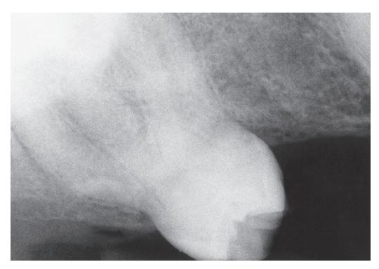

• Fig. 8.10 The widely divergent roots of this maxillary first molar make extraction more difficult.

• Fig. 8.11 The curvature of the roots of this tooth is unexpected. Preoperative radiographs help the surgeon plan the extraction more carefully.

The shape of the individual root must be taken into consideration. Roots may have short, conic shapes that make them easy to remove. However, long roots with severe and abrupt curves or hooks at their apical end are more difficult to remove. The surgeon must have knowledge of the shapes of the roots before surgery to adequately plan the surgery (Fig. 8.11).

The size of the root must be assessed. Teeth with short roots are easier to remove compared with teeth with long roots. A long root that is bulbous as a result of hypercementosis is even more difficult to remove. The periapical radiographs of older patients should be examined carefully for evidence of hypercementosis because this process seems to be a result of aging (Fig. 8.12).

The surgeon should look for evidence of caries extending into the roots. Root caries may substantially weaken the root and make it more liable to fracture when the force of the forceps is applied (Fig. 8.13).

Root resorption, internal or external, should be assessed on examination of the radiograph. Like root caries, root resorption weakens the root structure and renders it more likely to be fractured. Surgical extraction may be considered in situations of extensive root resorption (Fig. 8.14).

The tooth should be evaluated for previous endodontic therapy. If there was endodontic therapy many years before the extraction

• **Fig. 8.12** Hypercementosis increases the difficulty of these extractions because roots are larger at the apical end than at the cervical end. Surgical extraction will probably be required.

• Fig. 8.13 Root caries in first premolar tooth make extraction more difficult because fracture of the tooth is likely. Note hypercementosis of the second premolar.

process, there may be ankylosis and the tooth root will be more brittle. In both situations, surgical extraction may be indicated (Fig. 8.15).

## **Condition of Surrounding Bone**

Careful examination of the periapical radiograph indicates the density of bone surrounding the tooth to be extracted. Bone that is more radiolucent is likely to be less dense, which makes the extraction easier. However, if bone appears to be radiographically opaque (indicating increased density), with evidence of condensing osteitis or other sclerosis-like processes, it will be more difficult to extract.

The surrounding bone should also be examined carefully for evidence of any apical pathology. Teeth that have nonvital pulps

• Fig. 8.14 Internal resorption of the root makes closed extraction almost impossible because fracture of the root will almost surely occur.

• Fig. 8.15 Tooth made brittle by previous endodontic therapy. The tooth is thus more difficult to remove.

may have periapical radiolucencies that represent granulomas or cysts. Awareness of the presence of such lesions is important because these lesions should be removed at the time of surgery (Fig. 8.16).

## **Patient and Surgeon Preparation**

Surgeons must prevent indvertent injury or transmission of infection to their patients or to themselves. The principle of universal precautions states that all patients must be viewed as having bloodborne diseases that can be transmitted to the surgical team and other patients. To prevent this transmission, surgical gloves, surgical mask, and eyewear with side-shields are required. (See Chapter 5 for a detailed discussion of this topic.) In addition, most authorities recommend that the surgical team wear long-sleeved

• Fig. 8.16 (A) Periapical radiolucency. The surgeon must be aware of this before extraction for proper management. (B) Periapical radiolucency around the mandibular premolar represents the mental foramen. The surgeon must be aware that this is not a pathologic condition. An intact lamina dura is noted in B but not in A.

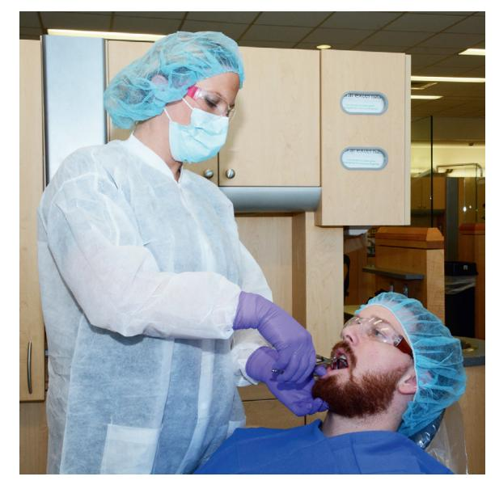

• Fig. 8.17 The surgeon is prepared for surgery by wearing protective eyeglasses, mask, and gloves. Surgeons should have short or pinned-back hair and should wear long-sleeved smocks that are changed daily, or sooner if they become soiled. The patient benefits from a waterproof drape.

gowns, which should be changed when they become visibly soiled (Fig. 8.17).

If the surgeon has long hair, it is essential that the hair be held in position with barrettes or other holding devices and be covered with a surgical cap. A major breach in aseptic technique is to allow the surgeon's hair to hang over the patient's face.

Before the patient undergoes the surgical procedure, a minimal amount of draping is necessary. A sterile drape should be put across the patient's chest to decrease the risk of contamination (see Fig. 8.17).

Before the extraction, some surgeons advise patients to rinse their mouths vigorously with an antiseptic mouth rinse such as chlorhexidine. This reduces the bacterial contamination in the

patient's mouth to some degree. It is unclear what effect this may have on postoperative problems.

To prevent teeth or fragments of teeth from falling into the patient's mouth and potentially being swallowed or aspirated into the lungs, many surgeons prefer to place a partially unfolded  $4 \times 4$  inch gauze loosely into the back of the mouth. This oral partition serves as a barrier so that should a tooth slip from the forceps or shatter under the pressure of the forceps, it will be caught in the gauze rather than be swallowed or aspirated. The surgeon must take care that the gauze is not positioned so far posteriorly that it triggers the gag reflex. The surgeon should explain the purpose of the partition to gain the patient's acceptance and cooperation for allowing the gauze to be in place.

## **Chair Position for Extractions**

The positions of the patient, the chair, and the operator are critical for the successful completion of an extraction. The best position is one that is comfortable for both the patient and surgeon and allows the surgeon to have maximal control of the force that is being delivered to the patient's tooth through the elevators and forceps. The correct position allows the surgeon to keep the arms close to the body and provides stability and support; it also allows the surgeon to keep the wrists straight enough to deliver the force with the arm and shoulder, and not with the fingers or hand. The force delivered can thus be controlled in the face of sudden loss of resistance from a root or fracture of the bone.

Dentists usually stand during extractions, so the positions for a standing surgeon will be described first. Modifications that are necessary to operate in a seated position will be presented later. Also, descriptions of techniques are for the right-handed operator. Left-handed surgeons should reverse the instructions when working on various quadrants.

The most common error dentists make in positioning the dental chair for extractions is to have the chair too high. This forces the surgeons to operate with their shoulders raised, thereby making it difficult to deliver the correct amount of force to the tooth being extracted in the proper manner. It is also tiring to the surgeon. Another frequent positioning problem is for the dentist to lean over the patient and put his or her face close to the patient's mouth. This interferes with surgical lighting, is hard on the dentist's back and neck, and also interferes with proper positioning of the rest of the dentist's body.

For a maxillary extraction, the chair should be tipped backward so that the maxillary occlusal plane is at an angle of about 60 degrees to the floor. Raising the patient's legs at the same time helps improve the patient's comfort. The height of the chair should be such that the patient's mouth is at or slightly below the operator's elbow level (Fig. 8.18). As mentioned previously, novices tend to position the chair too high. During an operation on the maxillary right quadrant, the patient's head should be turned substantially toward the operator so that adequate access and visualization can be achieved (Fig. 8.19). For extraction of teeth in the maxillary anterior portion of the arch, the patient should be looking straight ahead (Fig. 8.20). The position for the maxillary left portion of the arch is similar, except that the patient's head is turned slightly toward the operator (Fig. 8.21).

For the extraction of mandibular teeth, the patient should be positioned in a more upright position so that when the mouth is opened wide, the occlusal plane is parallel to the floor (Fig. 8.22). A properly sized bite block should be used to stabilize the mandible

• **Fig. 8.18** Patient positioned for maxillary extraction. The chair is tilted back so that the maxillary occlusal plane is at about a 60-degree angle to the floor. The height of the chair should ensure that the level of the patient's mouth is slightly below the surgeon's elbow.

• Fig. 8.19 Extraction of teeth in the maxillary right quadrant. Note that patient's head is turned toward the surgeon.

• Fig. 8.20 Extraction of anterior maxillary teeth. The patient looks straight ahead.

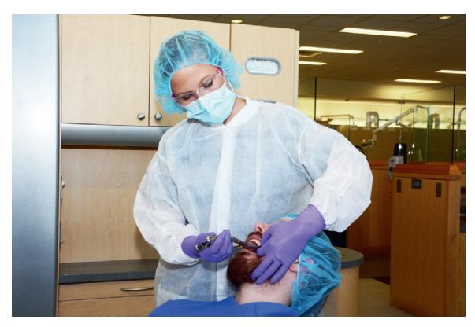

Fig. 8.21 Extraction of maxillary left posterior teeth. The patient's head is turned slightly toward the surgeon.

• Fig. 8.22 For mandibular extractions, the patient is more upright so that the mandibular occlusal plane of the opened mouth is parallel to the floor. The height of the chair is also lower to allow the operator's arm to be straighter.

• Fig. 8.24 Extraction of mandibular anterior teeth. The surgeon stands at the side of the patient, who looks straight ahead.

• Fig. 8.23 Extraction of mandibular right posterior teeth. The patient's head is turned toward the surgeon.

• Fig. 8.25 When English-style forceps are used for extraction of anterior mandibular teeth, the patient's head is positioned straight ahead.

when extraction forceps are used. Even though the surgeon will support the jaw, the additional support provided by the bite block will result in less stress being transmitted to the jaws and allows the patient to rest their muscles of mastication. Care should be taken to avoid using too large a bite block because large ones can overstretch the TMJ ligaments and cause patient discomfort. Typically pediatric bite blocks are the best to use, even in adults.

During removal of mandibular right posterior teeth, the patient's head should be turned acutely toward the surgeon to allow adequate access to the jaw, and the surgeon should maintain the proper arm and hand positions (Fig. 8.23). When removing teeth in the anterior region of the mandible, the surgeon should be to the side of the

patient (Figs. 8.24 and 8.25). When operating on the left posterior mandibular region, the surgeon should move to the side of the patient, but the patient's head should not turn so acutely toward the surgeon (Fig. 8.26).

Some surgeons prefer to approach maxillary and mandibular teeth from a posterior position. This allows the left hand of the surgeon to support the mandible better, but it requires that the forceps be held in an underhand grip and that the surgeon view the field with an upside-down perspective. The left hand of the surgeon goes around the patient's head and supports the mandible.

• Fig. 8.26 Extraction of mandibular posterior teeth. The patient turns slightly toward the surgeon.

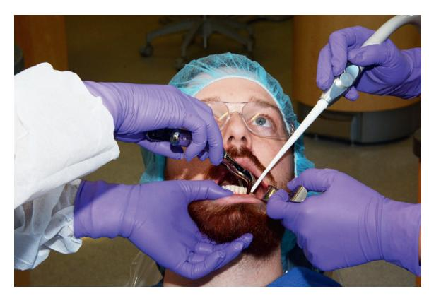

• Fig. 8.27 Behind-the-patient approach for extraction of posterior right mandibular teeth. This allows the surgeon to be in a comfortable, stable position.

The usual behind-the-patient approach is seen in Figs. 8.27 and 8.28. Note the surgeon's right arm is held closely to their body, increasing the arm's strength.

If the surgeon chooses to sit while performing extractions, several modifications must be made. For maxillary extractions, the patient is positioned in a semireclining position similar to that used when the surgeon is standing. However, the patient is not reclined as much; therefore the maxillary occlusal plane is not perpendicular to the floor as it is when the surgeon is standing. The patient's mouth is as near as possible so that the level of the patient's mouth is as near as possible to the surgeon's elbow (Fig. 8.29). The arm and hand positions for extraction of maxillary anterior and posterior teeth are similar to the positions used for the same extractions performed while standing (Fig. 8.30).

As when the surgeon is standing, for extraction of teeth in the lower arch, the patient is slightly more upright than for extraction of maxillary teeth. The surgeon can work from the front of the patient (Figs. 8.31 and 8.32) or from behind the patient (Figs.

• Fig. 8.28 Behind-the-patient approach for extraction of posterior left mandibular teeth. The surgeon's hand is positioned under the forceps.

• Fig. 8.29 In the surgeon-seated position, the patient is positioned as low as possible so that the mouth is at or below the level of the surgeon's elbow.

8.33 and 8.34). When the English-style forceps are used, the surgeon's position is usually behind the patient (Fig. 8.35). It should be noted that the surgeon and the assistant have hand and arm positions similar to those used when the surgeon is in the standing position.

## Mechanical Principles Involved in Tooth Extraction

The removal of teeth from the alveolar process requires the use of the following mechanical principles and simple machines: the lever, the wedge, and the wheel and axle.

Elevators are used primarily as levers. A lever is a mechanism for transmitting a modest force—with the mechanical advantages

• Fig. 8.30 For extraction of maxillary teeth, the patient is reclined approximately 60 degrees. Hand and forceps positions are the same as for the standing position.

• Fig. 8.31 For extraction of maxillary teeth, the operator can hold the forceps in an underhand position.

• **Fig. 8.33** For removal of anterior teeth, the surgeon moves to a position behind the patient so that the patient's mandible and alveolar process can be supported by the surgeon's other hand.

• Fig. 8.34 The behind-the-patient position can be used for removal of mandibular posterior teeth. The surgeon's hand is positioned under the forceps for maximum control.

• Fig. 8.32 For extraction of mandibular anterior teeth, the operator can hold the forceps in an overhand manner.

• Fig. 8.35 When English-style forceps are used, a behind-the-patient position is preferred.

of a long lever arm and a short effector arm—into a small movement against great resistance (Fig. 8.36). An example of the use of a lever is when a Crane pick is inserted into a purchase point placed in a tooth and then is used to elevate the tooth (Fig. 8.37).

The second simple machine that is useful is the wedge (Fig. 8.38). The wedge is useful in several different ways for the extraction of teeth. First, the beaks of extraction forceps are usually narrow at their tips; they broaden as they go superiorly. When forceps are used, there should be a conscious effort made to force the tips of the forceps into the periodontal ligament space at the bony crest. This uses the tooth root as a wedge to expand the bone; as the beaks of the forceps are pressed apically on the root, they will help force the tooth out of the socket (Fig. 8.39). The wedge principle is also useful when a straight elevator is used to luxate a tooth from its socket. A small elevator is wedged into the periodontal ligament space, which displaces the root toward the occlusion and thus out of the socket (Fig. 8.40).

The third machine used in tooth extraction is the wheel and axle, which is most closely identified with the triangular, or pennant-shaped, elevator. When one root of a multiple-rooted tooth is left in the alveolar process, the pennant-shaped elevator, such as a Cryer, is positioned into the socket and turned. The handle then serves as the axle, and the tip of the triangular elevator acts as a wheel and engages and elevates the tooth root from the socket (Fig. 8.41).

• Fig. 8.38 A wedge can be used to expand, split, and displace portions of the substance that receives it.

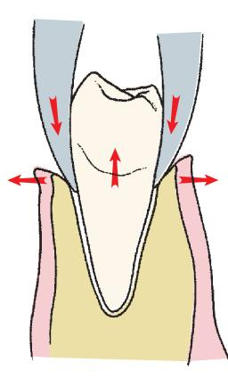

• Fig. 8.39 Beaks of the forceps act as wedges to expand alveolar bone and displace the tooth in the occlusal direction.

• Fig. 8.36 The first-class lever transforms small force and large movement to small movement and large force.

• Fig. 8.37 In removal of a mandibular premolar tooth, the purchase point is placed in the tooth, which creates a first-class lever situation. When the Crane pick is inserted into the purchase point and the handle is depressed apically (A), the tooth is elevated occlusally out of the socket with buccoalveolar bone used as the fulcrum (B).

• Fig. 8.40 Small, straight elevator used as wedge to displace the tooth root from its socket by driving the elevator apically in the periodontal ligament space.

• Fig. 8.41 Triangular elevator in the role of a wheel-and-axle machine used to retrieve the root from the socket.

## **Principles of Elevator and Forceps Use**

The primary instruments used to remove a tooth from the alveolar process are the elevator and extraction forceps. Elevators help in the luxation of a tooth, and forceps continue that process through bone expansion and disruption of periodontal attachments. The goal of forceps use is threefold: (1) expansion of the bony socket by use of the wedge-shaped beaks of the forceps and the movements of the tooth itself with the forceps, (2) twisting of conical roots to disrupt periodontal ligaments, and (3) removal of the tooth from the socket.

The dental elevator consists of a handle, a shank, and a blade. The handle of the elevator is usually in line with the shank and is enlarged to allow it to be grasped in the palm of the hand. The elevator may also have flattened areas for fingers to grasp to help guide the elevator. The handle can also be set perpendicular to the shank (cross bar-type elevators). The shank connects the handle to the blade. Blades can be straight, triangular (Cryer), curved (Potts), or pointed (Crane pick).

Forceps can apply five major motions to luxate teeth. The first is apical pressure, which accomplishes two goals. (1) Although the tooth moves in an apical direction minimally, the tooth socket is expanded by the insertion of the beaks down into the periodontal ligament space (Fig. 8.42). Thus the apical pressure of the forceps on the tooth causes bony expansion. (2) A second accomplishment of apical pressure is that the center of rotation of the tooth is displaced apically. Because the tooth is moving in response to the force placed on it by the forceps, the forceps become the instrument of expansion. If the fulcrum is high (Fig. 8.43), a larger amount of force is placed on the apical region of the tooth, which increases the chance of fracturing the root end. If the beaks of the forceps are forced into the periodontal ligament space, the center of rotation is moved apically, which results in greater movement of the expansion forces at the crest of the ridge and less force moving the apex of the tooth lingually (Fig. 8.44). This process decreases the chance for apical root fracture.

• Fig. 8.42 Extraction forceps should be seated with strong apical pressure to expand crestal bone and to displace the center of rotation as far apically as possible.

• Fig. 8.43 (A) If the center of rotation *(asterisk)* is not far enough apically, it is too far occlusally, which results in excess movement of tooth apex. (B) Excess motion of the root apex caused by a high center of rotation results in fracture of the root apex.

The second major pressure or movement applied by forceps is the buccal force. Buccal pressures result in expansion of the buccal plate, particularly at the crest of the ridge (Fig. 8.45). Although buccal pressure causes expansion forces at the crest of the ridge, it is important to remember that it also causes lingual apical pressure. Thus excessive force can fracture buccal bone or cause fracturing of the apical portion of the root.

Third, lingual or palatal pressure is similar to the concept of buccal pressure but is aimed at expanding the linguocrestal bone and, at the same time, avoiding excessive pressures on the buccal apical bone (Fig. 8.46). Because lingual bone tends to be thicker than buccal bone in posterior areas of the mouth, limited bone expansion occurs.

Fourth, rotational pressure, as the name implies, rotates the tooth, which causes some internal expansion of the tooth socket

• Fig. 8.44 (A) If the forceps are apically seated, the center of rotation (*asterisk*) is displaced apically, and smaller apical pressures are generated. (B) This results in greater expansion of the buccal cortex, less movement of the apex of the tooth, and therefore less chance of fracture of the root.

• **Fig. 8.46** Lingual pressure will expand the linguocortical plate at the crestal area and slightly expand buccal bone at the apical area. *Asterisk* notes the center of rotation.

• **Fig. 8.45** Buccal pressure applied to the tooth will expand the bucco-cortical plate toward crestal bone, with some lingual expansion at the apical end of the root. *Asterisk* notes the center of rotation.

and tearing of periodontal ligaments. Teeth with single, conical roots (such as incisors, canines, and mandibular premolars) and those with roots that are not curved are most amenable to luxation by this technique (Fig. 8.47). Teeth that have other than conical roots or that have multiple roots—especially if those roots are curved—are more likely to fracture under this type of pressure.

Finally, tractional forces are useful for delivering the tooth from the socket once adequate bony expansion is achieved. As mentioned previously, teeth should not be pulled from their sockets. Tractional forces should be limited to the final portion of the extraction process and should be gentle (Fig. 8.48). If excessive force is needed, other maneuvers should be performed to improve root luxation.

• **Fig. 8.47** Rotational forces are useful for teeth with conical roots, such as maxillary incisors and mandibular premolars.

In summary, a variety of forces can be used to remove teeth. A strong apical force is always useful and should be applied whenever forceps are adapted to the tooth. Most teeth are removed by a combination of buccal and lingual (palatal) forces. Because maxillary buccal bone is usually thinner and palatal bone is a thicker cortical bone, maxillary teeth are usually removed by stronger buccal forces and less vigorous palatal forces. In the mandible, buccal bone is thinner from the midline posteriorly to the area of molars. Therefore incisors, canines, and premolars are removed primarily as a result of strong sustained buccal force and less vigorous lingual pressures. As mentioned before, rotational forces are useful for single-rooted teeth that have conic roots and no severe curvatures at the root end. The maxillary incisors, particularly the central incisor and mandibular premolars, are most amenable to rotational forces.

• Fig. 8.48 Tractional forces are useful for the final removal of the tooth from the socket. These should always be small forces because teeth are not pulled.

## **Procedure for Closed Extraction**

An erupted root can be extracted using one of two major techniques: closed or open. The closed technique is also known as the *routine technique*. The open technique is also known as the *surgical technique*, or *flap technique*. This section discusses the closed extraction technique; the open (surgical) technique is discussed in Chapter 9.

The closed technique is the most frequently used technique and is given primary consideration for almost every extraction. The open technique is used when the clinician believes that excessive force would be necessary to remove the tooth, when a substantial amount of the crown is missing or covered by tissue, or when access to the root of a tooth is difficult, such as when a fragile crown is present.

The correct technique for any situation should lead to an atraumatic extraction; the wrong technique commonly results in an excessively traumatic and lengthy extraction.

Whatever technique is chosen, the three fundamental requirements for a good extraction remain the same: (1) adequate access and visualization of the field of surgery, (2) an unimpeded pathway for the removal of the tooth, and (3) the use of controlled force to luxate and remove the tooth.

For the tooth to be removed from the bony socket, it is usually necessary to expand the alveolar bony walls to allow the tooth root an unimpeded pathway, and it is necessary to tear the periodontal ligament fibers that hold the tooth in the bony socket. The use of elevators and forceps as levers and wedges with steadily increasing force can accomplish these two objectives.

Five general steps make up the closed extraction procedure. *Step 1* involves loosening of the soft tissue attachment from the cervical portion of the tooth. The first step in removing a tooth by the closed extraction technique is to loosen the soft tissue from around the tooth with a sharp instrument such as a scalpel blade or the sharp end of the No. 9 periosteal elevator (Fig. 8.49). The purpose of loosening the soft tissue from the tooth is twofold: (1) First, it allows the surgeon to ensure that profound anesthesia has been achieved. When this step has been performed, the dentist informs the patient that the surgery is about to begin and that the first step will be to push the soft tissue away from the tooth.

• Fig. 8.49 Periosteal elevator used to loosen the gingival attachment from the tooth and the interdental papilla. (Courtesy Dr. Edward Ellis III.)

A small amount of pressure is felt at this step, but there should be no sensation of sharpness or discomfort if profound local anesthesia is in place. The surgeon then begins the soft tissue loosening procedure, gently at first and then with increasing force. (2) The second reason that soft tissue is loosened is to allow the elevator and tooth extraction forceps to be positioned more apically, without interference from or impingement on the gingiva. As the soft tissue is loosened away from the tooth, it is slightly reflected, which thereby increases the width of the gingival sulcus and allows easy entrance of the beveled tip of the forceps beaks. The adjacent gingival papilla of the tooth should also be reflected to avoid damage by the insertion of the straight elevator.

Step 2 involves luxation of the tooth with a dental elevator. The luxation of the tooth begins with a dental elevator, usually the straight elevator. In most situations, elevation from the lingual or palatal aspects of roots is limited due to poor access and is of limited efficacy. Elevation should occur at the mesial and distal buccal aspects of the root. No elevation should be attempted along buccal bone because it can be easily fractured or the surgeon can lose control and cause soft tissue injury.

Expansion and dilation of the alveolar bone and tearing of the periodontal ligament require that the tooth be luxated in several ways. The straight elevator is inserted perpendicular to the tooth into the interdental space, after reflection of the interdental papilla (Figs. 8.50 to 8.52). The elevator is then moved to direct the blade in an apical direction. The elevator is then rotated in small motions back and forth, while apical pressure is placed to advance the blade into the periodontal ligament space. A straight elevator with a small blade should be used initially. Once some tooth movement is noted, a larger straight elevator is inserted and used in a similar manner. If the tooth is intact and in contact with stable teeth anterior and posterior to it, the amount of movement achieved with the straight elevator will be minimal. The usefulness of this step is greater if the patient does not have a tooth posterior to the tooth being extracted or it is broken down to an extent that the crowns do not inhibit movement of the tooth, or if the adjacent tooth is also planned for extraction at the same appointment.

Luxation of teeth with a straight elevator should be performed with caution. Excessive forces can damage and even displace the

• Fig. 8.50 Small, straight elevator, inserted perpendicular to the tooth after the papilla has been reflected. (Courtesy Dr. Edward Ellis III.)

• Fig. 8.52 The handle of the elevator may be turned in the opposite direction to displace the tooth further from the socket. This can be accomplished only if no tooth is adjacent posteriorly.

 $\bullet$  Fig. 8.53 Tips of forceps beak, forced apically under soft tissue. (Courtesy Dr. Edward Ellis III.)

are then seated onto the tooth so that the tips of the forceps beaks grasp the root underneath loosened soft tissue (Fig. 8.53). The lingual beak is usually seated first and then the buccal beak. Care must be taken to confirm that the tips of the forceps beaks are beneath the soft tissue and not engaging an adjacent tooth. Once the forceps have been positioned on the tooth, the surgeon grasps the handles of the forceps at the ends to maximize mechanical advantage and control (Fig. 8.54). If the tooth is malposed in such a fashion that the usual forceps cannot grasp the tooth without injury to adjacent teeth, another forceps with narrower beaks should be used. Maxillary root forceps can often be useful for crowded lower anterior teeth.

The beaks of the forceps must be held parallel to the long axis of the tooth so that the forces generated by the application of pressure to the forceps handle can be delivered along the

• Fig. 8.51 The handle of the small, straight elevator is turned such that the occlusal side of the elevator blade is turned toward the tooth. The handle is also moved apically to help elevate the tooth.

teeth adjacent to those being extracted. This is especially true if the adjacent tooth has a large restoration or carious lesion. This is only the initial step in the elevation process. Next, the small, straight elevator is inserted into the periodontal ligament space at the mesial–buccal line angle. The elevator is advanced apically while being rotated back and forth, helping luxate the tooth with its wedge action as it is advanced apically. A similar action with the elevator can then be done at the distal-buccal line angle. When a small, straight elevator becomes too easy to twist, a larger-sized elevator is used to do the same apical advancement. Often the tooth will loosen sufficiently to be removed easily with forceps.

*Step 3* involves adaptation of the forceps to the tooth. The proper forceps are now chosen for the tooth to be extracted. The beaks of the forceps should be shaped to adapt anatomically to the tooth, apical to the cervical line, that is, to the root surface. (A few exceptions to this include the cowhorn forceps.) The forceps

Fig. 8.54 Forceps handles, held at the ends to maximize mechanical advantage and control. (A) Maxillary universal forceps. (B) Mandibular universal forceps.

long axis of the tooth for maximal effectiveness in dilating and expanding alveolar bone. If the beaks are not parallel to the long axis of the tooth, it is increasingly likely that the tooth root will fracture.

The forceps are then forced apically as far as possible to grasp the root of the tooth as apically as possible. This accomplishes two things: (1) The beaks of the forceps act as wedges to dilate the crestal bone on the buccal and lingual aspects, and (2) by forcing the beaks apically, the center of rotation (or fulcrum) of the forces applied to the tooth is displaced toward the apex of the tooth, which results in greater effectiveness of bone expansion and less likelihood of fracturing the apical end of the tooth.

At this point, the surgeon's hand should be grasping the forceps firmly, with the wrist locked and the arm held against the body; the surgeon should be prepared to apply force with the shoulder and upper arm without any wrist pressure. The surgeon should be standing upright, with feet comfortably apart.

Step 4 involves luxation of the tooth with forceps. The surgeon begins to luxate the tooth by using the motions discussed earlier. The major portion of the force is directed toward the thinnest and therefore weakest bone. Thus, with all teeth in the maxilla and all but molar teeth in the mandible, the major movement is labial and buccal (i.e., toward the thinner layer of bone). The surgeon uses slow, sustained, steady force to displace the tooth buccally, rather than a series of rapid, small movements that do little to expand bone. The motion is deliberate and slow, and it gradually increases in force. The tooth is then moved again toward the opposite direction with slow, deliberate, strong pressure. As the alveolar bone begins to expand, the forceps are reseated apically with a strong, deliberate motion, which causes additional expansion of alveolar bone and further displaces the center of the rotation apically. Buccal and lingual pressures continue to

expand the alveolar socket. For some teeth, small rotational motions are then used to help expand the tooth socket and tear the periodontal ligament attachments. Beginning surgeons have a tendency to apply inadequate pressure for insufficient amounts of time.

The following three factors must be reemphasized: (1) The forceps must be apically seated as far as possible and reseated periodically during the extraction; (2) the forces applied in the buccal and lingual directions should be slow, deliberate pressures and not jerky wiggles; and (3) the force should be held for several seconds to allow the bone time to expand. It must be remembered that teeth are not pulled; rather, they are gently lifted from the socket once the alveolar process has been sufficiently expanded.

*Step 5* involves removal of the tooth from the socket. Once alveolar bone has expanded sufficiently and the tooth has been luxated, a slight tractional force, usually directed buccally, can be used. Tractional forces should be minimized because this is the last motion that is used once the alveolar process is sufficiently expanded and the periodontal ligament is completely severed.

It should be remembered that luxation of the tooth with forceps and removal of the tooth from bone are separate steps in the extraction. Luxation is directed toward expansion of bone and disruption of the periodontal ligament. The tooth is not removed from bone until these two goals are accomplished. The novice surgeon should realize that the major role of forceps is not to remove the tooth, but rather to expand the bone so that the root(s) can be removed.

For teeth that are malposed or have unusual positions in the alveolar process, luxation with forceps and removal from the alveolar process will be in unusual directions. The surgeon must develop a sense for the direction the tooth wants to move and then be able to move it in that direction. Careful preoperative assessment and planning help guide this determination during the extraction.

#### Role of the Opposite Hand

While using forceps and elevators to luxate and remove teeth, it is important that the surgeon's opposite hand play an active role in the procedure. For the right-handed operator, the left hand has a variety of functions. The left hand is responsible for reflecting the soft tissues of the cheeks, lips, and tongue to provide adequate visualization of the area of surgery. The left hand helps protect other teeth from the forceps, should it release suddenly from the tooth socket. The left hand, and sometimes arm, helps stabilize the patient's head during the extraction process. In some situations, greater amounts of force are required to expand heavy alveolar bone; therefore the patient's head requires active assistance to be held steady. The opposite hand plays an important role in supporting and stabilizing the jaw when mandibular teeth are being extracted. The opposite hand is often necessary to apply considerable pressure to expand heavy mandibular bone, and such forces can cause discomfort and even injury to the TMJ unless a steady hand counteracts them. A bite block placed on the contralateral side is also used to help open the jaw in this situation. Finally, the opposite hand supports the alveolar process and provides tactile information to the operator concerning the expansion of the alveolar process during the luxation period. In some situations, it is impossible for the opposite hand to perform all of these functions at the same time, so the surgeon requires an assistant to help with some of the functions.

### Role of the Assistant During Extraction

To achieve a successful outcome in any surgical procedure, it is useful to have a skilled assistant. During extraction, the assistant plays a variety of important roles that contribute to making the surgical experience atraumatic for the patient. The assistant helps the surgeon visualize and gain access to the operative area by retracting the soft tissue of the cheeks and tongue so that the surgeon can have an unobstructed view of the surgical field. Even during a closed extraction, the assistant can retract the soft tissue so that the surgeon can apply the instruments to loosen the soft tissue attachment and adapt the forceps to the tooth in the most effective manner.

Another major activity of the assistant is to suction away blood, saliva, and the irrigating solutions used during the surgical procedure. This prevents fluids from accumulating and makes proper visualization of the surgical field possible. Suctioning is also important for patient comfort because most patients are unable to tolerate any accumulation of blood or other fluids in their throats (Fig. 8.55).

During extraction, the assistant should also help with protecting the teeth of the opposite arch, which is especially important when removing lower posterior teeth. If traction forces are necessary to remove a lower tooth, occasionally the tooth releases suddenly and the forceps strike maxillary teeth and may fracture a tooth cusp. The assistant should hold a suction tip or a finger against maxillary teeth to protect them from an unexpected blow.

During the extraction of mandibular teeth, the assistant may play an important role by supporting the mandible during the application of the extraction forces. A surgeon who uses the hand to reflect soft tissue may not be able to support the mandible. If this is the case, the assistant plays an important role in stabilizing the mandible to prevent TMJ discomfort. Most often the surgeon stabilizes the mandible, which makes this role less important for the assistant.

The assistant also provides psychological and emotional support for the patient by helping alleviate patient anxiety during anesthesia administration and surgery. The assistant is important in gaining the patient's confidence and cooperation by using positive language and physical contact with the patient during the preparation and performance of the surgery. The assistant should avoid making casual, offhand comments that may increase the patients' anxiety and lessen their cooperation.

## Specific Techniques for the Removal of Each Tooth

This section describes specific techniques for the removal of each tooth in the mouth after being elevated. In some situations, several teeth are grouped together (e.g., the maxillary anterior teeth) because the technique for their removal is essentially the same. The reader should take note of the role of the left hand in each instance.

## **Maxillary Teeth**

In the correct position for the extraction of maxillary left or anterior teeth, the left index finger of the surgeon should reflect the lip and cheek tissues, while the thumb rests on the palatal alveolar process (Fig. 8.56). In this way, the left hand is able to reflect the soft tissue of the cheek, stabilize the patient's head, support the alveolar process, and provide tactile information to the surgeon regarding the progress of the extraction. When such a position is used during the extraction of a maxillary molar, the surgeon can frequently feel with the left hand the palatal root of the molar becoming free in the alveolar process before feeling it with the forceps or the extracting hand. For the right side, the index finger is positioned on the palate, with the thumb on the buccal aspect.

#### Incisors

The maxillary incisor teeth are extracted with the upper universal forceps (No. 150), although other forceps can be used such as the straight forceps (No. 1). Maxillary incisors generally have conic roots, with the lateral ones being slightly longer and more slender. The lateral incisor is more likely also to have a distal curvature on the apical one third of the root, so this must be checked radiographically before the tooth is extracted. Alveolar bone is thin on the labial side and heavier on the palatal side, which indicates that the major expansion of the alveolar process will be in the labial direction. The initial movement is slow, steady, and firm in the labial direction, which expands the crestal buccal bone. A less vigorous palatal force is then used, followed by a slow, firm, rotational force. Rotational movement should be minimized for the lateral incisor, especially if a curvature exists on the tooth. The

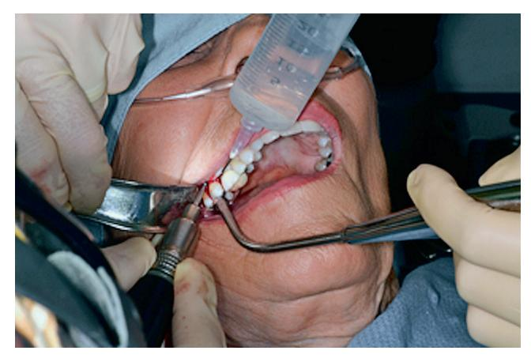

 $\bullet$  Fig. 8.55 While the surgeon holds the surgical hand piece and Minnesota retractor, the assistant provides cooling irrigation and suction. (Courtesy Dr. Edward Ellis III.)

• Fig. 8.56 Extraction of maxillary left posterior teeth. The left index finger retracts the lip and cheek and supports the alveolar process on the buccal aspect. The thumb is positioned on the palatal aspect of the alveolar process and supports the alveolar process. The head is steadied by this grip, and tactile information about the tooth and bone movement is gained.

tooth is delivered in the labial-incisal direction with a small amount of tractional force (Fig. 8.57).

#### Canines

The maxillary canine is usually the longest tooth in the mouth. The root is oblong in cross section and usually produces a bulge called the *canine eminence* on the anterior surface of the maxilla. The result is that the bone over the labial aspect of the maxillary canine is usually thin. In spite of the thin labial bone, this tooth can be difficult to extract simply because of its long root and large surface area available for periodontal ligament attachments. In addition, it is not uncommon for a segment of labial alveolar bone to fracture from the labial plate and be removed with the tooth.

The upper universal (No. 150) forceps are the preferred instru-ment for removing the maxillary canine, after elevation. As with

• Fig. 8.57 (A) Maxillary incisors are extracted with No. 150 forceps. The left hand grasps the alveolar process. (B) The forceps are seated as far apically as possible. (C) Luxation is begun with labial force. (D) Slight lingual force is used. (E) The tooth is delivered to the labial incisor with a rotational, tractional movement. *Asterisk* notes the center of rotation.

Downloaded for Tommy Tran (122427@kasascity.edu) at Kansas City University from ClinicalKey.com by Elsevier on September 12, 2025. For personal use only. No other uses without permission. Copyright ©2025. Elsevier Inc. All rights reserved.

all extractions, the initial placement of the beaks of the forceps on the canine tooth should be as far apically as possible. The initial movement is apical and then to the buccal aspect, with return pressure to the palatal. As the bone is expanded and the tooth mobilized, the forceps should be repositioned apically. A small amount of rotational force may be useful in expanding the tooth socket, especially if adjacent teeth are missing or have just been extracted. After the tooth has been well luxated, it is delivered from the socket in a labial-incisal direction with labial tractional forces (Fig. 8.58).

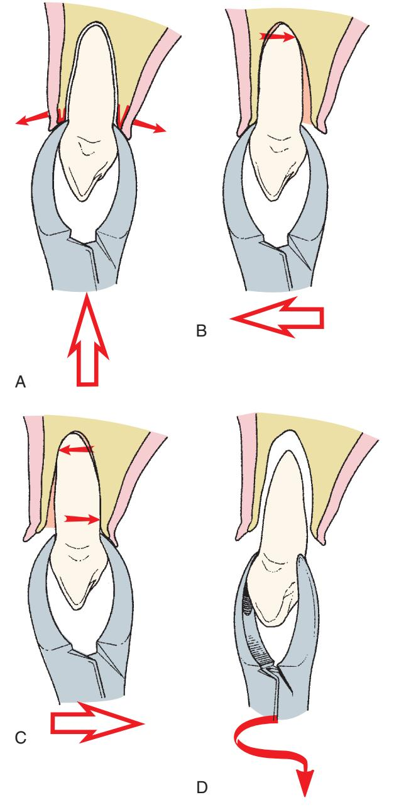

• Fig. 8.58 (A) Hand and forceps positions for removal of the maxillary canine are similar to those for removal of incisors. The forceps are seated as far apically as possible. (B) The initial movement is in the buccal direction. (C) Small amounts of lingual force are applied. (D) The tooth is delivered in the labial-incisal direction with a slight rotational force.

During the luxation process with the forceps, if the surgeon feels a portion of the labial bone fracturing, the surgeon must make a decision concerning the next step. If the palpating finger indicates that a small amount of bone has fractured free and is attached to the canine tooth, the extraction should continue in the usual manner, with caution taken not to tear the soft tissue. However, if the palpating finger indicates that a large portion of labial alveolar plate has fractured, the surgeon should stop the surgical procedure. Usually the fractured portion of bone is still attached to periosteum and therefore is viable. The surgeon should use a thin periosteal elevator to raise a small amount of mucosa from around the tooth, down to the level of the fractured bone. The canine tooth should then be stabilized with the extraction forceps, and the surgeon should attempt to free the fractured bone from the tooth, with the periosteal elevator as a lever to separate the bone from the tooth root. If this can be accomplished, the tooth can be removed and the bone left in place attached to the periosteum. Normal healing should occur. If bone becomes detached from the periosteum during these attempts, it should be removed because it is probably nonvital and may actually prolong wound healing. This same procedure can be used whenever alveolar bone is fractured during extraction.

Prevention of labial plate fracture is important. After elevation and during the luxation process with the forceps, if a normal amount of pressure has not resulted in any movement of the tooth, the surgeon should seriously consider doing an open extraction. By reflecting a soft tissue flap and removing a small amount of bone, the surgeon may be able to remove the stubborn canine tooth without fracturing a large amount of labial bone. By using the open technique, there will be an overall reduction in bone loss and in postoperative healing time.

#### First Premolar

The maxillary first premolar is a single-rooted tooth in its first two thirds, with a bifurcation into a buccolingual root usually occurring in the apical one third to one half. These roots may be extremely thin and are subject to fracture, especially in older patients in whom bone density is great and bone elasticity is diminished. Perhaps the most common root fracture when extracting teeth in adults occurs with this tooth. As with other maxillary teeth, buccal bone is thin compared with palatal bone.

The upper universal (No. 150) forceps are the instrument of choice. Alternatively, the No. 150A forceps can be used for removal of the maxillary first premolar. Because of the high likelihood of root fracture, the tooth should be luxated as much as possible with the straight elevator. If root fracture does occur, a mobile root tip can be removed more easily than one that has not been well luxated via elevation.

Because of the bifurcation of the tooth into two thin root tips, extraction forces should be carefully controlled during removal of the maxillary first premolar. Initial movements should be buccal. Palatal movements are made with small amounts of force to prevent fracture of the palatal root tip, which is harder to retrieve. When the tooth is luxated buccally, the most likely tooth root to break is the labial root. When the tooth is luxated in the palatal direction, the most likely root to break is the palatal root. Of the two root tips, the labial is easier to retrieve because of the thin, overlying bone. Therefore, as for other maxillary teeth, buccal pressures should be greater than palatal pressures. Any rotational force should be avoided. Final delivery of the tooth from the tooth socket is with tractional force in the occlusal direction and slightly buccal (Fig. 8.59).

• Fig. 8.59 (A) Maxillary premolars are removed with the No. 150 forceps. The hand position is similar to that used for anterior teeth. (B) Firm apical pressure is applied first to the lower center of rotation as far as possible and to expand crestal bone. (C) Buccal pressure is applied initially to expand the buccocortical plate. The apices of roots are pushed lingually and are therefore subject to fracture. (D) Palatal pressure is applied, but less vigorously than buccal pressure. (E) The tooth is delivered in the bucco-occlusal direction with a combination of buccal and tractional forces.

#### Second Premolar

The maxillary second premolar is a single-rooted tooth for the entire length of the root. The root is thick and has a blunt end. Consequently, the root of the second premolar rarely fractures. The overlying alveolar bone is similar to that of other maxillary teeth in that it is thin toward the buccal aspect, with a heavy palatal-alveolar palate.

The recommended forceps are the maxillary universal forceps, or the No. 150 forceps; some surgeons prefer the No. 150A forceps. The forceps are forced as far apically as possible so as to gain maximal mechanical advantage in removing this tooth. Because the tooth root is strong and blunt, the extraction requires strong movements to the buccal back to the palate, and then in the bucco-occlusal direction with a rotational, tractional force (Fig. 8.60).

#### Molars

The maxillary first molar has three large and strong roots. Buccal roots are usually close together, and the palatal root diverges widely toward the palate. If the two buccal roots are also widely divergent, it becomes difficult to remove this tooth by closed extraction. Once again, the overlying alveolar bone is similar to that of other teeth in the maxilla; the buccal plate is thin and the palatal–cortical plate is thick and heavy. When evaluating this tooth radiographically, the dentist should note the size, curvature, and apparent divergence

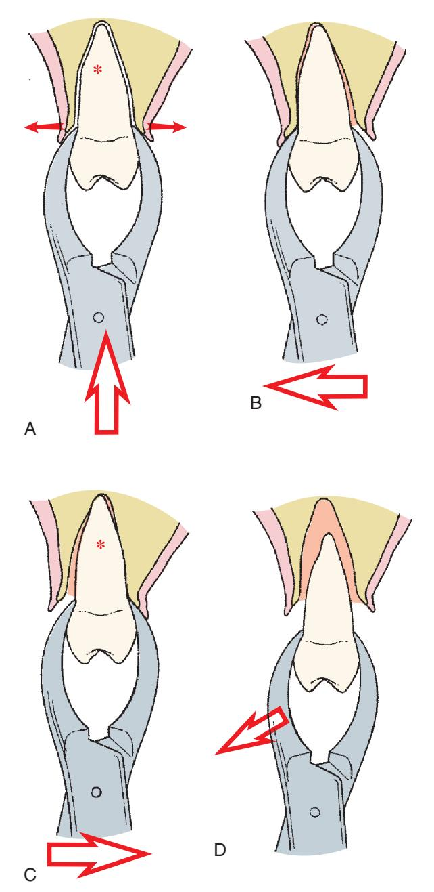

• Fig. 8.60 (A) When extracting the maxillary second premolar, the forceps are seated as far apically as possible. (B) Luxation is begun with buccal pressure. (C) Very slight lingual pressure is used. (D) The tooth is delivered in the bucco-occlusal direction. *Asterisk* notes the center of rotation.

of the three roots. In addition, the dentist should look carefully at the relationship of the tooth roots to the maxillary sinus. If the sinus is in proximity to the roots and the roots are widely divergent, sinus perforation caused by removal of a portion of the sinus floor during tooth removal is increasingly likely. If this appears to be likely after preoperative evaluation, the surgeon should strongly consider a surgical extraction.

The paired forceps No. 53R and No. 53L are usually used for extraction of the maxillary molars. These two forceps have tip projections on the buccal beaks to fit into the buccal bifurcation. Some surgeons prefer to use the No. 89 and No. 90 forceps. These two forceps are especially useful if the crown of the molar tooth has serious caries or large restorations.

The upper molar forceps are adapted to the tooth and are seated apically as far as possible in the usual fashion (Fig. 8.61). The basic extraction movement is to use strong buccal and palatal pressures, with stronger forces toward the buccal than toward the palate. Rotational forces are not useful for extraction of this tooth because of its three roots. As mentioned in the discussion of the extraction of the maxillary first premolar, it is preferable to fracture a buccal root rather than a palatal root (because it is easier to retrieve the buccal roots). Therefore, if the tooth has widely divergent roots and the dentist suspects that one root may be fractured, the tooth should be luxated in such a way as to prevent fracturing of the palatal root. The dentist must minimize palatal force because this is the force that fractures the palatal root. Strong, slow, steady buccal pressure expands the buccocortical plate and tears the periodontal ligament fibers that hold the palatal root in its position. Palatal forces should be used but kept to a minimum.

The anatomy of the maxillary second molar is similar to that of the maxillary first molar except that the roots tend to be shorter and less divergent, with the buccal roots more commonly fused into a single root. This means that the tooth is more easily extracted by the same technique described for the first molar.

The erupted maxillary third molar frequently has conic roots and is usually extracted with the No. 210S forceps, which are universal forceps used for the left and right sides. The tooth is usually readily removed because buccal bone is thin and the roots are usually fused and conical. The erupted third molar is also frequently extracted by the use of elevators alone. Clear visualization of the maxillary third molar on the preoperative radiograph is important because the root anatomy of this tooth is variable, and often small, dilacerated, hooked roots exist in this area. Retrieval of fractured roots in this area is difficult due to more limited access.

#### Mandibular Teeth

When removing lower molar teeth, the index finger of the left hand is in the buccal vestibule, and the second finger is in the lingual vestibule, reflecting the lip, cheek, and tongue (Fig. 8.62). The thumb of the left hand is placed below the chin so that the mandible is held between the fingers and the thumb, which support the mandible and minimize TMJ pressures. This technique provides less tactile information, but during extraction of mandibular teeth, the need to support the mandible supersedes the need to support the alveolar process. A useful alternative is to place a bite block between the teeth on the contralateral side (Fig. 8.63). The bite block allows the patient to help provide stabilizing forces to limit the pressure on the TMJs. The surgeon's or assistant's hand should continue to provide additional support to the inferior portion of the mandible.

#### Anterior Teeth

Mandibular incisors and canines are similar in shape, with the incisors being shorter and slightly thinner, and the canine roots being longer and heavier. The incisor roots are more likely to be fractured because they are thin, and therefore they should be removed only after adequate preextraction luxation. Alveolar bone that overlies incisors and canines is thin on the labial and lingual sides. Bone over the canine may be thicker, especially on the lingual aspect.

The lower universal (No. 151) forceps are usually used to remove these teeth. Other choices include the No. 151A or the English-style

• Fig. 8.61 (A) Extraction of maxillary molars. Soft tissues of the lips and cheek are retracted, and the alveolar process is grasped with the opposite hand. (B) Forceps beaks are seated apically as far as possible. (C) Luxation is begun with strong buccal force. (D) Lingual pressures are used only moderately. (E) The tooth is delivered in the bucco-occlusal direction. *Asterisk* notes the center of rotation.

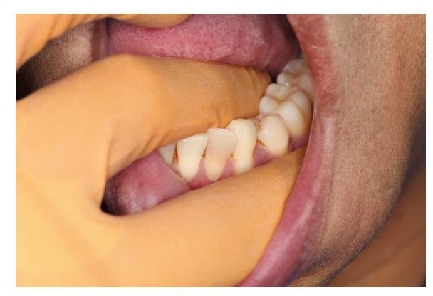

• Fig. 8.62 Extraction of mandibular left posterior teeth. The surgeon's left index finger is positioned in the buccal vestibule, retracting the cheek, and the second finger is positioned in the lingual vestibule, retracting the tongue. The thumb is positioned under the chin. The mandible is grasped between the fingers and the thumb to provide support during extraction.

• Fig. 8.63 A rubber bite block can be placed between the patient's teeth on the contralateral side to provide support for the mandible and prevent excessive temporomandibular joint pressures.

Ashe forceps. The forceps beaks are positioned on teeth and seated apically with strong force. The extraction movements are generally in the labial and lingual directions, with equal pressures both ways. Once the tooth has become luxated and mobile, rotational movement may be used to expand alveolar bone further. The tooth is removed from the socket with tractional forces in a labial-incisal direction (Fig. 8.64).

#### Premolars

Mandibular premolars are among the most straightforward teeth to extract. The roots tend to be straight and conic, albeit sometimes slender. The overlying alveolar bone is thin on the buccal aspect and heavier on the lingual side.

The lower universal (No. 151) forceps are usually chosen for the extraction of the mandibular premolars. The No. 151A forceps and the English-style forceps are popular alternatives for extraction of these teeth.

The forceps are apically forced as far as possible, with the basic movements directed toward the buccal aspect, returning to the lingual aspect, and finally rotating. Rotational movement is used

more when extracting these teeth than for any others, except perhaps the maxillary central incisor. The tooth is then delivered in the occlusobuccal direction (Fig. 8.65). Careful preoperative radiographic assessment must be performed to confirm that no root curvature exists in the apical third of the tooth. If such a curvature does exist, the rotational movements should be reduced or eliminated from the extraction procedure (Fig. 8.66).

#### Molars

Mandibular molars usually have two roots, with the roots of the first molar more widely divergent than those of the second molar. In addition, the roots may converge at the apical one.

The No. 17 forceps are usually used for extraction of mandibular molars; these forceps have small tip projections on both beaks to fit into the bifurcation of the tooth roots. The forceps are adapted to the root of the tooth in the usual fashion, and strong apical pressure is applied to set the beaks of the forceps apically as far as possible. Strong buccolingual motion is then used to expand the tooth socket and allow the tooth to be delivered in the buccoocclusal direction. Linguoalveolar bone around the second molar

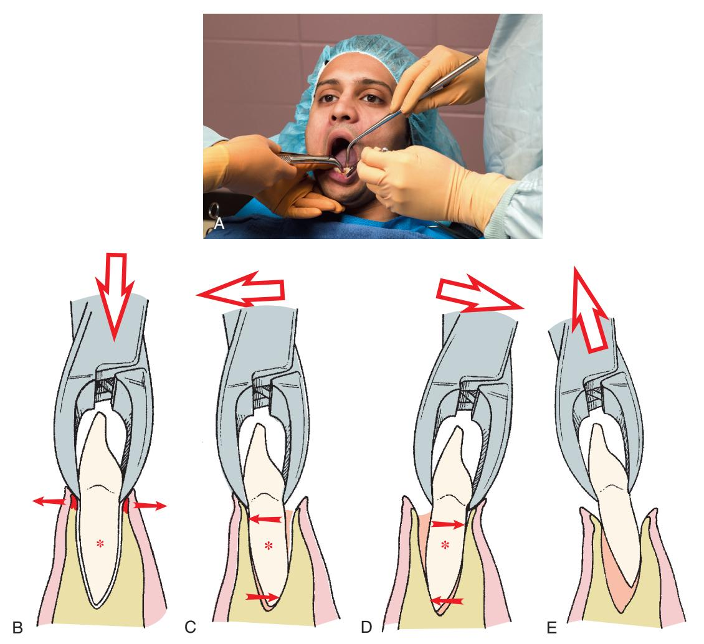

• Fig. 8.64 (A) When extracting mandibular anterior teeth, No. 151 forceps are used. The assistant retracts the patient's cheek and provides suction. (B) The forceps are seated apically as far as possible. (C) Moderate labial pressure is used to initiate the luxation process. (D) Lingual force is used to continue the expansion of bone. (E) The tooth is delivered in the labial-incisal direction. *Asterisk* notes the center of rotation.

Downloaded for Tommy Tran (122427@kasascity.edu) at Kansas City University from ClinicalKey.com by Elsevier on September 12, 2025. For personal use only. No other uses without permission. Copyright ©2025. Elsevier Inc. All rights reserved.

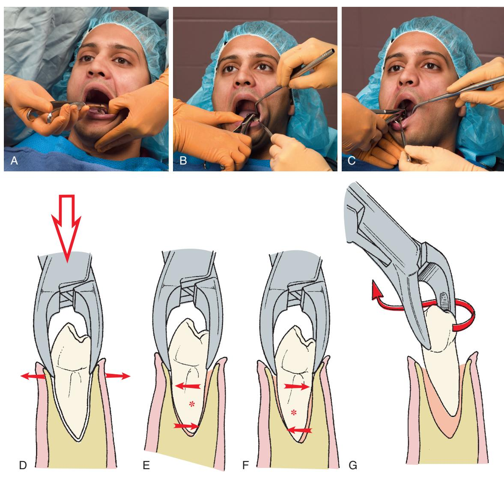

• Fig. 8.65 (A) Extraction of the mandibular premolar. The mandible is stabilized, soft tissue is retracted, and No. 151 forceps are positioned. (B) The hand position is modified slightly for the behind-the-patient technique. (C) English-style forceps can also be used. (D) The forceps are seated apically as far as possible to displace the center of rotation and to begin the expansion of crestal bone. (E) Buccal forceps are applied to begin the luxation process. (F) Slight lingual pressure is used. (G) The tooth is delivered with a rotational, tractional force. *Asterisk* notes the center of rotation.

is thinner than the buccal plate, so the second molar can be removed more easily with stronger lingual pressure than buccal pressure (Fig. 8.67). An English-style lower molar forceps is also available.

If the tooth roots are clearly bifurcated, the No. 23 forceps, or cowhorn forceps, can be used. This instrument is designed to be closed forcefully with the handles, thereby squeezing the beaks of the forceps into the bifurcation. This creates force against the crest of the alveolar ridge on the buccolingual aspects and literally forces the tooth superiorly directly out of the tooth socket (Fig. 8.68). If this is not successful initially, the forceps are given buccolingual movements to expand alveolar bone, and the forceps handles are moved up and down to seat the beaks more fully into the furcation. More squeezing of the handles is performed. Care must be taken with these forceps to prevent damaging maxillary teeth because the lower molar may actually pop out of the socket and thus release the forceps to strike upper teeth. Erupted mandibular third molars usually have fused conic roots. Because a bifurcation is not likely, the No. 222 forceps—a shortbeaked, right-angled forceps—are used to extract this tooth. The lingual plate of bone is definitely thinner than the buccocortical plate, so most of the extraction forces should be delivered to the lingual aspect. The third molar is delivered in the linguo-occlusal direction. The erupted mandibular third molar that is in function can be a deceptively difficult tooth to extract. The dentist should give serious consideration to using the straight elevator and achieve a moderate degree of luxation before applying the forceps. Pressure should be gradually increased, and attempts to mobilize the tooth should be made before the final strong pressures are delivered.

## **Modifications for Extraction of Primary Teeth**

Rarely is it necessary to remove primary teeth before substantial root resorption has occurred. However, when removal is required,

it must be done with a great deal of care because the roots of the primary teeth are long and delicate and are subject to fracture. This is especially true because the succedaneous tooth causes resorption of coronal portions of the root structure and thereby weakens it. The forceps usually used are an adaptation of the upper

• Fig. 8.66 If any curvature of the premolar root exists, rotational extraction forces will result in fracture of the curved portion of the root; therefore such forces should be minimized.

and lower universal forceps, the No. 150S and the No. 151S. They are adapted and forced apically in the usual fashion, with slow, steady pressures toward the buccal aspect and return movements toward the lingual aspect.

Rotational motions may be used but should be minimal and should be used judiciously with multirooted teeth. The dentist should pay careful attention to the direction of least resistance and deliver the tooth into that path. If the roots of the primary molar tooth embrace the crown of the permanent premolar, the surgeon should consider sectioning the tooth. Rarely, the roots hold the crown of the permanent premolar firmly enough in their grasp to cause it to be loosened or extracted.

Once a primary tooth with substantial root resorption is removed, the extraction site should be carefully inspected to help ensure no small pieces of tooth remain.

## **Postextraction Tooth Socket Care**

Once the tooth has been removed, the socket requires proper care. The socket should be debrided only if necessary. If a periapical lesion is visible on the preoperative radiograph and there was no granuloma attached to the tooth when it was removed, the periapical region should be carefully curetted with a periapical curette to remove the granuloma or cyst. If any debris is obvious, such as calculus, amalgam, or tooth fragment remaining in the socket, it should be gently removed with a curette or suction

• Fig. 8.67 (A) Mandibular molars are extracted with No. 17 or No. 23 forceps. The hand positions of the surgeon and the assistant are the same for both forceps. (B) No. 17 forceps are seated as far apically as possible. (C) Luxation of the molar is begun with a strong buccal movement. (D) Strong lingual pressure is used to continue the luxation. (E) The tooth is delivered in the bucco-occlusal direction. *Asterisk* notes the center of rotation.

Downloaded for Tommy Tran (122427@kasascity.edu) at Kansas City University from ClinicalKey.com by Elsevier on September 12, 2025. For personal use only. No other uses without permission. Copyright ©2025. Elsevier Inc. All rights reserved.

• Fig. 8.68 (A) No. 23 forceps are carefully positioned to engage the bifurcation area of the lower molar. (B) The handles of the forceps are squeezed forcibly together, which causes the beaks of the forceps to be forced into the bifurcation and exerts tractional forces on tooth. (C) Strong buccal forces are then used to expand the socket. (D) Strong lingual forces are used to luxate the tooth further. (E) The tooth is delivered in the bucco-occlusal direction with buccal and tractional forces.

tip (Fig. 8.69). However, if neither a periapical lesion nor debris is present, the socket should not be curetted. The remnants of the periodontal ligament and the bleeding bony walls are in the best condition to provide for rapid healing. Vigorous curettage of the socket wall merely produces additional injury and may delay healing.

The expanded buccolingual plates should be compressed back to their original configuration. Finger pressure should be applied to the buccolingual cortical plate to compress the plates gently, but firmly, to their original position. This helps prevent bony undercuts that may have been caused by excessive expansion of the buccocortical plate, especially after extraction of the first molar. Care should be taken to not overreduce the socket if implant placement is planned or possible in the future. In some cases, no reduction should be done if implants are planned.

If teeth were removed because of periodontal disease, there may be an accumulation of excess granulation tissue around the gingival cuff. If this is the case, special attention should be given to removing this granulation tissue with a curette, tissue scissors, or a hemostat. The arterioles of granulation tissue have little or no capacity to retract and constrict, which leads to bothersome bleeding if excessive granulation tissue is left in place.

Finally, the bone should be palpated through the overlying mucosa to check for any sharp, bony projections. If any exist, the mucosa should be reflected and the sharp edges smoothed judiciously with a bone file or trimmed with a rongeur.

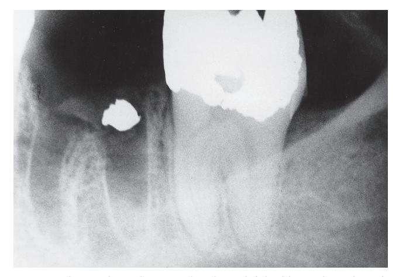

• Fig. 8.69 An amalgam fragment has been left in this tooth socket after extraction because the surgeon failed to inspect and debride the surgical field.

Initial control of hemorrhage is achieved by use of a moistened  $2 \times 2$  inch gauze placed over the extraction socket. The gauze should be positioned such that when the patient closes his or her teeth together, it fits into the space previously occupied by the crown of the tooth. Biting of teeth together places pressure on the gauze, and the pressure is then transmitted to the socket. This pressure results in hemostasis. If the gauze is simply placed on the occlusal table, the pressure applied to the bleeding socket is insufficient to achieve adequate hemostasis (Fig. 8.70). A larger gauze sponge (4 × 4 inches) may be required if multiple teeth have been extracted or if the opposing arch is edentulous.

The extraction of multiple teeth at one sitting is a more involved and complex procedure and is discussed in Chapter 9.

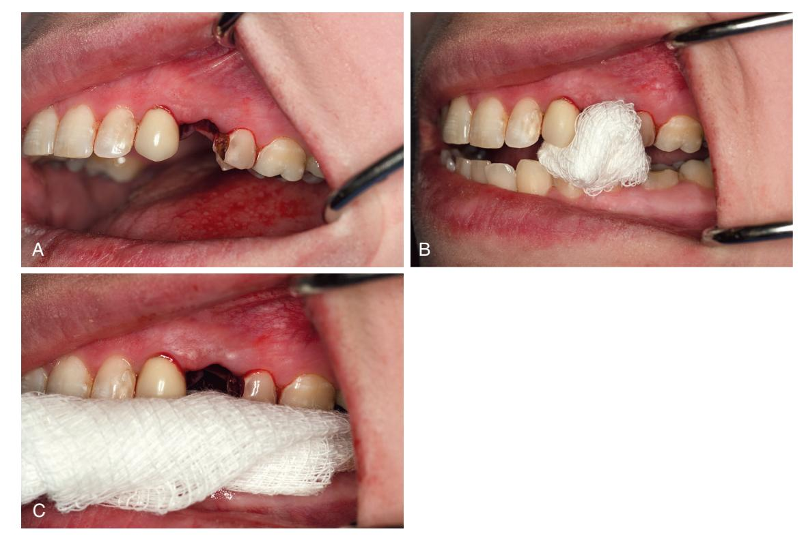

• **Fig. 8.70** (A) After extraction of a single tooth, a small space exists where the crown of the tooth was located. (B) A gauze pad ( $2 \times 2$  inch) is folded in half twice and placed into the space. When the patient bites on the gauze, pressure is transmitted directly to the gingiva and the socket. (C) If a large piece of gauze is used, the pressure goes on teeth, not on the gingiva or the socket.