This study guide provides a comprehensive summary of the principles and techniques for routine exodontia, combining surgical principles with elementary physical mechanics. The primary goal is to gently lift the tooth's root from its socket, not to pull the tooth. A thorough pre-extraction assessment is crucial to determine the difficulty of the procedure; a high degree of difficulty may indicate the need for a surgical approach to avoid excessive force, which can lead to fractures and increased patient discomfort.

# **Presurgical Medical Assessment**

-   **Critical Examination:** A thorough review of the patient's medical status is required to identify any health problems that necessitate treatment modification or special medical management.
-   **Special Measures:** Depending on the patient's health, specific measures may be needed to control bleeding, reduce the risk of infection, or prevent medical emergencies.
-   **Reference:** Detailed information is available in Chapter 1.

# **Indications for Removal of Teeth**

These are guidelines, not absolute rules, for when tooth extraction is appropriate.

-   **Caries:** The tooth is severely carious and nonrestorable, or the complexity and cost of restoration make extraction a reasonable alternative, potentially followed by an implant-supported prosthesis.
-   **Pulpal Necrosis:** Irreversible pulpitis or pulpal necrosis that is not amenable to endodontic treatment due to patient refusal, tortuous/calcified canals, or failed endodontics without a desire for retreatment.
-   **Periodontal Disease:** Severe periodontal disease with extensive bone loss and irreversible tooth mobility, or when ongoing bone loss could jeopardize future implant placement.
-   **Orthodontic Reasons:** To create space for the proper alignment of teeth in a crowded dentition. This commonly involves the maxillary and mandibular premolars, and occasionally the mandibular incisors.
    > Great care should be taken to double-check that extraction is indeed necessary and that the correct tooth or teeth are removed if someone other than the surgeon doing the extraction has planned the extractions.
-   **Malpositioned Teeth:** Teeth that traumatize soft tissues (e.g., a buccally erupted maxillary third molar causing cheek ulceration) or hypererupted teeth that interfere with prosthetic rehabilitation in the opposing arch.
-   **Cracked Teeth:** Painful, unmanageable cracked teeth, which are often brittle after endodontic treatment and prone to fracture.
-   **Impacted Teeth:** Teeth that cannot erupt into a functional occlusion due to inadequate arch space, obstruction by adjacent teeth, or other factors.
-   **Supernumerary Teeth:** Extra teeth, which are usually impacted and can interfere with the eruption of succedaneous teeth, potentially causing their resorption or displacement.
-   **Teeth Associated With Pathologic Lesions:** Teeth involved in pathologic lesions, such as odontogenic cysts, that must be removed to allow for the complete surgical removal of the lesion.
-   **Radiation Therapy:** Compromised teeth that lie within the beam of radiation therapy for oral, head, or neck cancer.
    > Many of these teeth can be retained with proper care. See Chapter 19 for a more thorough discussion.
-   **Teeth Involved in Jaw Fractures:** Teeth that are injured, infected, severely luxated, or interfere with the proper reduction and fixation of a jaw fracture.
-   **Financial Issues:** The patient is unable or unwilling to afford proper maintenance, or when alternative treatments like implant dentistry are more cost-effective.

# **Contraindications for Removal of Teeth**

These are typically relative contraindications that may be modified or require special precautions.

-   **Systemic Contraindications:** See Chapter 1 for a detailed discussion.
-   **Local Contraindications:**
    -   **History of therapeutic radiation for cancer:**
        > Extractions performed in an area of radiation may result in osteoradionecrosis, and therefore the extraction must be done with extreme caution. Chapter 19 discusses this in detail.
    -   **Teeth within an area of a tumor (especially malignant):** The surgical procedure could potentially disseminate malignant cells.
    -   **Severe pericoronitis around an impacted mandibular third molar:**
        > Nonsurgical treatment should include irrigations and removal of the maxillary third molar, if necessary, to relieve impingement on the edematous soft tissue overlying the mandibular impaction. Some clinicians will also administer antibiotics. If the mandibular third molar is removed in the face of severe pericoronitis, the incidence of complications increases. However, if the pericoronitis is mild and the tooth can be removed in a straightforward manner, then immediate extraction may be performed.
    -   **Acute dentoalveolar abscess:**
        > Many prospective studies have made it abundantly clear that the most rapid resolution of an infection resulting from pulpal necrosis is obtained when the tooth is removed as early as possible. Therefore acute infection is not a contraindication to extraction. However, it may be difficult to extract such a tooth because the patient may not be able to open the mouth sufficiently wide due to trismus, or it may be difficult to reach a state of profound local anesthesia. If access and anesthesia considerations can be met, the tooth should be removed as soon as possible. Otherwise, antibiotic therapy should be started and extraction planned as soon as possible.

# **Clinical Evaluation of Teeth for Removal**

An assessment of extraction difficulty is based on the following clinical factors.

### **Access to the Tooth**

-   **Patient Opening:** Limitations in mouth opening (due to trismus, TMJ dysfunction, or muscle fibrosis) can compromise anesthesia delivery and routine extraction. A surgical approach under sedation or general anesthesia should be considered if opening is severely compromised.
-   **Tooth Location/Position:** Crowded or malposed teeth may hinder proper forceps placement and may require different forceps or a surgical approach.

### **Mobility of the Tooth**

-   **Greater-Than-Normal Mobility:** Often seen with severe periodontal disease and suggests an uncomplicated removal, though it may require more extensive soft tissue management (Fig. 8.1A).
-   **Less-Than-Normal Mobility:** May indicate hypercementosis or ankylosis. Ankylosis is common in retained primary molars and nonvital, endodontically treated teeth (Fig. 8.1B). If ankylosis is suspected, a surgical removal should be planned.

### **Condition of the Crown**

-   **Large Caries or Restorations:** These increase the risk of crown fracture, making the extraction more difficult (Fig. 8.2, Fig. 8.3).
-   **Endodontically Treated Teeth:** These teeth are often desiccated and brittle, causing them to crumble easily under forceps pressure.
-   **Clinical Protocol:** For compromised crowns, elevate the tooth as much as possible before applying forceps. Position the forceps as far apically as possible to grasp intact root structure.
-   **Calculus:** Remove large accumulations of calculus before extraction to prevent interference with forceps placement and to avoid contamination of the socket.
-   **Adjacent Teeth:** Note large restorations or crowns on adjacent teeth.
    > Use elevators with extreme caution to prevent fracture or displacement of adjacent restorations (Fig. 8.4). Inform patient of possible damage during informed consent.

# **Radiographic Examination of the Tooth for Removal**

Proper radiographs are essential for every tooth being extracted.

-   **Types:** Periapical radiographs provide the most accurate and detailed information. Panoramic radiographs are best for evaluating impacted teeth.
-   **Radiograph Criteria:** Must be properly exposed, processed, and positioned to show the entire tooth without distortion. It should be current (less than 1 year old), labeled, and available for viewing during the procedure (Fig. 8.5).
-   **Relationship to Adjacent Teeth:** Assess the relationship to adjacent erupted or unerupted teeth. For primary teeth, evaluate the proximity of their roots to the underlying succedaneous tooth to prevent injury.

### **Relationship to Vital Structures**

-   **Maxillary Molars:** Note the proximity of the roots to the floor of the maxillary sinus. Thin intervening bone increases the risk of sinus perforation (Fig. 8.6). The treatment plan may be altered to an open surgical technique with root sectioning.
-   **Mandibular Molars:** The inferior alveolar canal may be close to the roots, risking injury to the inferior alveolar nerve (Fig. 8.7). This is more relevant for impacted teeth but should be assessed for all molars. CBCT can be useful.
-   **Mandibular Premolars:** Note the location of the mental foramen.
    > If a surgical flap is required to retrieve a premolar root, it is essential that the surgeon know where the mental foramen is to avoid injuring the mental nerve during flap development (Fig. 8.8).

### **Configuration of Roots**

-   **Number of Roots:** Identify any abnormal number of roots to prevent fracture and alter the surgical plan accordingly (Fig. 8.9).
-   **Curvature and Divergence:** Excessively curved or widely divergent roots make forceps extraction difficult. A surgical extraction with planned crown division may be necessary (Fig. 8.10, Fig. 8.11).
-   **Shape and Size:** Short, conical roots are easiest to remove. Long roots with severe curves, hooks, or bulbous shapes due to hypercementosis are more difficult and may require surgical extraction (Fig. 8.12).
-   **Root Caries/Resorption:** Caries or resorption (internal or external) weakens the root, increasing the likelihood of fracture and indicating a possible need for surgical extraction (Fig. 8.13, Fig. 8.14).
-   **Previous Endodontic Therapy:** These teeth can become ankylosed and are brittle, suggesting that a surgical extraction may be required (Fig. 8.15).

### **Condition of Surrounding Bone**

-   **Density:** Radiolucent bone is less dense and allows for an easier extraction. Radiopaque bone indicates increased density (e.g., condensing osteitis) and a more difficult extraction.
-   **Apical Pathology:** Periapical radiolucencies (granulomas, cysts) indicate a nonvital pulp and should be removed with the tooth (Fig. 8.16A). Differentiate from normal anatomic structures like the mental foramen (Fig. 8.16B).

# **Patient and Surgeon Preparation**

-   **Universal Precautions:** The surgeon and team must wear surgical gloves, a mask, and eyewear with side-shields. Long-sleeved gowns and a surgical cap are also recommended (Fig. 8.17).
-   **Patient Draping:** Place a sterile drape across the patient's chest (Fig. 8.17).
-   **Antiseptic Rinse:** Some surgeons have the patient rinse with an antiseptic mouthwash (e.g., chlorhexidine) before the procedure to reduce bacterial load.
-   **Oral Partition:** Place a partially unfolded 4x4 inch gauze loosely in the back of the mouth to act as a barrier to catch any tooth fragments.
    > The surgeon must take care that the gauze is not positioned so far posteriorly that it triggers the gag reflex. Explain its purpose to the patient.

# **Chair Position for Extractions**

The chair should be positioned for the comfort of both patient and surgeon, allowing for maximal control of force with the surgeon's arms close to the body and wrists straight.

## **Standing Surgeon Positions (Right-handed)**

-   **Common Errors:** A chair that is too high causes the surgeon's shoulders to be raised, leading to poor force control and fatigue. Leaning over the patient interferes with lighting and is detrimental to the surgeon's back and neck.
-   **Maxillary Extractions:**
    -   The chair should be tipped back so the maxillary occlusal plane is at a 60° angle to the floor. The patient's mouth should be at or slightly below the operator's elbow level (Fig. 8.18).
    -   **Maxillary Right:** Patient's head turned substantially toward the operator (Fig. 8.19).
    -   **Maxillary Anterior:** Patient looks straight ahead (Fig. 8.20).
    -   **Maxillary Left:** Patient's head turned slightly toward the operator (Fig. 8.21).
-   **Mandibular Extractions:**
    -   The patient sits more upright, so the mandibular occlusal plane (when the mouth is open) is parallel to the floor. The chair should be positioned lower than for maxillary extractions (Fig. 8.22).
    -   **Bite Block:** Use a properly sized bite block on the contralateral side to stabilize the mandible and reduce TMJ stress.
        > Care should be taken to avoid using too large a bite block because large ones can overstretch the TMJ ligaments and cause patient discomfort. Typically pediatric bite blocks are the best to use, even in adults.
    -   **Mandibular Right:** Patient's head turned acutely toward the surgeon (Fig. 8.23).
    -   **Mandibular Anterior:** Surgeon stands to the side of the patient (Figs. 8.24, 8.25).
    -   **Mandibular Left:** Surgeon stands to the side, with the patient's head turned slightly toward the surgeon (Fig. 8.26).
    -   **Posterior Approach:** Standing behind the patient allows for better mandible support but requires an underhand grip (Figs. 8.27, 8.28).

## **Seated Surgeon Positions**

-   **Maxillary Extractions:** The patient is in a semireclining position with the mouth as low as possible, at or below the surgeon's elbow level (Fig. 8.29). Hand and arm positions are similar to standing (Fig. 8.30, 8.31).
-   **Mandibular Extractions:** The patient is slightly more upright. The surgeon can work from the front (Figs. 8.31, 8.32) or behind the patient (Figs. 8.33, 8.34). English-style forceps are often used from a behind-the-patient position (Fig. 8.35).

# **Mechanical Principles Involved in Tooth Extraction**

Three simple machines are used in routine exodontia.

1.  **Lever:** An elevator acts as a first-class lever, where a modest force is converted into a small movement against great resistance. The buccoalveolar bone serves as the fulcrum (Fig. 8.36, Fig. 8.37).
2.  **Wedge:** The wedge principle is used to expand and split a substance.
    -   **Forceps:** The beaks of forceps are forced apically into the PDL space, acting as wedges to expand the bony socket and displace the tooth occlusally (Fig. 8.38, Fig. 8.39).
    -   **Straight Elevator:** When wedged into the PDL space, it also displaces the root occlusally (Fig. 8.40).
3.  **Wheel and Axle:** This principle involves rotational force. Triangular elevators (e.g., Cryer) are used by placing the tip into an empty socket and turning it; the handle acts as the axle, and the tip acts as a wheel to engage and elevate an adjacent root (Fig. 8.41).

# **Principles of Elevator and Forceps Use**

## **Elevators**

Elevators are primarily used for luxation. They consist of a handle, shank, and blade, which can be straight, triangular (Cryer), curved (Potts), or pointed (Crane pick).

## **Extraction Forceps**

Forceps are used to expand the bony socket, disrupt the periodontal ligament, and remove the tooth. There are three main goals of forceps use:
1.  Expansion of the bony socket.
2.  Twisting of conical roots to tear the periodontal ligament.
3.  Removal of the tooth from the socket.

### **Five Major Motions Applied by Forceps**

1.  **Apical Pressure:**
    -   **Goals:** Expands the crestal bone by inserting beaks into the PDL space and displaces the tooth's center of rotation apically, which reduces the risk of apical root fracture (Fig. 8.42, Fig. 8.43, Fig. 8.44).
    -   **Application:** Strong apical pressure should be maintained whenever forceps are adapted to the tooth.
2.  **Buccal Force:**
    -   **Function:** Expands the buccal plate of bone, especially at the crest of the ridge (Fig. 8.45).
    -   **Consideration:** Excessive force can fracture the buccal bone or the apical portion of the root.
3.  **Lingual or Palatal Pressure:**
    -   **Function:** Expands the linguocrestal bone (Fig. 8.46).
    -   **Consideration:** Lingual bone is often thicker, limiting expansion. This force helps avoid excessive pressure on the buccal apex.
4.  **Rotational Pressure:**
    -   **Function:** Rotates the tooth to cause internal expansion of the socket and tear the PDL.
    -   **Application:** Best suited for teeth with single, conical roots and no severe curves (e.g., maxillary incisors, mandibular premolars) (Fig. 8.47). Not suitable for multi-rooted teeth.
5.  **Tractional Forces:**
    -   **Function:** Delivers the tooth from the socket *after* the bone has been adequately expanded.
    -   **Application:** Should be gentle and used only for the final portion of the extraction.
    > Teeth should not be pulled from their sockets. If excessive force is needed, other maneuvers should be performed to improve root luxation (Fig. 8.48).

### **Summary of Force Application**

-   **Apical Force:** Always applied.
-   **Buccal/Lingual Forces:** A combination is used for most teeth.
    -   **Maxillary Teeth:** Stronger buccal forces are used as the buccal bone is thinner.
    -   **Mandibular Anterior/Premolars:** Strong buccal force is used as buccal bone is thinner.
-   **Rotational Forces:** Useful for single-rooted, conical teeth without severe curves.

# **Procedure for Closed Extraction**

The closed, or routine, technique is used most frequently. The open (surgical) technique is reserved for cases where excessive force would be required.

### **Three Fundamental Requirements for a Good Extraction**

1.  Adequate access and visualization of the surgical field.
2.  An unimpeded pathway for the removal of the tooth.
3.  The use of controlled force to luxate and remove the tooth.

### **Five General Steps of Closed Extraction**

1.  **Loosen Soft Tissue Attachment:**
    -   **Instrument:** A scalpel blade or the sharp end of a No. 9 periosteal elevator (Fig. 8.49).
    -   **Purpose:** Confirms profound anesthesia and allows elevators and forceps to be positioned more apically without damaging the gingiva.
2.  **Luxation of the Tooth with a Dental Elevator:**
    -   **Instrument:** Typically a straight elevator.
    -   **Technique:** Insert the elevator perpendicular to the tooth into the interdental space and rotate it back-and-forth with apical pressure to advance it into the PDL space (Fig. 8.50, Fig. 8.51, Fig. 8.52).
        > No elevation should be attempted along buccal bone because it can be easily fractured or the surgeon can lose control and cause soft tissue injury.
    -   **Caution:**
        > Luxation of teeth with a straight elevator should be performed with caution. Excessive forces can damage and even displace the teeth adjacent to those being extracted.
3.  **Adaptation of the Forceps to the Tooth:**
    -   **Technique:** Select the proper forceps and seat the beaks apically under the loosened soft tissue to grasp the root surface, not the crown (Fig. 8.53). The forceps beaks must be parallel to the long axis of the tooth.
        > Care must be taken to confirm that the tips of the forceps beaks are beneath the soft tissue and not engaging an adjacent tooth.
    -   **Grip:** Grasp the handles at the ends for maximal mechanical advantage (Fig. 8.54).
    -   **Surgeon Stance:** Maintain a firm grip with a locked wrist, keeping the arm against the body and generating force from the shoulder and upper arm.
4.  **Luxation of the Tooth with Forceps:**
    -   **Motions:** Apply a combination of apical, buccal, lingual/palatal, and rotational forces. The primary direction of force is toward the thinnest bone (usually buccal).
    -   **Technique:** Use slow, sustained, and steady force, holding the pressure for several seconds to allow the bone to expand. Avoid jerky movements. Periodically reseat the forceps apically.
        > Beginning surgeons have a tendency to apply inadequate pressure for insufficient amounts of time.
    -   **Key Principles:**
        1.  Forceps must be seated and reseated as far apically as possible.
        2.  Buccal and lingual forces should be slow, deliberate pressures.
        3.  Force should be held for several seconds to allow for bone expansion.
        > It must be remembered that teeth are not pulled; rather, they are gently lifted from the socket once the alveolar process has been sufficiently expanded.
5.  **Removal of the Tooth from the Socket:**
    -   Once the alveolar bone has expanded and the tooth is luxated, apply a slight tractional force (usually buccally) to deliver the tooth.
    -   The major role of forceps is bone expansion, not tooth removal.

# **Role of the Opposite Hand During Extraction**

For a right-handed operator, the left hand is crucial for:
-   Reflecting soft tissues (cheeks, lips, tongue) for visualization.
-   Protecting adjacent teeth from instrument slippage.
-   Stabilizing the patient's head.
-   Supporting and stabilizing the mandible to counteract extraction forces and prevent TMJ discomfort.
-   Supporting the alveolar process to provide tactile feedback on bone expansion.
> In some situations, it is impossible for the opposite hand to perform all functions simultaneously, requiring an assistant.

# **Role of the Assistant During Extraction**

A skilled assistant enhances the surgical experience by:
-   **Visualization and Access:** Retracting soft tissues to provide an unobstructed view.
-   **Fluid Management:** Suctioning blood, saliva, and irrigation to maintain a clear field.
-   **Protection of Opposing Arch:** Guarding the opposing arch with a suction tip or finger to prevent damage if forceps slip.
-   **Mandibular Support:** Assisting the surgeon in supporting the mandible.
-   **Psychological and Emotional Support:** Alleviating patient anxiety through positive communication and physical reassurance.
    > The assistant should avoid making casual, offhand comments that may increase patient anxiety and lessen cooperation.

# **Specific Techniques for the Removal of Each Tooth**

## **Maxillary Teeth**

**Surgeon's Hand Position (Right-handed Operator):**
-   **Maxillary Left or Anterior:** Left index finger reflects the lip/cheek while the thumb rests on the palatal alveolar process.
-   **Maxillary Right:** Index finger is on the palate and the thumb is on the buccal aspect.

### **Incisors**

-   **Forceps:** No. 150 (upper universal) or No. 1 (straight).
-   **Anatomy:** Conical roots (laterals may have apical curvature). Thin labial bone.
-   **Technique:** Major expansion is directed labially. Use slow, firm labial force, less vigorous palatal force, and slow rotational force (minimized for laterals). Deliver in a labial-incisal direction.

$\bullet$  Fig. 8.55 While the surgeon holds the surgical hand piece and Minnesota retractor, the assistant provides cooling irrigation and suction. (Courtesy Dr. Edward Ellis III.)

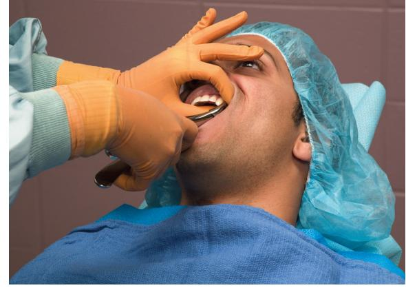

• Fig. 8.56 Extraction of maxillary left posterior teeth. The left index finger retracts the lip and cheek and supports the alveolar process on the buccal aspect. The thumb is positioned on the palatal aspect of the alveolar process and supports the alveolar process. The head is steadied by this grip, and tactile information about the tooth and bone movement is gained.

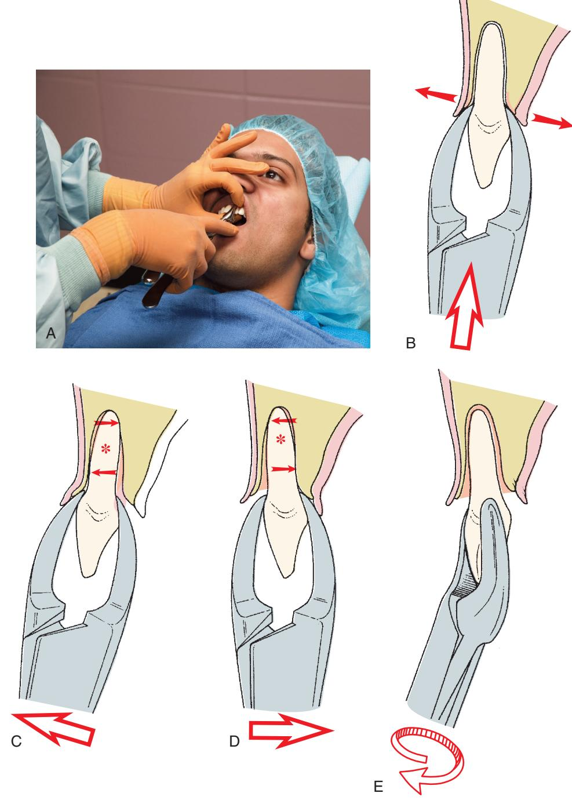

• Fig. 8.57 (A) Maxillary incisors are extracted with No. 150 forceps. The left hand grasps the alveolar process. (B) The forceps are seated as far apically as possible. (C) Luxation is begun with labial force. (D) Slight lingual force is used. (E) The tooth is delivered to the labial incisor with a rotational, tractional movement. *Asterisk* notes the center of rotation.

### **Canines**

-   **Forceps:** No. 150.
-   **Anatomy:** Longest tooth with a long root, making it difficult to extract. Labial bone is thin and prone to fracture.
-   **Technique:** Initial movement is buccal, followed by palatal pressure. Reseat forceps apically as the tooth mobilizes. A small rotational force can be used. Deliver in a labial-incisal direction.

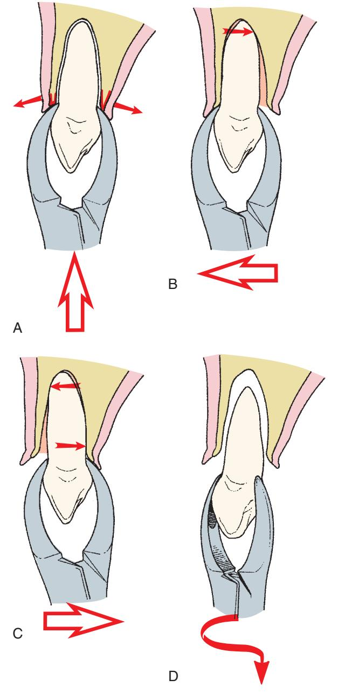

• Fig. 8.58 (A) Hand and forceps positions for removal of the maxillary canine are similar to those for removal of incisors. The forceps are seated as far apically as possible. (B) The initial movement is in the buccal direction. (C) Small amounts of lingual force are applied. (D) The tooth is delivered in the labial-incisal direction with a slight rotational force.

> **Management of Labial Bone Fracture:**
> *   If a *small* fracture is palpated, continue the extraction cautiously.
> *   If a *large* fracture is detected, stop. Reflect the mucosa, stabilize the tooth, and use a periosteal elevator to separate the bone from the tooth. If the bone remains attached to the periosteum, leave it. If it detaches, remove it.
>
> **Prevention of Labial Plate Fracture:**
> *   If the tooth does not move with normal pressure, consider an open extraction. Reflecting a flap and removing a small amount of bone can prevent a larger fracture.

### **First Premolar**

-   **Forceps:** No. 150 or No. 150A.
-   **Anatomy:** Often bifurcates into thin buccolingual roots in the apical third, making it the most commonly fractured root in adults.
-   **Technique:** Luxate with a straight elevator before applying forceps. Use greater buccal pressure than palatal pressure. Avoid rotational force. Deliver with tractional force in a buccal-occlusal direction.

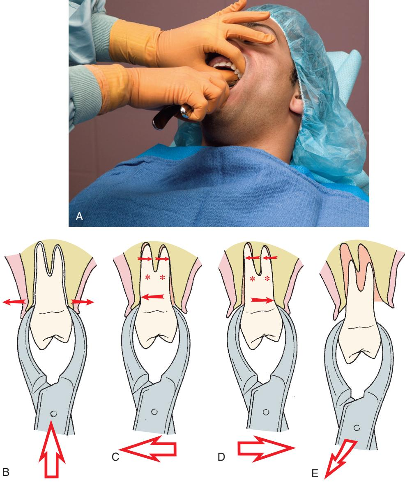

• Fig. 8.59 (A) Maxillary premolars are removed with the No. 150 forceps. The hand position is similar to that used for anterior teeth. (B) Firm apical pressure is applied first to the lower center of rotation as far as possible and to expand crestal bone. (C) Buccal pressure is applied initially to expand the buccocortical plate. The apices of roots are pushed lingually and are therefore subject to fracture. (D) Palatal pressure is applied, but less vigorously than buccal pressure. (E) The tooth is delivered in the bucco-occlusal direction with a combination of buccal and tractional forces.

### **Second Premolar**

-   **Forceps:** No. 150 or No. 150A.
-   **Anatomy:** Single, thick, blunt root that rarely fractures.
-   **Technique:** Use strong buccal and palatal movements. Deliver with a rotational, tractional force in a bucco-occlusal direction.

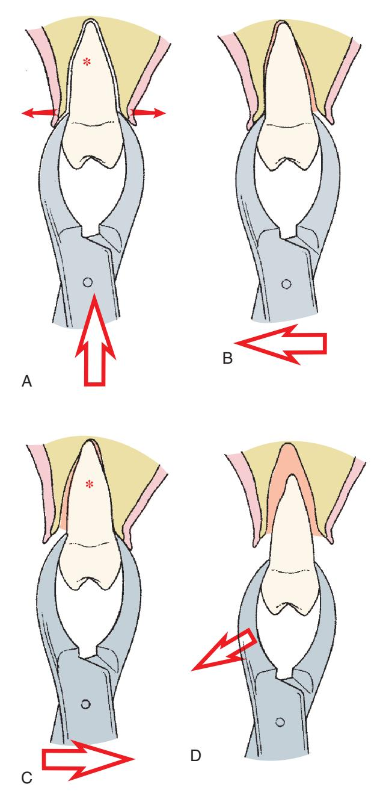

• Fig. 8.60 (A) When extracting the maxillary second premolar, the forceps are seated as far apically as possible. (B) Luxation is begun with buccal pressure. (C) Very slight lingual pressure is used. (D) The tooth is delivered in the bucco-occlusal direction. *Asterisk* notes the center of rotation.

### **Molars**

-   **Maxillary First Molar:**
    -   **Forceps:** Paired No. 53R/53L or No. 89/90.
    -   **Anatomy:** Three strong roots (two buccal, one palatal). Widely divergent roots make closed extraction difficult.
    -   **Technique:** Use strong buccal and palatal pressures, with stronger forces directed buccally. Avoid rotation. Minimize palatal force to prevent palatal root fracture.
    -   > If sinus is in proximity to widely divergent roots, sinus perforation is likely; strongly consider surgical extraction.
-   **Maxillary Second Molar:** Similar to the first molar, but roots are shorter, less divergent, and often fused, making extraction easier.
-   **Maxillary Third Molar:**
    -   **Forceps:** No. 210S.
    -   **Anatomy:** Root anatomy is variable, but roots are often fused and conical.
    -   **Technique:** Readily removed due to thin buccal bone. Requires a clear radiograph due to anatomical variability.

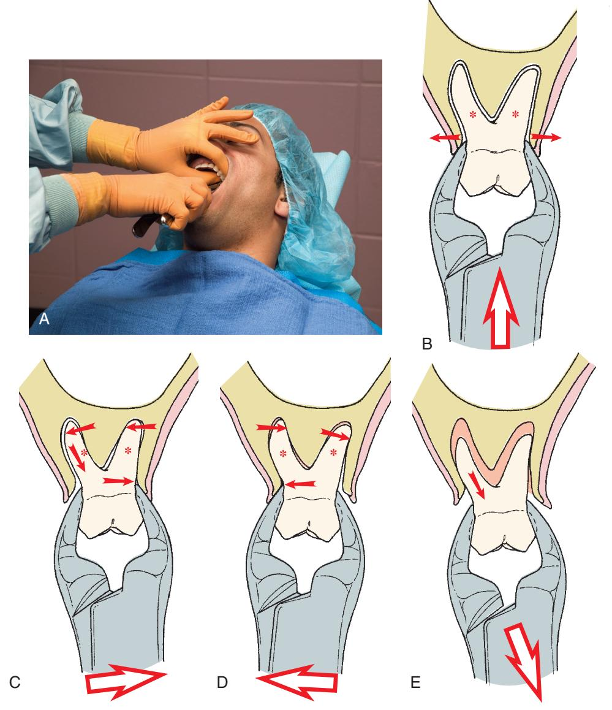

• Fig. 8.61 (A) Extraction of maxillary molars. Soft tissues of the lips and cheek are retracted, and the alveolar process is grasped with the opposite hand. (B) Forceps beaks are seated apically as far as possible. (C) Luxation is begun with strong buccal force. (D) Lingual pressures are used only moderately. (E) The tooth is delivered in the bucco-occlusal direction. *Asterisk* notes the center of rotation.

## **Mandibular Teeth**

**Surgeon's Hand Position:**
-   Grasp the mandible for support with the index finger in the buccal vestibule, the second finger in the lingual vestibule, and the thumb under the chin.
-   A rubber bite block on the contralateral side can also provide support and reduce TMJ pressure (Fig. 8.63).

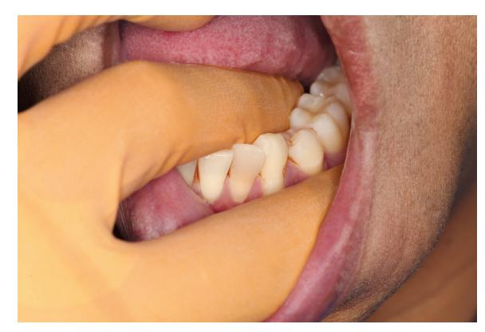

• Fig. 8.62 Extraction of mandibular left posterior teeth. The surgeon's left index finger is positioned in the buccal vestibule, retracting the cheek, and the second finger is positioned in the lingual vestibule, retracting the tongue. The thumb is positioned under the chin. The mandible is grasped between the fingers and the thumb to provide support during extraction.

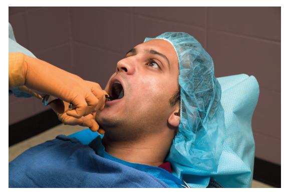

• Fig. 8.63 A rubber bite block can be placed between the patient's teeth on the contralateral side to provide support for the mandible and prevent excessive temporomandibular joint pressures.

### **Anterior Teeth**

-   **Forceps:** No. 151 (lower universal), No. 151A, or Ashe forceps.
-   **Anatomy:** Incisor roots are thin and prone to fracture. Canines are longer and heavier.
-   **Technique:** Use equal labial and lingual pressures. Rotational movement can be used once the tooth is mobile. Deliver in a labial-incisal direction.

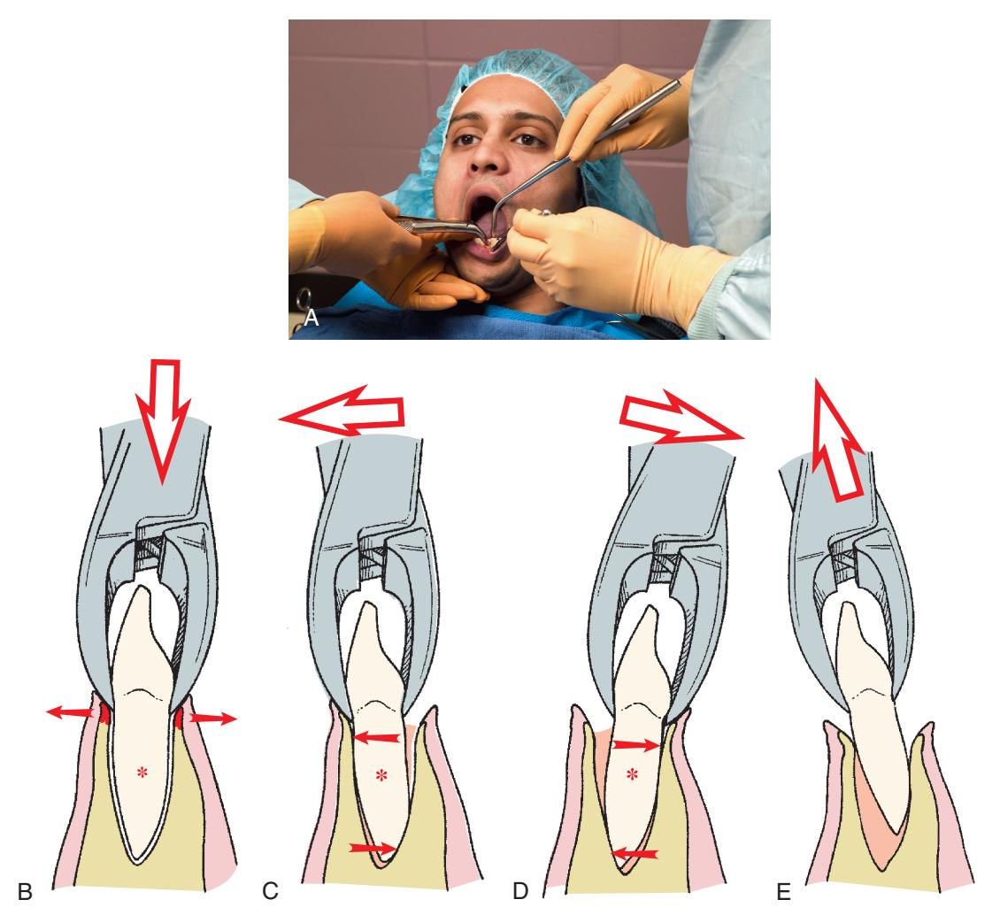

• Fig. 8.64 (A) When extracting mandibular anterior teeth, No. 151 forceps are used. The assistant retracts the patient's cheek and provides suction. (B) The forceps are seated apically as far as possible. (C) Moderate labial pressure is used to initiate the luxation process. (D) Lingual force is used to continue the expansion of bone. (E) The tooth is delivered in the labial-incisal direction. *Asterisk* notes the center of rotation.

### **Premolars**

-   **Forceps:** No. 151, No. 151A, or English-style forceps.
-   **Anatomy:** Straight, conical roots that rarely fracture.
-   **Technique:** Use buccal, lingual, and rotational movements. Rotational force is very effective for this tooth. Deliver in an occlusobuccal direction.
    > Careful preoperative radiographic assessment for apical root curvature is critical. If curvature exists, rotational movements should be reduced or eliminated to prevent fracture.

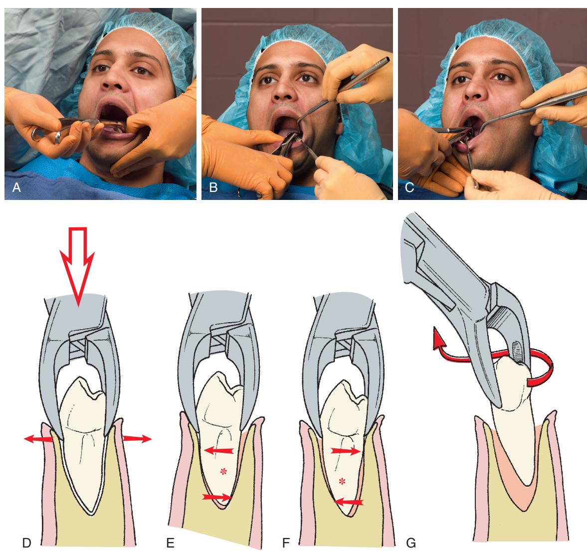

• Fig. 8.65 (A) Extraction of the mandibular premolar. The mandible is stabilized, soft tissue is retracted, and No. 151 forceps are positioned. (B) The hand position is modified slightly for the behind-the-patient technique. (C) English-style forceps can also be used. (D) The forceps are seated apically as far as possible to displace the center of rotation and to begin the expansion of crestal bone. (E) Buccal forceps are applied to begin the luxation process. (F) Slight lingual pressure is used. (G) The tooth is delivered with a rotational, tractional force. *Asterisk* notes the center of rotation.

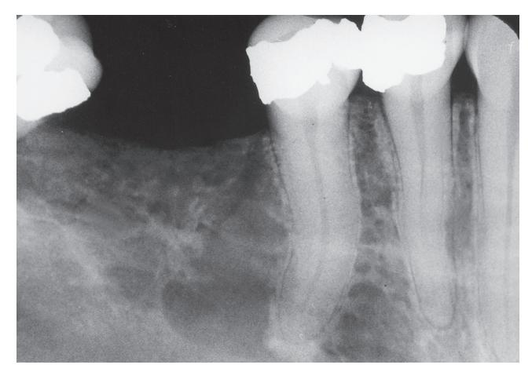

• Fig. 8.66 If any curvature of the premolar root exists, rotational extraction forces will result in fracture of the curved portion of the root; therefore such forces should be minimized.

### **Molars**

-   **Forceps:** No. 17, No. 23 (cowhorn), or No. 222 (for third molars).
-   **Anatomy:** First molars typically have two widely divergent roots. Second molar roots are less divergent.
-   **Technique (No. 17 Forceps):** Use strong buccolingual motion to expand the socket. Deliver in a bucco-occlusal direction. For second molars, stronger lingual pressure can be used as the linguoalveolar bone is thinner.

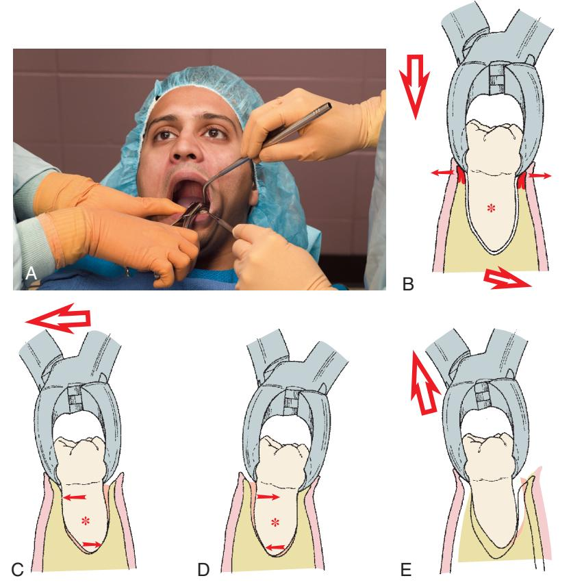

• Fig. 8.67 (A) Mandibular molars are extracted with No. 17 or No. 23 forceps. The hand positions of the surgeon and the assistant are the same for both forceps. (B) No. 17 forceps are seated as far apically as possible. (C) Luxation of the molar is begun with a strong buccal movement. (D) Strong lingual pressure is used to continue the luxation. (E) The tooth is delivered in the bucco-occlusal direction. *Asterisk* notes the center of rotation.

-   **Technique (No. 23 Cowhorn Forceps):**
    1.  Position beaks to engage the bifurcation.
    2.  Squeeze handles to drive the beaks into the bifurcation, which exerts traction.
    3.  Use buccolingual movements to expand the bone, then squeeze the handles more.
    > Care must be taken to prevent damaging maxillary teeth as the lower molar may suddenly pop out.

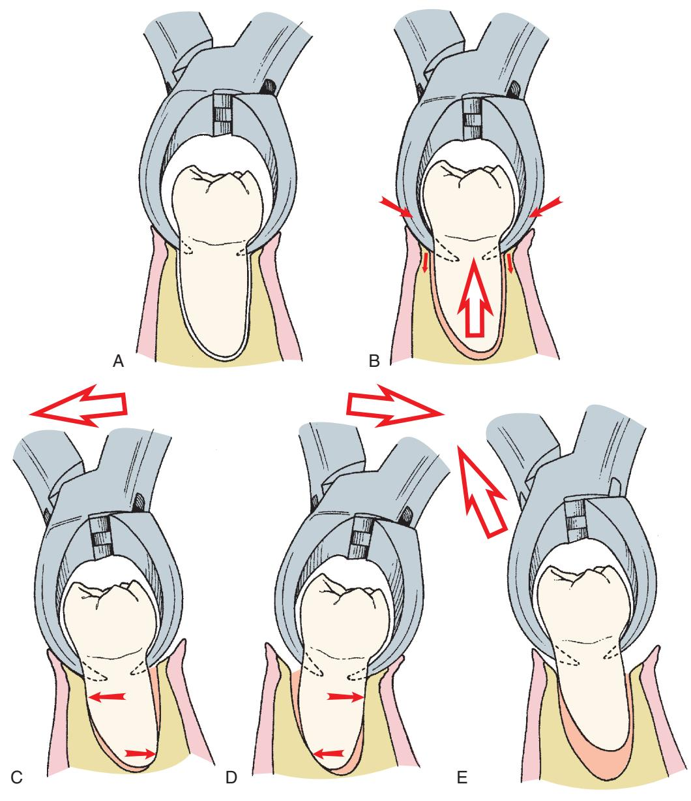

• Fig. 8.68 (A) No. 23 forceps are carefully positioned to engage the bifurcation area of the lower molar. (B) The handles of the forceps are squeezed forcibly together, which causes the beaks of the forceps to be forced into the bifurcation and exerts tractional forces on tooth. (C) Strong buccal forces are then used to expand the socket. (D) Strong lingual forces are used to luxate the tooth further. (E) The tooth is delivered in the bucco-occlusal direction with buccal and tractional forces.

-   **Erupted Mandibular Third Molar:**
    -   **Forceps:** No. 222.
    -   **Anatomy:** Usually has fused, conical roots. Lingual plate is thinner than the buccal.
    -   **Technique:** Use a straight elevator for initial luxation. Direct most extraction forces lingually and deliver in a linguo-occlusal direction.

# **Modifications for Extraction of Primary Teeth**

-   **Caution:** Exercise extreme care, as primary tooth roots are long, delicate, and prone to fracture, especially when partially resorbed by the underlying permanent tooth.
-   **Forceps:** Use smaller versions of universal forceps (No. 150S and No. 151S).
-   **Luxation:** Apply slow, steady buccal and lingual pressures. Use rotational motions minimally.
-   **Root Embrasure:** If primary molar roots embrace the permanent premolar crown, consider sectioning the tooth to avoid dislodging the permanent tooth.
-   **Post-extraction:** Carefully inspect the socket for any remaining small tooth fragments.

# **Postextraction Tooth Socket Care**

-   **Debridement:**
    -   Curette the socket only if a periapical lesion is visible on the radiograph and did not come out with the tooth, or if there is obvious debris (amalgam, calculus) in the socket.
    -   > If neither a periapical lesion nor debris is present, *do not curette* the socket. Remnants of periodontal ligament and bleeding bony walls are best for rapid healing. Vigorous curettage causes additional injury and delays healing.
-   **Compress Buccolingual Plates:** Use firm but gentle finger pressure to return the expanded bony plates to their original configuration. This helps prevent bony undercuts.
    > Do not overreduce if implant placement is planned or possible; in some cases, no reduction should be done.
-   **Granulation Tissue Removal:** If teeth were removed for periodontal disease, remove excess granulation tissue from the gingival cuff with a curette, scissors, or hemostat to prevent bothersome postoperative bleeding.
-   **Sharp Bony Projections:** Palpate the alveolar bone through the mucosa. If sharp edges exist, reflect the mucosa and smooth them with a bone file or rongeur.
-   **Hemorrhage Control:**
    1.  Place a folded, moistened $2 \times 2$ inch gauze directly over the socket.
    2.  Instruct the patient to bite firmly to apply direct pressure to the socket for hemostasis.
    3.  > If gauze is placed only on the occlusal table, pressure on the bleeding socket is insufficient.

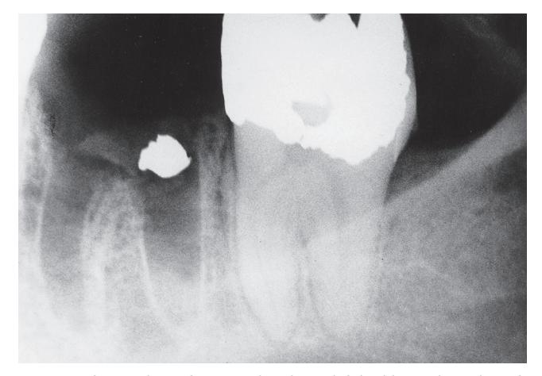

• Fig. 8.69 An amalgam fragment has been left in this tooth socket after extraction because the surgeon failed to inspect and debride the surgical field.

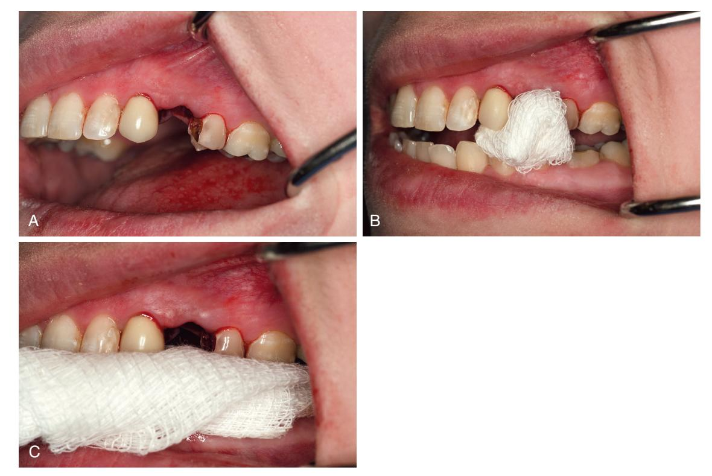

• **Fig. 8.70** (A) After extraction of a single tooth, a small space exists where the crown of the tooth was located. (B) A gauze pad ( $2 \times 2$  inch) is folded in half twice and placed into the space. When the patient bites on the gauze, pressure is transmitted directly to the gingiva and the socket. (C) If a large piece of gauze is used, the pressure goes on teeth, not on the gingiva or the socket.