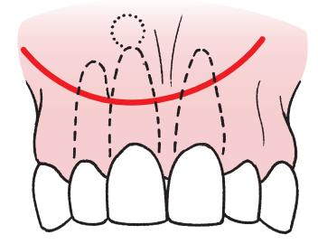
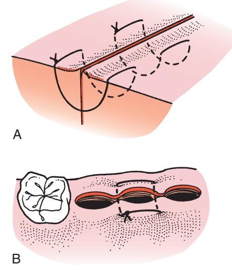
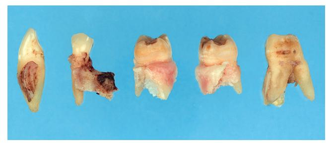
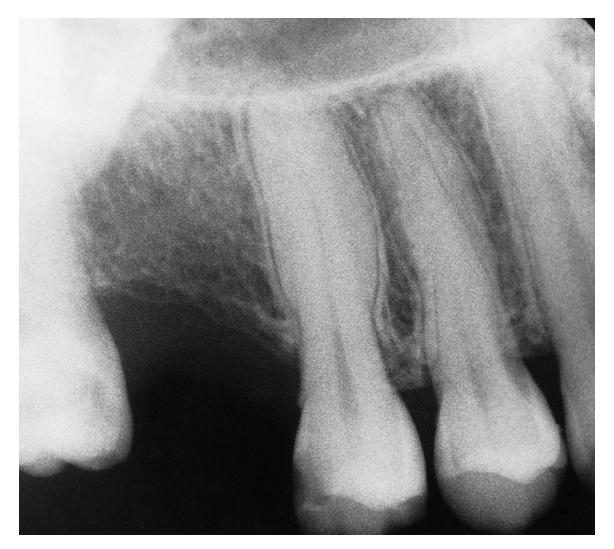
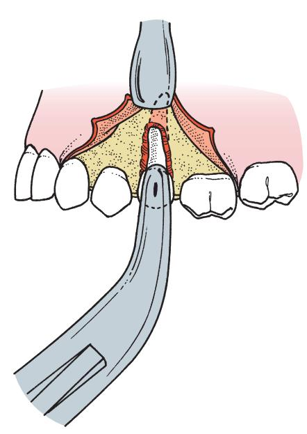
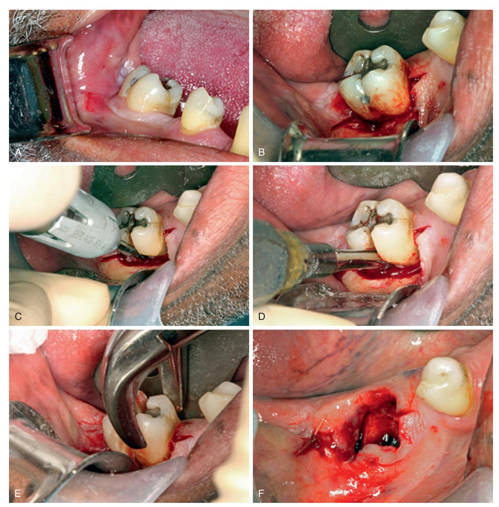

# 9 Principles of More Complex Exodontia

JAMES R. HUPP

### CHAPTER OUTLINE

### Principles of Flap Design, Development, and Management

Management, 135 Design Parameters for Soft Tissue Flaps, 135 Types of Mucoperiosteal Flaps, 137 Developing a Mucoperiosteal Flap, 137 Principles of Suturing, 139

### Principles and Techniques for Open Extractions, 144 Indications for Open Extraction, 145

Technique for Open Extraction of a Single-Rooted Tooth, 147

Technique for Open Extraction of Multirooted Teeth, 149 Removal of Root Fragments and Tips, 153 Justification for Leaving Root Fragments, 156

#### Multiple Extractions, 157

Treatment Planning, 157 Extraction Sequencing, 157 Technique for Multiple Extractions, 157

The removal of most erupted teeth can be achieved by closed delivery, but occasionally these techniques do not provide adequate surgical access. The open or surgical extraction technique is the method used when greater access is necessary to safely remove a tooth or its remaining roots. In addition, removal of multiple teeth during one surgical session requires more than the routine techniques of tooth removal described in Chapter 8. In addition, the surgical approach for extractions is commonly required for recontouring and smoothing bone after multiple extractions.

This chapter discusses techniques for surgical tooth extraction. The principles of flap design, development, management, and suturing are explained, as are the principles of open extraction of single-rooted and multirooted teeth. The principles involved in multiple extractions and concomitant alveoloplasty are also discussed.

# Principles of Flap Design, Development, and Management

The word *flap*, when used to describe a surgical procedure, indicates an area of tissue that will be surgically moved from one site in the body to another or temporarily moved to improve surgical access. Flapped tissue can be comprised of soft tissue only or can include bone and/or other tissues to be relocated. Oral-maxillofacial surgeons often create flaps that contain bone and adjacent soft tissues to reconstruct the jaws (see Chapter 29).

*Flap*, as used in this chapter, indicates a section of soft tissue that (1) is outlined by a surgical incision, (2) carries its own blood supply, (3) allows surgical access to underlying tissues, (4) can be replaced in the original position, and (5) is maintained with sutures. Soft tissue flaps are frequently used in oral surgical, periodontal, and endodontic procedures to gain access to underlying tooth and bone structures. The dental surgeon routinely extracting teeth must have a clear understanding of the principles of design, development, and management of soft tissue flaps.

### Design Parameters for Soft Tissue Flaps

To provide adequate exposure and promote proper healing, the flap must be correctly designed. The surgeon must remember that several parameters exist when designing a flap that vary based on the clinical situation.

When the flap is outlined, the base of the flap must usually be broader than the free margin to preserve an adequate blood supply. This means that all areas of the flap must have a source of uninterrupted vasculature to prevent ischemic necrosis of the entire flap or portions of it (Fig. 9.1).

When flaps are used to gain surgical access, they must be of adequate size for several reasons. Sufficient soft tissue reflection is required to provide excellent visualization of the surgical site. Adequate access also must exist for the insertion of instruments required to perform the surgery. In addition, the flap must be held out of the surgeon's line of sight by a retractor that should rest on intact bone. There must be enough flap reflection to permit the retractor to hold the flap without tension. Furthermore, soft tissue heals across the incision, not along the length of the incision, and sharp incisions heal more rapidly than torn tissue. Therefore a long, straight incision with adequate flap reflection heals more rapidly than a short, torn incision, which heals slowly by secondary intention. For an envelope flap to be of adequate size, the length of the flap in the anteroposterior dimension usually extends two teeth anterior and one tooth posterior to the area of surgery (Fig. 9.2A). Alternatively, if an anterior releasing incision is planned, the flap only needs to extend one tooth anterior and one tooth posterior to the tooth or teeth planned to be removed (Fig. 9.2B).

Flaps for tooth removal should be full-thickness mucoperiosteal flaps. This means that the flap includes the surface mucosa, the submucosa, and the periosteum. Because the goal of the surgery is to remove or reshape bone, all overlying tissue must be reflected from it. In addition, full-thickness flaps are necessary because the periosteum is the primary tissue responsible for bone healing, and

• Fig. 9.1 (A) The flap must have a base that is broader than the free gingival margin. (B) If the flap is too narrow at its base, blood supply may be inadequate, which can lead to flap necrosis.

• **Fig. 9.2** (A) To have sufficient access to root of second premolar, the envelope flap should extend anteriorly, mesial to the canine, and posteriorly, distal to the first molar. (B) If a releasing incision (i.e., three-cornered flap) is used, the flap extends mesial to the first premolar.

• Fig. 9.3 (A) When designing a flap, it is necessary to anticipate how much bone will be removed so that after surgery is completed, the incision rests over sound bone. In this situation, the vertical release was one tooth anterior to bone removal, and left an adequate margin of sound bone. (B) When a releasing incision is made too close to bone removal, delayed healing results.

replacement of the periosteum in its original position hastens that healing process. Also, torn, split, or macerated tissue heals more slowly compared with a cleanly reflected, full-thickness flap. Furthermore, the tissue plane between bone and periosteum is relatively avascular, so less bleeding is produced when a full-thickness flap is elevated.

The incisions that outline the flap must be made over bone that will remain intact after the surgical procedure is complete. If the pathologic condition has eroded the buccocortical plate, the incision should be at least 6 to 8 mm away from it in an area of intact bone. In addition, if bone is to be removed over a particular tooth, the incision must be sufficiently distant from it so that after bone is removed, the incision is 6 to 8 mm away from the bony defect created by surgery. If the incision line is unsupported by intact bone, it tends to collapse into the bony defect, which results in wound dehiscence and delayed healing (Fig. 9.3).

The flap should be designed to avoid injury to local vital structures in the area of the surgery. The two most important structures that can be damaged are located in the mandible; these are the *lingual nerve* and the *mental nerve*. When making incisions in the posterior mandible, especially in the region of the third molar, incisions should be well away from the lingual aspect of the mandible. In the lower third molar area, the lingual nerve may closely adhere to the lingual aspect of the mandible or even run on the superior aspect of the retromolar area. Incisions in this area

may result in damaging or even severing that nerve, with consequent prolonged temporary or permanent anesthesia of part of the tongue. In the same way, surgery in the apical area of mandibular premolar teeth should be carefully planned and executed to avoid injury to the mental nerve. Envelope incisions should be used, if at all possible, and releasing incisions should be well anterior or posterior from where the mental nerve exits the mandible.

Flaps in the maxilla rarely endanger any vital structures. On the facial aspect of the maxillary alveolar process there are no nerves or arteries that are likely to be damaged. When reflecting a palatal flap, the surgeon must remember that the major blood supply to the palatal soft tissue comes through the greater palatine artery, which emerges from the greater palatine foramen at the posterior lateral aspect of the hard palate. This artery courses forward and overlaps, to some degree, with the nasopalatine artery. The nasopalatine nerves and arteries exit the incisive foramen to supply the anterior palatal gingiva. If the anterior palatal tissue must be reflected, the artery and the nerve can be incised at the level of the foramen without serious consequences. In the area of the incisive neurovascular bundle, the likelihood of bothersome bleeding is small, and the nerve typically regenerates. The temporary numbress usually does not bother the patient. However, vertical-releasing incisions in the posterior aspect of the palate should be avoided because they usually sever the greater palatine artery within the tissue, which results in pulsatile bleeding that may be difficult to control.

Α

Releasing incisions are used only when necessary and not routinely. Envelope incisions usually provide the adequate visualization required for tooth extraction in most areas. When verticalreleasing incisions are necessary, only a single vertical incision is usually required, which is usually at the anterior end of the envelope component. The vertical-releasing incision is not a straight vertical incision but an oblique incision, allowing the base of the flap to be broader than the free gingival margin. A vertical-releasing incision is made so that it does not cross bony prominences such as the canine eminence; to do so would increase the likelihood of tension in the suture line, which could result in wound dehiscence.

Vertical-releasing incisions should cross the free gingival margin at the line angle of a tooth and should not be directly on the facial aspect of the tooth, nor should it be directly in the papilla (Fig. 9.4). Incisions that cross the free margin of the gingiva directly over the facial aspect of the tooth do not heal properly because of tension; the result is a defect in the attached gingiva. Because facial bone around teeth is frequently thin, such incisions also result in vertical clefting of the bone. Incisions that cross the gingival papilla damage the papilla unnecessarily and increase the chances for localized periodontal problems; such incisions should be avoided.

### Types of Mucoperiosteal Flaps

A variety of intraoral tissue flaps exists. The most common incision is the sulcular incision, which, when not combined with a releasing incision, produces the envelope flap. In the dentulous patient, the incision is made in the gingival sulcus down to crestal bone, through the periosteum, and the full-thickness mucoperiosteal flap is reflected apically (see Fig. 9.2A). This flap usually provides sufficient access to perform the necessary surgery.

If the patient is edentulous, the envelope incision is usually made along the scar at the crest of the ridge. No vital structures are found in this area, and the envelope incision can be as long as is required to provide adequate access. The only exception occurs in extremely atrophic mandibles where the inferior alveolar nerve may rest on top of the residual alveolar ridge. Once the incision is made, tissue can be reflected buccally or lingually, as necessary, for recontouring of the ridge or the removal of a mandibular torus. Note that flaps created through a crestal scar require extra care during elevation due to the presence of fibrous tissue in the scar that interferes with elevation.

If the sulcular incision has a vertical-releasing incision, it is a three-cornered flap with corners at the posterior end of the envelope incision, at the inferior aspect of the vertical incision, and at the superior aspect of the vertical-releasing incision (Fig. 9.5). This incision provides greater access with a shorter sulcular incision. When greater access is necessary in an apical direction, especially in the posterior aspect of the mouth, this incision is frequently necessary. The vertical component can be more difficult to close • Fig. 9.4 (A) The correct position for the end of the vertical-releasing incision is at the line angle (mesiobuccal angle in this figure) of the tooth. Likewise, the incision does not cross the canine eminence. Crossing such bony prominences results in increased chance for wound dehiscence. (B) These two incisions are made incorrectly. (1) The incision crosses the prominence over the canine tooth, which increases the risk of delayed healing; the incision through the papilla results in unnecessary damage. (2) The incision crosses the attached gingiva directly over the facial aspect of the tooth, which is likely to result in soft tissue defect as well as periodontal and aesthetic deformities.

• Fig. 9.5 The vertical-releasing incision converts the envelope incision into a three-cornered flap (corners numbered).

and may cause some mildly prolonged healing, but if care is taken when suturing, the healing period is not noticeably lengthened. Placing the first suture at corner number 2 will properly align other parts of the incision, making the placement of the other sutures more straightforward.

The four-cornered flap is an envelope incision with two releasing incisions. Two corners are at the superior aspect of the releasing incision, and two corners are at either end of the envelope component of the incision (Fig. 9.6). Although this flap provides substantial access in areas that have limited anteroposterior dimension, it is rarely indicated. When releasing incisions are necessary, a three-cornered flap usually suffices.

An incision that is used occasionally to approach the root apex is a semilunar incision (Fig. 9.7). This incision avoids trauma to the papillae and gingival margin but provides limited access because the entire root of the tooth is not visible. This incision is most useful for periapical surgery of a limited extent.

An incision useful on the palate is the Y-incision, which is named for its shape. This incision is useful for surgical access to the bony palate for removal of a palatal torus. The tissue overlying a torus is usually thin and must be carefully reflected. The anterolateral extensions of the midline incision are anterior to the region of the canine teeth. The extensions are anterior enough in this position that they do not sever major branches of the greater palatine artery; therefore bleeding is usually not a problem (Fig. 9.8).

### Developing a Mucoperiosteal Flap

Several specific considerations are involved in developing flaps for surgical extractions. The first step is to incise soft tissue to allow reflection of the flap. The No. 15 blade is used on a No. 3 scalpel handle, and it is held in the pen grasp (Fig. 9.9). The blade is held at a slight angle to the tooth, and the incision is made posteriorly to anteriorly in the gingival sulcus by drawing the knife toward the operator. One smooth continuous stroke is used while keeping the knife blade in contact with bone throughout the entire incision (Figs. 9.10 and 9.11).

• Fig. 9.6 Vertical-releasing incisions at the other end of the envelope incision convert the envelope incision into a four-cornered flap (corners numbered).

• Fig. 9.7 Semilunar incision, designed to avoid marginal attached gingiva when working on a root apex. The incision is most useful when only a limited amount of access is necessary.

• **Fig. 9.8** The Y-incision is useful on the palate for adequate access to remove a palatal torus. Two anterior limbs serve as releasing incisions to provide for greater access.

• Fig. 9.9 The scalpel handle is held in a pen grasp for maximal control and tactile sensitivity.

• Fig. 9.10 A No. 15 blade is used to incise the gingival sulcus.

The scalpel blade is an extremely sharp instrument, but it dulls rapidly when it is pressed against bone, such as when making a mucoperiosteal incision. If more than one flap is to be reflected, the surgeon should consider changing blades between incisions.

If a vertical-releasing incision is made, the tissue is apically reflected, with the opposite hand tensing the alveolar mucosa so that the incision can be made cleanly through it. If the alveolar mucosa is not tensed, the knife will not incise cleanly through the mucosa, and a jagged incision will result.

Reflection of the flap begins at a papilla. The sharp end of the No. 9 periosteal elevator begins a reflection (Fig. 9.12). The sharp end is slipped underneath the papilla in the area of the incision and is turned laterally to pry the papilla away from underlying bone. This technique is used along the entire extent of the gingival incision. If it is difficult to elevate the tissue at any one spot, the incision is probably incomplete, and that area should be reincised. Once the entire free edge of the flap has been reflected with the sharp end of the elevator, the broad end is used to reflect the mucoperiosteal flap to the extent desired, taking care to keep the edge of the elevator on bone and under the periosteum.

If a three-cornered flap is used, the initial reflection is accomplished with the sharp end of the No. 9 elevator on the first papilla only. Once the flap reflection is started, the broad end of the periosteal elevator is inserted at the middle corner of the flap, and the dissection is carried out with a pushing stroke, posteriorly and apically. This facilitates the rapid and atraumatic reflection of the soft tissue flap (Fig. 9.13).

Once the flap has been reflected as desired, the periosteal elevator can be used as a retractor to hold the flap in its proper reflected position. To accomplish this effectively, the elevator is held perpendicular to the bone tissue while resting on sound bone and not trapping soft tissue between the retractor and bone. The periosteal elevator is therefore maintained in its proper position, and the soft tissue flap is held without tension (Fig. 9.14). The Seldin elevator, or the Minnesota or Austin retractors, can be used in a similar manner when broader exposure is necessary. The retractor should not be forced against soft tissue in an attempt to pull tissue out of the field. Instead, the retractor is positioned in the proper place and held firmly against bone. By retracting in this fashion, the surgeon primarily focuses on the surgical field rather

• Fig. 9.11 (A) The knife is angled slightly away from the tooth and incises soft tissue, including the periosteum, at crestal bone. (B) The incision is started posteriorly and is carried anteriorly, with care taken to incise completely through the interdental papilla.

• Fig. 9.12 The reflection of the flap is begun by using the sharp end of the periosteal elevator to pry away the interdental papilla.

• **Fig. 9.14** A periosteal elevator is used to retract the mucoperiosteal flap. The elevator is placed perpendicular to the bone and held in place by pressing firmly against the bone, not by pushing it apically against soft tissue. Notice the vertical releasing incision located at the distal line angle of tooth #9.

than on the retractor; thus the chance of inadvertently tearing the flap is lessened.

### Principles of Suturing

Once the surgical procedure is completed and the wound is properly irrigated and debrided, the surgeon must return the flap to its original position or, if necessary, place it in a new position; the flap should be held in place with sutures. Sutures perform multiple functions. The most obvious and important function that sutures perform is to coapt wound margins; that is, to hold the flap in position and approximate the opposing wound edges. The sharper the incision and the less trauma inflicted on the wound margin, the more probable healing occurs by primary intention. If the space between the two wound edges is minimal, wound healing will be rapid and complete. If tears or excessive trauma to the wound edges occur, wound healing will need to occur by secondary intention.

• Fig. 9.13 When a three-cornered flap is used, only the anterior papilla is reflected with the sharp end of the elevator. The broad end is then used with a push stroke to elevate posterosuperiorly.

Sutures also aid in hemostasis. If underlying tissue is bleeding, the surface mucosa or skin should not be closed because continued bleeding may result in the formation of a hematoma. Surface sutures aid in hemostasis but only as a tamponade in a generally oozing area, such as a tooth socket. Overlying tissue should never be sutured tightly in an attempt to gain hemostasis in a bleeding tooth socket.

Sutures help hold a soft tissue flap over bone. This is an important function because bone that is not covered with soft tissue becomes nonvital and requires an excessively long time to heal. When mucoperiosteal flaps are reflected from alveolar bone, it is important that the extent of the bone be recovered with soft tissue flaps. Unless appropriate suture techniques are used, the flap may retract away from bone, exposing it and resulting in delayed healing.

Sutures may aid in maintaining a blood clot in the alveolar socket. A special suture, such as a figure-of-eight, can provide a barrier to clot displacement (Fig. 9.15). However, it should be emphasized that suturing across an open wound socket plays a minor role in maintaining a blood clot in the tooth socket.

The armamentarium for suturing includes a needle holder, a suture needle, and suture material. The needle holder of choice is 15 cm (about 6 inches) in length and has a locking handle. The needle holder is held with the thumb and ring finger through the rings and with the index finger along the length of the needle holder to provide stability and control (Fig. 9.16).

The suture needle usually used in the mouth is a small threeeighths to one-half circle with a reverse cutting edge. The cutting edge helps the needle readily pass through the tough mucoperiosteal flap tissue. Needle sizes and shapes have been assigned numbers. The most common needle shapes used for oral surgery are the three-eighths and half-circle cutting needles (Fig. 9.17).

The technique used for suturing is deceptively difficult. The use of the needle holder and the technique that is necessary to pass the curved needle through tissue are difficult to learn. The following discussion presents the technique used in suturing; practice is necessary before suturing can be performed with skill and finesse.

When an envelope flap is repositioned into its correct location, it is held in place with sutures that are placed through the papillae only. Sutures are not placed across the empty tooth socket because the edges of the wound would not be supported over sound bone (Fig. 9.18). When reapproximating the flap, the suture is passed first through mobile (usually facial) tissue; the needle is regrasped with the needle holder and is passed through the attached tissue of the lingual papilla. Note that the tip of the needle should never be grasped by the needle holders. If the two margins of the wound

• Fig. 9.15 (A) Figure-of-eight suture occasionally placed over the top of the socket to aid in hemostasis. (B) This suture is usually performed to help maintain a piece of oxidized cellulose in the tooth socket.

are close together, the experienced surgeon may be able to insert the needle through both sides of the wound in a single pass. However, for better precision, it is best to use two passes in most situations (Fig. 9.19).

When passing the needle through tissue, the needle should enter the surface of the mucosa at the right angle, to make the smallest possible hole in the mucosal flap (Fig. 9.20). If the needle passes through tissue obliquely, the suture will tear through the surface layers of the flap when the suture knot is tied, which results in greater injury to soft tissue. In addition, if the needle does not

• Fig. 9.16 (A) The needle holder is held with the thumb and ring finger. (B) The index finger extends along the instrument for stability and control.

• Fig. 9.17 The shapes and types of needles most commonly used in oral surgery are the three-eighths circle and half-circle cutting needles shown here. *Top*, PS-2. *Middle*, FS-2. *Bottom*, X-1.

• Fig. 9.18 (A) The flap held in place with sutures in papillae. (B) Cross-sectional view of suture.

enter and exit a similar amount of tissue along both sides of the incision, the wound edges will not properly align.

When passing the needle through the flap, the surgeon must ensure that an adequate amount of tissue is taken to prevent the needle or suture from pulling through the soft tissue flap. Because the flap being sutured is a mucoperiosteal flap, it should not be tied too tightly. The minimal amount of tissue between the suture and the edge of the flap should be 3 mm. Once the sutures are passed through the mobile flap and the immobile lingual tissue, they are tied with an instrument tie (Fig. 9.21).

The surgeon must remember that the purpose of the suture is merely to reapproximate the tissue; therefore the suture should not be tied too tightly. Sutures that are too tight cause ischemia of the flap margin and result in tissue necrosis, with eventual tearing of the suture through tissue. Thus sutures that are too tightly tied result in wound dehiscence more frequently compared with sutures that are loosely tied. As a clinical guideline, there should be no blanching or obvious ischemia of the wound edges after a suture is tied. If this occurs, the suture should be removed and replaced. The knot should be positioned so that it does not fall directly over the incision line because this causes additional pressure on the incision. Therefore the knot should be positioned to the side of the incision, usually toward the facial or buccal aspect of the incision.

• rg. **7.19** when the induces a hap is back in position, the suttile is passed through two sides of the socket in separate passes of the needle. (A) The needle is held by the needle holder and passed through the papilla, usually that of mobile elevated tissue first. (B) The needle holder is then released from the needle; it regrasps the needle on the underside of tissue and is turned through the flap with care taken to never grasp the needle's tip. (C) The needle is then passed through the opposite side of soft tissue papilla in similar fashion. (D) Finally, the needle holder grasps the needle on the opposite side to complete the passing of the suture through both sides of the mucosa.

• Fig. 9.20 (A) When passing through the soft tissue of mucosa, the needle should enter the surface of tissue at a right angle. (B) The needle holder should be turned so the needle passes easily through tissue at a right angle. (C) If the needle enters soft tissue at an acute angle and is pushed (rather than turned) through tissue, tearing of the mucosa with the needle or with the suture is likely to occur (D).

• Fig. 9.21 Most intraoral sutures are tied with an instrument tie. (A) The suture is pulled through tissue until the short tail of the suture (approximately 1 to 2 cm long) remains. The needle holder is held horizontally by the right hand in preparation for the knot-tying procedure. (B) The left hand then wraps the long end of the suture around the needle holder twice in the clockwise direction to make two loops of suture around the needle holder. (C) The surgeon then opens the needle holder and grasps the short end of the suture very near its end. (D) The ends of the suture are then pulled to tighten the knot. The needle holder should not pull the suture it is holding at all until the knot is nearly tied to avoid lengthening that portion of the suture. Most intraoral sutures are tied with an instrument tie.

Downloaded for Tommy Tran (122427@kasascity.edu) at Kansas City University from ClinicalKey.com by Elsevier on September 12, 2025. For personal use only. No other uses without permission. Copyright ©2025. Elsevier Inc. All rights reserved.

• Fig. 9.21, cont'd (E) End of the first step of the surgeon's knot. The double wrap has resulted in a double overhand knot. This increases the friction in the knot and will keep the wound edges together until the second portion of the knot is tied. (F) The needle holder is then released from the short end of the suture and held in the same position as when the knot-tying procedure began. The left hand then makes a single wrap in the counterclockwise direction. (G) The needle holder then grasps the short end of the suture at its end. (H) This portion of the knot is completed by pulling this loop firmly down against the previous portion of the knot. (I) This completes the surgeon's knot. The double loop of the first pass holds tissue together until the second portion of the square knot can be tied. (J) Most surgeons add a third throw to their instrument tie when using a resorbable suture material. The needle holder is repositioned in the original position, and one wrap is placed around the needle holder in the original clockwise direction. The short end of the suture is grasped and tightened down firmly to form the second square knot. (K) The final throw of three knots is tightened firmly. (*Note:* For demonstration purposes, the first knot is left loose here, but in actual knot tying, the first knot is tightened before creating the second knot.) Both ends of the suture are then cut, leaving about 1 cm or less of the suture end with the knot.

Once the knot securing a suture is tied, the surgeon or assistant should use suture scissors to cut the ends of the suture. The person cutting the suture should use the tips of the scissors to do the cutting so that the person can see that nothing beyond the suture is being cut. The length of the ends to leave varies, depending on the circumstances. In most situations in which the oral mucosa is being sutured, the ends of the suture should be left no longer than 1 cm.

If a three-cornered flap is used, the vertical end of the incision must be closed separately. Two sutures usually are required to close the vertical end properly. Before the sutures are inserted, the No. 9 periosteal elevator should be used to slightly elevate the nonflap side of the incision, freeing the margin to facilitate passage of the needle through the tissue (Fig. 9.22). The first suture is placed across the papilla, where the vertical release incision was made. This is an easily identifiable landmark that is most important when repositioning a three-cornered flap. The remainder of the envelope portion of the incision is then closed, after which the vertical component is closed. The slight reflection of the nonflap side of the incision greatly eases the placing of sutures.

Sutures may be configured in several different ways. The routine interrupted suture is the one most commonly used in the oral cavity. This suture goes through one side of the wound, comes up through the other side of the wound, and is tied in a knot at the top. These sutures can be placed quickly, and the tension on each suture can be adjusted individually. If one suture is lost, the remaining sutures stay in position.

A suture technique that is useful for suturing two adjacent papillae with a single suture is the horizontal mattress suture (Fig. 9.23). A slight variation of that suture is the figure-of-eight suture, which holds the two papilla in position and puts a cross over the top of the socket that may help hold the blood clot or procoagulant materials in position (see Fig. 9.15).

If the incision is long, continuous sutures can be used to efficiently accomplish the closure. When using this technique, a knot does not have to be made for each suture, which makes it quicker to suture a long-span incision and leaves fewer knots to collect debris and to bother the patient's tongue. The continuous simple suture can be locking or nonlocking (Fig. 9.24). The horizontal mattress suture also can be used in a running fashion. A disadvantage of the continuous suture is that if one suture pulls through, the entire suture line becomes loose.

Nonresorbable sutures are left in place for approximately 5 to 7 days. After this time, sutures play no useful role and increase the contamination of the underlying submucosa. The suture is cut with the tips of a sharp, pointed pair of suture scissors and is removed by being pulled toward the incision line (not away from the suture line).

# Principles and Techniques for Open Extractions

The surgical or open extraction of an erupted tooth using a flap is a technique that should not be reserved for the extreme situation. A prudently used open extraction technique may be more conservative, cause less operative morbidity, and be quicker to perform compared with a closed extraction. Forceps extraction techniques, which require great force, may result in removal not only of the tooth but also of large amounts of adjacent bone and occasionally the floor of the maxillary sinus (Fig. 9.25). The bone loss may be less if a soft tissue flap is reflected and a proper amount of bone is removed; it may also be less if the tooth is sectioned (cut into smaller sections). The morbidity of fragments of bone that may be literally torn from the jaw by the "conservative" closed technique

• **Fig. 9.22** (A) To make the suturing of the three-cornered flap easier, a periosteal elevator is used to elevate a small amount of fixed tissue so that the suture can be passed through the entire thickness of the mucoperiosteum. (B) When the three-cornered flap is repositioned, the first suture is placed at the occlusal end of the vertical-releasing incision (1). The papillae are then sutured sequentially (2, 3), and finally, if necessary, the superior aspect of the releasing incision is sutured (4).

• Fig. 9.23 (A) A horizontal mattress suture is sometimes used to close soft tissue wounds. The use of this suture decreases the number of individual sutures that have to be placed; however, more importantly, this suture compresses the wound together slightly and everts the wound edges. (B) A single horizontal mattress suture can be placed across both papillae of the tooth socket and serves in a similar way as do two individual sutures.

• Fig. 9.24 When multiple sutures are to be placed, the incision can be closed with running or continuous sutures. (A) The first papilla is closed and the knot tied the usual way. The long end of the suture is held, and the adjacent papilla is sutured without the knot being tied, but just with the suture being pulled firmly through tissue. (B) Succeeding papillae are then sutured until the final one is sutured and the final knot is tied. The final appearance is with the suture going across each empty socket. (C) A continuous locking suture can be made by passing the long end of the suture underneath the loop before it is pulled through tissue. (D) This puts the suture on the deep periosteal and mucosal surfaces directly across the papilla and may aid in more direct apposition of tissues.

Fig. 9.25 Forceps extraction of these teeth resulted in removal of bone and the tooth instead of just the tooth.

can greatly exceed the morbidity of a properly done surgical extraction.

### Indications for Open Extraction

It is prudent for the surgeon to carefully evaluate each patient and each tooth to be removed for the possibility of an open extraction. Although the decision is to perform a closed extraction in the vast majority of cases, the surgeon must be continually aware that open extraction may be the less traumatic of the two in some situations.

As a general guideline, surgeons should consider performing an elective surgical extraction when they anticipate the possible need for excessive force to extract a tooth. The term *excessive* means that the force will probably result in a fracture of bone, a tooth root, or both. In any case, excessive bone loss, the need for additional surgery to retrieve the root, or both can cause undue tissue damage. The following are examples of situations in which closed extraction may require excessive force.

The surgeon should seriously consider performing an open extraction after initial attempts at forceps extraction have failed. Instead of applying greater amounts of force that may be less

controlled, the surgeon should instead reflect a soft tissue flap, section the tooth, remove some bone, if needed, and extract the tooth in sections. In these situations, the philosophy of "divide and conquer" results in the most efficient and least traumatic extraction.

If the preoperative assessment reveals that the patient has thick or especially dense bone, particularly of the buccocortical plate, surgical extraction should be considered. The extraction of most teeth depends on the expansion of the buccocortical plate. If this bone is especially thick, then adequate expansion is less likely to occur and fracture of the root is more likely. Young patients have bone that is more elastic and more likely to expand with controlled force, whereas older patients usually have denser, more highly calcified bone that is less likely to provide adequate expansion during luxation of the tooth. Dense bone in the older patient warrants even more caution.

Occasionally, the dentist treats a patient who has very short clinical crowns with evidence of severe attrition. If such attrition is the result of bruxism, it is likely that teeth are surrounded by dense, thick bone with strong periodontal ligament attachments (Fig. 9.26). The surgeon should exercise extreme caution if removal of such teeth is attempted with a closed technique. An open technique usually results in a quicker, more straightforward extraction.

Careful review of the preoperative radiographs may reveal tooth roots that are likely to cause difficulty if the tooth is extracted by the standard forceps technique. One condition commonly seen among older patients is hypercementosis. In this situation, cementum has continued to be deposited on the tooth and has formed a large bulbous root that is difficult to remove through the available tooth socket opening. Great force used to expand the bone may result in fracture of the root or the buccocortical bone (Fig. 9.27).

Roots that are widely divergent, especially maxillary first molar roots (Fig. 9.28) or roots that have severe dilaceration or hooks, are also difficult to remove without fracturing one or more of the

• Fig. 9.26 Teeth that exhibit evidence of bruxism may have denser bone and stronger periodontal ligament attachment, which make them more difficult to extract.

• Fig. 9.27 Hypercementosis of the root makes forceps delivery difficult.

roots (Fig. 9.29). By reflecting a soft tissue flap and dividing the roots prospectively with a burr, a more controlled and planned extraction can be performed with less damage overall.

If the maxillary sinus has pneumatized to include the roots of the maxillary molars, extraction may result in removal of a portion of the sinus floor along with the tooth. If the roots are divergent, then such a situation is even more likely to occur (Fig. 9.30). Surgical extraction is again indicated.

Teeth that have crowns with extensive caries, especially root caries that have large amalgam restorations, or endodontically treated molars are good candidates for open extraction (Fig. 9.31). Although forceps should primarily grasp the tooth root, a portion of the force is applied to the crown. Such pressures can crush and shatter the crowns of teeth with extensive caries, large restorations, or prior endodontic treatment. Open extraction can circumvent the need for extensive force and result in a quicker, less traumatic extraction. Teeth with crowns that have already been lost to caries and that present as retained roots should also be considered for

• Fig. 9.29 Severe dilaceration of roots may result in fracture of the root unless surgical extraction is performed.

• Fig. 9.28 Widely divergent roots increase the likelihood of fracture of bone, tooth root, or both.

• Fig. 9.30 Maxillary molar teeth "in" the floor of the maxillary sinus increase the chances of fracture of the sinus floor with resulting sinus perforation.

• Fig. 9.31 Large caries or large restorations may lead to fracture of the crown of the tooth and thus to a more difficult extraction.

open extraction. If extensive periodontal disease is found around such teeth, it may be possible to deliver them easily with straight elevators or Cryer elevators. However, if bone around the tooth is firm and no periodontal disease exists, the surgeon should consider an open extraction.

### Technique for Open Extraction of a Single-Rooted Tooth

The technique for open extraction of a single-rooted tooth is straightforward but requires attention to detail because several decisions must be made during the operation. The technique is essentially the same for single-rooted teeth that have resisted attempts at closed extraction or that have fractured and, therefore, exist only as a root.

The first step is to provide adequate visualization and access by reflecting a sufficiently large mucoperiosteal flap. In most situations, an envelope flap that is extended two teeth anterior and one tooth posterior to the tooth to be removed is sufficient. If a releasing incision is necessary, it should be placed at least one tooth anterior to the extraction site (see Fig. 9.2).

Once an adequate flap has been reflected and is held in its proper position by a periosteal elevator, the surgeon must determine the need for bone removal. Several options are available. First, the surgeon may attempt to reseat the extraction forceps under direct visualization and thus achieve a better mechanical advantage and remove the tooth with no surgical bone removal at all (Fig. 9.32).

The second option is to grasp a bit of buccal bone under the buccal beak of the forceps to obtain a better mechanical advantage

• Fig. 9.32 A small envelope flap can be reflected to expose the fractured root. Under direct visualization, the forceps can be seated more apically into the periodontal ligament space, which eliminates the need for bone removal.

and grasp of the tooth root. This may allow the surgeon to luxate the tooth sufficiently to remove it without any additional bone removal (Fig. 9.33). A small amount of buccal bone is pinched off and removed with the tooth.

The third option is to use the straight elevator, pushing it toward the apex in the periodontal ligament space of the tooth (Fig. 9.34). The index finger of the surgeon's hand must support the force of the elevator so that the total movement is controlled and no slippage of the elevator occurs. A small to-and-fro motion should be used to help expand the periodontal ligament space, which allows the small straight elevator to enter and proceed apically into the space and act as a wedge to displace the root occlusally. This approach continues with the use of larger straight elevators until the tooth is successfully luxated.

The fourth and final option is to proceed with surgical bone removal over the area of the tooth. Most surgeons prefer to use a burr to remove the bone, along with ample irrigation. The width of buccal bone that is removed is essentially the same width as the tooth in a mesiodistal direction (Fig. 9.35). In a vertical dimension, bone should be removed approximately one-half to two-thirds the length of the tooth root (Fig. 9.36). This amount of bone removal sufficiently reduces the amount of force necessary to displace the tooth and makes removal relatively straightforward. A small straight elevator (Fig. 9.37) or forceps can be used to remove the tooth (Fig. 9.38).

If the tooth is still difficult to extract after the removal of bone, a purchase point (indentation into a tooth into which a pointed elevator can be inserted) can be made in the root with the burr at the most apical portion of the area of bone removal (Fig. 9.39). Care should be taken to limit bone removal to only that needed to remove the root to preserve bone for possible implant placement. The purchase point hole should be about 3 mm in diameter and

• Fig. 9.33 If the root is fractured at the level of bone, the buccal beak of the forceps can be used to remove a small portion of bone at the same time that the root is grasped.

• Fig. 9.35 When removing bone from the buccal surface of the tooth or tooth root to facilitate removal of that root, the mesiodistal width of bone removal should be approximately the same as the mesiodistal dimension of the tooth root itself. This allows an unimpeded path for removal of the root in the buccal direction.

• **Fig. 9.36** Bone is removed with a bone-cutting burr after reflection of the standard envelope flap. Bone should be removed approximately one-half to two-thirds the length of the tooth root.

• Fig. 9.34 The small straight elevator can be used like a shoehorn to luxate the broken root. When the straight elevator is used in this position, the hand must be securely supported on adjacent teeth to prevent inadvertent slippage of the instrument from the tooth and subsequent injury to adjacent tissue.

• Fig. 9.37 Once the appropriate amount of buccal bone has been removed, the straight elevator can be used down the palatal aspect of the tooth to displace the tooth root in the buccal direction. It must be remembered that when the elevator is used in this direction, the surgeon's hand must be firmly supported on adjacent teeth to prevent slippage of the instrument and injury to the adjacent soft tissue.

• Fig. 9.38 After bone has been removed and the tooth root luxated with the straight elevator, the forceps can be used to remove the root.

• Fig. 9.39 If the tooth root is solid in bone, buccal bone can be removed, and a purchase point can be made for the insertion of the elevator.

deep enough to allow the insertion of an instrument. A heavy elevator, such as a Crane pick, can be used to elevate or lever the tooth from its socket (Fig. 9.40A). Soft tissue is repositioned and sutured (Fig. 9.40B).

The bone edges should be checked; if they are sharp, they should be smoothed with a bone file. By replacing the soft tissue flap and gently palpating it with a finger, the clinician can check edge sharpness. Removal of bone with a rongeur is rarely indicated because a rongeur tends to remove too much bone in such circumstances.

Once the tooth is delivered, the entire surgical field should be thoroughly irrigated with copious amounts of sterile saline. Special attention should be directed toward the most inferior portion of the flap (where it joins the bone) because this is a common place for debris to settle, especially in mandibular extractions. If the debris is not removed carefully by curettage or irrigation, it can cause delayed healing or even a small subperiosteal abscess in the ensuing 3 to 4 weeks. The flap is then set in its original position and sutured into place with 3-0 black silk or chromic sutures. If

• Fig. 9.40 (A) A triangular elevator, such as the Crane pick, is inserted into the purchase point, and the tooth is elevated from its socket. (B) The flap is repositioned and sutured over intact bone.

the incision was properly planned and executed, the suture line will be supported by healthy, intact bone.

## Technique for Open Extraction of Multirooted Teeth

Once the decision is made to perform an open extraction of a multirooted tooth, such as a mandibular or maxillary molar, the same surgical technique used for the single-rooted tooth is generally used. The major difference is that the tooth may be divided with a burr to convert a multirooted tooth into two or three single-rooted teeth. If the crown of the tooth remains intact, the crown portion is sectioned in such a way as to facilitate removal of roots. However, if the crown portion of the tooth is missing and only the roots remain, the goal is to separate the roots to make them easier to elevate.

Removal of the lower first molar with an intact crown is usually done by sectioning the tooth buccolingually, thereby dividing the tooth into a mesial half (with mesial root and half of the crown) and a distal half. An envelope incision is also made to gain access to the site and protect the soft tissue from the burr. A small amount of crestal bone may be removed. Once the tooth is sectioned, it is luxated with straight elevators to begin the mobilization process. The sectioned tooth is treated as a lower premolar tooth and is removed with a lower universal forceps (Fig. 9.41). The flap is repositioned and sutured.

The surgical technique begins with the reflection of an adequately long envelope flap (Fig. 9.42A–B). Evaluation of the need for sectioning roots and removing bone is made at this stage, as it was with the single-rooted tooth. Occasionally forceps, elevators, or both are positioned with direct visualization to achieve better

• Fig. 9.41 If the lower molar is difficult to extract, it can be sectioned into single-rooted teeth. (A) The envelope incision is reflected, and a small amount of crestal bone is removed to expose the bifurcation. A drill is then used to section the tooth into mesial and distal halves. (B) Lower universal forceps are used to remove the two crown and root portions separately.

mechanical advantage and to remove the tooth without removing bone.

However, in most situations a small amount of crestal bone should be removed and the tooth should be divided. Tooth sectioning is usually accomplished with a straight handpiece with a straight burr such as the No. 8 round burr or with a fissure burr such as the No. 557 or No. 703 burr (Fig. 9.42C) under copious irrigation.

Once the tooth is sectioned, the small straight elevator is used to luxate and mobilize the sectioned roots (Fig. 9.42D). The straight elevator may be used to deliver the mobilized sectioned tooth (Fig. 9.42E). If the crown of the tooth is sectioned, upper or lower universal forceps are used to remove the individual portions of the sectioned tooth (Fig. 9.42F). If the crown is missing, then straight and triangular elevators are used to elevate the tooth roots from the sockets.

Sometimes a remaining root may be difficult to remove and additional bone removal (as is described for a single-rooted tooth) may be necessary. Occasionally it is necessary to prepare a purchase point with the burr and to use an elevator, such as the Crane pick, to elevate the remaining root.

After the tooth and all the root fragments have been removed, the flap is repositioned and the surgical area is palpated for sharp bony edges. If any sharp edges are present, they are smoothed with a bone file. The wound is thoroughly irrigated and debrided of loose fragments of tooth, bone, calculus, and other debris. The flap is repositioned and sutured in the usual fashion.

An alternative method for removing the lower first molar is to reflect the soft tissue flap and remove sufficient buccal bone to expose the bifurcation. Then the burr is used to section the mesial root from the tooth and convert the molar into two single-rooted teeth (Fig. 9.43). The crown with the mesial root intact is extracted with No. 17 lower molar forceps. The remaining distal root is

elevated from the socket with a Cryer elevator. The elevator is inserted into the empty tooth socket and rotated, using the wheeland-axle principle. The sharp tip of the elevator engages the cementum of the remaining root, which is elevated occlusally from the socket. If the interradicular bone is heavy, the first rotation or two of the Cryer elevator removes bone, which allows the elevator to engage the cementum of the tooth on the second or third rotation.

If the crown of the mandibular molar has been lost, the procedure again begins with the reflection of an envelope flap and removal of a small amount of crestal bone. The burr is used to section the two roots into mesial and distal components (Fig. 9.44A). The small straight elevator is used to mobilize and luxate the mesial root, which is delivered from its socket by insertion of the Cryer elevator into the slot prepared by the dental burr (Fig. 9.44B). The Cryer elevator is rotated in the wheel-and-axle manner, and the mesial root is delivered occlusally from the tooth socket. The opposite member of the paired Cryer instruments is inserted into the empty root socket and rotated through the interradicular bone to engage and deliver the remaining root (Fig. 9.44C).

Extraction of maxillary molars with widely divergent buccal and palatal roots that require excessive force to extract can be done more prudently by dividing the root into several sections. This three-rooted tooth must be divided in a pattern different from that of the two-rooted mandibular molar. If the crown of the tooth is intact, the two buccal roots are sectioned from the tooth and the crown is removed along with the palatal root.

The standard envelope flap is reflected, and a small portion of crestal bone is removed to expose the trifurcation area. The burr is used to section off the mesiobuccal and distobuccal roots (Fig. 9.45A). With gentle but firm bucco-occlusal pressure, the upper molar forceps deliver the crown and palatal root along the long axis of the root (Fig. 9.45B). No palatal force should be delivered

• Fig. 9.42 (A) This lower molar has roots that make it necessary to section the tooth. (B) The flap is raised to expose bone and allow sectioning. Note the small releasing incisions on the mesial and distal sides of the tooth. (C) The surgical handpiece with fissure burr used to section tooth into mesial and distal parts, allowing each root to independently be removed. (D) The straight elevator is inserted into the burr cut to complete division of the crown. (E) Each root can now be elevated and removed. (F) The completed procedure with chromic suture closing distal release.

with the forceps to the crown portion because this results in fracture of the palatal root. The entire delivery force should be in the buccal direction. A small straight elevator is then used to luxate the buccal roots (Fig. 9.45C), which can then be delivered with a Cryer elevator used in the usual fashion (Fig. 9.45D) or with a straight elevator. If straight elevators are used, the surgeon should remember that the maxillary sinus might be close to these roots, so apically directed forces must be carefully controlled. The force of the straight elevator should be toward the palate, with more limited pressure applied apically.

If the crown of the maxillary molar is missing or fractured, the roots should be divided into two buccal roots and a palatal root. The same general approach as before is used. An envelope flap is reflected and retracted with a periosteal elevator. A moderate amount of buccal bone is removed to expose the tooth for sectioning (Fig. 9.46A). The roots are sectioned into two buccal roots and a single palatal root. Next, the roots are luxated with a straight elevator and delivered with Cryer elevators, according to the preference of the surgeon (Fig. 9.46B–C). Occasionally, enough access to the roots exists so that a maxillary root forceps or upper universal

• Fig. 9.43 (A) An alternative method of sectioning is to use the burr to remove the mesial root from the first molar. (B) The No. 178 forceps are then used to grasp the crown of the tooth and remove the crown and the distal root. (C) The Cryer elevator is then used to remove the mesial root. The point of the Cryer elevator is inserted into the empty socket of the distal root and turned in a wheel-and-axle fashion with the sharp point engaging interseptal bone and root, elevating the mesial root from its socket.

• Fig. 9.44 (A) When the crown of the lower molar is lost because of fracture or caries, the envelope flap is reflected, and a small amount of crestal bone is removed. A burr is then used to section the tooth into two individual roots. (B) After the small straight elevator has been used to mobilize the roots, the Cryer elevator is used to elevate the distal root. The tip of the elevator is placed into the slot prepared by the burr, and the elevator is turned to deliver the root. (C) The opposite member of the paired Cryer elevators is then used to deliver the remaining tooth root with the same type of rotational movement.

• Fig. 9.45 (A) When an intact maxillary molar must be divided for judicious removal (as when extreme divergence of roots is found), a small envelope incision is made, and a small amount of crestal bone is removed. This allows the burr to be used to section the buccal roots from the crown portion of the tooth. (B) Upper molar forceps are then used to remove the crown portion of the tooth along with the palatal root. The tooth is delivered in the bucco-occlusal direction, and no palatal pressure is used because it would probably cause a fracture of the palatal root from the crown portion. (C) The straight elevator is then used to mobilize the buccal roots and can occasionally be used to deliver these roots. (D) The Cryer elevator can be used in the usual fashion by placing the tip of the elevator into the empty socket and rotating it to deliver the remaining root.

forceps can be used to deliver the roots independently (see Fig. 9.46D). Finally, the palatal root is delivered after the two buccal roots have been removed. Often, much of the interradicular bone is lost by this time; therefore the small straight elevator can be used efficiently. The elevator is directed down the periodontal ligament space on the palatal aspect with gentle, controlled wiggling motions, which causes displacement of the tooth in the bucco-occlusal direction (Fig. 9.46E).

### Removal of Root Fragments and Tips

If fracture of the apical one third (3 to 4 mm) of the root occurs during a closed extraction, an orderly procedure should be used to remove the root tip from the socket. Initial attempts should be made to extract the root fragment by a closed technique, but the surgeon should begin a surgical technique if the closed technique is not immediately successful. Whichever technique is chosen, two requirements for extraction are critically important: (1) excellent light and (2) excellent suction—preferably with a suction tip of small diameter. Removal of a small root tip fragment is difficult unless the surgeon can clearly visualize it. It is also important that an irrigation syringe be available to flush blood and debris from around the root tip so that it can be clearly seen.

The closed technique for root tip retrieval is defined as any technique that does not require reflection of soft tissue flaps and removal of bone. Closed techniques are most useful when the tooth was well luxated and mobile before the root tip fractured. If sufficient luxation occurred before the fracture, the root tip often is mobile and can be removed with the closed technique. However, if the tooth was not well mobilized before the fracture, the closed technique is less likely to be successful. The closed technique is also less likely to be successful if the clinician finds a bulbous hypercementosed root with bony interferences that prevent extraction of the root tip fragment. In addition, severe

• Fig. 9.46 (A) If the crown of the upper molar has been lost to caries or has been fractured from the roots, a small envelope incision is reflected, and a small amount of crestal bone is removed. The burr is then used to section the three roots into independent portions. (B) After the roots have been luxated with the small straight elevator, the mesiobuccal root is delivered with the Cryer elevator placed into the slot prepared by the burr. (C) Once the mesiobuccal root has been removed, the Cryer elevator is again used to deliver the distal buccal root. The tip of the Cryer elevator is placed into the empty socket of the mesiobuccal root and turned in the usual fashion to deliver the tooth root. (D) Maxillary root forceps occasionally can be used to grasp and deliver the remaining root. The palatal root can then be delivered with the straight or Cryer elevator. If the straight elevator is used, it is placed between the root and the palatal bone and gently rotated to and fro in an effort to displace the palatal root in the bucco-occlusal direction. (E) The small straight elevator can be used to elevate and displace the remaining root of the maxillary third molar in the bucco-occlusal direction with gentle to-and-fro motions.

dilaceration of the root end may prevent the use of the closed technique.

Once the fracture has occurred, the patient should be repositioned so that adequate visualization (with proper lighting), irrigation, and suction are achieved. The tooth socket should be irrigated vigorously and suctioned with a small suction tip because the loose tooth fragment occasionally can be irrigated from the socket. Once irrigation and suction are completed, the surgeon should inspect the tooth socket carefully to assess whether the root has been removed from the socket. The extracted tooth should also be examined to see whether and how much of a root remains.

If the irrigation-suction technique is unsuccessful, the next step is to tease the root apex from the socket with a root tip pick. A root tip pick is a delicate instrument and should not be used in the same manner as the Cryer elevator. The root tip pick is inserted into the periodontal ligament space, and the root is teased out of the socket (Fig. 9.47). Neither excessive apical force nor excessive lateral force should be applied to the root tip pick. Excessive apical force could result in displacement of the root tip into other anatomic locations such as the maxillary sinus. Excessive lateral force could result in the bending or fracture of the delicate end of the root tip pick.

The root tip also can be removed with the small straight elevator. This technique is indicated more often for the removal of larger root fragments. The technique is similar to that of the root tip pick because the small straight elevator is wedged into the periodontal ligament space, where it acts like a wedge to deliver the tooth fragment toward the occlusal plane (Fig. 9.48). Excessive apical pressure should be avoided because it may force the root into underlying tissues.

Displacement of root tips into the maxillary sinus can occur in the maxillary premolar and molar areas. When the straight elevator is used to remove small root tips in this fashion, the surgeon's hand must always be supported on an adjacent tooth or a solid bony prominence. This support allows the surgeon to deliver carefully controlled force and to decrease the possibility of displacing tooth fragments or the instrument tip into an unwanted place. The surgeon must be able to visualize the top of the fractured

• Fig. 9.47 (A) When a small (2 to 4 mm) portion of the root apex is fractured from the tooth, the root tip pick can be used to retrieve it. (B) The root tip pick is teased into the periodontal ligament space and is used to gently luxate the root tip from its socket.

root clearly to see the periodontal ligament space. The straight elevator must be inserted into this space and not blindly pushed down into the socket.

If the closed technique is unsuccessful, the surgeon should switch—without delay—to the open technique. It is important for the surgeon to recognize that a smooth, efficient, properly performed open retrieval of a root fragment is less traumatic than a prolonged, time-consuming, frustrating attempt at closed retrieval.

Two main open techniques are used to remove root tips. The first is simply an extension of the technique described for surgical removal of single-rooted teeth. A soft tissue flap with a releasing incision is reflected and retracted with a periosteal elevator. Bone is removed with a burr to expose the buccal surface of the tooth root. The root is buccally delivered through the opening with a small straight elevator. The wound is irrigated, and the flap is repositioned and sutured (Fig. 9.49).

A modification of the open technique, which has just been described, can be performed to deliver the root fragment without excessive removal of the buccal plate overlying the tooth. This technique is known as the *open-window technique*. A soft tissue flap

• Fig. 9.48 (A) When a larger portion of the tooth root is left behind after extraction of the tooth, the small straight elevator can sometimes be used as a wedge to displace the tooth in the occlusal direction. It must be remembered that the pressure applied in such a fashion should be in gentle to-and-fro motions; excessive pressure should not be applied. (B) Excessive pressure in the apical direction results in displacement of the tooth root into undesirable places such as the maxillary sinus.

• Fig. 9.49 (A) If the root cannot be retrieved by closed techniques, the soft tissue flap is reflected, and bone overlying the root is removed with a burr. (B) The small straight elevator is then used to luxate the root buccally by wedging the straight elevator into the palatal periodontal ligament space.

is reflected in the same fashion as for the approach just discussed, and the apical area of the tooth fragment is located. A dental burr is used to remove the bone overlying the apex of the tooth, exposing the root fragment. A root tip pick or small elevator is then inserted into the window, and the tooth is guided out of the socket (Fig. 9.50).

The preferred flap technique is the three-cornered flap because of a need for more extensive exposure of the apical areas. The open-window approach is especially indicated when the buccocrestal bone must be left intact, such as in the removal of maxillary premolars for orthodontic purposes, especially in adults.

#### Justification for Leaving Root Fragments

When a root tip has fractured and closed approaches of removal have been unsuccessful and when the open approach may be excessively traumatic, the surgeon may consider leaving a root tip in place. As with any surgical approach, the surgeon must balance the benefits of surgery against the risks of surgery. In some situations, the risks of removing a small root tip may outweigh the benefits.

Three conditions should exist for a tooth root to be left in the alveolar process. First, the root fragment should be small, usually no more than 4 to 5 mm in length. Second, the root must be deeply embedded in bone and not be superficial to prevent

subsequent bone resorption from exposing the tooth root and interfering with any prosthesis that will be constructed over the edentulous area. Third, the tooth involved must not be infected, and there must be no radiolucency around the root apex. This lessens the likelihood that subsequent infections will result from leaving the root in position. If these three conditions exist, then consideration can be given to leaving the root.

For the surgeon to leave a small, deeply embedded, noninfected root tip in place, the risk of surgery must be greater than the benefit. This risk is considered to be greater if one of the following three conditions exists: First, the risk is too great if removal of the root will cause excessive destruction of surrounding tissue; that is, if excessive amounts of bone must be removed to retrieve the root. For example, reaching a small palatal root tip of a maxillary first molar may require the removal of large amounts of bone.

Second, the risk is too great if removal of the root endangers important structures, most commonly the inferior alveolar nerve at the mental foramen or along the course of the inferior alveolar canal. If surgical retrieval of a root runs a high risk of permanent or even prolonged temporary anesthesia of the inferior alveolar nerve, the surgeon should seriously consider leaving the root tip in place.

Finally, the risks outweigh the benefits if attempts at recovering the root tip highly risk displacing the root tip into tissue spaces or

• Fig. 9.50 (A) The open-window approach for retrieving the root is indicated when buccocrestal bone must be maintained. The three-cornered flap is reflected to expose the area overlying the apex of the root fragment being recovered. (B) A burr is used to uncover the apex of the root and to allow sufficient access for the insertion of the straight elevator. (C) The small straight elevator is then used to displace the tooth out of the tooth socket.

Downloaded for Tommy Tran (122427@kasascity.edu) at Kansas City University from ClinicalKey.com by Elsevier on September 12, 2025. For personal use only. No other uses without permission. Copyright ©2025. Elsevier Inc. All rights reserved.

into the maxillary sinus. The roots most often displaced into the maxillary sinus are those of the maxillary molars. If the preopera-tive radiograph shows that the bone is thin over the roots of the teeth and that the separation between the teeth and maxillary sinus is small, the prudent surgeon may choose to leave a small root fragment rather than risk displacing it into the maxillary sinus. Likewise, roots of the mandibular second and third molars can be displaced into the submandibular space during attempts to remove them. During retrieval of any root tip, apical pressure by an elevator may displace teeth into tissue spaces or into the sinus.

If the surgeon elects to leave a root tip in place, a strict protocol should be observed. The patient must be informed that, in the surgeon's judgment, leaving the root in its position will do less harm than the surgery needed to remove it. In addition, radiographic documentation of the presence and position of the root tip must be obtained and retained in the patient's record. The fact that the patient was informed of the decision to leave the root tip in position must be recorded in the patient's chart. In addition, the patient should be recalled for several routine periodic follow-up visits over the ensuing year to track the condition of this root. The patient should be instructed to contact the surgeon immediately if any problems develop in the area of the retained root.

### Multiple Extractions

If multiple adjacent teeth are to be extracted at a single sitting, slight modifications of the routine extraction procedure must be made to facilitate a smooth transition from a dentulous to an edentulous state that allows for proper rehabilitation with a fixed or removable prosthesis. This section discusses those modifications.

### Treatment Planning

In most situations where multiple teeth are to be removed, preextraction planning with regard to the replacement of the teeth to be removed is necessary. This may be a full or removable partial denture or placement of a single or multiple implants. Before teeth are extracted, the surgeon and the restorative dentist should communicate and make a determination of the need for such items as an interim partial or immediate full dentures. The discussion should also include a consideration of the need for any other type of soft tissue surgery, such as tuberosity reduction or the removal of undercuts or exostoses in critical areas. If dental implants are to be placed at a later time, it may be desirable also to limit bone trimming and socket compression. In some situations, dental implants may be placed when the teeth are removed, which would require the preparation of a surgical guide stent to assist in appropriately aligning the implants.

### Extraction Sequencing

The order in which multiple teeth are extracted deserves some discussion. Maxillary teeth should usually be removed first for several reasons. First, an infiltration anesthetic has a more rapid onset and disappears more rapidly. This means that the surgeon can begin the surgical procedure sooner after the injections have been given and that surgery should not be delayed because profound anesthesia is lost more quickly in the maxilla. In addition, maxillary teeth should be removed first because during the extraction process, debris, such as portions of amalgams, fractured crowns, and bone chips may fall into the empty sockets of the lower teeth if the mandibular surgery is performed first. Furthermore, maxillary teeth are removed with a major component of buccal force. Little or no vertical traction force is used in the removal of these teeth, as is commonly required with mandibular teeth. A single minor disadvantage for extracting maxillary teeth first is that if hemorrhage is not controlled in the maxilla before mandibular teeth are undergoing extraction, the hemorrhage may interfere with visualization during mandibular surgery. Hemorrhage is usually not a major problem because hemostasis should be achieved in one area before the surgeon turns his or her attention to another area of surgery, and the surgical assistant should be able to keep the surgical field free of blood with adequate suction.

Tooth removal usually begins with extraction of the most posterior teeth first. This allows for the more effective use of dental elevators to luxate and mobilize teeth before forceps are used to extract the tooth. The tooth that is the most difficult to remove—the canine—should be extracted last. Removal of the teeth on either side weakens the bony socket on the mesial and distal sides of these teeth, and their subsequent extraction is made more straightforward.

For example, if teeth in the maxillary and mandibular left quadrants are to be extracted, the following order is recommended: (1) maxillary posterior teeth; (2) maxillary anterior teeth, leaving the canine; (3) maxillary canine; (4) mandibular posterior teeth; (5) mandibular anterior teeth, leaving the canine; and (6) mandibular canine.

### Technique for Multiple Extractions

The surgical procedure for removing multiple adjacent teeth is a slight modification of techniques used to remove individual teeth. The first step in removing a single tooth is to loosen the soft tissue attachment from around the tooth. When performing multiple extractions, the soft tissue reflection is extended slightly to form a small envelope flap to expose the crestal bone only around all the teeth in a quadrant (Fig. 9.51A-C). The teeth in the quadrant are luxated with the straight elevator (see Fig. 9.51D) and then delivered with forceps in the usual fashion. If removing any of the teeth is likely to require excessive force, the surgeon should remove a small amount of buccal bone to prevent fracture and excessive bone loss. It is beneficial to do as much luxation of all teeth in an area to be removed before extracting any of them because the adjacent tooth can be used to anchor against while luxating without worry (since the anchoring tooth is planned for extraction as well).

After the extractions are completed, the buccolingual plates are pressed into their preexisting position with firm pressure unless implants are planned. The soft tissue is repositioned, and the surgeon palpates the ridge to determine whether any areas of sharp bony spicules can be found. If a removable partial or complete denture is planned, undercuts should be identified. If any sharp spicules or undercuts exist, the bone rongeur is used to remove the larger areas of interference, and a bone file is used to smooth any sharp spicules (Fig. 9.51E-F). The area is irrigated thoroughly with sterile saline or sterile water. The soft tissue is inspected for the presence of granulation tissue. If any granulation tissue is present, it should be removed because it may prolong postoperative hemorrhage. Soft tissue is then reapproximated and inspected for now redundant gingiva. If teeth are being removed because of severe periodontitis with bone loss, it is common for the soft tissue flaps to overlap and cause redundant tissue. If this is the situation, the gingiva should be trimmed so that little or no overlap occurs when the

• Fig. 9.51 (A) This patient's remaining mandibular teeth are to be extracted. The broad zone of attached gingiva is demonstrated in adequate vestibular depth. (B) After adequate anesthesia is achieved, the soft tissue attachment to teeth is incised with the No. 15 blade. The incision is carried around the necks of the teeth and through the interdental papilla. (C) The periosteal elevator is used to reflect labial soft tissue just to the crest of labioalveolar bone. (D) The small straight elevator is used to luxate teeth before forceps are used. The surgeon's opposite hand is reflecting soft tissue and stabilizing the mandible. Teeth adjacent to the mandibular canine are extracted first, which makes extraction of the remaining canine tooth easier to accomplish.

• Fig. 9.51, cont'd (E) Rongeur forceps are used to remove only bone that is sharp and protrudes above reapproximated soft tissue. (F) The alveolar plates are compressed firmly together to reestablish the presurgical buccolingual width of the alveolar process. Because an implant may be placed in the future, care should be taken to not overly reduce the alveolar width with compression. Because of mild periodontal disease, excess soft tissue is found, which will be trimmed to prevent redundant tissue on the crest of the ridge. (G) After soft tissue has been trimmed and sharp bony projections removed, tissue is checked one final time for completeness of soft tissue surgery. Tissue is closed with interrupted black silk sutures across the papilla. This approximates soft tissue at the papilla but leaves the tooth socket open. Soft tissue is not mobilized to achieve primary closure because this would tend to reduce the vestibular height. (H–I) The patient returns for suture removal 1 week later. Normal healing has occurred, and sutures are ready for removal. The broad band of attached tissue remains on the ridge, similar to that which existed in the preoperative situation (see A).

soft tissue is apposed. However, if no redundant tissue exists, the surgeon must not try to gain primary closure over the extraction sockets. If this is done, the depth of the vestibule decreases, which may interfere with denture construction and wear. This also puts the wound closure under tension, violating a cardinal rule of wound repair. Finally, the papillae are sutured into position (see Fig. 9.51G).

Interrupted or continuous sutures are used, depending on the preference of the surgeon, with removal planned in about a week (Fig. 9.51H–I) if nonresorbable sutures have been used.

In some patients, a more extensive alveoloplasty after multiple extractions is necessary. Chapter 13 has an in-depth discussion of this technique.