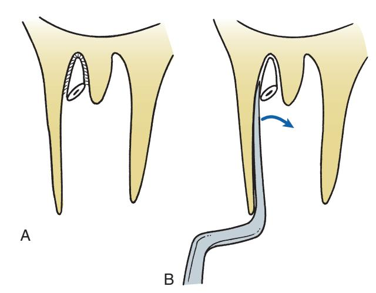
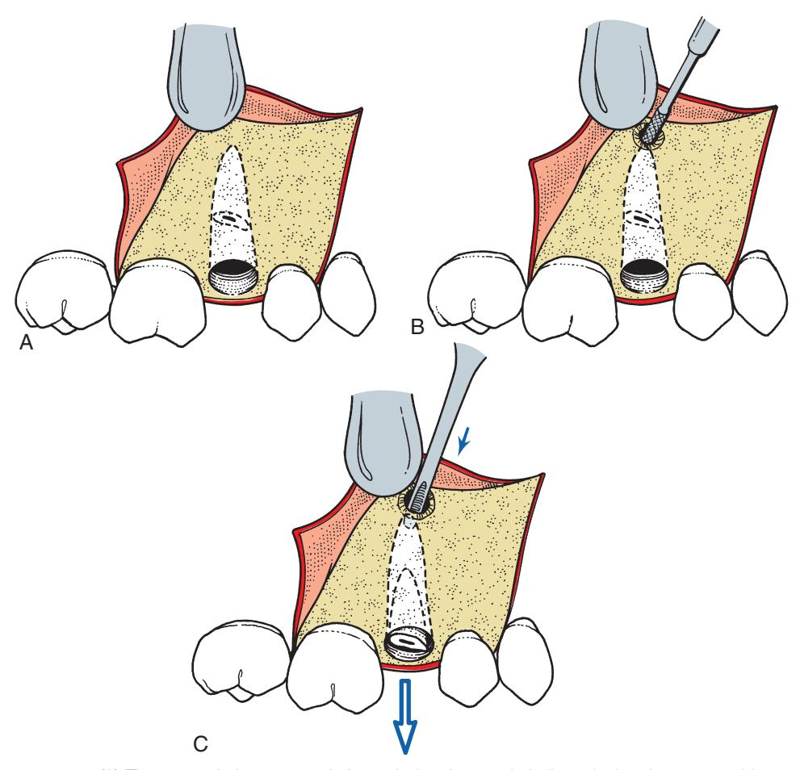
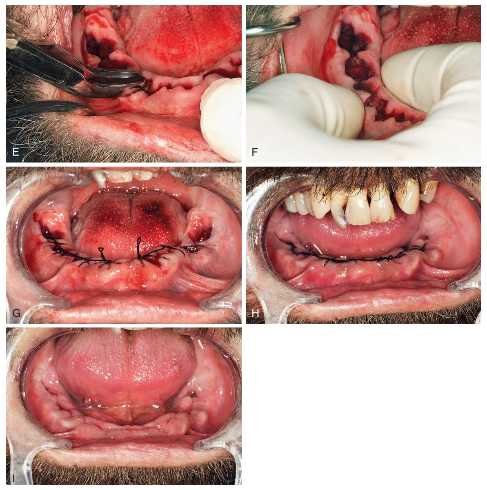

# 9 Principles of More Complex Exodontia

**JAMES R. HUPP**

## Principles of Flap Design, Development, and Management

The open or surgical extraction technique is used when greater access is necessary to safely remove a tooth or its remaining roots, or for removal of multiple teeth and bone recontouring.

A **flap** in oral surgery is a section of soft tissue that:
1.  Is outlined by a surgical incision.
2.  Carries its own blood supply.
3.  Allows surgical access to underlying tissues.
4.  Can be replaced in the original position.
5.  Is maintained with sutures.

### Design Parameters for Soft Tissue Flaps

*   **Blood Supply:** The base of the flap must usually be broader than the free margin to preserve adequate blood supply and prevent ischemic necrosis (Fig. 9.1).
*   **Adequate Size:**
    *   Provides excellent visualization and instrument access.
    *   Allows a retractor to rest on intact bone without tension.
    *   Promotes faster healing: A long, straight incision with adequate reflection heals more rapidly than a short, torn incision.
    *   **Envelope Flap:** Extends two teeth anterior and one tooth posterior to the surgery area (Fig. 9.2A).
    *   **Releasing Incision:** Flap extends one tooth anterior and one tooth posterior to the surgery area (Fig. 9.2B).
*   **Full-Thickness Mucoperiosteal Flaps:** Includes surface mucosa, submucosa, and periosteum.
    *   Necessary for bone removal or reshaping.
    *   Periosteum is primary for bone healing; its replacement hastens healing.
    *   A properly reflected flap heals better than torn tissue.
    *   The avascular plane between bone and periosteum reduces bleeding.
*   **Incision Placement:** Must be over bone that will remain intact after surgery.
    *   If a pathologic condition has eroded the buccocortical plate, the incision should be 6-8 mm from it.
    *   If bone is to be removed, the incision must be 6-8 mm away from the created bony defect.
    *   > If the incision line is unsupported by intact bone, it tends to collapse into the bony defect, which results in wound dehiscence and delayed healing (Fig. 9.3).
*   **Avoid Vital Structures:**
    *   **Mandible:**
        *   *Lingual nerve:* Avoid incisions on the lingual aspect of the posterior mandible (especially the third molar area) to prevent prolonged temporary or permanent anesthesia of the tongue.
        *   *Mental nerve:* Avoid injury during surgery near the mandibular premolar apices. Use envelope incisions; if releasing incisions are used, they should be well anterior or posterior to its exit.
    *   **Maxilla:**
        *   Facial aspect: Rarely endangers major nerves or arteries.
        *   Palatal:
            *   *Greater palatine artery:* The major blood supply, emerging from the greater palatine foramen. Avoid vertical-releasing incisions in the posterior palate to prevent pulsatile bleeding.
            *   *Nasopalatine nerves and arteries:* Exit the incisive foramen. They can be incised if anterior palatal tissue must be reflected, with a small likelihood of bothersome bleeding; the nerve typically regenerates.
*   **Releasing Incisions:**
    *   Used only when necessary; envelope incisions usually suffice.
    *   Typically a single incision at the anterior end of the envelope flap.
    *   Must be oblique, allowing the base of the flap to be broader than the free gingival margin.
    *   Avoid crossing bony prominences (e.g., canine eminence) to prevent tension and wound dehiscence.
    *   Should cross the free gingival margin at the line angle of a tooth, not directly on the facial aspect or in the papilla (Fig. 9.4).
        *   > Incisions that cross the free margin directly over the facial aspect of the tooth do not heal properly due to tension and can result in soft tissue and periodontal/aesthetic defects. Incisions through papilla damage it unnecessarily.

### Types of Mucoperiosteal Flaps

*   **Envelope Flap:**
    *   Most common type.
    *   In a dentulous area: A sulcular incision is made down to the crestal bone, through the periosteum, and a full-thickness mucoperiosteal flap is reflected apically (see Fig. 9.2A).
    *   In an edentulous area: The incision is made along the crest of the ridge scar.
*   **Three-Cornered Flap:**
    *   A sulcular incision with one vertical-releasing incision (Fig. 9.5).
    *   Provides greater access with a shorter sulcular incision.
*   **Four-Cornered Flap:**
    *   An envelope incision with two releasing incisions (Fig. 9.6).
    *   Provides substantial access but is rarely indicated; a three-cornered flap usually suffices.
*   **Semilunar Incision:**
    *   Avoids the papillae and gingival margin but provides limited access (Fig. 9.7).
    *   Most useful for limited periapical surgery.
*   **Y-Incision:**
    *   Used on the palate for surgical access, especially for palatal torus removal (Fig. 9.8).
    *   Anterolateral extensions anterior to the canine teeth avoid major branches of the greater palatine artery, reducing bleeding.

### Developing a Mucoperiosteal Flap

1.  **Incision:**
    *   Use a No. 15 blade on a No. 3 scalpel handle, held in a pen grasp (Fig. 9.9).
    *   Make one smooth, continuous stroke from posterior to anterior in the gingival sulcus, keeping the blade in contact with bone (Figs. 9.10 and 9.11).
2.  **Reflection:**
    *   Begin at a papilla using the sharp end of a No. 9 periosteal elevator (Fig. 9.12).
    *   Once the free edge is reflected, use the broad end of the elevator to reflect the mucoperiosteal flap, keeping the elevator edge on the bone and under the periosteum.
    *   For a three-cornered flap, reflection starts at the anterior papilla. The broad end is then inserted at the middle corner, and dissection proceeds with a pushing stroke posterosuperiorly (Fig. 9.13).
3.  **Retraction:**
    *   A periosteal elevator can be used as a retractor, held perpendicular to and resting on sound bone, holding the flap without tension (Fig. 9.14).
    *   For broader exposure, use a Seldin elevator, Minnesota, or Austin retractor.
    *   > The retractor should not be forced against soft tissue; position it firmly against bone.

## Principles of Suturing

### Functions of Sutures

1.  **Coapt wound margins:** Holds the flap in position to facilitate healing by primary intention.
2.  **Aid hemostasis:** Acts as a tamponade in areas of general oozing.
3.  **Hold soft tissue flap over bone:** Important for bone vitality and healing.
4.  **Maintain blood clot:** Can provide a barrier to hold the clot in the socket (e.g., figure-of-eight suture, Fig. 9.15).

### Armamentarium

*   **Needle holder:** 15 cm (6 inches), locking handle, held with the thumb and ring finger through the rings (Fig. 9.16).
*   **Suture needle:** Small 3/8 to 1/2 circle with a reverse cutting edge (e.g., PS-2, FS-2, X-1) (Fig. 9.17).

### Technique

1.  **Flap Repositioning:** For an envelope flap, place sutures through the papillae only, not across the empty socket (Fig. 9.18).
2.  **Passing the Needle:**
    *   Pass first through the mobile (usually facial) tissue, then through the attached (lingual) tissue. Two passes are recommended for precision (Fig. 9.19).
    *   The needle should enter the tissue surface at a right angle to make the smallest possible hole (Fig. 9.20A-B).
        *   > An oblique entry can tear tissue when the knot is tied (Fig. 9.20C-D).
    *   Take an adequate amount of tissue (at least 3 mm from the flap edge) to prevent pull-through.
3.  **Tying the Knot (Instrument Tie):**
    *   > Do not tie too tightly; this causes ischemia, tissue necrosis, and wound dehiscence.
    *   Position the knot to the side of the incision line, not directly over it.
    *   **Surgeon's Knot Steps (Fig. 9.21):**
        1.  Wrap the long end of the suture twice clockwise around the needle holder.
        2.  Grasp the short end with the needle holder.
        3.  Pull the ends to tighten the first double overhand knot.
        4.  Release, then wrap the long end once counterclockwise around the needle holder.
        5.  Grasp the short end again and pull firmly against the previous knot.
        6.  Most surgeons add a third throw (single clockwise wrap) for resorbable sutures.
4.  **Cutting the Suture:** Cut the ends, leaving them no longer than 1 cm.
5.  **Closing a Three-Cornered Flap:**
    *   Place the first suture at the papilla where the vertical release incision was made, as it's an identifiable landmark.
    *   Close the envelope portion first, then the vertical component (Fig. 9.22B).

### Suture Configurations

*   **Routine Interrupted Suture:** Most common; allows for individual tension adjustment.
*   **Horizontal Mattress Suture:** Useful for two adjacent papillae; compresses and everts wound edges (Fig. 9.23).
*   **Figure-of-Eight Suture:** A variation of the horizontal mattress; helps hold papillae and maintain a clot in the socket (see Fig. 9.15).
*   **Continuous Sutures:** For long incisions; quicker with fewer knots. Can be simple (locking or nonlocking) or a running horizontal mattress (Fig. 9.24).

### Suture Removal

Nonresorbable sutures are typically left in place for 5-7 days. Cut with sharp tips and pull the suture toward the incision line.

## Principles and Techniques for Open Extractions

A prudently used open or surgical extraction may be more conservative, cause less operative morbidity, and be quicker than a closed extraction when excessive force is anticipated (Fig. 9.25).

### Indications for Open Extraction

Consider an elective surgical extraction when anticipating that excessive force may result in a fracture of bone or root.

*   **Failed initial attempts** at forceps extraction ("divide and conquer" philosophy).
*   **Thick or dense bone,** especially the buccocortical plate (common in older patients).
*   **Short clinical crowns** with severe attrition, which may indicate dense bone (e.g., from bruxism) (Fig. 9.26).
*   **Difficult root morphology** seen on preoperative radiographs:
    *   **Hypercementosis:** Large, bulbous root (Fig. 9.27).
    *   **Widely divergent roots:** Especially in maxillary first molars (Fig. 9.28).
    *   **Severe dilaceration or hooks** (Fig. 9.29).
*   **Maxillary sinus pneumatization** where the sinus floor includes molar roots (Fig. 9.30).
*   **Compromised crowns:** Extensive caries, large restorations, or endodontically treated molars which may shatter under forceps pressure (Fig. 9.31).

### Technique for Open Extraction of a Single-Rooted Tooth

1.  **Reflect an Adequate Flap:** Use an envelope or three-cornered flap to expose the surgical area (see Fig. 9.2).
2.  **Assess Need for Bone Removal:**
    *   **Option 1:** Attempt to reseat forceps under direct visualization for a better mechanical advantage (Fig. 9.32).
    *   **Option 2:** Grasp a small amount of buccal bone with the forceps beak for better leverage (Fig. 9.33).
    *   **Option 3:** Use a small straight elevator in the periodontal ligament space to displace the root occlusally (Fig. 9.34).
    *   **Option 4:** Remove buccal bone with a burr and ample irrigation.
        *   Width of bone removed: same as the mesiodistal dimension of the tooth (Fig. 9.35).
        *   Vertical dimension of bone removed: one-half to two-thirds the length of the tooth root (Fig. 9.36).
        *   Remove the tooth with an elevator (Fig. 9.37) or forceps (Fig. 9.38).
    *   **If Still Difficult:** Create a purchase point (a 3 mm deep indentation) in the root with a burr. Use a heavy elevator (e.g., Crane pick) to lever the tooth from the socket (Fig. 9.40A).
3.  **Smooth Bone Edges:** Check and smooth sharp edges with a bone file (Fig. 9.40B).
4.  **Irrigate and Debride:** Thoroughly irrigate the surgical field with sterile saline.
5.  **Reposition and Suture Flap:** Reposition the flap and suture it into its original position.

### Technique for Open Extraction of Multirooted Teeth

The general technique is similar to single-rooted teeth, but multirooted teeth are often sectioned with a burr.

#### Lower Molar Extraction

*   **Intact Crown:**
    1.  Reflect an envelope flap and remove a small amount of crestal bone.
    2.  Section the tooth buccolingually into mesial and distal halves (Fig. 9.41A).
    3.  Luxate with straight elevators.
    4.  Remove each section with lower universal forceps as if they were premolars (Fig. 9.41B).
*   **Alternative Sectioning:**
    1.  Reflect a flap and remove buccal bone to expose the bifurcation.
    2.  Section the mesial root from the tooth (Fig. 9.43A).
    3.  Extract the crown with the distal root using No. 17 forceps (Fig. 9.43B).
    4.  Elevate the remaining mesial root using a Cryer elevator in the empty socket, rotating it with a wheel-and-axle motion (Fig. 9.43C).
*   **Missing Crown:**
    1.  Reflect a flap and remove crestal bone.
    2.  Section the roots into mesial and distal components (Fig. 9.44A).
    3.  Use a Cryer elevator in the slot prepared by the burr to deliver one root (Fig. 9.44B).
    4.  Insert the opposite Cryer elevator into the empty socket and rotate it through the interradicular bone to deliver the remaining root (Fig. 9.44C).

#### Maxillary Molar Extraction

*   **Intact Crown (Divergent Roots):**
    1.  Reflect an envelope flap and remove crestal bone to expose the trifurcation.
    2.  Section off the mesiobuccal and distobuccal roots (Fig. 9.45A).
    3.  Deliver the crown and palatal root with upper molar forceps using bucco-occlusal pressure (Fig. 9.45B).
    4.  Luxate and deliver the buccal roots with a straight or Cryer elevator (Fig. 9.45C-D).
*   **Missing or Fractured Crown:**
    1.  Reflect a flap and remove buccal bone to expose the roots for sectioning (Fig. 9.46A).
    2.  Section the roots into two buccal roots and one palatal root.
    3.  Luxate the roots with a straight elevator and deliver them with Cryer elevators or maxillary root forceps (Fig. 9.46B-D).
    4.  Deliver the palatal root last, often with a small straight elevator directed down the palatal periodontal ligament space (Fig. 9.46E).

## Removal of Root Fragments and Tips

If the apical one-third (3 to 4 mm) of a root fractures during closed extraction: first attempt a closed retrieval. If not immediately successful, begin a surgical (open) technique without delay.
*   **Critical Requirements for Extraction**:
    1.  Excellent light.
    2.  Excellent suction (preferably small-diameter tip).
    3.  Irrigation syringe.

### Root Tip Retrieval

#### Closed Technique

*   **Definition:** Any technique not requiring reflection of soft tissue flaps and removal of bone.
*   **Protocol:**
    1.  Vigorously irrigate and suction the socket with a small tip.
    2.  Use a **root tip pick** for small fragments (2-4 mm). Insert it into the periodontal ligament space and gently tease the root out.
        *   > **Warning:** Excessive apical force can displace the root tip into the maxillary sinus. Excessive lateral force can fracture the instrument tip.
        *   
        *   • Fig. 9.47 (A) When a small (2 to 4 mm) portion of the root apex is fractured from the tooth, the root tip pick can be used to retrieve it. (B) The root tip pick is teased into the periodontal ligament space and is used to gently luxate the root tip from its socket.
    3.  Use a **small straight elevator** for larger fragments. Wedge it into the periodontal ligament space to deliver the fragment occlusally.
        *   > **Warning:** Excessive apical pressure may force the root into underlying tissues or the maxillary sinus.
        *   
        *   
        *   • Fig. 9.48 (A) When a larger portion of the tooth root is left behind after extraction of the tooth, the small straight elevator can sometimes be used as a wedge to displace the tooth in the occlusal direction. It must be remembered that the pressure applied in such a fashion should be in gentle to-and-fro motions; excessive pressure should not be applied. (B) Excessive pressure in the apical direction results in displacement of the tooth root into undesirable places such as the maxillary sinus.
*   > **Clinical Concept:** A smooth, efficient, properly performed open retrieval is less traumatic than a prolonged, frustrating attempt at closed retrieval.

#### Open Techniques for Root Tip Removal

1.  **Standard Surgical Removal Extension:**
    *   Reflect a soft tissue flap.
    *   Remove bone with a burr to expose the buccal surface of the root.
    *   Deliver the root buccally with a small straight elevator.
    *   Irrigate, reposition, and suture the flap.
    *   • Fig. 9.49 (A) If the root cannot be retrieved by closed techniques, the soft tissue flap is reflected, and bone overlying the root is removed with a burr. (B) The small straight elevator is then used to luxate the root buccally by wedging the straight elevator into the palatal periodontal ligament space.
2.  **Open-Window Technique:** (Used to preserve buccocrestal bone).
    *   Reflect a three-cornered flap to expose the apical area.
    *   Use a burr to remove bone overlying the apex, creating a "window."
    *   Insert a root tip pick or small elevator into the window and guide the root out of the socket.
    *   
    *   • Fig. 9.50 (A) The open-window approach for retrieving the root is indicated when buccocrestal bone must be maintained. The three-cornered flap is reflected to expose the area overlying the apex of the root fragment being recovered. (B) A burr is used to uncover the apex of the root and to allow sufficient access for the insertion of the straight elevator. (C) The small straight elevator is then used to displace the tooth out of the tooth socket.

### Justification for Leaving Root Fragments

> **Evidence-based Concept:** The surgeon must balance the benefits of surgery against the risks. In some situations, removing a small root tip may carry greater risks than benefits.

**Conditions for Leaving a Root Fragment:**
1.  **Size:** Small, no more than 4 to 5 mm in length.
2.  **Location:** Deeply embedded in bone, not superficial.
3.  **Health Status:** Not infected, and no radiolucency around the root apex.

**Situations Where Risk of Surgery Outweighs Benefit:**
1.  Removal requires **excessive tissue destruction**.
2.  Removal would **endanger important structures** (e.g., inferior alveolar nerve).
3.  There is a **high risk of displacing the root tip** into tissue spaces (e.g., submandibular space) or the maxillary sinus.

**Protocol if Electing to Leave a Root Tip:**
1.  Inform the patient and obtain consent.
2.  Obtain and retain radiographic documentation.
3.  Record the decision and patient notification in the chart.
4.  Schedule periodic follow-up visits.
5.  Instruct the patient to contact the surgeon immediately if problems develop.

## Multiple Extractions

The goal is to facilitate a smooth transition to an edentulous state and proper prosthetic rehabilitation.

### Treatment Planning

Pre-extraction planning with the restorative dentist is essential and should include:
*   Need for interim or immediate dentures.
*   Need for soft tissue surgery (e.g., tuberosity reduction, removal of undercuts).
*   Consideration to limit bone trimming if dental implants are planned.
*   Preparation of a surgical guide stent for immediate implant placement.

### Extraction Sequencing

*   **General Rules:**
    1.  **Maxillary teeth are usually removed first:** Anesthetic has a rapid onset, and this prevents debris from falling into empty lower sockets.
    2.  **Extract posterior teeth first:** Allows more effective use of elevators.
    3.  **Extract the canine last:** Removal of adjacent teeth weakens the bony socket, simplifying the canine extraction.

*   **Example Order (Maxillary and Mandibular Left Quadrants):**
    1.  Maxillary posterior teeth
    2.  Maxillary anterior teeth (leaving the canine)
    3.  Maxillary canine
    4.  Mandibular posterior teeth
    5.  Mandibular anterior teeth (leaving the canine)
    6.  Mandibular canine

### Technique for Multiple Extractions

1.  **Soft Tissue Incision & Reflection:**
    *   Loosen the soft tissue attachment around each tooth and reflect a small envelope flap to expose the crestal bone.
    *   
    *   • Fig. 9.51 (A-C)
2.  **Luxation:**
    *   Luxate all teeth in the quadrant with a straight elevator.
    *   
    *   • Fig. 9.51 (D)
3.  **Extraction:** Deliver teeth with forceps. If excessive force is needed, remove a small amount of buccal bone.
4.  **Alveolar Management:**
    *   Compress buccolingual plates with firm pressure (unless implants are planned).
    *   Palpate the ridge for sharp bony spicules or undercuts.
    *   Perform alveoloplasty with a bone rongeur and bone file as needed.
    *   
    *   • Fig. 9.51, cont'd (E-F)
5.  **Irrigation:** Thoroughly irrigate the area with sterile saline.
6.  **Granulation Tissue Removal:** Inspect and remove any granulation tissue to prevent postoperative hemorrhage.
7.  **Soft Tissue Reapproximation:**
    *   Trim redundant gingiva if present (common with severe periodontitis).
    *   > **Warning:** Do NOT try to achieve primary closure over extraction sockets if tissue is not redundant, as this reduces vestibular height.
8.  **Suturing:** Suture the papillae into position with interrupted or continuous sutures. This leaves the tooth socket open.
    *   
    *   • Fig. 9.51, cont'd (G-I)
9.  **Suture Removal:** Plan for removal in about one week if nonresorbable sutures are used.